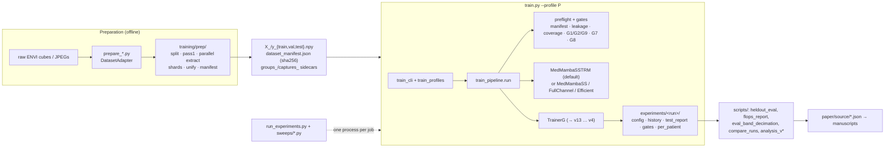
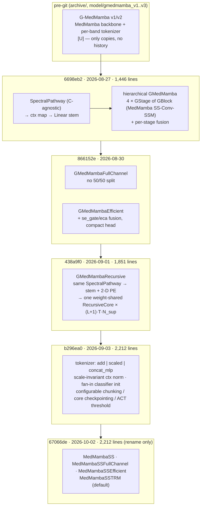
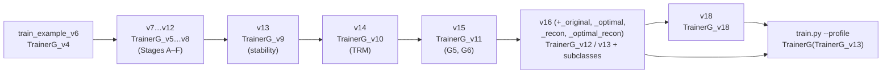

# Project History and Technical Evolution

**Repository:** `g-medmamba` (MedMamba‑SS / MedMamba‑SS‑TRM, formerly G‑MedMamba / GMedMamba‑R)
**Inspected:** 2026‑10‑04, working tree at `67066de` on branch `refactor/unify-scripts`, plus one uncommitted change to `.gitignore`
**History covered:** 2026‑08‑27 (`6698eb2`, first commit) → 2026‑10‑02 (`67066de`). 102 commits, linear, no merges. Material older than the first commit is covered only where the first commit preserves it.

### Evidence markers

Every substantive claim carries one of these markers:

| marker | meaning |
|---|---|
| **[V]** | **Verified during this investigation.** Read directly from a git object, diff or commit, or from a run artefact or data file (`config.json`, `test_report.json`, `history.json`, `dataset_manifest.json`, a `findings/` or `paper/source/` JSON/CSV). |
| **[R]** | **Reported by the project.** Stated in a commit message, plan, docstring or project document, and not re-measured here. Most performance timings fall here, because this investigation had no GPU. |
| **[I]** | **Inferred** by this document from the available evidence. Treat it as interpretation, not fact. |
| **[U]** | **Not verifiable from available project evidence.** |

Commit hashes are abbreviated to 7 characters. Files are named as they were **at the time being described**, so a milestone may cite a path that has since been renamed, archived or deleted (for example `training/gates_v16.py`, now `training/gates.py`). M17–M20 and `training/__init__.py:RENAMED_MODULES` map old names to current ones. Dates are commit dates in the author's local timezone (−04:00). Run directories are cited by their timestamp prefix (e.g. `20260906_222725`), and all of them live under `experiments/`, which git ignores.

This document is a **history**. For the architecture at layer level, the TRM mapping and the hyperparameter tables, see [doc/PROJECT_ARCHITECTURE_AND_HISTORY.md](doc/PROJECT_ARCHITECTURE_AND_HISTORY.md). That document was written on 2026‑09‑13 and is still accurate on mechanism, but parts of it are now stale. §18.3 lists the corrections.

---

## 1. Executive Summary

**Purpose.** The project builds a medical-image classifier that is independent of the sensor's channel count. One set of model code accepts an image cube `[B, C, H, W]` for any `C`. The model has no parameter whose shape depends on `C`, so it reads 3‑band RGB and 32‑band hyperspectral (HSI) data with the same parameter count. Its main use is HSI-versus-RGB breast-histology classification on HistologyHSI‑BC‑Recurrence. A secondary benchmark is skin-lesion classification on PAD‑UFES‑20 **[V]** (`medmamba_ss_trm.py` header; run configs). The work is a master's thesis. Its outputs are a manuscript lineage (v4 → v18) and a CVC 2027 submission build **[V]** (`paper/`).

**Current technical state (2026‑10‑02).**

* The model file is [medmamba_ss_trm.py](medmamba_ss_trm.py) (2,212 lines). It holds two backbones that share one config dataclass:
  * **MedMamba‑SS** (`MedMambaSS`): hierarchical, derived from MedMamba.
  * **MedMamba‑SS‑TRM** (`MedMambaSSTRM`): recursive, derived from Tiny Recursive Models (TRM).

  **[V]**
* One training entry point, [train.py](train.py), with five named `--profile`s. One sweep runner, [run_experiments.py](run_experiments.py), with three sweep files. One prep script per dataset. **[V]**
* The repository keeps every audited older entry point under `archive/` and pins them byte-for-byte in a 43‑entry frozen list (`tests/test_frozen_files_untouched.py:FROZEN_GLOBS`) **[V]**. Two parity tests then show that the new code reproduces the old code **[V]** (`logs/smoke/parity-compare.log`: `IDENTICAL`).
* The full CPU test suite is reported at **900 passed** at `67066de` **[R]**. It was not re-run here.

**Main development milestones** (detail in §4):

1. **2026‑08‑27.** First commit. The v3 spectral–spatial architecture (17 "phases") and a reconstruction/SAM/GAN trainer chain were already written.
2. **2026‑08‑30.** Correctness and stability, in one burst:
   * macro‑F1 checkpoint selection;
   * gradient health checks;
   * a pluggable loss;
   * full-width and lightweight backbone variants;
   * a NaN/SIGBUS/dataset-integrity controller;
   * a crash-safe, dataset-agnostic prep core.
3. **2026‑09‑01.** The TRM-style recursive variant arrives, along with a 214× wall-clock fix to its defaults.
4. **2026‑09‑03.** **v15.** The *representation-collapse* diagnosis: the tokenizer's input signal was 86–93× smaller than a constant positional encoding, so both runs began as constant functions.
5. **2026‑09‑05.** **v16.**
   * An acquisition fault (one patient at ~50 % exposure) is fixed.
   * A reconstruction pathway that had never trained is fixed.
   * A step-axis learning-rate schedule replaces the epoch-axis one.
   * The **file-freezing discipline** becomes a test.
6. **2026‑09‑13.** **v17.** Throughput and observability work. `torch.compile` becomes the default, the trainer syncs with the host once per step instead of 292 times, and runs report progress and ETA.
7. **2026‑09‑15 to 09‑20.** **v18.** The missing-experiments campaign. It overturned the headline:
   * the HSI−RGB margin fell from +15.02 to **+4.12 ± 1.66** balanced-accuracy points at five seeds;
   * recursion depth turned out **flat**;
   * zero-shot band removal **collapses**;
   * the hierarchical backbone **fails to train** under the recipe.
8. **2026‑09‑23 to 10‑02.** Consolidation:
   * one prep script per dataset;
   * `train.py --profile` replaces six entry points, with GPU parity;
   * dead code is archived and then deleted;
   * version suffixes are dropped;
   * the codebase is renamed from GMedMamba to MedMamba‑SS / MedMamba‑SS‑TRM.

**Most significant engineering changes.**

* The removal of `C` from every parameter shape. This was already present at the first commit.
* The v15 tokenizer fix, which the existing documentation calls *the most consequential defect found*.
* The v16 freezing rule plus the gate suite (G1–G9), which kept old runs reproducible while the code underneath changed.
* The v17 throughput work, with measured speedups.
* The 2026‑09‑29 entry-point unification, proven by parity.

**Overall evolution.** Each step was driven by a written plan (`plan/*.plan.md`), and most plans were written *after reading a finished run's artefacts*. The development pattern is consistent throughout:

1. A run completes and reports plausible numbers.
2. An audit finds that a check could fail silently, or that the numbers meant something other than they appeared to.
3. A new versioned file fixes the defect without editing the audited one.

This pattern produced extensive duplication: 13 trainer generations and up to 8 prep-script versions. The last ten days were spent removing that duplication under parity tests.

---

## 2. Project Overview

### 2.1 Original objectives (as recoverable)

The earliest plans in the first commit set out the founding requirements: `plan/improve-prompt.plan.md` ("Design Principles: 1. No hardcoded spectral dimension; 2. Spectral dimension is first-class information; 3. Separate spectral modeling from spatial modeling") and `plan/improve-prompt_v2.plan.md` / `plan/improve-prompt_v3.plan.md` (the "G‑MedMamba v2/v3" roadmaps) **[V]**. `plan/MedMamba_Main_Development_Plan.md` (version 2.0) adds a goal to "produce scientifically valid reconstruction metrics", and the v16 plan later cites it **[V]**.

### 2.2 Current objectives

The manuscript lineage frames the work as research questions:

| RQ | Question |
|---|---|
| RQ0 | Does HSI beat RGB under matched conditions? |
| RQ1 | Is the model band-count agnostic? |
| RQ2 | Does the recursion buy anything for its cost? |

The questions are named in `documentations/15_v18_commands.md` §10 and in the commit messages from 2026‑09‑19 onward **[V]**. After 2026‑09‑26 the open objective is the evidence upgrade in [FUTURE_EXPERIMENTS.md](FUTURE_EXPERIMENTS.md): patient-level cross-validation, training-only band selection, and a second HSI dataset (HMI‑LUSC) **[V]**.

### 2.3 Core technologies

* Python 3.11 **[V]** (`mamba-spec.txt`: `cpython-3.11.15`).
* PyTorch 2.11.0+cu128 on an RTX 5060 Ti (sm_120) **[V]** (`requirements.txt`; `plan/v17_baseline.md`).
* A **pure-PyTorch selective scan.** No `mamba_ssm` CUDA kernel is used; the `cuda`/`triton` backends are registered but raise `NotImplementedError` **[V]** (`medmamba_ss_trm.py:81`, backend registry).
* NumPy `.npy` memory-mapped datasets, `spectral` for ENVI cubes, scikit‑learn for metrics and probes, matplotlib for figures **[V]** (`requirements.txt`).
* LaTeX through Tectonic, used for the manuscripts **[V]** (`.vscode/settings.json` comments).

### 2.4 Main subsystems (current)

| subsystem | location |
|---|---|
| Model | `medmamba_ss_trm.py`; `medmamba_ss_fullchannel.py`, `medmamba_ss_efficient.py` (hierarchical variants); `medmamba_ss_trm_ema.py` (TRM `EMAHelper` port) |
| Data preparation | `prepare_histologyhsi_bc.py`, `prepare_histologyhsi_bc_trainsel.py`, `prepare_pad_ufes_20.py` (+ `_optimal`, `_original`), `prepare_hmi_lusc_v20.py`; the generic core in `training/prep/` (8 files) |
| Data loading | `training/npy_data.py`, `training/normalization.py`, `training/augmentation*.py`, `training/dataloader_config*.py`, `training/npy_integrity.py` |
| Training | `train.py` → `training/train_cli.py` / `train_profiles.py` / `train_pipeline.py` / `train_banner.py` / `train_preflight.py` → `training/trainerg.py:TrainerG`, which subclasses `TrainerG_v13` → … → `TrainerG_v4` |
| Validity gates | `training/gates.py`, `training/numerical_stability.py`, `training/fused_stability_checks.py`, `training/class_coverage.py` |
| Evaluation and analysis | `scripts/` (26 files): held-out evaluation, FLOPs, latent space, band decimation, baselines, paper tables and figures |
| Orchestration | `run_experiments.py`, `sweeps/{smoke,paper_runs,paper_evidence_upgrade}.py` |
| Tests | `tests/` (49 files, 459 `test_` functions **[V]**; parametrisation expands them to the reported 900 **[R]**) |
| Documentation | `documentations/01–17`, `doc/`, `plan/`, `findings/`, `paper/` |

### 2.5 High-level architecture (current)

---

## 3. Initial Project State

### 3.1 History before the first commit

The repository's first commit (`6698eb2`, 2026‑08‑27, "first commit version 6 oif model") is **not** the start of the project. It already contains the following **[V]**:

* **An `archive/` of 48 earlier files.** These include `train_example-gemini*.py` (five variants), `training/trainer_v1-old 2026-08-03.py`, `trainerg_v1/v2/v2P/v3.py`, `test_run_medmamba v1–v3.py`, `medmamba_pytorch.py`, `model_medmamba.py`, and `prepare_histologyhsi_bc_v1/v2.py` and `prepare_pad_ufes_20_v1–v3.py`. The `-gemini` names and the `2026-08-03` filename date show earlier development, partly with another AI assistant **[I]**.
* **A complete duplicate snapshot `gmedmambav6.5/`** of the model, trainers and `training/` package. It was deleted in `866152e`.
* **`model/gmedmamba_v1.py`, `_v2.py`, `_v3.py`**, three full earlier copies of the model. They were archived in `4b90e0e` and deleted in `941a2ca`.
* **15 plan files** (`improve-prompt*.plan.md`, `train-improve-prompt*.plan.md`, `GMedMamba V7 Stabilization & Evaluation Master.plan.md`, …).
* **`CHANGELOG_phase0_implementation.md`.** It records one pre-git root-cause fix: `TrainerG_v4` computed validation loss as `CE + λ_mse·MSE` but training loss as `CE + λ_mse·MSE + λ_sam·SAM + λ_gan·GAN`, so train and validation optimised different objectives whenever SAM or GAN was on **[V]** (file content in `6698eb2`).

Commit `d855557` (same day) adds three run directories dated **2026‑08‑05/06**, before git existed **[V]**. Their configs show the pre-git baseline:

| run | data | normalization | λ_mse / λ_sam | outcome |
|---|---|---|---|---|
| `gmedmamba_run_20260806_193802 - hsi` | `./data_hsi_v5/hsi/`, 64 channels, 3 classes | `per_sample_minmax` | 1.0 / 0.1 | best **val accuracy 0.6391** at epoch 14 of 20 |
| `gmedmamba_run_20260806_235958 - rgb` | `./data_hsi_v5/rgb/` | `per_sample_minmax` | 1.0 / 0.1 | best **val accuracy 0.7949** at epoch 9 of 10 |

Both were selected on raw validation accuracy, and neither had a held-out test evaluation **[V]**. They were deleted in `08306cb` and `ecf1ded`. Everything earlier is **[U]**.

### 3.2 Initial structure (`6698eb2`)

| component | state |
|---|---|
| `gmedmamba.py` | **1,446 lines.** "G‑MedMamba v3". A 17-phase header maps each plan phase to a class: `SpectralTokenizer`, `HierarchicalSpectralEncoder`, `SpectralMamba`, `BandGate`/`StageBandSelector`, generalized `SS2D` with a scan-direction registry, `MultiScaleSS2D`, five fusion strategies, `ProgressiveCompressor`, wavelength-keyed positional encoding, `GMedMambaConfig.validate()`, and a scan-backend registry. The only backbone is hierarchical (`GMedMamba`, `GMedMambaBackbone`) **[V]**. |
| Trainers | `training/trainerg_v3.py` (reconstruction + SAM) and `trainerg_v4.py` (λ-weighted CE+MSE+SAM+GAN objective, full spectral metrics, run layout) **[V]** |
| Entry point | `train_example_v6.py`: `NpyDataset` with two normalizations (`per_sample_minmax`, `global_zscore`) and flip augmentation **[V]** |
| Prep | `prepare_histologyhsi_bc_v3.py` and its shim `_v4.py` **[V]** |
| `training/` | 28 modules: metrics, plots, evaluator, latent space, GAN, DDP, logger, LR finder, pipeline-consistency audit, dataset audit, and others **[V]** |
| Environment | `config/environment.yml`: Python 3.10–3.11, `pytorch-cuda=12.1`, with the optional `mamba-ssm` and `causal-conv1d` CUDA backends commented out **[V]** |

### 3.3 Initial limitations, as later diagnosed

The table pairs each defect present at or near the first commit with the change that addressed it:

| defect | found / fixed in | marker |
|---|---|---|
| Best checkpoint chosen on raw accuracy, so a majority-class predictor wins | Stage A, `TrainerG_v5` (`866152e`) | [V] code; [R] diagnosis |
| A single NaN batch aborted the whole run | `TrainerG_v5` (`866152e`) | [R] |
| Reconstruction wrappers decoded from the *raw input*, so the auxiliary loss never reached the encoder | Stage A latent wrapper (`866152e`), then again in v16 R‑2 | [R] |
| Tokenizer signal 86–93× below a constant PE (constant-function models) | v15 (`b296ea0`) | [R] measurement; [V] new config fields |
| Weight decay applied to every tensor, including the one weight the v15 fix needs to grow | v15 R1.2, `training/optim_groups.py` | [V] |
| `scan_backend="pure_pytorch"` is the only working backend; this cost dominates every wall-clock figure | still open | [V] code; [R] cost |

---

## 4. Chronological Development Timeline

Related commits are grouped into milestones, and each commit is listed individually in §16. The period from 2026‑08‑27 to 09‑04 is reconstructed mostly from diffs, plans and docstrings, because commit messages in that period are one-liners such as "claude changes v1".

### Milestone M0 — First commit and pre-git runs (2026‑08‑27)

* **Date / Commit:** `6698eb2`, `d855557`.
* **Affected components:** entire tree.
* **Previous state:** **[U]**, apart from the archived files described in §3.1.
* **Modification:** import of the "version 6" working tree, together with two duplicate model snapshots and 48 archived predecessors.
* **Technical explanation:** see §3.2.
* **Evidence:** `git show --name-only 6698eb2` lists 201 files **[V]**.

### Milestone M1 — Stage A–F improvement plan; memory problems (2026‑08‑30)

* **Date / Commit:** `866152e`. The message reads "some improvements for model optimization but is having problems with memory".
* **Affected components:** `train_example_v7…v12.py`; `training/trainerg_v5…v8.py`; new `gmedmamba_fullchannel.py` and `gmedmamba_efficient.py`; 25 new `training/` modules (`losses`, `samplers`, `augmentation`, `reconstruction_head`, `gradient_health`, `class_coverage`, `class_imbalance`, `flops_counter`, `capacity_search`, …). The duplicate `gmedmambav6.5/` tree and the `archive/` of 48 files were deleted **[V]**.
* **Previous state:** `TrainerG_v4` and `train_example_v6`.
* **Modification:** one entry point per plan stage, each a copy of the previous one with additions **[V]** (docstrings of `train_example_v7…v12` recovered from `866152e`):

  | stage | entry point | additions |
  |---|---|---|
  | A "Correctness" | v7 | class-coverage fail-fast; macro‑F1 checkpointing; per-class collapse monitoring; gradient-health counters and INVALID epochs; LeakyReLU; latent-based reconstruction |
  | B "Classification" | v8 | `--loss {ce,weighted_ce,focal,focal_weighted}`; `--sampler {none,balanced,moderate_oversample}`; `class_imbalance_report.json` |
  | C "Architecture" | v9 | `--architecture {split,fullchannel}`. `fullchannel` removes MedMamba's 50/50 channel split between the SS2D and conv branches |
  | D "Efficiency" | v10 | `--architecture efficient` (full-channel + `se_gate`/`eca` fusion + `CompactClassificationHead`) |
  | E "Generalization" | v11 | `--augment_preset {none,light,medium}`, spectral dropout |
  | F | v12 | `--weight_decay` (until then hard-coded at 0.05), `--drop_path_rate`, `--classifier_dropout`, `--early_stop_patience` (via `TrainerG_v7`). The v12 docstring still reads "train_example_v11.py", a stale copy **[V]**. |

  The trainer chain gained `TrainerG_v5` (selection on macro‑F1, invalid epochs), `v6` (pluggable loss), `v7` (patience early stopping) and `v8` (κ, MCC) **[V]** (docstrings).
* **Logical motivation:** `plan/GMedMamba_Improvement_Plan_Current_Scope.md` (1,615 lines). Its "Phase 10" diagnosis cites a run at 36.73 % accuracy and 21.01 % balanced accuracy with 3 of 6 classes at zero recall **[R]** (`plan/IMPLEMENTATION_STATUS.md`).
* **Problem addressed — memory:** `plan/GMedMamba_v7_VRAM_OOM_Remediation_Plan.md`, added in the same commit, records a CUDA OOM: 11.47 GiB allocated on a 15.51 GiB card, `architecture=efficient`, `modality=hsi`, `patch_size=1` **[V]** (plan text). `plan/GMedMamba v12 — Definitive Training Stability & SIGBUS Remediation.plan.md` records non-finite-gradient skip storms, `/dev/shm` exhaustion and mmap SIGBUS under the `train_example_v12` defaults (8 workers, `prefetch_factor=4`, persistent workers, pinned memory) **[V]**.
* **Resulting behaviour:** a model can no longer win checkpoint selection by predicting the majority class, and a NaN batch no longer kills a run **[R]**.
* **Trade-offs:** six near-copies of one entry point. This begins the duplication pattern that was not unwound until 2026‑09‑29.

### Milestone M2 — v12/v13 stability and dataset-integrity remediation (2026‑08‑30)

* **Date / Commit:** `98506cc` ("claude changes v1") and `251535a` ("claud changes v2").
* **Affected components:**
  * New: `training/trainerg_v9.py`, `numerical_stability.py`, `npy_integrity.py`, `npy_atomic.py`, `dataloader_config.py`, `system_memory.py`, `failure_taxonomy.py`, `train_example_v13.py`.
  * Modified: `training/gan.py` (SAM loss).
  * Five new root-level tests **[V]**.
* **Previous state:** corruption in a dataset file surfaced either as a SIGBUS in a DataLoader worker or as a warning followed by continued training.
* **Triggering evidence:** an array expected at `(743200, 11, 11, 3)` = 269,781,600 elements had only 52,887,520 readable elements (19.6 %). This happened at `num_workers=0`, so `/dev/shm` was not the cause. The plan also identifies a control-flow bug: the integrity check *detected* the truncated file, printed "continuing", and a later validator reported every file as passing **[V]** (v13 plan, §1–§2).
* **Modification:**
  * Every `.npy` is validated (header, size, dtype, shape, sampled reads, X/y length) **before** any mmap or worker exists. A failure raises a typed `DatasetStorageError`.
  * Explicit `--loader_mode {safe,balanced,performance}` and `--amp {off,bf16,fp16,auto}`.
  * Parameter-level gradient inspection.
  * Per-loss-component finiteness checks before backward.
  * A post-step parameter finiteness check.
  * A `NumericalStabilityController` that aborts a run on persistent instability.
  * A stabilised SAM loss whose `acos` boundary clamp no longer produces ~7,000× gradients near ±1 **[R]** (`training/gan.py` docstring).
* **Verification:** "29/29 new tests pass" **[R]** (`plan/IMPLEMENTATION_SUMMARY.md`). The same summary records a pre-existing `KeyError: 'val_mse_loss'` that crashed every completed epoch under `TrainerG_v5–v8`. It was fixed in `trainerg_v5.py`. A second missing-key bug (`parameter_norm`/`update_norm`) was deliberately left unfixed **[R]**.

### Milestone M3 — Dataset-agnostic preparation core (2026‑08‑30 → 09‑02)

* **Date / Commit:** `851702a`, `d14a3a3`, `4712d96`, `f49b954` (and `09e5bd2`).
* **Affected components:**
  * New `training/prep/` (`adapter`, `core`, `dryrun`, `manifest`, `parallel`, `shard_writer`, `splits`).
  * `training/dataset_prep_common.py` and `dataset_prep_unify.py`.
  * `prepare_histologyhsi_bc_v6.py` → `v7.py`; `prepare_pad_ufes_20_v5.py` → `v6.py`.
  * First `requirements.txt` (`4712d96`); `documentations/01–06` (`d14a3a3`, `4712d96`) **[V]**.
* **Modification:** preparation became a pipeline shared by both datasets: discover → split → class-coverage gate → Pass 1 statistics → parallel per-item extraction into worker-written shards → crash-safe unify → manifest with sha256. A concrete dataset is a `DatasetAdapter` subclass. All writes are atomic (`tmp → fsync → os.replace`), and preparation can resume per capture **[V]** (module layout; `documentations/06_dataset_prep_core.md`).
* **Logical motivation:** the v13 truncated-file incident (M2). A prep that dies mid-write must not leave an array that looks complete **[I]**.
* **Consequence:** in v16, `training/prep/` was frozen as a whole (`FROZEN_DIR_PREFIXES = ["training/prep/"]`) **[V]**. Every later prep change therefore had to happen in adapters or by rebinding at runtime.

### Milestone M4 — TRM recursive variant and its 214× default fix (2026‑09‑01 → 09‑02)

* **Date / Commit:** `438a9f0` ("addition of tiny network") and `f3c84a6` ("updated training script to have better default config…").
* **Affected components:**
  * `gmedmamba.py` grew from 1,446 to **1,851 lines** **[V]**.
  * New: `gmedmamba_ema.py`, `training/trainerg_v10.py`, `train_example_v14.py`, `test_trm_integration.py`, `training/run_naming.py`, `findings/finds_20260901_140148.md`. `paper/` was added with manuscripts v4 and v5 **[V]**.
* **Modification — model:**
  * Eleven `trm_*` config fields and a `recursive` switch were added.
  * The `RecursiveCore` uses one weight-shared block stack `f`. It updates the latent `z ← f(z + y + x)` `trm_n_latent` times, then the answer `y ← f(y + z)`. The first `n_improve − 1` improvement steps run under `no_grad`, and the state is detached between deep-supervision segments.
  * Also new: `RecursiveHead` with a zero-weight / −5‑bias halting head, `sinusoidal_2d_encoding`, parameter-free RMS norm, and three spatial mixers (`ss2d`, `mlp`, `attention`).

  **[V]** (`git show 438a9f0 -- gmedmamba.py`). `gmedmamba_ema.py` ports TRM's `EMAHelper` **[R]** (its own docstring).
* **Modification — trainer:** `TrainerG_v10` runs **all deep-supervision segments inside one forward pass and one backward pass, with the losses averaged**. TRM instead runs one segment per optimizer step and carries state across batches. The stated reason is to keep every per-batch stability mechanism applicable **[R]** (`trainerg_v10.py` docstring).
* **Logical motivation:** cut the parameter count. The hierarchical variant has ~27 M parameters at RGB width **[R]**, and the recursive variant has ~0.44 M **[V]** (run configs: 442,215 at HSI and 442,602 at PAD before v15).
* **Problem found the same day:** a bare `--architecture recursive` run on `data/pad_v6` (740,800 RGB patches of 11×11) projected **≈ 92 h per epoch**. The dominant cause was the `ss2d` mixer running the Python-loop scan 168 times per step **[R]** (`findings/finds_20260901_140148.md`).
* **Resulting behaviour:** `f3c84a6` changed five `train_example_v14.py` defaults **[V]** (diff):

  | default | before | after |
  |---|---|---|
  | `trm_mixer` | `ss2d` | `mlp` |
  | `amp` | `off` | `bf16` |
  | `batch_size` | 128 | 256 |
  | `trm_deep_supervision_steps` | 4 | 3 |
  | `loader_mode` | `safe` | `balanced` |

  The verification run measured **25.7 min per epoch (214×)** **[R]** (findings §6), but it collapsed to a single class after epoch 1 **[R]**.
* **Trade-off:** no reported recursive run ever used the `ss2d` mixer, so the recursive core in every result is a depthwise-conv/MLP mixer and not a Mamba scan **[V]** (every recursive run name contains `_mlp_`). The spectral front end still uses the Mamba scan.

### Milestone M5 — v15: representation-collapse remediation (2026‑09‑03 → 09‑04)

* **Date / Commit:** `b296ea0` ("gmedmamba v15 plan implementation") and `81a9221` (`class_weight_power`, `torch_compile.py`).
* **Triggering evidence:** two completed recursive runs, `20260901_195001` (PAD RGB, 33 epochs, 17.5 h) and `20260902_111050` (HSI, 6 epochs, 2.2 h), on which a 38-finding audit was run **[V]** (plan header; both run directories exist).
* **Root cause:**
  * **Scale.** `SpectralTokenizer` built each band token as `value_embed(v) + PE`. `value_embed` is a shared `Linear(1, d)` initialised at std 0.02, so its output is ≈0.006, while the PE is ≈0.55 and identical for every sample. After band-averaging and LayerNorm, the embedding varied with the input by **0.18 % (HSI) / 0.29 % (RGB)**. The HSI run predicted `DCIS` for all 334,516 validation patches **[R]** (v15 plan §0).
  * **Rank.** Because `Linear(1, d)` has zero bias, every band token is a scalar multiple of one fixed direction **[R]** (model docstring; follows from the definition **[I]**).
* **Modification:** `gmedmamba.py` was edited in place (1,851 → **2,212 lines** **[V]**). The plan's rule C‑3 allowed this *only behind config fields whose defaults reproduce the old behaviour* **[V]**. The new fields **[V]** (diff):
  * `spectral_token_fusion ∈ {add, scaled, concat_mlp}`
  * `spectral_pe_gain`
  * `spectral_value_init_std`
  * `wavelength_encoding_scale`
  * `spectral_ctx_norm`, with a new scale-invariant RMS norm
  * `classifier_init`
  * `spectral_chunk_size`
  * `trm_halt_threshold`
  * `trm_checkpoint_core`
  * `trm_mixer_channel_mlp`
  * `trm_drop_path`, `trm_dropout`
  * `trm_spatial_pe_gain`

  `TrainerG_v11` added reporting-integrity fixes (R5.1–R5.6), gate G5 (the saved checkpoint must reproduce the logged metric) and gate G6 (held-out test evaluation) **[R]** (docstring). `training/optim_groups.py` stopped weight decay on biases, norms, gains and `value_embed`/`fuse_*` **[V]**.
* **Resulting behaviour:** the parameter count changed from **442,215 to 446,409** (HSI, 3 classes) and from **442,602 to 446,796** (PAD, 6 classes), because `concat_mlp` adds two Linear layers **[V]** (inventory of run configs, §10.2). The first v15 HSI runs reached test macro‑F1 0.6879, then 0.8038, then 0.8535 (`20260903_010745`, `_091806`, `_180812`) **[V]**.
* **Remaining problem:** the v15 HSI family peaked at **epoch 1** and then declined. v16 traced this to the epoch-axis LR schedule (M6) **[R]**.
* **Trade-off:** a checkpoint is tied to its `spectral_token_fusion` value **[R]**. `class_weight_power = 0.75` (`81a9221`) was chosen from **test-split** probabilities, which the project itself flags as contamination **[R]** (`training/losses.py`, `scripts/tune_class_weight_power.py` docstrings).

### Milestone M6 — v16: acquisition, reconstruction and reporting remediation; the freezing rule (2026‑09‑04 → 09‑05)

* **Date / Commit:** `c46feed`. The message, "gmedmamba separated version of trm", does not describe the content. The commit adds the v16 plan, `train_example_v16.py`, `TrainerG_v12`, and 30 other files **[V]**.
* **Triggering evidence:** the v15 audit of 2026‑09‑04 found 18 defects across `20260903_180812` (`global_zscore`) and `20260904_010453` (`per_sample_minmax`), three of which invalidate published numbers **[V]** (v16 plan "Context"):
  1. **Acquisition fault.** Patient 68's IDC captures were acquired at ~50 % intensity and sit only in validation. Under `global_zscore`, the recall on those dark captures falls from 0.980 to 0.079 over 7 epochs **[R]**.
  2. **The reconstruction pathway had never trained.** Six stacked defects: reconstruction force-disabled for `recursive`, a detached feature map, a second independent recursion at validation, and a sigmoid output on z-scored targets that floors MSE near 1.0 **[R]**.
  3. **Neither audited run was reportable.**
* **Modification:**
  * **Normalization:** `training/normalization.py` adds a third mode, `per_patch_zscore`, and exact inverses for all three modes.
  * **Gates:** `training/gates_v16.py` adds G7 (reconstruction gradient must reach `backbone.core`) and G8 (post-normalization split drift).
  * **Reconstruction:** `training/recursive_features.py` returns the live state, `training/reconstruction_head_v2.py` picks a linear or sigmoid output from the normalization and raises on a mismatch, and `training/spectral_recon_metrics_v2.py` computes metrics in reflectance units.
  * **Prep:** `prepare_histologyhsi_bc_v8.py` adds per-capture gain correction, clipped to [0.5, 2.0], which logs suspect acquisitions.
  * **Schedule:** warmup plus cosine **stepped per optimizer step**.
  * **Evaluation:** per-patient and per-capture validation breakdowns, `stratified_group` validation subsampling, and `scripts/derive_patch_groups.py`.

  **[V]** (file list; `git log -S per_patch_zscore`, `-S capture_gain`, `-S stratified_group` all first hit `c46feed`).
* **The freezing rule:** "No file that `train_example_v15.py` or `TrainerG_v11` imports may be edited at all — not even additively" **[V]** (v16 plan). It is enforced by the new `test_frozen_files_untouched.py`: 36 `FROZEN_GLOBS` plus `training/prep/` **[V]**.
* **Why the rule exists:** the whole remediation method depends on re-reading old runs, so those runs must stay rebuildable **[R]**.
* **Resulting behaviour:**
  * The **first trustworthy HSI run** is `20260906_222725`: test balanced accuracy 0.9073, macro‑F1 0.8580, selected at epoch 9 of 12 rather than epoch 1 **[V]**.
  * Its matched RGB twin, `20260907_025027`, reached 0.7571 / 0.7282 **[V]**. This pair became manuscript RQ0's "+15 points".
  * The epoch-1 peak disappeared **[R]**. The project attributes the fix to the step-axis schedule, since the run differs from `20260903_180812` mainly in build (v8 vs v7) and entry point **[R]**.
* **Traceability caveat:** `train_example_v16.py` runs exist from **2026‑09‑04 10:20** (`20260904_102024`), about 15 hours before `c46feed` was committed. The code those runs executed is therefore **[U]**. The same applies to v15 runs from 2026‑09‑02 23:10, before `b296ea0` **[V]** (run timestamps vs. commit times).

### Milestone M7 — Gate G6 was silently unreachable (2026‑09‑05)

* **Date / Commit:** `8abb5ea`, `28d2a77`.
* **Problem:** the v16 test loader delegated to the frozen v6 `NpyDataset`, which asserts that normalization is one of the two old modes. Every `per_patch_zscore` run therefore hit a bare `AssertionError`, an `except Exception` swallowed it, and the run recorded `{"G6": false}` while finishing normally **[R]** (commit body; run `20260904_230812`).
* **Two further defects** sat behind the first, both on the reconstruction path: the wrapper returns a tuple where the evaluator expects logits, and it lacks `.cfg`/`.backbone` **[R]**.
* **Modification:** a v16-specific test loader; a `_LogitsOnlyView` adapter in `TrainerG_v12`; tracebacks plus `gate_g6_failure.json` on failure; `scripts/eval_test_split_v16.py` to run G6 after the fact; 13 regression tests **[V]** (diff, test file).
* **Lesson recorded:** "a check whose failure is indistinguishable from its absence" **[R]** (`94563c3`). This framing recurs throughout the history.

### Milestone M8 — Manuscript v6 and the first baseline comparisons (2026‑09‑02 → 09‑08)

* **Date / Commit:** `f3c84a6` (v4/v5), `08306cb` … `4e4d5cf` (v6, ten commits on 09‑05), `93e97c1`, `5a0f867`–`9eaac46` (v7 draft).
* **Notable corrections, each recorded in a commit body [R]:**
  * `94563c3`: once test numbers existed, the MedMamba-HSI comparison was macro‑F1 parity (0.8197 vs 0.8278), "not a lead". The previous claim had cited validation only.
  * `03a1514` / `0dbf478`: the FLOP and latency panel. 6,203 M vs 33 M FLOPs (**191×**) and 25.5 vs 2.61 ms latency.
  * `e80ed53`: an EMA-and-augmentation ablation on PAD reversed an architectural claim. The raw-accuracy deficit against MedMamba was caused by weight averaging and augmentation, not by the architecture.
  * `4e4d5cf`: two corrupted edit splices were repaired, and "three ahead, three behind" was corrected to four and two.
* **Significance:** this is the first point where a commit corrects the project's own earlier claims. That practice becomes routine from v18 onward **[I]**.

### Milestone M9 — PAD-UFES-20 protocol pair: "original" vs "optimal" (2026‑09‑05 → 09‑07)

* **Date / Commit:** `b21b8f5`, `d0a6906`, `9f400c4`, `ecf1ded`.
* **Affected components:**
  * New: `prepare_pad_ufes_20_original.py`, `train_example_v16_original.py`, `prepare_pad_ufes_20_optimal.py`, `train_example_v16_optimal.py`.
  * The old Aug‑05/06 run directories were deleted **[V]**.
* **Modification:** two entry points, one per question **[V]** (code; existing doc §10.4, §12.4):
  * **`_original`** reproduces MedMamba's recipe. `Adam` at 1e‑4, plain CE, no schedule, AMP, clipping or EMA, selection on validation accuracy, and a 60/10/30 split.
  * **`_optimal`** spends every degree of freedom on the metric. Whole 224×224 images, a patient-grouped 70/15/15 split, focal-weighted loss, EMA with an auto-resolved rate, `--stage {fit,balance,full}` as a debugging ladder, and the `suppressed_stop_reasons` mechanism.
* **Problems exposed along the way** **[V]** (run `history.json` and `test_report.json`):
  * Validation accuracy of exactly 0.4000 with balanced accuracy exactly 0.1667 is a constant predictor (`20260905_235026`, `_000618`).
  * `moderate_oversample` stacked on a weighted loss performs worse on both metrics (`20260904_141142`).
  * Three runs stopped at epoch 4–5 on a bit-identical macro‑F1 of 0.0826 (`20260906_030928`, `_031132`, `_031428`).
* **Best PAD result:** `20260906_183513` on `pad_optimal-undersample`, test balanced accuracy 0.5020 and macro‑F1 0.4213 **[V]**. The MedMamba-protocol run `20260906_002612` reached higher raw accuracy (0.5321) but **lower** balanced accuracy (0.3216) **[V]**.

### Milestone M10 — Reconstruction artefacts, the RGB source bug, analysis tooling (2026‑09‑12)

* **Date / Commit:** `a27f139`, `4658e8b`, `3cca0d0`, `fb5c2a9`.
* **Affected components:**
  * New: `training/trainerg_v13.py` and `training/recon_artifacts.py` (on-disk reconstruction samples), `train_example_v16_recon.py`, `train_example_v16_optimal_recon.py`, `scripts/export_recon_samples_v16.py`, `scripts/gpu_tune_v16.py`, `scripts/compare_runs_v16.py`.
  * `documentations/11–13` **[V]**.
* **RGB source bug** (`3cca0d0` adds `--rgb_source` **[V]** via `git log -S rgb_source`):
  * Each HistologyHSI capture ships two PNG renderings. `SyntheticRGBImage.png` is cube-aligned in 644 of 644 captures. `RGBImage.png` is aligned in only 416; 228 are a wide-field camera frame of a different field of view.
  * The v6 prep ranked both names equally and took whichever `os.listdir` returned first. On this machine that put 190 captures (29.5 %) of misaligned imagery into the RGB arm **[R]** (`prepare_histologyhsi_bc_v8.py` docstring; doc §4.24).
  * **Consequence:** the RQ0 RGB arm (`20260907_025027`) was built from the legacy mixture. The corrected build `hsi_v8-80_10_10_importance-new` records `"rgb_source": "synthetic"` in its manifest **[V]**.

### Milestone M11 — v17: throughput, observability and simplification (2026‑09‑13)

* **Date / Commit:** 16 commits, `480e6ed` … `7eef74c`, each one stage (S0–S11) with a detailed body **[V]**.
* **Stage 0 finding:** the "best-metrics" PAD entry point ran eager, on the slow loader, rendering every plot every epoch, because none of those settings were in `OPTIMAL_DEFAULTS`. The HSI runs had the good settings only because someone typed them by hand. "The settings were never the problem; their absence from the defaults was" **[R]** (`480e6ed`; `plan/v17_baseline.md`).
* **Modifications and measured effects [R]:**

  | stage | change | measured effect / property |
  |---|---|---|
  | S1 `1d80986` | per-epoch `train/val/artifact/data_wait/s_per_step` timing | located ~19.4 s of a 43.4 s PAD epoch outside forward/backward/step |
  | S2 `df7fe41` | `loader_mode performance`, `eval_artifact_stride 5`; plots rendered only on the stride | bit-identical; the artefact block cost 0.78 s per epoch (1.7 %) |
  | S3 `fd1f142` | `--compile on` by default | PAD **437.0 → 266.7 ms/step (1.64×)**, peak **1,428 → 1,110 MB**; numerics change by ~1.7e‑7 |
  | S4 `21d56ce` | `training/progress_v16.py` with progress and ETA | no numerical change |
  | S5 `997e13a` | fused gradient health (`torch._foreach_norm`): **1 host sync per step instead of 292**; `GradScaler` enabled only for fp16 | no numerical change; also closes a bf16→fp16 resume hazard |
  | S5b `dc515c7` | the fused path falls back to the frozen per-tensor path on any error | an optimisation "must never be what kills a run" |
  | S6 `5b40d77` | prep Pass 1 runs in parallel; prep progress | value-preserving because every capture uses the same seed |
  | S7 `485fe6b` | `recursive` becomes the default architecture of the bare entry point | no documented command changes |
  | S8 `4b90e0e` | disabled augmentation steps are filtered out; 12 dead files archived | bit-identical over 6 seeds |
  | S9 `1afd46f` | `Overrides` value replaces module-global rebinding across entry points | `config.json` must be byte-identical |
  | S11 `7eef74c` | `RLIMIT_NOFILE` soft→hard; single-process G6 retry on FD exhaustion | a 2‑hour HSI run had lost its test number to "Too many open files" |

* **Rejected optimisations, recorded as results:**
  * Disabling `trm_checkpoint_core` is 12 % faster but uses **4.8×** the memory and runs out of memory at batch 64.
  * Larger batches **lower** throughput: 120.0 / 106.2 / 97.8 samples/s at batch 32 / 64 / 128.

  **[R]**
* **Verification status:** the code was written on a machine with no GPU and no pytest. `0556d24` records 12 isolated logic checks, and `c49ad88` adds a GPU runbook **[V]** (`plan/v17_baseline.md`). Whether every v17 stage was later verified on the GPU is only partly evidenced. The `history.json` files of later runs carry the new timing fields **[I]**.

### Milestone M12 — Documentation, presentation and repository hygiene (2026‑09‑13 → 09‑14)

* **Date / Commit:** `b57c35e`–`3460ec8` (docs and deck), `c1f9eaf`, `f1d5650`.
* **Modification:**
  * `doc/PROJECT_ARCHITECTURE_AND_HISTORY.md` (2,329 lines) and a presentation deck generated by `doc/build_pptx.py`.
  * All 31 root `test_*.py` files moved to `tests/`.
  * `pytest.ini` and `tests/conftest.py` added; `pytest>=7.0` added to `requirements.txt`.
  * New `training/compile_cache_v17.py`, `training/ema_v16.py`, `training/trainerg_v12_fast.py`.
  * AI-assistant skill bundles under `.agents/`, `.claude/`, `.continue/`.

  **[V]**

### Milestone M13 — Corrected build, rank‑1 run, manuscript v8, v18 plan and implementation (2026‑09‑13 → 09‑15)

* **Date / Commit:** `353c1cf` (manuscript v8), `5c1af33` (v18 plan), `46e4a68` (v18 implementation).
* **Corrected build:** the first run on `hsi_v8-…-new` is `20260913_121925` **[V]**. The reference run `20260914_181738`, via `_optimal_recon` with focal-weighted loss and lr 3e‑4, reached test **0.9622 / 0.9431 / 0.9003** (accuracy / balanced / macro‑F1) **[V]**.
* **The v18 plan** lists the experiments the v8 manuscript could not support. Every run "must carry reconstruction metrics **and** images, and must report its own wall clock" **[V]**.
* **`46e4a68` fixed three silent-artefact defects [R], confirmed by the commit diff [V]:**
  1. `trainerg_v11.py:717` passed a 3‑D shape to `count_flops`, so **every** `test_report.json` carried `"flops": {"error": …}`.
  2. `latent_space.py:62` unpacked 2‑tuples from a loader that yields 3‑tuples, so `latent_space/` was empty in every reconstruction run.
  3. The latent extractor took the first N samples from an unshuffled, class-ordered loader, so the plot showed a single class.

  The fixes went into a subclass (`TrainerG_v18` in `train_example_v18.py`) and new modules (`training/flops_report_v18.py`, `latent_space_v18.py`). No frozen file was edited.
* **Also added:** `--run_tag`, because the run-name allowlist did not cover the ablation variables. The same commit records that `--lambda_sam 0.1` must be passed explicitly, because the defaults leave it at 0.0 **[R]**.
* **First measured same-task FLOPs** **[V]** (`findings/flops_architectures_{hsi,pad}.json`, totals recomputed here):

  | task | architecture | parameters | GFLOPs |
  |---|---|---:|---:|
  | HSI 11×11×32 | split (hierarchical) | 2,773,007 | 0.278 |
  | HSI 11×11×32 | recursive | 446,409 | 6.203 |
  | PAD 224² | split (hierarchical) | 27,425,314 | 2.396 |
  | PAD 224² | recursive | 446,796 | 39.211 |

  The manuscript's "61× fewer parameters" was therefore a **cross-task** ratio. Same-task, the ratio is **6.2× fewer parameters for 22.3× more FLOPs** on HSI **[V]**.

### Milestone M14 — The v18 experiment campaign and its corrections (2026‑09‑15 → 09‑20)

* **Date / Commit:**
  * Runs: 2026‑09‑15 to 09‑20, 29 `train_example_v18.py` runs **[V]** (§10.2).
  * Commits: `6a2cb4f`, `a04e384`, `28f15ef`, `722c7e4`, `e1ab8bb`.
* **Four defects found in the v18 tooling itself [R]; fix code in `6a2cb4f` [V]:**
  1. Under `--compile on`, Inductor fuses the recursive core's Linear calls, so forward hooks never fire. Inline FLOPs came out **~30× too low** (0.204 vs 6.235 GF). This was fixed with `eager_recursive_core`.
  2. `make_band_subset_build_v18.py` copied the 32-band parent's manifest, so every reduced-band run aborted with `DATASET_TRUNCATED`. The manifest is now regenerated.
  3. The `efficient` architecture's argparse default `se_gate` is rejected by `build_model`, so `--fusion_type gated` is mandatory.
  4. The PAD evaluation rebuild ignored `--patch_size`, which made FLOPs 3.8× too high. Parameter counts were unaffected, which is why the error stayed hidden.
* **Results:** these changed the paper's conclusions. Details in §10.3.
* **Wall-clock is unusable as a cost measure:** runs shared the GPU 2–4 at a time. Two byte-identical configurations differ **2.0×** in seconds per epoch (1251.7 vs 638.8) **[R]** (`a04e384`).

### Milestone M15 — Manuscripts v9 → v18 and the CVC 2027 build (2026‑09‑20 → 09‑28)

* **Date / Commit:** `4436d56` (v9 evidence brief), `b482251` (figures), `09417c3` (v9 manuscript; tip of branch `v18-experiment-implementation`), then `50af6ef` (everything up to 09‑28).
* **Git coverage of v10–v17:** these versions never existed in git as compiled manuscripts. Only their `paper/source/v11_parts` … `v18_parts` directories and `build_vNN.py` scripts were committed, all at once in `50af6ef` **[V]**. Directory modification times place v11 → v18 between 2026‑09‑25 23:35 and 2026‑09‑26 18:50 **[I]** (filesystem mtimes, not git). The working tree retains only v18 in `paper/draft/` **[V]**.
* **Process:** manuscript versions were audited and rated by documents of their own (`MANUSCRIPT_AUDIT_v18*.md`, `MANUSCRIPT_RATING_v18*.md`, `V18_EVIDENCE_AUDIT.md`) **[V]**.
* **CVC 2027:** an LNNS `svproc` build exists in `paper/cvc2027/`, with `main.pdf` dated 2026‑09‑27 on the filesystem **[V]**. Whether it was submitted is **[U]**.

### Milestone M16 — Evidence upgrade v19/v20 tooling, new datasets, baselines (2026‑09‑23 → 09‑28)

* **Date / Commit:** `50af6ef` ("code cleaning, paper refining, docs updating"). This single commit holds about 5 days of work, which weakens the traceability of that period **[V]**.
* **Added [V]** (docstrings):
  * **Baselines:** `training/hsi_baselines_v19.py`, re-implementations of HybridSN (Roy 2020) and SpectralFormer (Hong 2022) for 11×11×C patches, with `scripts/train_hsi_baseline_v19.py`.
  * **Metrics:** `training/heldout_metrics_v19.py`, one metric function for all models, plus a patient-level bootstrap.
  * **Held-out evaluation:** `scripts/heldout_eval_v19.py`, a full-validation re-score, and `scripts/shallow_probe_heldout_v19.py`.
  * **Leakage fix:** `prepare_histologyhsi_bc_trainsel.py`. Band selection and the gain reference are computed on **training patients only**, which fixes a leak in which Pass 1 saw all 644 captures (64 sampled, 16 of them from held-out patients).
  * **Second dataset:** `prepare_hmi_lusc_v20.py`, for HMI‑LUSC with 61 bands at 450–750 nm.
  * **Band-removal control:** `scripts/eval_band_decimation_fixed_eta_v20.py`, zero-shot with the encoding scale held at its training value.
  * **Eval-mode diagnosis:** `scripts/check_eval_mode_v20.py`, which identified the hierarchical "collapse" as a **BatchNorm running-statistics eval-mode defect**.
  * **Docs and plans:** `documentations/16_v20_commands.md`, `FUTURE_EXPERIMENTS.md`, `plan/manuscript_v18_evidence_upgrade.plan.md`.
  * **Environment:** a fully pinned `requirements.txt`, `environment_backup.yml`, `mamba-spec.txt`.
* **Status:** the v20 GPU stage was only partly executed. `20260926_121531` (HMI‑LUSC fold 0) and `20260926_125011` (training-only build, seed 1) stopped at 3 and 4 epochs without a test report, and the K = 2 control was stopped and has no results **[V]** (§10.2; `paper/source/v18_short_analysis.json:missing`).

### Milestone M17 — Prep unification (2026‑09‑23)

* **Date / Commit:** `ce5f40c`, the start of branch `refactor/unify-scripts`.
* **Modification:**
  * `prepare_histologyhsi_bc.py` replaces v3–v8 and behaves exactly like v8.
  * `prepare_pad_ufes_20.py` replaces v4–v6.
  * The old versions were moved to `archive/` unchanged, and the frozen-list paths were updated.

  **[V]**
* **Verification [R]:**
  * An AST diff shows only one `global` statement and one dropped self-import.
  * A synthetic ENVI run in 5 configurations gave byte-identical `.npy` files.
  * 492 tests passed.

### Milestone M18 — One training entry point, `train.py --profile` (2026‑09‑28 → 09‑29)

* **Date / Commit:** `8b0237a`, `681be18`, `abb2531`, `f765d4d`, `e7438c0`, `030bf0b`, `e85bb32`, `54ebd6b`. `master` was fast-forwarded to `54ebd6b` **[V]** (branch pointer).
* **Previous state:** six entry points. One pipeline (`train_example_v16._main`) carried layered defaults, its own trainer class per entry point, and module rebinding **[R]**.
* **Modification:**
  * `training/train_profiles.py`: each profile is an ordered list of default layers.
  * `train_cli.py`: one parser.
  * `train_pipeline.py`: the old `_main`.
  * `trainerg.py:TrainerG(TrainerG_v13)`: the v18, optimal, original and v13 behaviours merged into one class, with the stopping knobs as constructor arguments.

  `run_experiments.py` plus sweep files replaced the bash queues. A job counts as done when a finished run with its `run_tag` exists **[V]**.
* **Verification:**
  * `tests/test_train_parity.py`: 304 argument-resolution cases **[R]**.
  * `tests/test_train_e2e_parity.py`: 2-epoch CPU runs with bitwise-identical predictions **[R]**.
  * `tests/test_sweeps.py`: 27 paper runs, 3,537 `cli_args` values identical **[R]**.
  * **GPU parity:** archived `train_example_v18.py` and `train.py --profile v18` agree with relative difference 0.00e+00 on every per-epoch number and on `cli_args` **[V]** (`logs/smoke/parity-compare.log`).
* **Behaviour changes, intended:**
  * `--safe_mode` is now applied to profile defaults. Previously `parser._defaults` made every profile default look "typed" **[R]**.
  * `--early_stop_patience`, which had been silently inert on every optimal-family entry point, now works under `--early_stopping_enabled on` (`681be18`). No paper number is affected, since every v18 run was 20 epochs or fewer against a patience of 40 **[R]**.

### Milestone M19 — Archive, de-version and delete (2026‑09‑29 → 10‑01)

* **Date / Commit:** `0bdc140`, `8e19642`, `a63c6f7`, `0b66349`, `40550f8`, `a94ccc3`, `941a2ca`.
* **Modification [V]:**
  * `train_example_v6/v7/v15.py` were archived, and the definitions live code still needed were copied **verbatim** into `training/npy_data.py`, `reconstruction_head_v2.py`, `train_cli.py` and `train_preflight.py`. `tests/test_live_copies_match_archive.py` pins each copy to its source.
  * 13 unreachable `training/` modules were archived after an import sweep (`a63c6f7`).
  * 10 `training/` modules lost their version suffix. Old names still resolve through `RENAMED_MODULES` and a meta-path finder that returns the *same module object* (`training/__init__.py`).
  * `npy_dataset_v16.py` was merged into `npy_data.py`.
  * 14 `scripts/` tools lost their suffix. Output file names were deliberately kept, because existing results and done-detection depend on them.
  * **32 unused `archive/` files were deleted** (`941a2ca`). `a94ccc3` is the last commit that contains them.
* **Regression found and fixed:** `training/dataset_audit.py` was archived in `a63c6f7` but is imported lazily, inside a `try`, by the frozen `archive/prepare_histologyhsi_bc_v3.py`. That prep would have silently skipped `dataset_diagnostics.json`. `941a2ca` restored the file **[R]** (commit body; file present **[V]**).
* **Lesson:** dead-code sweeps must trace lazy imports *from* frozen files as well **[R]**.

### Milestone M20 — Naming for purpose; GMedMamba → MedMamba‑SS / MedMamba‑SS‑TRM (2026‑10‑02)

* **Date / Commit:** `1043640`, `67066de`.
* **Modification [V]:**
  * Profiles were renamed:

    | old | new |
    |---|---|
    | `v18` | `paper_recipe` (the new default) |
    | `optimal` | `pad_ufes_best_norecon` |
    | `original` | `medmamba_protocol_norecon` |
    | `base` | `pipeline_defaults` |

    A `_norecon` suffix marks profiles that train with `recon_mode none`, and `PROFILE_ALIASES` keeps the old names working.
  * Sweeps were renamed `v18.py → paper_runs.py` and `v20.py → paper_evidence_upgrade.py`.
  * The model files and classes were renamed: `gmedmamba.py → medmamba_ss_trm.py`, `GMedMamba → MedMambaSS`, `GMedMambaRecursive → MedMambaSSTRM`, `GMedMambaConfig → MedMambaSSTRMConfig`. The model file was kept at exactly 2,212 lines so that line citations still resolve.
  * `archive/gmedmamba.py` re-exports the renamed objects under their old names for the frozen scripts.
* **Compatibility:** no checkpoint pickles a model class, so old checkpoints load unchanged **[R]**.
* **Interaction with the freezing rule:** the rename edited 11 frozen files (191 lines, all renames except 3 reworded docstring lines) **[R]**. The user explicitly requested it as a zero-logic change.

### Uncommitted state at inspection

`git diff` shows one line added to `.gitignore`: `prepare_hmi_lusc_v20.py` **[V]**. That file is **tracked** (added in `50af6ef`), so ignoring it has no effect on tracking. The intent is **[U]**.

---

## 5. Architectural Evolution

### 5.1 Model architecture over time

* **What never changed after 2026‑09‑03:** the *content* of `medmamba_ss_trm.py`. After `b296ea0`, the only diff is the 95/95-line rename in `67066de` **[V]**. Every later "model" change happened through runtime wrappers: `training/torch_compile.py`, `spectral_checkpoint.py`, `recursive_features.py`, `reconstruction_head_v2.py`, `activation_patch.py` **[V]**.
* **What was replaced, not edited:**
  * the reconstruction decoder (`reconstruction_head.py` → `_v2`);
  * the normalization (`train_example_v6.NpyDataset` → `NpyDatasetV16`);
  * the trainer, through subclassing.
* **Default architecture:**
  * `split` (hierarchical) until 2026‑09‑13;
  * `recursive` on the bare entry point from `485fe6b`;
  * the profile defaults had already chosen `recursive` before that **[V]**.

### 5.2 Entry-point and trainer architecture over time

* **Composition mechanism:**
  * **2026‑09‑05 to 09‑13:** derived entry points assigned into `train_example_v16`'s module globals, in up to three layers.
  * **v17 S9 (2026‑09‑13):** an explicit `Overrides` value.
  * **2026‑09‑29:** profiles of a single parser **[V]**.
* **The trainer chain was never flattened.** `TrainerG` still subclasses `TrainerG_v13 → … → TrainerG_v4` **[V]**. The size of the shadowed, never-executed code is not recorded in the repository **[U]**. The flatten was deferred **[I]**: the archived base+`_vNN` module pairs are still present (D2).

### 5.3 Data architecture over time

| period | HSI build | notable property |
|---|---|---|
| ≤ 08‑06 | `data_hsi_v5` | 64 channels **[V]** (pre-git config) |
| 09‑01/02 | `hsi_v7`, `hsi_v7-80_10_10` | v7 prep |
| 09‑03/04 | `hsi_v7-80_10_10_importance` | 32 bands from importance selection |
| 09‑04 | `hsi_v8-80_10_10_importance` (+ `_undersample`) | v8 gain correction. Manifest created 2026‑09‑04T20:16Z **[V]**. RGB arm built from the **legacy mixed source** **[R]**. |
| 09‑13 | `hsi_v8-80_10_10_importance-new` | `rgb_source: synthetic` **[V]**. All v18 paper runs use it. |
| 09‑19 | `hsi_v8-bands16`, `-bands8` | sliced from `-new`, manifest regenerated **[R]** |
| 09‑26 | `hsi_v9-trainsel` | Pass 1 restricted to training patients **[V]** (`pass1_scope_report.json` present) |

---

## 6. Detailed Component-by-Component History

### 6.1 Model file (`gmedmamba.py` → `medmamba_ss_trm.py`)

* **Original purpose:** a sensor-agnostic spectral–spatial backbone (§3.2).
* **History:**
  * `6698eb2`: 1,446 lines.
  * `438a9f0`: +409/−4, the recursive TRM classes.
  * `b296ea0`: +406/−45, the v15 representation fields.
  * `67066de`: rename only.

  **[V]**
* **Current implementation:** 2,212 lines, frozen.
* **Remaining limitations [V]:**
  * The `dt_projs_bias` is zero-initialised (`medmamba_ss_trm.py:456-458`), not Mamba's `inv_softplus(dt)`.
  * `A_logs` and `Ds` are not in `optim_groups.NO_DECAY_*`, so they receive weight decay. MedMamba excludes them.
  * The `cuda` and `triton` scan backends raise `NotImplementedError`.
  * Many options are exercised by no run: the `ss2d` and `attention` mixers, ACT halting, and four of five fusion types.

### 6.2 Hierarchical variants (`medmamba_ss_fullchannel.py`, `medmamba_ss_efficient.py`)

* **History:** added in `866152e` (Stages C and D) **[V]**. They were frozen from v16 onward and renamed in `67066de`.
* **Current state:** neither trains on the HSI patches under the paper recipe. Validation macro‑F1 sits at exactly 0.2583 from epoch 2 **[R]**, and test balanced accuracy is 0.3342 (split) and 0.4085 (fullchannel) **[V]**.
* **Diagnosis:** five interventions failed: learning rate (three values), excluding EMA, ruling out the data, `recon_mode none`, and clip 5.0 **[V]** (runs `20260919_*probe*`). The final diagnosis is a BatchNorm eval-mode defect. On 9,000 patches, eval mode gives balanced accuracy 0.334 (8,994 of 9,000 predicted IDC), while batch statistics give 0.490 **[V]** (`paper/source/v18_short_analysis.json:eval_mode`).
* **Outside HSI:** on PAD, the hierarchical `split` model trains normally. Test balanced accuracy is 0.398 and 0.384 across two runs **[V]**.

### 6.3 Trainer chain (`training/trainerg_v3…v13.py`, `trainerg.py`)

| class | commit | contribution |
|---|---|---|
| v3, v4 | ≤ `6698eb2` | reconstruction, SAM and GAN objective; run layout; train/val loss parity fix (pre-git) |
| v5–v8 | `866152e` | macro‑F1 selection, invalid epochs, pluggable loss, patience, κ/MCC |
| v9 | `98506cc` | numerical-stability controller, explicit AMP |
| v10 | `438a9f0` | TRM deep supervision (in-loop) and EMA |
| v11 | `b296ea0` | reporting integrity, G5, G6, class collapse as a stop condition |
| v12 | `c46feed` | one decode path, reflectance metrics, step-axis LR, per-patient breakdown; v17 timing, progress and fused checks |
| v13 | `a27f139` | reconstruction artefacts |
| v18 | `46e4a68` | corrected FLOPs and latent space (in `train_example_v18.py`, now archived) |
| `TrainerG` | `abb2531` | flattens v18/optimal/original/v13 behaviour on top of `TrainerG_v13` |

**[V]** (file add-commits; docstrings for contributions).

* **Known defect, documented and partly fixed:** `TrainerG_v12._check_stopping_rules` does not call `super()`, so `TrainerG_v7`'s patience rule was unreachable. It was re-implemented in `TrainerG` behind `--early_stopping_enabled` **[V]** (`training/trainerg.py:185-188` comment).
* **Open provenance defect:** `config.json` records `"trainer": "TrainerG_v12"` as a literal **[R]** (`1afd46f`). This document did not check whether `TrainerG` writes its real class name **[U]**.

### 6.4 Data preparation (`prepare_*`, `training/prep/`)

* **History:**
  * HSI prep: v1/v2 (pre-git) → v3/v4 (`6698eb2`) → v5 (`866152e`) → v6 (`851702a`) → v7 (`4712d96`) → v8 (`c46feed`) → unified `prepare_histologyhsi_bc.py` (`ce5f40c`) → `_trainsel` (`50af6ef`).
  * PAD prep: v1–v3 (pre-git) → v4/v5/v6 → `_original` / `_optimal` (`b21b8f5`, `9f400c4`) → unified `prepare_pad_ufes_20.py` (`ce5f40c`).

  **[V]**
* **Defects fixed:**
  * Inverted `hsi_all_calibrated` probe (v8).
  * Non-deterministic RGB source (v8, `3cca0d0`).
  * Argv re-parsing in PAD `_optimal` (`5b40d77`).
  * Pass‑1 leakage (`_trainsel`).

  **[R]**
* **Open issue:** the paper's 32 bands contain a **219.0 nm gap (633.3 → 852.3 nm)** **[V]** (`paper/source/v18_short_analysis.json:band_repeat`; the training-only reselection has a 221.9 nm gap, 628.9 → 850.9 nm). Whether the gap comes from the selection rather than the sensor is not recorded in a repository file this investigation read **[U]**.

### 6.5 Normalization and data loading

* **History:**
  * `per_sample_minmax` and `global_zscore` (pre-git, `train_example_v6`).
  * `per_patch_zscore` added in v16.
  * `NpyDatasetV16` merged into `training/npy_data.py` (`40550f8`).

  **[V]**
* **Augmentation RNG fixes [R]:**
  * v15 R6.3: forked workers shared one RNG state.
  * v16 E‑4: the epoch counter was invisible to persistent workers.
* **Preset caveat [R]:** the `medium` preset zeroes an entire colour channel on 3-channel input. PAD therefore uses `custom` with the destructive spectral steps set to 0.

### 6.6 Validity gates

* **History [V]:**
  * The manifest, leakage and coverage gates date from `98506cc`/`866152e`.
  * G1/G2 sensitivity tests: v15 (`tests/test_representation_sensitivity.py`).
  * G5/G6: `TrainerG_v11`.
  * G7/G8: v16 `gates_v16.py`, later renamed `gates.py`.
  * G9 (disjoint-batch logit delta): v16.
* **Effectiveness:** G6 was silently unreachable for v16 HSI runs until `8abb5ea` **[R]**. G8 at its default sample size runs out of host memory on 64×64 patches; `--drift_check_patches 500` avoids it **[V]**.

### 6.7 Performance infrastructure

* **History [V]:**
  * `training/torch_compile.py` (`81a9221`, 2026‑09‑04).
  * `spectral_checkpoint.py` (`866152e`, extended in v15).
  * `grad_health_v16.py` → `fused_stability_checks.py`.
  * `compile_cache_v17.py` → `compile_cache.py`.
  * `fd_limit_v16.py` → `fd_limit.py`.
  * `progress_v16.py` → `progress.py`.
* **Measured results:** see §8.

### 6.8 Evaluation and analysis scripts (`scripts/`)

* **History [V]:** `scripts/` was created in `b296ea0` (`bench_v15_throughput.py`, `shallow_baseline.py`). Most tools carried version suffixes, and 14 lost them in `a94ccc3`.
* **Current state [V]:** 26 files. 6 end in `_vNN`, and 2 more carry `_v18_short`. The suffix is deliberate where it names an evidence set (`analysis_v19/_v20`, `make_figures_v19`, `make_fig_bands_v18`, `tables_v19`) or where the plain name is taken by a frozen file (`shallow_baseline_v16`).
* **Hazard [V]:** `scripts/make_fig_bands_v18.py` and `tables_v18_short.py` have **no main guard**. Importing `make_fig_bands_v18` writes `paper/figures/results/fig_bands_v18.{png,pdf}` (module-level `mf.save(...)` at line 36). `tables_v18_short` only prints.

### 6.9 Orchestration

* **History [V]:**
  * Bash queues (`scripts/short_runs_v18*.sh`, `v20_queue.sh`, `v20_done.py`) and dead Python launchers (`training/run_multiseed.py` etc.).
  * Replaced by `run_experiments.py` and `sweeps/*.py` (`f765d4d`).
  * Renamed in `1043640`.
* **Run tags:** these keep their `v20-` prefixes, because done-detection matches the recorded tag **[R]**.

### 6.10 Tests

* **Counts over time:**

  | when | evidence | count |
  |---|---|---|
  | 2026‑08‑30 | `98506cc` | 5 root test files **[V]** |
  | 2026‑09‑05 | `017b895` | 405 passed **[R]** |
  | 2026‑09‑15 | `46e4a68` | 490 passed, 1 skipped **[R]** |
  | 2026‑09‑29 | `0bdc140` | 865 passed **[R]** |
  | 2026‑10‑02 | `67066de` | 900 passed **[R]** |
* **Location:** moved from the repository root to `tests/` in `c1f9eaf` **[V]**.
* **Coverage gaps:**
  * GPU-only behaviour (compile, AMP, real DataLoader workers) is tested only by `sweeps/smoke.py`, run manually.
  * The pytest suite was **not run** for this document **[U]** for the current tree.

---

## 7. Algorithmic and Logical Evolution

Only changes that alter computation are listed here. Refactors are excluded.

| # | change | previous logic | new logic | implication | marker |
|---|---|---|---|---|---|
| A1 | Train/val loss parity (pre-git) | val = CE + λ·MSE | val = full training objective | validation loss became comparable to training loss | [V] CHANGELOG |
| A2 | Checkpoint selection (`866152e`) | `val_accuracy > best` | `--checkpoint_metric f1_macro` | majority-class predictors can no longer be "best" | [V] |
| A3 | Latent reconstruction (`866152e`) | decoder reads the raw input | decoder reads the backbone feature map | the auxiliary loss can shape the encoder (made real only in v16, A8) | [R] |
| A4 | Weighted/focal loss + `class_weight_power` (`866152e`, `81a9221`) | plain CE | weights ∝ count^−p, renormalised to mean 1; focal γ | `balanced` and `inverse` are mathematically identical after renormalisation **[R]**; p = 0.75 was tuned on test probabilities **[R]** | [V] code |
| A5 | Recursive backbone (`438a9f0`) | 4-stage hierarchy, downsampling | constant-resolution weight-shared core applied (L+1)·T·N_sup times (63 at the defaults) | params ↓ 6.2× same-task; FLOPs ↑ 22.3× (HSI) **[V]**; inference pays the full recursion **[R]** | [V] |
| A6 | In-loop deep supervision (`438a9f0`) | TRM: one segment per optimizer step, carry persists | all segments in one forward, losses averaged, carry reset per batch | memory O(N_sup), so core checkpointing is mandatory **[R]** | [R] |
| A7 | Tokenizer fusion (`b296ea0`) | `value_embed(v) + PE` | `concat_mlp`: `W₂ GELU(W₁[v ; PE]) + g·PE` | fixes the scale and rank defects; +4,194 params at HSI | [V] fields; [V] params |
| A8 | Reconstruction pathway (`c46feed`) | detached features, sigmoid output, separate validation recursion | live features via `recursive_features`, linear output for z-scores, one decode path | auxiliary loss reaches the core (G7). Ablation: worth +1.3 balanced-accuracy points, +0.021 macro‑F1 **[V]** (§10.3) | [V] |
| A9 | `per_patch_zscore` (`c46feed`) | global affine | per-patch mean/std | removes acquisition-exposure drift (0.35σ vs 2.79σ on dark captures **[R]**); discards absolute intensity | [V] |
| A10 | Capture gain correction (v8 prep) | raw values | `gain = corpus_median / capture_median`, clipped to [0.5, 2] | stored data changes; the build is not comparable to v7 | [V] |
| A11 | LR schedule axis (`c46feed`) | epoch axis | step axis, warmup max(200, 3 %) + cosine | removed the epoch-1 peak with subsampled epochs **[R]**; `--epochs` now sets the cosine horizon, so 12- and 20-epoch runs are *different schedules* **[R]** | [V] |
| A12 | Fused gradient health (`997e13a`) | per-tensor element max/min with 4 syncs each | per-tensor L2 norms, one sync | logged `max/min_abs_gradient` changed meaning from element to norm **[R]** | [V] |
| A13 | GradScaler (`997e13a`) | always on, also for bf16/fp32 | fp16 only | no precision change (power-of-two scaling is exact) **[R]** | [V] |
| A14 | `torch.compile` default (`fd1f142`) | eager | compiled | ~1.7e‑7 relative numeric change; not bit-identical to pre-v17 **[R]** | [V] |
| A15 | Band selection scope (`50af6ef`, trainsel) | Pass 1 sees all captures | training patients only | at most 5.1 nm band shift, 8/32 bands identical, gain reference +0.25 % | [V] JSON |
| A16 | Fixed-η zero-shot (`50af6ef`) | η = C at evaluation | η held at the training C | 16-band zero-shot recovers from 0.385 to **0.909** balanced accuracy | [V] JSON |
| A17 | Early-stop patience (`681be18`, `030bf0b`) | inert on optimal-family runs | enforced behind `--early_stopping_enabled` | affects no published number **[R]** | [V] |

---

## 8. Performance and Resource Optimization History

All timings are **[R]**, read from commit bodies, `plan/v17_baseline.md` or docstrings. This investigation had no GPU.

| # | bottleneck | optimisation | measured benefit | conditions | trade-off | status |
|---|---|---|---|---|---|---|
| P1 | `ss2d` mixer = Python-loop scan × 168 per step (≈ 92 h/epoch) | defaults → `mlp` mixer, bf16, batch 256, 3 segments, `balanced` loader (`f3c84a6`) | 91.8 h → **25.7 min/epoch (214×)** | `pad_v6`, 740,800 RGB 11×11 patches, RTX 5060 Ti | the recursive core is no longer a Mamba scan | verified once by the authors on GPU [R] |
| P2 | spectral chunk loop retains all chunks for backward | `spectral_checkpointing auto` (on at C ≥ 16) | HSI peak **10,243 → 1,007 MB** | HSI 11×11×32 | recompute cost; makes HSI slower *and* smaller than RGB | [R] docstring |
| P3 | pure-PyTorch scan launch-bound | `torch.compile` of scan and core (`81a9221`; default in `fd1f142`) | HSI 2,873 → 1,412 ms/step (2.03×); PAD 437 → 267 ms/step (1.64×), memory 1,428 → 1,110 MB | bf16, `mlp` mixer | ~1.7e‑7 numeric drift; cold compile ≈ 18 min under `--deterministic` **[R]** | [R] |
| P4 | 292 host syncs per step | fused gradient health (`997e13a`) | sync count 292 → 1 (analytic); wall-clock effect **[U]** | 73 parameter tensors | diagnostic semantics changed (A12) | [R] |
| P5 | GradScaler work on bf16 | disable unless fp16 | not separately timed **[U]** | — | resume hazard handled | [R] |
| P6 | slow default loader on PAD; plots every epoch | `performance` loader, artefact stride 5 | artefact block 0.78 s/epoch (1.7 %); loader gain **[U]** | PAD | — | [R] |
| P7 | serial prep Pass 1 (~257,600 single-pixel reads) | parallel Pass 1 (`5b40d77`) | not timed **[U]** | 644 captures | none (value-preserving) | [R] |
| P8 | FD exhaustion at test evaluation | raise RLIMIT_NOFILE; single-process retry | recovers G6 instead of losing it | 348,894-patch test split | — | [R] |
| P9 | `trm_checkpoint_core=False` | **rejected** | +12 % speed for 4.8× memory; OOM at batch 64 | PAD | — | [R] |
| P10 | batch size ↑ | **rejected** | throughput falls (120 → 98 samples/s PAD; 89.5 → 78.6 HSI) | — | — | [R] |
| P11 | `spectral_chunk_size` ↑ | **rejected** | 4096 / 16384 are 1.19× / 1.37× slower | HSI | — | [R] docstring |

**Resource profile.** Recorded runs use about 1–9 % of the 16 GB card. For example, the HSI headline run peaked at 874 MB and the PAD run at 1,432 MB **[R]** (`plan/v17_baseline.md`). Wall-clock time, not memory, is the binding constraint. Wall-clock in the v18 campaign is **not** a valid cost measure because of GPU sharing (M14). FLOPs are the valid cost measure **[V]** (§10.3).

---

## 9. Bug Fixes and Corrective Engineering

The defects most relevant to result validity are listed here. "Silent" means the run completed and reported normal-looking output.

| # | defect | silent? | root cause | fix (commit) | verification | remaining concern |
|---|---|---|---|---|---|---|
| B1 | train/val objective mismatch | yes | val omitted SAM/GAN | pre-git (CHANGELOG) | `pipeline_consistency` check [R] | — |
| B2 | `KeyError: 'val_mse_loss'` in v5–v8 | no | missing keys | `98506cc` | [R] | a second missing-key bug was left unfixed [R] |
| B3 | truncated `.npy` accepted after detection | yes | control-flow bug in the integrity path | `98506cc` | tests [R] | — |
| B4 | tokenizer scale and rank collapse | yes | init scale vs constant PE; zero-bias `Linear(1,d)` | `b296ea0` | G1/G2 sensitivity tests [R] | runs before v15 are constant functions |
| B5 | `__init__` mutated the caller's config | yes | in-place config edit | `b296ea0` (deepcopy) | [R] | — |
| B6 | halting head trained but never read (~20 % of objective at chance) | yes | half-wired ACT | `b296ea0` (`trm_halt_threshold`) | [R] | ACT is off in every run |
| B7 | EMA validated, live weights saved | yes | checkpoint/eval mismatch | `TrainerG_v11` (G5) | G5 delta 0.0 on headline runs [R] | — |
| B8 | patient‑68 exposure fault | yes | global affine on a mis-exposed acquisition | `c46feed` (gain + `per_patch_zscore` + G8) | G8 flags patient 68 [R] | — |
| B9 | reconstruction never trained (6 stacked defects) | yes | see M6 | `c46feed` (G7) | G7 = true on recon runs [R] | — |
| B10 | epoch-1 peak | yes | epoch-axis LR with subsampled epochs | `c46feed` | `20260906_222725` peaks at epoch 9 [V] | — |
| B11 | G6 unreachable (3 stacked defects) | yes | frozen dataset assert; tuple output; missing attributes | `8abb5ea`, `28d2a77` | 13 tests [R] | — |
| B12 | augmentation epoch invisible to persistent workers | yes | plain attribute after fork | v16 `augmentation_v16` | real-DataLoader check [R] | — |
| B13 | RGB arm 29.5 % misaligned and filesystem-dependent | yes | tie in filename ranking | `3cca0d0` (`--rgb_source`) | `-new` manifest says `synthetic` [V] | pre-fix builds stay on disk |
| B14 | `config.json` trainer literal | yes | hard-coded string | not fixed (would break byte-identity gate) [R] | — | provenance |
| B15 | FLOPs error in every `test_report.json` | yes | 3-D shape passed | `46e4a68` | test [R] | — |
| B16 | latent-space plots empty or single-class | yes | tuple unpack; unshuffled class-ordered loader | `46e4a68` | test [R] | — |
| B17 | compiled-model FLOPs ~30× low | yes | Inductor fusion bypasses hooks | `6a2cb4f` (`eager_recursive_core`) | ref20 recount [R] | — |
| B18 | band-subset manifest copied from parent | no (aborted runs) | stale manifest | `6a2cb4f` | `CLEAN` verification [R] | — |
| B19 | PAD rebuild ignores `--patch_size` (FLOPs 3.8× high) | yes | preset patch size used | `6a2cb4f` | [R] | — |
| B20 | `--early_stop_patience` inert on optimal family | yes | MRO shadowing + class-attribute gate | `681be18` | parity tests [R] | — |
| B21 | `--safe_mode` ignored for profile defaults | yes | argparse `_defaults` look like typed flags | `abb2531` | [R] | — |
| B22 | patience countdown shown when stopping is off | cosmetic | trainer held a patience | `030bf0b` | e2e parity [R] | — |
| B23 | `dataset_audit.py` archived though lazily imported | yes | sweep missed lazy imports from frozen files | `941a2ca` | file restored [V] | — |
| B24 | hierarchical eval-mode collapse | yes | BatchNorm running statistics on 11×11 patches | **diagnosed, not fixed** (`check_eval_mode`) | [V] JSON | E3 remains an unresolved comparison |

---

## 10. Experimental and Evaluation History

### 10.1 Evaluation methodology changes

| date | change | effect on comparability |
|---|---|---|
| ≤ 08‑06 | val accuracy only, no test split | pre-git numbers are not comparable with anything later |
| 08‑30 | macro‑F1 selection; κ/MCC | — |
| 09‑03 | G5 (checkpoint reproduces metric), G6 (test split) | first held-out numbers |
| 09‑05 | per-patient breakdown; stratified-group validation subsample | the test split has 5 patients: the effective sample size **[R]** |
| 09‑13 | `--compile on` default | not bit-identical to earlier runs **[R]** |
| 09‑15 | `--run_tag`; measured FLOPs; latent plots | ablation arms identifiable by tag |
| 09‑16 → 20 | five seeds on the RQ0 pair | first variance estimate |
| 09‑25/26 | 5-seed HybridSN/SpectralFormer; full-validation re-scoring; patient bootstrap | validation and test can be pooled per patient |

### 10.2 Run inventory

**Counts.** `experiments/` holds 138 run directories plus 2 auxiliary folders (`experiment-results…`, `v19_logs`) **[V]** (inventory built for this document from each `config.json`/`test_report.json`).

**Distribution by entry point:**

| entry point | runs |
|---|---:|
| `train_example_v16.py` | 51 |
| `train_example_v18.py` | 29 |
| `scripts/train_hsi_baseline_v19.py` | 11 |
| `train_example_v15.py` | 6 |
| `train_example_v16_optimal_recon.py` | 3 |
| no recorded entry point (v14 era, aborted, or empty) | 38 |

**Distribution by start date:**

| date | runs |
|---|---:|
| 09‑01 | 9 |
| 09‑02 | 2 |
| 09‑03 | 5 |
| 09‑04 | 8 |
| 09‑05 | 5 |
| 09‑06 | 23 |
| 09‑07 | 1 |
| 09‑09 | 1 |
| 09‑10 | 6 |
| 09‑13 | 9 |
| 09‑14 | 7 |
| 09‑15 | 12 |
| 09‑16 | 11 |
| 09‑19 | 9 |
| 09‑20 | 1 |
| 09‑25 | 2 |
| 09‑26 | 27 |

### 10.3 Key results by phase (test split, 348,894 HSI patches unless noted)

**Phase A — first trustworthy pair, legacy RGB build, one seed [V]:**

| run | arm | acc | bal. acc | macro‑F1 |
|---|---|---:|---:|---:|
| `20260906_222725` | HSI 32-band | 0.9436 | 0.9073 | 0.8580 |
| `20260907_025027` | RGB (legacy mixed source) | 0.8904 | 0.7571 | 0.7282 |

This is the "+15.02 points" claim carried through manuscripts v6 to v8 **[R]**.

**Phase B — corrected build, v18 recipe (focal-weighted, lr 3e‑4, latent recon λ 0.1/0.1) [V]:**

RQ0 at five seeds, recomputed here from `findings/rq0.csv`, with ref20 supplying HSI seed 42:

| seed | Δ bal. acc (pts) | Δ macro‑F1 |
|---:|---:|---:|
| 1 | +1.43 | −0.0125 |
| 7 | +4.45 | +0.0651 |
| 13 | +3.97 | +0.0222 |
| 23 | +4.88 | +0.0611 |
| 42 | +5.86 | +0.0819 |
| **mean ± sd** | **+4.12 ± 1.66** | **+0.0436 ± 0.0382** |

The balanced-accuracy margin is positive at 5/5 seeds. The macro‑F1 margin is positive at 4/5 seeds, and its standard deviation is close to its mean.

**E2 — recursion depth, 12 epochs (`depth-n1/n2/abl-base/n4`) [V]:**

| core applications | bal. acc | macro‑F1 | GFLOPs |
|---:|---:|---:|---:|
| 21 | 0.9378 | 0.8932 | 2.215 |
| 42 | **0.9441** | **0.8992** | 4.224 |
| 63 (reported) | 0.9353 | 0.8920 | 6.234 |
| 84 | 0.9386 | 0.8967 | 8.245 |

Quality is flat and non-monotone. The reported configuration is the worst rung while costing 2.8× the FLOPs of 21 applications **[V]**.

**Component ablations against the 12-epoch baseline [V]:**

| arm | bal. acc | macro‑F1 |
|---|---:|---:|
| `--recon_mode none` | 0.9225 | 0.8708 |
| `--no_use_wavelengths` | 0.9291 | 0.8804 |
| `--no_use_wavelengths` (repeat) | 0.9287 | 0.8798 |

**E5 — MedMamba-HSI on the matched build [R]:** 3,648,995 parameters, balanced accuracy 0.9102, macro‑F1 0.8718, against ref20's 0.9437 / 0.9036. The run lives in the sibling repository (`runs_hsi/matched_natural_v8new`), which this document did not open.

**E8/E10 — band count [V]:**

| condition | 32 bands | 16 bands | 8 bands | 4 bands | 2 bands |
|---|---:|---:|---:|---:|---:|
| zero-shot from the 32-band model, bal. acc (η = C) | 0.9437 | 0.3845 | 0.3329 | 0.3940 | 0.4091 |
| zero-shot, bal. acc (η fixed at 32) | 0.9437 | **0.9086** | 0.5599 | — | — |
| retrained at that band count, bal. acc / macro‑F1 | — | 0.9159 / 0.8636 | 0.9014 / 0.8684 | — | — |

At every reduced count with η = C, invasive-carcinoma (IDC) F1 is exactly 0.000. Sources: `paper/source/v18_short_analysis.json` and runs `20260919_015237`, `_020050`.

**E3 — hierarchical arms:** these fail to train (§6.2). E3 is **not** a backbone comparison **[R]**.

**Baselines at five seeds (test balanced accuracy, mean ± sd) [V]:**

| model | test bal. acc |
|---|---|
| MedMamba‑SS‑TRM | 0.9278 ± 0.0187 |
| HybridSN | 0.8940 ± 0.0047 |
| SpectralFormer | 0.8302 ± 0.0398 |

Paired test balanced accuracy, SS‑TRM minus baseline: **+0.034** vs HybridSN (SS‑TRM ahead at 4/5 seeds) and **+0.098** vs SpectralFormer (5/5). On the **full validation split** the order reverses for HybridSN: SS‑TRM is ahead at 0 of 5 seeds, mean −0.082. **Pooled**, HybridSN leads (0.8712 vs 0.8449 balanced accuracy) **[V]**.

**Phase C — PAD-UFES-20 [V]:**

| run | configuration | bal. acc | macro‑F1 |
|---|---|---:|---:|
| `20260906_183513` | recursive, undersampled | 0.5020 | 0.4213 |
| `20260916_032044` | hierarchical `split`, 27.4 M params | 0.3982 | 0.3855 |
| `20260916_084319` | hierarchical `split`, 27.4 M params | 0.3835 | 0.3770 |

The hierarchical runs have higher raw accuracy (0.535 / 0.541).

### 10.4 Conclusions the evidence supports, and decisions they drove

* **The RQ0 margin is about 4× smaller than first reported, and seed-sensitive [V].**
  * *Decision:* v9 and later manuscripts were rewritten around it, and three figures were regenerated (`09417c3`, `b482251`).
* **Recursion depth does not buy accuracy on this task [V].**
  * *Decision:* v9 §6.6.1 reports this as a negative result.
* **Auxiliary reconstruction and wavelength encoding each help modestly [V].**
* **Structural band agnosticism holds. Behavioural transfer fails with η = C but largely survives at 16 bands with fixed η [V].**
  * *Decision:* the claim "a trained model does not transfer" was retracted and must not be reintroduced **[R]**.
* **No claim about recursive versus hierarchical backbones is supported [V/R].**
* **A strong 3‑D CNN baseline (HybridSN) is competitive and leads on pooled metrics [V].**
  * *Decision:* the evidence-upgrade plan F1–F12 in `FUTURE_EXPERIMENTS.md` (patient-level CV, training-only bands, HMI‑LUSC).

---

## 11. Failed, Reverted, and Deprecated Approaches

**No `git revert` commits exist**, and the history has no merges, so there are no abandoned branches **[V]**. The "failed" items below come from run evidence and plan text.

| approach | outcome | evidence |
|---|---|---|
| `ss2d` recursive mixer | ~92 h/epoch, never used in a reported run; replaced by the `mlp` mixer | [R] findings; [V] run names |
| bare-defaults recursive run | collapsed to one class at epoch 1 | [R] findings §6 |
| pre-v15 recursive runs (`20260901_195001`, `20260902_111050`) | constant-function models; superseded | [V] runs; [R] diagnosis |
| v15 HSI with epoch-axis LR | peaks at epoch 1, then declines | [R] |
| weighted loss + `moderate_oversample` | worse on both axes | [V] `20260904_141142` |
| PAD natural distribution, whole-image | macro‑F1 0.1129, three classes at F1 0 | [V] `20260906_132331` |
| PAD 11×11 patches (`pad_v6`) | linear probe on 363 dims worse than on 3 mean channels; abandoned for whole images | [R] doc §10.4 |
| `val_accuracy` checkpointing on PAD | selects the constant predictor (0.4000 / 0.1667) | [V] |
| hierarchical arms under the recursive recipe | collapse; 5 interventions failed | [V] |
| `efficient` arm (E3b) | deliberately never run | [R] |
| K = 2 non-recursive control | stopped after ≈ 3.7 h estimate; no result | [V] `missing` |
| bash queues, `run_multiseed.py`, ablation launchers | replaced by `run_experiments.py` | [V] |
| `train_example_v8…v13`, `model/gmedmamba_v1…v3`, pre-TrainerG `Trainer.fit()` pipeline (`experiment/trainer/ddp/logger/tb/report/data`) | deleted 2026‑10‑01; recoverable from `a94ccc3` | [V] |
| DDP (`training/ddp.py`) | part of the pre-TrainerG pipeline (`archive/README.md`); archived `a63c6f7`, deleted `941a2ca`. Whether any reported run used it is [U] | [V] |

---

## 12. Dependency and Environment Evolution

| date / commit | file | content | marker |
|---|---|---|---|
| ≤ `6698eb2` | `config/environment.yml` | Python ≥3.10 <3.12; `pytorch>=2.1.0`, `pytorch-cuda=12.1`; `mamba-ssm`/`causal-conv1d` commented out as optional | [V] |
| `6698eb2` | `environment_exported.yml`, `requirements_exported.txt` | exported snapshots; deleted in `866152e` | [V] |
| `4712d96` (08‑30) | `requirements.txt` | 11 lower-bound pins (numpy ≥1.26, torch ≥2.1, spectral ≥0.23, …) | [V] |
| `4d96510` (09‑01) | `.vscode/settings.json` | conda/mamba environment pickup | [V] |
| `f1d5650` (09‑14) | `requirements.txt` | `+ pytest>=7.0` | [V] |
| `50af6ef` (09‑28) | `requirements.txt` | replaced by a full `pip freeze`: `torch==2.11.0+cu128`, `torchvision==0.26.0+cu128`, `triton==3.6.0`, numpy 2.4.6, pandas 3.0.5, scikit-learn 1.9.0, … | [V] |
| `50af6ef` | `mamba-spec.txt`, `environment_backup.yml`, `replicate_from_txt.txt` | explicit conda spec (Python 3.11.15, conda `pytorch-2.5.1 cuda12.1`) plus the pip layer | [V] |

**Hardware.** All recorded runs used one RTX 5060 Ti (Blackwell sm_120), which needs the cu128 wheels. The usable memory is recorded as **15,933 MB** in `plan/v17_baseline.md` and as **16,651 MB** in `documentations/11` and `doc/…HISTORY.md` **[V]**. The two figures disagree, and the difference is unexplained **[U]**.

**Reproducibility implications [V/I]:**

* The current `requirements.txt` contains `@ file:///home/conda/feedstock_root/...` URLs from a conda build machine. Those lines cannot be installed elsewhere as written **[V]**.
* `replicate_from_txt.txt` creates the conda environment from `mamba-spec.txt`, which contains **pytorch 2.5.1 with CUDA 12.1**, and then pip-installs `torch 2.11.0+cu128`. The resulting torch build depends on the pip-over-conda override **[I]**. Only cu128 builds support sm_120 **[R]**.
* `environment_backup.yml` lists both `pytorch-cuda=12.1` (conda) and `torch==2.11.0+cu128` (pip) **[V]**.
* The authoring sandbox ran torch 2.14.0+cpu with no GPU and no pytest **[R]** (`plan/v17_baseline.md`). Several commits note that their GPU verification was deferred.

---

## 13. Current Project State (verified 2026‑10‑04)

* **Branches:** `refactor/unify-scripts` (HEAD `67066de`), `master` (`54ebd6b`), `v18-experiment-implementation` (`09417c3`). All lie on one linear history: `master` is an ancestor of HEAD, and HEAD is 9 commits ahead. No tags, **no remote**, and the pack is 577 MiB, with leftover `tmp_pack_*` garbage from interrupted git operations **[V]**.
* **Main entry points:**

  | entry point | purpose |
  |---|---|
  | [train.py](train.py) | training; default profile `paper_recipe` |
  | [run_experiments.py](run_experiments.py) | sweeps |
  | `prepare_histologyhsi_bc.py`, `_trainsel.py` | HSI preparation |
  | `prepare_pad_ufes_20{,_optimal,_original}.py` | PAD preparation |
  | `prepare_hmi_lusc_v20.py` | HMI‑LUSC preparation |
  | `scripts/eval_test_split.py`, `scripts/heldout_eval.py` | post-hoc evaluation |

  There is no standalone single-image inference script **[V]**.
* **Core modules:**
  * `training/`: 79 `.py` files, 17 still version-suffixed (the trainer chain v4–v13 plus 7 modules that pair with frozen bases), plus 8 in `training/prep/`.
  * `scripts/`: 26 files, 8 version-tagged (6 `_vNN`, 2 `_v18_short`).
  * `archive/`: 20 frozen reference `.py` files plus `archive/gmedmamba.py` (a name shim, not frozen) and `README.md`.

  **[V]**
* **Implemented capabilities:**
  * HSI/RGB/PAD training with gates G1–G9.
  * Latent reconstruction with reflectance-unit metrics.
  * Per-patient and per-capture reporting.
  * Measured FLOPs.
  * Latent-space plots.
  * Band decimation (both η conditions).
  * HybridSN/SpectralFormer baselines.
  * Shallow probes.
  * Patient bootstrap.
  * Resumable sweeps.

  **[V]** (modules present).
* **Tests:** 49 files and 459 test functions **[V]**; 900 passed at `67066de` **[R]**. GPU behaviour is covered by `sweeps/smoke.py`, last run 2026‑09‑29 **[V]** (logs).
* **Known limitations and unresolved issues:** see §14.

---

## 14. Technical Debt and Outstanding Issues

Each item is classified as **Confirmed** (verified here), **Suspected** (inference), or **Requires verification**.

| # | item | class | evidence |
|---|---|---|---|
| D1 | The trainer chain is 11 subclasses (v4 → v13 → `TrainerG`) with shadowed methods. The flatten was deferred. | Confirmed (structure) / Requires verification (size of the shadowed code) | `training/trainerg.py:65` `class TrainerG(TrainerG_v13)` [V]; line counts are not recorded in the repository [U] |
| D2 | Base + `_vNN` module pairs (`run_naming`, `spectral_recon_metrics`, `plots`, `latent_space`, `augmentation`, `dataloader_config`, `reconstruction_head`) cannot merge until D1 is resolved | Confirmed | files present [V]; rationale [R] |
| D3 | **The freeze invariant compares against `HEAD` by default** (`MEDMAMBA_SS_TRM_FREEZE_BASE`, `tests/test_frozen_files_untouched.py:77`). It catches *uncommitted* edits to frozen files, not committed ones. `67066de` committed edits to 11 frozen files. | Confirmed | [V] |
| D4 | `doc/PROJECT_ARCHITECTURE_AND_HISTORY.md` and `documentations/README.md`, `10`, `11` contain broken relative links to archived files (7, 6, 2 and 5 targets) | Confirmed | link check [V] |
| D5 | `doc/PROJECT_ARCHITECTURE_AND_HISTORY.md` states superseded findings as current (see §18.3) | Confirmed | [V] |
| D6 | `paper/source/hsi_runs/gmedmamba/` holds the **MedMamba** baseline (3,648,995 params, `train_hsi.py`), and `hsi_runs/medmamba/` holds the **recursive** model (446,409, `train_example_v15.py`). The folder names are swapped. | Confirmed | `config.json` [V] |
| D7 | The `requirements.txt` file:// URLs are not portable, and the CUDA 12.1 conda pins conflict with the cu128 pip pins | Confirmed | [V] |
| D8 | The MedMamba baseline code changes (`train_hsi.py` `global_zscore`; `train_hsi_v20.py`) are **uncommitted** in the sibling repository `medmamba-original/MedMamba` (git, last commit 2026‑09‑12). Commit `46e4a68` says that directory "is not a git repository", which is inaccurate for `MedMamba/` itself. | Confirmed | `git status` there [V] |
| D9 | `50af6ef` bundles ~5 days of work (v19/v20 tooling, manuscripts v10–v18, CVC build, logs) under a generic message | Confirmed | [V] |
| D10 | Runs predate the commits of the code they ran (v15: 09‑02 23:10 vs `b296ea0` 09‑03 14:06; v16: 09‑04 10:20 vs `c46feed` 09‑05 01:25) | Confirmed timing; exact code identity Requires verification | [V] |
| D11 | `class_weight_power = 0.75` was tuned on test-split probabilities and has not been re-derived on validation | Confirmed (self-disclosed) | [R] |
| D12 | Band selection in the paper's build saw held-out patients' labels. The fix exists (`_trainsel`) but its headline runs are incomplete. | Confirmed | [V] JSON scope; [V] incomplete runs |
| D13 | `A_logs`/`Ds` are weight-decayed; `dt_projs_bias` is zero-initialised (diverging from Mamba/MedMamba) | Confirmed (code); impact Requires verification | [V] |
| D14 | Hierarchical BatchNorm eval-mode defect unresolved, so no backbone comparison exists | Confirmed | [V] |
| D15 | No working compiled scan backend; the spectral pathway is ~61 % of step time | Confirmed (backend); share [R] | [V]/[R] |
| D16 | `scripts/make_fig_bands_v18.py` writes paper figures on import (no main guard); `tables_v18_short.py` also lacks one but only prints | Confirmed (source read; not executed) | [V] |
| D17 | `config.json` `"trainer"` literal under-reports the class | Suspected still present in `TrainerG` | [R]; not checked |
| D18 | Uncommitted `.gitignore` entry for a tracked file (`prepare_hmi_lusc_v20.py`) | Confirmed | [V] |
| D19 | Large tracked binaries: four `.pt` checkpoints in `paper/source/`, `.pptx` decks, PDFs under `.agents/`; ~370 MB tracked; root tarballs of ~1.3 GB untracked | Confirmed | [V] |
| D20 | GPU-dependent behaviour has no automated CI; the smoke sweep is manual | Confirmed | [V] |
| D21 | Wall-clock figures from the v18 campaign are contaminated by GPU sharing | Confirmed | [V] (`a04e384`) |
| D22 | Unexercised options (ss2d/attention mixers, ACT, 4 of 5 fusion types, non-classification heads, `cuda`/`triton` backends) are untested code paths | Confirmed | run configs [V] |

---

## 15. Future Development Recommendations

Each recommendation follows from a finding above. Priority: **H**igh, **M**edium, **L**ow.

| # | problem / opportunity | proposed modification | expected benefit | risk / trade-off | prio | required validation |
|---|---|---|---|---|---|---|
| F1 | D3: freeze test is blind to committed edits | Pin `MEDMAMBA_SS_TRM_FREEZE_BASE` to a recorded audit commit (or store file hashes in the test) | turns "frozen" into an enforced property | every intended edit (like the rename) needs an explicit hash update | H | test fails on a deliberately committed frozen-file edit |
| F2 | D12, D11: leakage and test-tuned hyperparameter | Finish F1/F2 of `FUTURE_EXPERIMENTS.md` on `hsi_v9-trainsel`; re-derive `class_weight_power` on validation | removes the two disclosed contamination paths from the headline | GPU time; numbers will move | H | `sweeps/paper_evidence_upgrade.py` completion; per-patient tables |
| F3 | Five test patients (effective n) | Patient-level 5-fold CV (F3 in `FUTURE_EXPERIMENTS.md`) | real variance across patients | ~5× compute | H | fold coverage check already dry-run [R] |
| F4 | D14: no backbone comparison | Replace BatchNorm in `GBlock.conv_branch` with a batch-independent norm (F9), via a new subclass, not by editing the frozen model | makes E3 interpretable | new architecture variant ≠ MedMamba | M | `check_eval_mode.py` shows eval = batch-stats; then 12-epoch E3 |
| F5 | D1/D2 | Flatten the trainer chain into `TrainerG`, gated by `test_train_e2e_parity.py` and a GPU smoke parity | removes shadowed, never-executed methods; unlocks D2 merges | risk of subtle MRO-dependent behaviour change | M | e2e parity + GPU smoke `IDENTICAL` |
| F6 | D7, D8 | Commit the sibling MedMamba changes; produce a portable lock (`pip freeze` without file:// lines) and a single-source CUDA 12.8 env | baseline and environment reproducible | none significant | M | fresh-env install + smoke sweep |
| F7 | D4, D5, D6 | Fix doc links; add a "superseded" banner to `doc/PROJECT_ARCHITECTURE_AND_HISTORY.md`; rename or annotate the swapped `paper/source/hsi_runs/` folders | prevents mis-attribution | renaming may break manuscript paths | M | link check = 0; grep for the folder names in `paper/` |
| F8 | D15 | Register a compiled scan backend (`register_scan_backend("cuda", …)`) | spectral pathway is the dominant cost; also makes `ss2d` mixer testable | build dependency; numeric parity needed | M | parity vs pure-PyTorch scan; `gpu_tune.py` |
| F9 | Flat depth result | Since 21 core applications match 63, consider 21–42 as the default and report FLOPs accordingly | ~3× less arithmetic for equal quality on this task [V] | single-seed rungs; needs seeds | M | depth sweep at ≥3 seeds |
| F10 | D13 | Exclude `A_logs`/`Ds` from decay; adopt Mamba `dt_init` — in new config fields defaulting to current behaviour | aligns with upstream SSM practice | changes numerics of new runs only | L | A/B at fixed seeds |
| F11 | D9 | Commit work in topic-sized commits; never bundle data, logs and code | auditable history | discipline | L | — |
| F12 | D16 | Add `if __name__ == "__main__":` guards to the two analysis scripts | import safety | none | L | import without file changes |

---

## 16. Complete Change Registry

Change types: **Feat** (new capability), **Fix**, **Perf**, **Refactor**, **Docs**, **Paper**, **Data/Runs**, **Chore**, **Env**. The registry has one row per commit, 102 in total.

| ID | Date/Commit | Component | Change Type | Description | Motivation | Impact | Evidence |
|---|---|---|---|---|---|---|---|
| C001 | 2026‑08‑27 `6698eb2` | whole repo | Feat | Initial import (201 files): model v3 (1,446 lines), TrainerG_v3/v4, train_example_v6, 28 `training/` modules, duplicate `gmedmambav6.5/` and `model/` copies, 48 archived files, 15 plans | version-6 snapshot | baseline | [V] |
| C002 | 2026‑08‑27 `d855557` | experiments | Data/Runs | Commit three pre-git runs (Aug 5–6) incl. checkpoints | preserve results | val acc 0.639 HSI / 0.795 RGB | [V] |
| C003 | 2026‑08‑30 `866152e` | entry points, trainers, model variants | Feat | train_example_v7–v12 (Stages A–F), TrainerG_v5–v8, fullchannel/efficient, 25 new `training/` modules; delete duplicates; v7 OOM + v12 SIGBUS plans | Improvement Plan; OOM/SIGBUS | macro‑F1 selection, loss options, variants | [V] |
| C004 | 2026‑08‑30 `98506cc` | stability | Feat/Fix | TrainerG_v9, numerical stability, npy integrity/atomic, loader config, failure taxonomy, train_example_v13, 5 tests | 19.6 %-readable array; integrity control-flow bug | runs fail fast and typed | [V] |
| C005 | 2026‑08‑30 `251535a` | stability tests | Fix | Follow-up to integrity / taxonomy | — | — | [V] |
| C006 | 2026‑08‑30 `851702a` | prep | Feat | `prepare_histologyhsi_bc_v6`, `prepare_pad_ufes_20_v5`, prep_common/unify + tests | fix prepare scripts | — | [V] |
| C007 | 2026‑08‑30 `d14a3a3` | docs | Docs | `documentations/01–05` | documentation | — | [V] |
| C008 | 2026‑08‑30 `4712d96` | prep core | Feat/Env | `training/prep/` package; HSI v7, PAD v6; first `requirements.txt` | crash-safe, shared prep | resumable atomic prep | [V] |
| C009 | 2026‑09‑01 `09e5bd2` | checkpointing | Fix | grad/spectral checkpoint and trainer v5 fixes | — | — | [V] |
| C010 | 2026‑09‑01 `4d96510` | env | Env | VS Code mamba env pickup | tooling | — | [V] |
| C011 | 2026‑09‑01 `438a9f0` | model, trainer | Feat | Recursive TRM variant (+409 lines), EMA port, TrainerG_v10, train_example_v14 | parameter reduction | 0.44 M-param model | [V] |
| C012 | 2026‑09‑02 `f3c84a6` | v14 defaults, naming, paper | Perf/Feat | Defaults ss2d→mlp, bf16, bs256, sup3, balanced loader; `run_naming`; manuscripts v4/v5 | 92 h/epoch | 25.7 min/epoch [R] | [V] diff |
| C013 | 2026‑09‑02 `f49b954` | prep | Fix | HSI prep fixes (unify, atomic, integrity, core) | — | — | [V] |
| C014 | 2026‑09‑03 `b296ea0` | model, trainer, tests | Fix/Feat | v15: tokenizer fusion modes + 13 config fields, TrainerG_v11 (G5/G6), optim groups, scripts/, 7 tests | representation collapse | params 442,215→446,409 | [V] |
| C015 | 2026‑09‑04 `81a9221` | loss, compile | Feat/Perf | `class_weight_power`; `training/torch_compile.py` | over-correction; scan speed | default 0.75 (test-tuned) | [V] |
| C016 | 2026‑09‑05 `c46feed` | v16 generation | Fix/Feat | v16 plan; TrainerG_v12; per_patch_zscore; G7/G8; recon repair; prep v8 gain; step-axis LR; freeze test (36 globs) | patient‑68 fault; recon never trained | first trustworthy HSI run | [V] |
| C017 | 2026‑09‑05 `08306cb` | paper | Paper | Manuscript v6; delete Aug‑05 run | — | — | [V] |
| C018 | 2026‑09‑05 `5151afb` | paper | Paper | MedMamba-HSI baseline tables | comparison | — | [V] |
| C019 | 2026‑09‑05 `8abb5ea` | test eval | Fix | G6 unreachable under per_patch_zscore; standalone evaluator | silent `G6:false` | test numbers exist | [V] |
| C020 | 2026‑09‑05 `28d2a77` | test eval | Fix | Two more G6 defects (tuple output, missing attrs) | — | G6 passes on recon runs | [V] |
| C021 | 2026‑09‑05 `94563c3` | paper | Paper | Test results; MedMamba = parity, not lead | honesty | claim corrected | [V] |
| C022 | 2026‑09‑05 `017b895` | paper | Paper | Abstract to 250 words; 405 tests pass | IEEE limit | — | [V] |
| C023 | 2026‑09‑05 `4a6d8ae` | paper | Paper | PAD MedMamba baseline | comparison | — | [V] |
| C024 | 2026‑09‑05 `03a1514` | paper | Paper | Dataset citations; FLOP accounting (191×) | limitation 7 | — | [V] |
| C025 | 2026‑09‑05 `0dbf478` | paper | Paper | Latency/throughput panel | experiment F | — | [V] |
| C026 | 2026‑09‑05 `e80ed53` | paper | Paper | EMA/aug ablation corrects a claim | confound | claim corrected | [V] |
| C027 | 2026‑09‑05 `d9b9cb0` | v16 CLI | Feat | `--patch_size` override | fair hierarchical arm | — | [V] |
| C028 | 2026‑09‑05 `6229898` | .gitignore | Chore | ignore `hier_run.log` | — | — | [V] |
| C029 | 2026‑09‑05 `4e4d5cf` | paper | Paper/Fix | Repair edit splices; per-class PAD table | corrupted text | — | [V] |
| C030 | 2026‑09‑05 `b21b8f5` | PAD protocol | Feat | `prepare_pad_ufes_20_original`, `train_example_v16_original` | match MedMamba recipe | — | [V] |
| C031 | 2026‑09‑06 `d0a6906` | PAD protocol | Feat | Tighten original-protocol fidelity | — | — | [V] |
| C032 | 2026‑09‑06 `9f400c4` | PAD optimal | Feat | `prepare_pad_ufes_20_optimal`, `train_example_v16_optimal` | best metrics | — | [V] |
| C033 | 2026‑09‑06 `ecf1ded` | optimal, runs | Feat/Chore | Optimal script update; delete Aug‑06 runs | — | — | [V] |
| C034 | 2026‑09‑07 `93e97c1` | paper | Paper | PAD model comparison (v6) | — | — | [V] |
| C035 | 2026‑09‑07 `5a0f867` | paper | Paper | Draft structure | — | — | [V] |
| C036 | 2026‑09‑07 `c87a878` | paper | Paper | Draft structure | — | — | [V] |
| C037 | 2026‑09‑07 `c7237d4` | paper | Paper | Use best metrics | — | — | [V] |
| C038 | 2026‑09‑07 `677c28c` | paper | Paper | Template extension | — | — | [V] |
| C039 | 2026‑09‑07 `197bdb0` | paper | Paper | Rename draft concept file | — | — | [V] |
| C040 | 2026‑09‑08 `9eaac46` | paper | Paper | v7 draft (md/tex); remove v4/v5 | — | — | [V] |
| C041 | 2026‑09‑12 `a27f139` | recon artefacts | Feat | TrainerG_v13, `recon_artifacts`, `_recon` entry point, exporter | reconstructed cubes never saved | — | [V] |
| C042 | 2026‑09‑12 `4658e8b` | optimal_recon, docs | Feat/Docs | `train_example_v16_optimal_recon`; doc 11 | — | — | [V] |
| C043 | 2026‑09‑12 `3cca0d0` | prep v8, tools | Fix/Feat | `--rgb_source`; `gpu_tune_v16`; docs 12–13 | 29.5 % misaligned RGB | corrected builds possible | [V] |
| C044 | 2026‑09‑12 `fb5c2a9` | tools | Feat | `compare_runs_v16` | analysis | — | [V] |
| C045 | 2026‑09‑13 `480e6ed` | plan | Docs | v17 plan + baseline; flag asymmetry | throughput | — | [V] |
| C046 | 2026‑09‑13 `1d80986` | trainer v12 | Feat | Per-epoch timing fields | measure first | — | [V] |
| C047 | 2026‑09‑13 `df7fe41` | defaults, plots | Perf | performance loader; artefact stride 5; plots on stride | PAD defaults | bit-identical | [V] |
| C048 | 2026‑09‑13 `fd1f142` | defaults | Perf | `--compile on` default; print compile status | 1.64× [R] | ~1.7e‑7 drift | [V] |
| C049 | 2026‑09‑13 `21d56ce` | progress | Feat | Progress + ETA | observability | — | [V] |
| C050 | 2026‑09‑13 `997e13a` | trainer v12 | Perf | Fused grad health (1 sync); GradScaler fp16-only | 292 syncs/step | — | [V] |
| C051 | 2026‑09‑13 `5b40d77` | prep | Perf/Fix | Parallel Pass 1; prep ETA; no argv re-scan | serial Pass 1 | value-preserving | [V] |
| C052 | 2026‑09‑13 `485fe6b` | v16 defaults | Feat | recursive = default architecture | — | — | [V] |
| C053 | 2026‑09‑13 `4b90e0e` | augmentation, archive | Perf/Chore | Filter no-op aug steps; archive 12 files | — | bit-identical | [V] |
| C054 | 2026‑09‑13 `1afd46f` | entry points | Refactor | `Overrides` replaces global rebinding | order-dependent composition | — | [V] |
| C055 | 2026‑09‑13 `b13aa94` | docs | Docs | doc 14; doc updates | — | — | [V] |
| C056 | 2026‑09‑13 `dc515c7` | grad health | Fix | Fused path degrades to fallback | private-API risk | — | [V] |
| C057 | 2026‑09‑13 `c0905c1` | G7 gate | Fix | G7 follows resolved trainer; docstrings | post-S9 drift | — | [V] |
| C058 | 2026‑09‑13 `0556d24` | plan | Docs | Record no-GPU verifications | — | — | [V] |
| C059 | 2026‑09‑13 `c49ad88` | plan | Docs | GPU runbook | — | — | [V] |
| C060 | 2026‑09‑13 `7eef74c` | progress, G6 | Fix | TTY progress; FD-limit raise + G6 retry; prep gate cmd | lost test number | — | [V] |
| C061 | 2026‑09‑13 `b57c35e` | docs | Docs | Docs match code | — | — | [V] |
| C062 | 2026‑09‑13 `5a5b514` | doc/ | Docs | Architecture & history doc; presentation md | — | — | [V] |
| C063 | 2026‑09‑13 `69de60c` | doc/ | Docs | Presentation figures | — | — | [V] |
| C064 | 2026‑09‑13 `53ce682` | doc/ | Docs | Speaker script | — | — | [V] |
| C065 | 2026‑09‑14 `05dfcd8` | doc/ | Docs | Expand TRM sections | — | — | [V] |
| C066 | 2026‑09‑14 `680e2c0` | doc/ | Docs | Generated `.pptx` + `build_pptx.py` | — | — | [V] |
| C067 | 2026‑09‑14 `36afa74` | doc/, skills | Docs/Chore | pptx update; AI skill bundles | — | — | [V] |
| C068 | 2026‑09‑14 `3460ec8` | skills | Chore | pptx, skills lock | — | — | [V] |
| C069 | 2026‑09‑14 `c1f9eaf` | repo layout | Refactor | Tests → `tests/`; remove backups/scratch | hygiene | — | [V] |
| C070 | 2026‑09‑14 `f1d5650` | repo, perf | Chore/Perf | `pytest.ini`, conftest; compile cache; `ema_v16`; `trainerg_v12_fast`; pytest in reqs | — | — | [V] |
| C071 | 2026‑09‑15 `353c1cf` | paper | Paper | Manuscript v8 (md/tex/pdf) | — | — | [V] |
| C072 | 2026‑09‑15 `5c1af33` | plan | Docs | v18 missing-experiments plan | evidence gaps | — | [V] |
| C073 | 2026‑09‑15 `46e4a68` | v18 | Fix/Feat | FLOPs, latent-space fixes; `train_example_v18`; `--run_tag`; band-decimation tools; same-task FLOPs | silent artefact defects | 22.3× FLOPs finding | [V] |
| C074 | 2026‑09‑19 `ec31805` | paper | Paper | v8 update | — | — | [V] |
| C075 | 2026‑09‑19 `4cb26e5` | paper, doc/ | Paper/Docs | v8 + v2 presentation deck | — | — | [V] |
| C076 | 2026‑09‑19 `6a2cb4f` | v18 tools | Fix | Compiled-FLOPs undercount; regenerated band manifests; PAD patch_size | 4 tool bugs | correct FLOPs | [V] |
| C077 | 2026‑09‑19 `a04e384` | docs | Docs/Fix | Depth cost by FLOPs, not wall-clock | GPU contention | — | [V] |
| C078 | 2026‑09‑19 `28f15ef` | docs, eval | Docs/Fix | E5/E8/E10/LR-probe results; identity tol 1e‑6→1e‑4 | bf16 eval noise | — | [V] |
| C079 | 2026‑09‑19 `722c7e4` | docs | Docs | Optional GPU tracks A/B | — | — | [V] |
| C080 | 2026‑09‑20 `e1ab8bb` | docs, findings | Docs | Pre-manuscript audit; RQ0 at 5 seeds; `rq0.csv`, `arch.csv` | — | +4.12 ± 1.66 | [V] |
| C081 | 2026‑09‑20 `4436d56` | paper | Paper | V9 evidence brief | — | — | [V] |
| C082 | 2026‑09‑20 `b482251` | paper figs | Paper | fig4/5/7 regenerated for v18 evidence | stale numbers | — | [V] |
| C083 | 2026‑09‑23 `09417c3` | paper | Paper | Manuscript v9 | v18 evidence | — | [V] |
| C084 | 2026‑09‑23 `ce5f40c` | prep | Refactor | One prep script per dataset; archive versions | duplication | byte-identical [R] | [V] |
| C085 | 2026‑09‑28 `50af6ef` | many | Feat/Paper/Env/Data | v19/v20 tooling, baselines, trainsel, HMI‑LUSC, manuscripts v10–v18 parts, CVC build, logs, pinned env | evidence upgrade | see M15–M16 | [V] |
| C086 | 2026‑09‑29 `8b0237a` | .gitignore | Chore | `.gitignore` entries for local untracked files | — | — | [V] |
| C087 | 2026‑09‑29 `681be18` | optimal_recon | Feat/Fix | RUN_DEFAULTS; `--early_stopping_enabled` | inert patience | — | [V] |
| C088 | 2026‑09‑29 `abb2531` | training | Refactor | `train.py --profile`; TrainerG; archive 6 entry points; parity tests | one pipeline, many layers | `--safe_mode` fix | [V] |
| C089 | 2026‑09‑29 `f765d4d` | orchestration | Refactor | `run_experiments.py` + sweeps; archive bash queues | resumable runs | 3,537 args identical [R] | [V] |
| C090 | 2026‑09‑29 `e7438c0` | docs | Docs | doc 17; 77 commands rewritten | — | — | [V] |
| C091 | 2026‑09‑29 `030bf0b` | TrainerG | Fix | No fake patience countdown | log clarity | — | [V] |
| C092 | 2026‑09‑29 `e85bb32` | docs | Docs | GPU smoke verification recorded | — | — | [V] |
| C093 | 2026‑09‑29 `54ebd6b` | logs | Data/Runs | Smoke logs (parity IDENTICAL) | evidence | master FF here | [V] |
| C094 | 2026‑09‑29 `0bdc140` | training | Refactor | Archive v6/v7/v15; verbatim copies + pin test | root cleanup | 865 tests [R] | [V] |
| C095 | 2026‑09‑29 `8e19642` | docs | Docs | Links → archive/ | — | — | [V] |
| C096 | 2026‑10‑01 `a63c6f7` | training | Refactor | Archive 13 unreachable modules | dead code | — | [V] |
| C097 | 2026‑10‑01 `0b66349` | training | Refactor | Drop suffixes (10 modules); `RENAMED_MODULES` | naming | 887 tests [R] | [V] |
| C098 | 2026‑10‑01 `40550f8` | data layer | Refactor | Merge `npy_dataset_v16` into `npy_data` | one data module | — | [V] |
| C099 | 2026‑10‑01 `a94ccc3` | scripts | Refactor | Drop suffixes (14 tools) | naming | — | [V] |
| C100 | 2026‑10‑01 `941a2ca` | archive | Chore/Fix | Delete 32 archive files; restore `dataset_audit.py` | unused files; lazy import | — | [V] |
| C101 | 2026‑10‑02 `1043640` | profiles, sweeps | Refactor | Purpose-named profiles; `paper_recipe` default | clarity | aliases kept | [V] |
| C102 | 2026‑10‑02 `67066de` | everything | Refactor | GMedMamba → MedMamba‑SS / ‑SS‑TRM; `archive/gmedmamba.py` shim | naming accuracy | 900 tests [R] | [V] |

---

## 17. Final Engineering Assessment

**Verified strengths.**

* **Correction culture, backed by records.** Each of 25 result-affecting defects (§9) is recorded with its root cause, and most were silent. Commit bodies after 2026‑09‑05 routinely retract or narrow earlier claims, for example `94563c3`, `e80ed53`, `a04e384`, `e1ab8bb` **[V]**.
* **Reproducibility mechanics:**
  * sha256 manifests, leakage and coverage gates;
  * G5 checkpoint reproduction;
  * byte-identical parity tests for every refactor in the last week (CPU **[R]**, GPU **[V]** log);
  * frozen archived references.
* **Measured performance work.** v17 measured before it changed anything, and it recorded rejected optimisations **[R]**.
* **Cost accounting.** Same-task FLOPs are measured, and the cost inversion of the recursive model is stated rather than hidden **[V]**.

**Subjective assessment.**

* **Development maturity.** Research-grade code with production-grade guardrails. The guardrails were added reactively, each after a silent failure. They are now dense, and they shaped the code structure.
* **Architectural consistency.** The model is coherent. The pipeline around it accreted by versioning: 13 trainer generations, of which 11 remain in the inheritance chain. The 2026‑09‑29 → 10‑02 work removed most of the surface duplication, but the core subclass chain remains (D1).
* **Code quality.** Docstrings are extensive and frequently contain the measurement that justified a decision. A recurring weakness is that a significant fraction of the configuration surface is never exercised (D22).
* **Maintainability.** The freezing discipline protects old results at the cost of duplication and indirection: alias modules, meta-path finders, name shims. The invariant is weaker than described (D3).
* **Testing and reproducibility.** CPU coverage is strong, and GPU verification is manual. The environment specification is internally inconsistent (D7). Key baseline code sits uncommitted in a sibling repository (D8).
* **Historical traceability.**
  * Good from 2026‑09‑05 onward, where commit bodies are detailed.
  * Weak for 08‑27 → 09‑04 (one-line messages) and for 09‑23 → 09‑28 (one bundled commit).
  * Runs sometimes predate the commit of the code they ran (D10).

**Remaining technical risks.**

1. The headline claims rest on 5 test patients and a band selection that saw held-out labels. The remedies exist but are unexecuted (D11–D12).
2. No backbone comparison exists (D14).
3. The environment may not be reconstructible on a fresh machine (D7).

---

## 18. Investigation Limitations

### 18.1 Coverage gaps

* **Pre-repository history** (before 2026‑08‑27) is visible only through archived file names, the CHANGELOG and three run directories. Its chronology and motivations are **[U]**.
* **No GPU, and no test execution.** Every timing and every "N passed" figure is **[R]**. The pytest suite was not run. Heavy Python was deliberately avoided in the investigation environment.
* **Not opened:**
  * The sibling repository `../medmamba-original/MedMamba` was inspected only for git status. Its `runs_hsi/` results (E5, PAD MedMamba) are **[R]**.
  * `paper/source/*_parts/` content.
  * Most `logs/` files, apart from `logs/smoke/parity-compare.log`.
  * The ~1.3 GB root tarballs.
* **Manuscripts v10–v17** exist only as source-part directories, not as committed outputs. Their content was not reviewed.
* Experiment directories are git-ignored, so **no run can be tied to a commit by git alone**. Run-to-commit mapping uses timestamps and `config.json:entry_point` **[I]**.
* `doc/PROJECT_ARCHITECTURE_AND_HISTORY.md` was read in full and used as a secondary source. Where this document relies on it, the marker is **[R]**.

### 18.2 Contradictory evidence preserved

| # | statement A | statement B | resolution |
|---|---|---|---|
| X1 | `doc/PROJECT_ARCHITECTURE_AND_HISTORY.md` §1: "v3 (`medmamba_ss_trm.py`) … This file has not changed since" | git: the file changed in `438a9f0` (+409) and `b296ea0` (+406/−45) after v3 | **Git is authoritative.** The statement holds only from 2026‑09‑03 on (rename excepted). |
| X2 | Card capacity 15,933 MB (`plan/v17_baseline.md`) | 16,651 MB (`documentations/11`, `doc/…HISTORY.md`, which cites `v17_baseline.md` for it) | **[U]**. The citation in the history doc is incorrect. |
| X3 | `46e4a68`: `medmamba-original/MedMamba` "is not a git repository" | It is a git repository (upstream clone + 6 local commits to 2026‑09‑12) | The *change* was uncommitted, so the practical conclusion stands. |
| X4 | Commit `c46feed` message: "gmedmamba separated version of trm" | Content: the v16 remediation generation | The content is authoritative. |
| X5 | `train_example_v12.py` docstring titled "train_example_v11.py" | file is v12 (adds Phase 30–38 flags) | Stale copied header. |
| X6 | v16 plan context dated "4 Sep 2026" | commit `c46feed` dated 2026‑09‑05 01:25; `train_example_v16.py` runs from 09‑04 10:20 | Both are true. The code ran before it was committed (D10). |
| X7 | Folder `paper/source/hsi_runs/medmamba/` | contains the recursive model (446,409 params) | Folder names are swapped (D6). |

### 18.3 Statements in `doc/PROJECT_ARCHITECTURE_AND_HISTORY.md` superseded by later evidence

| statement there (as of 2026‑09‑13) | superseded by |
|---|---|
| current entry points are `train_example_v16*.py` | `train.py --profile` since `abb2531` (2026‑09‑29) |
| "Single seed, everywhere" | RQ0 at 5 seeds; baselines at 5 seeds (§10.3) |
| "No depth ablation exists" | E2 depth sweep: flat (§10.3) |
| "The hierarchical variant has not been re-run"; FLOP panel unverified | E3 run (failed to train); FLOPs measured and reproduce the panel (M13) |
| RQ0 margin +0.1502 balanced accuracy | +4.12 ± 1.66 pts on the corrected build (§10.3) |
| reconstruction "never ablated" | E4: +1.3 pts bal. acc, +0.021 F1 (§10.3) |
| behavioural band agnosticism "untested" | E8/E10 + fixed-η (§10.3) |
| `test_frozen_files_untouched.py` "35-file list" | 36 at `c46feed`; 43 now (§13) |

### 18.4 Final audit performed

Each item below was re-checked against the repository before completion:

* every commit hash cited resolves (102/102 appear in §16);
* the milestone dates match `git log`;
* every number marked **[V]** was read from the cited artefact during this investigation;
* the RQ0 statistic was recomputed from `findings/rq0.csv`;
* the FLOP totals were recomputed from `findings/flops_architectures_*.json`;
* run metrics come from each run's `test_report.json`.

Claims taken from commit bodies, plans or docstrings are marked **[R]** and are not presented as measured here. No application source, configuration, experiment result or git state was modified. The only file written is this one.
