# From MedMamba to G‑MedMamba‑R
### Two numbers we deleted from the weights

**Audience:** engineers who have already seen MedMamba · **Length:** 24:15 in the intended cut, 26:55 with every slide — measured from the speaker script, not estimated
**Part 2 is a self‑contained TRM tutorial** and can be lifted out and given on its own.
**Format:** `---` separates slides. Blockquotes marked **Say:** are speaker notes, not slide text.
**Figures:** `doc/figures/*.svg` — vector, projector‑safe.

> You do **not** need to know TRM. Every term is defined the first time it appears.

---

## Roadmap  ⏱ 0:45

**Two numbers are frozen into MedMamba's weights.**

| frozen number | what it costs you | where we remove it |
|---|---|---|
| **`C`** — how many channels it can read | one model per sensor; RGB weights cannot load into a 32‑band model | **Part 1** |
| **12** — how many distinct blocks it must store | ~27 M parameters, all of them stored separately | **Part 3** |

| | | |
|---|---|---:|
| **Part 1** | We delete `C` | 5:55 |
| **Part 2** | TRM — the tool we used for the second one *(someone else's paper; ours is not mentioned)* | 12:55 |
| **Part 3** | We delete the 12 | 7:20 |

**Part 2 is the long one on purpose.** It is a 2025 paper most of the room will not have read, and Part 3 is unreadable without it.

> **Say:** MedMamba you already know, so Part 1 moves fast. The thing I actually want to spend time on is the second number — and getting there needs a detour through a paper. That detour is Part 2.

---
---

# Part 1 — Deleting `C`

> Where we start, what is wrong with it, and the one change that fixes it.

---

## MedMamba, in one slide  ⏱ 0:55

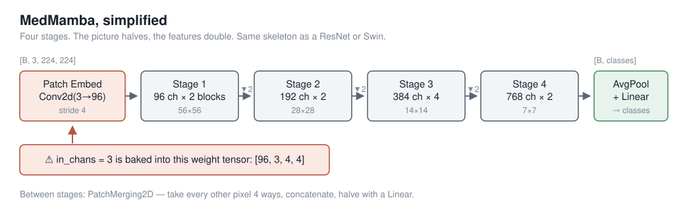

**You have seen this. Two things only:** `SS2D` is a state‑space scan run over the image four ways — left‑right, right‑left, top‑down, bottom‑up — and summed. Everything else is the ResNet/Swin skeleton: the picture halves, the features double, four times, then average and classify.

**Hold the red box.** It is the entire reason Part 1 exists.

> **Say:** Ninety seconds of recap and no more — you have all seen this block. The only thing on this slide that matters later is the red callout on the patch‑embed.

---

## The three things we hung off its block  ⏱ 0:40

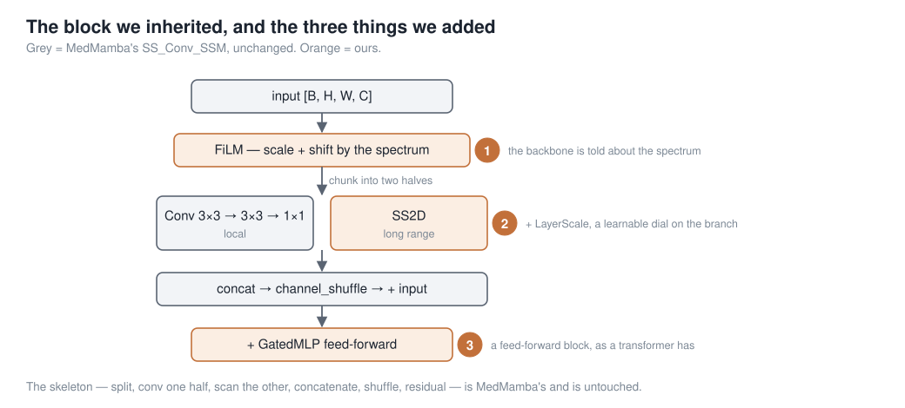

**Grey is MedMamba's and untouched. Orange is ours.** Badge ① is the one that matters: the spectrum conditions the block at **every** stage, not just at the input.

> **Say:** The split — half the channels get a global operator, half get a local one, then shuffle — is MedMamba's and we kept all of it. ② is a learnable dial on the residual branch, ③ a feed‑forward block; standard. We also made the four scan directions weighted rather than summed, so a reading order can be switched **off** if it isn't earning its place.

---

## Problem 1 — `C` is welded into the first layer  ⏱ 0:55

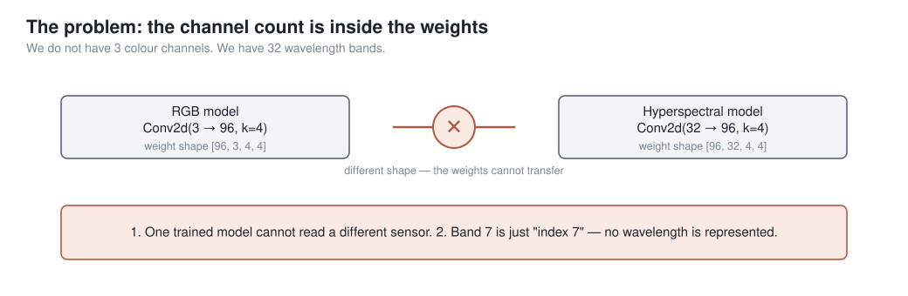

**We do not have 3 colour channels. We have 32 wavelength bands, chosen from 740.**

| consequence | why it hurts |
|---|---|
| A model trained on one sensor **cannot load** into a model for another | not "performs badly" — the tensors are different shapes |
| Nothing anywhere represents **which wavelength** a channel is | band 7 is just "index 7"; swap two bands and the model cannot tell |

> **Say:** The second consequence is the subtler one and it is the one that actually limits the science. A spectral model that cannot represent a wavelength is not a spectral model.

---

## The fix: delete the stem  ⏱ 1:00

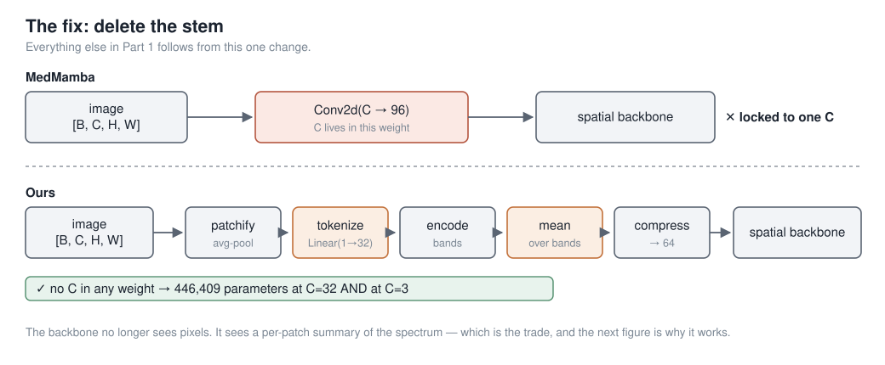

**Everything else in Part 1 follows from this one change.**

**The cost, stated up front:** the backbone no longer sees pixels. It sees a per‑patch summary of the spectrum, so texture *inside* a patch is gone. At patch size 1 that costs nothing; at patch size 8 it is most of the image.

> **Say:** I want the trade on the slide rather than in the limitations section, because it is the first thing a careful listener will object to. What it buys is the next slide, which is the one I actually want you to remember.

---

## Why `C` vanishes  ⏱ 1:25  ★

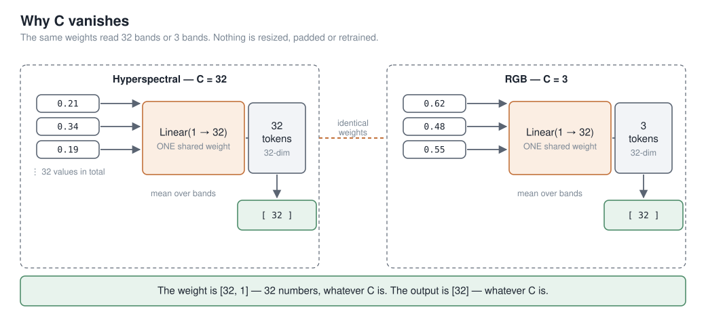

**Feed the bands in one at a time, and no weight ever learns how many there are.** `Linear(1 → 32)` takes a single band's value; its weight is `[32, 1]`. 32 bands → 32 tokens; 3 bands → 3 tokens; **same weights**. Then average over however many there were, and the output is fixed‑size.

**446,409 parameters at 32 bands. 446,409 at 3.** Not "about the same" — identical. ✅ *verified from two run configs*

> **Say:** Walk it slowly, and pause after "that's the whole trick". One loose end to close: averaging destroys order, so before we average, each band token is tagged with its real wavelength in nanometres as a sine/cosine pattern. That is what stops the average from forgetting *which* band was which.

---

## Problem 2 — the backbone is the expensive part  ⏱ 1:00

`C` is gone, and the model is still a **four‑stage hierarchical stack**: twelve distinct blocks, every one of them stored separately.

| where the parameters live | |
|---|---:|
| the spectral front end — **everything in Part 1** | **38,724** ✅ |
| a 4‑stage hierarchical backbone | **~27,000,000** |

**So: can a backbone reuse the same weights instead of storing twelve sets?**

That question has an answer in a paper from October 2025, and it is not a small one — the answer also happens to be **why the thing works at all**. So Part 2 is that paper.

> **Say:** This is the hinge of the talk. Say it explicitly: *we went looking for a backbone that reuses its weights, and the paper we found spends most of its pages on something else — on why reuse makes the model better rather than just smaller.* That is why Part 2 is long. The 38,724 is counted from the run checkpoint; the 27 M is the manuscript's figure for a MedMamba‑width stack and is unverified — say "about" and move on.

---
---

# Part 2 — What is TRM?

**Tiny Recursive Model** — *"Less is More: Recursive Reasoning with Tiny Networks"*
Alexia Jolicoeur‑Martineau · Samsung SAIL Montréal · [arXiv:2510.04871](https://arxiv.org/abs/2510.04871) · October 2025

> **Nothing in this part is ours.** Every number in it is the paper's, measured on puzzle benchmarks — not on medical images. We come back in Part 3.

---

## A maze, solved in pencil  ⏱ 2:15  ★

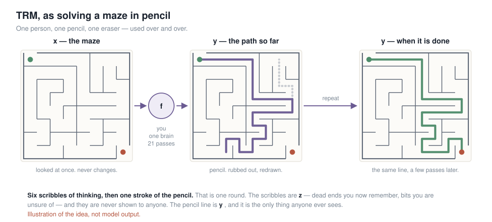

| | in the maze | in the model |
|---|---|---|
| `x` | the maze on the page | the input, embedded once, never changed again |
| `y` | the pencil line so far | the current answer — readable at any moment |
| `z` | worked out, not yet drawn | the private working |
| `f` | you | a **2‑layer** network — the only weights that exist |

**Four words, used consistently from here on:** a **scribble** is one update of `z` · a **stroke** is one update of `y` · a **round** is 6 scribbles then 1 stroke · a **pass** is 3 rounds, then you look at the answer.

> **Say:** Do the picture before the maths. You look at the maze once; you commit a line in pencil; you rub out the bit that was wrong and redraw just that bit. You never get a fresh sheet. And mazes are not a metaphor I picked for flavour — 30×30 mazes are one of the four benchmarks in the paper.

---

## Why it gets better each pass  ⏱ 1:10

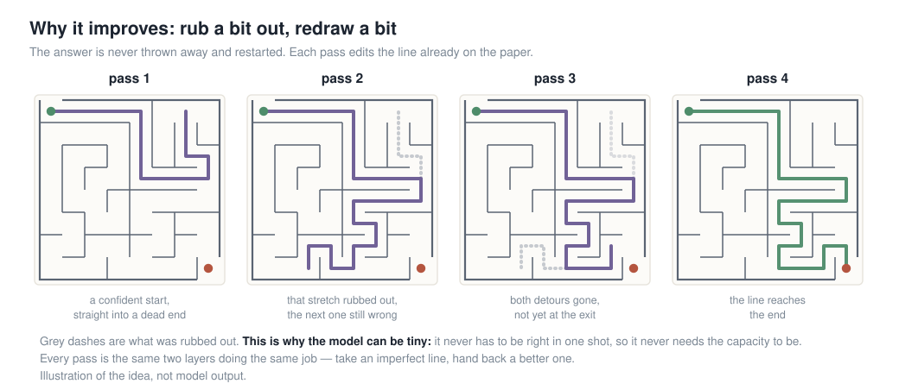

The model is **never** asked *"solve this."* It is asked **"here is an imperfect answer — make it less wrong."**

**That is why a tiny network is enough: it never has to be right in one shot, so it never needs the capacity to be right in one shot.** It borrows what it is missing from *time* — from being run again.

> **Say:** If the room remembers one sentence from Part 2, make it that one. Everything mechanical on the next three slides exists only to make it possible. If people look lost later, come back to this slide rather than pressing on.

---

## `y` is the answer, `z` is the working — and two is the right number  ⏱ 1:20

- **`y` is the answer.** Not a code for it — push it through the output head and you get an actual Sudoku grid. Decode it mid‑recursion and you see a partly‑solved puzzle getting better. That is the pencil line.
- **`z` is the working.** Decode it and you get nothing meaningful. Nobody ever sees it.

**Why exactly two?** Each one is load‑bearing, and the paper tested the alternatives on Sudoku‑Extreme:

| what gets carried between passes | # | acc | what breaks |
|---|---:|---:|---|
| **`y` and `z`** | **2** | **87.4%** | — |
| one `z` per recursion step | 7 | 77.6% | capacity and overfitting, nothing else |
| `z` only | 1 | 71.9% | forgets *how* it got here — no working to build on |

> **Say:** **87.4% is the reference number for the rest of Part 2** — it is TRM exactly as published, on Sudoku‑Extreme. Every ablation from here is that same model with one thing put back, so you only ever have to remember whether the number went down. This slide changes no code; it changes whether you can explain the model in one sentence.

---

## The same thing, precisely  ⏱ 1:45  ★

```python
def latent_recursion(x, y, z, n=6):
    for i in range(n):        # six scribbles: update the working
        z = net(x, y, z)      #   literally  z = f(z + y + x)
    y = net(y, z)             # one stroke: update the answer
    return y, z               #   literally  y = f(y + z)
```

**① Both `net` calls are the same network.** Same weights, called again. That is the entire parameter saving — there is nothing else to it.

**② Inputs are added, never concatenated.** So `f`'s input is the same shape on call 1 and on call 63. Concatenate instead and the shape grows every round; deep recursion becomes impossible.

**③ `x` is the switch.** The question is *missing* from the answer line. `z = f(z+y+x)` sees `x`; `y = f(y+z)` does not. **That is the only thing telling one shared network which of its two jobs to do.** See `x`, you are thinking; don't, you are answering.

| | acc | params |
|---|---:|---:|
| two separate networks | 82.4% | 10M |
| **one shared `f`** | **87.4%** | **5M** |

> **Say:** ③ is the one people miss, so point at the two lines and read them out. And land the table: half the parameters *and* five points better.

---

## The gradient question — the paper's real result  ⏱ 2:15  ★

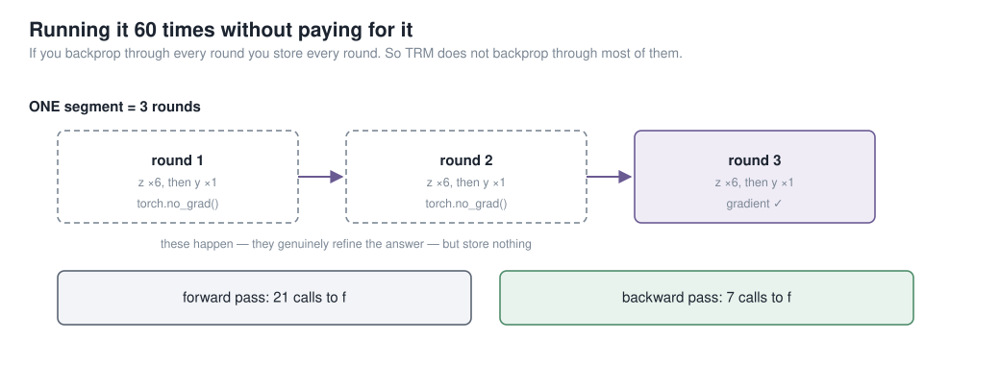

**The problem.** Backpropagating through 21 calls means storing 21 sets of activations — a 21‑layer memory bill, and you have thrown away the saving you came for.

**HRM's answer** *(the paper TRM is arguing with)*: assume the recursion settles to a fixed point, invoke the Implicit Function Theorem, backpropagate through only the **last 2 of 6** steps. **TRM's objection:** there is no fixed point. HRM does 4 forward steps and then *asserts* it has converged; its own residual plots never reach zero.

**TRM's answer.** Run 3 rounds; the first 2 under `no_grad`. Backpropagate through **one complete round** — all 7 calls. Justified not by a theorem but by the training objective: the model is already trained to improve *any* answer it is handed, so untracked rounds can only help. Per pass: **21 calls forward, 7 backward.**

| | Sudoku‑Extreme |
|---|---:|
| **TRM — backprop a whole round** | **87.4%** |
| TRM — HRM's 1‑step gradient, everything else identical | 56.5% |

**31 points — the largest single effect in the paper**, and it *costs* more memory than HRM's version, not less.

> **Say:** The lesson is not "skip most of the gradient". It is "make the part you *do* differentiate a complete, self‑contained round". Pause after 31 points.

---

## Deep supervision — and why it holds up the last slide  ⏱ 1:30

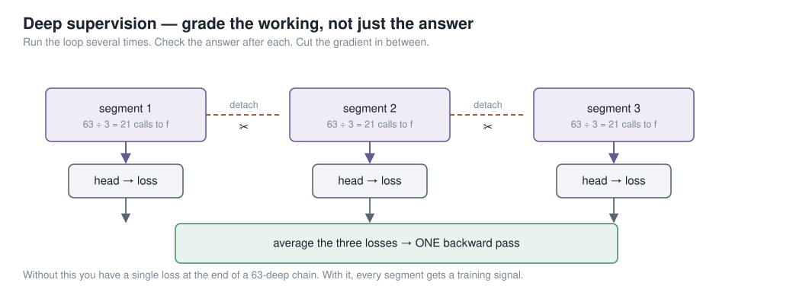

**Run the whole recursion, take a loss, detach `(y, z)`, hand them to the next pass as its starting point.** Up to **16** times. Without it you have one loss at the end of a 42‑deep chain.

**Every pass is therefore handed an imperfect answer and graded on improving it — which is exactly the property the `no_grad` rounds relied on.** The two ideas hold each other up; you cannot take one without the other.

**Effective depth** = `layers × calls/round × rounds × passes` = `2 × 7 × 3 × 16` = **672 layers deep, from 2 layers of weights.**

**Halting.** A second tiny head on `y` emits one number — *"is this already right?"* Bias starts at `−5`, so it opens at ~0.007: "definitely not done", and has to earn confidence. Training only. TRM drops HRM's second continue‑loss forward pass: **86.1% → 87.4%, and strictly cheaper.**

> **Say:** Note the direction of causality and say it out loud — deep supervision is what *licenses* the `no_grad` rounds. That is what people get wrong when they reimplement TRM.

---

## What TRM deleted from HRM  ⏱ 1:15  *(cuttable)*

TRM is a **stripped‑down HRM** (Wang et al., `arXiv:2506.21734`) — and every deletion made it better.

| HRM | → | TRM |
|---|---|---|
| two networks at two "frequencies" | → | **one** network |
| 4 layers each | → | **2** layers |
| biological arguments about brain timescales | → | `y` = the answer, `z` = the working |
| a fixed‑point theorem | → | backprop through a **whole** round |
| halting needs a 2nd forward pass | → | one forward pass |
| **27 M** parameters | → | **7 M**, and every benchmark goes **up** |

**There was already reason to be suspicious.** The ARC Prize Foundation audited HRM independently: deep supervision was worth **19% → 39%**, while the recursion — the headline idea — moved it only **35.7% → 39.0%**.

> **Say:** TRM's claim is not that HRM's recursion was a weak idea. It is that it was implemented wrong — and slide 11 is the receipt.

---

## Does it work — and what it does not claim  ⏱ 1:25  *(cuttable)*

**7 M parameters, ~1000 training examples.** On Sudoku and Maze every LLM in the comparison scores a flat **0.0**; TRM scores 87.4 and 85.3.

| | params | Sudoku | Maze | ARC‑1 | ARC‑2 |
|---|---:|---:|---:|---:|---:|
| Deepseek R1 | 671B | 0.0 | 0.0 | 15.8 | 1.3 |
| Grok‑4‑thinking | 1.7T | — | — | **66.7** | **16.0** |
| HRM | 27M | 55.0 | 74.5 | 40.3 | 5.0 |
| **TRM‑Att** | **7M** | 74.7 | **85.3** | 44.6 | 7.8 |
| **TRM‑MLP** | 5M | **87.4** | **0.0** ⚠ | 29.6 | 2.4 |

- **Grok‑4 beats it on both ARC benchmarks.** The abstract says "higher than *most* LLMs" and means it.
- **The mixer is sharply task‑dependent.** TRM‑MLP wins Sudoku by 13 points and scores **0.0** on mazes. Remember this — it comes back in Part 3.
- **Not an LLM, not generative.** One input, one deterministic answer.
- **Bigger is worse and nobody knows why.** The paper's words: *"we suspect it has to do with overfitting, but we have no theory to back this explanation."*

> **Say:** Close Part 2 by saying again that none of it was ours. The credibility of Part 3 depends on the room knowing which half is which.

---
---

# Part 3 — What we built

> Back to us. The recursion is TRM's; the spectral front end and everything around it is ours.

---

## Two backbones, one flag  ⏱ 0:50

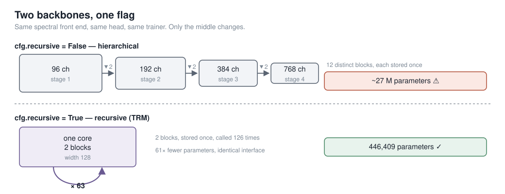

**The structural claim, which does not move:** 12 distinct blocks stored once, versus **2 blocks stored once and called 126 times** — behind an identical interface.

**The multiplier does move, so be precise about it.** 61× is against a MedMamba‑width stack (96/192/384/768); against our own narrower HSI hierarchical config it is ~6×. Same flag, same pipeline, same metrics either way.

> **Say:** Same spectral front end, same head, same trainer, same `forward_features` keys. Only the middle changes. Give the honest range for the multiplier before anyone asks which configuration the 61× is against.

---

## Where each piece came from  ⏱ 1:00

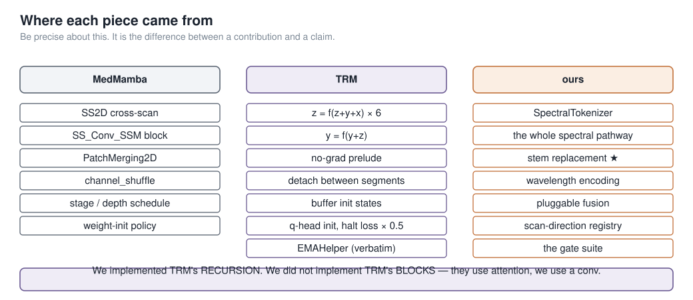

**The subtlety worth 20 seconds** — why the start states are *buffers*, not learnable parameters:

> The first round that reads them falls **inside** the `no_grad` block. Make them `nn.Parameter` and they would **silently never receive a gradient** — no crash, no warning, and the loss would not move an inch.

> **Say:** That is my favourite thing in this codebase, and it is a good one to leave the room with: a bug that does not crash, does not warn, and does not move the loss. TRM uses buffers; we use buffers; our source says why.

---

## What we changed, and why  ⏱ 1:45

| | TRM | us | reason |
|---|---|---|---|
| **shape** | token sequence | 2‑D grid | we classify images |
| **mixer in `f`** | self‑attention | depthwise 3×3 conv | attention is overkill on an 11×11 grid — and their own ablation says the mixer is task‑dependent |
| **`n`, `T`, passes** | 6, 3, 16 | 6, 3, **3** | same recursion, fewer passes — 63 calls to `f`, not 336 |
| **deep supervision** | 1 pass per optimizer step, state carried **across batches** | **all passes in one forward**, one backward | keeps our per‑batch stability checks working unchanged |
| **halting** | per sample | whole batch, and **off** | ours sat at chance for 33 epochs while being 20% of the loss |

**What we did *not* change** — the parts Part 2 showed were load‑bearing: `z = f(z+y+x)` then `y = f(y+z)`, one shared network, additive inputs, two rounds under `no_grad` with a **full** round backpropagated, detach between passes, buffer init states, EMA.

**The deep‑supervision change has a real consequence:** ✅ every gradient‑health, class‑collapse and NaN check still applies ❌ memory is now `O(passes)`, so gradient checkpointing became **mandatory**, not optional.

> **Say:** Be precise and say it before anyone catches you: we implemented TRM's **recursion**, not TRM's **blocks**. They use attention; every real run of ours uses a convolution.

---

## The whole thing, properly  ⏱ 1:15

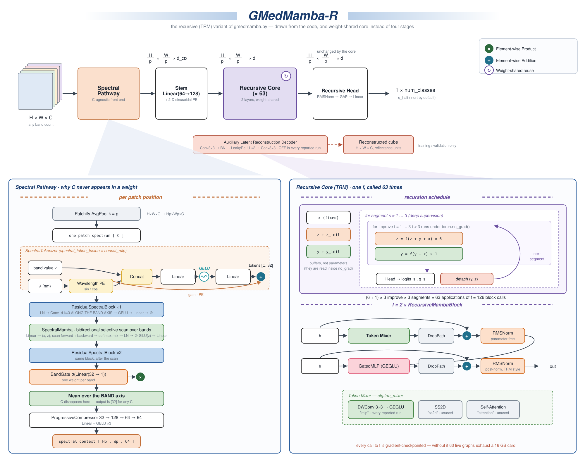

**Left panel is Part 1** — follow it down to "mean over the BAND axis"; that is where `C` disappears. **Right panel is Part 2** — the schedule on top, what `f` actually is underneath. **Notice what is missing:** no stages, no patch merging, no downsampling. Width 128 from the stem to the head.

> **Say:** Drawn in the MedMamba paper figure's own style so you can hold them side by side. This is the one to print and pin up — don't try to read it from the back. Two things to point at: the red box is the reconstruction decoder, which exists, is gated, and is **off in every run**; and bottom right, every call to `f` is gradient‑checkpointed, which is the only reason this fits on the card.

---

## What we have not measured  ⏱ 1:10

Three questions you are entitled to ask, and the honest answers.

| question | answer |
|---|---|
| **Does the recursion help *your* model?** | **We don't know.** No depth ablation, no hierarchical‑vs‑recursive run under matched conditions. One flag away; never run. |
| **Do you inherit TRM's results?** | **No.** Theirs are 9×9 and 30×30 puzzle grids with 1000× augmentation and a verifiable answer. We inherited the *recursion schedule*, not the evidence. |
| **Why a conv and not SS2D in the core?** | Speed — our selective scan is a pure‑PyTorch loop, ~39× slower at dataset scale. `ss2d` is implemented and has never been used in a real run. |

**Two standing weaknesses:** every result is a **single seed**, and the backbone averages away spatial detail *inside* each patch — free at patch size 1, and most of the image at patch size 8.

> **Say:** Put this slide in deliberately. Volunteering the gaps costs a minute and buys the room's trust for everything else — and it turns the three hardest questions into things you said first.

---

## Takeaways  ⏱ 0:55

1. **Delete `C` from your weight shapes** — a shared per‑value embedding plus a physical wavelength tag is all it takes, and one model then serves every sensor.
2. **TRM is two lines.** `z = f(z+y+x)` six times, `y = f(y+z)` once, most of it under `no_grad`.
3. **Refinement beats capacity.** A model that only has to make an answer *less wrong* can be far smaller than one that must be right in one shot. It borrows what it is missing from time.
4. **Weight sharing trades storage for compute**, steeply — and made gradient checkpointing mandatory. Always report both numbers.
5. **Be precise about provenance.** We implemented TRM's *recursion*, not TRM's *blocks*.

> **Say:** Three is the one to leave them with. If you are behind, read the five headlines and stop.

---

## Where to go next

| you want | go to |
|---|---|
| all of this in depth, with line citations | `doc/PROJECT_ARCHITECTURE_AND_HISTORY.md` |
| the model | `gmedmamba.py` — `SpectralTokenizer:724`, `RecursiveCore:1711` |
| the TRM paper | `arXiv:2510.04871` — Jolicoeur‑Martineau, *Less is More: Recursive Reasoning with Tiny Networks* |
| the HRM paper TRM reacts to | `arXiv:2506.21734` — Wang et al., *Hierarchical Reasoning Model* |
| the independent HRM audit | `arcprize.org/blog/hrm-analysis` |
| TRM upstream | github.com/SamsungSAILMontreal/TinyRecursiveModels → `models/recursive_reasoning/trm.py` |
| to run something | `documentations/12_commands_datasets.md` |

**Questions?**

---
---

# Backup — not presented

> Kept in the deck so they can be jumped to during questions. None of these are in the 25 minutes.

---

## TRM's defaults, and the ideas that failed

| knob | value | meaning |
|---|---|---|
| `L_cycles` (`n`) | 6 | working updates per round |
| `H_cycles` (`T`) | 3 | rounds per pass — **2 of the 3 under `no_grad`** |
| `L_layers` | 2 | layers inside `f` — the only weights in the model |
| `hidden_size` | 512 | working width |
| `halt_max_steps` (`N_sup`) | 16 | max deep‑supervision passes |
| `ema_rate` | 0.999 | weight averaging — worth 7.5 points |
| optimizer | AdamW | `β = (0.9, 0.95)`, 2K‑step warmup, batch 768 |
| loss | stablemax cross‑entropy | chosen for numerical stability |

**Depth is not the knob.** Give HRM more depth and it barely moves: across effective depths 9 → 168 it only goes **46.4% → 62.3%**, and at the deepest setting it is *worse* (57.5%) than at depth 48. TRM peaks at **87.4% at depth 42**.

**Ideas the paper tried and dropped:** Mixture‑of‑Experts instead of the MLP — much worse · backprop through only the last *k* steps — no gain · removing halting — much worse · weight‑tying input embedding to output head — much worse · **true fixed‑point iteration (TorchDEQ) — slower *and* worse**, which is itself the evidence that the fixed point was never the point.

---

## Full ablation on Sudoku‑Extreme

Each row is TRM with exactly one thing put back. **87.4% is TRM as published.**

| | acc | params |
|---|---:|---:|
| **TRM as published** | **87.4** | 5M |
| with HRM's 1‑step gradient | **56.5** | 5M |
| with HRM's recursion depth | 73.7 | 5M |
| with self‑attention instead of the MLP mixer | 74.7 | 7M |
| with 4 layers instead of 2 | 79.5 | 10M |
| without EMA | 79.9 | 5M |
| with two networks instead of one | 82.4 | 10M |
| with HRM's 2‑pass halting | 86.1 | 5M |
| HRM itself | 55.0 | 27M |

**It is also slow.** Sudoku: <36 h on an L40S. ARC: ~3 days on 4×H100. For 7 M parameters.

---

## Figure index

| # | file | slide |
|---|---|---|
| 1 | `fig01_medmamba_simple.svg` | MedMamba, in one slide |
| 3 | `fig03_block.svg` | the three things we hung off the block |
| 4 | `fig04_the_problem.svg` | `C` welded into the weights |
| 5 | `fig05_stem_swap.svg` | the fix: delete the stem |
| 6 | `fig06_why_c_vanishes.svg` | ★ why `C` vanishes |
| 19 | `fig19_trm_maze.svg` | ★ a maze, solved in pencil |
| 20 | `fig20_trm_maze_refine.svg` | why it gets better each pass |
| 10 | `fig10_nograd.svg` | ★ the gradient question |
| 11 | `fig11_deep_supervision.svg` | deep supervision and halting |
| 13 | `fig13_two_backbones.svg` | two backbones, one flag |
| 16 | `fig16_lineage.svg` | provenance |
| 17 | `fig17_gmedmamba_r_architecture.svg` | ★ full architecture |

**Figures 19 and 20 are generated**, not hand‑drawn — `doc/figures/make_maze_figs.py` builds the maze, its true solution and two dead‑end detours, and asserts that every drawn line is a walk over adjacent cells. Both carry *"Illustration of the idea, not model output"* on the figure itself; keep that line if you edit them.

**Held out of this version of the deck:** `fig02_ss2d`, `fig07_magnitude_bug`, `fig08_trm_idea`, `fig09_trm_loop`, `fig12_gmedmamba_r_simple`, `fig14_results`, `fig15_the_catch`, `fig18_then_vs_now`. They are not stale — they are slides this version does not give. `fig14` and `fig15` are the results and cost figures, deliberately kept for Q&A rather than the deck.

---

## If you're running long

The authoritative cut table lives in [`PRESENTATION_SPEAKER_SCRIPT.md`](PRESENTATION_SPEAKER_SCRIPT.md), measured from the script itself. In short: drop *What TRM deleted from HRM* and *Does it work* first — both sit at the end of Part 2, so nothing downstream depends on them.

**Do not get shorter by gutting the middle of Part 2.** Half a tutorial leaves a room that cannot follow Part 3. If you are handed 15 minutes, drop **Part 3**, not Part 2 — Part 2 stands alone and Part 3 does not.

**Never cut:** *Why C vanishes* · *Problem 2* · *A maze, solved in pencil* · *Why it gets better each pass* · *The same thing, precisely* · *The gradient question*.
