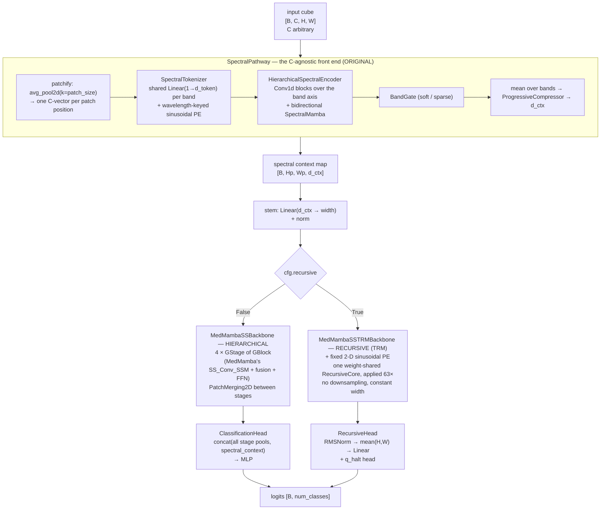

# MedMamba‑SS‑TRM — Architecture, Provenance and Development History

**A definitive technical reference for `g-medmamba`: what it is, where every part of it came from, how it got here, and what is actually known about how well it works.**

| | |
|---|---|
| Repository | `/data/dante_data/documents/Masters/courses/Thesis/g-medmamba` |
| Model file | [`medmamba_ss_trm.py`](../medmamba_ss_trm.py) — 2,212 lines, both backbone variants |
| Names | **MedMamba‑SS** = MedMamba ([arXiv:2403.03849](https://arxiv.org/abs/2403.03849)) + the spectral–spatial changes (hierarchical, `MedMambaSS`); **MedMamba‑SS‑TRM** = MedMamba‑SS + the Tiny Recursive Model logic of [arXiv:2510.04871](https://arxiv.org/abs/2510.04871) to cut parameters (recursive, `MedMambaSSTRM`). Called G‑MedMamba / GMedMamba‑R before 2026‑10‑02; logs, plans and `archive/` keep the old names. |
| Current entry points | [`train_example_v16.py`](../train_example_v16.py), [`train_example_v16_optimal.py`](../train_example_v16_optimal.py), [`train_example_v16_original.py`](../train_example_v16_original.py), [`train_example_v16_recon.py`](../train_example_v16_recon.py), [`train_example_v16_optimal_recon.py`](../train_example_v16_optimal_recon.py) |
| Current prep | [`prepare_histologyhsi_bc_v8.py`](../prepare_histologyhsi_bc_v8.py), [`prepare_pad_ufes_20_optimal.py`](../prepare_pad_ufes_20_optimal.py) |
| Upstream sources | MedMamba (<https://github.com/YubiaoYue/MedMamba>), Tiny Recursive Models (<https://github.com/SamsungSAILMontreal/TinyRecursiveModels>) |
| Document written | 2026‑09‑13, against working tree at `b57c35e` + untracked `doc/` |

### How to read the provenance markers

Every substantive claim in this document is tagged:

| marker | meaning |
|---|---|
| **[verified]** | read directly out of this repository's source, a run's `config.json` / `test_report.json` / `history.json`, or a dataset manifest, during the writing of this document |
| **[verified-upstream]** | read directly out of `../MedMamba-main/MedMamba.py` (the local copy of the official MedMamba source) or out of files fetched from the TinyRecursiveModels GitHub repository (`models/recursive_reasoning/trm.py`, `models/ema.py`, `models/losses.py`, `models/layers.py`, `config/arch/trm.yaml`, `config/cfg_pretrain.yaml`, `pretrain.py`) |
| **[from-docstring]** | asserted by a source file's own docstring or comment, and not independently re‑measured here. These are usually measurements the authors made on hardware this session has no access to |
| **[from-manuscript]** | taken from `paper/draft/GMedMamba_manuscript_v7.md`. Where the manuscript itself tags a number *(v6)* — meaning "carried forward from manuscript v6, no artefact in this repository" — that is repeated here as **[unverified]** |
| **[unverified]** | stated somewhere in the project but with no artefact in this repository backing it |
| **Not verified from the repository.** | explicitly unknown |

No number in this document was estimated, interpolated, or reconstructed from memory. Where a figure could not be checked, it says so.

---

## Table of contents

1. [Project overview](#1-project-overview)
2. [Original inspiration: MedMamba](#2-original-inspiration-medmamba)
3. [Baseline architecture](#3-baseline-architecture)
4. [Complete change history](#4-complete-change-history)
5. [Architecture changes in depth](#5-architecture-changes-in-depth)
6. [TRM integration](#6-trm-integration)
7. [TRM implementation mapping](#7-trm-implementation-mapping)
8. [The recursive reasoning mechanism](#8-the-recursive-reasoning-mechanism)
9. [Full model architecture, input to output](#9-full-model-architecture-input-to-output)
10. [Data pipeline](#10-data-pipeline)
11. [Training pipeline](#11-training-pipeline)
12. [Hyperparameters](#12-hyperparameters)
13. [Computational complexity](#13-computational-complexity)
14. [Performance and experiments](#14-performance-and-experiments)
15. [Ablation analysis](#15-ablation-analysis)
16. [Code-level change map](#16-code-level-change-map)
17. [Dependency / attribution analysis](#17-dependency--attribution-analysis)
18. [Important engineering decisions](#18-important-engineering-decisions)
19. [Known limitations](#19-known-limitations)
20. [Potential future improvements](#20-potential-future-improvements)
21. [Reproducibility guide](#21-reproducibility-guide)
22. [Final architecture summary](#22-final-architecture-summary)
23. [Source references](#23-source-references)

---

## 1. Project overview

### What the project does

MedMamba‑SS‑TRM is a **sensor‑agnostic spectral–spatial classifier for medical imaging**. It takes an image cube `[B, C, H, W]` for *arbitrary* `C` — 3 channels of RGB, 32 bands of hyperspectral, in principle any number — and produces class logits `[B, num_classes]`. The same weights, the same preset, the same command line serve both **[verified: `training/config_presets.py` `("recursive","hsi")` and `("recursive","rgb")` presets are identical apart from nothing at all; both run configs report `backbone_num_params: 446409`]**.

Two datasets are actually used:

| dataset | task | shape | classes | splits (train/val/test) |
|---|---|---|---|---|
| HistologyHSI‑BC‑Recurrence (TCIA, DOI 10.7937/6kpy‑yt49) | 3‑class breast tissue | `11×11×32` float16 patches | healthy, DCIS, IDC | 2,452,086 / 334,516 / 348,894 **[verified: `data/hsi_v8-80_10_10_importance/hsi/dataset_manifest.json`]** |
| …its RGB arm | same labels, same patches, 3 channels | `11×11×3` float32 | same | identical counts **[verified: same manifest, `rgb/`]** |
| PAD‑UFES‑20 (Mendeley `zr7vgbcyr2`) | 6‑class skin lesion | `224×224×3` float32 whole images | ACK, BCC, MEL, NEV, SCC, SEK | 1,626 / 328 / 344 **[verified: `data/pad_optimal/dataset_manifest.json`]** |

### The primary problem it solves

Two, stacked:

1. **Channel‑count coupling.** A standard vision backbone's stem is `Conv2d(in_chans, embed_dim, k, s)` — its first parameter tensor has `C` in its shape, so a model trained on 32 bands cannot read 3, and nothing about band *identity* (which physical wavelength a channel carries) is represented at all. MedMamba‑SS‑TRM removes `C` from every parameter shape.
2. **Parameter cost.** A 4‑stage hierarchical Mamba backbone at RGB width is ~27 M parameters **[from-manuscript, unverified]**. The recursive variant reaches the same task at **446,409** **[verified]**, by storing one small core and applying it 63 times.

### Architecture at a glance



**The three sentences that matter:**

* The **image never enters the spatial backbone directly.** MedMamba's `PatchEmbed2D` is replaced by `SpectralPathway → Linear(d_ctx → width)`, so the spatial backbone consumes a *spectral context map*, not pixels **[verified: `medmamba_ss_trm.py:1424-1440` — `forward_features` computes `ctx_map` from `x`, then uses only `ctx_map`; `x` appears nowhere else]**. That is what buys channel agnosticism, and it is also the architecture's sharpest limitation (§19).
* The **spatial half is a straight re‑implementation of MedMamba's SS‑Conv‑SSM stack**, extended with a scan‑direction registry, LayerScale, an FFN and a pluggable spectral↔spatial fusion point per stage.
* The **recursive variant replaces that whole stack** with TRM's two‑state weight‑shared recursion, faithfully implemented at the algorithm level and adapted from token sequences to 2‑D grids.

### The role of MedMamba

MedMamba is the direct code ancestor of the **spatial** half. `SS2D`, `SS_Conv_SSM` (→ `GBlock`), `PatchMerging2D`, `channel_shuffle`, the `dims`/`depths`/`drop_path` schedule and the `_init_weights` policy all originate there, several of them essentially verbatim. §2 and §17 enumerate exactly which lines.

### The role of TRM

TRM is the direct algorithmic ancestor of the **recursive** variant. The recursion `z ← f(z + y + x)` × L, `y ← f(y + z)`, with `H−1` improvement steps under `no_grad`, non‑trainable buffer init states, the zero‑weight/−5‑bias Q head, the 0.5‑weighted halting BCE, the exploration probability, and a verbatim `EMAHelper` port. §6–§8 trace each one.

### Evolution in one line each

| generation | what changed |
|---|---|
| **MedMamba‑SS v1/v2** | MedMamba backbone + a per‑band spectral tokenizer. *Not present in this repository; known only from `medmamba_ss_trm.py`'s own phase map.* **[unverified]** |
| **v3 (`medmamba_ss_trm.py`)** | the 17‑phase architecture build‑out: scan registry, multi‑scale, 5 fusion strategies, wavelength‑keyed PE, config dataclass, backend registry. This file has not changed since. |
| **v6 → v9 (trainers)** | reconstruction + SAM + GAN objective; macro‑F1 checkpointing; class‑collapse monitoring; pluggable loss; early stopping; κ/MCC; then the full numerical‑stability controller |
| **v12 / v13** | dataset integrity, SIGBUS elimination, DataLoader policy, AMP as an explicit mode |
| **v14** | `--architecture recursive` — TRM lands. `TrainerG_v10` adds in‑loop deep supervision + EMA |
| **v15** | *representation collapse remediation* — the tokenizer could not see its own input; seven config fields and a gate suite |
| **v16** | *acquisition, reconstruction & reporting remediation* — per‑patch normalization, split‑drift gate, live reconstruction feature map, reflectance‑unit metrics, step‑axis scheduling, group sidecars |
| **v17** | throughput + observability: `torch.compile` on by default, progress/ETA, timing fields, the `Overrides` refactor |

---

## 2. Original inspiration: MedMamba

Analysed from the local copy of the official source, `../MedMamba-main/MedMamba.py` (766 lines) and `../MedMamba-main/train.py` **[verified-upstream]**. This is not a README summary.

### 2.1 MedMamba's actual architecture

```
Input [B,3,224,224]
   ↓ PatchEmbed2D: Conv2d(3, 96, k=4, s=4) → permute to [B,56,56,96] → LayerNorm
   ↓ VSSLayer(dim=96,  depth=2) → PatchMerging2D → [B,28,28,192]
   ↓ VSSLayer(dim=192, depth=2) → PatchMerging2D → [B,14,14,384]
   ↓ VSSLayer(dim=384, depth=4) → PatchMerging2D → [B, 7, 7,768]
   ↓ VSSLayer(dim=768, depth=2)                  → [B, 7, 7,768]
   ↓ permute → AdaptiveAvgPool2d(1) → flatten → Linear(768, num_classes)
```
**[verified-upstream: `VSSM.__init__` / `forward_backbone` / `forward`]**

### 2.2 `SS_Conv_SSM` — the block

```python
input_left, input_right = input.chunk(2, dim=-1)
x = self.drop_path(self.self_attention(self.ln_1(input_right)))   # SS2D on half the channels
input_left = self.conv33conv33conv11(input_left.permute(0,3,1,2)).permute(0,2,3,1)
output = torch.cat((input_left, x), dim=-1)
output = channel_shuffle(output, groups=2)
return output + input
```
**[verified-upstream: `MedMamba.py:518-529`]**

The hard 50/50 channel split is between **two spatial operators** — a long‑range selective scan and a local conv stack — and has nothing to do with spectral processing. This is worth stating because a whole later module ([`medmamba_ss_fullchannel.py`](../medmamba_ss_fullchannel.py)) exists to remove it, and its own docstring documents having to reinterpret the improvement plan's wording to find the split the plan was actually describing **[verified: `medmamba_ss_fullchannel.py` docstring, "IMPORTANT REINTERPRETATION NOTE"]**.

### 2.3 `SS2D` — the selective scan

MedMamba builds four scan orders from one tensor:

```python
x_hwwh = torch.stack([x.view(B,-1,L), x.transpose(2,3).contiguous().view(B,-1,L)], dim=1)
xs = torch.cat([x_hwwh, torch.flip(x_hwwh, dims=[-1])], dim=1)   # (B, K=4, D, L)
```
then one shared `x_proj_weight` einsum produces `(Δ, B, C)`, `dt_projs_weight` lifts Δ, and `selective_scan_fn` (the **CUDA kernel from `mamba_ssm`**) runs the recurrence. The four outputs are **summed**: `y = y1 + y2 + y3 + y4` **[verified-upstream: `forward_corev0`, `forward`]**.

Initialisation is Mamba's, not generic:
* `dt_proj.weight ~ U(±dt_rank^-0.5 · dt_scale)`;
* `dt_proj.bias = inv_softplus(dt)` with `dt ~ LogUniform(dt_min=1e-3, dt_max=0.1)`, clamped at `1e-4`, and marked `_no_reinit`;
* `A_logs = log(arange(1, d_state+1))` broadcast over `d_inner`, marked `_no_weight_decay` (S4D‑real);
* `Ds = ones(d_inner)`, marked `_no_weight_decay`.

**[verified-upstream: `dt_init`, `A_log_init`, `D_init`]**

### 2.4 Weight initialisation

```python
if isinstance(m, nn.Linear):    trunc_normal_(m.weight, std=.02); zeros_(m.bias)
elif isinstance(m, nn.LayerNorm): zeros_(m.bias); ones_(m.weight)
...
for m in self.modules():
    if isinstance(m, nn.Conv2d): kaiming_normal_(m.weight, mode='fan_out', nonlinearity='relu')
```
**[verified-upstream: `VSSM._init_weights` and the loop after `self.apply`]**

MedMamba's own docstring on `_init_weights` candidly notes that `VSSLayer`'s `out_proj` re‑init is dead code and *"Conv2D is not intialized !!!"* — which the loop above then fixes.

### 2.5 The reference training recipe

`train.py`: `datasets.ImageFolder`, `RandomResizedCrop(224)` + `RandomHorizontalFlip`, `Normalize((.5,.5,.5),(.5,.5,.5))`, `nn.CrossEntropyLoss()`, `optim.Adam(lr=1e-4)`, `batch_size=32`, best checkpoint on validation accuracy. No scheduler, no AMP, no clipping, no class weighting, no EMA **[verified-upstream: `MedMamba-main/train.py`]**.

### 2.6 MedMamba → MedMamba‑SS‑TRM component map

```
Original MedMamba          →  Current project equivalent      →  Modification
─────────────────────────────────────────────────────────────────────────────────────
PatchEmbed2D                  SpectralPathway + Linear stem      REPLACED. C removed from
Conv2d(C, 96, k=4, s=4)       (medmamba_ss_trm.py:1015, :1384)   every parameter shape.
                                                                  Backbone now reads a
                                                                  spectral context map.

SS2D (K=4, summed)            SS2D (K∈{1..8}, softmax-weighted)  EXTENDED: direction
(MedMamba.py:250)             (medmamba_ss_trm.py:509)           registry + diagonals via
                                                                  _skew/_unskew; learnable
                                                                  direction mixing; pluggable
                                                                  scan backend; different
                                                                  Δ/A/D initialisation.

selective_scan_fn (CUDA)      _selective_scan_pure_pytorch       REPLACED with a pure-PyTorch
from mamba_ssm                (medmamba_ss_trm.py:81) + registry  reference loop. No CUDA
                                                                  dependency; ~40× slower.

SS_Conv_SSM                   GBlock (medmamba_ss_trm.py:1269)   EXTENDED: + per-stage
(MedMamba.py:492)                                                 spectral fusion, LayerScale
                                                                  on the SS2D branch, optional
                                                                  GatedMLP FFN. The chunk /
                                                                  conv-branch / concat /
                                                                  channel_shuffle / residual
                                                                  skeleton is unchanged.

PatchMerging2D                PatchMerging2D                     NEAR-VERBATIM. Odd sizes
(MedMamba.py:171)             (medmamba_ss_trm.py:1251)          F.pad'ed instead of truncated.

channel_shuffle               channel_shuffle                    VERBATIM (rewritten with
(MedMamba.py:476)             (medmamba_ss_trm.py:1243)          view/transpose, same result).

VSSLayer                      GStage (medmamba_ss_trm.py:1327)   EXTENDED: ctx alignment,
(MedMamba.py:530)                                                 StageBandSelector,
                                                                  SpectralContextUpdater,
                                                                  richer return tuple.

VSSM                          MedMambaSSBackbone                 EXTENDED: dataclass config,
(MedMamba.py:662)             (medmamba_ss_trm.py:1372)          multi-level output dict.

avgpool + Linear head         ClassificationHead                 REPLACED: concatenates ALL
(MedMamba.py:754-758)         (medmamba_ss_trm.py:1466)          stage pools + the spectral
                                                                  summary → 2-layer MLP.

(none)                        MedMambaSSTRM*                     NEW, from TRM (§6).
                              (medmamba_ss_trm.py:1841, :1912)

VSSLayer_up / PatchExpand2D   —                                  NOT PORTED. The segmentation
(MedMamba.py:214, :597)                                           decoder half of MedMamba is
                                                                  absent; MedMamba-SS's
                                                                  SegmentationHead is a simple
                                                                  MLP + bilinear upsample.
```

---

## 3. Baseline architecture

"Baseline" here means **`medmamba_ss_trm.py` as it stands** — the v3 architecture, frozen since. Everything in §4 is a change to the *pipeline around* it, plus config fields whose defaults preserve the original behaviour.

### 3.1 Initial model structure

`MedMambaSSTRMConfig` **[verified: `medmamba_ss_trm.py:172`]** defaults:

```python
dims=(96,192,384,768)  depths=(2,2,4,2)  d_state=16  patch_size=4  d_token=32
spectral_depth=3  spectral_kernel_sizes=(3,)  compression_dims=(128,64)  d_ctx=64
scan_directions=4  fusion_type="film"  norm_type="layernorm"
layerscale=True  layerscale_init=1e-4  drop_path_rate=0.1  use_ffn=True
dynamic_band_selection=True  band_selection_mode="soft"  stage_spectral_refinement=True
scan_backend="pure_pytorch"  spectral_chunk_size=1024  recursive=False
```

`validate()` enforces `dims[i+1] == 2*dims[i]` for the hierarchical path (because `PatchMerging2D` always doubles), and a separate assertion set for the recursive path **[verified: `medmamba_ss_trm.py:312-352`]**.

### 3.2 Initial training pipeline

`train_example_v6.py` + `TrainerG_v3/v4`: a joint objective

$$\mathcal{L} = \mathrm{CE} + \lambda_{\text{mse}}\,\mathrm{MSE} + \lambda_{\text{sam}}\,\mathrm{SAM} + \lambda_{\text{gan}}\,\mathrm{GAN}$$

with an optional `SpectralDiscriminator`, full spectral‑reconstruction metric reporting (RMSE/MAE/SAM/SID/Pearson/cosine/PSNR), an `experiments/` layout with `config.json` / `history.{csv,json}` / confusion matrices / `best_model.pt` **[verified: `training/trainerg_v4.py` docstring, `training/gan.py`]**.

### 3.3 Initial data pipeline

`NpyDataset` over flat `X_*.npy` / `y_*.npy`, two normalization modes only — an assertion hard‑codes `normalization in ("per_sample_minmax", "global_zscore")` **[verified: cited as `train_example_v6.py:42` by `train_example_v16.py:296-305`]** — plus an optional flip augmentation.

### 3.4 Initial limitations, as later diagnosed

| bottleneck | where it was found | §4 change that addressed it |
|---|---|---|
| best checkpoint chosen on raw accuracy | Stage A / Phase 13 | 4.2 |
| a single NaN batch aborted the whole run | Stage A / Phase 16‑17 | 4.3 |
| loss hard‑coded to `F.cross_entropy` | Stage B / Phase 12 | 4.4 |
| dataset corruption surfaced as `SIGBUS` in a worker | v12/v13 | 4.8 |
| tokenizer output 86–93× smaller than the constant PE added to it | v15 R1.1 | 4.11 |
| reconstruction decoder read a **detached** feature map | v16 R‑2 | 4.17 |
| LR schedule stepped on the epoch axis | v16 E‑2 | 4.20 |
| `--compile`, loader mode and artifact stride absent from the "best" defaults | v17 | 4.23 |

---

## 4. Complete change history

Ordered by the version that introduced each change. Every entry is a real change with a traceable file.

---

### 4.1 The 17‑phase architecture build‑out (→ `medmamba_ss_trm.py` v3)

**Problem.** MedMamba‑SS v1/v2 had a spectral tokenizer bolted onto a MedMamba backbone with fixed choices: 4 scan directions, one fusion strategy, index‑based band positions, constructor kwargs instead of a config object.

**Original behaviour.** Hard‑coded. **[unverified — v1/v2 are not in this repository; this is reconstructed from `medmamba_ss_trm.py`'s own phase map, lines 11–57.]**

**New behaviour.** Seventeen numbered phases, each mapped to a class in the file's header table **[verified: `medmamba_ss_trm.py:11-57`]**: universal spectral tokenization, patch‑wise spectral modelling, deep residual spectral encoder, spectral Conv1d, multi‑scale spectral branch, bidirectional spectral↔spatial interaction, stage‑wise refinement, dynamic band selection v2, generalized SS2D with a scan registry, multi‑scale SS2D, a pluggable fusion framework, progressive compression, multi‑level backbone outputs, continuous spectral PE, sensor‑aware wavelength encoding, a config dataclass with `validate()`, and a scan‑backend registry.

**Implementation.** All of `medmamba_ss_trm.py`.

**Architectural impact.** Total — this *is* the architecture.

**Training impact.** `scan_backend="pure_pytorch"` makes the model runnable with no `mamba_ssm`/`causal_conv1d` build, at the cost of a Python loop over the scan axis. That cost is the dominant term in every wall‑clock number in §13 **[verified: `training/torch_compile.py` docstring].**

**Inference impact.** Same loop cost at inference.

**Reasoning.** "One architecture, arbitrary channel counts" requires that no parameter shape mention `C`; everything else follows from making each such choice configurable rather than fixed.

**Trade‑offs.** Great configurability; **half of it is never exercised**. The multi‑scale branches, squeeze‑excitation, sparse band selection, 8‑direction SS2D, cross‑attention fusion and three of four task heads appear in no reported run **[verified: run `config.json` files; corroborated by manuscript §4.8]**.

**Relationship to source projects.** MedMamba‑derived (SS2D/GBlock/PatchMerging/stage schedule) + original (everything spectral).

---

### 4.2 Model selection moved to macro‑F1 (Phase 13 → `TrainerG_v5`)

**Problem.** `TrainerG_v4` selected the best checkpoint by `val_accuracy > best_val_acc`. On an imbalanced split a constant majority‑class predictor wins that comparison.

**Original behaviour.** Best = highest raw accuracy.

**New behaviour.** `checkpoint_metric`, default `"f1_macro"`; balanced accuracy / MCC / weighted‑F1 / OA still logged.

**Implementation.** [`training/trainerg_v5.py`](../training/trainerg_v5.py).

**Architectural impact.** None. **Training impact.** Changes which weights are shipped. **Inference impact.** Different checkpoint → different reported numbers.

**Reasoning.** Directly diagnosed: on PAD's whole‑image split, `val_accuracy = 0.4000` *is* the constant predictor, because BCC is 40 % of the validation split **[verified: run `20260906_000618`, best val accuracy exactly 0.4000 with balanced accuracy exactly 0.1667 = 1/6]**.

**Trade‑offs.** Macro‑F1 on a split whose rarest class has 6 validation images is itself noisy — flipping one MEL image moves macro‑F1 by ~0.017 **[from-docstring: `prepare_pad_ufes_20_optimal.py`]**.

**Relationship.** Independent/original (standard practice, not from either source).

---

### 4.3 Gradient health + invalid epochs, not run aborts (Phases 15–17 → `TrainerG_v5`)

**Problem.** `TrainerG_v4` aborted the entire run on the first non‑finite training loss.

**New behaviour.** A single bad batch is skipped (grads zeroed, continue). Only an epoch with *zero* valid updates is marked `INVALID`, and an invalid epoch can never become "best". Per‑epoch counters: `total_batches`, `valid_updates`, `skipped_updates`, `nonfinite_loss`, `nonfinite_gradients`.

**Implementation.** [`training/gradient_health.py`](../training/gradient_health.py), `TrainerG_v5`.

**Reasoning.** Isolated NaNs are common under mixed precision and are not divergence.

**Relationship.** Independent/original engineering.

---

### 4.4 Pluggable classification loss (Phase 12 → `TrainerG_v6`, `training/losses.py`)

**New behaviour.** `build_criterion(loss_type ∈ {ce, weighted_ce, focal, focal_weighted})`, class weights from train frequencies with a **`class_weight_power`** exponent **[verified: `training/losses.py`]**.

`compute_class_weights` documents two findings honestly:
* `--weight_method balanced` and `inverse` are **mathematically identical** after the mean‑1 renormalisation — the flag is a no‑op. **[verified: both are ∝ 1/count; renormalised to mean 1]**
* Full inverse‑frequency weighting overshoots on the HSI corpus: re‑deciding a finished run's saved probabilities gives macro‑F1 0.6657 / 0.8391 / **0.8474** / 0.8038 at power 0.00 / 0.50 / **0.75** / 1.00 **[from-docstring]**.

**Trade‑offs.** The 0.75 default was chosen from *test‑split* probabilities, which contaminates every number reported on that split — a defect the project names itself and provides [`scripts/tune_class_weight_power.py`](../scripts/tune_class_weight_power.py) to redo on validation probabilities **[verified: that script's docstring]**.

**Relationship.** Focal loss = Lin et al. 2017. Everything else independent.

---

### 4.5 Patience‑based early stopping (Phase 38 → `TrainerG_v7`)

Real patience on `checkpoint_metric`, kept alongside v4's divergence heuristics. Introduces `_StopReasonStr`, the stop‑reason convention every later trainer uses. **[verified: `training/trainerg_v7.py`]**

---

### 4.6 Cohen's κ and MCC in the live loop (Phase 48 → `TrainerG_v8`)

A one‑method additive override — v7's validation already returned `preds`/`labels`. **[verified: `training/trainerg_v8.py` docstring]**

---

### 4.7 Numerical stability as a controller (Phases 10–23, 36–37 → `TrainerG_v9`)

**New behaviour.**
* `amp_mode ∈ {off, bf16, fp16, auto}` as an explicit argument (was hard‑coded "bf16 if supported else fp16").
* Every non‑finite gradient inspected **at parameter level** (`inspect_gradients` → `first_bad_parameter`).
* CE / MSE / SAM / GAN / total checked for finiteness **individually, before backward**.
* Parameters checked for NaN/Inf **immediately after every `optimizer.step()`**; the run aborts rather than training on corrupted weights.
* A `NumericalStabilityController` classifies each epoch's skip ratio `healthy → fatal` and aborts the *run* on `max_consecutive_bad_batches` / `max_gradient_skip_ratio` / `max_consecutive_unhealthy_epochs`.
* `numerical_failure/failure.json` written on abort.

**Implementation.** [`training/trainerg_v9.py`](../training/trainerg_v9.py), [`training/numerical_stability.py`](../training/numerical_stability.py).

**Relationship.** Independent/original.

---

### 4.8 Dataset integrity before any mmap (v12/v13 → `train_example_v13.py`)

**Problem.** A corrupt `.npy` surfaced as an **uncatchable `SIGBUS`** inside a DataLoader worker.

**New behaviour.** Every `.npy` is validated — shape, dtype, size, SHA‑256 against `dataset_manifest.json` — *before* any Dataset, memory‑map or worker exists. Failure raises a typed `DatasetStorageError` and exits `DATASET_STORAGE_ERROR`; it is never downgraded to "try mmap anyway". Plus a patient/slide leakage check against `_progress.json`, a class‑coverage gate, an explicit `--dataset_storage {auto,mmap,ram}`, `--loader_test`, deterministic per‑worker seeding and `--cpu_threads`.

**Implementation.** [`training/npy_integrity.py`](../training/npy_integrity.py), [`training/dataloader_config.py`](../training/dataloader_config.py), [`training/system_memory.py`](../training/system_memory.py), [`training/failure_taxonomy.py`](../training/failure_taxonomy.py).

**Reasoning, and the evidence.** Not theoretical: the gate caught a training array **physically unreadable from byte offset 1,090,519,040 onward** — 71 % of a 3.7 GB file returning reproducible I/O errors while its header and first gigabyte read cleanly **[from-manuscript, tagged *(v6)* there → unverified here]**.

**Relationship.** Independent/original.

---

### 4.9 `--architecture recursive` — TRM lands (v14)

**New behaviour.** `medmamba_ss_trm.MedMambaSSTRM` becomes selectable; `TrainerG_v10` adds **in‑loop deep supervision** and **EMA**. Nine `--trm_*` flags thread into `MedMambaSSTRMConfig`.

**Implementation.** `medmamba_ss_trm.py:1555-2060`, [`medmamba_ss_trm_ema.py`](../medmamba_ss_trm_ema.py), [`training/trainerg_v10.py`](../training/trainerg_v10.py), [`train_example_v14.py`](../train_example_v14.py).

**Training impact — measured.** A bare‑defaults recursive run over 740,800 `11×11×3` patches went from **~92 h/epoch to ~26 min/epoch** after five default changes **[from-docstring: `train_example_v14.py`]**:

| flag | old → new | factor |
|---|---|---|
| `--trm_mixer` | `ss2d` → `mlp` | 39× |
| `--amp` | `off` → `bf16` | 3.8× |
| `--batch_size` | 128 → 256 | — |
| `--trm_deep_supervision_steps` | 4 → 3 | 1.27× |
| `--loader_mode` | `safe` → `balanced` | — |

**Trade‑offs.** `ss2d` — the mixer that would make the recursive core an actual *Mamba* core — is unusable at dataset scale without a compiled scan kernel, so every reported recursive run uses a depthwise‑conv mixer instead. See §19.

**Relationship.** TRM‑derived. §6–§8.

---

### 4.10 Run naming that records the experiment (v14 → `training/run_naming.py`)

`<ts>_<dataset>_<arch>_<modality>_<key-settings>_bs<N>_<amp>` replaced `gmedmamba_stageG_<arch>_run_<ts>`, which recorded neither the dataset nor any setting — so v13 and v14 runs were indistinguishable **[verified: docstring]**.

---

### 4.11 Representation collapse (v15 R1) — **the most consequential defect found**

**Problem.** `SpectralTokenizer` built each band token as `value_embed(v) + positional_encoding`. `value_embed` is a shared `nn.Linear(1, d_token)` initialised `trunc_normal_(std=0.02)` with zero bias, so on inputs in `[0,1]` its output magnitude is ~**0.006**. The positional encoding — *identical for every sample in the dataset* — has magnitude ~**0.55**.

So the input signal was **86–93× smaller than the constant it was added to**, and after `tokens.mean(dim=1)`, the GELU compressor and `stem_norm`, the embedding entering the backbone varied with the input by **0.25 %**. Measured stem input‑dependence: **0.18 % (HSI) / 0.29 % (RGB)** **[from-docstring: `train_example_v15.py`, `medmamba_ss_trm.py:724`]**.

**There is a second, independent defect in the same six lines.** With a shared `Linear(1,d)` and a zeroed bias, every band token is `v_c · W` — *a scalar multiple of one fixed direction*. All `C` bands are collinear, so `tokens.mean(dim=1)` reduces an entire spectrum to a single scalar. That is a **rank** failure, and fixing the magnitude does not fix it **[verified: `medmamba_ss_trm.py:724-770` docstring, and true by inspection of the forward]**.

**Original behaviour.** Both audited runs began life as constant functions. The HSI run's `predictions_epoch01.npz` shows max‑softmax confidence spanning **0.00022** across all 334,516 validation patches, every sample predicted `DCIS`, and **2.2 GPU‑hours** spent re‑confirming it **[from-docstring: `train_example_v15.py`]**.

**New behaviour.** `spectral_token_fusion ∈ {add, scaled, concat_mlp}`:

| mode | formula | fixes |
|---|---|---|
| `add` (legacy default) | `value_embed(v) + pe` | nothing — kept so v14 reproduces |
| `scaled` | `value_embed(v) + pe_gain · pe`, `pe_gain` learnable | scale only |
| **`concat_mlp`** (v15 default) | `W₂(GELU(W₁([v ; pe]))) + pe_gain · pe` | **scale and rank** — each band's response *direction* depends on its own PE |

**[verified: `medmamba_ss_trm.py:724-880`]**

Plus four more fields, each defaulting to the old behaviour:

* **`spectral_ctx_norm`** (R1.1b) — a *scale‑invariant* parameter‑free RMS norm before the stem. The ordinary one does not work here: `nn.LayerNorm`'s `eps=1e-5` and `_rms_norm_lastdim`'s `+1e-6` are **absolute** floors on a mean‑square, and the context map arrives at `|·| ~ 5e-5`, mean‑square `~2.5e-9` — two to three orders of magnitude *below either eps* — so both degenerate into a constant rescale. The file tabulates it: at input scale `1e-5`, `rsqrt(ms+1e-6)` gives `rms(out) = 0.0095`; `_rms_norm_scale_invariant` gives `1.000` **[verified: `medmamba_ss_trm.py:1603-1628`]**.
* **`classifier_init`** (R1.1d) — `"fan_in"` restores `nn.Linear`'s default init on the classifier's final projection, which the backbone‑wide `trunc_normal_(std=0.02)` had left ~4.4× below its own fan‑in scale.
* **`trm_spatial_pe_gain`** (R1.1c) — the same "signal added to a much larger constant" defect one layer down, on the recursive backbone's fixed 2‑D sinusoidal PE (`|pe| ~ 0.56` against a stem output at `|·| ~ 2e-3`).
* **`wavelength_encoding_scale`** (R1.3) — the pre‑v15 hard‑coded span of `1000.0` meant that with 32 bands, adjacent bands differ by ~32 radians in the lowest‑frequency component — **more than five full cycles** — so the encoding carried no locality at all. `None` uses the band count `C`, which makes `continuous_wavelength_encoding` reduce *exactly* to `index_positional_encoding` for a uniformly‑spaced sensor **[verified: `medmamba_ss_trm.py:700-723`]**.

**Implementation.** `medmamba_ss_trm.py` config fields + `SpectralTokenizer.reinit_value_branch()` (which must run **after** `self.apply(_init_weights)`, or the shared std=0.02 overwrites it); [`training/config_presets.py`](../training/config_presets.py) `V15_REPRESENTATION_OVERRIDES`; [`train_example_v15.py`](../archive/train_example_v15.py).

**Architectural impact.** Yes — `concat_mlp` adds `Linear(1+d, 2d)` + `Linear(2d, d)` and *removes* `value_embed`, so a checkpoint is tied to its `spectral_token_fusion` value.

**Reasoning, stated as a warning in the source.** *"Do NOT 'fix' this with a LayerNorm on the value branch: `LayerNorm(v·W)` for `v > 0` is `LayerNorm(W)`, a constant independent of `v`."* **[verified: `medmamba_ss_trm.py:761-763`]**

**Relationship.** Independent/original diagnosis and fix.

---

### 4.12 Weight‑decay parameter groups (v15 R1.2)

**Problem.** Every entry point from v6 to v14 built `AdamW(model.parameters(), weight_decay=0.05)` — decaying biases, norm gains, `LayerScale` alphas, `pe_gain`, and **`value_embed.weight`, the one weight that has to grow** for §4.11's fix to take hold.

**New behaviour.** [`training/optim_groups.py`](../training/optim_groups.py): decay only `ndim ≥ 2` non‑norm tensors, with explicit no‑decay overrides for `value_embed`, `tokenizer.fuse_in/out`, `pe_gain`, `spatial_pe_gain`, `alpha`, `threshold`, `direction_weights`, `z_init`, `y_init`.

**Trade‑off / known gap.** The rule decays `A_logs` (3‑D) and `Ds` (2‑D) of every `_SelectiveScanParams`, which Mamba/VMamba/MedMamba all mark `_no_weight_decay` **[verified: `training/optim_groups.py:38-80` matches no substring in those names; `MedMamba.py:361,375` set `_no_weight_decay = True`]**. This is a real divergence from upstream convention. It is inert in the *reference* MedMamba runs (its `train.py` uses plain `Adam`, no decay) but it is **not** inert here. See §19.

---

### 4.13 Chunking and checkpointing made real flags (v15 R3)

* **`spectral_chunk_size`** was hard‑coded at 1024 regardless of batch size. At `bs=256`, `patch_size=1`, `11×11` patches, `N = 30,976` → 31 **sequential Python iterations** of the whole spectral encoder per forward, each containing its own Python loop over `C` timesteps **[verified: `medmamba_ss_trm.py:1080-1095`]**. Now configurable; `0` = one pass.
* **`trm_checkpoint_core`** — `RecursiveCore.f` was checkpointed *unconditionally*, so `--gradient_checkpointing` did not control it and the recompute was always paid **[verified: `medmamba_ss_trm.py:1745-1766`]**.
* **`training/spectral_checkpoint.py`** wraps `SpectralPathway._process_patch_chunk` at runtime. Its docstring makes the key point precisely: the chunking loop *"discards nothing, it just changes when the memory is allocated"* — during training autograd retains every chunk simultaneously, so peak backward memory scales with the **full** `N`. Measured: HSI peak **10,243 MB → 1,007 MB** **[from-docstring]**.

---

### 4.14 The halting head was half‑wired (v15 R4.3)

**Problem.** `trm_act_halting=True` trained a halt head `q` with a BCE term and **nothing ever read it**. `forward_deep_supervision` ran every segment regardless, and `trm_halt_exploration_prob` was declared in the config and referenced nowhere in the repository.

**Evidence.** On the RGB run the halt BCE sat at ≈ 0.66 against `ln 2 = 0.693` for 33 epochs — chance, flat, and roughly **20 % of the training objective** **[from-docstring: `medmamba_ss_trm.py:275-286`]**.

**New behaviour.** `trm_halt_threshold`: `None` (default) reproduces the pre‑v15 loop exactly and leaves `q` inert; a value in `(0,1)` turns on genuine ACT — segments stop once `sigmoid(q) > τ` for **every** sample in the batch (conservative), with `trm_halt_exploration_prob` finally used as the training‑time probability of running the full budget anyway **[verified: `medmamba_ss_trm.py:1955-1975`]**.

**Status.** All reported runs pass `--no_trm_halting`, so no result depends on it.

---

### 4.15 Two silent correctness bugs in `MedMambaSSTRM` (v15 R4.4)

* `__init__` **mutated the caller's config in place** — a config built once and passed to two models came back with `recursive=True`, `dims=(trm_dim,)`, `depths=(1,)` overwritten. Now `copy.deepcopy`s first **[verified: `medmamba_ss_trm.py:1927`]**.
* `last_feature_map` is now written **only while training**. Keeping a `[B,H,W,d]` tensor alive after every eval forward — including inside `EMAHelper.ema_copy`'s validation pass — served no purpose **[verified: `medmamba_ss_trm.py:1976-1982`]**.

---

### 4.16 Class collapse became a stop condition (v15 R0.3 → `TrainerG_v11`)

`TrainerG_v5._check_class_collapse` produced warning strings and nothing else; `--class_collapse_streak 3` read like a control while only setting a warning threshold. v11 tracks epochs whose predicted‑label histogram has exactly **one** non‑zero bin and, at `--on_class_collapse abort`, stops with `TRAINING_ABORTED_REPRESENTATION_COLLAPSE` **[verified: `training/trainerg_v11.py` docstring]**.

---

### 4.17 Reporting integrity (v15 R5 → `TrainerG_v11`)

Five distinct defects, each with its observed symptom:

| # | defect | symptom |
|---|---|---|
| R5.1 | `halt_loss` was returned and never read into `metrics` | the RGB run's `Loss: 1.6955 (CE: 1.3647, MSE 0, SAM 0, GAN 0)` had **0.33 unaccounted for** |
| R5.2 | generalization gap mixed incomparable quantities — train = mean over segments + `0.5·halt` on augmented data from live weights; val = last‑segment CE on clean data from EMA weights | `GenGap(loss): −0.2247` on **every single epoch** |
| R5.3 | `TrainerG_v10` validated the **EMA copy** but saved the **live** weights to `best_model.pt` | reloading the shipped checkpoint did not reproduce the logged best metric → **gate G5** |
| R5.4 | validation hard‑coded bf16‑if‑supported | `--amp off` affected training only; `config.json` mis‑described the numerics behind the reported metrics |
| R5.6 | artifact retention | the HSI run wrote **six byte‑identical confusion‑matrix PNGs and six 334k‑row `.npz` files** |

**[from-docstring: `training/trainerg_v11.py`]**

R5.5 added `evaluate_test_split()` — held‑out test evaluation (gate G6) — which had not previously existed at all.

---

### 4.18 Acquisition artefacts (v16 A‑1/A‑2/A‑3)

**Problem.** Patient 68's IDC captures were acquired at ~50 % intensity. Under `global_zscore` — one train‑fit affine applied everywhere — that under‑exposed acquisition lands far outside the distribution the affine was fitted on.

**New behaviour, three layers:**

1. **At the source** — `prepare_histologyhsi_bc_v8.py` stores **gain‑corrected reflectance**, not raw DN. Pass 1 samples up to 400 ROI pixels per capture, takes a median, and applies `gain = corpus_median / capture_median` clipped to `[0.5, 2.0]`; anything clipped is logged as a **SUSPECT ACQUISITION** rather than silently stretched **[verified: `prepare_histologyhsi_bc_v8.py:298-330`]**.
2. **At train time** — a third normalization mode, **`per_patch_zscore`** (offset = patch mean, scale = patch std, over the *whole* patch). Measured drift: **0.07 σ** on normal validation IDC vs 0.13 σ for `global_zscore`, and **0.35 σ** on dark captures vs **2.79 σ** for `global_zscore` **[from-docstring: `training/normalization.py`]**. It wins on both columns because it re‑scales every patch to its own exposure.
3. **As a gate** — **G8** (`check_split_drift`) samples patches per split, applies the *resolved* normalization, and fails when a split's post‑normalization statistics have drifted too far from train's, in train‑group sigmas **[verified: `training/gates.py`]**.

**Two bugs fixed in passing**, both in the frozen v6/v7 calibration probe and both re‑derived (not edited) in v8:
* `hsi_all_calibrated` was **inverted**. `get_calibration_means` returns `(None, None)` precisely *because* a cube has no reference captures to calibrate against — frequently because it is raw sensor DN — and the probe read that as "calibrated". v8 instead ties the float16 decision to whether the **actual stored values** fit under `_FLOAT16_SAFE_MAX = 60000.0` **[verified: `prepare_histologyhsi_bc_v8.py:42-55, 349-356`]**.
* Per‑capture stats go to `capture_gain_report.json` via the `write_pass1_outputs` adapter hook, because `training/prep/parallel.py` (frozen) hard‑codes `ItemResult(..., extra={})` with no hook to populate it.

---

### 4.19 The reconstruction pathway, repaired (v16 R‑1 … R‑7)

Four stacked defects, in the order they bite:

| id | defect | effect |
|---|---|---|
| **R‑1** | `--recon_mode` was **force‑set to `none`** for `--architecture recursive` | the decoder could not be switched on at all |
| **R‑2** | the decoder read `base.last_feature_map`, which is **detached** | the auxiliary loss trained the decoder and **could not shape the encoder** |
| **R‑5** | training decoded from the deep‑supervision recursion, validation decoded from a **second, independent** recursion via `backbone.forward_features` | train and val reconstruction error measured different things |
| **R‑3/R‑7** | the decoder ended in a **sigmoid** while a z‑score target is `~N(0,1)` and unbounded; metrics computed in normalized units | `F.mse_loss` floored near 1.0 *regardless of decoder quality* — a saturating nonlinearity the decoder cannot get gradient through |

**Fixes.**
* [`training/recursive_features.py`](../training/recursive_features.py) — `forward_deep_supervision_with_features` duplicates the frozen recursion loop as a free function built entirely from *public* attributes, returning the **live** `y` as a third value. Nothing is stored on the module, so EMA's `copy.deepcopy` still works. Drift is guarded by `test_recursive_features_parity.py`, which asserts elementwise equality with the frozen method in eval mode.
* [`training/reconstruction_head_v2.py`](../training/reconstruction_head_v2.py) — `out_activation ∈ {linear, sigmoid}`, resolved automatically from `--normalization`, and **raising at startup on a mismatch** rather than training into the floor again.
* [`training/spectral_recon_metrics_v2.py`](../training/spectral_recon_metrics_v2.py) — SAM/SID/peak‑position recomputed in reflectance units after `denormalize`, with `require_nonnegative=True` **raising** instead of the frozen module's silent `clamp(min=eps)`. The reasoning is exact: SAM is an angle in a space where negative coordinates are physically meaningless, and SID renormalises to a probability distribution, which on z‑scored input silently discards most of the signal.
* `TrainerG_v12._forward_with_recon` — **one** decode path for training *and* validation **[verified: `training/trainerg_v12.py:304-338`]**.
* **Gate G7** — a preflight batch zeroes the classification term, backprops `λ_mse·MSE + λ_sam·SAM` alone, and asserts parameters **inside `backbone.core`** (not the decoder, not the head) received finite non‑zero gradient. `RECONSTRUCTION_DETACHED` otherwise **[verified: `training/gates.py`]**.

**Status.** The decoder is **off in the headline runs** (`recon_mode: none`, `gates.json` records `"G7": null`) **[verified: run `20260906_222725`]**. One later HSI run does exercise it end‑to‑end with `G7: true` **[verified: run `20260913_121925`]**.

---

### 4.20 The LR schedule was on the wrong axis (v16 E‑2)

**Problem.** The scheduler stepped once per **epoch**, so `--train_subsample_frac` (which changes how many optimizer steps an "epoch" contains) and early stopping desynchronised the schedule from wall‑clock training.

**New behaviour.** `build_warmup_cosine_scheduler` — linear warmup over `warmup_steps` (default `max(200, 3 % of total_steps)`) into cosine decay to 0, stepped **per optimizer step** by default **[verified: `train_example_v16.py:196-218`]**.

**Evidence it mattered.** Every run peaked at epoch 1 and declined monotonically **[from-manuscript §4.3]**.

---

### 4.21 Evaluation that survives contact with the data (v16 A‑4/A‑5/C‑1/C‑2)

* **A‑4** — per‑patient / per‑capture validation breakdown (`per_patient_metrics.json`, `per_capture_metrics.csv`) and a `PATIENT_OUTLIER` warning when one patient's recall drops while the macro metric rises. Sidecars come from `scripts/derive_patch_groups.py` (read‑only, no re‑prep) or, since v8, directly from the prep adapter.
* **A‑5** — `stratified_group` validation subsampling draws the per‑class fraction **within each patient**, because the validation split is five patients and a plain per‑class draw can starve one **[verified: `train_example_v16.py:250-283`]**.
* **C‑1** — `--eval_group_aggregation {mean_prob, majority}` reassembles **image‑level** metrics from tile posteriors for patch‑MIL datasets.
* **C‑2** — gates G1/G2 gain explicit **margins** (`value / threshold`, warn below 3×) plus a third gate on `disjoint_batch_mean_logit_delta`, which the frozen sensitivity check measured but never put into `failures`. Finding: RGB clears G1/G2 by **< 2.2×** **[from-docstring: `training/gates.py`]**.

---

### 4.22 Gate G6 was silently unreachable for every v16 HSI run

**Problem.** `train_example_v15._build_test_loader` builds a frozen `train_example_v6.NpyDataset`, whose `__init__` asserts `normalization in ("per_sample_minmax", "global_zscore")` — predating `per_patch_zscore`, which A‑2 made the **HSI default**. Calling it raised a bare `AssertionError`, which the caller's `except Exception` turned into `WARNING: test-split evaluation failed: AssertionError:` (empty message) and `gates.json: {"G6": false}`. The run itself completed normally.

**New behaviour.** `_build_test_loader_v16` builds an `NpyDatasetV16`; the failure path now also prints a full traceback and writes `gate_g6_failure.json`, *"because a bare AssertionError prints as an empty message, which is how the frozen NpyDataset's normalization assert hid this for a whole run"* **[verified: `train_example_v16.py:289-330, 833-842`]**.

---

### 4.23 Throughput and observability (v17)

| change | measured effect |
|---|---|
| `--compile on` by default | PAD **437.0 → 266.7 ms/step (1.64×)** *and* peak **1,428 → 1,110 MB** |
| `--loader_mode performance` in `OPTIMAL_DEFAULTS` | PAD only — HSI already had it |
| `--eval_artifact_stride 5` | `1` wrote 64 confusion matrices over 63 epochs |
| MedMamba‑SS‑TRM becomes the default architecture on the bare entry point | no behaviour change — both documented invocations already passed it |
| `Overrides` replaces module‑global rebinding | composition is an expression, not an ordering |
| `raise_open_file_limit()` + single‑process G6 retry | a 2‑hour HSI run had lost its held‑out number to "Too many open files" |

**[verified: `plan/v17_baseline.md`, `train_example_v16_optimal.py:435-450`, `train_example_v16.py:336-371, 811-842`]**

**The finding that motivated the whole stage.** The PAD run went through `train_example_v16_optimal.py` — the *best‑metrics* entry point — and **still ran eager, on the slow loader, writing all ten plots every epoch**, because none of those were in `OPTIMAL_DEFAULTS` and nobody typed them. The HSI runs got the good settings because someone typed them on a bare `train_example_v16.py` command line. *"The settings were never the problem; their absence from the defaults was."* **[verified: `train_example_v16_optimal.py:435-441`]**

**Two optimisations measured and REJECTED** — recorded because a rejection is a result:
* `--no_trm_checkpoint_core`: 437 → 384.7 ms is **12 %**, bought with 1,428 → **6,863 MB (4.8×)**, and it OOMs at batch 64 where the checkpointed path runs fine.
* Raising `--batch_size`: throughput **falls** — 120.0 → 106.2 → 97.8 samples/s at bs 32/64/128 (compile on, ckpt on). Independently confirmed for HSI at 89.5 / 80.2 / 78.6 samples/s at 256/512/1024.

**[verified: `plan/v17_baseline.md` §2–§3]**

---

### 4.24 The dataset fix with the largest single effect: `--rgb_source`

Not a model change, but it invalidates a comparison, so it belongs here.

**Problem.** Every HistologyHSI capture folder ships **two** renderings. Measured over all 644 captures:

| file | cube‑aligned |
|---|---|
| `SyntheticRGBImage.png` | **644 / 644 (100 %)** |
| `RGBImage.png` | 416 / 644 (65 %) — the other 228 are a wide‑field 3648×5472 camera frame of a **different field of view**, some with the green ROI annotation **burned into the pixels** |

`prepare_histologyhsi_bc_v6._find_rgb_image` sorts candidates by `0 if "rgb" in n or "synt" in n else 1` — and **both names contain "rgb"**, so both score 0 and the winner is whatever `os.listdir` returned first. On this machine that resolved to `RGBImage.png` for 565 captures and `SyntheticRGBImage.png` for 79: **the RGB arm was built from a mixture of two optical sources, 190 of them (29.5 %) nearest‑neighbour‑resized from a different field of view onto the cube's patch coordinates and ROI mask** — and the mixture is not reproducible across filesystems.

**Fix.** `--rgb_source {synthetic, camera, legacy}`, default `synthetic`, ranked by an explicit preference list with ties broken by **sorted filename**. Rebound inside `load_item_multi` — not `pass1` — because extraction runs in worker *processes* and a rebinding done in the parent would not survive `spawn` **[verified: `prepare_histologyhsi_bc_v8.py:136-203, 389-400`]**. Added to `compat_keys` so a resumed prep cannot append cube‑aligned patches to misaligned ones inside one `X_train.npy`.

**Why it matters.** The RGB arm exists to be the *controlled* comparison against the HSI arm — same tissue, same coordinates, fewer channels. Under `legacy` it was not that.

---

## 5. Architecture changes in depth

Every module below was read in `medmamba_ss_trm.py` before being described. Shapes are the real ones.

### 5.1 `SpectralTokenizer` — `medmamba_ss_trm.py:724`

| | |
|---|---|
| **Purpose** | turn a `C`-band spectrum into `C` tokens of width `d_token`, with **no parameter shape depending on `C`** |
| **Input** | `band_values [N, C]` (N = B·Hp·Wp), optional `wavelengths [C]` or `[N,C]` in nm, optional `sensor_range (lo,hi)` |
| **Output** | `[N, C, d_token]` |
| **Parameters** | `add`/`scaled`: `Linear(1, d_token)`. `concat_mlp`: `Linear(1+d_token, 2·d_token)` + `Linear(2·d_token, d_token)`. Plus a scalar `pe_gain` when `fusion != "add"` |
| **Provenance** | **Original.** No analogue in MedMamba (which has `Conv2d(in_chans, …)`) or TRM (which has a vocabulary embedding) |

Positional encoding, when wavelengths are supplied:

$$\tilde\lambda_c = \mathrm{clamp}\!\left(\frac{\lambda_c - \mathrm{lo}}{\mathrm{hi}-\mathrm{lo}},\,0,\,1\right),\qquad
\theta_{c,k} = \tilde\lambda_c \cdot \mathrm{span}\cdot 10000^{-2k/d}$$

$$\mathrm{PE}[c, 2k] = \sin\theta_{c,k},\qquad \mathrm{PE}[c, 2k{+}1] = \cos\theta_{c,k}$$

With `span = C` this **reduces exactly** to the index encoding for a uniformly‑spaced sensor, because both then compute `band_index · div_term` **[verified: `medmamba_ss_trm.py:674-723`]**. Without `reference_range`, `normalize_wavelengths` falls back to per‑sample min/max — still order‑ and spacing‑aware, but no longer comparable across sensors.

`reinit_value_branch()` exists because `MedMambaSSBackbone.__init__` calls `self.apply(_init_weights)`, which would overwrite `spectral_value_init_std` with the shared 0.02. For `concat_mlp` it resets the fusion MLP to **PyTorch's own default init** and then re‑draws only the *value column* (`fuse_in.weight[:, :1]`) at `value_init_std` — because std=0.02 on a `Linear(1+d, 2d)` is ~5× below that layer's fan‑in scale and the value occupies 1 of 33 input columns, which would bury the value under the PE a second time **[verified: `medmamba_ss_trm.py:790-826`]**.

### 5.2 `SpectralPathway` — `medmamba_ss_trm.py:1015`

```
x [B, C, H, W]
  → patchify: F.avg_pool2d(k=patch_size, s=patch_size, ceil_mode, count_include_pad=False)
                                                        → [B, C, Hp, Wp]
  → permute/reshape                                     → band_values [N, C],  N = B·Hp·Wp
  → for each chunk of `spectral_chunk_size` rows:
       SpectralTokenizer                                → [n, C, d_token]
       HierarchicalSpectralEncoder                      → [n, C, d_token]
       BandGate → weights [n, C]; tokens *= w           → [n, C, d_token]
       mean over the BAND axis                          → [n, d_token]
       ProgressiveCompressor (d_token → 128 → 64 → d_ctx) → [n, d_ctx]
  → concat, reshape                                     → ctx_map [B, Hp, Wp, d_ctx]
                                                           band_weights [B, Hp, Wp, C] or None
```

**`patchify` is where spatial information is lost.** At `patch_size > 1` each output position is the *spatial mean* of a `p × p` window, so within‑patch texture never reaches either backbone. At `patch_size = 1` it is the identity and nothing is lost. All reported HSI/RGB `11×11` runs use `patch_size=1`; PAD whole‑image runs use 8 (224 → 28). **[verified: `medmamba_ss_trm.py:1036-1040` + run configs]**

`HierarchicalSpectralEncoder` = `⌈depth/2⌉` `ResidualSpectralBlock`s → `x + SpectralMamba(norm(x))` → `depth − ⌊depth/2⌋` more blocks **[verified: `medmamba_ss_trm.py:919-946`]**.

`SpectralMamba` (`medmamba_ss_trm.py:644`) is a **bidirectional selective scan along the band axis** — `_SelectiveScanParams(k_directions=2)` on `[x_seq, flip(x_seq)]`, combined by a softmax over two learnable weights, then `out_norm`, `· F.silu(z)`, `out_proj`. Structurally it is `SS2D`'s 1‑D sibling: same gated `in_proj`/`out_proj` skeleton, same output normalisation. **Provenance: architecturally MedMamba‑derived (SS2D's skeleton), applied to an axis MedMamba has no concept of. Original in application.**

### 5.3 `GBlock` — `medmamba_ss_trm.py:1269`

```python
residual = x
x = self.fusion(x, ctx_map)                 # ← NEW vs MedMamba: spectral conditioning
left, right = x.chunk(2, dim=-1)
ss = self.drop_path(self.ss2d_scale(self.self_attention(self.ln_1(right))))   # ← LayerScale NEW
left = self.conv_branch(left.permute(0,3,1,2)).permute(0,2,3,1)               # ← MedMamba verbatim
out = channel_shuffle(torch.cat((left, right + ss), dim=-1), groups=2)       # ← MedMamba verbatim
out = residual + out
if use_ffn: out = out + self.ffn_drop_path(self.ffn_scale(self.ffn(self.ln_2(out))))  # ← NEW
```

**One subtle divergence from MedMamba.** MedMamba concatenates `(input_left, x)` — the conv output and the *SS2D output alone*. MedMamba‑SS concatenates `(left, right + ss)` — the conv output and **`right` plus the SS2D output**, i.e. an extra residual inside the right half **[verified-upstream: `MedMamba.py:525` vs `medmamba_ss_trm.py:1322`]**. Both are then `+ residual`, so the right half gets its input added twice. This is not documented anywhere in the project as a deliberate choice; it is recorded here as a factual difference. **Not verified whether it was intentional.**

**Fusion strategies** (`medmamba_ss_trm.py:1112-1206`), all zero‑initialised so the block starts as an identity in the ctx path:

| name | operation |
|---|---|
| `film` (default) | `spatial · (1 + γ(ctx)) + β(ctx)` |
| `gated` | `spatial + σ(W[spatial ; ctx]) · P(ctx)` |
| `multiplicative` | `spatial · (1 + σ(P(ctx)))` |
| `residual` | `spatial + P(ctx)` |
| `cross_attention` | `LayerNorm(spatial + MHA(q=spatial, k=v=P(ctx)))`, 4 heads |

**Provenance:** FiLM = Perez et al. 2018; the rest are standard conditioning primitives. The *framework* (per‑stage selectable, `fusion_type: str | list[str]`) is original.

### 5.4 `GStage` — `medmamba_ss_trm.py:1327`

```
ctx_aligned = align_ctx_to(ctx_map, H, W)            # bilinear, resolution-matched
ctx_aligned = StageBandSelector(ctx_aligned)         # SE-style gate, recomputed per stage
for blk in blocks: x = blk(x, ctx_aligned)
pooled = x.mean(dim=(1,2))
ctx_aligned = SpectralContextUpdater(ctx_aligned, x) # spatial → spectral feedback
x = PatchMerging2D(x)                                 # H,W /2 ; C ×2
ctx_aligned = downsample_ctx(ctx_aligned)             # avg_pool2d 2×2
return x, ctx_aligned, pooled, stage_feature_map, stage_ctx_map
```

The `SpectralContextUpdater` (`ctx + σ(gate(ctx)) · proj(spatial)`, then norm) closes the **bidirectional** loop the phase map promises: spectral conditions spatial via fusion, spatial updates spectral via the updater, once per stage. **Original.**

### 5.5 The recursive modules

See §8 for the mechanism. Structurally:

| module | line | role |
|---|---|---|
| `sinusoidal_2d_encoding` | 1570 | fixed `[H,W,dim]` PE, first half keyed on row, second on column. `dim % 4 == 0` |
| `_rms_norm_lastdim` | 1589 | parameter‑free RMS norm, `eps=1e-6`. **Line‑for‑line equivalent to TRM's `rms_norm`** |
| `_rms_norm_scale_invariant` | 1603 | divides by the RMS itself with only a `clamp_min(1e-20)` floor — works at any input scale (§4.11) |
| `_TokenMLPMixer` | 1629 | depthwise 3×3 conv (spatial mixing) + optional GEGLU `GatedMLP` (channel mixing) |
| `_SpatialSelfAttention` | 1654 | plain MHSA over `Hp·Wp` tokens via `F.scaled_dot_product_attention` |
| `RecursiveMambaBlock` | 1675 | `x = rms(x + dp(mixer(x))); x = rms(x + dp(ffn(x)))` |
| `RecursiveCore` | 1711 | the weight‑shared `f`, `improve`, `one_segment`, buffer init states |
| `RecursiveHead` | 1790 | `RMSNorm → dropout → mean(H,W) → Linear` + `q_head` |
| `MedMambaSSTRMBackbone` | 1841 | spectral pathway + stem + 2‑D PE + core |
| `MedMambaSSTRM` | 1912 | + head, `forward_deep_supervision` |

**`_TokenMLPMixer`'s `channel_mlp=False` option exists for a measured reason.** With `channel_mlp=True` (the legacy default) each "token mixer + channel MLP" block is really one depthwise conv and **two** channel MLPs, because `RecursiveMambaBlock` already applies its own `GatedMLP` as `ffn`. At `trm_dim=128, trm_ffn_mult=2.0` that is **98,944 parameters each against 1,280 for the conv — 90 % of the whole model spent on channel mixing and 4,608 parameters in total on spatial mixing** **[from-docstring: `medmamba_ss_trm.py:1629-1645`]**.

### 5.6 What is inert

Stated explicitly because a reader should not have to discover it from the code **[verified against every run `config.json` in `experiments/`]**:

* **`trm_mixer = "ss2d"` and `"attention"`** — implemented, parameter‑counted, smoke‑tested; **no reported run uses either**. `ss2d` is not usable at dataset scale without a compiled scan kernel.
* **ACT halting** — implemented and disabled everywhere.
* **Five of six fusion strategies**, and in fact fusion entirely for the recursive runs — the recursive backbone has no per‑stage fusion point, so `fusion_type` appears in those configs and is ignored.
* **Multi‑scale spectral/spatial branches, squeeze‑excitation, sparse band selection, 8‑direction SS2D** — exercised only by the file's own smoke tests.
* **`regression` / `embedding` / `segmentation` heads** — hierarchical variant only; `MedMambaSSTRM` raises for anything but classification **[verified: `medmamba_ss_trm.py:1935-1936`]**.
* **`cuda` / `triton` scan backends** — registered but raise `NotImplementedError`.

---

## 6. TRM integration

Reference: <https://github.com/SamsungSAILMontreal/TinyRecursiveModels>, arXiv:2510.04871. All upstream claims below were checked against `models/recursive_reasoning/trm.py`, `models/layers.py`, `models/ema.py`, `models/losses.py`, `config/arch/trm.yaml`, `config/cfg_pretrain.yaml` and `pretrain.py`, fetched during the writing of this document **[verified-upstream]**.

### 6.1 Why TRM was introduced

The hierarchical MedMamba‑SS is ~27 M parameters at RGB width **[from-manuscript, unverified]** and 2.77 M at HSI width **[from-manuscript, unverified]**. The research question the project actually poses is *"does it need to be this large?"* **[verified: manuscript §1.1]**. TRM is the published answer to the same question in a different domain: one small block, applied many times, beating far larger models on ARC/Sudoku/Maze.

### 6.2 What recursive reasoning is supposed to buy

Depth without parameters. A 2‑layer core applied 63 times has the *computational* depth of 126 blocks and the *storage* of 2. The hypothesis being tested here is that the same trade works on dense spectral‑spatial classification, where the "reasoning" is iterative refinement of a spatial feature map rather than iterative refinement of a puzzle grid.

### 6.3 TRM's design principles, as implemented upstream

1. **Two states.** `z_H` (the answer, read by the output head) and `z_L` (the latent). `trm_singlez.py` is the single‑state ablation.
2. **One weight‑shared reasoning module.** `L_level` is a single `ReasoningModule` used for *both* the `z_L` and `z_H` updates. `H_layers` is declared and **ignored**.
3. **Input injection by addition.** `ReasoningModule.forward(hidden, input_injection)` is literally `hidden + input_injection` then the layers.
4. **Cheap deep recursion.** `H_cycles − 1` improvement steps run under `torch.no_grad()`; only the last carries gradient.
5. **Deep supervision with a detached carry.** The ACT wrapper runs **one segment per optimizer step**, detaches `(z_H, z_L)` into the next step's carry, and resets the carry for halted samples.
6. **ACT halting via a Q head.** `q_head: Linear(hidden, 2)` → `(q_halt, q_continue)`; with `no_ACT_continue=True` (the shipped default) halting is simply `q_halt_logits > 0`, per sample, plus an exploration floor.
7. **Post‑norm RMS residuals**, SwiGLU MLP, rotary attention (or `mlp_t`, an MLP over the *sequence* axis, for the attention‑free variant).
8. **Q head init:** `weight.zero_()`, `bias.fill_(-5)`.
9. **Init states as non‑trainable buffers:** `H_init`, `L_init` ~ `trunc_normal(std=1)`.
10. **Optional EMA** of all trainable weights, `mu = 0.999`, validated via `ema_copy`.
11. **Loss:** `lm_loss + 0.5 · (q_halt_loss + q_continue_loss)`, `q_halt_loss = BCEWithLogits(q_halt, seq_is_correct)`.

### 6.4 Which parts were implemented, adapted, changed, or not used

| TRM principle | status here |
|---|---|
| 1 two states | **implemented** (`trm_two_state=True`; `False` gives the single‑z path) |
| 2 one shared module | **implemented** (`RecursiveCore.layers`, used for both updates) |
| 3 additive input injection | **implemented** (`f(z + y + x)`, `f(y + z)`) |
| 4 `H−1` no‑grad steps | **implemented verbatim** (`one_segment`) |
| 5 deep supervision | **adapted** — all segments inside one forward, one backward, losses averaged. Carry does **not** persist across batches |
| 6 ACT halting | **changed** — 1 logit not 2; batch‑level not per‑sample; off by default |
| 7 post‑norm RMS residuals | **implemented** (`_rms_norm_lastdim` ≡ TRM's `rms_norm`) |
| 7 SwiGLU | **changed** to GEGLU (`x · gelu(gate)` vs `silu(gate) · up`); no round‑to‑256 on the hidden width |
| 7 rotary attention | **not used** — replaced by a 2‑D grid mixer (depthwise conv / SS2D / MHSA) and a fixed 2‑D sinusoidal PE |
| 8 Q head init | **implemented verbatim** (`reset_q_head`) |
| 9 buffer init states | **implemented**, `std=0.02` not `std=1` |
| 10 EMA | **verbatim port** (`medmamba_ss_trm_ema.py`) |
| 11 `0.5 ·` halt BCE | **implemented**; `q_continue` term absent |
| puzzle embeddings / sparse embedding | **not used** — no per‑instance identifier in this task |
| `stablemax_cross_entropy` | **not used** — CE / weighted CE / focal instead |
| `embed_scale = √hidden` | **not used** |
| `target_q_continue` bootstrapping | **not used** |
| `trm_hier6` variant | **not used** |

### 6.5 The one adaptation that changes the algorithm

**Deep supervision placement.** Upstream, each supervision step is a *separate optimizer step* with the carry surviving across training batches. Here, all `trm_deep_supervision_steps` segments run inside one forward with `(y, z)` detached between them, and the classification losses are **averaged**:

```python
logits_list, q_list = base.forward_deep_supervision(x)
cls_loss = sum(self.criterion(l, y) for l in logits_list) / len(logits_list)
```
**[verified: `training/trainerg_v10.py:118-120`]**

The project states the reason: *"In‑loop keeps every existing per‑batch stability/gradient‑health mechanism in this repo directly applicable"* **[verified: `training/trainerg_v10.py` docstring]**.

**Consequences, stated plainly:**
* the carry is reset every batch, so there is no cross‑batch refinement;
* memory is `O(n_segments)` in live graphs, which is precisely why `trm_checkpoint_core` is mandatory (§13);
* the gradient signal is an average over segments, not a single segment's — which the manuscript notes makes the train/val loss comparison non‑like‑for‑like until R5.2 fixed the reporting (§4.17).

---

## 7. TRM implementation mapping

Precise, with the distinction the prompt asks for: **direct implementation** (same algorithm, same effect), **conceptual inspiration** (idea reused, mechanism rebuilt), **architectural adaptation** (algorithm kept, domain changed), **implementation rewrite** (same behaviour, different code), **independent** (this project's own).

| TRM concept | Original TRM | Current implementation | Classification | Reason for the difference |
|---|---|---|---|---|
| Latent state | `z_L [B, L+16, 512]`, `L_init` buffer `std=1` | `z [B, Hp, Wp, 128]`, `z_init` buffer `std=0.02` | **architectural adaptation** | tokens → 2‑D grid; std follows the repo's `trunc_normal_(0.02)` convention |
| Answer state | `z_H`, same shape, `H_init` buffer | `y`, same shape as `z`, `y_init` buffer | **architectural adaptation** | same |
| Shared core `f` | `ReasoningModule(layers=[Block × L_layers])`, `forward(h, inj) = layers(h + inj)` | `RecursiveCore._f_forward(h) = layers(h)`, callers pre‑add the injection | **direct implementation** | identical arithmetic, injection moved to the call site |
| Core block | RMS‑post‑norm(`h + attn(h)`) → RMS‑post‑norm(`h + SwiGLU(h)`) | RMS‑post‑norm(`x + mixer(x)`) → RMS‑post‑norm(`x + GatedMLP(x)`) | **architectural adaptation** | mixer is spatial (dwconv/SS2D/MHSA) not sequential; GEGLU not SwiGLU |
| Latent update | `z_L = L_level(z_L, z_H + x_emb)` | `z = f(z + y + x)` | **direct implementation** | identical |
| Answer update | `z_H = L_level(z_H, z_L)` | `y = f(y + z)` | **direct implementation** | identical |
| Inner loop count | `L_cycles = 6` | `trm_n_latent = 6` | **direct implementation** | same default |
| Improvement loop | `H_cycles = 3`; `H_cycles−1` under `no_grad` | `trm_n_improve = 3`; `n_improve−1` under `no_grad` in `one_segment` | **direct implementation** | identical, same default |
| Core layers | `L_layers = 2` | `trm_core_layers = 2` | **direct implementation** | same default |
| Working width | `hidden_size = 512` | `trm_dim = 128` | **direct implementation, retuned** | a 0.45 M‑param budget; `trm_dim % 4 == 0` for the 2‑D PE |
| Deep supervision | outer ACT loop, **one segment per optimizer step**, carry persists across batches | all `trm_deep_supervision_steps` segments in one forward, one backward, losses averaged, carry reset per batch | **architectural adaptation** | keeps this repo's per‑batch stability machinery applicable |
| Segment budget | `halt_max_steps = 16` | `trm_deep_supervision_steps = 4` (config) / **3** (entry point) | **direct implementation, retuned** | in‑loop supervision makes each segment cost real memory |
| Detach between segments | `new_carry = InnerCarry(z_H.detach(), z_L.detach())` | `y, z = y.detach(), z.detach()` when `i < n-1` | **direct implementation** | identical |
| Q / halt head | `CastedLinear(hidden, 2)` → `(q_halt, q_continue)` | `nn.Linear(d, 1)` → `q_halt` only | **architectural adaptation** | upstream's own default `no_ACT_continue=True` already ignores `q_continue` |
| Q head init | `weight.zero_(); bias.fill_(-5)` | `reset_q_head(): weight.zero_(); bias.fill_(-5.0)` | **direct implementation (verbatim)** | — |
| Halting rule | per sample: `q_halt_logits > 0`, plus `min_halt_steps` exploration | whole batch: `(sigmoid(q) > τ).all()`, `τ = trm_halt_threshold`, **default `None` = off** | **architectural adaptation** | a fixed‑shape batch cannot cheaply carry per‑sample halting in this trainer; conservative by design |
| Exploration | `halt_exploration_prob = 0.1`, random `min_halt_steps ∈ [2, max]` | `trm_halt_exploration_prob = 0.1`, probability of running the full budget anyway | **conceptual inspiration** | same role, simpler mechanism |
| Halting loss | `0.5 · BCEWithLogits(q_halt, seq_is_correct)` | `0.5 · mean_i BCEWithLogits(q_i, (argmax(logits_i) == y))` | **direct implementation** | same formula, averaged over segments |
| Output head | `lm_head(z_H)[:, puzzle_emb_len:]` — per‑token vocabulary logits | `fc(dropout(RMSNorm(y).mean(dim=(1,2))))` — pooled class logits | **architectural adaptation** | classification, not sequence generation |
| Input embedding | `embed_scale · CastedEmbedding(tokens)` (+ learned/rotary PE) | `stem_norm(Linear(d_ctx→d)(ctx_map)) + spatial_pe_gain · sinusoidal_2d_encoding` | **independent** | the input is a spectral context map, not tokens |
| Positional encoding | RoPE (or learned, `×0.7071`) | fixed 2‑D sinusoidal, optional learnable gain | **conceptual inspiration** | 2‑D grid, and the gain is this project's own R1.1c fix |
| Loss on outputs | `stablemax_cross_entropy` | `nn.CrossEntropyLoss` / weighted CE / `FocalLoss` | **independent** | medical class imbalance, not ARC token accuracy |
| EMA | `models/ema.py: EMAHelper` | `medmamba_ss_trm_ema.py: EMAHelper` | **direct implementation (verbatim port)** | file states the provenance in its own docstring |
| EMA rate | `ema_rate = 0.999` | `trm_ema_rate = 0.999` (config), **0.995** in the HSI/RGB runs, **auto‑resolved** on PAD | **direct implementation, retuned** | see §11.6 |
| Gradient checkpointing | not present upstream | `RecursiveCore.f` checkpointed, `trm_checkpoint_core=True` | **independent** | in‑loop supervision makes it mandatory |
| Attention‑free variant | `mlp_t: SwiGLU over the sequence axis` | `_TokenMLPMixer: depthwise 3×3 conv (+ optional GEGLU)` | **conceptual inspiration** | both avoid attention on small grids; the mechanisms are different operators |
| Puzzle embeddings | `CastedSparseEmbedding`, `puzzle_emb_ndim = hidden_size` | absent | **not used** | no per‑instance identity in this task |
| Carry / halted bookkeeping | `ACTV1Carry` with `steps`, `halted`, `current_data` | absent | **not used** | follows from the deep‑supervision adaptation |

**What is *not* claimed.** The recursive core's *blocks* are not TRM's blocks — TRM uses rotary self‑attention or a sequence‑axis MLP over `[B, L, D]`; this uses a depthwise conv or SS2D over `[B, H, W, d]`. What is faithfully TRM is the **recursion schedule, the state algebra, the gradient policy, the init‑state convention, the Q‑head convention and the EMA**.

---

## 8. The recursive reasoning mechanism

### 8.1 State representation

Two tensors, both `[B, Hp, Wp, d]` with `d = trm_dim = 128`:

* **`z`** — the latent reasoning feature.
* **`y`** — the answer feature; the head reads only this.

A third tensor, **`x`**, is the *fixed* input embedding — computed once per forward and never updated:

$$x = \mathrm{stem\_norm}\big(W_{\text{stem}}\,\mathrm{RMS}(\mathrm{ctx\_map})\big) + g_{\text{pe}}\cdot \mathrm{PE}_{2D}(H_p, W_p, d)$$

**[verified: `medmamba_ss_trm.py:1865-1879`]**

### 8.2 Initialisation

```python
z = z_init.view(1,1,1,d).expand(B,Hp,Wp,d).contiguous()
y = y_init.view(1,1,1,d).expand(B,Hp,Wp,d).contiguous()   # == z when two_state=False
```
`z_init` / `y_init` are **`register_buffer`s**, not parameters. The reason is stated in the source and is a genuine insight: *"the very first improve step that reads them almost always falls inside the `trm_n_improve − 1` no_grad prelude, so an `nn.Parameter` here would silently never receive a gradient"* **[verified: `medmamba_ss_trm.py:1730-1740`]**. TRM reaches the same conclusion by using `nn.Buffer` **[verified-upstream]**.

### 8.3 The recursion

One **improvement step** (`RecursiveCore.improve`, `medmamba_ss_trm.py:1768`):

$$z \leftarrow \underbrace{f\big(z + y + x\big)}_{\times\, L},\qquad y \leftarrow f\big(y + z\big)$$

with `L = trm_n_latent = 6`. Single‑state mode (`trm_two_state=False`) collapses to `z ← f(z + x)` × L, `y ← z`.

One **segment** (`one_segment`, `medmamba_ss_trm.py:1781`):

```python
with torch.no_grad():
    for _ in range(self.n_improve - 1):
        y, z = self.improve(x, y, z)
y, z = self.improve(x, y, z)          # the only one that carries gradient
```

**Deep supervision** (`forward_deep_supervision`, `medmamba_ss_trm.py:1942`):

```python
y, z = core.init_states(x_emb)
for i in range(n_sup):
    y, z = core.one_segment(x_emb, y, z)
    logits, q = self.head(y)
    logits_list.append(logits); q_list.append(q)
    if i < n_sup - 1:
        y, z = y.detach(), z.detach()
        if tau is not None and not explore and bool((torch.sigmoid(q) > tau).all()):
            break
```

In the notation the prompt asks for, with $s$ the segment index and $t$ the improvement‑step index inside it:

$$z^{(s,t,\ell+1)} = f\!\left(z^{(s,t,\ell)} + y^{(s,t)} + x\right),\quad \ell = 0..L{-}1$$
$$y^{(s,t+1)} = f\!\left(y^{(s,t)} + z^{(s,t,L)}\right),\quad t = 0..H{-}1$$
$$y^{(s+1,0)} = \mathrm{detach}\!\left(y^{(s,H)}\right),\qquad z^{(s+1,0)} = \mathrm{detach}\!\left(z^{(s,H)}\right)$$

where $f$ is `RecursiveCore._f_forward` — `trm_core_layers` applications of `RecursiveMambaBlock`, i.e.

$$h \leftarrow \mathrm{RMS}\big(h + \mathrm{DropPath}(\mathrm{mixer}(h))\big), \qquad h \leftarrow \mathrm{RMS}\big(h + \mathrm{DropPath}(\mathrm{GatedMLP}(h))\big)$$

and $x$ is the fixed spectral‑context embedding of §8.1.

### 8.4 Gradient flow — exactly where gradient does and does not go

| region | gradient? |
|---|---|
| the last improvement step of each segment | **yes** |
| the first `n_improve − 1` improvement steps | **no** — `torch.no_grad()` |
| across a segment boundary | **no** — explicit `detach()` |
| into `z_init` / `y_init` | **never** — buffers |
| into the head, from every segment | **yes** — all `n_sup` logits enter the averaged loss |
| into the core from the reconstruction loss | **yes**, but only via `forward_deep_supervision_with_features`; the frozen `last_feature_map` is detached (§4.19) |

So the effective backpropagation depth per segment is `(L + 1) × core_layers` = `7 × 2` = **14 blocks**, not 126. The other 49 core applications per forward are pure forward compute. This is exactly TRM's "cheap deep recursion".

### 8.5 Halting

`tau = cfg.trm_halt_threshold if cfg.trm_act_halting else None`. With `tau is None` — the default, and what every reported run uses — the loop runs all `n_sup` segments unconditionally. With `tau` set, segments stop once **every** sample in the batch has `sigmoid(q) > tau`; during training, `trm_halt_exploration_prob` is the probability of ignoring that and running the full budget.

The halting loss (trainer side):

$$\mathcal{L}_{\text{halt}} = \frac{1}{N_{\text{sup}}}\sum_{s} \mathrm{BCEWithLogits}\!\left(q^{(s)},\; \mathbb{1}\!\left[\arg\max \text{logits}^{(s)} = y_{\text{true}}\right]\right)$$

contributed at weight **0.5**, matching TRM **[verified: `training/trainerg_v10.py:113-123, 137-138`]**.

### 8.6 Training vs inference

`MedMambaSSTRM.forward(x)` calls `forward_deep_supervision` and returns `logits_list[-1]` **[verified: `medmamba_ss_trm.py:1984-1990`]**. **Inference therefore pays the full recursion** — the 63 core applications are not a training‑only cost. `last_feature_map` is written only in training mode.

### 8.7 Complexity

Let `A = (trm_n_latent + 1) · trm_n_improve · trm_deep_supervision_steps` be the number of `f` applications per forward.

| configuration | `A` | block applications (`A × core_layers`) |
|---|---|---|
| dataclass default (`6, 3, 4`) | 84 | 168 |
| **entry‑point default (`6, 3, 3`)** | **63** | **126** |
| `--trm_deep_supervision_steps 1` | 21 | 42 |

Per `f` application the cost is `O(core_layers · B · Hp · Wp · d²)` for the channel MLPs, plus the mixer. **The recursive core never downsamples**, so `Hp · Wp` is constant through all `A` applications — unlike the hierarchical backbone, which quarters the token count at every stage. Memory without checkpointing would hold all `A` graphs alive simultaneously; with `trm_checkpoint_core=True` each `f` call is recomputed during backward instead.

---

## 9. Full model architecture, input to output

### 9.1 Recursive variant, HSI — the headline configuration

`--architecture recursive`, `modality=hsi`, `patch_size=1`, `trm_dim=128`, `d_ctx=64`, `d_token=32`, `num_classes=3` **[verified: `training/config_presets.py` + run `20260906_222725/config.json`]**

```
Input                                      [B, 32, 11, 11]          float32 (bf16 autocast)
  │
  ├─ SpectralPathway.patchify (patch_size=1 → identity)
  │                                        [B, 32, 11, 11]
  ├─ permute + reshape                     [B·121, 32]              = [N, C]
  │
  ├─ SpectralTokenizer (concat_mlp)        [N, 32, 32]              = [N, C, d_token]
  │     Linear(1+32 → 64) → GELU → Linear(64 → 32)  +  0.1 · PE(λ)
  │
  ├─ HierarchicalSpectralEncoder           [N, 32, 32]
  │     2× ResidualSpectralBlock (Conv1d k=3 over the band axis)
  │     + SpectralMamba (bidirectional selective scan over 32 bands)
  │     + 2× ResidualSpectralBlock
  │
  ├─ BandGate (soft)  → w [N, 32];  tokens ×= w
  ├─ mean over the BAND axis                [N, 32]
  ├─ ProgressiveCompressor 32→128→64→64     [N, 64]                 = d_ctx
  ├─ reshape                                [B, 11, 11, 64]         = ctx_map
  │
  ├─ _rms_norm_scale_invariant              [B, 11, 11, 64]
  ├─ stem: Linear(64 → 128) + LayerNorm     [B, 11, 11, 128]
  ├─ + 0.1 · sinusoidal_2d_encoding(11,11,128)
  │                                         [B, 11, 11, 128]        = x  (fixed)
  │
  ├─ RecursiveCore  ×3 segments × 3 improve × (6 latent + 1 answer)
  │     = 63 applications of f, each = 2 × RecursiveMambaBlock
  │       mixer   = _TokenMLPMixer: dwconv3×3(128) + GEGLU(128→256→128)
  │       ffn     = GatedMLP(128 → 256 → 128)
  │       norms   = parameter-free RMS, post-norm on both residuals
  │                                         [B, 11, 11, 128]        = y  (per segment)
  │
  └─ RecursiveHead per segment
        LayerNorm(128) → Dropout → mean over (H,W) → [B, 128]
        ├─ fc:     Linear(128 → 3)          [B, 3]     ← logits
        └─ q_head: Linear(128 → 1)          [B]        ← halt logit (inert)

Output (train): list of 3 × ([B,3], [B])
Output (eval) : logits_list[-1]             [B, 3]
```

**Total trainable parameters: 446,409** **[verified: `config.json:backbone_num_params`]**. The RGB arm at `C=3` instantiates to **exactly the same number** — the structural RQ1 result.

### 9.2 Recursive variant, PAD whole images

`--data_dir data/pad_optimal`, `patch_size` auto‑resolved to `224 // 28 = 8`, `num_classes=6`:

```
[B, 3, 224, 224] → avg_pool2d(k=8,s=8) → [B, 3, 28, 28] → [B·784, 3]
  → tokenizer/encoder/gate/compress       → [B, 28, 28, 64]
  → stem + 2-D PE                          → [B, 28, 28, 128]
  → RecursiveCore × 63                     → [B, 28, 28, 128]
  → head                                   → [B, 6]
```
**446,796 parameters** — exactly 387 more than the 3‑class model: three extra classifier outputs at 128 weights + 1 bias each **[verified]**.

**The cost of `patch_size=8`:** a stride of 8 discards 98 % of the pixels before the core sees anything, on a task whose open problem is that the input does not carry the lesion. It is a *throughput* choice, not a memory one — `--target_token_grid 56` is projected at ~5.3 GB on a 16 GB card and fits, but turns a ~2.5 h run into ~10 h **[verified: `train_example_v16_optimal.py:262-296`]**.

### 9.3 Hierarchical variant, RGB `224×224`

`--architecture split`, `dims=(96,192,384,768)`, `depths=(2,2,4,2)`, `patch_size=4`:

```
[B, 3, 224, 224] → patchify → [B, 3, 56, 56] → spectral pathway → ctx [B, 56, 56, 64]
  → stem Linear(64→96)          [B, 56, 56,  96]
  → GStage 1 (2 GBlocks)        [B, 56, 56,  96] → PatchMerging2D → [B, 28, 28, 192]
  → GStage 2 (2 GBlocks)        [B, 28, 28, 192] → PatchMerging2D → [B, 14, 14, 384]
  → GStage 3 (4 GBlocks)        [B, 14, 14, 384] → PatchMerging2D → [B,  7,  7, 768]
  → GStage 4 (2 GBlocks)        [B,  7,  7, 768]
  → ClassificationHead:
       concat(stage_pools 96+192+384+768, spectral_context 64) = 1504
       → norm → Linear(1504→752) → GELU → Dropout(0.1) → Linear(752→num_classes)
```

Head dropout is **hard‑coded at 0.1** in `ClassificationHead` and is not overridable without editing frozen `medmamba_ss_trm.py` — which is why `--classifier_dropout` raises for `split`/`fullchannel` **[verified: `medmamba_ss_trm.py:1472`, `training/config_presets.py:138-146`]**.

### 9.4 The three backbone variants

| class | file | what it changes |
|---|---|---|
| `MedMambaSS` | `medmamba_ss_trm.py:1528` | the baseline hierarchical model with MedMamba's 50/50 `GBlock` split |
| `MedMambaSSFullChannel` | `medmamba_ss_fullchannel.py` | removes that split — both branches see the full width; cross‑branch interaction `Fa' = Fa + A(Fb)`, `Fb' = Fb + B(Fa)`; gated weighted sum instead of concat+shuffle; depthwise‑separable local branch |
| `MedMambaSSEfficient` | `medmamba_ss_efficient.py` | `MedMambaSSFullChannel` + lightweight `se_gate`/`eca`/`none` fusion + `CompactClassificationHead`, via five one‑method extension hooks |
| `MedMambaSSTRM` | `medmamba_ss_trm.py:1912` | the TRM variant |

`medmamba_ss_efficient.py` overrides **exactly one hook per class** (`_fusion_factory`, `_block_factory`, `_stage_factory`, `_backbone_factory`, `_classification_head_factory`) and inherits everything else **[verified: its docstring]**.

---

## 10. Data pipeline

### 10.1 The on‑disk contract

Prep and training agree on a small, explicit contract **[verified: `documentations/README.md` + `train_example_v15.discover_data`]**:

| artefact | produced by | consumed by | purpose |
|---|---|---|---|
| `X_{train,val,test}.npy` | `unify_split` | `discover_data` → `NpyDatasetV16` | `[N, H, W, C]` patches |
| `y_{train,val,test}.npy` | same | same | `int64 [N]` |
| `wavelengths.npy` | HSI prep only | `discover_data` | band centres in nm — **its presence is what sets `modality = hsi`** |
| `class_names.json` | prep | `discover_data` | display names |
| `dataset_manifest.json` | `finalize_dataset` | `--manifest_check` | per‑file shape/dtype/size/**sha256** |
| `_progress.json` | prep manifest | `_run_leakage_check` | patient/slide split sets |
| `groups_*.npy` / `captures_*.npy` / `capture_index.json` | v8 prep or `scripts/derive_patch_groups.py` | A‑4/A‑5 per‑patient reporting | patient id and capture id per row |
| `images_*.npy` / `image_index.json` | PAD prep (tiled) | `--eval_group_aggregation` | image id per tile row |
| `shallow_baseline.json` | `scripts/shallow_baseline_v16.py` | gate G4 / the preflight banner | the linear‑probe bar |

### 10.2 The generic prep core

`training/prep/` **[verified]**: `discover → split → class-coverage gate → (optional Pass 1) → parallel per-item extraction → spanning shards → crash-safe unify → cheap finalize (folded sha256 + probe verify) → stats`.

Design properties that matter:
* **Atomic writes everywhere** (`tmp → fsync → os.replace`) — a crash never leaves a half‑written file under its real name.
* **Resumable by capture/image** — an OOM‑kill loses at most the one in‑flight input; `cleanup_orphan_shards` sweeps the rest on the next run.
* **Workers write their own shards**; only path metadata crosses the process pipe, so large arrays never go through pickle.
* **Read‑back verification** before source shards are deleted, including a check for the all‑zeros `open_memmap`‑killed signature.
* A concrete `prepare_*.py` is a `DatasetAdapter` subclass plus a 2‑line `main()`.

### 10.3 HSI: `prepare_histologyhsi_bc_v8.py`

Source: ENVI cubes + reference captures + ROI GeoJSON + two PNG renderings per capture. 644 captures.

| stage | what happens |
|---|---|
| discovery | `_find_envi_cube`, `find_roi_geojson`; key encodes patient / tissue / capture |
| Pass 1 | band statistics **and** (v8) a per‑capture median over ≤ `--gain_sample_pixels` (400) ROI pixels, in parallel over `--num_workers` |
| gain | `gain = corpus_median / capture_median`, clipped to `[0.5, 2.0]`; clipped captures logged as **SUSPECT ACQUISITION** |
| value scale | `--hsi_value_scale auto` = 99th percentile of the **gain‑corrected** sample, so cubes land in reflectance‑like `[0, ~1.5]` and float16 becomes safe |
| calibration | `calibrate_patch` against white/dark reference means, when the capture has them |
| ROI | `rasterize_roi_mask`; a patch is kept when ≥ `--roi_min_frac` (default **0.8**) of it lies inside the ROI |
| band selection | `--band_selection ∈ {none, uniform, variance, correlation, mutual_information, manual, hybrid, topk, importance}`; the runs use **`importance`** with `--num_bands 32` out of 740 |
| patching | `--patch_size 11 --stride 11` (non‑overlapping) |
| RGB arm | `--rgb_source synthetic` (§4.24) |
| storage | float16 when the post‑scale max fits under `_FLOAT16_SAFE_MAX = 60000.0`, else float32 |
| sidecars | `groups_*.npy`, `captures_*.npy`, `capture_index.json`, `capture_gain_report.json` |

**[verified: `prepare_histologyhsi_bc_v8.py`, `prepare_histologyhsi_bc_v6.py:218-219, 1612-1652`]**

Result on disk: `X_train.npy [2452086, 11, 11, 32] float16`, `wavelengths.npy [32]`, `wavelengths_full.npy [740]` **[verified: manifest]**.

### 10.4 PAD‑UFES‑20: `prepare_pad_ufes_20_optimal.py`

| decision | value | why |
|---|---|---|
| `--split` | **70/15/15** (not the core's `80_20`) | `80_20` is a *two‑way* spec → no `X_val.npy` → training falls back to `X_test.npy` as validation → gate G6 becomes unreachable and the only number a run can report is the one it selected on |
| `--tiling` | **`whole`** — one 224×224 sample per clinical image | the single largest measured effect on this dataset (table below) |
| grouping | patient‑level, always (`PrepItem.group_id = patient_id`) | the MedMamba paper's published PAD numbers use an **image‑level** split, which shares patients across splits and inflates results |
| `--balance_classes` | `none` | PAD's rarest class is MEL at 39 train images; undersampling everything to it would keep 234 of 1,626 and discard 86 % of the data. Corrected in the **loss** instead |
| preprocessing | bilinear resize of the full frame to 224, EXIF‑corrected, RGB, float32 in `[0,1]` | normalization applied at **training** time so the stored array stays inspectable and the `[0,1]` integrity check keeps meaning something |

**[verified: `prepare_pad_ufes_20_optimal.py`]**

**The split arithmetic, measured with `--dry_run`** **[from-docstring]**:

| split | train | val | test | MEL train / val / test |
|---|---:|---:|---:|---|
| 60/10/30 | 1,384 | 245 | 669 | 33 / 5 / 14 |
| **70/15/15** | **1,626** | **328** | **344** | **39 / 6 / 7** |
| 80/10/10 | 1,852 | 225 | 221 | 42 / 5 / 5 |

**The tiling evidence** — same probe code, same classes, two datasets **[verified: `data/pad_v6/shallow_baseline.json`, `data/pad_original_with-shallow/shallow_baseline.json`]**:

| input | probe | accuracy | balanced | macro‑F1 |
|---|---|---:|---:|---:|
| 11×11 patches (`data/pad_v6`) | flat (363 dims) | 0.2128 | 0.2316 | 0.1846 |
| 11×11 patches | mean (3 dims) | 0.2283 | 0.2373 | 0.1867 |
| whole 224×224 (`data/pad_original`) | flat (150,528 dims) | 0.4735 | 0.3365 | 0.3252 |
| whole 224×224 | mean (3 dims) | 0.3020 | 0.2955 | 0.2327 |

**On 11×11 crops a linear model over all 363 pixels does *worse* than one over the 3 mean channel values.** The crop carries colour and nothing else, because an 11×11 window is 0.24 % of the frame and mostly misses the lesion the label refers to.

`--tiling mil9` / `mil4` are the middle ground: 112×112 tiles at stride 56 (9/image, 14,634 train samples) or stride 112 (4/image). Each tile is 25 % of the frame instead of 0.24 %, and `--eval_group_aggregation mean_prob` reassembles image‑level metrics from the tile posteriors.

### 10.5 Normalization — `training/normalization.py`

| mode | offset | scale | use |
|---|---|---|---|
| `per_sample_minmax` | `patch.min()` | `patch.max() − patch.min()` | default for RGB; ported **verbatim** from `train_example_v6.py:137-144` |
| `global_zscore` | train‑fit per‑channel mean `[C]` | train‑fit per‑channel std `[C]` | the headline HSI/RGB runs; preserves absolute intensity |
| `per_patch_zscore` | `patch.mean()` (whole patch) | `patch.std()` (whole patch) | the A‑1 acquisition fix |

Every mode returns `(normalized, offset_c, scale_c)` with `offset`/`scale` **always per‑channel `[C]`**, so `raw == normalized * scale + offset` holds regardless of mode, the collated batch's `norm_stats` is always `[B, 2, C]`, and `TrainerG_v12` can compute reconstruction metrics in reflectance units without knowing which mode a run used **[verified]**.

`test_normalization.py` asserts the two legacy modes are **bit‑identical** to the frozen reference implementation.

**Why `global_zscore` is chosen for PAD and not `per_sample_minmax`:** *"`per_sample_minmax` rescales each image by ITS OWN global min and max. On hyperspectral patches that is the right call. On clinical dermatology photographs it deletes a diagnostic cue: absolute lesion darkness and erythema relative to surrounding skin are exactly what separates MEL from NEV"* **[verified: `train_example_v16_optimal.py:120-131`]**.

### 10.6 Augmentation — `training/augmentation.py` + `_v16.py`

Eight steps, all defaulting to off: `spectral_noise`, `spectral_scale`, `spectral_offset`, `band_dropout`, `spectral_masking`, `spatial_flip`, `spatial_rotate90`, `spatial_crop_scale`.

**The two presets are actively harmful on 3‑channel input.** `medium` sets `band_dropout_prob=0.2` with `band_dropout_max_frac=0.08`, and `band_dropout` computes `n_drop = max(1, round(C · max_frac · rand))`, which on `C=3` is **always 1**. So `medium` zeroes an entire colour channel on 20 % of samples, plus a contiguous channel run on another 10 % via `spectral_mask_prob`. Those presets were written for 32‑band HSI, where dropping one band of 32 is mild **[verified: `train_example_v16_optimal.py:189-199` + `training/augmentation.py:194-206`]**.

Hence PAD uses `--augment_preset custom` with the spectral‑destructive steps at 0.0 and the geometric/photometric ones on (§12).

**Two RNG correctness fixes:**
* **v15 R6.3** — `AugmentationConfig.build()` used to close over **one** `random.Random(seed)`; with `num_workers > 0` PyTorch forks the dataset per worker, so all N workers inherited that instance at the same state and produced identical flip/rot90 sequences. Steps now take their RNGs as arguments, seeded per `(seed, epoch, index, worker)`.
* **v16 E‑4** — `set_epoch` wrote a plain Python attribute, invisible to workers under `persistent_workers=True` (which `--loader_mode performance` sets). `AugmentedPatchDatasetV16` puts the epoch counter in a `share_memory_()` tensor allocated **before** the fork, with a logged fallback **[verified: `training/augmentation_v16.py`]**.

### 10.7 Sampling and class balance

Three independent levers, deliberately kept separate:

| lever | where | note |
|---|---|---|
| `--balance_classes {undersample, oversample}` | prep time, rewrites `X_train.npy` | used for the `*-undersample` dataset variants |
| `--sampler {balanced, moderate_oversample}` | training time, `training/samplers.py` | `balanced` = weighted sampler with replacement; `moderate_oversample` tops up only under‑represented classes to the **median** count |
| `--loss weighted_ce / focal_weighted` + `--class_weight_power` | the objective | the recommended lever |

**Use one, not two.** Stacking `moderate_oversample` on a weighted loss double‑counts the correction: run `20260904_141142` did exactly that and landed at accuracy 0.1645 / macro‑F1 0.1768 — **worse on both axes** than the weighted‑loss‑only run **[verified: that run's history; corroborated by `train_example_v16_optimal.py:105-110`]**.

---

## 11. Training pipeline

### 11.1 The trainer lineage

```mermaid
flowchart LR
    T3["TrainerG_v3<br/>recon + SAM"] --> T4["TrainerG_v4<br/>λ-weighted objective<br/>GAN · full metrics · run layout"]
    T4 --> T5["TrainerG_v5<br/>macro-F1 selection<br/>class collapse · grad health"]
    T5 --> T6["TrainerG_v6<br/>pluggable loss"]
    T6 --> T7["TrainerG_v7<br/>early stopping"]
    T7 --> T8["TrainerG_v8<br/>κ · MCC"]
    T8 --> T9["TrainerG_v9<br/>numerical-stability controller"]
    T9 --> T10["TrainerG_v10<br/>TRM deep supervision + EMA"]
    T10 --> T11["TrainerG_v11<br/>reporting integrity · G5 · G6"]
    T11 --> T12["TrainerG_v12<br/>one decode path · reflectance metrics<br/>step-axis LR · per-patient"]
    T12 --> T13["TrainerG_v13<br/>reconstruction artifacts"]
    T12 --> TO["TrainerG_v12Original<br/>protocol fidelity"]
    TO --> TOP["TrainerG_v12Optimal"]
    T13 --> T13O["TrainerG_v13Optimal<br/>= v12Optimal + v13, empty body"]
    TOP --> T13O
```



`TrainerG_v3` … `TrainerG_v11` are **frozen** — `test_frozen_files_untouched.py` fails the build if any of them differs from its committed base **[verified]**.

### 11.2 The objective

$$\mathcal{L} = \underbrace{\frac{1}{N_{\text{sup}}}\sum_s \mathcal{L}_{\text{cls}}\big(\text{logits}^{(s)}, y\big)}_{\text{deep supervision}} \;+\; 0.5\,\mathcal{L}_{\text{halt}} \;+\; \lambda_{\text{mse}}\,\mathrm{MSE} \;+\; \lambda_{\text{sam}}\,\mathrm{SAM} \;+\; \lambda_{\text{gan}}\,\mathcal{L}_{\text{gan}}$$

**[verified: `training/trainerg_v10.py:137-138`]**

with `L_cls ∈ {CE, weighted CE, focal, focal+weighted}`, `SAM` = the stabilised Spectral Angle Mapper, and the GAN term driven by a `SpectralDiscriminator`. For a non‑recursive model the deep‑supervision sum has one term.

**SAM stabilisation is a real fix, not a formality.** The original clamped `cos_sim` to `[-1+ε, 1-ε]` with `ε=1e-8`; since `d/dx acos(x) = -1/√(1-x²)`, that boundary sits ~1.4e‑4 from ±1 where the derivative is already ~7,000 — large enough to produce enormous (though finite) gradients from the SAM term alone **[verified: `training/gan.py` docstring]**.

### 11.3 Optimizer and schedule

* **AdamW**, `betas=(0.9, 0.999)`.
* `--weight_decay_groups` (default on) → two groups via `build_param_groups` (§4.12).
* **Step‑axis warmup + cosine**: linear warmup over `max(200, 3 % of total_steps)`, then `0.5·(1 + cos(π · progress))` to zero, stepped per optimizer step.
* `total_steps = epochs × ⌈kept_train_samples / batch_size⌉`, where `kept` already accounts for `--train_subsample_frac`.

**[verified: `train_example_v16.py:196-218, 678-683`]**

### 11.4 Mixed precision and gradient handling

* `--amp {off, bf16, fp16, auto}`; bf16 auto‑downgrades to fp32 with a warning on a GPU without bf16 support.
* `torch.backends.cuda.matmul.allow_tf32 = True`, `cudnn.allow_tf32 = True`; `cudnn.benchmark = True` unless `--deterministic`.
* `clip_grad_norm_(max_gradient_norm)`; per‑batch `inspect_gradients` for the first non‑finite parameter; skip‑ratio classification; post‑`step()` parameter finiteness check.
* **No gradient accumulation.** Not implemented anywhere in the trainer chain. **[verified: no `accum` path in `trainerg_v9..v13`]**

### 11.5 Gradient checkpointing — three independent switches

| flag | wraps | default |
|---|---|---|
| `--gradient_checkpointing` | each `GStage.forward` | off |
| `--spectral_checkpointing {auto, on, off}` | `SpectralPathway._process_patch_chunk` | `auto` → **on at `in_channels ≥ 16`** |
| `trm_checkpoint_core` | every `RecursiveCore.f` call | **on**, and mandatory (§13) |

All three wrap at runtime; `medmamba_ss_trm.py` is never edited.

This is why the 32‑band HSI run is slower *and uses less memory* than its 3‑band twin: `auto` engages at `C ≥ 16`, so the hyperspectral arm pays recompute for a large memory reduction and the RGB arm pays neither. **Neither fact is about band count** **[verified: run `history.json` GPU_memory_MB 876 MB (HSI) vs 1,411 MB (RGB); corroborated by manuscript §7.6]**.

### 11.6 EMA

`medmamba_ss_trm_ema.EMAHelper`, `shadow = μ·shadow + (1−μ)·param` after every optimizer step; **validation runs on the EMA copy**; `best_model.pt` *is* the EMA model when EMA drives validation, with live weights in `best_model_live.pt` (R5.3).

**The defect this configuration has had, and the fix.** `EMAHelper` seeds its shadow with the **random initialisation** and never bias‑corrects. So after `N` steps the init still carries `μ^N` of the validation model's weight. At PAD's 51 steps/epoch a fixed `μ=0.999` leaves:

| epoch | init weight remaining |
|---|---|
| 1 | 95.0 % |
| 16 | 44.2 % |
| 25 | 27.9 % |
| 50 | 7.8 % |

i.e. validation is not a measurement of the trained model until roughly **epoch 59**, and `--early_stop_patience 40` can end the run first. Observed directly: at epoch 16 the live model's train loss was **0.8869, below the 0.9509 prior‑predictor floor** — it *was* learning — while the EMA copy scored balanced accuracy exactly 0.1667 and predicted one class **[from-docstring: `train_example_v16_optimal.py:611-646`]**.

**A stale EMA and a collapsed model are indistinguishable in the epoch log.** Two responses: `resolve_ema_rate(data_dir, batch_size)` ties `μ` to a fixed **3‑epoch** averaging horizon (`μ = 1 − 1/(3 · steps_per_epoch)`, clipped to `[0.90, 0.9995]`), and `print_ema_horizon` prints the contamination schedule at startup.

### 11.7 Checkpointing, early stopping, and the stop‑reason funnel

* Best on `--checkpoint_metric` (default `f1_macro`), `--keep_last_n` epoch checkpoints, `--eval_artifact_stride` for per‑epoch artefacts.
* **Every stopping rule passes through `TrainerG_v4._trigger_stop`** (`trainerg_v4.py:647`) — a two‑line funnel. Subclasses neutralise a single rule by setting `suppressed_stop_reasons`, without copying `_check_stopping_rules` and without touching rules the run does want **[verified: `train_example_v16_original.py:484-490`, `train_example_v16_optimal.py:803-817`]**.
* **A known pre‑existing defect, disclosed in the source:** `TrainerG_v12._check_stopping_rules` does not call `super()` and sits ahead of `TrainerG_v7` in the MRO, so **v7's `--early_stop_patience` block is unreachable for every v12 run** — the flag is accepted, recorded in `config.json`, and does nothing. `TrainerG_v12Original` re‑implements it under `--early_stopping on` **[verified: `train_example_v16_original.py:443-483`]**.

### 11.8 Validation and metrics

Per epoch: accuracy, balanced accuracy, macro/weighted precision/recall/F1, per‑class precision/recall/F1/support, Cohen's κ, MCC, confusion matrix, classification report, prediction `.npz`, per‑patient and per‑capture breakdowns, reconstruction RMSE/MAE/SAM/SID/PSNR/SSIM (spectral **and** 2‑D) in reflectance units, plus `train_time_s` / `val_time_s` / `artifact_time_s` / `data_wait_s` / `s_per_step` / `GPU_memory_MB` / `epoch_time`.

### 11.9 The gate suite

| gate | what it asserts | where |
|---|---|---|
| manifest | shape/dtype/size/sha256 match `dataset_manifest.json` | `training/npy_integrity.py` |
| leakage | no patient/slide in two splits | `v15._run_leakage_check` |
| coverage | no split missing a class | `training/class_coverage.py` |
| **G1** | stem embedding responds to input perturbation ≥ `--min_stem_sensitivity` | `numerical_stability` + `gates` |
| **G2** | logit std ≥ `--min_logit_std` | same |
| **G9 (C‑2)** | disjoint batches produce different mean logits | `gates` |
| **G4** | beats the shallow ceiling in `shallow_baseline.json` | reported in the banner |
| **G5** | `best_model.pt` reproduces the logged best metric to `1e-6` | `TrainerG_v11.verify_best_checkpoint_reproduces` |
| **G6** | held‑out test evaluation actually ran | `evaluate_test_split` |
| **G7** | reconstruction gradient reaches `backbone.core` | `gates.check_reconstruction_gradient` |
| **G8** | post‑normalization split drift within tolerance | `gates.check_split_drift` |

All are written to `<run>/gates.json`. **Observed values for the headline HSI run:** `{"G7": null, "G8": true, "G1_G2_G9": true, "G5": {...passed: true, delta: 0.0}, "G6": true}` **[verified]**.

### 11.10 Reproducibility controls

`seed_everything(args.seed, deterministic=args.deterministic)` (recorded as `seeding` in `config.json`), deterministic per‑worker seeding, `--cpu_threads`, `--deterministic` (disables `cudnn.benchmark`), and `config.json` recording every CLI argument, the torch version, the AMP mode, the dataloader policy and the resolved scheduler.

**Caveat:** `--compile on` (the v17 default) changes numerics by ~1.7e‑7 relative vs eager — inside float roundoff, but not bit‑identical. `--compile off` restores the pre‑v17 path **[verified: `training/torch_compile.py`]**.

### 11.11 How this differs from the MedMamba reference recipe

| | MedMamba `train.py` | MedMamba‑SS‑TRM v16 default |
|---|---|---|
| optimizer | `Adam(lr=1e-4)`, no decay | `AdamW`, `wd=0.05`, two param groups |
| schedule | none | step‑axis warmup + cosine |
| AMP | none | bf16 |
| clipping | none | 1.0 |
| loss | `CrossEntropyLoss()` | CE / weighted CE / focal, with `class_weight_power` |
| augmentation | `RandomResizedCrop` + `RandomHorizontalFlip` | off by default; explicit preset otherwise |
| normalization | `Normalize(.5,.5)` | `per_sample_minmax` / `global_zscore` / `per_patch_zscore` |
| selection | best val accuracy | best macro‑F1 |
| EMA | none | optional, on for recursive |
| stability | none | full controller + 10 gates |
| test split | — | mandatory, gate G6 |

`train_example_v16_original.py` exists precisely to **undo** all of this and reproduce the left column, so the architecture comparison is not confounded by the recipe (§14.4).

---

## 12. Hyperparameters

### 12.1 Model hyperparameters (`MedMambaSSTRMConfig`, `medmamba_ss_trm.py:172`)

| parameter | default | recursive preset | purpose |
|---|---|---|---|
| `dims` | `(96,192,384,768)` | `(128,)` | hierarchical stage widths; must double |
| `depths` | `(2,2,4,2)` | `(1,)` | blocks per stage |
| `d_state` | 16 | 8 | SSM state size `N` |
| `patch_size` | 4 | **1** (11×11) / 8 (PAD 224) | stem stride = the avg‑pool window |
| `d_token` | 32 | 32 | spectral token width |
| `d_ctx` | 64 | 64 | spectral context width |
| `compression_dims` | `(128, 64)` | same | `ProgressiveCompressor` stages |
| `spectral_depth` | 3 | 3 | residual spectral blocks |
| `spectral_chunk_size` | 1024 | 1024 | patch rows per spectral chunk; 0 = one pass |
| `scan_directions` | 4 | 4 | SS2D directions |
| `fusion_type` | `film` | inert | per‑stage spectral↔spatial fusion |
| `norm_type` | `layernorm` | same | |
| `layerscale` / `_init` | `True` / `1e-4` | — | hierarchical only |
| `drop_path_rate` | 0.1 | 0.0 (runs) | stochastic depth |
| `use_ffn` | `True` | — | GatedMLP in `GBlock` |
| `dynamic_band_selection` | `True` | `True` | `BandGate` + `StageBandSelector` |
| `scan_backend` | `pure_pytorch` | same | `cuda`/`triton` registered but raise |

### 12.2 v15 representation fields (defaults preserve pre‑v15 behaviour)

| field | dataclass default | v15 entry‑point value |
|---|---|---|
| `spectral_token_fusion` | `"add"` | **`"concat_mlp"`** |
| `spectral_pe_gain` | 1.0 | **0.1** |
| `spectral_value_init_std` | 0.02 | **0.5** |
| `spectral_ctx_norm` | `False` | **`True`** |
| `classifier_init` | `"shared"` | **`"fan_in"`** |
| `wavelength_encoding_scale` | 1000.0 | **`None`** (= band count) |
| `trm_spatial_pe_gain` | 1.0 | **0.1** |

**[verified: `training/config_presets.py:V15_REPRESENTATION_OVERRIDES` / `V15_RECURSIVE_OVERRIDES`]**

### 12.3 TRM hyperparameters

| field | dataclass | entry point | TRM upstream | role |
|---|---|---|---|---|
| `trm_dim` | 128 | 128 | `hidden_size` 512 | working width; `% 4 == 0` |
| `trm_core_layers` | 2 | 2 | `L_layers` 2 | layers in `f` |
| `trm_n_latent` | 6 | 6 | `L_cycles` 6 | `z` updates per improve step |
| `trm_n_improve` | 3 | 3 | `H_cycles` 3 | improve steps; `T−1` no‑grad |
| `trm_deep_supervision_steps` | 4 | **3** | `halt_max_steps` 16 | segments per forward |
| `trm_two_state` | `True` | `True` | (`trm` vs `trm_singlez`) | keep `y` separate from `z` |
| `trm_mixer` | `"ss2d"` | **`"mlp"`** | attention / `mlp_t` | spatial mixer |
| `trm_ffn_mult` | 2.0 | 2.0 | `expansion` 4 | GatedMLP expansion |
| `trm_act_halting` | `True` | **`False`** | on | halt head trained |
| `trm_halt_threshold` | `None` | `None` | `q_halt > 0` | ACT τ; `None` = off |
| `trm_halt_exploration_prob` | 0.1 | 0.1 | 0.1 | exploration floor |
| `trm_ema_rate` | 0.999 | **0.995** (HSI/RGB) / auto (PAD) | 0.999 | EMA decay |
| `trm_checkpoint_core` | `True` | `True` | — | checkpoint every `f` |
| `trm_mixer_channel_mlp` | `True` | `True` | — | keep the mixer's own MLP |
| `trm_drop_path` / `trm_dropout` | 0.0 / 0.0 | 0.0 / 0.0 | — | regularisers inside the shared core |

**Why `trm_dropout = 0.0` even in the "full" configuration:** the core is **weight‑shared and re‑entered 63 times per forward**, so a rate of 0.1 there is not 10 % dropout, it is 10 % applied 63 times in series. This is the same trap MedMamba avoids by spreading `drop_path=0.1` over ~10 blocks applied **once**. Regularise with `--classifier_dropout`, weight decay and augmentation, all of which apply once per forward **[verified: `train_example_v16_optimal.py:499-508`]**.

### 12.4 Training hyperparameters — the three real configurations

| parameter | HSI / RGB (`train_example_v16.py`) | PAD best‑metrics (`_optimal`) | PAD protocol (`_original`) |
|---|---:|---:|---:|
| epochs | 20 | 200 | 150 |
| batch size | 256 | 32 | 64 |
| lr | 1e‑4 | 3e‑4 | 1e‑4 |
| weight decay | 0.05, grouped | 0.05, grouped | 1e‑4, **ungrouped** |
| schedule | step warmup+cosine | step warmup+cosine | **constant** |
| grad clip | 1.0 | 1.0 | **off** |
| AMP | bf16 | bf16 | **off (fp32)** |
| loss | `weighted_ce` | `focal_weighted`, γ=1.5 | **plain CE** |
| `class_weight_power` | 0.75 | 0.75 | — |
| sampler | none | none | none |
| normalization | `global_zscore` | `global_zscore` | `(x−0.5)/0.5` |
| augmentation | `medium` | `custom` (below) | **none** |
| `checkpoint_metric` | `f1_macro` | `f1_macro` | **`val_accuracy`** |
| early stop patience | none | 40 | off |
| `val_divergence_patience` | 3 | **0** | **0** |
| `on_class_collapse` | abort | **warn** | **warn** |
| `class_collapse_streak` | 3 | 10 | — |
| `recon_mode` | `none` | `none` (`latent` in `_recon`) | `none` |
| `train/val_subsample_frac` | 0.1 / 0.1 | 1.0 / 1.0 | 1.0 / 1.0 |
| `patch_size` | preset (1) | auto → 8 | 8 |
| seed | 42 | 42 | 42 |

**[verified: the HSI/RGB column from `20260906_222725/config.json`; the PAD columns from `OPTIMAL_DEFAULTS` (`train_example_v16_optimal.py:375-457`) and `MEDMAMBA_PROTOCOL_DEFAULTS` (`train_example_v16_original.py:204`) in source]**

> **These are the *defaults*, not what every recorded PAD run used.** The PAD runs in `experiments/` frequently deviate, and each one prints its deviations at startup. `20260906_165349`, for instance, ran at `lr 1e-3`, `weight_decay 0.01`, `focal_gamma 1.0`, `class_weight_power 1.0`, `early_stop_patience 60` and `trm_ema_rate 0.0` **[verified: its `config.json`]** — six deviations from the table above. Read a run's own `config.json`, not this table, when attributing a result.

PAD's `custom` augmentation **[verified: `OPTIMAL_DEFAULTS`]**: `flip_h=flip_v=rotate90=0.5`, `crop_scale_max_frac=0.3`, `spectral_scale_range=0.15`, `spectral_offset_std=0.05`, `spectral_noise_std=0.02`, **`band_dropout_prob=0.0`**, **`spectral_mask_prob=0.0`**, `classifier_dropout=0.1`.

### 12.5 Data hyperparameters

| parameter | HSI | PAD |
|---|---|---|
| patch / image size | 11×11, stride 11 | 224×224 whole image |
| bands | 32 of 740, `--band_selection importance` | 3 |
| ROI coverage | `--roi_min_frac 0.8` | n/a |
| split | 80/10/10, patient‑grouped | 70/15/15, patient‑grouped |
| store dtype | float16 | float32 |
| gain correction | `median_ratio`, clip `[0.5, 2.0]` | n/a |
| RGB arm | `--rgb_source synthetic` | n/a |

### 12.6 Runtime parameters

`--loader_mode {safe, balanced, performance}` (v17 default `performance`), `--num_workers`, `--prefetch_factor`, `--persistent_workers`, `--pin_memory`, `--dataset_storage {auto, mmap, ram}`, `--compile {on, off}` (v17 default **on**), `--compile_mode`, `--eval_artifact_stride` (v17 default 5), `--cpu_threads`, `--target_token_grid` (default 28), `--stage {fit, balance, full}`.

**`--stage` is the debugging ladder**, and its existence is a finding: regularising a model that cannot yet *fit* is backwards. The first `data/pad_optimal` runs reached train accuracy 0.12–0.17 — **at or below the 1/6 chance rate**, and far below the 0.31 a majority‑class predictor scores — while a logistic regression on the network's own 28×28 input scored balanced accuracy 0.3844 **[from-docstring: `train_example_v16_optimal.py:459-472`]**.

---

## 13. Computational complexity

### 13.1 Parameter count — measured

| configuration | trainable parameters | provenance |
|---|---:|---|
| **MedMamba‑SS‑TRM, 32 bands, 3 classes** | **446,409** | **[verified: `20260906_222725/config.json`]** |
| **MedMamba‑SS‑TRM, 3 bands, 3 classes** | **446,409** | **[verified: `20260907_025027/config.json`]** |
| MedMamba‑SS‑TRM, 3 bands, 6 classes | 446,796 | **[verified: PAD run configs]** |
| MedMamba‑SS‑TRM, `ss2d` mixer | 0.535 M | **[unverified]** |
| MedMamba‑SS‑TRM, `attention` mixer | 0.377 M | **[unverified]** |
| MedMamba-SS (hierarchical), RGB, 6 classes | 27.43 M | **[unverified]** |
| MedMamba-SS (hierarchical), HSI, 3 classes | 2.77 M | **[unverified]** |
| MedMamba‑HSI local baseline, 3 classes | 3,648,995 | **[from-manuscript: `paper/source/hsi_runs/.../config.json`]** |
| MedMamba‑T, PAD, 224² | 14.47 M | **[unverified]** |

**The first two rows are the structural result:** identical parameter counts at `C=32` and `C=3`, which is what "no parameter shape mentions `C`" means operationally.

### 13.2 FLOPs

| quantity | MedMamba‑SS‑TRM | MedMamba‑HSI | ratio |
|---|---:|---:|---:|
| Conv/linear FLOPs | 6,187 M | 26 M | 238× |
| Scan FLOPs (est.) | 16 M | 7 M | 2.3× |
| **Total** | **6,203 M** | **33 M** | **191×** |
| Latency, batch 1 | 25.5 ms | 2.61 ms | 9.8× |
| Throughput | 555 patch/s | 4,974 patch/s | 0.11× |
| Peak inference memory | 113 MB | 37.3 MB | 3.0× |

**[unverified — the manuscript tags this whole panel *(v6)*: "no artefact for this panel exists in this repository".]** The manuscript separately notes that the *current* runs' own `test_report.json` gives 13.9 ms at batch 1, 1,099 patch/s and 170 MB peak under `torch.compile`, which is not directly substitutable into the table.

**Treat the 191× as an order‑of‑magnitude claim, not a measurement.**

The scaling *is* measured, though, and it is linear in the number of core applications: 2.17, 4.18, 6.19 and 8.20 GFLOPs at 21, 42, 63 and 84 applications — a straight line of **95.7 MFLOPs per core application on a 157 MFLOP intercept** **[unverified, *(v6)*]**. The intercept is the entire rest of the model: spectral pathway, stem, fusion and head together are **2.5 %** of the compute.

### 13.3 Memory — measured on this machine

RTX 5060 Ti, 16,651 MB usable, sm_120, torch 2.11.0+cu128 **[verified: `plan/v17_baseline.md`]**.

| dataset / grid | batch | AMP | peak GPU MB | % of card |
|---|---:|---|---:|---:|
| 11×11 (121 tokens) HSI | 256 | bf16 | 874 | 5.2 % |
| 11×11 (121 tokens) RGB | 32 | bf16 | 201 | 1.2 % |
| 28×28 (784 tokens) PAD | 32 | bf16 | 1,432 | 8.6 % |
| 28×28 (784 tokens) PAD | 64 | bf16 | 3,676 | 22.1 % |

**[verified: `train_example_v16_optimal.py:264-272`, cross‑checked against `history.json` `GPU_memory_MB`]**

Fitted activation cost: **~51 KB per token‑row** (one token of one sample) at bf16, over a ~200 MB floor. That predicts, at batch 32: grid 28 → ~1.4 GB, grid 56 → ~5.3 GB (fits), grid 112 → ~20.5 GB (OOM).

**Gradient checkpointing on the core is load‑bearing, not a tuning knob.** With `trm_checkpoint_core=False`, PAD's peak goes **1,428 → 6,863 MB (4.8×)** for a 12 % speedup, and OOMs at batch 64 where the checkpointed path runs fine **[verified: `plan/v17_baseline.md` §2]**. A 0.45 M‑parameter model exhausts 16 GB without it, because all 63 applications would otherwise hold their activations alive simultaneously until a single backward.

### 13.4 Training cost — measured

| run | patches/epoch | steps/epoch | median s/epoch | s/step | peak VRAM |
|---|---:|---:|---:|---:|---:|
| PAD `20260906_165349` | 1,626 | 51 | **43.44** | 0.8517 | 1,431.8 MB |
| HSI `20260906_222725` | 245,209 | 958 | **679.12** | 0.7089 | 874.2 MB |

**[verified: `plan/v17_baseline.md` §1]**

Note the flags differed: PAD ran `--compile off --loader_mode balanced --eval_artifact_stride 1`; HSI ran compile **on**, `performance`, stride 5 (§4.23).

### 13.5 The `torch.compile` sweep

`scripts/gpu_tune.py`, 2026‑09‑13. Measures `zero_grad → forward → loss → backward → step` and nothing else **[verified: `plan/v17_baseline.md` §2]**.

**PAD — 224×224×3, grid 28, bf16, `mlp` mixer**

| batch | core ckpt | compile | ms/step | peak MB | samples/s |
|---:|---|---|---:|---:|---:|
| 32 | on | off | 437.0 | 1,428 | 73.2 |
| 64 | on | off | 1040.6 | 2,835 | 61.5 |
| 128 | on | off | 2210.0 | 5,682 | 57.9 |
| 32 | **off** | off | 384.7 | **6,863** | 83.2 |
| 64 | off | off | **OOM** | — | — |
| **32** | **on** | **on** | **266.7** | **1,110** | **120.0** |
| 64 | on | on | 602.4 | 2,200 | 106.2 |
| 128 | on | on | 1309.1 | 4,402 | 97.8 |
| 32 | off | on | 236.1 | 5,669 | 135.5 |
| 64 | off | on | 523.0 | 11,381 | 122.4 |

**HSI — 11×11×32, grid 11, bf16, `mlp`** (no spectral checkpointing — a configuration no real run uses)

| batch | ckpt | compile | ms/step | peak MB | samples/s |
|---:|---|---|---:|---:|---:|
| 256 | on | off | 1040.3 | 10,157 | 246.1 |
| 512 | on | off | OOM | — | — |
| **256** | **on** | **on** | **474.2** | **7,763** | **539.9** |
| 512 | on | on | OOM | — | — |

### 13.6 Where the time actually goes

Independently profiled at bf16, batch 256, 11×11×32, recursive with v15 defaults **[from-docstring: `training/torch_compile.py`]**:

```
SpectralPathway + stem   1733 ms/step   (61 %)
RecursiveCore + head     1140 ms/step   (39 %)
─────────────────────────────────────────────
full training step       2873 ms/step   (89.5 samples/s)
```

**The spectral half dominates, and the reason is `_selective_scan_pure_pytorch`.** It is a *Python* loop over the sequence dimension, and in `SpectralPathway` that dimension is the **band count** — so every call runs 32 iterations of four small `einsum`s. `spectral_depth=3` × `⌈N / 1024⌉` chunks (31 for a 256‑patch batch at `patch_size=1`) × 32 steps ≈ **3,000 sequential micro‑kernel groups per forward**, each far too small to saturate the GPU, and `--spectral_checkpointing auto` runs all of it a second time during backward.

Neither raising `--spectral_chunk_size` (1024 is the measured optimum; 4096 and 16384 are 1.19× and 1.37× **slower** because the chunk stops fitting in cache) nor raising `--batch_size` (89.5 / 80.2 / 78.6 samples/s at 256 / 512 / 1024) helps — the loop is bandwidth‑ and launch‑bound, not occupancy‑bound.

`torch.compile` fuses each scan iteration's einsums and keeps the running `x_state` in registers: **1733 → 843 ms** on the spectral half, **2873 → 1412 ms** overall (2.03×, 181 samples/s), with max relative error **1.7e‑07** vs the eager scan in fp32.

### 13.7 Scaling behaviour, summarised

| axis | effect |
|---|---|
| recursion depth `A` | compute and activation memory both **linear** in `A`; backward depth stays `(L+1)·core_layers` |
| input resolution | token count `Hp·Wp` is **quadratic** in the side; the recursive core never downsamples, so this multiplies all `A` applications |
| band count `C` | **parameters: exactly constant.** Compute: linear in `C` inside the spectral scan loop. Memory: *inverted* by `--spectral_checkpointing auto`'s `C ≥ 16` threshold |
| batch size | throughput **falls** on this card past 32 (PAD) / 256 (HSI) |

### 13.8 Conceptual comparison

* **vs original MedMamba** — MedMamba merges patches 4→1 per stage, so its final stage sees a 3×3 grid; it uses a compiled CUDA scan; it has no spectral pathway. MedMamba‑SS, the hierarchical variant, adds the spectral front end (the dominant cost) and a pure‑PyTorch scan (~40× slower per call). The recursive variant additionally never downsamples.
* **vs reference TRM** — TRM's core is 512‑wide over ~928 tokens with rotary attention and one segment per optimizer step. Here the core is 128‑wide over 121–784 tokens with a depthwise conv, and all segments run in one forward. The upstream memory profile is therefore per‑segment; ours is `O(n_segments)` and needs checkpointing.

---

## 14. Performance and experiments

74 entries in `experiments/`, 60 with a readable `history.json`. Every number below was read from that run's own artefacts.

### 14.1 The headline result — RQ0, matched HSI vs RGB

Two runs whose `config.json` `cli_args` differ in **exactly one field**: `data_dir` **[verified by field‑by‑field comparison of both configs]**. Same seed, batch size, lr, weight decay, loss, class‑weight power, sampler, normalization, augmentation preset, subsample fractions, scheduler, warmup, and all TRM fields. Both draw 245,209 training patches per epoch over 958 steps and are scored on the **same 348,894 test patches from the same five held‑out patients**.

| | 32‑band HSI `20260906_222725` | 3‑band RGB `20260907_025027` | Δ |
|---|---:|---:|---:|
| Trainable parameters | 446,409 | 446,409 | **0** |
| Test accuracy | **0.9436** | 0.8904 | +0.0532 |
| Test balanced accuracy | **0.9073** | 0.7571 | **+0.1502** |
| Test macro precision | **0.8452** | 0.7321 | +0.1131 |
| Test macro F1 | **0.8580** | 0.7282 | **+0.1298** |
| Cohen's κ | **0.8799** | 0.7671 | +0.1128 |
| MCC | **0.8839** | 0.7720 | +0.1119 |
| Val macro‑F1 (selected epoch) | 0.7722 | 0.7056 | +0.0666 |
| Epochs run (budget 20) | 12, stopped on divergence | 20, completed | — |
| Selected epoch | 9 | 20 | — |
| Gates | G5 ✓ (Δ = 0.0), G6 ✓, G8 ✓, G1/G2/G9 ✓, G7 null | same | — |

**[verified: both `test_report.json` + `gates.json` + `config.json`]**

**Per class — where the entire margin lives:**

| class | test support | HSI P / R / F1 | RGB P / R / F1 | ΔF1 |
|---|---:|---|---|---:|
| healthy | 83,538 | 0.971 / 0.790 / **0.871** | 0.850 / 0.659 / 0.742 | +0.129 |
| DCIS | 24,570 | 0.565 / 0.934 / **0.704** | 0.347 / 0.614 / 0.443 | **+0.261** |
| IDC | 240,786 | 1.000 / 0.998 / 0.999 | 0.999 / 0.999 / 0.999 | −0.000 |

**Both arms solve IDC completely — 69 % of the test set carries no information about the difference between them.** The entire margin is the healthy/DCIS boundary, and most of it is DCIS, the 7 % minority class.

Two things make the margin harder to dismiss: it survives every averaging scheme and both threshold‑free measures (κ, MCC move the same way), and it survives an asymmetry running *against* it — the hyperspectral arm stopped at 12 epochs on the divergence rule while the RGB arm trained all 20, so the winning arm had 40 % less training under an identical budget.

**Three things weaken it** **[from-manuscript §7.2, per‑patient table verified there against `per_patient_metrics.json`]**: the validation gap is 2.3 points where the test gap is 15.0; the per‑patient breakdown is not uniform (HSI wins decisively on 2 patients, ties on 1, loses slightly on 2); and the "RGB" arm is the dataset's own synthetic rendering, whose colour transform is not documented in this repository.

### 14.2 Other HSI runs

| run | config delta | val macro‑F1 | test macro‑F1 | test bal. acc |
|---|---|---:|---:|---:|
| `20260906_222725` | the headline | 0.7722 | **0.8580** | **0.9073** |
| `20260913_121925` | `hsi_v8…-new` build, `recon_mode latent`, `compile off`, `augment none`, EMA 0.999 | 0.7595 | 0.8182 | 0.8822 |
| `20260903_091806` | earlier v8 build, full subsample | 0.7528 | *not read* | — |
| `20260904_230812` | undersampled build, `per_patch_zscore`, `moderate_oversample` | 0.7375 | *not read* | — |
| `20260904_010453` | `per_sample_minmax` | 0.7379 | *not read* | — |

**[verified: `history.json` per run; `test_report.json` for the two with a full read]**

`20260913_121925` is the only HSI run with **gate G7 = true** — i.e. the only one where reconstruction gradient was verified to reach the recursive core **[verified: its `gates.json`]**.

### 14.3 PAD‑UFES‑20

| run | dataset | config | test acc | test bal. | test macro‑F1 |
|---|---|---|---:|---:|---:|
| `20260906_183513` | `pad_optimal-undersample` | focal_weighted, zscore, optimal | 0.4564 | **0.5020** | **0.4213** |
| `20260906_121708` | `pad_optimal_mil9-undersample` | 9 tiles/image | 0.4199 | 0.4097 | 0.3768 |
| `20260906_123102` | `pad_optimal-undersample` | earlier | 0.3750 | 0.4467 | 0.3413 |
| `20260906_002612` | `pad_original_with-shallow` | **MedMamba protocol**, 150 epochs | **0.5321** | 0.3216 | 0.3218 |
| `20260906_132331` | `pad_optimal` (natural distribution) | 200 epochs | 0.2093 | 0.1608 | 0.1129 |

**[verified: each run's `test_report.json`]**

Bars to clear **[verified: `shallow_baseline.json` next to each dataset]**:

| dataset | majority acc | best linear probe (acc / bal / F1) |
|---|---:|---|
| `pad_optimal` (224², 70/15/15) | 0.3445 | flat: 0.4451 / 0.3400 / **0.3201** |
| `pad_original` (224², 60/10/30) | 0.4000 | flat: 0.4735 / 0.3365 / **0.3252** |
| `pad_v6` (11×11) | 0.3657 | mean_std: 0.2283 / 0.2327 / **0.1895** |
| `pad_optimal_mil9` (112²) | 0.3445 | mean_std: 0.2822 / 0.3341 / **0.2425** |

**Reading this honestly:**
* The **undersampled whole‑image runs clear the linear probe** on balanced accuracy (0.502 vs 0.340) and macro‑F1 (0.421 vs 0.320).
* The **protocol run's 0.5321 accuracy is above the probe's 0.4735** but its balanced accuracy (0.3216) is *below* the probe's (0.3365) — it wins by exploiting the prior, not by classifying better.
* The **natural‑distribution `pad_optimal` run at macro‑F1 0.1129 is worse than the majority predictor's structure**, and its per‑class F1 shows three classes at exactly 0.0 **[verified]**. That configuration does not work.

### 14.4 The `--stage` ladder as an experiment

`--stage fit` turns off every regulariser, the class weighting and EMA, so train accuracy is a clean readout of whether the model can learn the data at all. It should reach well above the 0.31 majority rate within ~30 epochs. On `data/pad_optimal` the first runs reached **train accuracy 0.12–0.17 — at or below the 1/6 chance rate** **[from-docstring]**. That is an optimisation failure, and no amount of class weighting addresses one.

### 14.5 The matched MedMamba baseline on HSI

**[from-manuscript §7.3 — MedMamba-SS-TRM columns verified from this repository; MedMamba columns from `paper/source/`, which is outside the repository tree I read]**

| | MedMamba‑SS‑TRM | MedMamba‑HSI |
|---|---:|---:|
| Parameters | **446,409** | 3,648,995 |
| Test accuracy | **0.9436** | 0.9330 |
| Test balanced accuracy | **0.9073** | 0.8676 |
| Test macro F1 | **0.8580** | 0.8278 |
| Test F1, DCIS | **0.704** | 0.637 |
| Median s/epoch | 679 | **155** |
| Peak VRAM | 876 MB | **555 MB** |

**The comparison is indicative, not controlled**, and the project says so: MedMamba trained on a **class‑balanced** build (368,550 patches at exactly 122,850/class) while MedMamba‑SS‑TRM drew ~245,200/epoch from a 2.45 M pool at the natural 13.1 : 1 imbalance and compensated at the loss. Unmatched: training‑split build, training‑data fraction, class weighting, weight averaging, augmentation. Matched: test set, patient split, batch size, precision, seed, lr, epoch‑budget policy, GPU, checkpoint rule.

**MedMamba overfits this dataset badly and MedMamba‑SS‑TRM does not**: MedMamba's best validation macro‑F1 is at epoch 3 of 30, and by epoch 30 its training loss is 0.000425 while validation loss has risen to 1.405. MedMamba‑SS‑TRM's best is at epoch 9 of 12 with its validation loss minimum at the same epoch. That difference cannot be attributed to parameter count — the runs also differ in weight decay, EMA, augmentation and training‑pool size.

### 14.6 Runs that failed, and what they taught

| run(s) | outcome | lesson |
|---|---|---|
| `20260901_195001`, `20260902_111050` | the two audited pre‑v15 runs; constant‑function models | → the entire v15 representation remediation |
| `20260905_235026`, `20260906_000618` | val accuracy **exactly 0.4000**, balanced accuracy **exactly 0.1667**, train loss 1.5036 against a 1.4973 prior‑entropy floor | the constant predictor, and why `val_accuracy` is an unusable selection metric |
| `20260904_141142` | `moderate_oversample` **on top of** a weighted loss → acc 0.1645, F1 0.1768 | correct the objective **or** the sampling, not both |
| `20260905_022614` | stopped at epoch 12 of 40 by the E‑1 divergence rule | a class‑weighted objective makes val *loss* rise while macro‑F1 improves; hence `--val_divergence_patience 0` for PAD |
| `20260906_030928`, `_031132`, `_031428` | all stop at epoch 4–5 with macro‑F1 **exactly** 0.08256880733944955 | the `VAL_ACC_STALLED` rule firing on a one‑class predictor's bit‑identical metric; hence `--stop_on_metric_stall off` |

**[verified: each run's `history.json`]**

The fourth and fifth rows are why `train_example_v16_optimal.py` disables three stopping rules by default — each disabling is a response to a specific run that stopped for a non‑reason.

---

## 15. Ablation analysis

### 15.1 Completed — actual experimental results

| ablation | result | source |
|---|---|---|
| **HSI vs RGB, everything else matched** | +0.1502 balanced accuracy, +0.1298 macro‑F1, concentrated entirely in healthy/DCIS | **[verified]** §14.1 |
| **Band count → parameter count** | 32 bands and 3 bands both instantiate to exactly 446,409 | **[verified]** |
| **Tiling: 11×11 vs 112² vs 224²** | linear probe macro‑F1 0.185 / 0.243 / 0.325 — the input, not the model, is the bottleneck at 11×11 | **[verified]** §10.4 |
| **`class_weight_power` 0.00 / 0.50 / 0.75 / 1.00** | macro‑F1 0.6657 / 0.8391 / **0.8474** / 0.8038 | **[from-docstring]** — and computed on *test* probabilities, which contaminates the split (§19) |
| **Sampler + weighted loss stacked** | worse on both axes than weighted loss alone | **[verified]** §14.6 |
| **`torch.compile` on/off** | 1.64× faster *and* 1,428 → 1,110 MB on PAD; 2.19× on HSI | **[verified]** §13.5 |
| **`trm_checkpoint_core` on/off** | REJECTED: 12 % faster for 4.8× the memory, OOMs at batch 64 | **[verified]** §13.5 |
| **Batch size 32/64/128 (PAD), 256/512/1024 (HSI)** | REJECTED: throughput **falls** | **[verified]** §13.5 |
| **`trm_mixer` ss2d vs mlp** | 39× wall‑clock at v14 defaults; ~6.8 s/step vs ~0.66 s/step on an 11×11×32 batch of 32 | **[from-docstring]** — throughput only, **no quality comparison exists** |
| **`spectral_chunk_size` 1024 / 4096 / 16384** | 1024 optimal; 1.19× and 1.37× slower above it | **[from-docstring]** |
| **Undersampled vs natural PAD build** | test macro‑F1 0.4213 vs 0.1129 | **[verified]** §14.3 |
| **Normalization `global_zscore` vs `per_sample_minmax` on PAD 11×11** | `20260906_043440` (minmax) F1 0.2371 vs `20260906_042401` (zscore) 0.2135 at 10 epochs — **not a clean comparison**, different epoch counts | **[verified, weak]** |

### 15.2 Implied by the code but never run — **proposed experiments**

Clearly labelled as proposals. None of these has been executed.

| proposed ablation | what it would settle | cost |
|---|---|---|
| **Remove TRM** — `--architecture split` on the same HSI split, matched loss/schedule/EMA | whether the recursion buys anything over the hierarchical backbone at 61× the parameters. **The mechanism exists — one flag, same pipeline, same metrics — and has never been used** | one HSI run |
| **Recursion depth sweep** — `trm_deep_supervision_steps ∈ {1, 2, 3, 4}` × `trm_n_latent` | we know 21 vs 63 core applications *costs* 3× and not what it *buys* | 3–4 HSI runs |
| **`trm_mixer` quality** — `mlp` vs `attention` at equal budget | whether the depthwise conv is losing anything; `ss2d` needs a compiled kernel first | 2 runs |
| **Tokenizer ablation** — `--spectral_token_fusion add` vs `concat_mlp` | the headline v15 R7 result; the command exists in `train_example_v15.py`'s docstring | 2 short runs |
| **Reconstruction on/off** — `--recon_mode latent --lambda_mse 0.1` vs `none` | the **only** way any classification result can be attributed to the auxiliary term. Named by the optimal entry point as "the single most interesting ablation to run second" | 2 runs |
| **Normalization mode** — `global_zscore` / `per_patch_zscore` / `per_sample_minmax` on the *same* HSI build and epoch budget | whether A‑2's fix helps accuracy, not just drift | 3 runs |
| **`--target_token_grid 28 vs 56`** on PAD | "the single most promising unexplored axis on this dataset"; ~4× the wall clock | 1 long run |
| **Multi‑seed RQ0** — the matched pair at 5 seeds | converts §14.1 from an indication into a result. ~2 h/run, command differs in one argument | 10 runs |
| **`--rgb_source synthetic` vs `camera`** | whether the RQ0 margin survives an independent sensor | 2 runs |
| **Fusion type** — film / gated / cross_attention / multiplicative / residual | four of five have never been trained | hierarchical only |
| **`d_ctx`, `d_token`, `trm_dim`** | feature‑dimension sensitivity — completely unexplored | many |
| **`norm_type` layernorm / rmsnorm / groupnorm** | never compared | 3 runs |

---

## 16. Code‑level change map

### 16.1 Model

| file | component | original source | current role | major changes |
|---|---|---|---|---|
| `medmamba_ss_trm.py:81` | `_selective_scan_pure_pytorch` | Mamba / MedMamba's `selective_scan_fn` | reference scan, default backend | rewritten in pure PyTorch; per‑step `dA`/`dB` to avoid materialising `[B,K,D,N,L]` (an OOM fix) |
| `medmamba_ss_trm.py:172` | `MedMambaSSTRMConfig` | — | the whole configuration surface | original; 60+ fields with `validate()` |
| `medmamba_ss_trm.py:442` | `_SelectiveScanParams` | MedMamba `SS2D` internals | shared scan parameter container | different init (kaiming vs Mamba's `dt_init`); `K` is a constructor argument |
| `medmamba_ss_trm.py:509` | `SS2D` | **MedMamba `SS2D`** | spatial scan | + direction registry, diagonals, softmax direction weights, backend |
| `medmamba_ss_trm.py:644` | `SpectralMamba` | MedMamba `SS2D` skeleton | bidirectional band‑axis scan | original application |
| `medmamba_ss_trm.py:724` | `SpectralTokenizer` | — | the C‑agnostic front end | **original**; three fusion modes (v15) |
| `medmamba_ss_trm.py:880/919` | `ResidualSpectralBlock` / `HierarchicalSpectralEncoder` | — | spectral Conv1d encoder | original |
| `medmamba_ss_trm.py:971/991` | `BandGate` / `StageBandSelector` | — | dynamic band selection | original |
| `medmamba_ss_trm.py:1015` | `SpectralPathway` | — | patchify → tokens → ctx map | original; `spectral_chunk_size` made a flag in v15 |
| `medmamba_ss_trm.py:1112‑1206` | five fusion classes | FiLM (Perez 2018) etc. | spectral↔spatial conditioning | the pluggable framework is original |
| `medmamba_ss_trm.py:1243` | `channel_shuffle` | **MedMamba, verbatim** | GBlock branch mixing | none |
| `medmamba_ss_trm.py:1251` | `PatchMerging2D` | **MedMamba, near‑verbatim** | stage downsample | `F.pad` for odd sizes |
| `medmamba_ss_trm.py:1269` | `GBlock` | **MedMamba `SS_Conv_SSM`** | the spatial block | + fusion, LayerScale, FFN; extra residual in the right half |
| `medmamba_ss_trm.py:1327` | `GStage` | **MedMamba `VSSLayer`** | a stage | + ctx alignment/selection/update |
| `medmamba_ss_trm.py:1372` | `MedMambaSSBackbone` | **MedMamba `VSSM`** | hierarchical backbone | stem replaced; multi‑level output dict |
| `medmamba_ss_trm.py:1466` | `ClassificationHead` | MedMamba's avgpool+Linear | classifier | all stage pools + ctx → MLP |
| `medmamba_ss_trm.py:1589/1603` | `_rms_norm_lastdim` / `_rms_norm_scale_invariant` | **TRM `rms_norm`** / — | core normalisation / the v15 R1.1b fix | the second is original |
| `medmamba_ss_trm.py:1629` | `_TokenMLPMixer` | TRM's `mlp_t` (conceptually) | attention‑free spatial mixer | different operator (dwconv) |
| `medmamba_ss_trm.py:1675` | `RecursiveMambaBlock` | **TRM `ACTV1Block`** | one core layer | GEGLU not SwiGLU; spatial mixer |
| `medmamba_ss_trm.py:1711` | `RecursiveCore` | **TRM `ReasoningModule` + inner loop** | the shared `f` and the schedule | + gradient checkpointing |
| `medmamba_ss_trm.py:1790` | `RecursiveHead` | **TRM `lm_head` + `q_head`** | pooled classifier + halt logit | 1 halt logit not 2; pooled not per‑token |
| `medmamba_ss_trm.py:1841/1912` | `MedMambaSSTRM*` | **TRM `ACTV1_Inner` / `ACTV1`** | the recursive model | in‑loop deep supervision; batch‑level ACT |
| `medmamba_ss_trm_ema.py` | `EMAHelper` | **TRM `models/ema.py`, verbatim port** | weight averaging | docstring + type hints only |
| `medmamba_ss_fullchannel.py` | `FullChannelGBlock` … | — | removes MedMamba's 50/50 split | original |
| `medmamba_ss_efficient.py` | `EfficientG*` | — | lightweight fusion + compact head | original; five one‑hook overrides |

### 16.2 Training

| file | role | provenance |
|---|---|---|
| `training/trainerg_v3..v11.py` | the frozen trainer chain | original |
| `training/trainerg_v10.py` | **TRM deep supervision + EMA** | TRM‑derived schedule, original trainer |
| `training/trainerg_v12.py` | `_forward_with_recon` (one decode path), reflectance metrics, step‑axis LR, per‑patient | original |
| `training/trainerg_v13.py` | reconstruction artifacts, two‑pass SAM‑ranked exporter | original |
| `training/gates.py` | G7, G8, C‑2 margins | original |
| `training/recursive_features.py` | live‑feature deep supervision (R‑2) | duplicates the frozen loop from public attributes |
| `training/reconstruction_head_v2.py` | configurable output activation (R‑3) | subclasses the frozen decoder |
| `training/normalization.py` | three modes **and their inverses** | two ported verbatim, one new |
| `training/npy_data.py` | `+ per_patch_zscore`, `+ norm_stats` | subclasses the frozen `NpyDataset` |
| `training/augmentation_v16.py` | shared‑memory epoch counter; `build_active` | subclasses the frozen dataset |
| `training/optim_groups.py` | weight‑decay groups (R1.2) | original |
| `training/torch_compile.py` | compile the scan and the core | original |
| `training/spectral_checkpoint.py` | checkpoint spectral chunks | original |
| `training/losses.py` | CE / weighted / focal / `class_weight_power` | focal = Lin et al. 2017 |
| `training/samplers.py` | balanced / moderate oversample | original |
| `training/gan.py` | `SAMLoss`, `SpectralDiscriminator` | SAM is standard; the stabilisation is original |
| `training/prep/` | the dataset‑agnostic prep core | original |

### 16.3 Entry points

| file | imports | contributes |
|---|---|---|
| `train_example_v6/v7.py` | — | **frozen**, in `archive/` since 2026-09-29; `NpyDataset`, `discover_data`, `setup_experiment_dir`, `compute_global_channel_stats`, `MedMambaSSTRMRawReconWrapper` live on as verbatim copies in `training/npy_data.py` and `training/reconstruction_head_v2.py` |
| `train_example_v14.py` | v13 | **frozen**; `--architecture recursive` |
| `train_example_v15.py` | v14 | **frozen**, in `archive/` since 2026-09-29; the representation remediation. v16 reuses its parser, `discover_data`, `apply_safe_mode`, `_check_manifest`, `_run_leakage_check`, `print_preflight`; `train.py` uses verbatim copies of them in `training/train_cli.py` and `training/train_preflight.py` |
| `train_example_v16.py` | v15 as a module | the current core; `Overrides`, gates G6/G7/G8, group sidecars, step‑axis schedule |
| `train_example_v16_optimal.py` | v16 | `OPTIMAL_DEFAULTS`, `--stage`, `--target_token_grid`, `resolve_patch_size`, `resolve_ema_rate`, `TrainerG_v12Optimal` |
| `train_example_v16_original.py` | v16 | `MEDMAMBA_PROTOCOL_DEFAULTS`, `TrainerG_v12Original` (G5 alias + real early stopping) |
| `train_example_v16_recon.py` | v16 | the `--recon_*` artefact flags + `TrainerG_v13` |
| `train_example_v16_optimal_recon.py` | v16 + optimal + recon | `TrainerG_v13Optimal(TrainerG_v12Optimal, TrainerG_v13)` — **an empty class body; the MRO is the design** |

### 16.4 The composition mechanism (v17 S9)

Before v17, derived entry points **assigned into `train_example_v16`'s module namespace** — `v16.build_arg_parser = …`, `v16.build_run_name = …`, `v16.build_model = …`, `v16.TrainerG_v12 = …` — in up to three layers, each overwriting the last. It worked, but it was order‑dependent, invisible at the call site, and left the module permanently mutated.

Now `_main(overrides: Overrides)` **takes** what it should use. `Overrides.resolved()` fills unset slots from this module's globals, *which is also what keeps a legacy rebinding working* **[verified: `train_example_v16.py:336-390`]**.

Two mutations survive, each for a stated reason:
* `TrainerG_v12Optimal.suppressed_stop_reasons` — a **class** attribute read by the inherited `_trigger_stop`, which is the single funnel every rule goes through.
* `optimal.config_deviations` inside `print_banner` — `optimal.print_banner` looks the name up at call time; it is saved and restored so the mutation does not outlive the call.

---

## 17. Dependency / attribution analysis

The purpose of this section is to avoid overstating originality **and** to avoid claiming copying where the implementation does not support it.

### 17.1 MedMamba‑derived

Components that originate from or are strongly based on `YubiaoYue/MedMamba`.

| component | degree | what specifically was taken |
|---|---|---|
| `channel_shuffle` | **verbatim in effect** | the view/transpose/flatten group shuffle, `groups=2` |
| `PatchMerging2D` | **near‑verbatim** | the 4‑way strided slice, `cat`, `LayerNorm(4C)`, `Linear(4C→2C, bias=False)`. Odd‑size handling changed from truncation to padding |
| `GBlock` skeleton | **direct re‑implementation** | `chunk(2, dim=-1)` → SS2D on the LayerNorm'd right half → the exact `BN‑Conv3×3‑BN‑ReLU‑Conv3×3‑BN‑ReLU‑Conv1×1‑ReLU` left branch → `cat` → `channel_shuffle(groups=2)` → `+ input` |
| `SS2D` cross‑scan | **direct re‑implementation** | the `x_hwwh` stack + `flip` construction of K=4 orders; the `x_proj_weight` / `dt_projs_weight` einsum parameterisation; `out_norm` → `· F.silu(z)` → `out_proj` |
| `A_logs` / `Ds` init | **verbatim** | S4D‑real `log(arange(1, N+1))` broadcast over `d_inner`; `Ds = ones` |
| stage schedule | **verbatim** | `dims`/`depths`/`torch.linspace(0, drop_path_rate, sum(depths))` |
| `_init_weights` | **verbatim** | `trunc_normal_(std=.02)` on Linear, zeroed bias, LayerNorm 1/0 |
| `VSSLayer` → `GStage` | **structural** | blocks + optional downsample |

**Deliberate divergences from MedMamba, each with a consequence:**

| divergence | consequence |
|---|---|
| four scan outputs **softmax‑weighted** instead of summed | learnable direction mixing; also means a single direction can be suppressed |
| **pure‑PyTorch scan** instead of `mamba_ssm`'s CUDA kernel | no build dependency; ~40× slower per call, which dominates every wall‑clock number in §13 |
| `kaiming_uniform_(a=√5)` on `dt_projs_weight` and **zeroed `dt_projs_bias`**, instead of Mamba's `dt_init` | Δ is not initialised into the `[dt_min, dt_max]` band Mamba's S4 analysis assumes. **Not verified whether this was deliberate**; it is a real numerical difference |
| `A_logs` / `Ds` **not** marked `_no_weight_decay`, and not excluded by `optim_groups` | both are weight‑decayed here, which MedMamba/VMamba explicitly avoid (§19) |
| `Conv2d` layers **not** initialised (`_init_weights` handles only Linear and LayerNorm) | MedMamba applies `kaiming_normal_(fan_out, relu)` to every Conv2d; MedMamba‑SS‑TRM leaves PyTorch defaults |
| `cat((left, right + ss))` instead of `cat((left, ss))` | an extra residual inside the right half. **Not verified whether deliberate** |
| `PatchEmbed2D` **removed entirely** | the architectural core of the project |
| `VSSLayer_up` / `PatchExpand2D` not ported | no U‑Net decoder; `SegmentationHead` is an MLP + bilinear upsample |

### 17.2 TRM‑derived

| component | degree |
|---|---|
| `medmamba_ss_trm_ema.EMAHelper` | **verbatim port**, stated as such in its own docstring |
| the recursion `z ← f(z+y+x)` × L, `y ← f(y+z)` | **direct implementation** of `L_level(z_L, z_H + x)` / `L_level(z_H, z_L)` |
| `H−1` improvement steps under `no_grad` | **direct implementation** |
| detach between supervision segments | **direct implementation** |
| non‑trainable buffer init states | **direct implementation** (std differs) |
| `q_head.weight.zero_(); bias.fill_(-5)` | **verbatim** |
| `0.5 ×` halting BCE against per‑sample correctness | **direct implementation** |
| `halt_exploration_prob = 0.1` | **direct implementation** |
| parameter‑free post‑norm RMS residuals | **direct implementation** (`_rms_norm_lastdim` ≡ TRM's `rms_norm`) |
| `L_cycles=6 / H_cycles=3 / L_layers=2` defaults | **direct implementation** |
| one weight‑shared module for both state updates | **direct implementation** |
| attention‑free mixing for small grids | **conceptual inspiration** — TRM's `mlp_t` is an MLP over the sequence axis; this is a depthwise conv |
| deep supervision placement | **architectural adaptation** — in‑loop, one backward, averaged losses |
| ACT halting | **architectural adaptation** — 1 logit, batch‑level, off by default |

### 17.3 Other external research

| source | what is used |
|---|---|
| Gu & Dao, Mamba (arXiv:2312.00752) | the selective‑scan recurrence itself, `A_logs` S4D‑real init, `Δ` softplus discretisation — reaching this project **through** MedMamba |
| Liu et al., VMamba | the SS2D cross‑scan idea, again via MedMamba |
| Perez et al., FiLM (arXiv:1709.07871) | `FiLMFusion` — `spatial · (1+γ) + β` |
| Lin et al., Focal Loss (arXiv:1708.02002) | `training/losses.FocalLoss` |
| Hu et al., Squeeze‑and‑Excitation | `SqueezeExcite1D`, `StageBandSelector` |
| Touvron et al., CaiT | `LayerScale` |
| Shazeer, GLU variants | `GatedMLP` (GEGLU) |
| Vaswani et al. | sinusoidal PE, used for both the wavelength and the 2‑D spatial encodings; `CrossAttentionFusion`; `_SpatialSelfAttention` |
| Kruse et al., Spectral Angle Mapper | `SAMLoss` |
| Chang, Spectral Information Divergence | `sid` in the reconstruction metrics |
| sklearn `class_weight='balanced'` | `compute_class_weights(method="balanced")` |

### 17.4 Original / project‑specific

Independently designed for this project, with no counterpart in either source repository:

**Architecture**
* The entire **spectral pathway**: `SpectralTokenizer` (and its three fusion modes), `ResidualSpectralBlock`, `HierarchicalSpectralEncoder`, `SpectralMamba` as a *band‑axis* operator, `BandGate`, `StageBandSelector`, `ProgressiveCompressor`, `SpectralContextUpdater`.
* **Replacing the patch‑embed stem with a spectral context map** — the mechanism that makes `C` disappear from every parameter shape.
* The **pluggable fusion framework** (per‑stage `fusion_type: str | list[str]`).
* The **scan‑direction registry** with diagonals via `_skew`/`_unskew`, and learnable softmax direction weights.
* **Wavelength‑keyed positional encoding** with a sensor reference range, and its `span = C` reduction property.
* The `MedMambaSSTRMConfig` dataclass and `validate()`.
* The **scan‑backend registry**.
* `_rms_norm_scale_invariant` — and the analysis that motivated it.
* `MedMambaSSFullChannel` and `MedMambaSSEfficient`.

**Methodology and infrastructure**
* The **frozen‑file discipline**, enforced by `test_frozen_files_untouched.py`.
* The **gate suite** G1–G9.
* `training/normalization.py` — three modes *and their exact inverses*, so reconstruction metrics can be computed in reflectance units regardless of mode.
* `training/recursive_features.py` — a live‑feature recursion built from public attributes, guarded by a parity test.
* `training/reconstruction_head_v2.py` — output‑activation resolution that raises on mismatch.
* The **dataset‑agnostic prep core** (`training/prep/`) with atomic writes, spanning shards, crash‑safe unify and read‑back verification.
* The **failure taxonomy** and `failure_class.json`.
* `--capture_gain median_ratio`, `--rgb_source`, `--tiling`, `--target_token_grid`, `resolve_ema_rate`, `--stage`.
* `scripts/gpu_tune.py`, `scripts/shallow_baseline_v16.py`, `scripts/derive_patch_groups.py`, `scripts/compare_runs.py`, `scripts/export_recon_samples.py`, `scripts/tune_class_weight_power.py`.

### 17.5 What this project should *not* claim

* **Not** a novel SSM. The recurrence is Mamba's, reached through MedMamba.
* **Not** a novel recursive‑reasoning algorithm. The schedule and gradient policy are TRM's, faithfully.
* **Not** a novel block design in the recursive core. It is TRM's block with a different mixer and a different gate nonlinearity.
* The **novelty is the combination and the front end**: a channel‑agnostic spectral tokenizer feeding either a MedMamba‑lineage hierarchical backbone or a TRM‑lineage recursive core, with the parameter count exactly independent of the sensor.
* The **second contribution is methodological**: the frozen‑file discipline plus the gate suite, which is what makes the defect history in §4 recoverable at all.

---

## 18. Important engineering decisions

**Decision → Motivation → Alternatives → Trade‑off → Result**

### 18.1 Replace the patch‑embed stem with a spectral context map

* **Motivation** — `Conv2d(in_chans, …)` puts `C` in a parameter shape; nothing else can be sensor‑agnostic while that is true.
* **Alternatives** — (a) pad/truncate channels to a fixed `C`; (b) a per‑sensor stem with a shared trunk; (c) 3‑D convolution over `(C, H, W)`.
* **Trade‑off** — buys exact parameter invariance in `C` and physical wavelength awareness. **Costs within‑patch spatial detail whenever `patch_size > 1`**, because `patchify` is an average pool, and costs a Python‑loop scan over the band axis that is 61 % of the step time.
* **Result** — 446,409 parameters at both `C=32` and `C=3` **[verified]**. Mitigated in practice by running `patch_size=1` on 11×11 patches.

### 18.2 Freeze a file once it is an audited entry point

* **Motivation** — a run recorded in August must still be rebuildable, because the whole defect history in §4 consists of *re‑reading old runs*.
* **Alternatives** — git tags; a config‑version field; just being careful.
* **Trade‑off** — costs real duplication: eight `train_example_v*.py`, nine prep scripts, thirteen trainers. Buys the ability to say "`20260903_180812` is bit‑reproducible" and mean it.
* **Result** — enforced by `test_frozen_files_untouched.py`, which intersects `git diff --name-only <base>` with a 35‑file list plus `training/prep/` **[verified]**. Where a change *had* to reach a frozen file, it became a config field defaulting to the old behaviour — `spectral_ctx_norm`, `classifier_init`, `trm_checkpoint_core`, `spectral_chunk_size`, `trm_halt_threshold` are all of that shape.

### 18.3 Wrap at runtime instead of editing the model

* **Motivation** — `medmamba_ss_trm.py` should stay framework‑free *and* frozen.
* **Result** — activation swaps (`replace_relu_with_leakyrelu`), three kinds of gradient checkpointing, `torch.compile`, reconstruction heads and preset overriding are **all** runtime wrappers. The model's forward is unaffected when every flag is off.

### 18.4 `concat_mlp`, not a bigger `value_embed`

* **Motivation** — §4.11's *rank* defect. A shared `Linear(1,d)` with zero bias makes every band token a scalar multiple of one direction.
* **Alternatives** — scale the PE down (`scaled`); LayerNorm the value branch; a per‑band embedding.
* **Trade‑off** — `LayerNorm(v·W)` for `v > 0` is `LayerNorm(W)`, a constant — so the obvious fix is *provably wrong*. A per‑band embedding would reintroduce `C` into a parameter shape. `concat_mlp` costs two extra Linears and ties a checkpoint to its fusion mode.
* **Result** — the v15 default; measured stem sensitivity moved from 0.18 %/0.29 % to clearing gate G1 **[from-docstring]**.

### 18.5 Recursion at the stem's output resolution, and nowhere else

* **Motivation** — TRM refines one representation; there is no hierarchy to attach it to.
* **Trade‑off** — the token count is fixed by the stem stride and carried through all 63 applications, so **cost is quadratic in the stem's output side**. That is why `--target_token_grid` exists and why PAD runs at stride 8.
* **Result** — `--target_token_grid 28` costs ~1.4 GB and ~0.85 s/step; 56 is projected at ~5.3 GB and ~4× the clock. The project calls 28 *"the ceiling a batch of 64 imposes, and this file uses 32"* and leaves it there for wall‑clock reasons, explicitly acknowledging it *"trades spatial resolution it does not have to trade"* **[verified: `train_example_v16_optimal.py:276-296`]**.

### 18.6 `trm_dim = 128`, `trm_dropout = 0.0`

* **Motivation** — a ~0.45 M budget; `% 4 == 0` for the 2‑D sinusoidal PE.
* **Trade‑off on dropout** — the core is re‑entered 63 times, so a rate inside it compounds. 0.1 there is 10 % applied 63 times in series.
* **Result** — regularise with `--classifier_dropout` (0.1, matching what `ClassificationHead` hard‑codes for the siblings), weight decay and augmentation — all once per forward. **Neither rate has been swept** **[verified: stated in `train_example_v16_optimal.py:160-174`]**.

### 18.7 In‑loop deep supervision instead of TRM's per‑step supervision

* **Motivation** — keep every per‑batch stability, gradient‑health and class‑collapse mechanism directly applicable.
* **Trade‑off** — loses cross‑batch carry refinement; makes memory `O(n_segments)` and therefore makes core checkpointing mandatory; makes the training loss an average over segments, which broke the train/val comparison until R5.2.
* **Result** — the whole stability apparatus works unchanged on the recursive architecture, at a memory cost that checkpointing absorbs.

### 18.8 Correct the objective *or* the sampling, never both

* **Motivation** — a measured double‑correction failure (§14.6).
* **Result** — `--sampler none` in `OPTIMAL_DEFAULTS`, with the correction in the loss and `--class_weight_power` as the dial.

### 18.9 Suppress specific stopping rules rather than copy the rule set

* **Motivation** — three rules fire on legitimate early behaviour of a class‑weighted run on a tiny imbalanced split.
* **Alternatives** — copy `_check_stopping_rules` into a subclass (drift); disable stopping entirely (loses the numerical aborts).
* **Result** — `suppressed_stop_reasons` filters `_trigger_stop`, the single two‑line funnel every rule goes through. One rule is neutralised; `--early_stop_patience` and the instability aborts keep working.

### 18.10 `Overrides` instead of module‑global rebinding

* **Motivation** — three layers of `v16.<name> = …` assignments, each overwriting the last, with most of `train_example_v16_optimal_recon.py`'s docstring existing to explain the ordering.
* **Result** — `_main(overrides)` takes what it uses; the composition is an expression. Class composition — `TrainerG_v13Optimal(TrainerG_v12Optimal, TrainerG_v13)` with an **empty body** — was kept, because the MRO *is* the design and a method defined there would be a third implementation to keep in sync.

### 18.11 Two dataset variants per protocol question

* **Motivation** — "best achievable metrics" and "fair comparison against a published recipe" are different questions, and a single script cannot answer both without hiding which one it answered.
* **Result** — `*_optimal` spends every degree of freedom on the metric; `*_original` matches the MedMamba recipe line by line and pays whatever it costs in accuracy. Each prints its own deviations at startup, so a run that is no longer that configuration says so in its own log.

---

## 19. Known limitations

Stated critically. Several of these are disclosed by the project itself; where so, that is noted.

### 19.1 Architectural

1. **Spatial detail is destroyed before the backbone at `patch_size > 1`.** `SpectralPathway.patchify` is an `avg_pool2d`; every backbone input position is a *spatially averaged spectrum*. On PAD at stride 8 that discards 98 % of the pixels — on a task whose open problem is that the input does not carry the lesion. Self‑disclosed **[verified: `train_example_v16_optimal.py:284-288`]**.
2. **The recursive core never downsamples**, so cost is quadratic in the stem's output side and the model has no multi‑scale spatial reasoning at all.
3. **Inference pays the full 63‑application recursion.** `forward()` runs `forward_deep_supervision` and returns the last segment. There is no cheap inference path **[verified: `medmamba_ss_trm.py:1984-1990`]**.
4. **Gradient checkpointing is mandatory, not optional.** A 0.45 M‑parameter model exhausts 16 GB without it. *"Parameter count is a poor proxy for the resources a recursive model needs."*
5. **The `ss2d` mixer — the one that would make the recursive core an actual Mamba core — is unusable at dataset scale.** Every reported recursive run uses a depthwise conv. So "MedMamba‑SS‑TRM" is, in the runs, a recursive **conv‑MLP** model with a Mamba‑based spectral front end.
6. **`MedMambaSSTRM` supports classification only**; regression/embedding/segmentation exist for the hierarchical variant only.
7. **Half the model file is inert** (§5.6). Options no run exercises are, for the purposes of a results claim, untested code.

### 19.2 Divergences from the reference implementations

8. **`dt_projs_bias` is zero‑initialised**, where Mamba/MedMamba initialise it to `inv_softplus(dt)` with `dt ~ LogUniform(1e-3, 0.1)`. This changes the initial timescale distribution of the SSM. **Not verified whether deliberate; no note in the source explains it.**
9. **`A_logs` and `Ds` are weight‑decayed.** `build_param_groups` decays any `ndim ≥ 2` tensor not matching a norm/gain pattern; neither name matches. MedMamba marks both `_no_weight_decay` **[verified on both sides]**. Inert in the reference (whose `train.py` uses plain `Adam`), **not inert here** at `wd = 0.05`.
10. **`Conv2d` layers are never initialised.** MedMamba applies `kaiming_normal_(fan_out, relu)` after `apply(_init_weights)`; MedMamba‑SS‑TRM's `_init_weights` handles only `Linear` and `LayerNorm`. Affects `GBlock.conv_branch` and `_TokenMLPMixer.dwconv`.
11. **`GBlock` concatenates `(left, right + ss)` where MedMamba concatenates `(left, ss)`** — an extra residual. **Not verified whether deliberate.**
12. **TRM's per‑sample ACT is replaced by batch‑level halting**, and is off everywhere. No result here exercises adaptive computation.
13. **`GatedMLP` is GEGLU where TRM uses SwiGLU**, and does not round the hidden width to a multiple of 256.
14. **`z_init`/`y_init` use `std = 0.02` where TRM uses `std = 1`.** Combined with TRM's absent `embed_scale = √hidden`, the recursive core's states start at a substantially smaller scale than upstream. **No note explains the choice**; given §4.11, scale mismatches in this codebase have not been benign.

### 19.3 Training and reporting

15. **`--early_stop_patience` does nothing on any `TrainerG_v12` run.** `TrainerG_v12._check_stopping_rules` does not call `super()` and shadows `TrainerG_v7`'s patience block. The flag is accepted and recorded in `config.json`. Only `TrainerG_v12Original` re‑implements it. Self‑disclosed **[verified]**.
16. **`config.json` reports `"trainer": "TrainerG_v12"` as a literal**, even when the actual class is `TrainerG_v13Optimal`. The source calls this *"a real provenance defect"* and leaves it because fixing it would break the Stage‑9 byte‑identity gate **[verified: `train_example_v16.py:735-740`]**.
17. **`--weight_method balanced` and `inverse` are the same thing.** Documented in `losses.py`, still a CLI choice.
18. **`class_weight_power = 0.75` was chosen from *test‑split* probabilities.** That contaminates every number reported on that split. `scripts/tune_class_weight_power.py` exists to redo it on validation probabilities; **it has not been used to re‑derive the default**.
19. **No gradient accumulation** anywhere in the trainer chain, so the effective batch size is the physical one.
20. **EMA validation is biased toward the random initialisation** for the first tens of epochs, and a stale EMA is indistinguishable from a collapsed model in the epoch log. Mitigated by `resolve_ema_rate` + `print_ema_horizon` on PAD only — **the HSI runs use a fixed 0.995/0.999**.
21. **`--compile on` (the v17 default) is not bit‑reproducible against pre‑v17 runs** (~1.7e‑7 relative).

### 19.4 Dataset

22. **Five test patients.** The hyperspectral evaluation is 348,894 patches, which sounds large and is not: the effective sample size is five people, and per‑patient macro recall spans 0.64 to 1.00.
23. **The "RGB" arm is the collection's own synthetic rendering**, whose colour transform is not documented in this repository. What RQ0 controls for is the model, recipe, split, patches and label — not how that rendering was produced.
24. **PAD's MEL cell is six validation images and seven test images** at 70/15/15. One image flipping moves MEL F1 by ~0.1 and macro‑F1 by ~0.017.
25. **The square resize on PAD distorts aspect ratio**; left as v6 has it and named as a known quantity.
26. **Recurrence labels are unusable** — `--label_source recurrence` exists but the labels do not support the task **[per project memory; not re‑verified here]**.
27. **Datasets built before `--rgb_source` existed have a 29.5 % misaligned RGB arm** and are not reproducible across filesystems.

### 19.5 Reproducibility

28. **Single seed, everywhere.** Every cell in every table is one run at seed 42. Test variance under small held‑out sets can equal or exceed the margins between models — the whole‑image PAD replicate shows **8.1 points of accuracy between two runs of a byte‑identical command line** **[from-manuscript, unverified]**. **Nothing in §14 is a significance claim.**
29. **The hierarchical variant has not been re‑run.** Its parameter counts and the entire FLOP panel are unverified. The mechanism for a clean backbone comparison exists — one flag — and has never been used.
30. **The FLOP/latency table (§13.2) has no artefact in this repository.**
31. **The two `scan_backend` entries `cuda` and `triton` raise `NotImplementedError`.** Anyone expecting Mamba's kernel performance will not get it.
32. **This document's author had no GPU.** Nothing here was re‑measured; every performance number is read from a recorded artefact or from a source docstring.

---

## 20. Potential future improvements

### High priority — likely to have meaningful impact

1. **Multi‑seed RQ0.** Repeat the matched HSI/RGB pair at five seeds. Both data directories exist, the command lines differ in one argument, each run is ~2 h. This is the cheapest high‑value experiment available and converts §14.1 from an indication into a result.
2. **Recursion‑depth quality sweep** at 21 / 42 / 63 core applications, everything else fixed. This is the experiment that would say whether the recursion is doing work or whether the model is paying ~191× the FLOPs for nothing. **Currently there is no evidence either way.**
3. **Register a real selective‑scan backend.** `register_scan_backend("cuda", fn)` is already the extension point. The spectral pathway is 61 % of step time and it is a Python loop. This would also make `trm_mixer="ss2d"` testable for the first time.
4. **Re‑derive `class_weight_power` from validation probabilities** with the script that already exists, and re‑report.
5. **Fix the `--early_stop_patience` shadowing** in a `TrainerG_v14`, or remove the flag from the v16 parsers.

### Medium priority — useful engineering or research improvements

6. **Controlled backbone match** — hierarchical vs recursive vs MedMamba on the same natural‑distribution split with matched loss weighting, scheduling and EMA.
7. **A colour transform we control** — render RGB from the cubes by integrating CIE colour‑matching functions, and repeat RQ0 against that.
8. **Reconstruction ablation** — `--recon_mode latent --lambda_mse 0.1` vs `none`, the only way any classification result can be attributed to the auxiliary term. Everything needed is in place and gate G7 already passes on one HSI run.
9. **Exclude `A_logs`/`Ds` from weight decay** (a two‑line addition to `NO_DECAY_NAME_PARTS`) and measure whether it matters.
10. **Adopt Mamba's `dt_init`** for `dt_projs_bias` and measure.
11. **`--target_token_grid 56` on PAD** — the single most promising unexplored axis on that dataset, at ~4× the wall clock.
12. **Image‑level loss on PAD**, not just image‑level *scoring*. Aggregation recovers several points; defining the objective at image level is the actual fix.
13. **Per‑patient EMA horizon on HSI**, as PAD already gets.
14. **Retire the inert options**, or mark them experimental in `--help`. Half the config surface is untested code.

### Experimental — research ideas requiring validation

15. **Behavioural band‑count agnosticism.** `C ∈ {32, 24, 16, 8, 4, 2}` by uniform decimation, evaluating both zero‑shot transfer from a 32‑band model and retrained models, under wavelength vs index encoding. RQ1 is currently answered *structurally* only.
16. **Cross‑sensor transfer** — train on one sensor's range, evaluate on another with `sensor_range` supplied. This is what `normalize_wavelengths(reference_range=…)` was built for and it has never been tested.
17. **Turn ACT back on.** `trm_halt_threshold` implements real halting and has never been trained with. Per‑sample halting (TRM's actual mechanism) would need trainer support.
18. **Restore cross‑batch carry**, i.e. TRM's own deep‑supervision placement, as an ablation against the in‑loop version.
19. **Segmentation.** `SegmentationHead` exists for the hierarchical variant; the HSI corpus has ROI masks. Never attempted.
20. **Use the reconstruction decoder as a pretraining objective** rather than an auxiliary term.

None of §20 is an established improvement. Items 1, 2 and 8 are the ones whose absence most limits what can currently be claimed.

---

## 21. Reproducibility guide

Only commands that exist in the repository are given.

### 21.1 Environment

```
Python 3.x
torch >= 2.1          (training machine: 2.11.0+cu128 for sm_120 / RTX 5060 Ti)
numpy >= 1.26         pandas >= 2.0        Pillow >= 10.0
scikit-learn >= 1.3   scipy >= 1.11        h5py >= 3.9
joblib >= 1.3         matplotlib >= 3.7
spectral >= 0.23      # ENVI cube IO, HSI prep only
openpyxl >= 3.1       # --label_source recurrence only
pytest                # the gate tests
```
**[verified: `requirements.txt`]**

**Hardware assumptions.** Every recorded run is a single RTX 5060 Ti (16 GB, sm_120, needs cu128). No DDP path is exercised. Runs use **1–9 % of the card**; the binding constraint is wall‑clock, not memory. CPU RAM must hold the `.npy` files if `--dataset_storage ram`; `auto` memory‑maps.

### 21.2 Dataset preparation

```bash
# HSI + matched RGB — gain-corrected reflectance, resumable (re-run the same command if killed)
python prepare_histologyhsi_bc.py \
    --root /path/to/HistologyHSI-BC-Recurrence \
    --out_dir ./data/hsi_v8-80_10_10_importance \
    --patch_size 11 --stride 11 --label_source tissue --modality both \
    --split 80_10_10 --band_selection importance --num_bands 32 --num_workers 8

# PAD-UFES-20 — whole 224x224 clinical images, patient-grouped, three-way split
python prepare_pad_ufes_20_optimal.py \
    --root /path/to/PAD-UFES-20 --out_dir ./data/pad_optimal --num_workers 8

# PAD under the MedMamba input protocol (60/10/30), for the matched baseline
python prepare_pad_ufes_20_original.py \
    --root /path/to/PAD-UFES-20 --out_dir ./data/pad_original --num_workers 8

# The bar the network has to clear
python scripts/shallow_baseline_v16.py --data_dir ./data/pad_optimal
```
**[verified: `documentations/README.md` quick start + each script's own docstring]**

### 21.3 Training

```bash
# HSI — reproduces the headline result
#   test accuracy 0.9436 / balanced 0.9073 / macro-F1 0.8580
python train_example_v16.py --data_dir data/hsi_v8-80_10_10_importance/hsi/ \
    --architecture recursive --normalization global_zscore --loss weighted_ce \
    --class_weight_power 0.75 --batch_size 256 --lr 1e-4 --epochs 20 --amp bf16 \
    --checkpoint_metric f1_macro \
    --train_subsample_frac 0.1 --val_subsample_frac 0.1 --seed 42

# The matched RGB arm — identical flags, ONLY --data_dir changes
#   test accuracy 0.8904 / balanced 0.7571 / macro-F1 0.7282
python train_example_v16.py --data_dir data/hsi_v8-80_10_10_importance/rgb/ \
    --architecture recursive --normalization global_zscore --loss weighted_ce \
    --class_weight_power 0.75 --batch_size 256 --lr 1e-4 --epochs 20 --amp bf16 \
    --checkpoint_metric f1_macro \
    --train_subsample_frac 0.1 --val_subsample_frac 0.1 --seed 42

# PAD — climb the ladder. --stage fit proves the model can fit AT ALL first.
python train_example_v16_optimal.py --data_dir ./data/pad_optimal --stage fit
python train_example_v16_optimal.py --data_dir ./data/pad_optimal --stage balance
python train_example_v16_optimal.py --data_dir ./data/pad_optimal

# PAD under the MedMamba training protocol (the matched-conditions comparison)
python train_example_v16_original.py --data_dir ./data/pad_original

# With reconstruction artifacts on disk
python train_example_v16_optimal_recon.py --data_dir ./data/pad_optimal

# To reproduce a pre-v17 run exactly
#   --compile off --loader_mode balanced --eval_artifact_stride 1
```
**[verified: `documentations/README.md`, each entry point's docstring, and the headline numbers from `test_report.json`]**

The two HSI/RGB commands above are **the matched pair** — field‑by‑field, their `config.json` `cli_args` differ only in `data_dir` **[verified]**.

### 21.4 Evaluation, inference, recovery

```bash
# Gate G6 for a finished run, from its config + checkpoint
python scripts/eval_test_split.py --run_dir experiments/<run>

# Reconstruction cubes + figures from a finished run, WITHOUT retraining
#   (works for any run trained with --recon_mode latent; --split test is
#    something no training run can produce)
python scripts/export_recon_samples.py --run_dir experiments/<run> --split test

# Compare finished runs side by side; --per_patient is the honest unit
python scripts/compare_runs.py --all --filter importance --per_patient

# Measure what a configuration costs on THIS GPU before committing to a run
python scripts/gpu_tune.py

# Re-derive --class_weight_power from a finished run's VALIDATION probabilities
python scripts/tune_class_weight_power.py --run_dir experiments/<run>
```
**[verified: each script's docstring]**

There is **no standalone single‑image inference script.** `MedMambaSSTRM.forward(x)` in eval mode returns `[B, num_classes]`; `scripts/eval_test_split.py` is the closest thing to an inference entry point. **Not verified from the repository** that any other inference path exists.

### 21.5 Checkpoints

| file | contents |
|---|---|
| `best_model.pt` | **the EMA model** when EMA drives validation, otherwise the live model. This is the file gate G5 verifies |
| `best_model_live.pt` | the live weights when EMA drives validation |
| `best_model_ema.pt` / `checkpoints/latest_ema.pt` | the EMA shadow dict |
| `checkpoints/` | the last `--keep_last_n` epoch checkpoints |

`config.json` records which. Resume with `--resume <path>`. Full history lives in `history.json`, **not** in the checkpoints (R5.6).

### 21.6 Seeds and determinism

`--seed 42` everywhere; `seed_everything` seeds Python, NumPy and torch and records the state in `config.json` under `seeding`. `--deterministic` additionally disables `cudnn.benchmark`. DataLoader workers are seeded per `(seed, worker_id)`; augmentation per `(seed, epoch, index, worker)`.

**Caveats:** `--compile on` is not bit‑identical to eager; `--val_subsample_frac` uses `seed + 1`; `--train_subsample_mode per_epoch` resamples every epoch (deterministically).

### 21.7 The invariant

```bash
pytest test_frozen_files_untouched.py   # nothing on the FROZEN list has moved
pytest test_representation_sensitivity.py -q   # gates G1/G2 in seconds, no GPU
pytest -q                                # the full suite (31 test_*.py files)
```

---

## 22. Final architecture summary

### 1. Where the project started

A MedMamba (VSSM) backbone — `PatchEmbed2D` → four `VSSLayer` stages of `SS_Conv_SSM` with `PatchMerging2D` between them → global average pool → `Linear` — with a per‑band spectral tokenizer bolted on (MedMamba‑SS v1/v2, not in this repository).

### 2. What MedMamba contributed

The **entire spatial half of the hierarchical variant**: the SS2D cross‑scan construction and its einsum parameterisation, the `SS_Conv_SSM` half‑channel block with its conv branch and channel shuffle, `PatchMerging2D`, the stage/depth/drop‑path schedule and the `trunc_normal_(0.02)` init policy. Several of these are verbatim or near‑verbatim. What MedMamba did **not** contribute: the stem, the spectral pathway, the fusion framework, the head, and the recursive variant.

### 3. What changed

* The **stem was removed**, replaced by a spectral pathway whose output is a `[B, Hp, Wp, d_ctx]` context map. `C` no longer appears in any parameter shape.
* SS2D gained a **direction registry** (up to 8, including diagonals), learnable softmax direction mixing, and a **pluggable scan backend** with a pure‑PyTorch default.
* `GBlock` gained **per‑stage spectral conditioning**, LayerScale and an FFN.
* `GStage` gained a **bidirectional** spectral↔spatial loop.
* The head reads **all** stage pools plus the spectral summary.
* A **recursive backbone** was added behind one flag.
* Around all of it: a thirteen‑generation trainer chain, a ten‑gate validity suite, a crash‑safe dataset‑agnostic prep core, and a freezing discipline enforced by a test.

### 4. Why those changes were made

The architectural ones follow from one requirement — arbitrary `C`. The pipeline ones follow from **defects found by reading finished runs**: a corrupt array that read cleanly for its first gigabyte; two runs that trained constant functions for 2.2 GPU‑hours; a reconstruction decoder that could not reach the encoder; a metric computed in the wrong units; a schedule stepped on the wrong axis; a gate that was unreachable for every HSI run; an RGB arm built from a mixture of two optical sources. **Each change in §4 exists because something specific was wrong, and the source says which run exposed it.**

### 5. How TRM was integrated

Faithfully at the algorithm level and adapted at the domain level. The recursion `z ← f(z+y+x)` × 6, `y ← f(y+z)`, with 2 of 3 improvement steps under `no_grad`, detached carries between segments, buffer init states, a zero‑weight/−5‑bias Q head, a 0.5‑weighted halting BCE and a verbatim `EMAHelper` — all TRM's. The 2‑D grid, the depthwise‑conv mixer, the fixed sinusoidal 2‑D PE, the pooled classification head, the batch‑level halting and the **in‑loop deep supervision** (all segments in one forward, one backward, losses averaged) are this project's adaptations.

### 6. What the final architecture looks like

```
[B, C, H, W]  →  SpectralPathway  →  [B, Hp, Wp, 64]  →  Linear+norm  →  [B, Hp, Wp, 128]
                 (C-agnostic)          ctx map            + 2-D PE

              →  RecursiveCore, applied (6+1)×3×3 = 63 times, width constant, no downsampling
              →  [B, Hp, Wp, 128]  →  RMSNorm → mean(H,W) → Linear  →  [B, num_classes]

446,409 trainable parameters at C = 32 and at C = 3.
```

### 7. Inherited / adapted / original

| | |
|---|---|
| **Inherited** | SS2D, `GBlock`, `PatchMerging2D`, `channel_shuffle`, the stage schedule, the init policy, the S4D‑real `A` init (MedMamba); the recursion schedule, the gradient policy, the buffer init states, the Q‑head init, the halting loss weight, `EMAHelper` (TRM) |
| **Adapted** | the scan‑direction registry; the pure‑PyTorch scan; `GBlock` + fusion/LayerScale/FFN; TRM's recursion onto a 2‑D grid with a conv mixer; deep supervision moved in‑loop; ACT made batch‑level |
| **Original** | the entire spectral pathway and tokenizer; the stem replacement; the fusion framework; the wavelength‑keyed encoding; the config/backend frameworks; the gate suite; the normalization module with exact inverses; the prep core; the freezing discipline; the full/efficient backbone variants |

### 8. The most important technical contributions

1. **A classifier whose parameter count is exactly independent of the sensor's band count** — verified at 446,409 for both 32 bands and 3 bands of the same acquisition, with physical wavelengths representable when available.
2. **A matched, single‑variable spectral‑vs‑RGB comparison** on 348,894 held‑out patches: +0.1502 balanced accuracy and +0.1298 macro‑F1 for 32 bands, with the entire margin on the healthy/DCIS boundary and none on the IDC class both arms already solve.
3. **A faithful, documented TRM port into dense spectral‑spatial classification**, with each deviation from upstream stated and justified.
4. **A methodological contribution that is arguably the most transferable**: the frozen‑file discipline plus the ten‑gate suite. Six of the seven defects in §4.11–§4.22 were *silent* — the runs completed normally and reported plausible numbers. They were found by gates and by re‑reading artefacts, not by anything failing.
5. **A clear negative result about recursion**, reported rather than buried: weight sharing did not reduce work, it multiplied it by the number of applications; the model does not fit in 16 GB without checkpointing; and **parameter count in a recursive model reports storage efficiency and is close to an inverse indicator of computational cost.**

### 9. What remains uncertain

* **Whether the recursion helps at all.** No depth ablation exists. No hierarchical‑vs‑recursive comparison under matched conditions exists. The mechanism for both is one command‑line flag away and has never been used.
* **Whether any result is significant.** Single seed, everywhere. Five test patients.
* **Whether the RQ0 margin is about hyperspectral imaging** or about the specific synthetic rendering used as the RGB arm.
* **Whether the auxiliary reconstruction term helps classification.** Never ablated; the decoder is off in the headline runs.
* **Whether the FLOP/latency panel is right.** No artefact in this repository supports it.
* **Whether the SSM initialisation divergences (§19.2 items 8–10) matter.** Never measured.
* **Whether half the model file works.** Inert options are untested code.

---

## 23. Source references

### Upstream repositories and papers

| | |
|---|---|
| **MedMamba** | <https://github.com/YubiaoYue/MedMamba> · arXiv:2403.03849 · local copy read: `../MedMamba-main/MedMamba.py` (766 lines), `../MedMamba-main/train.py` |
| **Tiny Recursive Models** | <https://github.com/SamsungSAILMontreal/TinyRecursiveModels> · arXiv:2510.04871 · files read: `models/recursive_reasoning/trm.py`, `models/recursive_reasoning/trm_singlez.py`, `models/layers.py`, `models/common.py`, `models/ema.py`, `models/losses.py`, `config/arch/trm.yaml`, `config/cfg_pretrain.yaml`, `pretrain.py` |
| Mamba | Gu & Dao, arXiv:2312.00752 — the selective‑scan recurrence, reaching this project through MedMamba |
| VMamba | Liu et al., arXiv:2401.10166 — the SS2D cross‑scan, likewise |
| FiLM | Perez et al., arXiv:1709.07871 — `FiLMFusion` |
| Focal Loss | Lin et al., arXiv:1708.02002 — `training/losses.FocalLoss` |
| Squeeze‑and‑Excitation | Hu et al., arXiv:1709.01507 — `SqueezeExcite1D`, `StageBandSelector` |
| LayerScale / CaiT | Touvron et al., arXiv:2103.17239 |
| GLU variants | Shazeer, arXiv:2002.05202 — `GatedMLP` (GEGLU) |
| Spectral Angle Mapper | Kruse et al., 1993 — `SAMLoss` |
| Spectral Information Divergence | Chang, 2000 — `sid` |

### Datasets

| | |
|---|---|
| HistologyHSI‑BC‑Recurrence | TCIA, DOI 10.7937/6kpy‑yt49 |
| PAD‑UFES‑20 | <https://data.mendeley.com/datasets/zr7vgbcyr2/1> |

### Project‑internal documents (implementation detail, not source references)

| | |
|---|---|
| `documentations/README.md` | index, currency notes, quick start |
| `documentations/01_medmamba_ss_trm_model.md` | the model file in depth (still current) |
| `documentations/11_v16_optimal_and_reconstruction.md` | **start here for the current state** |
| `documentations/12_commands_datasets.md` | the commands actually run, validated against the real downloads |
| `documentations/13_additional_analyses.md` | why each ablation is worth GPU time |
| `documentations/14_performance_and_progress.md` | the v17 sweep, the two rejected optimisations |
| `plan/GMedMamba v15 — Representation Collapse Remediation.plan.md` | §4.11–§4.17 |
| `plan/GMedMamba v16 — Acquisition, Reconstruction & Reporting Remediation.plan.md` | §4.18–§4.22 |
| `plan/GMedMamba v17 — Throughput, Observability & Simplification.plan.md` + `plan/v17_baseline.md` | §4.23, §13 |
| `paper/draft/GMedMamba_manuscript_v7.md` | the manuscript; provenance‑tagged throughout |
| `findings/finds_20260902_v15_r3.md` | the chunking/checkpointing measurements |

**Clear separation.** Everything in §2 and §6–§7's "Original TRM" columns is **source material**. Everything in §3–§5 and §8–§22 is **this project's implementation**, and where the two are the same thing, §7 and §17 say so explicitly.

---

*End of document. Every number carries a provenance marker; anything unmarked is a structural statement verifiable by reading the file cited next to it.*
