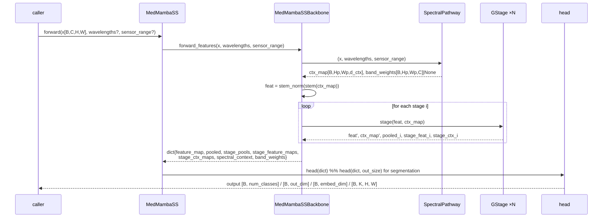
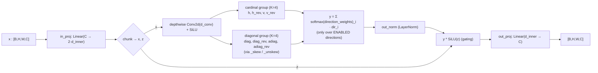
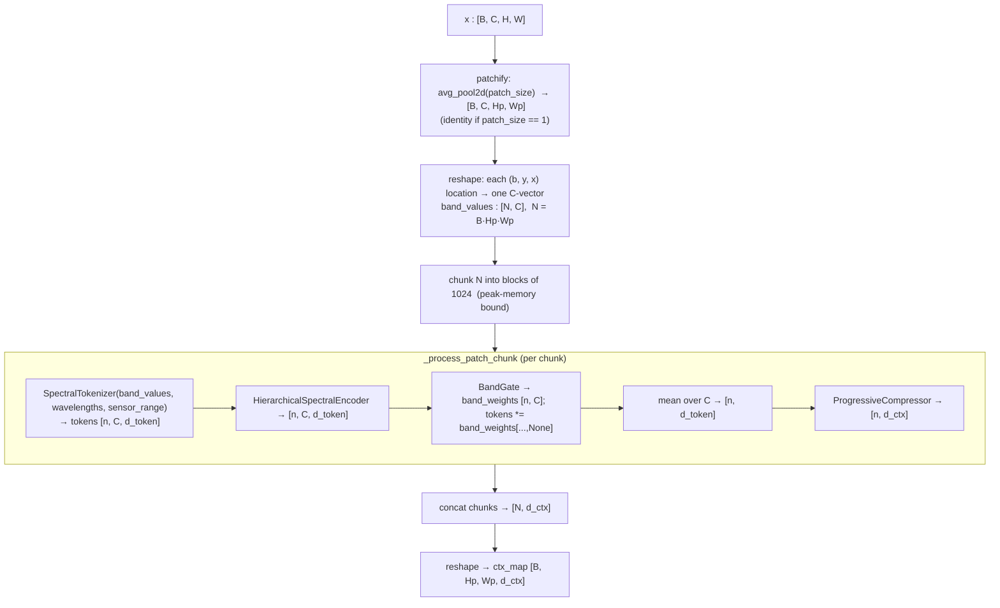
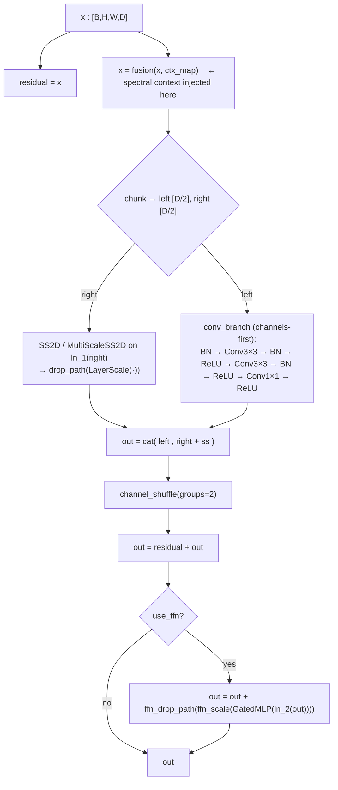

# `medmamba_ss_trm.py` — MedMamba‑SS v3 Architecture

> **File:** [`medmamba_ss_trm.py`](../medmamba_ss_trm.py) · ~1450 lines · pure architecture module (no training code, no I/O)
> **One‑line summary:** a *sensor‑agnostic* spectral–spatial backbone that accepts an image cube of **any channel count** `C` and produces a classification / regression / embedding / segmentation output, optionally conditioned on the physical wavelengths of each band.

---

## Table of contents

1. [What problem it solves](#1-what-problem-it-solves)
2. [Mental model / big picture](#2-mental-model--big-picture)
3. [End‑to‑end data flow](#3-end-to-end-data-flow)
4. [The configuration object `MedMambaSSTRMConfig`](#4-the-configuration-object-medmambassstrmconfig)
5. [The selective‑scan core (SSM math)](#5-the-selective-scan-core-ssm-math)
6. [The spectral pathway](#6-the-spectral-pathway)
7. [The spatial backbone](#7-the-spatial-backbone)
8. [Spectral ↔ spatial fusion](#8-spectral--spatial-fusion)
9. [Bidirectional refinement (Phases 6–8)](#9-bidirectional-refinement-phases-68)
10. [Task heads](#10-task-heads)
11. [Full worked shape trace](#11-full-worked-shape-trace)
12. [Convenience constructors / presets](#12-convenience-constructors--presets)
13. [Wavelength / sensor awareness (Phases 14–15)](#13-wavelength--sensor-awareness-phases-1415)
14. [Backend abstraction (Phase 17)](#14-backend-abstraction-phase-17)
15. [Class / function index](#15-class--function-index)
16. [Design characteristics, gotchas & extension points](#16-design-characteristics-gotchas--extension-points)

---

## 1. What problem it solves

Hyperspectral imaging (HSI) sensors differ: one camera produces 826 bands over 400–1000 nm, another 31 bands over 420–720 nm, an RGB camera 3 "bands". Classical CNNs bake `C` into the first convolution's weight shape (`Conv2d(C, …)`), so a model trained on one sensor cannot even *run* on another.

**MedMamba‑SS removes `C` from every parameter shape.** The number of channels only ever appears as a *sequence length* fed through weight‑shared operators (a shared `Linear(1 → d_token)` band embedder, `Conv1d` along the band axis, a bidirectional Mamba scan over bands). The same trained weight set therefore *executes* on any `C`; whether it *transfers well* across very different spectral ranges is what the optional wavelength metadata (Phases 14–15) is for.

It builds on:

* **MedMamba** (Yue et al., <https://github.com/YubiaoYue/MedMamba>) — the SS2D 2‑D selective scan, the SS‑Conv‑SSM block, hierarchical `PatchMerging2D` stages.
* **MedMamba‑SS v1/v2** — patch‑wise spectral tokenization, spectral `Conv1d`, multi‑scale spectral branch, progressive compression.
* **v3 plan** (`improve-prompt_v3.plan.md`) — the 17 "phases" the docstring maps out (generalized scan registry, pluggable fusion, continuous wavelength encoding, config dataclass, backend registry, …).

The docstring's **phase → implementation table** is the authoritative feature map; this document explains the *mechanism*.

---

## 2. Mental model / big picture

The single most important thing to understand: **MedMamba‑SS is spectral‑first.**

```mermaid
flowchart TD
    X["Input cube&nbsp;&nbsp;x : [B, C, H, W]<br/>(C = arbitrary #bands)"]
    subgraph SP["SPECTRAL PATHWAY  (per spatial location)"]
        direction TB
        PATCH["patchify&nbsp;→&nbsp;[B, C, Hp, Wp]<br/>(avg-pool by patch_size; identity if patch_size=1)"]
        TOK["SpectralTokenizer<br/>shared Linear(1→d_token) + wavelength PE"]
        ENC["HierarchicalSpectralEncoder<br/>ResidualSpectralBlock ×k → SpectralMamba → ×k"]
        GATE["BandGate (soft/sparse) — dynamic band selection"]
        POOL["mean over C bands → [N, d_token]"]
        COMP["ProgressiveCompressor → [N, d_ctx]"]
    end
    CTX["spectral context map<br/>ctx : [B, Hp, Wp, d_ctx]"]
    STEM["stem: Linear(d_ctx → dims[0])"]
    subgraph BB["SPATIAL BACKBONE  (hierarchical Mamba)"]
        direction TB
        S0["GStage 0  (dims[0], depth[0])"]
        S1["GStage 1  (dims[1])  ↓2×"]
        S2["GStage 2  (dims[2])  ↓2×"]
        S3["GStage 3  (dims[3])  ↓2×"]
    end
    HEAD["Task head<br/>(classification / regression / embedding / segmentation)"]
    OUT["output"]

    X --> PATCH --> TOK --> ENC --> GATE --> POOL --> COMP --> CTX
    CTX --> STEM --> S0 --> S1 --> S2 --> S3 --> HEAD --> OUT
    CTX -. "fused into every block<br/>(FiLM / gated / x-attn / …)" .-> S0
    CTX -. .-> S1
    CTX -. .-> S2
    CTX -. .-> S3
    S0 -. "SpectralContextUpdater<br/>writes spatial features back" .-> CTX
```

1. **Spectral pathway** collapses each spatial location's full `C`‑band spectrum into a compact `d_ctx`‑dim descriptor. The grid of descriptors is the **spectral context map** `ctx ∈ ℝ^{B×Hp×Wp×d_ctx}`.
2. The spatial backbone's *input feature map* is a linear projection of `ctx` (`stem`). So the spatial Mamba scans and convolutions operate over a grid of **spectral descriptors**, not raw pixels.
3. At **every block** the current spectral context is re‑injected via a pluggable **fusion** operator (FiLM, gated, cross‑attention, …).
4. After **every stage** the just‑computed spatial features are written *back* into the context map (`SpectralContextUpdater`), and per‑stage **band re‑selection** (`StageBandSelector`) re‑weights the context channels — a two‑way spectral ⇄ spatial loop that is refreshed with depth.
5. A task head reads a **multi‑scale pooled** summary (every stage's global‑average pool, concatenated with the final spectral summary).

---

## 3. End‑to‑end data flow

`MedMambaSS.forward(x, wavelengths=None, sensor_range=None)`:



`forward_features` returns a **superset dict** so arbitrary heads/decoders can be attached:

| key | shape | meaning |
|---|---|---|
| `feature_map` | `[B, H_last, W_last, dims[-1]]` | final stage spatial map (channels‑last) |
| `pooled` | `[B, dims[-1]]` | global average pool of `feature_map` |
| `stage_pools` | list of `[B, dims[i]]` | GAP of each stage's output — used by the classification head |
| `stage_feature_maps` | list of `[B, Hi, Wi, dims[i]]` | dense per‑stage maps (for decoders / multi‑scale) |
| `stage_ctx_maps` | list of `[B, Hi, Wi, d_ctx]` | spectral context after each stage's refinement |
| `spectral_context` | `[B, d_ctx]` | mean of the final context map |
| `band_weights` | `[B, Hp, Wp, C]` or `None` | per‑location soft band‑importance from `BandGate` |

---

## 4. The configuration object `MedMambaSSTRMConfig`

Everything the architecture does is driven by one frozen‑style `@dataclass`. Grouped:

### Spatial backbone
| field | default | notes |
|---|---|---|
| `dims` | `(96, 192, 384, 768)` | channel width per stage. **Invariant:** `dims[i+1] == 2*dims[i]` (enforced in `.validate()` because `PatchMerging2D` always doubles). |
| `depths` | `(2, 2, 4, 2)` | `GBlock` count per stage. `len(depths) == len(dims)`. |
| `d_state` | `16` | SSM latent state size `N`. |
| `scan_backend` | `"pure_pytorch"` | key into `SCAN_BACKENDS`. |

### Universal input layer / tokenizer (Phases 1, 14, 15)
| field | default | notes |
|---|---|---|
| `patch_size` | `4` | spatial avg‑pool factor before spectral tokenization. `1` = per‑pixel (typical for small HSI patches). |
| `d_token` | `32` | spectral token width. |
| `use_wavelength_metadata` | `True` | if `False`, `wavelengths=` passed to `forward` is ignored. |
| `sensor_reference_range` | `None` | `(lo_nm, hi_nm)` fixed physical range for cross‑sensor‑consistent normalization. |

### Spectral encoder (Phases 2–5, 8, 12)
| field | default | notes |
|---|---|---|
| `spectral_depth` | `3` | total `ResidualSpectralBlock`s (split ~half before / half after the `SpectralMamba`). |
| `spectral_kernel_sizes` | `(3,)` | `Conv1d` kernel(s) along the band axis. |
| `spectral_multiscale` | `False` | if `True`, forces kernels `(3, 5, 9)` with attention branch‑fusion. |
| `squeeze_excitation` | `False` | add `SqueezeExcite1D` in each spectral block. |
| `dynamic_band_selection` | `True` | enable `BandGate` (input) + `StageBandSelector` (per stage). |
| `band_selection_mode` | `"soft"` | `"soft"` = sigmoid; `"sparse"` = steep sigmoid around a **learnable threshold** (≈ differentiable top‑k). |
| `compression_dims` | `(128, 64)` | intermediate widths of `ProgressiveCompressor`; final stage always projects to `d_ctx`. |
| `d_ctx` | `64` | spectral context width — the "currency" flowing between the two pathways. |

### Spatial scan (Phases 9–10)
| field | default | notes |
|---|---|---|
| `scan_directions` | `4` | `4` → `[h, h_rev, v, v_rev]`; `8` → + 4 diagonals; or an explicit subset list, e.g. `["h", "diag", "adiag_rev"]`. |
| `spatial_multiscale` | `False` | use `MultiScaleSS2D` (parallel conv receptive fields) instead of plain `SS2D`. |
| `spatial_scales` | `(3, 5)` | the receptive fields when `spatial_multiscale`. |

### Fusion (Phase 11)
| field | default | notes |
|---|---|---|
| `fusion_type` | `"film"` | one string for all stages, **or** a list of length `len(dims)` for per‑stage strategies. Valid: `film`, `gated`, `cross_attention`, `multiplicative`, `residual`. |

### Normalization / residual
| field | default | notes |
|---|---|---|
| `norm_type` | `"layernorm"` | also `"rmsnorm"`, `"groupnorm"` (channels‑last wrapper). |
| `layerscale` / `layerscale_init` | `True` / `1e-4` | per‑channel learnable residual scaling. |
| `drop_path_rate` | `0.1` | stochastic depth, linearly ramped `0 → rate` across all blocks. |
| `use_ffn` | `True` | add a `GatedMLP` (GEGLU) after the token‑mixing in each `GBlock`. |
| `stage_spectral_refinement` | `True` | enable the per‑stage `SpectralContextUpdater`. |

### Helper methods

* `resolved_scan_directions()` → concrete list of direction names.
* `resolved_fusion_types()` → list length `len(dims)` (broadcasts a single string).
* `validate()` → asserts `dims`/`depths` consistency, the `dims[i+1] == 2·dims[i]` rule, valid direction names, valid fusion names, valid `band_selection_mode`/`norm_type`, and that `scan_backend` is registered. Called by `MedMambaSSBackbone.__init__`.

---

## 5. The selective‑scan core (SSM math)

Mamba's *selective state‑space model* is a linear recurrence whose parameters are **input‑dependent** (that's the "selective" part). All scan flavours in this file share one reference kernel.

### 5.1 Continuous SSM → discretized recurrence

A continuous linear SSM over a 1‑D sequence is

$$
h'(t) = A\,h(t) + B\,x(t), \qquad y(t) = C\,h(t) + D\,x(t),
$$

with hidden state $h(t)\in\mathbb R^{N}$. With a per‑step timescale $\Delta_\ell$ (itself a function of the input), the zero‑order‑hold discretization used here is

$$
\bar A_\ell = \exp(\Delta_\ell \, A), \qquad
\bar B_\ell = \Delta_\ell \, B_\ell \, x_\ell,
$$

$$
h_\ell = \bar A_\ell \odot h_{\ell-1} + \bar B_\ell, \qquad
y_\ell = C_\ell \, h_\ell \;(+\; D \odot x_\ell).
$$

$A$ is parameterized as $A=-\exp(A_{\text{logs}})$ (`A_logs` initialised to $\log(1..N)$), i.e. **strictly negative real eigenvalues** → the recurrence is contractive/stable, and $\bar A_\ell = \exp(\Delta_\ell A)\in(0,1)$ acts as a per‑element forget gate.

### 5.2 `_selective_scan_pure_pytorch(...)`

```
xs  : [B, K*D, L]     dts : [B, K*D, L]     As : [K, D, N]
Bs  : [B, K*N, L]     Cs  : [B, K*N, L]     Ds : [K, D]
```

`K` = number of scan directions bundled into one call, `D` = inner width, `N` = state size, `L` = sequence length. It reshapes to `[B,K,D,L]`, adds `dt_projs_bias`, applies `softplus` to `dts` (guarantees $\Delta_\ell>0$), then loops `for l in range(L)` computing `dA_l`, `dB_l`, `x_state`, `y[..., l]` per the equations above.

> **Why the explicit Python loop:** an earlier vectorized version materialised two `[B, K, D, N, L]` tensors (~4 GiB each at `64×64×246`), which OOM‑ed a 16 GiB GPU. Computing `dA/dB` per timestep keeps peak memory at `O(B·K·D·N)`.

### 5.3 `_SelectiveScanParams` — the shared parameter block

`nn.Module` holding the learnable pieces for one scan (any `K`):

| parameter | shape | role |
|---|---|---|
| `x_proj_weight` | `[K, dt_rank + 2·d_state, d_inner]` | projects `xs` → `(Δ, B, C)` |
| `dt_projs_weight` | `[K, d_inner, dt_rank]` | low‑rank Δ up‑projection |
| `dt_projs_bias` | `[K, d_inner]` | Δ bias |
| `A_logs` | `[K, d_inner, d_state]` | log‑parameterized `A` |
| `Ds` | `[K, d_inner]` | skip term |

`run(xs: [B,K,D,L]) → [B,K,D,L]`: `einsum` to get `x_dbl`, `split` into `Δ, B, C`, up‑project `Δ`, set `As = -exp(A_logs)`, call the backend, reshape back. **Everything is cast to fp32** inside `run` regardless of the caller's AMP context (numerical safety).

### 5.4 `SS2D` — 2‑D selective scan with a direction registry (Phase 9)

A 2‑D image has no single canonical scan order, so `SS2D` scans it several ways and learns to combine them.



* Only the groups you actually need are instantiated: `use_cardinal` / `use_diagonal` are derived from the requested direction names. A separate `_SelectiveScanParams(K=4)` per group.
* `direction_weights` is a learnable vector of length `len(names)`; `softmax` over it weights **exactly the enabled** directions.
* **Cardinal** sequences: row‑major (`h`), column‑major via transpose (`v`), plus both reversed (`torch.flip`).
* **Diagonal** sequences: `_skew` shifts row `i` right by `i` so that anti‑diagonals (constant `row+col`) line up in one column; the sequence is read column‑major; `_unskew` reverses it. `main` diagonals use `_skew(flip(x))`.
* Final gating `y * SiLU(z)` and `out_proj` mirror the Mamba block.

### 5.5 `MultiScaleSS2D` (Phase 10)

`len(scales)` parallel `SS2D` branches with different depthwise `d_conv`. A `Linear(d_model → len(scales))` on the spatial‑mean produces a per‑sample softmax gate; output is the gated sum. Used when `cfg.spatial_multiscale`.

### 5.6 `SpectralMamba` — bidirectional scan along the band axis

Input `[N, C, d_model]` (`N` arbitrary batch of spectral‑token sequences, `C` = bands). `in_proj` → `x, z`; scan `x` **forwards and flipped** (`K=2`); recombine `w₀·y_fwd + w₁·flip(y_bwd)`; gate by `SiLU(z)`; `out_proj`. This is what models long‑range dependency between *non‑adjacent* wavelengths.

---

## 6. The spectral pathway

`SpectralPathway(cfg)` — turns `x : [B, C, H, W]` into `(ctx_map : [B, Hp, Wp, d_ctx], band_weights)`.

### 6.1 Steps



Key point: **each spatial location is described by its own spectrum**, and the pathway compresses that spectrum to `d_ctx` numbers. `patch_size > 1` first *spatially averages* `patch_size × patch_size` blocks, so a "location" is then a super‑pixel.

### 6.2 `SpectralTokenizer` (Phase 1) — the channel‑agnostic core

```python
self.value_embed = nn.Linear(1, d_token)   # shared across ALL bands
tokens = self.value_embed(band_values.unsqueeze(-1))   # [N, C, d_token]
tokens = tokens + positional_encoding                  # continuous (wavelengths) or index-based
```

Because `value_embed` maps a **single scalar** to `d_token`, `C` never enters a weight shape. Positional encoding:

* **wavelengths given** → `continuous_wavelength_encoding(normalize_wavelengths(wl, sensor_range), d_token)` — sinusoids keyed on the *physical* (normalized) wavelength value, so irregular spacing / missing bands are represented faithfully.
* **no wavelengths** → `index_positional_encoding(C, d_token)` — sinusoids keyed on band index (v1/v2 behaviour).

### 6.3 `ResidualSpectralBlock` (Phases 3–5)

`norm → transpose to [N, d_token, C] → parallel Conv1d(k) branches along the band axis → (multi‑scale: softmax attention over branches) → GELU → transpose back → Linear proj → optional SqueezeExcite1D → + residual`.

The `Conv1d` operates **along `C`**, i.e. it convolves neighbouring wavelengths — a genuine *spectral* convolution, weight‑shared across all bands.

### 6.4 `HierarchicalSpectralEncoder`

```
pre_blocks  (⌈depth/2⌉ × ResidualSpectralBlock)
   ↓
x = x + SpectralMamba(mamba_norm(x))     # long-range band dependency
   ↓
post_blocks (⌈depth/2⌉ × ResidualSpectralBlock)
```

### 6.5 `BandGate` (Phase 8, input‑level dynamic band selection)

`Linear(d_token → 1)` → per‑band logit.
* `"soft"`: weight = $\sigma(\text{logit})$.
* `"sparse"`: weight = $\sigma\big(\tau\,(\text{logit} - \theta)\big)$ with **learnable** threshold $\theta$ and fixed temperature $\tau=10$ — a differentiable approximation of hard thresholded selection.

Tokens are multiplied by these weights before pooling; the weights are also surfaced as `band_weights` in the output dict for interpretability.

### 6.6 `ProgressiveCompressor` (Phase 12)

A stack of `Linear → GELU` steps: `d_token → compression_dims[0] → … → d_ctx`. Staged bottleneck rather than one big projection.

---

## 7. The spatial backbone

### 7.1 `PatchMerging2D`

`[B, H, W, C]` → pad odd dims → gather the 4 spatial‑phase sub‑grids `x[0::2,0::2], x[1::2,0::2], x[0::2,1::2], x[1::2,1::2]` → concat to `[B, H/2, W/2, 4C]` → `norm` → `Linear(4C → 2C)`. **Halves spatial resolution, doubles channels** (hence the config invariant).

### 7.2 `GBlock` — the SS‑Conv‑SSM block (channels‑last `x : [B, H, W, D]`)



* **`fusion(x, ctx_map)` runs first**, on the full width — this is where the spectral context enters every block.
* The channel split sends **half** the width through the long‑range `SS2D` selective scan and the **other half** through a local depthwise‑style conv stack (the MedMamba "SS‑Conv" idea). `channel_shuffle(groups=2)` mixes the two halves so the split isn't permanent within a block.
* `ReLU` in `conv_branch` is the activation that `training/activation_patch.py` swaps to `LeakyReLU` at train time (Stage‑A "Correctness"); `SiLU`/`GELU` elsewhere are left alone.

### 7.3 `GStage`

`depth × GBlock`, plus (optionally) a `SpectralContextUpdater` and a `StageBandSelector`, plus (on all but the last stage) a `PatchMerging2D` for `feat` and an `avg_pool2d` for `ctx`.

`forward(x, ctx_map)`:

1. `ctx_aligned = align_ctx_to(ctx_map, H, W)` — bilinear‑resize the context to the current feature resolution.
2. `ctx_aligned = stage_band_selector(ctx_aligned)` — **per‑stage** SE‑style re‑gating of context channels (Phase 8).
3. `for blk in blocks: x = blk(x, ctx_aligned)`.
4. `pooled = x.mean((1, 2))` — this stage's contribution to the classification head.
5. `ctx_aligned = ctx_updater(ctx_aligned, x)` — **spatial → spectral feedback** (Phase 6/7).
6. downsample `x` (PatchMerging) and `ctx` (avg‑pool) if not the last stage.
7. return `(x, ctx_aligned, pooled, stage_feature_map=x_before_downsample, stage_ctx_map)`.

### 7.4 `MedMambaSSBackbone`

Constructs `SpectralPathway`, `stem = Linear(d_ctx → dims[0])`, `stem_norm`, and one `GStage` per `(dim, depth)` (downsampling on all but the last). Drop‑path rates are `torch.linspace(0, drop_path_rate, sum(depths))` sliced per stage. `_init_weights`: truncated‑normal `Linear`, ones/zeros `LayerNorm`.

---

## 8. Spectral ↔ spatial fusion

`make_fusion(name, spatial_dim, ctx_dim)` builds one of five operators, all with signature `forward(spatial : [B,H,W,D], ctx : [B,H,W,ctx_dim]) → [B,H,W,D]`:

| name | formula | init | character |
|---|---|---|---|
| `film` | $\text{out} = \text{spatial}\odot(1+\gamma) + \beta$, $\;[\gamma,\beta]=W\,\text{ctx}$ | $W,b=0$ → identity | feature‑wise affine modulation (FiLM) |
| `gated` | $\text{out} = \text{spatial} + \sigma(W_g[\text{spatial},\text{ctx}])\odot W_p\,\text{ctx}$ | — | additive with a learned gate |
| `multiplicative` | $\text{out} = \text{spatial}\odot\big(1 + \sigma(W\,\text{ctx})\big)$ | $W,b=0$ → ×1 | pure multiplicative modulation |
| `residual` | $\text{out} = \text{spatial} + W\,\text{ctx}$ | $W,b=0$ → identity | simplest possible |
| `cross_attention` | MHA: $Q=\text{spatial}$, $K,V=W_c\,\text{ctx}$; `LayerNorm(spatial + MHA)` | — | 4‑head, most expressive/expensive |

Zero‑initialised fusions start as the identity so training doesn't have to "undo" a random spectral perturbation early on. `fusion_type` may be a single name (all stages) or a per‑stage list.

> `medmamba_ss_efficient.py` extends this table with lightweight `se_gate` / `eca` / `none` via `training/lightweight_attention.py` — those names are only valid on the `efficient` architecture.

---

## 9. Bidirectional refinement (Phases 6–8)

Two mechanisms make the spectral ⇄ spatial coupling *two‑way* and *depth‑dependent*:

* **`SpectralContextUpdater(spatial_dim, ctx_dim)`** — after a stage's blocks run, it does
  $$\text{ctx}' = \text{norm}\!\big(\text{ctx} + \sigma(W_g\,\text{ctx})\odot W_p\,\text{spatial}\big),$$
  i.e. the spatial features (which have now "seen" the spectral context) are gated back into the context map. Enabled by `stage_spectral_refinement`.
* **`StageBandSelector(ctx_dim)`** — at the *start* of each stage, an SE‑style gate `ctx ← ctx ⊙ σ(MLP(mean_{H,W} ctx))` recomputes which context channels matter, given the depth and the current content. Enabled by `dynamic_band_selection`.

Together with the input‑level `BandGate`, "which bands matter" is answered **once at the input and again at every stage**, and "what the spectrum should say" is updated by spatial evidence after every stage.

---

## 10. Task heads

`pooled_dim = sum(dims) + d_ctx` for the classification family (multi‑scale readout).

| head | reads | computation | output |
|---|---|---|---|
| `ClassificationHead` | `stage_pools` + `spectral_context` | `concat → norm → Linear(pooled_dim → pooled_dim//2) → GELU → Dropout(0.1) → Linear(→ num_classes)` | `[B, num_classes]` |
| `RegressionHead` | same | `ClassificationHead` with `num_classes = out_dim` | `[B, out_dim]` |
| `EmbeddingHead` | same | `concat → norm → Linear(→ embed_dim) → L2‑normalize` | `[B, embed_dim]` (unit sphere) |
| `SegmentationHead` | `feature_map` | `Linear → GELU → Linear(→ K) → permute → bilinear upsample to input H×W` | `[B, K, H, W]` |

`MedMambaSS(cfg, task, num_classes, **head_kwargs)` picks the head; `forward` calls `head(out)` (or `head(out, out_size=x.shape[-2:])` for segmentation).

---

## 11. Full worked shape trace

`medmamba_ss_hsi_small(num_classes=6)` on `x = torch.randn(2, 826, 11, 11)` (2 patches, 826 bands, 11×11 spatial):

Config: `dims=(64,128,256)`, `depths=(2,2,2)`, `d_state=8`, `d_ctx=64`, `patch_size=1`, `spectral_depth=3`, `d_token=32`, `compression_dims=(128,64)`.

| step | tensor | shape |
|---|---|---|
| input | `x` | `[2, 826, 11, 11]` |
| `patchify` (patch_size 1 → identity) | `patches` | `[2, 826, 11, 11]` |
| reshape to per‑location spectra | `band_values` | `[242, 826]`  (N = 2·11·11) |
| `SpectralTokenizer` | `tokens` | `[242, 826, 32]` |
| `HierarchicalSpectralEncoder` | `tokens` | `[242, 826, 32]` |
| `BandGate` | `band_weights` | `[242, 826]` |
| mean over bands | — | `[242, 32]` |
| `ProgressiveCompressor` `32→128→64→64` | `ctx` | `[242, 64]` |
| reshape | `ctx_map` | `[2, 11, 11, 64]` |
| `stem` `Linear(64→64)` + norm | `feat` | `[2, 11, 11, 64]` |
| **GStage 0** (dim 64, depth 2, downsample) | `pooled_0` | `[2, 64]` |
| &nbsp;&nbsp;→ after `PatchMerging2D` | `feat` | `[2, 6, 6, 128]` |
| &nbsp;&nbsp;→ after `downsample_ctx` | `ctx_map` | `[2, 6, 6, 64]` |
| **GStage 1** (dim 128, depth 2, downsample) | `pooled_1` | `[2, 128]` |
| &nbsp;&nbsp;→ | `feat` | `[2, 3, 3, 256]` |
| **GStage 2** (dim 256, depth 2, no downsample) | `pooled_2` | `[2, 256]` |
| `global_pool` | `pooled` | `[2, 256]` |
| `spectral_context` | — | `[2, 64]` |
| `ClassificationHead`: concat `[64, 128, 256, 64]` | `feat` | `[2, 512]` |
| &nbsp;&nbsp;→ MLP `512 → 256 → 6` | **output** | `[2, 6]` |

`sum(dims) + d_ctx = 64 + 128 + 256 + 64 = 512` ✔ (matches `ClassificationHead.pooled_dim`).

The `__main__` block in the file runs exactly this kind of assertion for `C ∈ {1, 3, 31, 826}`, per‑stage fusion lists, every task head, a custom scan‑direction subset, wavelength‑aware vs not, a registered dummy backend, and an odd‑spatial‑size backward pass (asserting **every parameter receives a gradient**).

---

## 12. Convenience constructors / presets

| constructor | `dims` / `depths` | patch | distinctive settings | intended use |
|---|---|---|---|---|
| `medmamba_ss_tiny` | `(96,192,384,768)` / `(2,2,4,2)` | 4 | defaults | RGB / general |
| `medmamba_ss_small` | same dims / `(2,2,8,2)` | 4 | deeper stage 3 | RGB / general |
| `medmamba_ss_base` | `(128,256,512,1024)` / `(2,2,12,2)` | 4 | wider + deeper | larger RGB |
| `medmamba_ss_hsi_small` | `(64,128,256)` / `(2,2,2)` | **1** | `d_state=8`, `d_ctx=64` | small HSI patches (e.g. 11×11×C) |
| `medmamba_ss_research` | `(96,192,384,768)` / `(2,2,4,2)` | 4 | `scan_directions=8`, spatial+spectral multiscale, SE, `band_selection_mode="sparse"`, `cross_attention`, `rmsnorm` | max‑capacity ablation |
| `medmamba_ss_sensor_aware` | `(64,128,256)` / `(2,2,2)` | 2 | `sensor_reference_range=(400., 1000.)` | call with `wavelengths=` / `sensor_range=` |

> The training pipeline does **not** call these directly. [`training/config_presets.py`](../training/config_presets.py) `build_model(architecture, modality, …)` re‑declares the `hsi` / `rgb` presets as plain dicts so `train_example_v13.py` can override `drop_path_rate` / `fusion_type` / `classifier_dropout` before construction — see [`02_train_example_v13.md`](02_train_example_v13.md).

---

## 13. Wavelength / sensor awareness (Phases 14–15)

Optional keyword args threaded through every `forward` / `forward_features`:

* `wavelengths` — `[C]` or `[B, C]` physical band centres in nm. Enables `continuous_wavelength_encoding` instead of index‑based PE.
* `sensor_range` — `(lo_nm, hi_nm)`. When given, `normalize_wavelengths` maps into this **fixed** physical coordinate system, so two sensors with different `C`/spacing but overlapping ranges land on a shared axis. When omitted, wavelengths are self‑normalized by their own min/max (still order‑ and spacing‑aware).

```python
model = medmamba_ss_sensor_aware(num_classes=4)
wl = torch.linspace(450, 900, steps=20)              # nm
out = model(x, wavelengths=wl, sensor_range=(400., 1000.))
```

If `cfg.use_wavelength_metadata is False`, `wavelengths` is ignored (forced to `None`). In the training pipeline, `wavelengths.npy` (written by the HSI prep script) is loaded by `discover_data` and passed to the **trainer** for *spectral reconstruction metrics*, but note the current `train_example_v13.py` model wrappers call the backbone **without** `wavelengths=` at train time — see the gotchas in [`02_train_example_v13.md`](02_train_example_v13.md#known-limitations--gotchas).

---

## 14. Backend abstraction (Phase 17)

```python
SCAN_BACKENDS = {
    "pure_pytorch": _selective_scan_pure_pytorch,     # reference, always available
    "cuda":   <raises NotImplementedError>,           # slot for a real kernel
    "triton": <raises NotImplementedError>,
}
register_scan_backend(name, fn)   # fn must match _selective_scan_pure_pytorch's signature
get_backend(name)                 # raises ValueError if unknown (called by cfg.validate())
benchmark_backend(model, input_shape, n=3, device="cpu")  # (mean_seconds, out_shape)
```

Every scan (`SS2D`, `MultiScaleSS2D`, `SpectralMamba`) takes `backend=cfg.scan_backend` and resolves it once at construction. To plug in a fused CUDA/Triton `selective_scan`, register it under a name and set `cfg.scan_backend` — no other code changes.

---

## 15. Class / function index

| symbol | kind | role |
|---|---|---|
| `MedMambaSSTRMConfig` | dataclass | all hyper‑parameters + `validate()` / `resolved_*()` |
| `_selective_scan_pure_pytorch` | fn | reference discretized SSM recurrence |
| `SCAN_BACKENDS`, `register_scan_backend`, `get_backend`, `benchmark_backend` | registry | Phase‑17 backend abstraction |
| `RMSNorm`, `_GroupNormChannelsLast`, `make_norm` | modules | normalization options |
| `DropPath`, `LayerScale`, `GatedMLP` | modules | residual‑branch utilities (stochastic depth, learnable scale, GEGLU FFN) |
| `_SelectiveScanParams` | module | shared learnable SSM parameters + `run()` |
| `_skew`, `_unskew` | fn | diagonal‑scan coordinate transform |
| `SS2D` | module | 2‑D selective scan with direction registry (Phase 9) |
| `MultiScaleSS2D` | module | parallel‑receptive‑field SS2D (Phase 10) |
| `SpectralMamba` | module | bidirectional scan along the band axis |
| `index_positional_encoding`, `normalize_wavelengths`, `continuous_wavelength_encoding` | fn | spectral positional encoding (Phases 14–15) |
| `SpectralTokenizer` | module | shared `Linear(1→d_token)` band embedder (Phase 1) |
| `SqueezeExcite1D` | module | SE over token dim (Phase 3) |
| `ResidualSpectralBlock` | module | `Conv1d`‑along‑bands residual block (Phases 3–5) |
| `HierarchicalSpectralEncoder` | module | conv blocks → `SpectralMamba` → conv blocks |
| `ProgressiveCompressor` | module | staged bottleneck `d_token → d_ctx` (Phase 12) |
| `BandGate` | module | input‑level dynamic band selection (Phase 8) |
| `StageBandSelector` | module | per‑stage context re‑gating (Phases 6–8) |
| `SpectralPathway` | module | the whole spectral branch → `ctx_map`, `band_weights` |
| `SpectralSpatialFusion` + `FiLM/GatedAdditive/Multiplicative/Residual/CrossAttention Fusion`, `make_fusion` | modules | Phase‑11 pluggable fusion |
| `SpectralContextUpdater`, `align_ctx_to`, `downsample_ctx` | module/fn | spatial→spectral feedback + resolution bookkeeping |
| `channel_shuffle`, `PatchMerging2D` | fn/module | ShuffleNet mixing, hierarchical downsample |
| `GBlock`, `GStage`, `MedMambaSSBackbone` | modules | the spatial backbone |
| `ClassificationHead`, `RegressionHead`, `EmbeddingHead`, `SegmentationHead`, `HEADS` | modules | task heads |
| `MedMambaSS` | module | backbone + head; the public model class |
| `medmamba_ss_tiny/small/base/hsi_small/research/sensor_aware` | fn | presets |

---

## 16. Design characteristics, gotchas & extension points

**Characteristics**

* **Channel‑agnostic by construction** — verified in `__main__` by running one model instance on `C ∈ {1, 3, 31}` and a separate one on `C = 826`.
* **Spectral‑first** — the spatial backbone never sees raw pixels, only the grid of compressed spectral descriptors, continually re‑fused with fresh spectral context.
* **Everything numerically sensitive runs in fp32** — `_SelectiveScanParams.run` and the SSM kernel cast to `.float()` regardless of AMP.
* **Peak‑memory conscious** — the per‑timestep scan loop and the 1024‑patch chunking in `SpectralPathway` both exist specifically to fit a 16 GiB GPU; see [`training/spectral_checkpoint.py`](../training/spectral_checkpoint.py) for the train‑time complement.
* **`medmamba_ss_trm.py` is deliberately training‑framework‑free.** Activation swaps, gradient checkpointing, reconstruction heads, and preset overriding all live in `training/` and monkey‑patch or wrap the model at runtime — so the architecture file stays a clean reference.

**Gotchas**

* `dims` **must** satisfy `dims[i+1] == 2·dims[i]` — anything else fails `validate()`.
* Integer `scan_directions` must be exactly `4` or `8`; any other subset must be an explicit list.
* `fusion_type` as a list must have length `len(dims)`.
* `patch_size` interacts with spatial resolution: with `patch_size=4` and a 32×32 input you get an 8×8 feature map before stage downsampling; a 3‑stage config would then reach 2×2. Small HSI patches use `patch_size=1`.
* The pure‑PyTorch scan is `O(L)` Python‑loop iterations — fine for `L = H·W` on small patches or `L = C` bands, but the reason a real fused kernel would help throughput.
* `SegmentationHead` upsamples from the **final** (most‑downsampled) feature map only — for fine masks you'd want a decoder over `stage_feature_maps`.

**Extension points**

* New fusion strategy → subclass `SpectralSpatialFusion`, add to `make_fusion`'s table, add the name to `FUSION_TYPES`.
* New scan backend → `register_scan_backend("mykernel", fn)`, set `cfg.scan_backend="mykernel"`.
* New task → add a head class, register in `HEADS`, extend `MedMambaSS.__init__`'s `if task == …` ladder.
* New backbone variant → subclass `GBlock`/`GStage`/`MedMambaSSBackbone`/`MedMambaSS` and override only what changes (this is exactly what `medmamba_ss_fullchannel.py` and `medmamba_ss_efficient.py` do).

---

### Related documents
* [`02_train_example_v13.md`](02_train_example_v13.md) — how this model is built, wrapped, and trained.
* [`05_shared_infrastructure.md`](05_shared_infrastructure.md) — the `training/` support modules.
* [`README.md`](README.md) — pipeline overview and how the four files connect.

---

## Appendix (v17) — what in `medmamba_ss_trm.py` is unreachable, and why it stays

`medmamba_ss_trm.py` is on `test_frozen_files_untouched.py:FROZEN_GLOBS`. The following are
reachable from no current entry point (checked by AST reachability from
`train_example_v16_optimal_recon.py`), and **must not be deleted anyway** — the freeze
forbids edits, and none of them costs anything at runtime:

| symbol | line | status |
|---|---|---|
| `benchmark_backend` | 143 | referenced only inside this file |
| `medmamba_ss_research` | 2018 | convenience constructor, unused |
| `medmamba_ss_sensor_aware` | 2031 | convenience constructor, unused |
| `_skew` / `_unskew` | 489 / 500 | diagonal scans only; the default is `scan_directions=4` |
| `MultiScaleSS2D` | 623 | only `medmamba_ss_fullchannel.py` references it |
| `SegmentationHead`, `RegressionHead`, `EmbeddingHead` | 1489–1512 | `task="classification"` is the only supported task |

Recorded so the next reader does not re-derive it, and does not open a "dead code" ticket
against a frozen file.

**Two live paths worth knowing about**, both discovered while profiling v17:

* `HierarchicalSpectralEncoder` (line 919) **always** contains a `SpectralMamba`, and there
  is no config flag to remove it. On HSI that is `_selective_scan_pure_pytorch`'s Python
  loop over the *band* count, 32 iterations of four small einsums per chunk. Adding a
  `spectral_mamba: bool` field would mean editing a frozen file; if that ablation is ever
  wanted, subclass into a new `medmamba_ss_trm_v17.py`.
* `RecursiveCore.f` (line 1745) gradient-checkpoints every call. v17 measured turning that
  off: **12% faster for 4.8× the memory, and it OOMs at batch 64.** The hint in
  `medmamba_ss_trm_default`'s docstring points the other way, but it was written for
  `trm_mixer="ss2d"` and does not transfer to the `mlp` mixer every real run uses.
  See [`14_performance_and_progress.md`](14_performance_and_progress.md).
