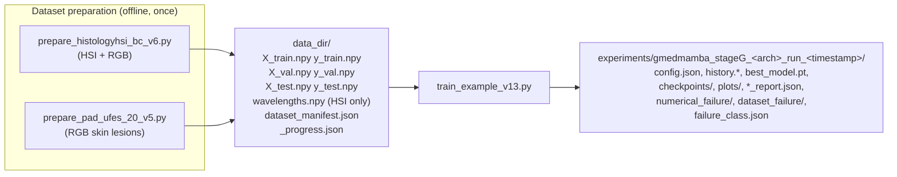
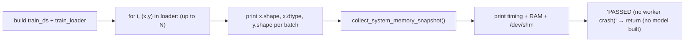
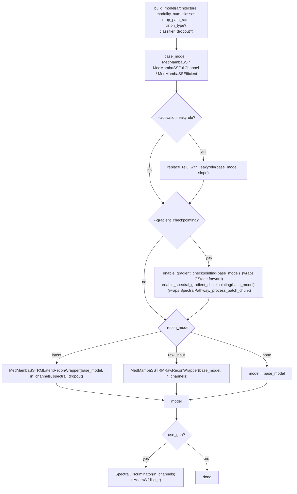
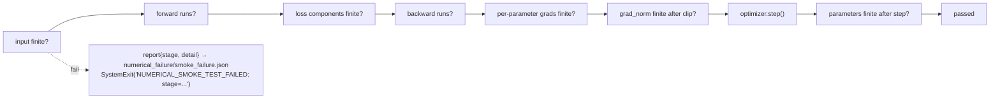
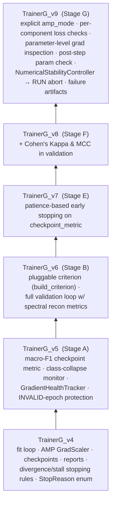
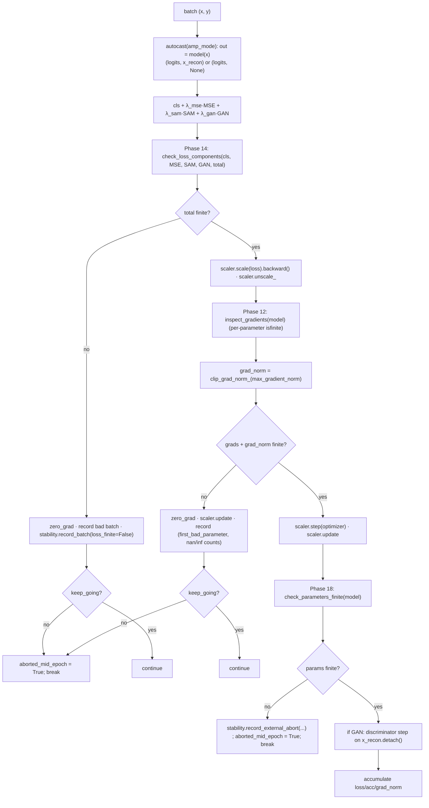

# `train_example_v13.py` — Stage‑G ("Stability") Training Entry Point

> **File:** `train_example_v13.py` (deleted 2026-10-01; `git show a94ccc3:archive/train_example_v13.py`) · ~830 lines
> **One‑line summary:** the command‑line entry point that loads a prepared `.npy` dataset, **validates it hard before touching a GPU**, builds a MedMamba‑SS model (+ optional reconstruction / GAN heads), and trains it with an aggressively defensive trainer that classifies and aborts on numerical instability.
> **Lineage:** v13 = v12 + "v13.1 remediation". v12 carried everything from Stages A–F. This file is a *new versioned entry point* (repo convention) rather than an edit of v12.

> **Reading this for `train_example_v14.py`?** Use
> [`07_parameters_v14.md`](07_parameters_v14.md) instead of §6 below. That reference covers
> `--architecture recursive` and the nine `--trm_*` flags this document predates, records the
> five parser defaults v14 changed, and adds a per‑architecture applicability matrix. v14 also
> names its run directories differently (`<ts>_<dataset>_<arch>_<modality>_<key>_bs<N>_<amp>`,
> not `gmedmamba_stageG_<arch>_run_<ts>`). Everything else here — the startup gates, failure
> taxonomy and exit codes — applies to v14 unchanged.

---

## Table of contents

1. [Purpose & context](#1-purpose--context)
2. [Where it sits in the pipeline](#2-where-it-sits-in-the-pipeline)
3. [The 10 gates — startup sequence](#3-the-10-gates--startup-sequence)
4. [`_main()` control flow diagram](#4-_main-control-flow-diagram)
5. [Module dependency map](#5-module-dependency-map)
6. [CLI reference](#6-cli-reference)
7. [`--safe_mode` and `--loader_test`](#7---safe_mode-and---loader_test)
8. [Dataset validation & failure taxonomy](#8-dataset-validation--failure-taxonomy)
9. [Model assembly](#9-model-assembly)
10. [The loss function](#10-the-loss-function)
11. [The numerical smoke test](#11-the-numerical-smoke-test)
12. [The trainer: `TrainerG_v9` and its lineage](#12-the-trainer-trainerg_v9-and-its-lineage)
13. [The numerical‑stability controller](#13-the-numericalstability-controller)
14. [Output artifacts](#14-output-artifacts)
15. [Worked examples](#15-worked-examples)
16. [Exit codes / failure classes](#16-exit-codes--failure-classes)
17. [Known limitations & gotchas](#17-known-limitations--gotchas)

---

## 1. Purpose & context

This entry point exists because earlier runs died with **`SIGBUS`** (and NaN/Inf gradients) that were hard to diagnose. The v12/v13 "Definitive Training Stability & SIGBUS Remediation" plan attacks that on several independent fronts, and this file is the orchestrator:

| concern | mechanism in this file |
|---|---|
| DataLoader workers exhausting `/dev/shm` | explicit `--loader_mode {safe,balanced,performance}` policy (default **safe** = 0 workers) |
| corrupt / truncated `.npy` → main‑process `SIGBUS` | mandatory `.npy` integrity validation **before any mmap/DataLoader** (`DatasetStorageError`, never downgraded) |
| a byte‑truncated file slipping past checks (v13.1) | deterministic header‑offset + on‑disk‑size check; explicit per‑file `status` |
| NaN/Inf gradients | `--amp off` default; per‑component loss checks; parameter‑level gradient inspection; skip‑ratio classification → **run abort** |
| "which failure was this" | every terminal error mapped to one `FailureClass`; `failure_class.json` written |
| reproducibility | full CLI + system + validation state recorded in `config.json` |

The docstring's `Phase N` / `W1…W6` labels are the plan's own numbering; this document explains the runtime behaviour.

---

## 2. Where it sits in the pipeline



* The **HSI prep** script writes into `<out>/hsi/` and `<out>/rgb/`; you point `--data_dir` at one of those subfolders.
* The **PAD‑UFES prep** script writes flat into `<out>/`.
* `train_example_v13.py` auto‑detects **modality** from the presence of `wavelengths.npy`: `hsi` if present, `rgb` otherwise.

---

## 3. The 10 gates — startup sequence

Everything in `_main()` before `trainer.fit()` is a sequence of *gates*. Order matters: **dataset validation is the first gate** (W2), so a corrupt file becomes a clean `DATASET_STORAGE_ERROR` instead of a later `SIGBUS`.

| # | gate | function(s) | on failure |
|---|---|---|---|
| 0 | seeds, thread caps, TF32 | `torch.manual_seed`, `apply_main_process_thread_limits` | — |
| 1 | startup system‑memory snapshot | `log_system_memory("startup")`, `write_system_memory_report` | — (informational) |
| 2 | experiment dir | `setup_experiment_dir` → `experiments/gmedmamba_stageG_<arch>_run_<ts>` | — |
| 3 | **discover** dataset files | `discover_data(data_dir)` (touches only label arrays) | `FileNotFoundError` (with a hint if per‑batch shard dirs exist but no merged `X_train.npy`) |
| 4 | **manifest cross‑check** | `_check_manifest` → `verify_against_manifest` | `DatasetStorageError` (shape/dtype/size/sha256 mismatch); `strict` also requires the manifest to exist |
| 5 | **`.npy` integrity validation** | `validate_dataset(paths, abort_on_failure=True, level=structural\|deep)` | `DatasetStorageError` → `dataset_failure/{failure,validation_report,system_memory}.json`, then re‑raise |
| 6 | **leakage check** | `_run_leakage_check` → `run_full_integrity_check` | `DatasetLeakageError` (if `--abort_on_leakage`); `OSError(EIO)` promoted to `DatasetStorageError` |
| 7 | **class coverage** | `verify_class_coverage({train, validation}, fail_hard=not --allow_missing_classes)` | `ValueError` → `class_coverage_report.json` + `CLASS_COVERAGE_INCOMPLETE` |
| 8 | imbalance report | `write_imbalance_report` → `class_imbalance_report.json` | — (informational) |
| 9 | **build datasets** | `NpyDataset(x, y, storage_mode=--dataset_storage)` wrapped so `ValueError/OSError` → `DatasetStorageError` | `DATASET_LOAD_ERROR` |
| 10 | build DataLoaders + **preflight print** | `train_val_policies`, `DataLoader(...)`, `print_preflight` | — |

If `--loader_test` is set, the run **stops after gate 10** (reads a few batches, prints shapes/timing/RAM/SHM, exits **without building the GPU model**). This is how you bisect the first unstable worker count.

---

## 4. `_main()` control flow diagram

```mermaid
flowchart TD
    START([python train_example_v13.py ...]) --> ARGS["build_arg_parser().parse_args()"]
    ARGS --> SAFE["apply_safe_mode(args)<br/>(if --safe_mode: loader_mode=safe, amp=off,<br/>grad_checkpointing=on, debug_numerics=on,<br/>num_workers=0, smoke_test=on)"]
    SAFE --> SEED["seed torch/np · thread caps · TF32/cudnn"]
    SEED --> SNAP1["log_system_memory('startup')"]
    SNAP1 --> EXPDIR["setup_experiment_dir() → exp_dir"]
    EXPDIR --> DISC["discover_data(data_dir)"]
    DISC --> MANIFEST["_check_manifest()"]
    MANIFEST --> VAL{"--skip_dataset_validation?"}
    VAL -- no --> VALIDATE["validate_dataset(level=structural / deep)<br/>→ dataset_integrity_report.json"]
    VAL -- yes --> WARN["print scientifically_qualified=false warning"]
    VALIDATE --> LEAK["_run_leakage_check() → leakage_report.json"]
    WARN --> LEAK
    LEAK --> COV["verify_class_coverage() → class_coverage_report.json"]
    COV --> IMB["write_imbalance_report()"]
    IMB --> DS["train_ds, val_ds = NpyDataset(...)"]
    DS --> SAMP["sampler / oversample Subset / augmentation wrap"]
    SAMP --> POL["train_val_policies() → train_loader, val_loader"]
    POL --> PRE["print_preflight()"]
    PRE --> LT{"--loader_test?"}
    LT -- yes --> RLT["run_loader_test() → EXIT (no model)"]
    LT -- no --> MODEL["build_model(architecture, modality, num_classes, ...)"]
    MODEL --> ACT["replace_relu_with_leakyrelu (if --activation leakyrelu)"]
    ACT --> GC["enable_gradient_checkpointing + enable_spectral_gradient_checkpointing<br/>(if --gradient_checkpointing)"]
    GC --> WRAP["recon wrapper:<br/>latent → MedMambaSSTRMLatentReconWrapper<br/>raw_input → MedMambaSSTRMRawReconWrapper<br/>none → base_model"]
    WRAP --> GAN["SpectralDiscriminator + disc_optimizer (if use_gan)"]
    GAN --> CRIT["build_criterion(--loss, ...)"]
    CRIT --> OPT["AdamW + CosineAnnealingLR"]
    OPT --> SMOKE{"numerical smoke test on?"}
    SMOKE -- yes --> RUNSMOKE["run_numerical_smoke_test() on a deepcopy<br/>fail → SystemExit NUMERICAL_SMOKE_TEST_FAILED"]
    SMOKE -- no --> CFG
    RUNSMOKE --> CFG["write config.json"]
    CFG --> TRAINER["TrainerG_v9(...)"]
    TRAINER --> SNAP2["log_system_memory('pre-training')"]
    SNAP2 --> RESUME["load_checkpoint (if --resume)"]
    RESUME --> FIT["stop_reason = trainer.fit(max_epochs, start_epoch)"]
    FIT --> CHECK{"stop_reason == TRAINING_ABORTED_NUMERICAL_INSTABILITY?"}
    CHECK -- yes --> EXITNUM["SystemExit (points at numerical_failure/failure.json)"]
    CHECK -- no --> DONE([done])

    classDef gate fill:#fff3cd,stroke:#d39e00;
    class DISC,MANIFEST,VALIDATE,LEAK,COV gate;
```



`main()` wraps `_main()` in `try/except BaseException`: it maps the exception to a `FailureClass` (`classify_exception`, or `USER_INTERRUPTED` for `KeyboardInterrupt`), prints `FAILURE_CLASS=<value>`, writes `<exp_dir>/failure_class.json`, and re‑raises so the process still exits non‑zero.

---

## 5. Module dependency map

```mermaid
flowchart TD
    T["train_example_v13.py"]
    T --> V6["train_example_v6<br/>NpyDataset · discover_data · setup_experiment_dir"]
    T --> V7["train_example_v7<br/>MedMambaSSTRMRawReconWrapper"]
    T --> TR9["training/trainerg_v9<br/>TrainerG_v9"]
    T --> NS["training/numerical_stability<br/>StabilityConfig · run_smoke_test"]
    T --> GAN["training/gan<br/>SpectralDiscriminator · SAMLoss"]
    T --> CC["training/class_coverage · class_imbalance"]
    T --> ACT["training/activation_patch"]
    T --> RH["training/reconstruction_head<br/>MedMambaSSTRMLatentReconWrapper · SpectralDropout"]
    T --> LOSS["training/losses<br/>build_criterion"]
    T --> SMP["training/samplers"]
    T --> AUG["training/augmentation<br/>AugmentationConfig · PRESETS"]
    T --> CP["training/config_presets<br/>build_model"]
    T --> GRC["training/grad_checkpoint · spectral_checkpoint"]
    T --> DLC["training/dataloader_config<br/>train_val_policies"]
    T --> SM["training/system_memory"]
    T --> NPI["training/npy_integrity<br/>validate_dataset · DatasetStorageError"]
    T --> NPA["training/npy_atomic<br/>verify_against_manifest"]
    T --> FT["training/failure_taxonomy<br/>FailureClass · classify_exception"]
    T --> DI["training/dataset_integrity<br/>run_full_integrity_check · DatasetLeakageError"]

    CP --> GM["medmamba_ss_trm / medmamba_ss_fullchannel / medmamba_ss_efficient"]
    RH --> GM
    TR9 --> TR8["trainerg_v8 → v7 → v6 → v5 → v4"]
```



The `training/*` modules are documented in [`05_shared_infrastructure.md`](05_shared_infrastructure.md).

---

## 6. CLI reference

`python train_example_v13.py --data_dir <dir> [options]`

### Core

| flag | default | meaning |
|---|---|---|
| `--data_dir` | *required* | folder with `X_train.npy` etc. (an `hsi/` or `rgb/` subdir for HSI datasets). |
| `--epochs` | `10` | `CosineAnnealingLR` `T_max`. |
| `--batch_size` | `128` | |
| `--lr` / `--disc_lr` | `1e-4` / `1e-4` | AdamW LR for model / discriminator. |
| `--resume` | `None` | path to a checkpoint `.pt`; resumes epoch, optimizer, scheduler, scaler, history. |
| `--seed` | `0` | seeds torch + numpy (+ per‑worker via `worker_init_fn`). |
| `--weight_decay` | `0.05` | AdamW weight decay. |
| `--early_stop_patience` | `None` | epochs without `--checkpoint_metric` improvement before `EARLY_STOPPED_PATIENCE_*`. |

### Architecture

| flag | choices / default | meaning |
|---|---|---|
| `--architecture` | `split` (default), `fullchannel`, `efficient` | which MedMamba‑SS variant (`build_model`). |
| `--fusion_type` | `film gated cross_attention multiplicative residual se_gate eca none` · default `se_gate` | **only** used when `--architecture efficient`. |
| `--activation` | `relu`, `leakyrelu` (default) | post‑hoc `nn.ReLU → nn.LeakyReLU(--leaky_slope)` swap in the conv branch. |
| `--leaky_slope` | `0.01` | |
| `--drop_path_rate` | `None` | overrides the preset's `MedMambaSSTRMConfig.drop_path_rate`. |
| `--classifier_dropout` | `None` | **only** `--architecture efficient` (the plain head's dropout is hardcoded 0.1). |
| `--gradient_checkpointing` | off | wraps every `GStage` + the `SpectralPathway` per‑chunk processing in `torch.utils.checkpoint` (GPU‑activation memory, *not* `/dev/shm`). |

### Reconstruction / GAN (auxiliary objective)

| flag | default | meaning |
|---|---|---|
| `--recon_mode` | `latent` (default), `raw_input`, `none` | `latent` = decode the input cube from the backbone's learned `feature_map` (`MedMambaSSTRMLatentReconWrapper`); `raw_input` = the old architecturally‑wrong decoder‑sees‑only‑`x` path, kept for A/B; `none` = classification only. |
| `--lambda_mse` / `--lambda_sam` / `--lambda_gan` | `1.0` / `0.1` / `0.0` | loss weights (forced to 0 when `--recon_mode none`). |
| `--use_gan` | off | attach `SpectralDiscriminator`; also auto‑on if `--lambda_gan > 0`. If GAN on but `lambda_gan==0`, it's bumped to `0.05`. |
| `--spectral_dropout` | `0.0` | train‑time probability of masking a random band subset on the input (latent mode). |

### Dataset checks

| flag | default | meaning |
|---|---|---|
| `--check_leakage` / `--no_check_leakage` | on | patient/slide + patch content‑hash leakage check. |
| `--abort_on_leakage` / `--allow_leakage` | abort | |
| `--check_class_coverage` / `--no_check_class_coverage` | on | every class present in every split. |
| `--allow_missing_classes` | off | downgrade coverage failure to a warning. |
| `--skip_dataset_validation` | off | **not recommended** — records `scientifically_qualified=false`; a corrupt file can then `SIGBUS`. |
| `--dataset_validation_level` | `structural` (default), `deep` | `structural` = header + on‑disk size + a `seek()/read()` probe of ~19 rows/file; `deep` = additionally read every `X_*.npy` end‑to‑end (catches bad sectors the probes miss). |
| `--dataset_storage` | `auto` (default), `mmap`, `ram` | `auto` = validated mmap, or full RAM load if it comfortably fits; `ram` = recommended for a suspected mmap‑related `SIGBUS`. |
| `--manifest_check` | `auto` (default), `off`, `strict` | cross‑check `<data_dir>/dataset_manifest.json`. |

### DataLoader memory policy (Phases 1/2/9)

| flag | default | meaning |
|---|---|---|
| `--loader_mode` | `safe` (default), `balanced`, `performance` | `safe` = `num_workers=0`, no prefetch/persistence/pin (`/dev/shm` off the critical path); `balanced` = 2 workers, `prefetch_factor=1`; `performance` = 4 workers, `prefetch_factor=2`, persistent, pinned. |
| `--num_workers` / `--prefetch_factor` / `--persistent_workers` / `--no_persistent_workers` / `--pin_memory` / `--no_pin_memory` | `None` | each overrides just that one field of the selected mode. |
| `--cpu_threads` | `None` | caps OMP/MKL/torch threads (main process; workers get their own cap). |

Train and validation get **independent** policies: `train_val_policies` gives validation `min(train_workers, train_workers − 1)` workers, floor 0, never persistent.

### AMP & numerical stability

| flag | default | meaning |
|---|---|---|
| `--amp` | `off` (default), `bf16`, `fp16`, `auto` | `auto` reproduces the old "bf16 if supported else fp16". `off` recommended while chasing NaN/Inf. |
| `--max_gradient_norm` | `1.0` | `clip_grad_norm_` value (also the run's `grad_clip_norm`). |
| `--max_gradient_skip_ratio` | `0.10` | epoch skip‑ratio above which the **run** aborts. |
| `--max_consecutive_bad_batches` | `3` | consecutive skipped batches → run abort. |
| `--max_consecutive_unhealthy_epochs` | `2` | consecutive `critical`/`invalid`/`fatal` epochs → run abort. |
| `--debug_numerics` | off | per‑batch `NONFINITE_LOSS` / `NONFINITE_GRADIENT` diagnostics. |
| `--numerical_smoke_test` | `auto` (default), `on`, `off` | `auto` = on iff `--safe_mode` or `--debug_numerics`. |

### Loss / sampling / augmentation

| flag | default | meaning |
|---|---|---|
| `--loss` | `ce` (default), `weighted_ce`, `focal`, `focal_weighted` | `build_criterion`. |
| `--focal_gamma` | `2.0` | focal loss γ. |
| `--weight_method` | `balanced` (default), `inverse` | class‑weight formula (renormalized to mean 1). |
| `--sampler` | `none` (default), `balanced`, `moderate_oversample` | `balanced` = `WeightedRandomSampler` (shuffle forced off); `moderate_oversample` = top up minority classes to the median count via a `Subset` of repeated indices. |
| `--oversample_target_percentile` | `50.0` | target for `moderate_oversample` (50 = median; →100 = full balance). |
| `--augment_preset` | `none` (default), `light`, `medium`, `custom` | wraps the **train** dataset only in `AugmentedPatchDataset`. `custom` reads the per‑transform flags below. |
| `--spectral_noise_std`, `--spectral_scale_range`, `--spectral_offset_std`, `--band_dropout_prob`, `--band_dropout_max_frac`, `--spectral_mask_prob`, `--spectral_mask_max_width_frac`, `--flip_h_prob`, `--flip_v_prob`, `--rotate90_prob`, `--crop_scale_max_frac` | `0.0` (mostly) | individual augmentation magnitudes for `--augment_preset custom`. |

### Checkpoint selection

| flag | default | meaning |
|---|---|---|
| `--checkpoint_metric` | `f1_macro` | validation metric that picks `best_model.pt` and drives early stopping. |
| `--class_collapse_streak` | `3` | epochs of exactly‑0 recall for a class before a class‑collapse warning. |

### One‑shot modes

| flag | meaning |
|---|---|
| `--safe_mode` | forces the conservative combination (see §7). |
| `--loader_test` | build dataset + loader, read `--loader_test_batches` (default 5) batches, report, exit **without a GPU model**. |

---

## 7. `--safe_mode` and `--loader_test`

### `--safe_mode` (`apply_safe_mode`)

Mutates `args` **in place** (explicit CLI values you also passed still win where the code allows). Sets:

```
loader_mode = "safe"          amp = "off"
num_workers = 0               prefetch_factor = None
persistent_workers = False    pin_memory = False
gradient_checkpointing = True debug_numerics = True
skip_dataset_validation = False   (safe mode never continues past a bad dataset)
numerical_smoke_test: "auto" → "on"
max_gradient_norm: None → 1.0
```

It does **not** force `--dataset_validation_level deep` (the full sequential read stays opt‑in). This is the recommended first post‑fix qualification run:

```bash
python train_example_v13.py --data_dir ./data/hsi --epochs 3 --batch_size 32 \
    --safe_mode --recon_mode latent --lambda_gan 0 --gradient_checkpointing
```

### `--loader_test` (`run_loader_test`)



Bisect the first unstable worker count:

```bash
python train_example_v13.py --data_dir ./data/hsi --loader_test --num_workers 0
python train_example_v13.py --data_dir ./data/hsi --loader_test --num_workers 1
python train_example_v13.py --data_dir ./data/hsi --loader_test --num_workers 2
```

---

## 8. Dataset validation & failure taxonomy

### `validate_dataset` (`training/npy_integrity.py`)

For each of `{X_train, y_train, X_val, y_val}` (where the `X_val`/`y_val` slot is the real validation file if `X_val.npy` exists, otherwise `discover_data` points it at `X_test.npy`/`y_test.npy`), `validate_npy_file` produces an `NpyFileReport` with an explicit `status`:

```
VALID · MISSING · EMPTY · HEADER_INVALID · TRUNCATED · SIZE_MISMATCH · UNREADABLE · IO_ERROR
```

The checks, in order (all **without mmap**, so a bad read is a *catchable* `OSError`, not a `SIGBUS`):

1. exists, size > 0.
2. parse the `.npy` header only → `shape`, `dtype`, `data_offset`.
3. **deterministic size check** — `expected_file_size = data_offset + prod(shape)·itemsize`; `size < expected` → `TRUNCATED` (this is the v13.1 fix — catches a header‑intact but byte‑short file with *no* mmap and *no* full `np.load`).
4. **`seek()/read()` probe** of ~19 rows (first, middle, last, + 16 random). Short read → `TRUNCATED`; `OSError(5)/EIO` → `IO_ERROR` (bad sectors — "more workers won't help"); other `OSError` → `UNREADABLE`.
5. float dtype → a bounded sample is checked finite.
6. `level="deep"` → `full_read_check` reads the whole payload end‑to‑end.

Then X/y pair sample‑count matching. Any failure with `abort_on_failure=True` raises `DatasetStorageError` with a message that explicitly says *"not a DataLoader `/dev/shm` issue — do not retry with more workers"*.

### Failure artifacts

`write_dataset_failure_artifacts(exp_dir, integrity_report, exc, system_snapshot)` writes:

```
<exp_dir>/dataset_failure/
├── failure.json            # failure_class, exception, failing_roles[], x/y match state
├── validation_report.json  # the full DatasetIntegrityReport
└── system_memory.json      # RAM / /dev/shm / GPU snapshot at failure
```

### `FailureClass` mapping (`training/failure_taxonomy.py`)

`classify_exception(e)` maps to one of ~25 `FailureClass` values, e.g. `DATASET_TRUNCATED`, `DATASET_IO_ERROR`, `DATASET_XY_MISMATCH`, `DATASET_MANIFEST_MISMATCH`, `DATASET_LEAKAGE`, `CLASS_COVERAGE_INCOMPLETE`, `DATALOADER_SHM`, `CUDA_OOM`, `NONFINITE_GRADIENT`, `NUMERICAL_SMOKE_TEST_FAILED`, `UNKNOWN_SIGBUS`, `USER_INTERRUPTED`, `TRAINING_COMPLETED`. Written to `<exp_dir>/failure_class.json` by `main()`.

---

## 9. Model assembly



* `modality` = `"hsi"` if `wavelengths` is not `None` else `"rgb"`; selects the preset in `config_presets._PRESETS`. HSI preset: `dims=(64,128,256)`, `depths=(2,2,2)`, `d_state=8`, `d_ctx=64`, `patch_size=1`, `spectral_depth=3`. RGB preset: `dims=(96,192,384,768)`, `depths=(2,2,4,2)`, `patch_size=4`.
* `in_channels = train_ds[0][0].shape[0]` — one sample is read to learn `C`. The recon decoder and discriminator need it.
* **`MedMambaSSTRMLatentReconWrapper`** (`training/reconstruction_head.py`): `forward(x) → (logits, x_recon)` where `x_recon` is decoded from `backbone.forward_features(x)["feature_map"]` (bilinearly upsampled back to the input H×W) — so the reconstruction loss actually back‑props into the shared encoder. Optional `SpectralDropout` on the input.
* **`MedMambaSSTRMRawReconWrapper`** (`train_example_v7.py`): the old path — `x_recon = recon_head(x)`, a tiny conv net that never sees the backbone. Kept only for ablation.

---

## 10. The loss function

The trainer assembles

$$
\mathcal L \;=\; \underbrace{\text{criterion}(\text{logits}, y)}_{\text{classification}}
\;+\; \lambda_{\text{mse}}\,\lVert \hat x - x\rVert_2^2
\;+\; \lambda_{\text{sam}}\,\text{SAM}(x, \hat x)
\;+\; \lambda_{\text{gan}}\,\mathcal L^{G}_{\text{adv}}(\hat x)
$$

* **classification** — `build_criterion(--loss, y_train, num_classes, focal_gamma, weight_method, device)`:
  * `ce` → `nn.CrossEntropyLoss()`
  * `weighted_ce` → `nn.CrossEntropyLoss(weight=w)` with $w_c = \frac{n}{K\,n_c}$ (`balanced`) or $w_c = 1/n_c$ (`inverse`), renormalized to mean 1.
  * `focal` → $\text{FL} = -(1-p_t)^\gamma \log p_t$
  * `focal_weighted` → focal + class weights.
* **MSE** — `F.mse_loss(x_recon, x)`; only when `x_recon is not None` (i.e. `--recon_mode != none`).
* **SAM** — `training/gan.SAMLoss`: mean spectral angle (radians)
  $$\text{SAM}(x,\hat x) = \frac1{HW}\sum_{p}\arccos\!\Big(\text{clamp}\big(\tfrac{\langle x_p,\hat x_p\rangle}{\lVert x_p\rVert\,\lVert\hat x_p\rVert},\,-1+\varepsilon,\,1-\varepsilon\big)\Big)$$
  computed in fp32, per‑vector norm floored, `angle_eps=1e-3` (not `1e-8` — bounds `d/dx arccos` to ≈22 instead of ≈7000, a known NaN‑gradient source), `nan_to_num` as a final floor.
* **GAN** — `generator_adversarial_loss` = BCE‑with‑logits pushing `D(x_recon) → 1`; the discriminator is trained each step with `discriminator_loss` (real→1, fake→0) on `x_recon.detach()`.

`--recon_mode none` ⇒ `lambda_mse = lambda_sam = 0` and `use_gan = False`, so $\mathcal L$ collapses to classification only.

---

## 11. The numerical smoke test

`run_numerical_smoke_test` (W4) runs **before** the real loop, on a `copy.deepcopy` of the model + a throwaway `AdamW`, mirroring the trainer's loss assembly. `training.numerical_stability.run_smoke_test` checks each stage:



On by default under `--safe_mode` / `--debug_numerics` (`--numerical_smoke_test auto`), or force with `on`/`off`. The report dict lands in `config.json` under `numerical_smoke_test`.

---

## 12. The trainer: `TrainerG_v9` and its lineage

`TrainerG_v9` is the tip of a 6‑level inheritance chain, each level adding one concern without rewriting the loop unless it had to:



### `TrainerG_v9._train_one_epoch` — per‑batch logic



At epoch end: `grad_health.finish_epoch()` + `stability.finish_epoch()`. If the stability status is `critical`/`invalid`/`fatal`, the epoch is marked **not valid** (can't become "best"). If `stability.should_abort_run()` returns a reason **or** an abort happened mid‑epoch → `self.stop_reason = "TRAINING_ABORTED_NUMERICAL_INSTABILITY"`, `is_stopped = True`, and `numerical_failure/failure.json` (+ `dataloader_config`, `amp_mode` siblings) is written.

### `_resolve_amp()`

| `--amp` | training path autocast |
|---|---|
| `off` | disabled |
| `bf16` | enabled (CUDA), `torch.bfloat16` |
| `fp16` | enabled (CUDA), `torch.float16` |
| `auto` | enabled (CUDA), `bfloat16` if `torch.cuda.is_bf16_supported()` else `float16` (the old implicit behaviour) |

Validation always uses the legacy "bf16‑if‑supported" logic (it's `@torch.no_grad`, so it can't be a source of non‑finite *gradients*).

### `fit()` per‑epoch (inherited from v5, extended)

`_train_one_epoch` → `_validate_one_epoch` → assemble `metrics` dict (train/val losses, all classification metrics incl. balanced acc / macro‑F1 / weighted‑F1 / Kappa / MCC, spectral recon metrics, gradient health, `is_valid_epoch`) → `scheduler.step()` → sanity checks + metric validation + class‑collapse check → `_check_stopping_rules()` (v4 divergence/stall heuristics **+** v7 patience) → pick `is_best` (valid epoch **and** `checkpoint_metric` improved) → `_save_eval_artifacts` → `_save_checkpoint(is_best)` → `_update_history_files` → `_log_epoch`.

---

## 13. The numerical‑stability controller

`NumericalStabilityController` (`training/numerical_stability.py`) is **composed** into the trainer (not a base class). Per epoch it accumulates `total_batches / valid_updates / skipped_updates / nonfinite_loss / nonfinite_gradients` and classifies the **skip ratio**:

| skip ratio | status |
|---|---|
| `= 0` | `healthy` |
| `(0, 1%)` | `warning` |
| `[1%, 5%)` | `degraded` |
| `[5%, 10%)` | `critical` |
| `[10%, 100%)` | `invalid` |
| `= 100%` | `fatal` |

**Run‑abort triggers** (any one → `should_abort_run()` returns a reason):

* `consecutive_bad_batches ≥ max_consecutive_bad_batches` (checked *mid‑epoch*, default 3).
* `epoch skip_ratio > max_gradient_skip_ratio` (default 0.10).
* `consecutive_unhealthy_epochs ≥ max_consecutive_unhealthy_epochs` (`critical`/`invalid`/`fatal`, default 2).
* `record_external_abort(...)` — used for the post‑`optimizer.step()` parameter‑NaN check.

`write_failure_artifacts` dumps `numerical_failure/failure.json` with `abort_reason`, `stability_config`, full `epoch_history`, and the consecutive counters at failure.

`inspect_gradients` (Phase 12) returns `first_bad_parameter`, `n_bad_parameters`, `nan_count`, `inf_count`, `max/min_abs_gradient` — so a NaN gradient is attributed to *which* parameter first went bad.

---

## 14. Output artifacts

Written under `experiments/gmedmamba_stageG_<architecture>_run_<YYYYMMDD_HHMMSS>/`:

| file / dir | written by | contents |
|---|---|---|
| `config.json` | `_main` (Phase 38) | full `cli_args`, classes, `class_names`, `in_channels`, architecture, backbone param count, `dataloader_config`, storage/validation levels, `amp_mode`, `gradient_checkpointing`, `gradient_clip_norm`, `scientifically_qualified`, `dataset_validation` statuses, `numerical_smoke_test` report, startup memory snapshot, torch/CUDA versions |
| `system_memory_startup.json` | `write_system_memory_report` | RAM / `/dev/shm` / GPU at startup |
| `dataset_integrity_report.json` | `write_integrity_report` | per‑file `NpyFileReport`s + X/y length matches + level |
| `dataset_split_report.json`, `leakage_report.json` | `run_full_integrity_check` | patient/slide overlap + patch content‑hash cross‑split duplicates |
| `class_coverage_report.json` | `verify_class_coverage` | per‑split class counts, missing classes |
| `class_imbalance_report.json` | `write_imbalance_report` | per‑split class %, max/min imbalance ratio |
| `pipeline_consistency_report.json` | `TrainerG_v4.fit` | train/val pipeline consistency audit |
| `history.csv` / `history.json` | `_update_history_files` | per‑epoch metrics |
| `spectral_metrics.csv` | same | per‑epoch spectral reconstruction metrics |
| `loss_components.csv` / `.json` | `_update_loss_components_file` | per‑component train + val losses |
| `per_class_metrics_epochNN.json`, `per_class_metrics.csv` | `_save_per_class_metrics` | per‑class precision/recall/F1/specificity/MCC/Kappa |
| `classification_report_epochNN.txt`, confusion matrix | `_save_eval_artifacts` | sklearn text report + CM |
| `checkpoints/epoch_NNNN.pt`, `checkpoints/latest.pt` | `_save_checkpoint` | full state (model, optimizer, scheduler, scaler, history, stall counters, discriminator) |
| `best_model.pt` | same, when `is_best` | best‑epoch snapshot by `--checkpoint_metric` |
| `plots/` | `training.plots` | loss/acc/LR/GPU‑mem curves etc. |
| `experiment_report.json` | `_generate_final_report` | `stop_reason`, total epochs, best epoch, best val acc, full history |
| `numerical_failure/failure.json` (+ siblings) | `NumericalStabilityController` / `run_numerical_smoke_test` | abort reason, epoch history, batch/gradient/parameter summaries |
| `dataset_failure/{failure,validation_report,system_memory}.json` | `write_dataset_failure_artifacts` | on `DatasetStorageError` |
| `failure_class.json` | `main()` | the single `FailureClass` for any terminal error |

### Checkpoint schema (`_save_checkpoint`)

```json
{ "epoch", "best_epoch", "best_val_acc",
  "model_state", "optimizer_state", "scheduler_state", "scaler_state",
  "history", "stall_counters",
  "discriminator_state"?, "disc_optimizer_state"? }
```

`load_checkpoint(path)` restores all of that and returns the last completed epoch (`start_epoch = that + 1`). *(Distinct from `gmedmamba_io.save_checkpoint`, which is a lighter "weights + `MedMambaSSTRMConfig`" format used by `evaluate.py`.)*

---

## 15. Worked examples

**First post‑fix qualification run** (Phase 42):
```bash
python train_example_v13.py --data_dir ./data/hsi --epochs 3 --batch_size 32 \
    --safe_mode --recon_mode latent --lambda_gan 0 --gradient_checkpointing
```

**Isolate the first unstable worker count:**
```bash
python train_example_v13.py --data_dir ./data/hsi --loader_test --num_workers 0
python train_example_v13.py --data_dir ./data/hsi --loader_test --num_workers 1
python train_example_v13.py --data_dir ./data/hsi --loader_test --num_workers 2
python train_example_v13.py --data_dir ./data_pad_v4-v4/ --loader_test --num_workers 0
```

**Once stable, reintroduce performance features:**
```bash
python train_example_v13.py --data_dir ./data/hsi --epochs 40 \
    --loader_mode balanced --amp bf16 --architecture efficient
```

**PAD‑UFES‑20 (RGB), classification only, class imbalance handling:**
```bash
python train_example_v13.py --data_dir ./data_pad_v4-v4 --epochs 40 \
    --recon_mode none --loss focal_weighted --sampler moderate_oversample \
    --augment_preset light --checkpoint_metric f1_macro --early_stop_patience 8
```

**Deep dataset scan (suspected bad disk):**
```bash
python train_example_v13.py --data_dir ./data/hsi --dataset_validation_level deep \
    --dataset_storage ram --loader_test --num_workers 0
```

---

## 16. Exit codes / failure classes

| situation | how it ends | `FailureClass` |
|---|---|---|
| all epochs completed | normal exit 0; `experiment_report.json` `stop_reason = TRAINING_COMPLETED` | `TRAINING_COMPLETED` |
| early stopping fired | normal exit 0; `stop_reason = EARLY_STOPPED_PATIENCE_*` | `TRAINING_COMPLETED` |
| corrupt / truncated `.npy` | `DatasetStorageError` re‑raised → non‑zero | `DATASET_TRUNCATED` / `DATASET_IO_ERROR` / `DATASET_HEADER_INVALID` / … |
| manifest mismatch | `DatasetStorageError` | `DATASET_MANIFEST_MISMATCH` |
| X/y length mismatch | `DatasetStorageError` | `DATASET_XY_MISMATCH` |
| cross‑split leakage | `DatasetLeakageError` | `DATASET_LEAKAGE` |
| a split missing a class | `ValueError` (`CLASS_COVERAGE_INCOMPLETE`) | `CLASS_COVERAGE_INCOMPLETE` |
| smoke test non‑finite | `SystemExit("NUMERICAL_SMOKE_TEST_FAILED: …")` | `NUMERICAL_SMOKE_TEST_FAILED` |
| persistent NaN/Inf during training | `SystemExit("TRAINING_ABORTED_NUMERICAL_INSTABILITY: …")` after `fit()` returns | `NONFINITE_GRADIENT` |
| `Ctrl‑C` | `KeyboardInterrupt` | `USER_INTERRUPTED` |
| CUDA OOM | propagated | `CUDA_OOM` |

`failure_class.json` and (where relevant) `dataset_failure/` or `numerical_failure/` are always written before the process exits.

---

## 17. Known limitations & gotchas

* **`--skip_dataset_validation`** permanently stamps `scientifically_qualified=false` in `config.json` and re‑opens the `SIGBUS` risk. Only for triage.
* **`wavelengths` at train time:** `discover_data` loads `wavelengths.npy` and passes it to `TrainerG_v9` (used for spectral reconstruction *metrics* and, in `run_numerical_smoke_test`, `SAMLoss`), but the model wrappers (`MedMambaSSTRMLatentReconWrapper.forward`, `MedMambaSSTRMRawReconWrapper.forward`, and `TrainerG_v9._train_one_epoch`'s `self.model(x)` call) invoke the backbone **without** `wavelengths=`. So the architecture's continuous wavelength encoding (Phases 14–15) is **not** exercised by this training path — index‑based positional encoding is used. Wire `wavelengths=` through the wrapper's `forward` if you want it.
* **`--fusion_type` / `--classifier_dropout`** silently *do not apply* unless `--architecture efficient` — they raise `ValueError` in `build_model` otherwise (by design, so a no‑op flag isn't mistaken for a working one).
* **Validation AMP** is not controlled by `--amp` (see §12).
* **`--gradient_checkpointing`** addresses **GPU activation memory only**. It has nothing to do with `/dev/shm` / DataLoader `SIGBUS` (those are `--loader_mode`).
* **`--sampler balanced`** forces `shuffle=False` on the train loader (the sampler already randomizes); `moderate_oversample` wraps the dataset in a `Subset` *before* any augmentation wrap.
* **`--augment_preset`** wraps **only** the train dataset (`AugmentedPatchDataset`); validation/test are never augmented (Phase 8 hard requirement).
* Resuming (`--resume`) reuses the **parent‑of‑parent** directory of the checkpoint path as the experiment dir (`setup_experiment_dir`), so point `--resume` at `.../experiments/<run>/checkpoints/latest.pt`.

---

### Related documents
* [`01_medmamba_ss_trm_model.md`](01_medmamba_ss_trm_model.md) — the model being trained.
* [`03_prepare_histologyhsi_bc_v6.md`](03_prepare_histologyhsi_bc_v6.md) / [`04_prepare_pad_ufes_20_v5.md`](04_prepare_pad_ufes_20_v5.md) — where the input `.npy` files come from.
* [`05_shared_infrastructure.md`](05_shared_infrastructure.md) — `numerical_stability`, `npy_integrity`, `dataloader_config`, `failure_taxonomy`, etc.
