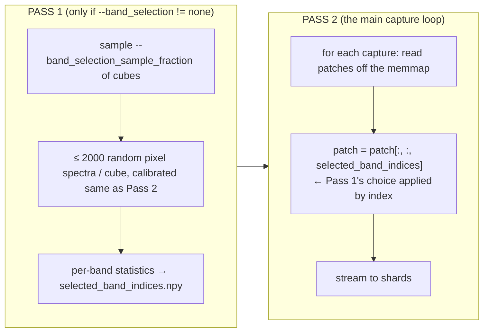
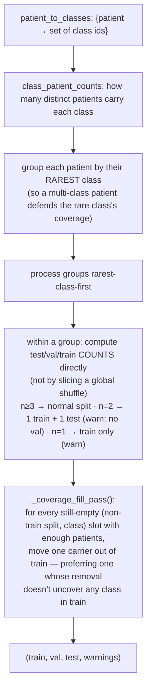
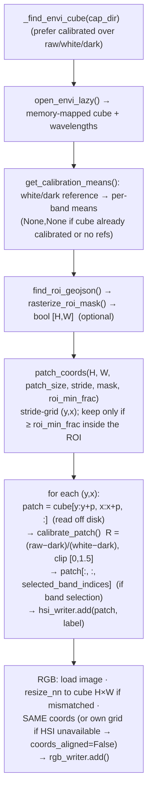
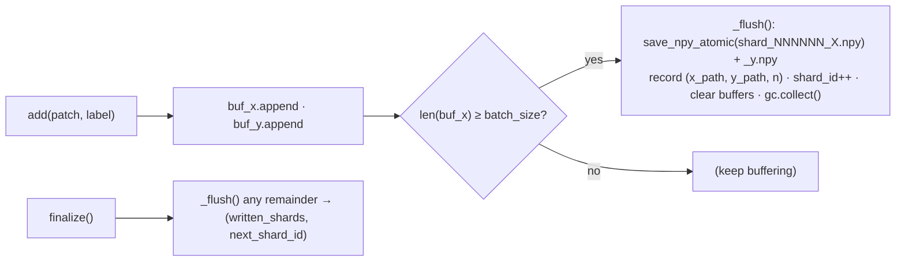
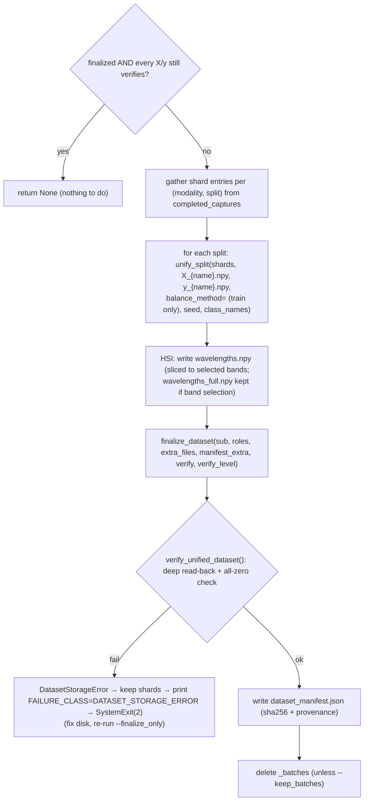

# `prepare_histologyhsi_bc_v6.py` — HistologyHSI‑BC‑Recurrence Preprocessing

> **File:** [`prepare_histologyhsi_bc_v6.py`](../prepare_histologyhsi_bc_v6.py) · ~1820 lines
> **One‑line summary:** turns a raw **HistologyHSI‑BC‑Recurrence** download (TCIA collection, DOI `10.7937/6kpy-yt49`) into flat `<out>/{hsi,rgb}/X_{train,val,test}.npy` (+ `y_*.npy`, `wavelengths.npy`) via a **memory‑bounded, resumable, crash‑safe, batch‑streamed** pipeline, with optional spectral band selection, class balancing, and ROI masking.
> **v6 vs v5:** v5 is frozen for reproducing existing datasets. v6 adds crash‑safe finalize, a sha256 `dataset_manifest.json`, a stratified‑split coverage fill pass, fail‑soft ingestion, lowercase‑folder tolerance, and an opt‑in prep‑time patch‑leakage check.

---

## Table of contents

1. [What it produces & why it's careful](#1-what-it-produces--why-its-careful)
2. [Expected input layout](#2-expected-input-layout)
3. [High‑level pipeline](#3-high-level-pipeline)
4. [Two‑pass design](#4-two-pass-design)
5. [Discovery & labelling](#5-discovery--labelling)
6. [Patient‑level stratified split](#6-patient-level-stratified-split)
7. [Band selection (Pass 1)](#7-band-selection-pass-1)
8. [Per‑capture processing (Pass 2)](#8-per-capture-processing-pass-2)
9. [The streaming shard writer](#9-the-streaming-shard-writer)
10. [The resumable progress manifest](#10-the-resumable-progress-manifest)
11. [Unify & crash‑safe finalize](#11-unify--crash-safe-finalize)
12. [Class balancing](#12-class-balancing)
13. [Fail‑soft ingestion](#13-fail-soft-ingestion)
14. [CLI reference](#14-cli-reference)
15. [Output files](#15-output-files)
16. [Resume / recovery scenarios](#16-resume--recovery-scenarios)
17. [Function index](#17-function-index)
18. [Gotchas](#18-gotchas)

---

## 1. What it produces & why it's careful

Output (per modality subfolder `hsi/` and/or `rgb/`):

```
<out>/
├── _progress.json                 # resumable manifest (shared by both modalities)
├── class_coverage_report.json
├── dataset_statistics.json
├── selected_band_indices.npy      # if --band_selection != none (HSI)
├── selected_wavelengths.npy, band_importance.npy, band_ranking.npy, band_selection_report.json
├── hsi/
│   ├── X_train.npy  y_train.npy   [X_val.npy y_val.npy]  X_test.npy  y_test.npy
│   ├── wavelengths.npy            (+ wavelengths_full.npy if band selection)
│   ├── dataset_manifest.json      # sha256 + provenance
│   └── leakage_report.json        # if --check_patch_leakage
└── rgb/
    └── X_train.npy ... (same, no wavelengths / band selection)
```

`X_*.npy` is `float32 [N, patch, patch, C]` (HSI: `C` = selected bands; RGB: `C = 3`), `y_*.npy` is `int64 [N]`. `train_example_v13.py` loads exactly these.

**Why the machinery:** whole‑slide HSI cubes at hundreds of bands are large, a collection has many captures, and a job can be OOM‑killed. Three guarantees:

| guarantee | mechanism |
|---|---|
| never hold a whole cube in RAM | ENVI cubes are memory‑mapped (`spectral`); each patch read as `img[y:y+p, x:x+p, :]` |
| never accumulate more than ~one shard of patches | `ShardWriter` flushes every `--batch_size` (256) patches to a `.npy` shard and clears its buffer |
| a kill loses at most the one in‑flight capture | `_progress.json` records a capture as *completed* only after **all** its shards are flushed; orphan shards from an interrupted capture are deleted on the next run |
| a kill during the final merge cannot leave a corrupt `X_train.npy` | `atomic_memmap_array` builds `<name>.tmp`, `fsync`s, `os.replace`s; shards are deleted only **after** the merged arrays are re‑read end‑to‑end |

---

## 2. Expected input layout

Per the TCIA / *Scientific Data* description:

```
<root>/
├── HistologyHSI-BC-Recurrence-Clinical-Standardized.xlsx   (optional; for --label_source recurrence)
├── 01_03_HSI_ROI_Annotations/        GeoJSON polygons, one per capture (optional)
└── 02_01_HSI_Images/                 (real downloads also seen as "02_01_HS_Images")
    └── HSI_VNIR_<patient>_<tissue>_x10_C<capture>/
        ├── *.hdr / *.dat / *.raw     ENVI cube(s): raw + white/dark reference + (usually) a calibrated cube
        └── *.png / *.jpg / *.tif     synthetic RGB rendering, pixel-aligned with the HSI cube
```

`<tissue>` ∈ `{IDC, Healthy, DCIS}` read from the folder name. The script is **deliberately permissive** about which `.hdr` to load and which image is "the RGB" (`_find_envi_cube` / `_find_rgb_image` score candidates) and **prints what it picked for the first few captures** — check that once against your actual download.

Real downloads nest things differently than the paper. `discover_captures` first tries the flat `HSI_VNIR_...` naming (`CAPTURE_RE`), then falls back to **content‑based discovery**: any directory containing a `.hdr` is a capture folder, with patient/tissue **inferred from the path** (`<tissue>/<patient>/<capture>/*.hdr` convention). It prints an 8‑row sample so you can sanity‑check the inferred patient grouping (which drives the split).

---

## 3. High‑level pipeline

```mermaid
flowchart TD
    ROOT["--root  (raw HistologyHSI-BC download)"] --> DISC["discover_captures()<br/>flat naming → else content-based (.hdr walk)"]
    DISC --> LAB["build_labels()<br/>tissue → {Healthy:0, DCIS:1, IDC:2}<br/>recurrence → per-patient 0/1 from XLSX"]
    LAB --> RESUME{"_progress.json exists & --fresh not set?"}
    RESUME -- yes --> LOADM["load_manifest() + check_manifest_compatible()"]
    RESUME -- no --> SPLIT["stratified_patient_split_three()  (or legacy_random)"]
    SPLIT --> COV["check_prep_class_coverage()  → class_coverage_report.json<br/>ABORTS here if a class is uncoverable (unless --allow_missing_classes)"]
    COV --> BS{"--band_selection != none  (HSI)?"}
    BS -- yes --> PASS1["PASS 1: compute_band_statistics() → select_bands*()<br/>→ selected_band_indices.npy + report"]
    BS -- no --> NM
    PASS1 --> NM["new_manifest(...)"]
    LOADM --> ORPH["cleanup_orphan_shards()"]
    NM --> ORPH
    ORPH --> LOOP["PASS 2: per capture (skip if completed/skipped)"]
    subgraph LOOP2["for each capture"]
        direction TB
        PC["process_one_capture()<br/>open ENVI lazily · calibrate · ROI mask ·<br/>patch_coords() · slice patches off memmap · band-slice · writer.add()"]
        FIN["writer.finalize() → shards"]
        REC["completed_captures[key] = {split, hsi:[...], rgb:[...]}<br/>save_manifest()  (after EVERY capture)"]
        PC --> FIN --> REC
    end
    LOOP --> LOOP2
    LOOP2 --> RECOV["re-check realized class coverage (skips can empty a slot)"]
    RECOV --> UNI["unify_all()<br/>per modality/split: unify_split() → atomic X_*.npy<br/>write wavelengths.npy · finalize_dataset() (deep verify + dataset_manifest.json)<br/>delete _batches"]
    UNI --> STATS["write_dataset_statistics() → dataset_statistics.json<br/>(+ balancing_report.json / class_distribution_*.png if balancing ran)"]
    STATS --> INTEG["_run_dataset_integrity_check() → dataset_split_report.json, leakage_report.json"]
    INTEG --> PL{"--check_patch_leakage?"}
    PL -- yes --> PLC["_run_patch_leakage_check() → <mod>/leakage_report.json (abort if --abort_on_leakage)"]
    PL -- no --> DONE([Done])
    PLC --> DONE
```



`--finalize_only` skips `discover_captures` … Pass 2 entirely and jumps straight to `unify_all` on whatever shards exist.

---

## 4. Two‑pass design



Pass 1 decides *which* wavelengths to keep, **once, before any patch is written**, so the reduced cubes go straight to disk — MedMamba-SS-TRM needs no changes because `wavelengths.npy` is written to match the reduced band count. Band selection is applied **by index**, so every cube in the collection must share a band count (checked; a mismatch aborts with an explanation).

---

## 5. Discovery & labelling

### `discover_captures(root)` → `[{key, dir, patient, tissue, capture}, …]`

1. `_find_hsi_root` — try `02_01_HSI_Images`, then `02_01_HS_Images`, then a fuzzy `*hs*image*` search (preferring a name starting `02`).
2. Try flat dirs matching `CAPTURE_RE = HSI?_VNIR_<patient>_<tissue>_x10_C<capture>` (case‑insensitive). `canonicalize_tissue` maps `healthy`/`idc`/`dcis` → `Healthy`/`IDC`/`DCIS`.
3. Else `_capture_dirs_by_content` (any dir with a `.hdr`), inferring: `tissue` from an ancestor folder name in `{idc, healthy, dcis}`, `patient` as the folder one level below that, `capture` from a trailing number. Folders whose tissue can't be determined are counted and skipped.

### `build_labels(captures, label_source, clinical_xlsx)`

| `--label_source` | label per capture | `class_names` |
|---|---|---|
| `tissue` (default) | `TISSUE_TO_ID[tissue]` → Healthy `0`, DCIS `1`, IDC `2` | `["healthy", "DCIS", "IDC"]` |
| `recurrence` | `load_recurrence_labels(xlsx)[patient]` → distant‑recurrence 0/1 (**weak supervision**: every patch of a patient shares one label) | `["no_recurrence", "recurrence"]` |

`load_recurrence_labels` opens the clinical XLSX read‑only, fuzzy‑matches a `patient`/`id` column and a `recur*` column, maps `{1,yes,y,true,recurrence,recurrent} → 1` else `0`. Captures whose patient isn't in the sheet are dropped with a warning.

---

## 6. Patient‑level stratified split

Splitting is **always by patient**, never by patch (no patient appears in two splits). v5/v6 default to **stratified** (`stratified_patient_split_three`, `training/dataset_prep_common.py`); `--split_strategy legacy_random` reproduces the pre‑v5 plain shuffle‑and‑slice.

### The bug v5/v6 fixes

The old unstratified shuffle could put *every* patient carrying a rare class into `train`, leaving `validation`/`test` with **zero** samples of it (`"validation: missing ['0', '2']"`). The Phase‑3 coverage check caught it — but only at train time, after hours of preprocessing.

### `stratified_patient_split_three(patient_to_classes, split_preset, seed)`



`SPLIT_ALGO_VERSION = 2` (the fill pass) is recorded in `dataset_manifest.json` so a dataset's split is traceable to an algorithm version. `warnings` lists every class whose patient pool was genuinely too small — the plan's explicit escape hatch ("if the source dataset genuinely lacks enough independent patients … explicitly report the limitation").

### Presets (`SPLIT_PRESETS`)

| preset | train / val / test | validation set? |
|---|---|---|
| `80_20` (default) | 0.80 / 0.00 / 0.20 | no |
| `70_30` | 0.70 / 0.00 / 0.30 | no |
| `80_10_10` | 0.80 / 0.10 / 0.10 | yes |
| `70_15_15` | 0.70 / 0.15 / 0.15 | yes |
| `60_20_20` | 0.60 / 0.20 / 0.20 | yes |

`check_prep_class_coverage(item_labels, assign_split_fn, num_classes, class_names, fail_hard=not --allow_missing_classes)` runs `verify_class_coverage` on the **capture‑level** labels immediately after the split and **aborts here** (before any extraction) if a class is uncoverable — exactly the check `train_example_v13.py` also runs, just moved earlier.

---

## 7. Band selection (Pass 1)

Only for HSI, only when `--band_selection != none`. All methods first call:

### `compute_band_statistics(...)` → `(pixels [P, C] float32, pixel_labels [P] int64, wavelengths)`

Opens `sample_fraction` of the labeled cubes (≥ 1), draws up to `max_pixels_per_capture=2000` **single‑pixel spectra** per cube (never patches, never a whole cube), calibrating each pixel the same way Pass 2 will calibrate patches (`calibrate_patch` with white/dark means). Enforces a **shared band count** across cubes (mismatch → hard abort).

### Methods

| `--band_selection` | function | behaviour |
|---|---|---|
| `variance` | `select_bands_variance` | keep the `--num_bands` highest‑variance wavelengths |
| `correlation` | `select_bands_correlation` | greedy prune: visit bands by descending variance, keep one only if `|corr| ≤ --band_corr_threshold` with every kept band; `--num_bands` is a *cap* |
| `mutual_information` | `select_bands_mutual_information` | top `--num_bands` by MI with the (weak) label (needs scikit‑learn) |
| `hybrid` / `topk` | `select_bands_hybrid` | variance filter (pool ≈ 4·N) → correlation prune → MI rank to `--num_bands` |
| `importance` | `compute_band_importance` + `select_bands_by_importance` | see below |
| `manual` | — | load indices from `--band_file` |

Fixed‑count methods (`variance`/`correlation`/`mutual_information`/`hybrid`/`topk`) default `--num_bands` to **64** with a warning if unset.

### The `importance` method (plan Phase 1)

$$
\text{importance}_b \;=\;
\begin{cases}
0.5\,\dfrac{\text{var}_b}{\max_b \text{var}_b} + 0.5\,\dfrac{\text{MI}_b}{\max_b \text{MI}_b} & \text{if sklearn available and } >1 \text{ class}\\[2ex]
\dfrac{\text{var}_b}{\max_b \text{var}_b} & \text{otherwise}
\end{cases}
$$

then renormalized so $\max_b \text{importance}_b = 1$. `select_bands_by_importance(importance, num_bands, importance_threshold, max_bands)`:

1. rank all bands by importance (descending);
2. `--importance_threshold` (optional) drops everything below it → the "informative" pool;
3. `--num_bands` (optional) caps the pool to the top‑N — **but never invents bands** (if the pool ≤ N, keep the whole pool);
4. `--max_bands` (optional) is a hard never‑exceeded upper bound applied last.

Passing `--num_bands` **or** `--importance_threshold` **without** `--band_selection` auto‑selects `importance`. Writes `band_importance.npy`, `band_ranking.npy`, `selected_band_indices.npy`, `selected_wavelengths.npy`, `band_selection_report.json` (+ legacy `selection_report.json`).

---

## 8. Per‑capture processing (Pass 2)

### `process_one_capture(...)` → `(wavelengths, n_hsi, n_rgb, coords_aligned)`



* **Lazy read** — `open_envi_lazy` returns a `spectral` object; slicing pulls just that block off the `.dat`/`.raw`. `img.load()` on a whole slide is never called (only on the small white/dark references).
* **Calibration** — standard flat‑field: $R = \dfrac{\text{raw} - \text{dark}}{\text{white} - \text{dark}}$, clipped to `[0, 1.5]`. Skipped if the cube filename says `calib`/`reflect` or no reference cubes are found.
* **ROI** — `rasterize_roi_mask` draws the first GeoJSON polygon into a boolean `[H,W]` mask (PIL only, no shapely). `patch_coords` keeps a patch only if `mask[patch].mean() ≥ --roi_min_frac` (default 0.8).
* **Alignment** — patch coords are computed **once** on the HSI grid and reused for RGB, so *HSI patch `i`* and *RGB patch `i`* point at the same tissue. If the HSI cube is missing, RGB builds its own grid and `coords_aligned=False` is recorded and warned.
* `resize_nn` — nearest‑neighbour RGB resize to the cube resolution (dependency‑free).

---

## 9. The streaming shard writer

`ShardWriter(batches_dir, split, shard_counter_start, batch_size)`:



Shards live at `<out>/<mod>/_batches/<split>/shard_NNNNNN_X.npy` (+ `_y.npy`). `save_npy_atomic` (`training/npy_atomic.py`) writes `<path>.tmp`, `flush` + `fsync`, `os.replace` — a kill mid‑write leaves only a `.tmp`, never a final‑named shard with an unwritten tail. Peak memory ≈ one shard.

---

## 10. The resumable progress manifest

`<out>/_progress.json` (`new_manifest`):

```json
{
  "args": { "modality", "label_source", "patch_size", "stride", "roi_min_frac",
            "split", "seed", "batch_size", "split_strategy", "split_algo_version",
            "band_selection", "num_bands", "importance_threshold", "max_bands",
            "balance_classes" },
  "class_names": [...],
  "train_patients": [...], "validation_patients": [...], "test_patients": [...],
  "wavelengths": null,                     // full-spectrum, set once the first cube opens
  "selected_band_indices": [...] | null,
  "next_shard_id": { "hsi_train": 0, "hsi_validation": 0, ..., "rgb_test": 0 },
  "completed_captures": {                  // capture_key → entry
     "<key>": { "split", "hsi": [[x,y,n],...] | null, "rgb": [...] | null,
                "hsi_n", "rgb_n", "coords_aligned" } },
  "skipped_captures": { "<key>": { "reason", "stage" } },
  "finalized": false
}
```

* Saved **after every capture** (`save_json_atomic`).
* On resume, `check_manifest_compatible` refuses to continue if any of a long list of settings differs (`patch_size`, `stride`, `split`, `seed`, `band_selection`, `num_bands`, `balance_classes`, …) — because those change what bytes go into a shard or which capture goes into which split. Fix: fresh `--out_dir`, delete `_progress.json`, `--fresh`, or match the original settings.
* `cleanup_orphan_shards` deletes any shard file on disk not referenced by a `completed_captures` entry (leftovers from an interrupted capture) plus any `.tmp`.

---

## 11. Unify & crash‑safe finalize

`unify_all(out_dir, modality, manifest, delete_batches, balance_method, seed, verify, verify_level, cli_args)`:



### `unify_split` (`training/dataset_prep_unify.py`)

* Reads the header of shard 0 for `patch_shape` / `dtype`; concatenates all shard **labels** first (cheap, `int64`).
* If `balance_method` set (train only) → `build_balance_selection` derives a `row_order` (with repeats for oversampling).
* Writes `X` via **`atomic_memmap_array`**: `open_memmap("<path>.tmp", "w+")` → fill row‑batches read with **`read_npy_rows`** (`open()/seek()/readinto()`, never mmap → a corrupt shard is a catchable error, not `SIGBUS`) → `flush` → `del` → `fsync` → `os.replace`. `y` via `save_npy_atomic`.

### `verify_unified_dataset`

`validate_dataset(roles, level="deep")` **plus** an explicit check that no `X_*` file is entirely zero across 64 probed rows spanning the file — the signature of an `open_memmap` fill killed after the file was pre‑sized but before data was written (which a plain deep read would otherwise accept). On failure, **shards are kept** so `--finalize_only` can retry.

### Why this exists

The pre‑v6 code used `np.lib.format.open_memmap(path, "w+")` directly, which `ftruncate`s the file to full size *before the first write*; a kill mid‑fill left a right‑sized, all‑zeros `X_train.npy` under its final name **with the shards already deleted** — unrecoverable, and only surfacing as a `SIGBUS` days later in training. The exact incident this remediation targets: `X_train.npy` only ~19.6% written yet present under its final filename.

---

## 12. Class balancing

`--balance_classes {none, undersample, oversample}` — **train split only**, applied **at the unify step** (after every shard is on disk), so it never complicates the streaming/resumable path. Validation/test are never touched (evaluation stays realistic).

`build_balance_selection(y_all, method, seed)` (`training/dataset_prep_common.py`):

| method | target count | how |
|---|---|---|
| `undersample` | `min` class count | random sample without replacement down to target |
| `oversample` | `max` class count | keep all + random draw **with** replacement up to target |

Deterministic (`np.random.default_rng(seed)`), returns global row indices (shuffled). If balancing ran, `write_dataset_statistics` also emits `balancing_report.json` and `class_distribution_before.png` / `class_distribution_after.png` (train split, first modality).

---

## 13. Fail‑soft ingestion

One unreadable `.hdr` / cube / RGB image no longer aborts the run. `process_one_capture` is wrapped:

```python
try:
    ... = process_one_capture(...)
except Exception as e:               # noqa: BLE001 — one bad capture must not kill a resumable run
    skips.add(cap["key"], reason=repr(e), stage="process_one_capture")
    manifest["skipped_captures"] = skips.as_dict(); save_manifest(...)
    print(f"  [skip] {cap['key']}: {e!r}"); continue
```

`SkipRegistry` persists into `_progress.json` and is surfaced in `dataset_statistics.json`. Because a skip happens **after** the pre‑extraction coverage check, the realized class coverage is **re‑checked** on the captures that actually made it to disk before unifying (`realized_cov`); an incomplete result warns (or aborts without `--allow_missing_classes`).

---

## 14. CLI reference

`python prepare_histologyhsi_bc_v6.py --root <dir> --out_dir <dir> [options]`

### Core

| flag | default | meaning |
|---|---|---|
| `--root` | — | raw download dir (not required with `--finalize_only`). |
| `--out_dir` | `./data` | output dir; `hsi/` and/or `rgb/` subfolders are created. |
| `--modality` | `both` | `hsi`, `rgb`, or `both`. |
| `--label_source` | `tissue` | `tissue` (folder name) or `recurrence` (clinical XLSX, per patient). |
| `--clinical_xlsx` | `<root>/…Clinical-Standardized.xlsx` | required for `--label_source recurrence`. |
| `--patch_size` | `11` | square patch side. |
| `--stride` | `11` | patch stride (== `patch_size` → non‑overlapping). |
| `--roi_min_frac` | `0.8` | min fraction of a patch inside the ROI to keep it (only when ROI geojsons exist). |
| `--seed` | `0` | split RNG. |
| `--batch_size` | `256` | patches per shard file. |
| `--keep_batches` | off | don't delete `_batches/` after unify. |
| `--fresh` | off | ignore/overwrite any existing `_progress.json`. |
| `--finalize_only` | off | skip processing, just (re‑)unify existing shards. |

### Split

| flag | default | meaning |
|---|---|---|
| `--split` | `80_20` | preset (see §6). |
| `--split_strategy` | `stratified` | `stratified` (v5+) or `legacy_random` (byte‑for‑byte v4 reproduction). |
| `--allow_missing_classes` | off | warn instead of abort on incomplete coverage. |

### Band selection (HSI)

| flag | default | meaning |
|---|---|---|
| `--band_selection` | `none` | `none`, `variance`, `correlation`, `mutual_information`, `manual`, `hybrid`, `topk`, `importance`. |
| `--num_bands` | `None` | target/cap count (see §7; fixed‑count methods default to 64). |
| `--importance_threshold` | `None` | `importance` only — min normalized score to keep. |
| `--max_bands` | `None` | `importance` only — hard upper bound, applied last. |
| `--band_file` | `selected_bands.npy` | `manual` — `.npy` of indices to load. |
| `--band_selection_sample_fraction` | `0.10` | fraction of captures Pass 1 opens. |
| `--band_corr_threshold` | `0.98` | correlation prune threshold. |

### Balancing & verification

| flag | default | meaning |
|---|---|---|
| `--balance_classes` | `none` | `none`, `undersample`, `oversample` (train only, at unify). |
| `--no_verify_output` | off | skip the end‑to‑end read‑back (**not recommended**). |
| `--verify_level` | `deep` | `deep` = full sequential read of every produced `X_*.npy`; `structural` = header/size/probe only. |
| `--check_patch_leakage` | off | content‑hash patch‑level leakage check at prep time → `<mod>/leakage_report.json`. |
| `--abort_on_leakage` | off | with `--check_patch_leakage`, exit non‑zero on cross‑split duplicate patches. |

---

## 15. Output files

| file | written by | contents |
|---|---|---|
| `<out>/_progress.json` | `save_manifest` | resumable state (see §10) |
| `<out>/class_coverage_report.json` | `check_prep_class_coverage` (pre‑ and post‑skip) | per‑split class counts, missing classes |
| `<out>/dataset_statistics.json` | `write_dataset_statistics` | band selection, class balancing, split fractions & patient counts, realized patch counts & fractions per modality, patch/stride/roi/seed, skipped captures |
| `<out>/selected_band_indices.npy` `selected_wavelengths.npy` `band_importance.npy` `band_ranking.npy` `band_selection_report.json` (`selection_report.json`) | band‑selection savers | Pass‑1 outputs (HSI, if enabled) |
| `<out>/balancing_report.json` `class_distribution_before.png` `class_distribution_after.png` | `_write_balancing_outputs` | only when balancing ran |
| `<out>/dataset_split_report.json` `<out>/leakage_report.json` | `_run_dataset_integrity_check` | patient/slide overlap (informational at prep time) |
| `<out>/<mod>/X_{train,val,test}.npy` `y_{train,val,test}.npy` | `unify_split` | `float32 [N,p,p,C]` / `int64 [N]` |
| `<out>/<mod>/wavelengths.npy` (+ `wavelengths_full.npy`) | `unify_all` | band centres in nm, matching the written band count |
| `<out>/<mod>/dataset_manifest.json` | `write_dataset_manifest` | per‑file shape/dtype/size/sha256 + provenance (`prep_script`, `prep_version` 6, `git_sha`, `cli_args`, `split`, `split_algo_version`, `class_names`, `selected_band_indices`, `created_utc`) |
| `<out>/<mod>/leakage_report.json` | `_run_patch_leakage_check` | only with `--check_patch_leakage` |

---

## 16. Resume / recovery scenarios

| situation | what to run | what happens |
|---|---|---|
| OOM‑killed / `Ctrl‑C` mid‑run | **the exact same command** | completed captures skipped; orphan shards from the in‑flight capture cleaned; continues |
| all captures done, killed during merge | **the same command**, or `--finalize_only` | `unify_all` re‑runs; a stale `finalized: true` over a truncated/zero `X` re‑unifies rather than trusting it |
| merge failed with `DATASET_STORAGE_ERROR` (exit 2) | fix disk space / disk health, then `--finalize_only` | shards were kept; re‑merges and re‑verifies |
| want different settings | fresh `--out_dir` **or** delete `_progress.json` **or** `--fresh` | `check_manifest_compatible` otherwise refuses |
| suspect cross‑split duplicate patches | add `--check_patch_leakage [--abort_on_leakage]` | hashes every patch; writes `<mod>/leakage_report.json` |

---

## 17. Function index

| symbol | role |
|---|---|
| `canonicalize_tissue` | normalize `idc/healthy/dcis` folder case → `IDC/Healthy/DCIS` |
| `_find_envi_cube` / `_find_reference_cubes` / `_find_rgb_image` | permissive file discovery inside a capture folder (scored) |
| `open_envi_lazy` | memory‑map an ENVI cube (+ wavelengths); never `.load()` a slide |
| `load_reference_mean` / `calibrate_patch` / `get_calibration_means` | flat‑field calibration `R = (raw−dark)/(white−dark)` |
| `compute_band_statistics` | Pass‑1 pixel sampler (bounded memory) |
| `select_bands_variance/correlation/mutual_information/hybrid`, `select_bands`, `compute_band_importance`, `select_bands_by_importance` | band‑selection methods |
| `save_selected_bands` / `save_importance_selection_report` / `load_selected_bands` | Pass‑1 output I/O |
| `rasterize_roi_mask` / `find_roi_geojson` | GeoJSON ROI → boolean mask |
| `load_recurrence_labels` | clinical XLSX → `{patient: 0/1}` |
| `patch_coords` | stride‑grid `(y,x)` corners, ROI‑filtered |
| `resize_nn` | nearest‑neighbour RGB resize to cube resolution |
| `ShardWriter` | buffered → atomic `.npy` shard flush |
| `manifest_path` / `load_manifest` / `save_manifest` / `new_manifest` / `check_manifest_compatible` / `cleanup_orphan_shards` | `_progress.json` lifecycle |
| `discover_captures` / `_find_hsi_root` / `_find_roi_root` / `_capture_dirs_by_content` | dataset discovery |
| `build_labels` | capture → class id + `class_names` |
| `resolve_split_fractions` / `patient_split_three` | preset → fractions; legacy random split |
| `process_one_capture` | stream one capture's patches into shard writer(s) |
| `unify_split` (delegates to `dataset_prep_unify`) / `unify_all` | shards → final arrays (crash‑safe) |
| `write_dataset_statistics` / `_write_balancing_outputs` | `dataset_statistics.json` + balancing plots |
| `_run_dataset_integrity_check` / `_run_patch_leakage_check` | leakage checks |
| `main` | CLI + orchestration |

Shared modules: `training/dataset_prep_common.py`, `training/dataset_prep_unify.py`, `training/npy_atomic.py`, `training/npy_integrity.py`, `training/class_coverage.py` — see [`05_shared_infrastructure.md`](05_shared_infrastructure.md).

---

## 18. Gotchas

* **Check the "picked file" output once.** `_find_envi_cube` / `_find_rgb_image` guess; if your download has already‑registered TIFFs or oddly‑named references, adjust the glob scoring.
* **Band selection is by index** ⇒ all cubes must share a band count. A mismatch aborts with a message telling you to split by sensor or use `--band_selection none`.
* **`--patch_size` / `--stride` / `--split` / `--seed` / `--band_selection` / `--balance_classes` are locked in `_progress.json`.** Changing them requires a fresh out dir.
* **`recurrence` labels are weak** — every patch of a patient carries the patient's outcome. Combined with the patient‑level split this is correct, but per‑patch metrics will look optimistic relative to per‑patient.
* **`coords_aligned=False`** for a capture means its HSI and RGB patch indices don't correspond (HSI cube was missing) — fine for training each modality separately, not for paired analysis.
* **`--modality both`** shares one `_progress.json`; a capture is "completed" only once *all* its requested modalities' shards are flushed.
* **`--verify_level structural`** skips the full read‑back — faster, but won't catch a bad disk sector inside `X_train.npy` that the row probes happen to miss.
* Requires `spectral` (ENVI), `openpyxl` (recurrence labels), `Pillow` (RGB/ROI), and scikit‑learn (MI‑based band selection).

---

### Related documents
* [`04_prepare_pad_ufes_20_v5.md`](04_prepare_pad_ufes_20_v5.md) — the sibling RGB preprocessing script (shares the split/unify/atomic infrastructure).
* [`02_train_example_v13.md`](02_train_example_v13.md) — consumes this script's output.
* [`05_shared_infrastructure.md`](05_shared_infrastructure.md) — `dataset_prep_common`, `dataset_prep_unify`, `npy_atomic`, `npy_integrity`.
