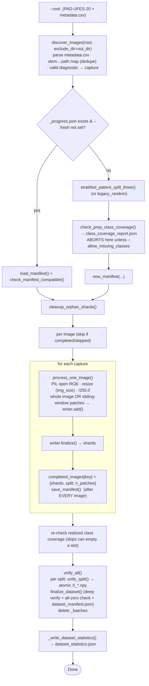
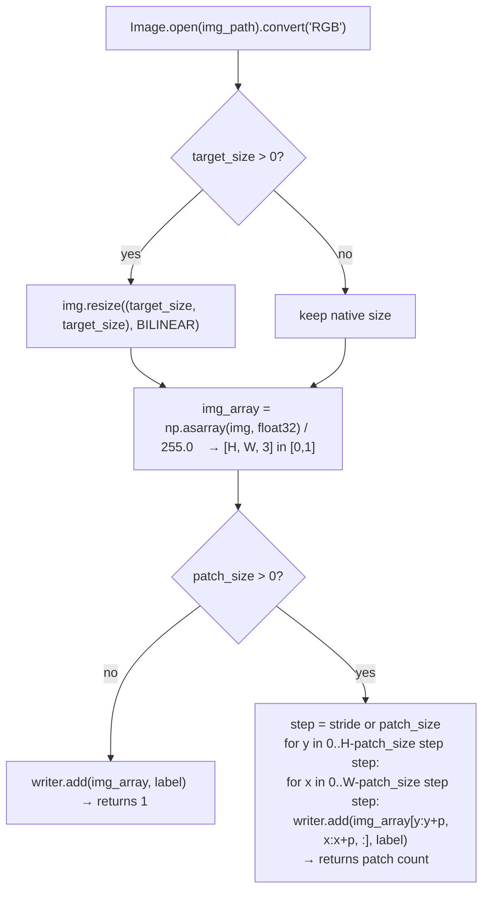
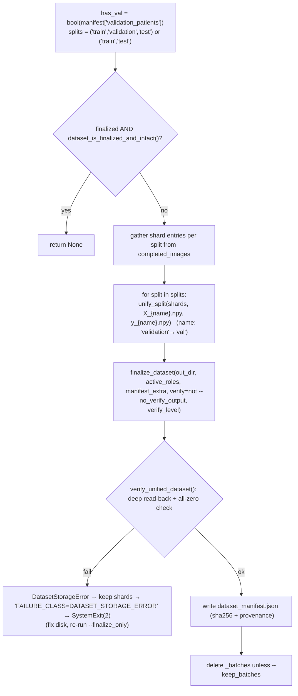

# `prepare_pad_ufes_20_v5.py` — PAD‑UFES‑20 Preprocessing

> **File:** [`prepare_pad_ufes_20_v5.py`](../prepare_pad_ufes_20_v5.py) · ~535 lines
> **One‑line summary:** turns a raw **PAD‑UFES‑20** download (<https://data.mendeley.com/datasets/zr7vgbcyr2/1> — 6‑class dermatological RGB clinical images + `metadata.csv`) into flat `X_train.npy` / `y_train.npy` (+ optional `X_val`/`y_val`) / `X_test.npy` / `y_test.npy` via the **same** memory‑bounded, resumable, crash‑safe, batch‑streamed pipeline the HistologyHSI script uses. Optional sliding‑window patch extraction.
> **v5 vs v4:** v4 is frozen for reproducing existing datasets. v5 adds crash‑safe finalize, a sha256 `dataset_manifest.json`, stratified patient‑level coverage‑checked splits (the shared `training.dataset_prep_common` utilities), and fail‑soft ingestion.

---

## Table of contents

1. [What it produces](#1-what-it-produces)
2. [Expected input layout](#2-expected-input-layout)
3. [Relationship to the HistologyHSI script](#3-relationship-to-the-histologyhsi-script)
4. [High‑level pipeline](#4-high-level-pipeline)
5. [Discovery & labelling](#5-discovery--labelling)
6. [Patient‑level stratified split](#6-patient-level-stratified-split)
7. [Per‑image processing](#7-per-image-processing)
8. [Shard writer & progress manifest](#8-shard-writer--progress-manifest)
9. [Unify & crash‑safe finalize](#9-unify--crash-safe-finalize)
10. [Fail‑soft ingestion](#10-fail-soft-ingestion)
11. [CLI reference](#11-cli-reference)
12. [Output files](#12-output-files)
13. [Resume / recovery scenarios](#13-resume--recovery-scenarios)
14. [Function index](#14-function-index)
15. [Gotchas](#15-gotchas)

---

## 1. What it produces

```
<out_dir>/
├── _progress.json               # resumable manifest
├── class_coverage_report.json
├── dataset_statistics.json
├── dataset_manifest.json        # sha256 + provenance
├── X_train.npy  y_train.npy
├── X_val.npy    y_val.npy       # only for three-way --split presets
└── X_test.npy   y_test.npy
```

* `X_*.npy` — `float32`, either `[N, img_size, img_size, 3]` (whole resized image, the default) or `[N, patch_size, patch_size, 3]` (with `--patch_size`). Pixel values are scaled to `[0, 1]` (`/ 255.0`).
* `y_*.npy` — `int64 [N]`, class ids per `DIAGNOSTIC_TO_ID`.

`train_example_v13.py --data_dir <out_dir>` loads these directly. Because there is no `wavelengths.npy`, the trainer auto‑selects **`rgb` modality** (`medmamba_ss_tiny`‑style preset, `patch_size=4` spatial stem).

### Classes (`DIAGNOSTIC_TO_ID`)

| id | code | lesion |
|---|---|---|
| 0 | ACK | Actinic Keratosis |
| 1 | BCC | Basal Cell Carcinoma |
| 2 | MEL | Melanoma |
| 3 | NEV | Nevus |
| 4 | SCC | Squamous Cell Carcinoma |
| 5 | SEK | Seborrheic Keratosis |

`class_names = list(DIAGNOSTIC_TO_ID.keys())` → `["ACK", "BCC", "MEL", "NEV", "SCC", "SEK"]`.

---

## 2. Expected input layout

```
<root>/
├── metadata.csv        (or any single *.csv — first one found)
└── <images...>          .png / .jpg / .jpeg / .bmp / .tif / .tiff, anywhere under <root>
```

`metadata.csv` must contain (case/space‑insensitive) columns **`img_id`**, **`patient_id`**, **`diagnostic`**. Images may sit in any subdirectory; they're located by **filename stem** (`PAT_8_15.png` → stem `PAT_8_15`). A stem appearing at two different paths is a collision — the first wins, the rest are ignored with a warning. Any directory under `--exclude_dir` (defaulted to `--out_dir`) is never ingested, so a nested previous output can't contaminate a re‑run.

Rows whose stem isn't found on disk are counted and skipped; rows whose `diagnostic` isn't one of the six codes are silently dropped.

---

## 3. Relationship to the HistologyHSI script

The two prep scripts are deliberately parallel. Shared pieces (all in `training/`):

| shared module | used for |
|---|---|
| `dataset_prep_common` | `SPLIT_PRESETS`, `SPLIT_ALGO_VERSION`, `stratified_patient_split_three`, `patient_split_three`, `check_prep_class_coverage`, `SkipRegistry`, `resolve_split_fractions` |
| `dataset_prep_unify` | `unify_split` (atomic shard→array), `finalize_dataset` (deep verify + manifest), `dataset_is_finalized_and_intact` |
| `npy_atomic` | `save_npy_atomic`, `save_json_atomic` |
| `npy_integrity` | `DatasetStorageError` |

**What PAD‑UFES does *not* have** (vs HistologyHSI v6): no modality split (`rgb` only), no ENVI/HSI cubes, no spectral band selection, no white/dark calibration, no ROI masking, no `--balance_classes` option, no `wavelengths.npy`. Images are whole `PIL` reads, resized with bilinear interpolation.

---

## 4. High‑level pipeline



`--finalize_only` jumps straight to `unify_all` on existing shards.

---

## 5. Discovery & labelling

### `discover_images(root, exclude_dir=None)` → `[{key, path, patient, label}, …]`

1. Find `metadata.csv` (or the first `*.csv` in `root`).
2. Map required column names case/space‑insensitively; error if `img_id` / `patient_id` / `diagnostic` missing.
3. `os.walk(root)` collecting image files by **stem** (skipping anything under `exclude_dir`); warn on stem collisions.
4. For each metadata row: strip the extension from `img_id`; if the stem is on disk and `diagnostic.upper()` ∈ `DIAGNOSTIC_TO_ID` → `capture = {key: stem, path, patient: patient_id, label: DIAGNOSTIC_TO_ID[diag]}`.
5. Warn with the count of metadata rows whose image wasn't found.

No separate label table — the class **is** the `diagnostic` column.

---

## 6. Patient‑level stratified split

Identical mechanism to the HistologyHSI script (both call `training/dataset_prep_common.py`). Split is **by `patient_id`**, never by image.

* `--split_strategy stratified` (default) → `stratified_patient_split_three(patient_to_classes, split, seed)`:
  * group each patient by their rarest class → process rarest‑first → compute per‑group test/val/train counts directly → **coverage fill pass** moves a carrier out of `train` into any still‑empty `(non‑train split, class)` slot that has enough distinct patients, preferring a carrier whose removal doesn't uncover a class in `train`.
  * returns `(train, val, test, warnings)`; `warnings` lists classes with a genuinely too‑small patient pool.
* `--split_strategy legacy_random` → `patient_split_three` (one global shuffle, slice) — for byte‑for‑byte v4 reproduction with the same `--seed`.

### Presets (`SPLIT_PRESETS`, via `training/dataset_prep_common.py`)

| preset | train / val / test | val set? |
|---|---|---|
| `80_20` (default) | 0.80 / 0.00 / 0.20 | no |
| `70_30` | 0.70 / 0.00 / 0.30 | no |
| `80_10_10` | 0.80 / 0.10 / 0.10 | yes |
| `70_15_15` | 0.70 / 0.15 / 0.15 | yes |
| `60_20_20` | 0.60 / 0.20 / 0.20 | yes |

### Deprecated `--test_size`

`_resolve_deprecated_test_size(args)`: if `--test_size <f>` is given **and** `--split` is still the default `80_20`, it's mapped to the nearest two‑way preset (`0.20 → 80_20`, `0.30 → 70_30`) with a deprecation notice. If both are given explicitly, `--test_size` is ignored with a warning.

### Coverage gate

`check_prep_class_coverage(item_labels, _assign, num_classes=6, class_names, fail_hard=not --allow_missing_classes)` runs `verify_class_coverage` on **image‑level** labels right after the split and **aborts before any extraction** if a class can't be covered. Written to `class_coverage_report.json`.

---

## 7. Per‑image processing

### `process_one_image(img_path, target_size, writer, label, patch_size=None, stride=None)` → `n_patches`



* **Default (no `--patch_size`)** → one sample per image: the whole image resized to `--img_size` × `--img_size` (default 224). `X_train.npy` is then `[N_images, 224, 224, 3]`.
* **With `--patch_size 11 --stride 11`** → a non‑overlapping 11×11 patch grid over the (resized) image; `X_train.npy` is `[N_patches, 11, 11, 3]`. This matches the small‑patch regime the HSI pipeline uses and the `medmamba_ss_trm` `hsi_small`‑style configs expect — but note the trainer still picks the **`rgb`** preset here (no `wavelengths.npy`), i.e. `dims=(96,192,384,768)`, `patch_size=4` spatial stem. For 11×11 input patches that leaves a very small feature map; consider `--img_size 0` + `--patch_size` matched to your intent, or feeding whole images.

---

## 8. Shard writer & progress manifest

### `ShardWriter` — identical shape to the HSI script's

`add(image_array, label)` buffers; at `--batch_size` (default **256**) it `_flush()`es: `save_npy_atomic(shard_NNNNNN_X.npy, np.stack(buf_x).astype(float32))` + `_y.npy` (`int64`), records `(x_path, y_path, n)`, clears buffers, `gc.collect()`. Shards live at `<out_dir>/_batches/<split>/`.

### `_progress.json` (`new_manifest`)

```json
{
  "args": { "img_size", "patch_size", "stride", "seed", "batch_size",
            "split", "split_strategy", "split_algo_version" },
  "class_names": ["ACK","BCC","MEL","NEV","SCC","SEK"],
  "train_patients": [...], "validation_patients": [...], "test_patients": [...],
  "next_shard_id": { "train": 0, "validation": 0, "test": 0 },
  "completed_images": { "<stem>": { "shards": [[x,y,n],...], "split", "n_patches" } },
  "skipped_images":   { "<stem>": { "reason", "stage" } },
  "finalized": false
}
```

* Saved after **every** image.
* `check_manifest_compatible` locks `_COMPAT_KEYS = (img_size, patch_size, stride, seed, batch_size, split, split_strategy)` — a mismatch on resume raises `ValueError` telling you to use a fresh `--out_dir`, delete `_progress.json`, or pass `--fresh`.
* `cleanup_orphan_shards` removes any shard file not referenced by `completed_images` (plus `.tmp` leftovers).
* `--finalize_only` tolerates an older/plain‑v4 manifest missing the newer keys (`skipped_images`, `args.split`).

---

## 9. Unify & crash‑safe finalize

`unify_all(out_dir, manifest, args)`:



`manifest_extra` records `prep_script="prepare_pad_ufes_20_v5.py"`, `prep_version=5`, `created_utc`, `git_sha`, `cli_args`, `split_algo_version`, `split`, `class_names`.

`unify_split` and `finalize_dataset` are the **same functions** the HSI script uses — see [`03_prepare_histologyhsi_bc_v6.md`](03_prepare_histologyhsi_bc_v6.md#11-unify--crash-safe-finalize) and [`05_shared_infrastructure.md`](05_shared_infrastructure.md#dataset_prep_unifypy). No `balance_method` is passed here (PAD‑UFES v5 has no `--balance_classes`).

### `_write_dataset_statistics(out_dir, manifest, counts, skips)` → `dataset_statistics.json`

```json
{
  "split": { "preset", "strategy", "split_algo_version",
             "target_fractions": {train, validation, test},
             "patient_counts": {train, validation, test},
             "realized_patch_counts": {...},
             "realized_patch_fractions": {...} },
  "class_names": [...],
  "patch_size", "stride", "img_size", "seed",
  "skipped_images": {...}
}
```

Only written when `unify_all` actually produced arrays (not on the already‑finalized fast path).

---

## 10. Fail‑soft ingestion

```python
try:
    n_patches = process_one_image(cap["path"], args.img_size, writer, cap["label"],
                                  patch_size=args.patch_size, stride=args.stride)
except Exception as e:                 # noqa: BLE001 — one bad image must not kill a resumable run
    skips.add(cap["key"], reason=repr(e), stage="process_one_image")
    manifest["skipped_images"] = skips.as_dict(); save_manifest(...)
    print(f"  [skip] {cap['key']}: {e!r}"); continue
```

`SkipRegistry` persists into `_progress.json` and `dataset_statistics.json`. After the loop, realized class coverage is **re‑verified** on the images that actually made it to disk (`realized_cov`); an incomplete result warns (or aborts without `--allow_missing_classes`).

---

## 11. CLI reference

`python prepare_pad_ufes_20_v5.py --root <dir> --out_dir <dir> [options]`

| flag | default | meaning |
|---|---|---|
| `--root` | — | PAD‑UFES‑20 dir with `metadata.csv` and images (not required with `--finalize_only`). |
| `--out_dir` | `./data` | output dir. |
| `--img_size` | `224` | resize H/W for each image. `0` (or negative) → keep native size. |
| `--patch_size` | `None` | square patch side; `None` → one whole (resized) image per sample. |
| `--stride` | `None` | patch stride; `None` → `patch_size` (non‑overlapping). |
| `--split` | `80_20` | patient‑level preset (see §6). |
| `--split_strategy` | `stratified` | `stratified` or `legacy_random`. |
| `--allow_missing_classes` | off | warn instead of abort on incomplete coverage. |
| `--test_size` | `None` | **deprecated** — mapped to the nearest two‑way preset if `--split` is at its default. |
| `--seed` | `42` | split RNG. |
| `--batch_size` | `256` | patches/images per shard file. |
| `--keep_batches` | off | don't delete `_batches/` after unify. |
| `--fresh` | off | ignore/overwrite an existing `_progress.json`. |
| `--finalize_only` | off | skip processing, just (re‑)unify existing shards. |
| `--no_verify_output` | off | skip the end‑to‑end read‑back (**not recommended**). |
| `--verify_level` | `deep` | `deep` = full sequential read of every produced `X_*.npy`; `structural` = header/size/probe only. |

> Note the different default `--seed` (**42**, vs `0` in the HistologyHSI script).

---

## 12. Output files

| file | written by | contents |
|---|---|---|
| `<out>/_progress.json` | `save_manifest` | resumable state (see §8) |
| `<out>/class_coverage_report.json` | `check_prep_class_coverage` (pre‑ and post‑skip) | per‑split class counts, missing classes |
| `<out>/dataset_statistics.json` | `_write_dataset_statistics` | split preset/strategy, target vs realized fractions, patient counts, patch counts, patch_size/stride/img_size/seed, skipped images |
| `<out>/X_{train,val,test}.npy`, `y_{train,val,test}.npy` | `unify_split` | `float32 [N,·,·,3]` in `[0,1]` / `int64 [N]` |
| `<out>/dataset_manifest.json` | `write_dataset_manifest` | per‑file shape/dtype/size/sha256 + provenance (`prep_script`, `prep_version` 5, `git_sha`, `cli_args`, `split`, `split_algo_version`, `class_names`, `created_utc`) |

`X_val.npy` / `y_val.npy` only exist for the three‑way `--split` presets.

---

## 13. Resume / recovery scenarios

| situation | what to run | result |
|---|---|---|
| killed mid‑run | **the same command** | completed images skipped; orphan shards cleaned; continues |
| all images done, killed during merge | **the same command**, or `--finalize_only` | `unify_all` re‑runs; a stale `finalized: true` over a truncated `X` re‑unifies |
| merge failed `DATASET_STORAGE_ERROR` (exit 2) | fix disk, then `--finalize_only` | shards were kept; re‑merges & re‑verifies |
| want different `img_size` / `patch_size` / `split` / `seed` | fresh `--out_dir`, delete `_progress.json`, or `--fresh` | `check_manifest_compatible` otherwise refuses |

---

## 14. Function index

| symbol | role |
|---|---|
| `DIAGNOSTIC_TO_ID`, `SPLITS_FOR`, `_split_out_name` | class map, split‑name helpers (`validation` → file suffix `val`) |
| `_git_sha` | short commit hash for provenance |
| `ShardWriter` | buffered → atomic `.npy` shard flush |
| `manifest_path` / `load_manifest` / `save_manifest` / `new_manifest` / `check_manifest_compatible` / `cleanup_orphan_shards` | `_progress.json` lifecycle |
| `discover_images` | `metadata.csv` + image walk → labeled captures |
| `process_one_image` | resize + (whole‑image or patch‑grid) → shard writer |
| `unify_all` | shards → final arrays (crash‑safe verify + manifest) |
| `_write_dataset_statistics` | `dataset_statistics.json` |
| `build_arg_parser` / `_resolve_deprecated_test_size` / `main` | CLI + orchestration |

Shared: `training/dataset_prep_common.py` (`stratified_patient_split_three`, `check_prep_class_coverage`, `SkipRegistry`, `resolve_split_fractions`), `training/dataset_prep_unify.py` (`unify_split`, `finalize_dataset`, `dataset_is_finalized_and_intact`), `training/npy_atomic.py` (`save_npy_atomic`, `save_json_atomic`), `training/npy_integrity.py` (`DatasetStorageError`) — see [`05_shared_infrastructure.md`](05_shared_infrastructure.md).

---

## 15. Gotchas

* **Default = whole images, not patches.** Without `--patch_size` you get `[N_images, img_size, img_size, 3]`. Add `--patch_size`/`--stride` for a patch dataset.
* **`--img_size 0`** keeps native resolution — but then images of different sizes can't be `np.stack`ed into one shard unless you also patch. Use `--img_size 0` only together with `--patch_size`.
* **`_COMPAT_KEYS` are locked** in `_progress.json` — `img_size`, `patch_size`, `stride`, `seed`, `batch_size`, `split`, `split_strategy`. Changing any needs a fresh out dir.
* **Stem collisions** — two images with the same filename stem in different folders: the first is kept, the rest ignored (warned). Check the warning count.
* **`--exclude_dir` defaults to `--out_dir`** so a nested previous run isn't re‑ingested; if you point `--out_dir` outside `--root` this is moot.
* **Deprecated `--test_size`** only takes effect if `--split` is left at its default; otherwise it's ignored with a warning.
* **`--seed` default is 42** here (0 in the HSI script) — don't assume they match when comparing splits.
* **Trainer picks the `rgb` preset** for this dataset (no `wavelengths.npy`), i.e. spatial `patch_size=4`; a small `--patch_size` here yields a tiny feature map. Match your `--patch_size` / `--img_size` to the model config you intend to train.
* Requires `pandas` (metadata), `Pillow` (images), `numpy`.

---

### Related documents
* [`03_prepare_histologyhsi_bc_v6.md`](03_prepare_histologyhsi_bc_v6.md) — the sibling HSI script; shares split/unify/atomic infrastructure and the resumable design.
* [`02_train_example_v13.md`](02_train_example_v13.md) — consumes this script's output (`rgb` modality).
* [`05_shared_infrastructure.md`](05_shared_infrastructure.md) — `dataset_prep_common`, `dataset_prep_unify`, `npy_atomic`.
