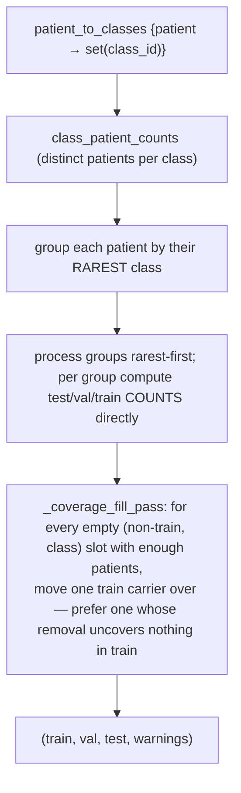
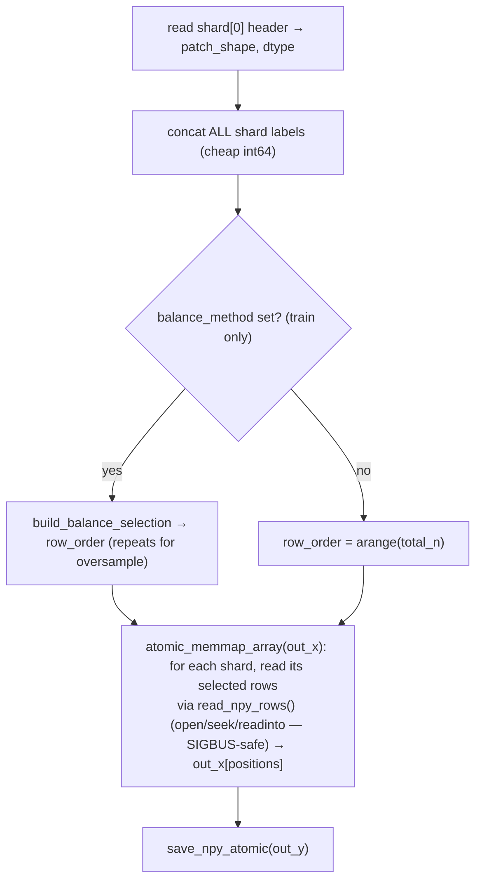
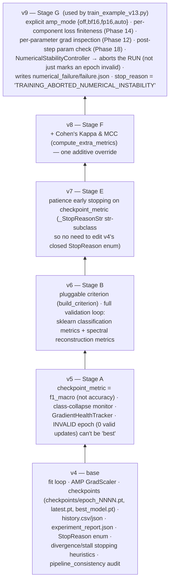

# Appendix — Shared Infrastructure (`training/` modules)

> These `training/*.py` modules are imported by **all four** documented files. Understanding them is prerequisite to understanding the crash‑safety, resumability, and numerical‑stability behaviour of the pipeline. This appendix is a reference, not a tutorial — each section is "what it guarantees + the key API".

| module | used by | one‑liner |
|---|---|---|
| [`npy_atomic.py`](#npy_atomicpy) | both prep scripts | atomic `.npy`/`.json` writes + `dataset_manifest.json` |
| [`npy_integrity.py`](#npy_integritypy) | `train_example_v13`, `dataset_prep_unify` | validate `.npy` before mmap; SIGBUS‑free row reads; storage modes |
| [`dataset_prep_common.py`](#dataset_prep_commonpy) | both prep scripts | stratified patient split, coverage check, class balancing, `SkipRegistry` |
| [`dataset_prep_unify.py`](#dataset_prep_unifypy) | both prep scripts | crash‑safe shard → final‑array unify + read‑back verify |
| [`dataloader_config.py`](#dataloader_configpy) | `train_example_v13` | named DataLoader memory policies + per‑worker seeding |
| [`numerical_stability.py`](#numerical_stabilitypy) | `train_example_v13`, `trainerg_v9` | skip‑ratio classification, gradient inspection, run‑abort policy, smoke test |
| [`system_memory.py`](#system_memorypy) | `train_example_v13` | RAM / `/dev/shm` / GPU snapshots |
| [`failure_taxonomy.py`](#failure_taxonomypy) | `train_example_v13` | one `FailureClass` vocabulary for "why did it stop" |
| [`dataset_integrity.py`](#dataset_integritypy) | `train_example_v13`, HSI prep | patient/slide + patch content‑hash leakage checks |
| [`class_coverage.py`](#class_coveragepy) | everything | "every class in every split or fail" |
| [`reconstruction_head.py`](#reconstruction_headpy) | `train_example_v13` | latent‑space reconstruction wrapper + spectral dropout |
| [`gan.py`](#ganpy) | `train_example_v13`, trainers | `SAMLoss`, `SpectralDiscriminator`, GAN losses |
| [`losses.py`](#lossespy) / [`samplers.py`](#samplerspy) / [`augmentation.py`](#augmentationpy) | `train_example_v13` | class‑imbalance strategies + HSI augmentation |
| [`config_presets.py`](#config_presetspy) | `train_example_v13` | `build_model(architecture, modality, …)` |
| [`activation_patch.py`](#activation_patchpy) / [`grad_checkpoint.py`](#grad_checkpointpy--spectral_checkpointpy) | `train_example_v13` | runtime model surgery (no edits to `medmamba_ss_trm.py`) |
| [trainer lineage](#trainer-lineage-trainerg_v4--v9) | `train_example_v13` | `TrainerG_v4 → … → v9` |

---

## `npy_atomic.py`

**Guarantee:** the real filename of a `.npy`/`.json` **never exists** until every byte is on disk.

```python
save_npy_atomic(path, array, do_fsync=True) -> path
    # write <path>.tmp → flush → fsync → os.replace(tmp, path)   (atomic on POSIX)
    # any exception → remove the .tmp, re-raise
save_json_atomic(path, obj) -> path                      # same, for JSON

write_dataset_manifest(data_dir, files, sha256=False, extra=None) -> path
    # dataset_manifest.json: per-file {shape, dtype, fortran_order, header_offset,
    #   size_bytes, expected_file_size, complete, [sha256]} + {created_utc, extra}
verify_against_manifest(data_dir, check_sha256=None) -> list[str]
    # [] == OK or no manifest. Compares shape / dtype / byte size (+ sha256 if recorded).
```

The v13 incident this targets: `X_train.npy` ~19.6% written yet present under its final name — a `np.save` streaming to the final path that was interrupted.

---

## `npy_integrity.py`

**Guarantee:** a damaged/truncated/unreadable `.npy` is caught as a **catchable `DatasetStorageError` before any mmap or DataLoader worker exists** — never downgraded to "try mmap anyway" (which would be an uncatchable main‑process `SIGBUS`).

### Per‑file status (`NpyFileReport.status`)

```
NOT_CHECKED · VALID · MISSING · EMPTY · HEADER_INVALID · TRUNCATED · SIZE_MISMATCH · UNREADABLE · IO_ERROR
```

`IO_ERROR` = header + on‑disk size correct but bytes physically unreadable (`OSError(5)/EIO`: bad sectors / failing disk / fs corruption) — distinct from `TRUNCATED` (file genuinely short). The abort message for `IO_ERROR` explicitly says *"more workers or more shared memory will not help — re‑copy the dataset"*.

### `validate_npy_file(path, level="structural"|"deep")`

1. exists / non‑empty.
2. parse **header only** → `shape`, `dtype`, `data_offset`.
3. **deterministic size check**: `expected_file_size = data_offset + prod(shape)·itemsize`; `size < expected` → `TRUNCATED` (no mmap, no full load — the v13.1 fix for a header‑intact byte‑short file).
4. **`seek()/read()` probe** of first / middle / last + 16 random rows. Short read → `TRUNCATED`; `OSError(5)` → `IO_ERROR`; other → `UNREADABLE`.
5. float dtype → bounded finite‑value check.
6. `level="deep"` → `full_read_check` reads the whole payload end‑to‑end in 16 MiB chunks.

### `validate_dataset(paths, abort_on_failure=True, level=...) -> DatasetIntegrityReport`

Validates every file, then checks each `X_*`/`y_*` pair's sample counts match. `abort_on_failure` → `DatasetStorageError` listing every problem. `write_integrity_report(report, path)` serializes it.

### Storage modes (Phase 5)

```python
resolve_storage_mode(x_path, "auto"|"mmap"|"ram", ram_headroom_frac=0.5)
    # "auto" → "ram" only if HEADER-declared payload ≤ 0.5 × available RAM, else "mmap"
load_npy_array(path, "mmap"|"ram")
    # "mmap" → np.load(path, mmap_mode="r")
    # "ram"  → _load_ram_buffered(): open()/readinto() loop → catchable OSError, never SIGBUS
read_npy_rows(path, indices) -> ndarray[(len(indices), *row_shape)]
    # SIGBUS-free random-row read for "a few patches out of a multi-GB X"
```

### `write_dataset_failure_artifacts(out_dir, integrity_report, exc, system_snapshot)`

Writes `<out_dir>/dataset_failure/{failure.json, validation_report.json, system_memory.json}` — the dataset‑side analogue of the trainer's `numerical_failure/`.

---

## `dataset_prep_common.py`

Shared by both prep scripts.

### `stratified_patient_split_three(patient_to_classes, split_preset, seed) -> (train, val, test, warnings)`

The bug it fixes: an unstratified patient shuffle could put every carrier of a rare class into `train`. Algorithm:



`SPLIT_ALGO_VERSION = 2` (the fill pass) is stamped into each dataset's manifest.
`patient_split_three(...)` = the legacy unstratified fallback (`--split_strategy legacy_random`).
`SPLIT_PRESETS`, `resolve_split_fractions` — the `80_20` / `80_10_10` / … table.

### `check_prep_class_coverage(item_labels, assign_split_fn, num_classes, class_names, fail_hard)`

Runs `verify_class_coverage` on capture/image‑level `(class_id, patient_id)` pairs + a `patient → split` function — i.e. **at prep time, before extraction**.

### `build_balance_selection(y_all, method, seed) -> (row_indices, before, after)`

`undersample` → all classes down to `min` count (no replacement). `oversample` → all classes up to `max` count (with replacement). Deterministic; row indices shuffled. Called by `dataset_prep_unify.unify_split` for the **train split only**.

### `SkipRegistry`

`add(key, reason, stage)` / `__contains__` / `as_dict()` / `summary()`. Persisted into `_progress.json` under `skipped_captures` / `skipped_images`.

---

## `dataset_prep_unify.py`

**Guarantee:** a kill during the shards → `X_train.npy` merge cannot leave a right‑sized, all‑zeros file under its final name **with the shards gone**.

### `atomic_memmap_array(final_path, dtype, shape)` — context manager

Yields a writable `np.memmap` backed by `<final_path>.tmp`. Clean exit → `flush` → drop mapping → `fsync` → `os.replace`. Any exception → remove `.tmp`, leave `final_path` untouched.

### `unify_split(shard_entries, out_x_path, out_y_path, *, row_order=None, balance_method=None, seed=0, class_names=None) -> (n_written, balance_report)`



### `verify_unified_dataset(data_dir, roles, level="deep")`

`validate_dataset(level=...)` **plus** rejecting an `X_*` that is entirely zero across 64 probed rows spanning the file — the `open_memmap`‑killed‑before‑writing signature a plain deep read would accept.

### `finalize_dataset(data_dir, roles, extra_files=(), manifest_extra=None, verify=True, verify_level="deep") -> True`

`verify_unified_dataset` → `write_dataset_manifest` (sha256). The caller deletes shards / sets `finalized=True` **only** when this returns `True`; on `DatasetStorageError` the shards are kept for `--finalize_only`.

`dataset_is_finalized_and_intact(data_dir, roles, level="structural")` — cheap guard for the already‑finalized fast path.

---

## `dataloader_config.py`

Named DataLoader memory policies (Phases 1/2/9) — the previous hardcoded `8 workers × prefetch 4 × persistent` on *both* loaders is "completely consistent with" the observed worker `SIGBUS` / "insufficient shared memory" failures.

| mode | num_workers | prefetch_factor | persistent | pin_memory |
|---|---|---|---|---|
| `safe` (default) | 0 | — | False | False |
| `balanced` | 2 | 1 | False | False |
| `performance` | 4 | 2 | True | True |

```python
resolve_loader_policy(loader_mode, num_workers?, prefetch_factor?, persistent_workers?, pin_memory?)
    # start from the mode's table; any non-None CLI value overrides that one field;
    # if num_workers == 0 → force prefetch_factor=None, persistent_workers=False
train_val_policies(...) -> (train_policy, val_policy)
    # Phase 2.4: val gets min(train_workers, train_workers - 1) workers, floor 0, never persistent
DataLoaderPolicy.dataloader_kwargs(device_type)
    # omits prefetch_factor entirely when num_workers==0 (PyTorch raises otherwise);
    # pin_memory only if device is cuda; adds a per-worker worker_init_fn
make_worker_init_fn(base_seed=0, cpu_threads_per_worker=1)
    # seeds np/random/torch per worker; caps intra-worker OMP/MKL/torch threads
apply_main_process_thread_limits(cpu_threads)   # Phase 9, main process (--cpu_threads)
```

---

## `numerical_stability.py`

Standalone (no trainer dependency), **composed** into `TrainerG_v9` via delegation.

### Skip‑ratio classification (`classify_skip_ratio`)

| skip ratio | status | epoch valid? | run abort contribution |
|---|---|---|---|
| `= 0` | `healthy` | ✓ | — |
| `(0, 1%)` | `warning` | ✓ | — |
| `[1%, 5%)` | `degraded` | ✓ | — |
| `[5%, 10%)` | `critical` | ✓ (unless > `max_gradient_skip_ratio`) | counts toward consecutive‑unhealthy |
| `[10%, 100%)` | `invalid` | ✗ | counts toward consecutive‑unhealthy |
| `= 100%` | `fatal` | ✗ | counts toward consecutive‑unhealthy |

### `StabilityConfig`

`max_gradient_norm=1.0`, `max_gradient_skip_ratio=0.10`, `max_consecutive_bad_batches=3`, `max_consecutive_unhealthy_epochs=2`, `unhealthy_statuses=("critical","invalid","fatal")`, `debug_numerics=False`.

### `NumericalStabilityController`

`start_epoch()` / `record_batch(loss_finite, grad_inspection, grad_norm, optimizer_stepped) -> keep_going: bool` / `finish_epoch() -> EpochStabilitySummary` / `should_abort_run() -> reason|None` / `record_external_abort(reason)` / `write_failure_artifacts(out_dir, extra)`.

Run aborts when: consecutive bad batches ≥ 3 (checked **mid‑epoch**) · epoch skip_ratio > 0.10 · consecutive unhealthy epochs ≥ 2 · an external abort (post‑step parameter NaN).

### Diagnostics

* `inspect_gradients(model) -> GradientInspection{all_finite, first_bad_parameter, n_bad_parameters, nan_count, inf_count, max/min_abs_gradient}` (Phase 12).
* `check_parameters_finite(model) -> (bool, [names])` (Phase 18, post‑`optimizer.step()`).
* `check_loss_components({name: tensor|None}) -> {name: "finite"|"NONFINITE"|"not_used"}` (Phase 14).

### `run_smoke_test(model, x, y, forward_and_loss_fn, optimizer, max_gradient_norm)`

One fwd/bwd/step on a throwaway model; returns `{passed, stage, detail, ...}` checking, in order: `input` → `forward` → `loss` → `backward` → `gradient` → `grad_norm` → `parameters`. Driven by `train_example_v13.run_numerical_smoke_test` (W4).

---

## `system_memory.py`

Defensive (degrades to `None` fields, never raises). `get_shm_info()` (`/dev/shm` total/used/free), `get_ram_info()` (psutil → `/proc/meminfo` → `resource`), `get_gpu_memory_info()` (torch CUDA). `collect_system_memory_snapshot()` = all three. `log_system_memory(logger, label)` prints + returns a snapshot; `write_system_memory_report(path, label)` persists it. `check_shm_sufficient(min_free_mb=256)` — optimistic pre‑flight.

`train_example_v13.py` snapshots at `"startup"` (before any DataLoader) and `"pre-training"`.

---

## `failure_taxonomy.py`

`FailureClass(str, Enum)` — one vocabulary written into `dataset_failure/failure.json`, `numerical_failure/failure.json`, `<exp_dir>/failure_class.json`. Groups: dataset/storage (`DATASET_TRUNCATED`, `DATASET_IO_ERROR`, `DATASET_HEADER_INVALID`, `DATASET_SIZE_MISMATCH`, `DATASET_READ_ERROR`, `DATASET_MMAP_ERROR`, `DATASET_XY_MISMATCH`, `DATASET_MISSING`, `DATASET_EMPTY`, `DATASET_MANIFEST_MISMATCH`, `DATASET_LEAKAGE`, `CLASS_COVERAGE_INCOMPLETE`), dataloader/system (`DATALOADER_SHM`, `DATALOADER_WORKER_CRASH`, `CUDA_OOM`, `SYSTEM_MEMORY_PRESSURE`), numerical (`NONFINITE_FORWARD/LOSS/GRADIENT`, `PARAMETER_CORRUPTION`, `AMP_NUMERICAL_INSTABILITY`, `NUMERICAL_SMOKE_TEST_FAILED`), other (`UNKNOWN_SIGBUS`, `USER_INTERRUPTED`, `TRAINING_COMPLETED`, `UNKNOWN`).

* `classify_npy_status(status)` — `NpyFileReport.status` → `FailureClass`.
* `classify_exception(exc)` — best‑effort mapping by exception type + message (EIO wins over numpy's misleading "not fully written?" text).
* `classify_stop_reason(stop_reason)` — trainer `stop_reason` string → `FailureClass`.

---

## `dataset_integrity.py`

`DatasetLeakageError` — raised by `run_full_integrity_check(..., abort_on_leakage=True)`.

* `check_split_integrity(manifest_path)` — `train/validation/test_patients` sets pairwise disjoint? same for captures. → `dataset_split_report.json`.
* `check_patch_leakage(data_dir, max_patches_per_split=50_000, sample_stride=1)` — SHA‑1 of each patch's raw bytes (read via `read_npy_rows`, SIGBUS‑safe), reports any hash in more than one split (cross‑split duplicate = leakage) + within‑split duplicate counts (informational). → `leakage_report.json`.
* `run_full_integrity_check(out_dir, manifest_path?, npy_data_dir?, abort_on_leakage=True)` — runs whichever checks the paths allow, writes both reports, raises `DatasetLeakageError` if leakage found and `abort_on_leakage`.

Prep scripts run this **informationally** (never abort prep); `train_example_v13.py` runs it as a **gate**.

---

## `class_coverage.py`

`verify_class_coverage(splits: {name: y_array}, num_classes, class_names, fail_hard=True) -> report`. `report["per_split_counts"]`, `report["missing"]`, `report["coverage_ok"]`. `fail_hard and not coverage_ok` → `ValueError` naming exactly which split/class combos are empty, with the plan's escape‑hatch text ("pass `--allow_missing_classes` / `fail_hard=False` and treat as a documented limitation").

---

## `reconstruction_head.py`

* `SpectralDropout(drop_prob, max_frac_bands=0.1)` — train‑time only; with prob `drop_prob`, zeroes a random `max_frac_bands` fraction of input bands. No‑op in eval or `drop_prob<=0`.
* `LatentReconstructionDecoder(latent_channels, out_channels)` — `feature_map [B,H',W',D]` → permute → bilinear upsample to `target_hw` → `Conv3×3→BN→LeakyReLU ×2` → `Conv3×3` → `sigmoid` → `[B, out_channels, H, W]` in `[0,1]`.
* `MedMambaSSTRMLatentReconWrapper(base_model, in_channels, spectral_dropout=0.0)` — `forward(x) → (logits, x_recon)`; `x_recon` decoded from `base_model.backbone.forward_features(x)["feature_map"]` (Phase 34 fix: reconstruction back‑props into the shared encoder, unlike the old "decoder sees only `x`" wrappers). `lambda_mse`/`lambda_sam` in the trainer make it genuinely *auxiliary* (Phase 35).

---

## `gan.py`

* `safe_cosine_similarity(a, b, norm_eps=1e-6)` — fp32, **per‑vector** norm floor (not the product).
* `SAMLoss(angle_eps=1e-3, norm_eps=1e-6)` — mean spectral angle (radians) between `[B,C,H,W]` cubes; fp32; `arccos` argument clamped to `[-1+angle_eps, 1-angle_eps]` (Phase 15: `1e-3`, not `1e-8`, bounds `d/dx arccos` to ≈22 not ≈7000 — a real NaN‑gradient source); `nan_to_num` final floor.
* `SpectralDiscriminator(in_channels, base_channels=32)` — PatchGAN‑style: 3 conv blocks (`Conv3×3 + InstanceNorm + LeakyReLU`), `1×1` head, mean over spatial → `[B]` real/fake logit. Few downsamples (small HSI patches).
* `discriminator_loss(disc, x_real, x_fake)` — BCE‑with‑logits, real→1, fake→0 (caller detaches `x_fake`).
* `generator_adversarial_loss(disc, x_fake)` — BCE‑with‑logits pushing `D(x_fake) → 1`.

---

## `losses.py`

`build_criterion(loss_type, y_train, num_classes, focal_gamma=2.0, weight_method="balanced", device) -> nn.Module`:

| `loss_type` | module |
|---|---|
| `ce` | `nn.CrossEntropyLoss()` |
| `weighted_ce` | `nn.CrossEntropyLoss(weight=w)` |
| `focal` | `FocalLoss(gamma)` — $-(1-p_t)^\gamma \log p_t$ |
| `focal_weighted` | `FocalLoss(gamma, weight=w)` |

`compute_class_weights(y, K, method)` — `balanced`: $w_c = n/(K\,n_c)$; `inverse`: $w_c = 1/n_c$; then renormalized to mean 1 (so switching `--loss` doesn't silently rescale the effective LR). Absent classes clamped to count 1 (Phase 3 should have caught them upstream). Per Phase 12, this is a **single‑choice** factory — one strategy at a time.

---

## `samplers.py`

* `build_balanced_sampler(y_train, num_classes) -> WeightedRandomSampler` — sample weight `1/count[class]`, `num_samples=len(y)`, `replacement=True`. Full balance, dataset size unchanged, no re‑prep needed. `train_example_v13` forces `shuffle=False` when this is used.
* `build_moderate_oversample_indices(y_train, num_classes, seed, target_percentile=50.0) -> ndarray` — top up only classes below the `target_percentile` (median) count with repeated indices; majority classes untouched. Feed to `torch.utils.data.Subset`. `→ 100` approaches full balancing.

---

## `augmentation.py`

Every transform is a pure function of one `[C,H,W]` patch tensor. `AugmentedPatchDataset(base, augment_fn)` wraps **only** the train dataset (Phase 8 hard rule).

* **Spectral:** `spectral_noise` (additive Gaussian), `spectral_scale` (per‑band gain drift), `spectral_offset` (per‑band offset), `band_dropout` (scattered bands → 0), `spectral_masking` (one contiguous band region → 0).
* **Spatial:** `spatial_flip` (h/v), `spatial_rotate90` (90° increments only), `spatial_crop_scale` (random crop → NN‑resize back).
* `AugmentationConfig` — every magnitude defaults to 0. `PRESETS = {none, light, medium}`. `train_example_v13`'s `--augment_preset custom` builds one from the individual CLI flags.
* **Caveat:** each `Compose` closes over one `random.Random(seed)`; with `num_workers > 0` every worker forks that RNG from the same seed → correlated early draws (minor diversity loss, not a correctness bug — labels are never touched).

---

## `config_presets.py`

`build_model(architecture, modality, num_classes, drop_path_rate=None, fusion_type=None, classifier_dropout=None)`:

```python
_PRESETS = {
  ("split"|"fullchannel"|"efficient", "hsi"): dict(dims=(64,128,256), depths=(2,2,2),
                                                   d_state=8, d_ctx=64, patch_size=1, spectral_depth=3),
  (...,                                "rgb"): dict(dims=(96,192,384,768), depths=(2,2,4,2), patch_size=4),
}
_MODEL_CLASSES = {"split": MedMambaSS, "fullchannel": MedMambaSSFullChannel, "efficient": MedMambaSSEfficient}
```

Re‑declares `medmamba_ss_trm.py`'s presets as **plain dicts** so `drop_path_rate` (Phase 32) and — for `efficient` only — `fusion_type` / `classifier_dropout` can be overridden *before* `MedMambaSSTRMConfig(**kwargs)` construction (the convenience constructors in `medmamba_ss_trm.py` can't reach those fields). `fusion_type`/`classifier_dropout` on a non‑`efficient` architecture raise `ValueError` (so a no‑op flag isn't mistaken for a working one).

### Architecture variants

| architecture | file | difference from `split` |
|---|---|---|
| `split` | `medmamba_ss_trm.py` | baseline `GBlock` — half channels → `SS2D`, half → conv branch, `cat` + `channel_shuffle` |
| `fullchannel` | `medmamba_ss_fullchannel.py` | `FullChannelGBlock` — **both** branches see full width; depthwise+pointwise local branch; Phase‑27 cross‑branch interaction `Fa' = Fa + A(Fb)`; Phase‑26 learned 2‑way gate `out = residual + g_a·Fa' + g_b·Fb'` (no concat/shuffle). Subclasses `GBlock/GStage/Backbone/MedMambaSS`, overriding only `__init__`. |
| `efficient` | `medmamba_ss_efficient.py` | `fusion_type` extended with lightweight `se_gate` (default) / `eca` / `none`; `CompactClassificationHead`. One‑hook overrides on the `fullchannel` classes. |

All three keep the identical `forward_features()` output‑dict contract, so every wrapper/trainer works with any of them.

---

## `activation_patch.py`

`replace_relu_with_leakyrelu(model, negative_slope=0.01, also_silu=False)` — walks `model.modules()` and swaps `nn.ReLU` (and, with `also_silu`, `nn.SiLU`) → `nn.LeakyReLU(negative_slope)` in place, preserving `inplace`. Only the conv branch's ReLUs are touched by default; `SiLU` (SSM path) and `GELU` (tokenizer/FFN) are left alone (Phase 20). `medmamba_ss_trm.py` is not edited.

## `grad_checkpoint.py` / `spectral_checkpoint.py`

Runtime monkey‑patching, `medmamba_ss_trm.py` untouched:

* `enable_gradient_checkpointing(model)` — wraps every `GStage.forward` in `torch.utils.checkpoint.checkpoint(use_reentrant=False)` (only while `training` and inputs `requires_grad`). Returns #stages wrapped (0 = silent no‑op).
* `enable_spectral_gradient_checkpointing(model)` — wraps `SpectralPathway._process_patch_chunk`. The pathway's 1024‑patch chunk loop bounds *inference* memory, but during **training** autograd retains every chunk's activations → peak scales with the full `N = B·(H/p)·(W/p)`. Checkpointing turns that back into `O(chunk_size)`. (This is what actually OOM‑ed a 16 GiB GPU on 128×128 RGB at `--batch_size 150`, not the 27M‑param model.)

---

## Trainer lineage (`trainerg_v4` → `v9`)



**`StopReason`** (v4 enum): `TRAINING_COMPLETED`, `VAL_DIVERGENCE`, `TRAIN_DIVERGENCE`, `LOSS_NAN`, `LOSS_INF`, `GRADIENT_EXPLOSION`, `VAL_ACCURACY_STALLED`, `VAL_LOSS_STALLED`, `USER_INTERRUPTED`. v7+ add string values `EARLY_STOPPED_PATIENCE_*`; v9 adds `TRAINING_ABORTED_NUMERICAL_INSTABILITY`.

**v9 `_resolve_amp()`**: `off` → disabled · `bf16`/`fp16` → enabled on CUDA with that dtype · `auto` → enabled on CUDA, `bfloat16` if supported else `float16`. Validation always uses the legacy "bf16‑if‑supported" logic (it's `@torch.no_grad`, can't produce non‑finite *gradients*).

**Per‑epoch `fit()`** (v5, extended): `_train_one_epoch` → `_validate_one_epoch` → build `metrics` (train/val losses, all classification metrics incl. balanced‑acc / macro‑F1 / weighted‑F1 / Kappa / MCC, spectral metrics, gradient health, `is_valid_epoch`) → `scheduler.step()` → sanity checks + `MetricValidator` + class‑collapse check → `_check_stopping_rules()` (v4 heuristics **and** v7 patience) → `is_best = is_valid_epoch and metrics[checkpoint_metric] > best` → `_save_eval_artifacts` → `_save_checkpoint(is_best)` → `_update_history_files` → `_log_epoch`. `finally:` → `_generate_rich_diagnostics` + `_generate_final_report`.

**Checkpoint schema** (`_save_checkpoint`): `{epoch, best_epoch, best_val_acc, model_state, optimizer_state, scheduler_state, scaler_state, history, stall_counters, [discriminator_state, disc_optimizer_state]}`. `load_checkpoint(path)` restores all of it, returns the last completed epoch. *(Separate from `gmedmamba_io.save_checkpoint`, a lighter "weights + `MedMambaSSTRMConfig` + task + output_dim" format used by `evaluate.py` to rebuild the exact architecture from the file alone.)*

---

### Related documents
* [`01_medmamba_ss_trm_model.md`](01_medmamba_ss_trm_model.md) · [`02_train_example_v13.md`](02_train_example_v13.md) · [`03_prepare_histologyhsi_bc_v6.md`](03_prepare_histologyhsi_bc_v6.md) · [`04_prepare_pad_ufes_20_v5.md`](04_prepare_pad_ufes_20_v5.md) · [`README.md`](README.md)
