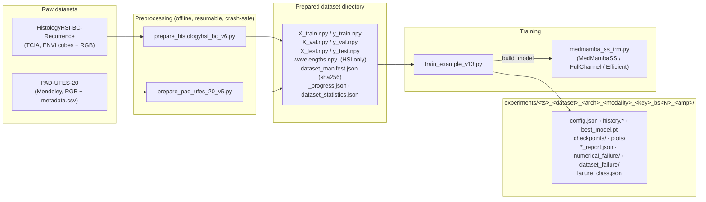

# MedMamba‑SS‑TRM — Documentation

Detailed reference documentation for the four core files of this repository, plus an appendix covering the shared `training/` infrastructure they all rely on.

| # | document | file documented | what it is |
|---|---|---|---|
| 1 | [**`01_medmamba_ss_trm_model.md`**](01_medmamba_ss_trm_model.md) | [`medmamba_ss_trm.py`](../medmamba_ss_trm.py) | the sensor‑agnostic spectral–spatial **model architecture** (config, SSM math, spectral pathway, spatial backbone, fusion, task heads) |
| 2 | [**`02_train_example_v13.md`**](02_train_example_v13.md) | `train_example_v13.py` (deleted; `git show a94ccc3:archive/train_example_v13.py`) | the **training entry point** — dataset validation gates, model assembly, loss, the `TrainerG_v9` numerical‑stability trainer, artifacts |
| 3 | [**`03_prepare_histologyhsi_bc_v6.md`**](03_prepare_histologyhsi_bc_v6.md) | [`prepare_histologyhsi_bc_v6.py`](../prepare_histologyhsi_bc_v6.py) | **HSI + RGB preprocessing** — ENVI cubes → flat `.npy`, band selection, ROI, stratified split, crash‑safe unify |
| 4 | [**`04_prepare_pad_ufes_20_v5.md`**](04_prepare_pad_ufes_20_v5.md) | [`prepare_pad_ufes_20_v5.py`](../prepare_pad_ufes_20_v5.py) | **PAD‑UFES‑20 RGB preprocessing** — clinical skin‑lesion images → flat `.npy`, same resumable/crash‑safe design |
| — | [**`05_shared_infrastructure.md`**](05_shared_infrastructure.md) | `training/*.py` | appendix: atomic I/O, `.npy` integrity, stratified split, unify, DataLoader policy, numerical stability, failure taxonomy, trainer lineage |
| 7 | [**`07_parameters_v14.md`**](07_parameters_v14.md) | [`train_example_v14.py`](../train_example_v14.py) | **complete CLI parameter reference** — every flag, its options, when to change it, and the per‑architecture applicability matrix (which flags are silent no‑ops on which model) |
| 8 | [**`08_commands.md`**](08_commands.md) | — | **verified ready‑to‑run commands** for RGB / HSI / any dataset, with measured wall‑clock and VRAM, plus troubleshooting |
| 9 | [**`09_v15_remediation.md`**](09_v15_remediation.md) | [`train_example_v15.py`](../archive/train_example_v15.py) | **the representation‑collapse remediation** — why both completed runs trained a constant function, the gates that now catch it, every v15 flag, and where the plan turned out to be wrong |
| 10 | [**`10_commands_v15.md`**](10_commands_v15.md) | — | **v15 ready‑to‑run commands** — re‑prep, qualification and full runs for HSI and PAD‑UFES‑20, the tokenizer ablation, and measured wall‑clock/VRAM for each |
| 11 | [**`11_v16_optimal_and_reconstruction.md`**](11_v16_optimal_and_reconstruction.md) | [`train_example_v16_optimal.py`](../train_example_v16_optimal.py) · [`prepare_pad_ufes_20_optimal.py`](../prepare_pad_ufes_20_optimal.py) · [`prepare_histologyhsi_bc_v8.py`](../prepare_histologyhsi_bc_v8.py) · [`training/recon_artifacts.py`](../training/recon_artifacts.py) | **START HERE for the current state** — which file is current, the measured HSI-vs-RGB and PAD results, the GPU budget on this machine, and the reconstruction-artifact pipeline |
| 12 | [**`12_commands_datasets.md`**](12_commands_datasets.md) | — | **the commands you actually run** — validated against the real HistologyHSI-BC and PAD-UFES-20 downloads: all three analyses (histology HSI, histology RGB, PAD RGB), reconstruction, and GPU tuning |
| 13 | [**`13_additional_analyses.md`**](13_additional_analyses.md) | — | **why** each ablation is worth GPU time, what it controls for and what it cannot tell you (the commands live in doc 12); plus why recurrence prediction is blocked and what cross-dataset transfer would need |
| 14 | [**`14_performance_and_progress.md`**](14_performance_and_progress.md) | [`scripts/gpu_tune.py`](../scripts/gpu_tune.py) · [`training/progress.py`](../training/progress.py) · [`training/fused_stability_checks.py`](../training/fused_stability_checks.py) | **v17 — how fast a run is and what it is doing** — the measured compile/checkpoint/batch sweep, the two optimisations that were measured and REJECTED, the new defaults, the progress/ETA output and the new `history.json` timing fields |
| 15 | [**`15_v18_commands.md`**](15_v18_commands.md) | [`train_example_v18.py`](../train_example_v18.py) · [`scripts/flops_report.py`](../scripts/flops_report.py) · [`scripts/latent_space.py`](../scripts/latent_space.py) · [`scripts/eval_band_decimation.py`](../scripts/eval_band_decimation.py) · [`scripts/make_band_subset_build.py`](../scripts/make_band_subset_build.py) | **v18 — every command needed to finish the paper** — the experiment set that closes manuscript v8's open claims, in run order with measured costs; plus the three flags (`--lambda_sam 0.1`, `--epochs`, `--run_tag`) that silently invalidate a run if skipped |
| 17 | [**`17_train_and_sweeps.md`**](17_train_and_sweeps.md) | [`train.py`](../train.py) · [`run_experiments.py`](../run_experiments.py) · [`sweeps/`](../sweeps/) | **START HERE to run anything** — one training script with `--profile` (base / original / optimal / v18 / optimal_recon) replacing the six `train_example_v16*/v18` entry points, and one sweep runner replacing the bash queues; how parity with the archived scripts was verified |
| 18 | [**`18_top_runs.md`**](18_top_runs.md) | [`scripts/run_top3.py`](../scripts/run_top3.py) | **the ten best MedMamba-SS-TRM runs** (test balanced accuracy, runs with reconstruction images) with their metrics, shared recipe and the current command that reproduces each; plus a script that re-runs the top three on any `--data_dir` |

> **⚠️ Currency note.** Documents 01–10 were written against `train_example_v13/v14/v15.py`,
> `prepare_histologyhsi_bc_v6.py` and `prepare_pad_ufes_20_v5.py`. Those files are FROZEN and
> the documents remain accurate *for them*, but they are no longer what you run.
> **[`11_v16_optimal_and_reconstruction.md`](11_v16_optimal_and_reconstruction.md) documents the
> current scripts** (`train_example_v16*.py`, `prepare_pad_ufes_20_optimal.py`,
> `prepare_histologyhsi_bc_v8.py`) and carries the measured results and hardware budget.
> `01_medmamba_ss_trm_model.md` is still current — `medmamba_ss_trm.py` has not changed.
> `07_parameters_v14.md` is the most stale: run `--help` on the entry point instead.

> **Names (renamed 2026-10-02).** **MedMamba-SS** is MedMamba
> ([arXiv:2403.03849](https://arxiv.org/abs/2403.03849)) with the spectral-spatial changes:
> the hierarchical model, `MedMambaSS` / `MedMambaSSBackbone`. **MedMamba-SS-TRM** is
> MedMamba-SS with the Tiny Recursive Model logic of
> [arXiv:2510.04871](https://arxiv.org/abs/2510.04871), which replaces the stage stack with one
> weight-shared recursive core to cut the parameter count: `MedMambaSSTRM` /
> `MedMambaSSTRMBackbone`. Both live in `medmamba_ss_trm.py` and share `MedMambaSSTRMConfig`.
> Older names in logs, plans, `archive/` and earlier manuscripts: `gmedmamba.py` →
> `medmamba_ss_trm.py`, `GMedMamba` → `MedMambaSS`, `GMedMambaRecursive` / "GMedMamba-R" →
> `MedMambaSSTRM`, `GMedMambaConfig` → `MedMambaSSTRMConfig`, `gmedmamba_*.py` →
> `medmamba_ss_*.py` (`gmedmamba_ema.py` → `medmamba_ss_trm_ema.py`).
>
> **Entry points (2026-09-28):** every `train_example_v16*.py` / `train_example_v18.py` command in
> documents 11–16 now runs as `python train.py --profile <p> ...` with the same flags — see
> [`17_train_and_sweeps.md`](17_train_and_sweeps.md) for the mapping. The old files are in `archive/`.
> On 2026-10-01 the profiles were renamed for what they are for (`v18` is now `paper_recipe`);
> a name ending in `_norecon` trains without reconstruction. The old names still work.
>
> **Module names (2026-10-01):** ten `training/*_vNN.py` modules dropped their version suffix
> (`progress_v16.py` → `progress.py`, `grad_health_v16.py` → `fused_stability_checks.py`, …),
> and `npy_dataset_v16.py` was merged into `npy_data.py`.
> `plan/`, `paper/` and the archived scripts still use the old names; the full old → new table
> is `RENAMED_MODULES` in [`training/__init__.py`](../training/__init__.py), which keeps the old
> names importable. Twelve unused `training/` modules were deleted the same day, along with
> everything in `archive/` that was not frozen; `archive/README.md` lists them and how to
> recover each from git.
>
> **Script names (2026-10-01):** fourteen `scripts/*_vNN.py` tools dropped their suffix too
> (`eval_test_split_v16.py` → `eval_test_split.py`, `train_hsi_baseline_v19.py` →
> `train_hsi_baseline.py`, …); commands in these documents use the new names. Files they
> *write* keep their names (`heldout_v19/`, `shallow_probe_heldout_v19.json`,
> `eval_mode_check_v20.json`), so existing results are still found. The paper-analysis
> scripts keep their suffix because it names the evidence set and the JSON they produce
> (`analysis_v19.py` → `v19_analysis.json`, `analysis_v20.py` → `v20_analysis.json`, …).
>
> **To run something right now**, go straight to [`12_commands_datasets.md`](12_commands_datasets.md).
>
> **To finish the paper**, go to [`15_v18_commands.md`](15_v18_commands.md).

All diagrams are [Mermaid](https://mermaid.js.org/) (rendered natively by GitHub / most Markdown viewers); math is GitHub‑flavoured LaTeX (`$…$`, `$$…$$`).

---

## How the four files fit together



### The contract between prep and training

The prep scripts and `train_example_v13.py` agree on a small **on‑disk contract**:

| artifact | produced by | consumed by | purpose |
|---|---|---|---|
| `X_{train,val,test}.npy` | `unify_split` (prep) | `discover_data` → `NpyDataset` (train) | `float32 [N, ·, ·, C]` patches / images |
| `y_{train,val,test}.npy` | `unify_split` (prep) | same | `int64 [N]` labels |
| `wavelengths.npy` | HSI prep only | `discover_data` (train) → sets **modality = `hsi`** and feeds spectral metrics | band centres in nm, matching the written band count |
| `dataset_manifest.json` | `finalize_dataset` (prep) | `--manifest_check` (train) | per‑file shape/dtype/size/sha256 + provenance — cross‑checked before any Dataset is built |
| `_progress.json` | prep manifest | `_run_leakage_check` (train) | patient/slide split sets for the leakage check |
| `class_names.json` (optional) | (not written by these scripts) | `discover_data` | pretty class names |

Everything else about a dataset (split algorithm version, band selection, balancing, skipped inputs) is recorded in `dataset_statistics.json` and the manifest's `extra` block for provenance.

### Shared engineering themes

All four files were hardened by the same **"v12/v13 Definitive Training Stability & SIGBUS Remediation"** plan. The recurring ideas:

1. **Atomic writes everywhere** — `tmp → fsync → os.replace`. A crash never leaves a half‑written file under its real name (`training/npy_atomic.py`, `training/dataset_prep_unify.py`).
2. **Validate before you mmap** — a corrupt `.npy` becomes a catchable `DatasetStorageError` *before* any memory‑map or DataLoader worker exists, never an uncatchable `SIGBUS` (`training/npy_integrity.py`).
3. **Resumable by capture/image** — an OOM‑kill loses at most the one in‑flight input; re‑run the same command (`_progress.json` + orphan‑shard cleanup).
4. **Read‑back verification** — produced arrays are re‑read end‑to‑end (and checked for the all‑zeros `open_memmap`‑killed signature) before source shards are deleted.
5. **Stratified patient‑level splits with a coverage fill pass** — no split silently missing a class; genuine limitations are *reported*, not hidden (`training/dataset_prep_common.py`).
6. **One failure vocabulary** — every terminal error maps to a single `FailureClass`, written to `failure_class.json` / `dataset_failure/` / `numerical_failure/` (`training/failure_taxonomy.py`).
7. **Numerical stability as a controller** — skip‑ratio classification, per‑parameter gradient inspection, and a persistent‑failure → *run abort* policy, not "limp on indefinitely" (`training/numerical_stability.py`, `TrainerG_v9`).
8. **`medmamba_ss_trm.py` stays framework‑free** — activation swaps, gradient checkpointing, reconstruction heads, and preset overriding all wrap or monkey‑patch the model at runtime.

---

## Quick start

> These are the **current** commands. The v13-era quick start that used to sit here is
> preserved, with its measured numbers, in [`08_commands.md`](08_commands.md) /
> [`10_commands_v15.md`](10_commands_v15.md). Full detail and the measured results for
> everything below: [`11_v16_optimal_and_reconstruction.md`](11_v16_optimal_and_reconstruction.md).

```bash
# 1a. HSI — gain-corrected reflectance (v8 prep; resumable, re-run if killed)
python prepare_histologyhsi_bc.py --root /path/to/HistologyHSI-BC-Recurrence \
    --out_dir ./data/hsi_v8-80_10_10_importance --patch_size 11 --stride 11 \
    --label_source tissue --modality both --split 80_10_10 \
    --band_selection importance --num_bands 32 --num_workers 8

# 1b. PAD-UFES-20 — whole 224x224 clinical images, patient-grouped, three-way split
python prepare_pad_ufes_20_optimal.py --root /path/to/PAD-UFES-20 \
    --out_dir ./data/pad_optimal --num_workers 8

# 2. The bar the network has to clear (linear probe on the same inputs)
python scripts/shallow_baseline_v16.py --data_dir ./data/pad_optimal

# 3. HSI run — reproduces the headline result
#    (test accuracy 0.9436, balanced 0.9073, macro-F1 0.8580)
python train_example_v16.py --data_dir data/hsi_v8-80_10_10_importance/hsi/ \
    --architecture recursive --normalization global_zscore --loss weighted_ce \
    --class_weight_power 0.75 --batch_size 256 --lr 1e-4 --epochs 20 --amp bf16 \
    --checkpoint_metric f1_macro --train_subsample_frac 0.1 --val_subsample_frac 0.1 --seed 42

#    The matched RGB arm — identical flags, only --data_dir changes (0.8904 / 0.7571 / 0.7282)
python train_example_v16.py --data_dir data/hsi_v8-80_10_10_importance/rgb/ ...

# 4. PAD run — best-metrics configuration. Climb the ladder: --stage fit proves the model
#    can fit at all before any regulariser or class weighting is switched on.
python train_example_v16_optimal.py --data_dir ./data/pad_optimal --stage fit
python train_example_v16_optimal.py --data_dir ./data/pad_optimal --stage balance
python train_example_v16_optimal.py --data_dir ./data/pad_optimal

# 5. With reconstruction artifacts (cubes + per-sample metrics on disk, not just figures)
python train_example_v16_optimal_recon.py --data_dir ./data/pad_optimal

#    ...or recover them from a finished run without retraining
python scripts/export_recon_samples.py --run_dir experiments/<run> --split test

# 6. Compare finished runs side by side (any ablation), and read the HONEST unit:
#    per-PATIENT recall, not per-patch - the histology corpus has 45 patients.
python scripts/compare_runs.py --all --filter importance --per_patient
```

### Running the tests (moved in v17 S12)

Every `test_*.py` moved from the repository root into `tests/`, with a `tests/conftest.py`
that puts the root back on `sys.path` and a `pytest.ini` that keeps collection out of
`data/` and `experiments/`. Bare `pytest` now runs the whole suite from anywhere in the
repo:

```bash
pytest -q                                    # the whole suite (~2 min, CPU only)
pytest tests/test_fast_loop_v17.py -q        # one file - note the tests/ prefix
pytest -k representation -q                  # by name, prefix-free
```

**One stale instruction to know about.** `train_example_v15.py` is on `FROZEN_GLOBS` and
cannot be edited, and it prints `pytest test_representation_sensitivity.py -q` at runtime
(`train_example_v15.py:991,1664`) when the representation-collapse gate fails. That path no
longer exists. Read it as `pytest tests/test_representation_sensitivity.py -q`, or just
`pytest -k representation -q`. The same applies to the `pytest <file>` commands quoted
throughout `plan/`, which are left as written because they are a record of what was run at
the time.

---

## Version context

**Current** (what to run), newest last:

| role | current file | supersedes | note |
|---|---|---|---|
| model | `medmamba_ss_trm.py` | MedMamba‑SS v1/v2 | FROZEN — unchanged since doc 01 was written |
| training core | `train_example_v16.py` (`TrainerG_v12`) | `v15.py` (+ v6…v14) | `v6`/`v7`/`v15` archived 2026-09-29; the parts still used are verbatim copies in `training/` (see `archive/README.md`) |
| training, best metrics | `train_example_v16_optimal.py` | — | imports v16, passes `Overrides`; adds `--stage`, `--target_token_grid` |
| training, protocol fidelity | `train_example_v16_original.py` | — | matched-conditions MedMamba comparison |
| training + recon artifacts | `train_example_v16_recon.py` (`TrainerG_v13`) | — | writes cubes + per-sample metrics |
| both of the last two | `train_example_v16_optimal_recon.py` | — | composes them; `recon_mode=latent`, `lambda_mse=0.1` |
| HSI prep | `prepare_histologyhsi_bc_v8.py` | `_v7.py` → `_v6.py` → `_v5.py` | gain-corrected reflectance, float16-safe |
| PAD prep | `prepare_pad_ufes_20_optimal.py` | `_v6.py` → `_v5.py` → `_v4.py` | `--tiling whole`, `70/15/15`, patient-grouped |

The repo convention is **new versioned files, never in‑place edits**, so anything depending on an
exact older behaviour keeps it unchanged. This is enforced, not merely conventional:
`test_frozen_files_untouched.py` fails the build if `medmamba_ss_trm.py`, `train_example_v15.py`, any
`training/trainerg_v3..v11.py`, `training/dataloader_config.py`, `training/augmentation.py`,
`training/losses.py`, anything under `training/prep/`, or any earlier prep generation differs from
its committed base. The `*_optimal` / `*_original` / `*_recon` entry points therefore **import
`train_example_v16.py` and pass it a `v16.Overrides` value** (v17) rather than copying its
`_main`. Before v17 they rebound names in its module namespace instead — up to three layers of
it, each overwriting the last; `train_example_v16_original.py` still uses that mechanism, for the
reason given in its `install_overrides` docstring.

Superseded source that nothing imports — `train_example_v8..v13.py`, `prepare_pad_ufes20.py`,
`gmedmamba_io.py`, `training/checkpoint.py` and the three older `model/gmedmamba_v*.py` copies —
was archived in v17 and deleted on 2026-10-01. Frozen files still cite some of those filenames;
`archive/README.md` lists them all with the command that recovers each from git (a94ccc3).

### v17 — throughput and observability

No model or metric changes. `--compile on`, `--loader_mode performance` and
`--eval_artifact_stride 5` became defaults (all three were already what the HSI runs used, typed
by hand); MedMamba‑SS‑TRM became the default architecture on the bare entry point too; training and
prep gained a per-step progress line and an ETA; and `history.json` gained
`train_time_s` / `val_time_s` / `artifact_time_s` / `data_wait_s` / `s_per_step`, because
`epoch_time` was previously the only timing a run recorded and it does not cover the whole epoch.
See **`documentations/14_performance_and_progress.md`** — including the two things v17 measured
and **rejected** (`--no_trm_checkpoint_core`, and raising `--batch_size`).

Two later fixes need no flag: progress lines redraw in place in a terminal and stay whole
lines when redirected through `| tee`; and a run raises its own `RLIMIT_NOFILE` at startup,
retrying gate G6's whole-split test evaluation single-process if it still exhausts file
descriptors — a two-hour HSI run had previously lost its held-out number that way.

To reproduce a pre‑v17 run exactly: `--compile off --loader_mode balanced
--eval_artifact_stride 1`.

---

## Glossary

| term | meaning |
|---|---|
| **capture** | one HSI acquisition (a cube + its RGB rendering + references) — the unit of resumable work in the HSI prep script |
| **shard** | a small `.npy` file of ≤ `batch_size` patches, the intermediate streaming unit before unify |
| **unify** | merge all shards of a `(modality, split)` into one final `X_*.npy` / `y_*.npy` |
| **`d_ctx`** | width of the spectral **context** vector that flows between the spectral pathway and the spatial backbone |
| **SS2D** | 2‑D selective scan — Mamba's state‑space recurrence run over several raster/diagonal orderings of an image |
| **SSM** | state‑space model; here the discretized linear recurrence $h_\ell = \bar A_\ell h_{\ell-1} + \bar B_\ell x_\ell$ |
| **SAM** | Spectral Angle Mapper — angle between a true and reconstructed spectrum, used as a reconstruction loss |
| **modality** | `hsi` (many bands, has `wavelengths.npy`) or `rgb` (`C=3`); auto‑detected by the trainer |
| **skip ratio** | fraction of an epoch's batches whose optimizer step was skipped (non‑finite loss/gradient) — classified `healthy…fatal` |
| **`FailureClass`** | the single label written to `failure_class.json` explaining why a run stopped |
| **`scientifically_qualified`** | `config.json` flag; `false` if `--skip_dataset_validation` was used |
