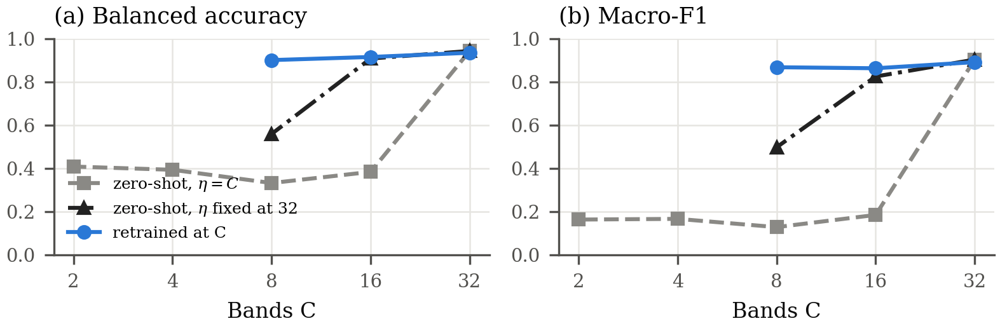

# Pre-Submission Forensic and Scientific Audit — Manuscript v18

- **Document audited:** `paper/draft/MedMamba-SS-TRM_manuscript_v18.md` (992 lines) and `paper/draft/MedMamba-SS-TRM_supplement_v18.md`
- **Protocol:** `doc/paper_analysis.prompt.md` (Strict Research Paper Enforcer)
- **Date:** 2026-09-26
- **Sources used for cross-checking:** `paper/source/v19_analysis.json`, `paper/source/v18_short_analysis.json`, `paper/draft/V18_EVIDENCE_AUDIT.md`, and the rendered figures `fig_bands_v18.png` and `fig_comparison.png`.
- **Scope:** The manuscript was **not edited**. This audit did not check the model code again. `V18_EVIDENCE_AUDIT.md` §1 records that Sec. IV was verified against the code in the v12–v16 audits.
- **Line numbers** refer to the built `.md` file. Fixes go into `paper/source/v18_parts/`, followed by a rebuild.

---

## 0. Verification performed (checks that PASSED)

These checks were recomputed during the audit. They are listed so the findings below are read against what was actually checked.

| Item | Check | Result |
| --- | --- | --- |
| Table III | Row and column sums; 4,914 × captures; 10 small captures × 2,002 in validation IDC | All consistent (e.g. 39 × 4,914 + 10 × 2,002 = 211,666) |
| Table II | PAD class sums (1,626 / 344); ratios 13.1 : 1 and 15.7 : 1; 2,298 images in total | Consistent |
| Eq. (1) | 1,536C + 288 → 4,896 and 49,440 | Consistent |
| Table IV | 4d² + 5d + 1 = 4,257; compressor 16,640; total 38,724 | Consistent |
| Table VII | Stem 8,577; core 398,336; head 772; total 446,409; shares | Consistent |
| Eq. (23) | 2·121·2·(12·128² + 9·128) = 95.72 MFLOPs; 63 applications = 6.03 GF; + 0.173 = 6.203 GF | Consistent |
| Depth GFLOPs | JSON values (2.214 / 4.225 / 6.235 / 8.245) minus the 0.031 GF decoder = paper values (2.183 / 4.193 / 6.203 / 8.213) | Consistent |
| Ratios | 6.2×, 22.3×, 8.2×, 61.4×, 32×; 2.8 % outside the core | Consistent |
| Steps | 250,113 / 256 → 978 steps; × 20 = 19,560; × 12 = 11,736; warmup 3 % = 587 / 352; 9.86 % and 10.2 % subsets | Consistent |
| Table XII | Means, s.d. and Δ recomputed from the per-seed rows | Consistent (Δ rounding ≤ 0.01) |
| Pearson r | Test vs. validation BA over five seeds | −0.953, as stated |
| Bootstrap retention | Expected retention 1 − 0.8⁵ = 67 % (test and validation); 1 − 0.8¹⁰ = 89 % (pooled) | Matches 1,372 / 1,355 / 1,808 of 2,000 |
| Table XIII → Fig. 10(b) | Patient macro recalls from the class recalls (136, 197, 304, 65); the 7 / 1 / 2 split | Consistent |
| Majority-class row | F1 of 0.272 / 0.258 / 0.266 from the class fractions | Consistent |
| Zero-shot (VI-C) | 0.3845 / 0.9086 / 0.3329 / 0.5599; range 0.33–0.41 including 2 and 4 bands; per-class F1 | Matches `v18_short_analysis.json` and Fig. 8 |
| Five-seed baselines | 3.38 / 9.77 / −8.19 / −3.11 / −2.62 / +3.19 points | Consistent with Table X |
| Calibration | Test ECE per seed: HSI < RGB at every seed (0.066/0.084, 0.049/0.121, 0.060/0.075, 0.051/0.097, 0.056/0.090) | "At every seed" holds on test |
| AURC | 0.0035 / 0.0038 / 0.0068 / 0.0104 / 0.0103; 98.42 % vs 98.49 % | Matches the JSON |
| Decoder | 575,849 − 559,116 = 16,733 = 29 × 577 (one 3 × 3 output conv from 64 channels) | Consistent |
| PAD | 234 = 6 × 39 (MEL training count); 54.8 − 37.5 = 17.3 points | Consistent |
| Supplement S2 | 5 × 10⁻⁵ → 2.5 × 10⁻⁹; RMS output 0.01 at 10⁻⁵ with ε = 10⁻⁶ | Consistent |

No fabricated number was found. Every number traced to a source or recomputed matches it.

---

## FINDINGS

## FINDING 1

**Severity:** `HIGH`
**Audit type:** `Methodological`
**Location:** Abstract; Section III-A → Band selection; Section VII-C → Band selection

**Original text:**
> "Because the 32 bands were selected with labels that included held-out patients, these hyperspectral results are provisional." (l. 10)
> "so tissue labels of held-out patients entered the selection of the input bands." (l. 119)

**Problem:** A supervised step, mutual information with the tissue label, chose the input bands. Labels from 16 held-out captures were part of that step. The training-only re-selection bounds the change to the *input bands* (≤ 5.1 nm) but does not measure the change in *results*. No model was retrained on the new build.

**Why it matters:** Every hyperspectral number in the paper, including the headline, the HSI-vs-RGB comparison and the band-gate profile, carries label information from the held-out patients. The disclosure is honest and prominent. The scientific problem remains open.

**Evidence:** III-A, VII-C and `V18_EVIDENCE_AUDIT.md` §3 (F1: ≈ 60 h, not run).

**Confidence:** `Confirmed`
**Research impact:** `Critical`

**Required resolution:** Retrain at least the headline pair (ideally all five seeds) on `data/hsi_v9-trainsel`, report the results beside the current ones, and remove "provisional". Until then, keep the caveat in the abstract.

**Human approval required:** `YES`

---

## FINDING 2

**Severity:** `HIGH`
**Audit type:** `Methodological`
**Location:** Section V-C, ¶1; Section VI-A, ¶3; Section VII-C → Held-out patients

**Original text:**
> "the test scores of those development runs were recorded and compared alongside their validation scores, so the test patients are independent of checkpoint selection but not demonstrably of recipe development." (l. 555)
> "Seed 42, at which the single-run baselines and every single-seed analysis below were run, is MedMamba-SS-TRM's best seed on the test patients and its worst on the validation patients." (l. 614)

**Problem:** No part of the evaluation is fully untouched:
- The validation patients select the checkpoints.
- The test patients were consulted during recipe development.
- The seed used for every single-seed analysis is the most favourable test seed.

The headline "highest test balanced accuracy" is therefore the least protected number in the paper, and it is the one the abstract leads with.

**Why it matters:** A reviewer can argue that the test advantage (and its reversal on validation, with r = −0.95 across seeds) partly reflects development on the test patients.

**Evidence:** Disclosed in V-C, VI-A and VII-C. Open question from the v15 audit: which decisions used test scores.

**Confidence:** `Confirmed` (the exposure exists); `Unverified` (its effect)
**Research impact:** `Critical`

**Required resolution:** `VERIFY` which recipe decisions used test scores and state them. Preferred fix: `PROVIDE EXPERIMENTAL EVIDENCE` through patient-level cross-validation with the recipe frozen (F3 in `FUTURE_EXPERIMENTS.md`). Meanwhile, give the pooled result the same weight as the test result in the abstract.

**Human approval required:** `YES`

---

## FINDING 3

**Severity:** `HIGH`
**Audit type:** `Scientific` (statistical power)
**Location:** Section III-A → Patient split; Section VI-A; Section VI-F

**Original text:**
> "so one third of balanced accuracy on either set is measured on one patient." (l. 117)

**Problem:**
- The held-out evidence is 10 patients.
- DCIS appears in one patient per held-out set (136 and 197).
- The model ranking and the sign of the HSI–RGB difference both flip between the two sets.
- The patient-bootstrap intervals are conditioned on the single DCIS patient being drawn, and they discard about 32 % of the draws.

**Why it matters:** The central comparative claims, on test (MedMamba-SS-TRM ranked first) and on modality (HSI > RGB on test), are not generalizable beyond these patients. The paper says so in VI-F and VII-B. The abstract still leads with the test number.

**Evidence:** Tables III, XII and XIII; VI-F: "ten patients … are too few to decide".

**Confidence:** `Confirmed`
**Research impact:** `Critical`

**Required resolution:** `PROVIDE EXPERIMENTAL EVIDENCE`: 5-fold patient-level CV covering all 7 DCIS patients. If that is not possible before submission, `REWRITE` the abstract to lead with the pooled ten-patient result, or state the test/validation disagreement in its first results sentence.

**Human approval required:** `YES`

---

## FINDING 4

**Severity:** `HIGH`
**Audit type:** `Scientific`
**Location:** Title; Section I → Contribution 1; Section VI-D; Section VII-B

**Original text:**
> Title: "MedMamba-SS and MedMamba-SS-TRM: Band-Count-Agnostic Spectral–Spatial Architectures for Medical Image Classification …"
> "The hierarchical MedMamba-SS itself trains on whole skin-lesion photographs, well above the majority-class rate (Section VI-K), but on hyperspectral patches it stays near chance under the recipe used for the recursive model" (l. 50)

**Problem:** Contribution 1 is presented as a *model*, MedMamba-SS, but:
- Its hyperspectral evidence comes from a different model (MedMamba-SS-TRM, which shares the pathway).
- On the target modality MedMamba-SS itself reaches ≤ 0.49 BA even after the batch-norm artefact is removed.
- Its hierarchy additions (context selector, FiLM, context updater, modified block, head) are unablated.
- Its only successful run is on RGB photographs, where band-count agnosticism is not exercised.

The title presents both models as spectral–spatial classifiers for medical images.

**Why it matters:** A reviewer will read Contribution 1 as undemonstrated. The demonstrated contribution is the *spectral pathway*, evaluated inside MedMamba-SS-TRM.

**Evidence:** VI-D; Table XI; VII-B: "remain unablated".

**Confidence:** `Confirmed`
**Research impact:** `Major`

**Required resolution:** `CONFIRM INTENDED MEANING`, then choose one:
- (a) Re-scope Contribution 1 as "the band-count-agnostic spectral pathway (and MedMamba-SS as its hierarchical host, which fails on HSI patches)".
- (b) `PROVIDE EXPERIMENTAL EVIDENCE` that MedMamba-SS trains on HSI once batch-statistics dependence is removed (F9).

Also review whether the title should name the pathway rather than claim two working spectral–spatial architectures.

**Human approval required:** `YES`

---

## FINDING 5

**Severity:** `HIGH`
**Audit type:** `Logical`
**Location:** Section I, question 2; Section VI-D, last ¶; Section VIII, ¶2 and ¶5

**Original text:**
> "Can one recursively applied core replace the hierarchical backbone, at what computational cost, and with what benefit from recursion depth?" (l. 46)
> "On hyperspectral patches, therefore, the recursive substitution is established on parameters, arithmetic and interface" (l. 654)
> "The structural results hold whichever patients are held out." (l. 852)
> "Together, these results support the two architectural claims, a front end whose parameters do not depend on the band count and a recursive backbone that trades storage for compute" (l. 858)

**Problem:** The research question asks whether the core can *replace* the hierarchy. That cannot be answered on quality, for three reasons:
- The hierarchy it replaces does not train on this data.
- The MedMamba comparison changes the mixer, the recipe and the selection at once.
- No non-recursive core of the same size was trained.

The "structural results" that the Conclusion says "hold whichever patients are held out" are properties by construction: the parameter count follows from Proposition 1, and the compute growth from weight sharing (Eq. 23). The experiment did not find them. Presenting design properties as results that "support the architectural claims" is circular.

**Why it matters:** The empirical support for Contribution 2 reduces to "trains stably and is competitive on 5 test patients". Depth gives no measurable benefit (21 applications ≈ 63).

**Evidence:** VI-D, VI-E, VII-B ("whether recursion itself helps … is not tested").

**Confidence:** `Confirmed`
**Research impact:** `Major`

**Required resolution:** `REWRITE` the Conclusion to separate the *design properties*, which follow from Proposition 1 and Eq. (23) and are verified by measurement, from the *empirical findings*. State that question 2 is answered on cost only, not on quality. `PROVIDE EXPERIMENTAL EVIDENCE` if possible: the K = 2 / non-recursive control (F5).

**Human approval required:** `YES`

---

## FINDING 6

**Severity:** `MEDIUM`
**Audit type:** `Numerical`
**Location:** Section VII-A → Table XVI title

**Original text:**
> "**Summary of Rankings (Seed 42 Unless Stated; Every Baseline Is a Single Run)**" (l. 807)

**Problem:** The title contradicts the table body and Table X. HybridSN and SpectralFormer are now five-seed baselines, and Table XVI itself cites "HybridSN (five seeds 87.12 ± 0.66 %…)". The title is stale text from v17.

**Why it matters:** A reviewer comparing the title with the rows finds a direct contradiction.

**Evidence:** Table X, five-seed rows; VII-C: "HybridSN and SpectralFormer were run at the five seeds".

**Confidence:** `Confirmed`
**Research impact:** `Moderate`

**Required resolution:** `CORRECT` the title, e.g. "…; MedMamba and the Probes Are Single Runs".

**Human approval required:** `NO` (a factual correction that does not change a result)

---

## FINDING 7

**Severity:** `MEDIUM`
**Audit type:** `Numerical`
**Location:** Section VII-A → Table XVI, row "Validation balanced accuracy"

**Original text:**
> "| Validation balanced accuracy, five patients | HybridSN (five seeds 84.37 ± 1.04 %; ahead at five of five seeds) | RGB colour probe (84.90 %, single run); MedMamba-SS-TRM five seeds 76.18 % | VI-A |"

**Problem:** The listed runner-up (84.90 %) scores higher than the listed leader (84.37 %). The row mixes a five-seed mean with a single run. At seed 42 HybridSN (84.94 %) leads the probe by 0.04 points, but its five-seed mean is lower than the probe's single run. "Ahead at five of five seeds" refers to MedMamba-SS-TRM, not to the probe.

**Why it matters:** The internal numbers contradict the ranking the row asserts.

**Evidence:** Table X: HybridSN seed 42 = 84.94; five seeds = 84.37 ± 1.04; RGB probe = 84.90.

**Confidence:** `Confirmed`
**Research impact:** `Moderate`

**Required resolution:** `CORRECT`. Either call the row "Level: HybridSN (84.94 % at seed 42; 84.37 ± 1.04 % over five seeds) and RGB probe (84.90 %)", or rank on a common basis and say which. The same mixing appears, without inversion, in the pooled rows. Check them too.

**Human approval required:** `YES` (changes a stated ranking)

---

## FINDING 8

**Severity:** `MEDIUM`
**Audit type:** `Scientific`
**Location:** Abstract; Contribution 1; Section VI-C, "Behaviour" ¶; Section VIII, ¶3

**Original text:**
> "a trained model transfers zero-shot to 16 bands (90.9 %) only with its encoding scale held fixed." (l. 10)
> "so a band-count-independent choice of $\eta$ would have been the better design" (l. 628)

**Problem:**
- The fixed-η evaluation is a *post-hoc* modification, designed after the zero-shot failure had been seen on the test patients. It was run on one checkpoint (the best test seed), one decimation pattern and the test split only.
- "Would have been the better design" is untested. Fixing η at training time also changes the RGB arm (η = 3 → a fixed value) and could change 32-band training.
- The abstract does not say "one checkpoint" or "post hoc".

**Why it matters:** A diagnostic becomes a headline property in the abstract.

**Evidence:** VI-C: "These are single evaluations of the seed-42 checkpoint". `V18_EVIDENCE_AUDIT.md` §6.

**Confidence:** `Confirmed`
**Research impact:** `Moderate`

**Required resolution:** `REWRITE`. In the abstract and Contribution 1, say "in a post-hoc evaluation of one checkpoint". Replace "would have been the better design" with "a band-count-independent η is a candidate design, to be tested by retraining". Optionally `PROVIDE EXPERIMENTAL EVIDENCE`: fixed-η evaluation on the other four seeds' checkpoints, which is cheap (≈ 10 min per band count).

**Human approval required:** `YES`

---

## FINDING 9

**Severity:** `MEDIUM`
**Audit type:** `Scientific` (statistical)
**Location:** Section VI-C, "Behaviour" ¶

**Original text:**
> "The loss of 3.4 points of balanced accuracy is larger than the seed-to-seed standard deviation at 20 epochs (1.9 points), so this loss may be real." (l. 628)

**Problem:**
- The 3.4 points is a difference between two single runs, so its standard deviation is about √2 × σ ≈ 2.7 points, not 1.9.
- The σ was measured at 20 epochs, but both runs are 12-epoch runs.
- The observed difference is therefore ≈ 1.3 s.d., which is weak evidence.
- The 16-band run has *higher* BA but *lower* F1 than the 8-band run, which itself shows single-run noise of this size.

**Why it matters:** The comparison uses the wrong reference spread. "May be real" is hedged but rests on the wrong yardstick.

**Evidence:** Table XI; V-E.

**Confidence:** `Confirmed`
**Research impact:** `Minor`

**Required resolution:** `CORRECT` the reasoning: compare with the s.d. of a difference, and note the epoch mismatch. Alternatively, drop the sentence and keep "single runs".

**Human approval required:** `YES`

---

## FINDING 10

**Severity:** `MEDIUM`
**Audit type:** `Methodological`
**Location:** Section I, question 3; Section III-B; Section VI-F

**Original text:**
> "does hyperspectral input improve classification over an RGB rendering of the same captures when the model, the training recipe, the patient split and the patch locations are all held fixed?" (l. 46)

**Problem:** The question says "the model … held fixed", but the two arms differ in four ways:
- The input *encoding*: wavelength vs index, and η = 32 vs 3.
- The reconstruction target: 32 vs 3 channels.
- The bit depth: floating-point reflectance vs 8-bit rendering.
- Band provenance: 32 label-selected bands vs a rendering from the full 740-band cube.

III-B, VI-F and VII-C disclose all four. The research question in the Introduction overstates the matching.

**Why it matters:** The question wording promises a cleaner comparison than the one performed, and the difference found (+4.1 / −5.8) is within the range these confounds could produce.

**Evidence:** III-B, last three sentences; Table XII caption.

**Confidence:** `Confirmed`
**Research impact:** `Moderate`

**Required resolution:** `REWRITE` question 3, e.g. "…when the architecture, recipe, patient split and patch locations are held fixed (the input encoding and reconstruction target necessarily differ; Section III-B)".

**Human approval required:** `YES`

---

## FINDING 11

**Severity:** `MEDIUM`
**Audit type:** `Citation` (novelty)
**Location:** Section II-B, ¶1; Section II-F → Gap 2; Table I

**Original text:**
> "MelanoSpec-SSM makes patient-level diagnoses of melanoma against pigmented nevus from hyperspectral pathology images (100 patients, 125 bands between 400 and 1000 nm) with a spectral–spatial state-space model [19]." (l. 68)
> "**Band-count agnosticism untested in medical state-space classifiers and on hyperspectral histopathology.** … None was built into a medical state-space backbone or evaluated on hyperspectral histopathology" (l. 103)

**Problem:** [19] is the closest prior work: a spectral–spatial state-space model on hyperspectral pathology with a 100-patient cohort. It is missing from Table I, and the paper never says how it handles the band axis. Gap 2 rests on [6]–[9] only, but its heading makes a claim about "medical state-space classifiers" in general. `V18_EVIDENCE_AUDIT.md` §2 also records that the descriptions of [6]–[8] and [19] were "not re-checked today".

**Why it matters:** If [19] or another medical SSM handles variable band counts, Gap 2 is wrong. Novelty claims must be checked against the closest work.

**Evidence:** Table I rows; audit §2, row "BAT-Former, DOFA, ChannelViT and MelanoSpec-SSM descriptions".

**Confidence:** `Possible`
**Research impact:** `Moderate`

**Required resolution:** `VERIFY` [19]'s band handling from its full text, and add it as a row in Table I. `VERIFY` that "MelanoSpec-SSM" is the name used in [19]; the reference title does not contain it. If [19] is band-count-fixed, keep Gap 2 and cite [19] as the fixed-band contrast.

**Human approval required:** `YES`

---

## FINDING 12

**Severity:** `MEDIUM`
**Audit type:** `Logical`
**Location:** Section II-F → Gap 3; Section VII-B

**Original text:**
> "whether TRM's specific mechanism (two carried states, deep supervision, a learned halting head) and its depth benefit carry over to noisy medical classification is, to our knowledge, not reported" (l. 104)

**Problem:** Gap 3 names three elements, and the experiments test less than it promises:
- The learned halting head is disabled (Table VIII).
- Deep supervision is restructured into one forward pass (Table VIII).
- The depth benefit is not observed (VI-E).
- No non-recursive control isolates recursion.

VII-B acknowledges this, but the Introduction says MedMamba-SS-TRM "addresses" the third gap.

**Why it matters:** The link from gap to experiment to conclusion is only partial for this gap.

**Evidence:** Table VIII; VI-E; VII-B: "Three expectations one might carry over from TRM do not hold here".

**Confidence:** `Confirmed`
**Research impact:** `Moderate`

**Required resolution:** `REWRITE` Gap 3 to the elements actually tested (the two-state recursion with a gradient-free prelude and segment-level deep supervision), or say in II-F that halting was implemented but found not to learn.

**Human approval required:** `YES`

---

## FINDING 13

**Severity:** `MEDIUM`
**Audit type:** `Methodological`
**Location:** Abstract; Contribution 2; Section V-D

**Original text:**
> "ahead of single-run MedMamba and, at four and five of five paired seeds, of HybridSN and SpectralFormer" (l. 10)
> "No hyperparameter was tuned for either, whereas the recipe was developed for MedMamba-SS-TRM (Section V-C)." (l. 567)
> "MedMamba's checkpoint (epoch 1) was chosen on the same set on which its validation and pooled scores are reported." (l. 566)

**Problem:** The tuning budgets are unequal:
- MedMamba-SS-TRM's recipe was developed with test exposure (Finding 2).
- HybridSN and SpectralFormer are untuned, and adapted (no PCA; 11 × 11 instead of 25 × 25 windows).
- MedMamba uses a different loss, learning rate, epoch count and selection set, and selected epoch 1 of 5.

"First at four of five seeds" also compares a seed-varying model against fixed single runs (MedMamba, probes). The body discloses all of this. The abstract does not qualify the "ahead of" statements.

**Why it matters:** This is an apples-to-oranges comparison that favours the proposed model on the test split.

**Evidence:** V-C and V-D; Table X footnote.

**Confidence:** `Confirmed`
**Research impact:** `Moderate`

**Required resolution:** `CLARIFY` in the abstract, e.g. "…ahead of MedMamba (one run, own recipe) and of untuned HybridSN and SpectralFormer on test…". Or `PROVIDE EXPERIMENTAL EVIDENCE`: MedMamba with matched selection (F4).

**Human approval required:** `YES`

---

## FINDING 14

**Severity:** `MEDIUM`
**Audit type:** `Methodological`
**Location:** Section VI-K, ¶2; Table XV

**Original text:**
> "The reported MedMamba-SS-TRM configuration is one of 33 recursive PAD-UFES-20 runs with different recipes whose test scores were recorded during development, so its scores may be optimistically biased." (l. 776)
> "| Macro precision | **40.3 %** | 37.5 % | 34.5 % |" (l. 790)

**Problem:**
- The MedMamba-SS-TRM PAD result is the survivor of 33 runs that were scored on the test set.
- Table XV bolds MedMamba-SS-TRM's macro precision (40.3 %), but the identical-configuration repeat of MedMamba-SS reaches 54.8 % (text, l. 776).
- The training sets differ (234 vs 1,626 images).

The table-level bolding implies leads that the paper itself says are within run-to-run variation.

**Why it matters:** The PAD evidence is used to show that "MedMamba-SS trains here" (Finding 4). Its weak design limits that inference.

**Evidence:** VI-K; Table XV footnote.

**Confidence:** `Confirmed`
**Research impact:** `Minor`

**Required resolution:** `REMOVE` the bolding in Table XV, or add "bold = best of these single runs; differences within run-to-run variation". Keep the disclosure.

**Human approval required:** `NO` (presentation only)

---

## FINDING 15

**Severity:** `MEDIUM`
**Audit type:** `Technical`
**Location:** Note on naming (l. 6); Section IV-E, "What MedMamba-SS-TRM keeps from MedMamba"; Index Terms

**Original text:**
> "*Note on naming: MedMamba-SS-TRM records the model's lineage. … In the reported configuration its recursive core mixes space with depthwise convolutions, not with MedMamba's two-dimensional selective scan (Section IV-E).*"
> "We keep the name because it records this lineage, through MedMamba-SS, and not a spatial state-space backbone, which the reported configuration does not have." (l. 384)

**Problem:** The name, and the index term "state-space models", suggest a Mamba backbone. The reported model has no SS2D. Its only selective scan is along the spectral axis, which is 2.8 % of the arithmetic. The paper discloses this three times (the naming note, IV-E and VII-B). The repeated justification signals that the name needs defending. A note on naming placed under the author line is also unusual in journal format.

**Why it matters:** Readers and reviewers may judge the name misleading, whatever the disclosure says.

**Evidence:** IV-E; Table VI, "Spatial mixing: Replaced".

**Confidence:** `Confirmed`
**Research impact:** `Moderate`

**Required resolution:** `CONFIRM INTENDED MEANING`. Keep the name with one concise disclosure (in IV-E), or rename. Either way, move or remove the note under the author line.

**Human approval required:** `YES`

---

## FINDING 16

**Severity:** `MEDIUM`
**Audit type:** `Methodological` — `REPRODUCIBILITY CRITICAL`
**Location:** Section III-A, ¶1

**Original text:**
> "The release used here holds 644 captures from 45 patients (the data descriptor reports 677 images from 47 patients [34])" (l. 115)

**Problem:** The paper does not say why 33 images and 2 patients are absent. It could be a download version, missing files, or an exclusion rule. A reproducer who downloads the collection gets 677 images and cannot rebuild the cohort.

**Why it matters:** The dataset's inclusion criteria are unspecified.

**Evidence:** III-A only.

**Confidence:** `Confirmed`
**Research impact:** `Moderate`

**Required resolution:** `PROVIDE DATA`: the TCIA version or date, and the list or rule for the excluded captures and patients.

**Human approval required:** `YES`

---

## FINDING 17

**Severity:** `MEDIUM`
**Audit type:** `Methodological` (reproducibility)
**Location:** Section III-A; Section IV-C/E; Section V-C/D; Table VIII; Appendix

**Original text:**
> "and all cubes are divided by one global constant." (l. 115)
> "training uses geometric (flips, 90° rotations, crops) and spectral (noise, scaling, offset) augmentation." (l. 555)
> "Code and trained checkpoints will be released on acceptance." (l. 864)

**Problem:** These details are missing:
- **REPRODUCIBILITY CRITICAL:**
  - The training-patient IDs of the seed-42 stratified split. Only the held-out IDs can be inferred from Table XIII.
  - How the global constant is computed, and over which captures. This is also a possible normalization leak if it uses all captures.
  - Code is not available during review.
- **REPRODUCIBILITY MINOR:**
  - Augmentation magnitudes and probabilities, and crop size.
  - Internal widths and expansion of the spectral encoder: Table IV gives 17,794 with no formula.
  - Decoder layer widths.
  - Probe solver and regularization.
  - Whether HybridSN is a re-implementation.
  - The mamba-ssm / selective-scan implementation and its version.
  - The reason for the "Retuned" EMA decay and the state s.d. (Table VIII lists "—" and "Empirical choice").

**Why it matters:** Another group cannot reproduce the exact cohort split or preprocessing.

**Evidence:** Sections cited; Supplement Table S1 covers the optimizer and model widths but not the items above.

**Confidence:** `Confirmed`
**Research impact:** `Moderate`

**Required resolution:** `PROVIDE DATA`: add the patient IDs per split and the normalization constant's definition to the supplement, and add augmentation parameters to Table S1. Consider an anonymized code link for review.

**Human approval required:** `NO` (additions only)

---

## FINDING 18

**Severity:** `MEDIUM`
**Audit type:** `Citation`
**Location:** References → [27]

**Original text:**
> "[27] J. V. Lunia and S. B. Ahmed, "QuantFormer: A hybrid quantum classical transformer for hyperspectral image classification," in *Proc. 39th Can. Conf. Artif. Intell.*, ser. Proc. Mach. Learn. Res., vol. 318, 2026, pp. 103–114. [Online]. Available: https://proceedings.mlr.press/v318/ahmed26a.html"

**Problem:** PMLR paper identifiers are built from the *first* author's surname: `ahmed26a` implies a first author named Ahmed, but the reference lists Lunia first. Either the author order or the URL is wrong. The venue (the Canadian AI conference in PMLR vol. 318) is also unverified in this audit.

**Why it matters:** A mismatched citation looks fabricated to a reviewer, even when it is real.

**Evidence:** Internal inconsistency within the reference.

**Confidence:** `Likely` (a mismatch exists)
**Research impact:** `Minor`

**Required resolution:** `VERIFY` against the PMLR page, then `CORRECT` the author order or the URL.

**Human approval required:** `YES`

---

## FINDING 19

**Severity:** `REVIEW`
**Audit type:** `Citation`
**Location:** Refs [4], [5], [8], [18], [27], [28], [45], and where they are cited (I ¶3; II-B; II-D; V-B)

**Original text:**
> "Calibration matters for a classifier whose confidence may be used to abstain on uncertain cases [44] and refer them to a pathologist [45]." (l. 547)

**Problem:** Seven of 57 references share one co-author (S. B. Ahmed). Several are cited for claims at the edge of the paper's scope:
- A crop-field Mamba module [18].
- A quantum spectral encoder [27].
- SegFormer magnification shift in skin histology [28].
- An arXiv preprint on uncertainty routing as the source for "refer them to a pathologist" [45].

Each citation is individually defensible. Together they can read as a citation cluster.

**Why it matters:** Reviewers and editors check for clusters of citations to one group that are only loosely related. Unneeded citations weaken a submission.

**Evidence:** Reference list.

**Confidence:** `Possible` (this is a perception risk, not an error)
**Research impact:** `Minor`

**Required resolution:** `CONFIRM INTENDED MEANING`. Keep each citation only where it supports a specific claim. For "refer them to a pathologist", a clinical or selective-prediction source would support the claim better than [45].

**Human approval required:** `YES`

---

## FINDING 20

**Severity:** `LOW`
**Audit type:** `Numerical`
**Location:** Section VI-G, last ¶ of error analysis vs. Section VIII, ¶4

**Original text:**
> "but on its own it does not explain why the errors concentrate in two patients." (l. 716)
> "The largest errors are concentrated in three patients." (l. 856)

**Problem:** "Two" and "three" patients. Patient 65 (VI-F) is the third, but VI-G counts only 136 and 304.

**Why it matters:** This is a minor internal inconsistency.

**Evidence:** VI-F (patient 65), VI-G, VIII.

**Confidence:** `Confirmed`
**Research impact:** `Minor`

**Required resolution:** `CORRECT` one of them, e.g. VIII: "three patients (136, 304 and 65)".

**Human approval required:** `NO`

---

## FINDING 21

**Severity:** `LOW`
**Audit type:** `Numerical`
**Location:** Section VI-J

**Original text:**
> "with RMSE 0.1109 and PSNR 20.3 dB (peak value 1, averaged over validation batches) at the selected epoch." (l. 765)

**Problem:** With peak 1, an RMSE of 0.1109 gives a PSNR of 20·log₁₀(1/0.1109) = **19.1 dB**, not 20.3 dB. The gap can arise from averaging per-batch PSNR (by Jensen's inequality, the mean of per-batch PSNR ≥ the PSNR of the mean error). The text does not say which quantity is averaged. Also, "peak value 1" assumes reflectance ≤ 1 after division by a global constant, which is unverified.

**Why it matters:** A reader who checks the arithmetic will find a mismatch.

**Evidence:** Arithmetic.

**Confidence:** `Likely`
**Research impact:** `Minor`

**Required resolution:** `VERIFY` how RMSE and PSNR are aggregated, then `CLARIFY` ("mean of per-batch PSNR") or `CORRECT`.

**Human approval required:** `NO` (clarification), unless the value changes

---

## FINDING 22

**Severity:** `REVIEW`
**Audit type:** `Numerical`
**Location:** Section V-C, ¶2

**Original text:**
> "took 66.9 s per step, or 91.8 hours per epoch of that configuration;" (l. 557)

**Problem:** 91.8 h ÷ 66.9 s ≈ 4,940 steps, or ≈ 741,000 patches at batch 150. That matches neither alternative:
- The 10.2 % subset: 1,668 steps → ≈ 31 h.
- The full training split: 16,347 steps → ≈ 304 h.

The benchmark configuration's epoch size is not stated.

**Why it matters:** The number cannot be reproduced from the paper.

**Evidence:** Arithmetic; `FUTURE_EXPERIMENTS.md` repeats 91.8 h.

**Confidence:** `Possible`
**Research impact:** `Minor`

**Required resolution:** `VERIFY` against the benchmark log, then `CLARIFY` its epoch size. Alternatively, give only the per-step time and the 39× ratio.

**Human approval required:** `NO`

---

## FINDING 23

**Severity:** `LOW`
**Audit type:** `Technical` (figure/text)
**Location:** Section VI-A → Fig. 7 caption

**Original text:**
> "*Fig. 7. Balanced accuracy of every model on the test patients, the validation patients and all ten held-out patients pooled (seed 42).*"

**Problem:** The figure (checked visually) omits several rows of Table X: the raw-patch probe, the majority class and both MedMamba-SS variants. It also adds the RGB arm, which Table X does not list, and shows seed 42 only, which is the proposed model's best test seed (Finding 2).

**Why it matters:** "Every model" is inaccurate, and the single-seed view favours the proposed model.

**Evidence:** `fig_comparison.png`.

**Confidence:** `Confirmed`
**Research impact:** `Minor`

**Required resolution:** `CORRECT` the caption ("of the models that train, …"). Consider plotting five-seed means with error bars for MedMamba-SS-TRM, HybridSN and SpectralFormer.

**Human approval required:** `NO` (caption); `YES` (figure change)

---

## FINDING 24

**Severity:** `LOW`
**Audit type:** `Scientific` (statistical)
**Location:** Abstract; Section VI-F, ¶2

**Original text:**
> "−5.8 on validation, two-thirds of the latter from one patient." (l. 10)
> "so patient 304 accounts for about two-thirds of the validation reversal" (l. 684)

**Problem:** The "two-thirds" comes from leave-one-patient-out: −5.81 → −1.91. Balanced accuracy is a class-averaged, non-additive metric, so removing a patient re-weights every class, and the difference is not an additive share. Also, after removal the s.d. (5.50) exceeds the mean.

**Why it matters:** Attribution language slightly overstates the precision of the decomposition.

**Evidence:** VI-F.

**Confidence:** `Confirmed`
**Research impact:** `Minor`

**Required resolution:** `REWRITE` as the observation, e.g. "excluding one patient reduces it to −1.9 ± 5.5".

**Human approval required:** `YES`

---

## FINDING 25

**Severity:** `LOW`
**Audit type:** `Logical` (causal)
**Location:** Section VI-H, ¶3

**Original text:**
> "so the miscalibration follows the patient split rather than the architecture, and on these data a temperature fitted on five patients does not transfer to five others." (l. 749)

**Problem:** This is a causal-sounding conclusion from six models at one seed (except MedMamba-SS-TRM). "Over-confident on validation" is inferred from τ > 1 fitted on the checkpoint-selection set.

**Why it matters:** The evidence shows an association, not attribution.

**Evidence:** Table XIV.

**Confidence:** `Likely`
**Research impact:** `Minor`

**Required resolution:** `REWRITE` as "the direction of miscalibration is the same for all six models, which is consistent with a patient-set effect rather than an architectural one".

**Human approval required:** `YES`

---

## FINDING 26

**Severity:** `LOW`
**Audit type:** `Logical` (causal)
**Location:** Section VI-K ¶2; Section VI-B

**Original text:**
> "Class undersampling raises macro sensitivity at the expense of accuracy." (l. 776)
> "and is lower for the 3-band model, whose three-channel target is easier to reconstruct." (l. 622)

**Problem:**
- The first sentence is stated as fact but was not tested here: the undersampled and full-set runs also differ in recipe and loss weighting.
- The second compares spectral-angle losses across targets with different numbers of channels. These are not commensurable, and "easier" is an explanation, not a measurement.

**Why it matters:** Interpretations are presented as established facts.

**Evidence:** Table XV; Fig. S1.

**Confidence:** `Likely`
**Research impact:** `Minor`

**Required resolution:** `REWRITE` with hedging ("is expected to…", "one possible reason…").

**Human approval required:** `YES`

---

## FINDING 27

**Severity:** `LOW`
**Audit type:** `Meaning Preservation`
**Location:** Section VI-H, "Selective prediction" vs. Table XVI

**Original text:**
> "the 32-band MedMamba-SS-TRM has the lowest area under the risk–coverage curve [51] among the networks (AURC 0.0035, against 0.0038 for MedMamba…" (l. 751)
> Table XVI: "Level: MedMamba-SS-TRM (0.0035) and MedMamba (0.0038)"

**Problem:** The two sections disagree: VI-H says "lowest" and Table XVI says "Level". Both results are single runs on the best test seed, and MedMamba is more accurate on the 90 % most confident patches.

**Why it matters:** The two sections characterize the same result differently.

**Evidence:** Both locations.

**Confidence:** `Confirmed`
**Research impact:** `Minor`

**Required resolution:** `REWRITE` VI-H to match Table XVI (e.g. "the lowest AURC, 0.0035, marginally below MedMamba's 0.0038").

**Human approval required:** `NO`

---

## FINDING 28

**Severity:** `LOW`
**Audit type:** `Technical`
**Location:** Section IV-E ("Core" ¶); Table VI; Table VIII

**Original text:**
> "SS2D and self-attention are implemented alternatives, and the SS2D mixer is 39× slower at this working size (Section V-C)." (l. 426)

**Problem:** The 39× ratio was measured in a benchmark configuration (84 applications, fp32, batch 150, reconstruction on), not in the reported one (63 applications, bf16, batch 256). "At this working size" and "inside the recursion" imply the reported configuration.

**Why it matters:** This is minor, but it decides a design choice.

**Evidence:** V-C, ¶2.

**Confidence:** `Confirmed`
**Research impact:** `Minor`

**Required resolution:** `CLARIFY`: "39× slower in a benchmark configuration (Section V-C)".

**Human approval required:** `NO`

---

## FINDING 29

**Severity:** `LOW`
**Audit type:** `Scientific` (statistical)
**Location:** Section V-E

**Original text:**
> "Two pairs of runs with identical configuration and seed differ by 0.04 and 0.06 points of balanced accuracy; this is the nondeterminism floor for a fixed seed."

**Problem:** The floor comes from two hyperspectral pairs. On PAD-UFES-20, an identical pair differs by 1.4 points of BA and 17 points of macro precision (VI-K). The statement is scoped to no dataset. Also, HybridSN vs MedMamba-SS-TRM at seed 1 differs by 0.04 points, exactly the floor, and "four of five" depends on calling it level.

**Why it matters:** The stated floor is not general.

**Evidence:** V-E; VI-K.

**Confidence:** `Confirmed`
**Research impact:** `Minor`

**Required resolution:** `CLARIFY`: "on HistologyHSI-BC-Recurrence".

**Human approval required:** `NO`

---

## FINDING 30

**Severity:** `LOW`
**Audit type:** `Citation`
**Location:** Section III-C; Section VI-K, ¶2

**Original text:**
> "(the published MedMamba results use an image-level split, which allows photographs of the same patient or lesion to fall in both training and test)" (l. 156)
> "below the 58.8 % and 0.808 that MedMamba reports for this dataset [54]" (l. 776)

**Problem:** The published results are attributed to [54], a GitHub repository, not to [1], the paper. The image-level-split claim about MedMamba's protocol carries no citation.

**Why it matters:** Published numbers should cite the publication.

**Evidence:** Reference list.

**Confidence:** `Likely`
**Research impact:** `Minor`

**Required resolution:** `VERIFY` where 58.8 % / 0.808 appear (paper table or README). `PROVIDE CITATION` [1] (with its table number) for both claims, or state "as listed in the repository README [54]".

**Human approval required:** `NO`

---

## FINDING 31

**Severity:** `REVIEW`
**Audit type:** `Citation`
**Location:** Section II-C; Section II-D, last two sentences; Section II-E; Section I ¶3

**Original text:**
> "The same group made this comparison for breast cancer on 112 histological images from two patients and found hyperspectral input slightly ahead of synthetic RGB (test AUC 0.90 against 0.88) [30]."
> "and it reports parameters and accuracy but not arithmetic." (TRM, l. 72)

**Problem:** This audit did not re-verify the following claims against the primary sources, and `V18_EVIDENCE_AUDIT.md` marks some of them "not re-checked today":
- [30]: 112 images, two patients, AUC 0.90 vs 0.88.
- [29]: "patient-independent partitions".
- The negative claim that TRM reports no arithmetic.
- The TRM numbers (87.4 % / 55.0 %; 5–7 M vs 27 M). These match the auditor's knowledge of [2] but were not re-read.
- The descriptions of ChannelViT, DOFA and BAT-Former in Table I.
- [5] ("names … as the field's main open problems"), which was read (audit §2) but whose wording "main" should match the review's own framing.

No evidence of error was found.

**Why it matters:** Specific numbers and negative claims about prior work are high-risk if wrong.

**Evidence:** `V18_EVIDENCE_AUDIT.md` §2, row "BAT-Former, DOFA, ChannelViT and MelanoSpec-SSM descriptions".

**Confidence:** `Unverified`
**Research impact:** `Minor`

**Required resolution:** `VERIFY` each claim against the full text before submission, especially the Gap 4 basis in [30].

**Human approval required:** `YES`

---

## FINDING 32

**Severity:** `LOW`
**Audit type:** `Technical`
**Location:** Section IV-E → Algorithm 1

**Original text:**
> "Improve(x, y, z):  repeat n = 6 times: z <- f(z + y + x);  y <- f(y + z)"

**Problem:** Written on one line, this can be read as updating y inside the n-loop, i.e. 12 applications per improve step instead of 7. Eq. (20), K = 63 and the effective depth of 42 all imply that y is updated once, after the loop.

**Why it matters:** A reader implementing from the algorithm could get the schedule wrong.

**Evidence:** Eq. (20); K = N_sup·T·(n+1) = 63.

**Confidence:** `Confirmed`
**Research impact:** `Minor`

**Required resolution:** `CORRECT` the formatting, e.g. put "y <- f(y + z)" on its own line after the loop.

**Human approval required:** `NO`

---

## FINDING 33

**Severity:** `LOW`
**Audit type:** `Technical`
**Location:** Section IV-D, Eq. (15)

**Original text:**
> "$x \leftarrow \mathrm{Shuffle}_2\big([\Phi(x_L) \,;\, x_R + q]\big) + x$"

**Problem:** The split is applied to the FiLM-modulated $\tilde{x}$, but the outer residual adds $x$. The equation does not say whether this is the pre-FiLM input or $\tilde{x}$.

**Why it matters:** It is ambiguous for re-implementation.

**Evidence:** Eqs. (14) and (15).

**Confidence:** `Possible`
**Research impact:** `Minor`

**Required resolution:** `VERIFY` in the code, then `CLARIFY` in the text.

**Human approval required:** `NO`

---

## FINDING 34

**Severity:** `LOW`
**Audit type:** `Redundancy`
**Location:** Multiple (listed below)

**Original text:**
> I ¶2: "We build on it because its block already combines local texture with long-range context at linear cost, and because it is established across medical modalities."
> IV-A: "We build on MedMamba because its block already combines local texture, through $\Phi$, with long-range context, through SS2D at linear cost, and because it is established across medical modalities."

**Problem:** Several ideas are repeated near-verbatim or many times:
- **MedMamba rationale:** I ¶2 and IV-A, near-verbatim.
- **TRM rationale:** I ¶3 and IV-B ("depth without … stored parameters", "small … cohorts").
- **MedMamba-SS "stays at chance" / batch-norm artefact story:** Table I footnote, Contribution 1, VI-A end, VI-D, VI-K, VII-B, VII-C, i.e. **7 places**.
- **"trades storage for compute" / "parameter count … measures storage, not compute":** Contribution 2, VI-E, VII-B, VIII ¶2, VIII ¶5.
- **Naming justification:** the naming note, IV-E and VII-B.
- **"one substitution":** the Fig. 1 caption, I ¶4, IV intro, IV-E and VIII.

**Why it matters:** The repetition lengthens the paper (≈ 17 k words) and dilutes emphasis. It is also a synthetic-writing indicator (Finding 35).

**Evidence:** The locations listed.

**Confidence:** `Confirmed`
**Research impact:** `Minor`

**Required resolution:** `REWRITE`: state each point once in full and refer back to it elsewhere.

**Human approval required:** `NO` (no meaning change)

---

## FINDING 35

**Severity:** `REVIEW`
**Audit type:** `AI Artifact` (synthetic-writing indicator; **not** an authorship finding)
**Location:** I ¶6; VII-A ¶1; recurring patterns

**Original text:**
> "Supporting components make these contributions measurable, and we present them as means, not as results in their own right." (l. 54)
> "Table XVI collects the rankings of Section VI in one place: where the proposed models lead, and where they do not." (l. 804)

**Problem:** These patterns are associated with synthetic or heavily machine-edited prose:
- Meta-commentary about how results are framed.
- Recurring "X, not Y" antitheses ("storage, not compute"; "means, not results"; "a learned weighting, not a causal attribution"; "a check of consistency, not an independent validation").
- Near-verbatim repeats (Finding 34).
- Uniformly hedged, symmetric paragraph structure.

The prose is accurate and information-dense. These are stylistic indicators only.

**Why it matters:** Some reviewers react to this style. It does not affect correctness.

**Evidence:** The passages cited.

**Confidence:** `Possible`
**Research impact:** `Minor`

**Required resolution:** `KEEP` or lightly `REWRITE` at the author's discretion. Removing the meta-commentary sentences loses nothing.

**Human approval required:** `YES`

---

## FINDING 36

**Severity:** `REVIEW`
**Audit type:** `AI Artifact` (explicit AI indication — **disclosure**)
**Location:** Acknowledgment, ¶3

**Original text:**
> "A generative AI assistant (Claude, Anthropic) was used to help draft and revise the text of this manuscript and to help write and debug code for the experiments, analyses and figures. The author directed this work, checked the text, numbers and references against the experimental records, and takes full responsibility for the content."

**Problem:** None as such. This is an explicit, appropriate disclosure. Target venues differ on where the disclosure goes (acknowledgments, methods or cover letter) and on the required wording.

**Why it matters:** Disclosure policy compliance.

**Evidence:** The passage cited.

**Confidence:** `Confirmed`
**Research impact:** `Minor`

**Required resolution:** `KEEP`. `VERIFY` the target venue's AI-use policy for placement and wording.

**Human approval required:** `YES`

---

## FINDING 37

**Severity:** `LOW`
**Audit type:** `Markdown`
**Location:** Section VI-C, Fig. 8 image path

**Original text:**
> "" (l. 630)

**Problem:** A draft-version string (`_v18`) appears in a figure file name. The earlier convention removed version strings, e.g. `fig_recursion_cost.png`. Every figure's alt text is the generic "figure".

**Why it matters:** The draft history leaks into submission sources, and the figures have no accessibility text.

**Evidence:** Other figure paths.

**Confidence:** `Confirmed`
**Research impact:** `Minor`

**Required resolution:** `CORRECT`: copy to `fig_bands.png` and update `build_v18.py` or the source part. Add descriptive alt text.

**Human approval required:** `NO`

---

## FINDING 38

**Severity:** `LOW`
**Audit type:** `Markdown` (front matter)
**Location:** Author block

**Original text:**
> "**Gabriel M. Del Valle Lopez**
> Department of Computer Science"

**Problem:** The author block has no institution, city, country or contact e-mail.

**Why it matters:** IEEE front matter requires them.

**Evidence:** The author block.

**Confidence:** `Confirmed`
**Research impact:** `Minor`

**Required resolution:** `PROVIDE DATA`: the institution and correspondence address.

**Human approval required:** `YES`

---

## FINDING 39

**Severity:** `LOW`
**Audit type:** `Markdown`
**Location:** Between Section VI-J and VI-K (ll. 770–771)

**Original text:**
> (two consecutive blank lines before "### K. Skin Lesions")

**Problem:** There is a stray empty line. It is harmless in Markdown but inconsistent with the other sections.

**Why it matters:** Cosmetic only.

**Evidence:** Lines 770–771.

**Confidence:** `Confirmed`
**Research impact:** `Minor`

**Required resolution:** `CORRECT` in the source part. This audit made no auto-correction, because the `.md` is a build output and would be overwritten.

**Human approval required:** `NO`

---

# REQUIRED RESOLUTIONS

| # | Severity | Action | Required information / alternative |
| ---: | --- | --- | --- |
| 1 | HIGH | `PROVIDE EXPERIMENTAL EVIDENCE` | Retrain on the training-only build (at least seed 42, ideally 5 seeds). **Alternative:** keep "provisional" in the abstract and Conclusion. |
| 2 | HIGH | `VERIFY` + `PROVIDE EXPERIMENTAL EVIDENCE` | List which recipe decisions used test scores; frozen-recipe patient CV. **Alternative:** give pooled results equal weight in the abstract. |
| 3 | HIGH | `PROVIDE EXPERIMENTAL EVIDENCE` / `REWRITE` | 5-fold patient CV. **Alternative:** lead the abstract with the test/validation disagreement. |
| 4 | HIGH | `CONFIRM INTENDED MEANING` → `REWRITE` or `PROVIDE EXPERIMENTAL EVIDENCE` | Re-scope Contribution 1 to the pathway, or show MedMamba-SS training on HSI (F9). Review the title. |
| 5 | HIGH | `REWRITE` (+ optional evidence) | Separate design properties from empirical findings; state that question 2 is answered on cost only; the K = 2 control would add evidence. |
| 6 | MEDIUM | `CORRECT` | Fix the Table XVI title. |
| 7 | MEDIUM | `CORRECT` | Rebuild the validation row on a common statistical basis. |
| 8 | MEDIUM | `REWRITE` (+ cheap evidence) | Label as post hoc and one checkpoint; soften "better design"; optionally run fixed-η on the other 4 seeds. |
| 9 | MEDIUM | `CORRECT` | Use the s.d. of a difference, note the epoch mismatch, or drop the claim. |
| 10 | MEDIUM | `REWRITE` | Qualify "the model … held fixed" in question 3. |
| 11 | MEDIUM | `VERIFY` + `PROVIDE CITATION` | [19]'s band handling and name; add it to Table I. |
| 12 | MEDIUM | `REWRITE` | Align Gap 3 with the elements actually tested. |
| 13 | MEDIUM | `CLARIFY` | Qualify the baseline comparisons in the abstract. |
| 14 | MEDIUM | `CORRECT` | Remove or qualify the bolding in Table XV. |
| 15 | MEDIUM | `CONFIRM INTENDED MEANING` | Keep the name with one disclosure, or rename; remove the note under the author line. |
| 16 | MEDIUM | `PROVIDE DATA` | TCIA version and the rule for the excluded captures and patients. |
| 17 | MEDIUM | `PROVIDE DATA` | Split IDs, normalization constant, augmentation parameters, encoder and decoder widths, code access. |
| 18 | MEDIUM | `VERIFY` → `CORRECT` | [27] author order vs PMLR ID. |
| 19 | REVIEW | `CONFIRM INTENDED MEANING` | Keep only the self-group citations that support a specific claim. |
| 20 | LOW | `CORRECT` | "Two" vs "three" patients. |
| 21 | LOW | `VERIFY` → `CLARIFY` | PSNR aggregation. |
| 22 | REVIEW | `VERIFY` → `CLARIFY` | Epoch size of the benchmark behind 91.8 h. |
| 23 | LOW | `CORRECT` | Fig. 7 caption; optionally five-seed plot. |
| 24 | LOW | `REWRITE` | "Two-thirds" → state the leave-one-out result. |
| 25 | LOW | `REWRITE` | Calibration: association wording. |
| 26 | LOW | `REWRITE` | Hedge the two causal statements. |
| 27 | LOW | `REWRITE` | Align "lowest" with "level". |
| 28 | LOW | `CLARIFY` | Scope of the 39× figure. |
| 29 | LOW | `CLARIFY` | Scope of the nondeterminism floor. |
| 30 | LOW | `VERIFY` + `PROVIDE CITATION` | Source of 58.8 % / 0.808 and of the image-level split. |
| 31 | REVIEW | `VERIFY` | Full-text check of [29], [30], [2], [5]–[8]. |
| 32 | LOW | `CORRECT` | Algorithm 1 line break. |
| 33 | LOW | `VERIFY` → `CLARIFY` | Residual term in Eq. (15). |
| 34 | LOW | `REWRITE` | De-duplicate the repeated passages. |
| 35 | REVIEW | `KEEP` / optional `REWRITE` | Remove the meta-commentary. |
| 36 | REVIEW | `KEEP` + `VERIFY` | Venue AI-disclosure policy. |
| 37 | LOW | `CORRECT` | Figure file name; alt text. |
| 38 | LOW | `PROVIDE DATA` | Affiliation and contact. |
| 39 | LOW | `CORRECT` | Blank line. |

---

# FINAL AUDIT REPORT

## Document Status

`MAJOR SCIENTIFIC REVISION REQUIRED`

No fabricated data or integrity breach was found, and the known weaknesses are disclosed candidly. Two problems in the evaluation remain unresolved:
- Held-out labels were used in band selection.
- The test set was used during recipe development.

Together they leave every hyperspectral result provisional. The abstract says so itself. Contribution 1's model does not train on the target modality.

## Finding Summary

| Category | Count |
| --- | ---: |
| Hallucination/Fabrication | 0 |
| AI/Synthetic Indicators | 1 |
| Explicit AI Indications | 1 |
| Scientific Issues | 6 |
| Methodological Issues | 7 |
| Logical Issues | 4 |
| Numerical Issues | 5 |
| Citation Issues | 5 |
| Technical Issues | 5 |
| Meaning Preservation Issues | 1 |
| Grammar/Language Issues | 0 |
| Markdown/Syntax Issues | 3 |
| Redundancy Issues | 1 |
| **Total** | **39** |

By severity: 0 critical, 5 high, 13 medium, 16 low and 5 review.

---

# SENIOR RESEARCHER ASSESSMENT

**Research question.** The paper poses three clearly defined questions. Question 2 ("can one core replace the hierarchy") cannot be answered on quality with the experiments performed (Finding 5). Question 3 overstates how closely the two arms are matched (Finding 10).

**Research gap.** Gaps 1 and 4 are specific and supported. Gap 2 is plausible but has not been checked against the closest SSM prior work, [19] (Finding 11). Gap 3 lists mechanisms the experiments disable (Finding 12).

**Methodology.** The architecture is fully specified. The equations, parameter formulas and cost model are internally consistent, and every formula checked was exact. The weak point is the data pipeline: supervised band selection saw held-out labels, and the per-capture gain reference and the global constant use all captures.

**Experimental design.** Strong points:
- Patch-coordinate pairing for the modality comparison.
- Seed-paired baselines.
- A patient-level bootstrap.
- A per-patient error analysis.

Weak points:
- There is no untouched test set.
- Most analyses use one seed, and it is the favourable test seed.
- No non-recursive control.
- Unequal tuning budgets across baselines.
- The hierarchical comparison collapses because MedMamba-SS does not train.

**Results.** Every number that was checked traces to its source and recomputes correctly. Interpretation is generally cautious, with explicit "single run" and "not established" wording. The exceptions are the fixed-η "better design" claim, the 8-band "may be real" statistics and a few causal phrasings.

**Discussion.** It separates evidence from interpretation well (VII-B, VII-C). The Conclusion blurs design properties and empirical findings (Finding 5).

**Limitations.** They are specific, honest and tied to the actual experiments. This is the manuscript's strongest section.

**Contribution.** The demonstrated contributions are:
- The band-count-agnostic spectral pathway, which gives identical parameters, works under retraining, and transfers zero-shot at 16 bands under fixed η.
- A weight-shared recursive classifier that is competitive at 0.45 M parameters, with a quantified storage-for-compute trade-off.

The MedMamba-SS *model*, as a hyperspectral classifier, is not demonstrated.

**Reproducibility.** It is good at the level of the architecture and recipe (Tables IV, VII and S1). It is insufficient for the cohort: the 644/677 discrepancy, the split IDs, the normalization constant and the code release (Findings 16 and 17).

**Academic writing.** The prose is precise and technically dense. It is repetitive in places (Finding 34) and carries some synthetic-style meta-commentary (Finding 35).

**Internal consistency.** It is high overall. There are two confirmed table inconsistencies (Findings 6 and 7) and a few wording mismatches (Findings 20 and 27).

**Research integrity.** No fabrication indicators. Disclosures are unusually thorough. One reference has an internal inconsistency (Finding 18), and several citation claims should get a final full-text check (Finding 31).

---

# AI-INDICATION SUMMARY

### Explicit AI indications
There is one: the Acknowledgment names Claude (Anthropic) as a drafting and coding assistant (Finding 36). This is a proper disclosure, not an artifact. The scan found no leftover assistant phrasing ("here is", "as an AI", "the user", prompts, TODOs); the "here is" matches were substrings of "there is" and "where is".

### Synthetic-writing indicators
- Meta-commentary sentences (I ¶6, VII-A ¶1).
- Recurring "X, not Y" constructions.
- Near-verbatim repeated rationales (Introduction ↔ IV-A/B).
- The MedMamba-SS chance result restated in seven places.
- A uniform hedging cadence.

See Findings 34 and 35.

### Evidence of AI authorship
The document's own acknowledgment discloses AI assistance in drafting. Beyond that disclosure, **no direct evidence of AI authorship was established by this audit.** This does not establish that the text is human-written.

---

# HIGHEST-PRIORITY ACTIONS

| Priority | Finding | Problem | Required action | Evidence needed |
| --- | ---: | --- | --- | --- |
| HIGH | 1 | Held-out labels in band selection | Retrain on `hsi_v9-trainsel` | New-build test, validation and pooled results for at least the headline pair |
| HIGH | 2 | Test set used in recipe development; the best test seed is used for every single-seed analysis | List the decisions that used test scores; frozen-recipe CV | Run-log review; CV results |
| HIGH | 3 | 10 patients; one DCIS patient per set | Patient-level CV, or an abstract that leads with the disagreement | CV results, or the author's approval of the abstract rewrite |
| HIGH | 4 | MedMamba-SS not demonstrated on HSI | Re-scope Contribution 1 and the title, or fix MedMamba-SS training | Author decision; F9 run |
| HIGH | 5 | Conclusion treats by-construction properties as findings; question 2 unanswered on quality | Rewrite the Conclusion; optional K = 2 control | Author approval; control run |
| MEDIUM | 6, 7 | Table XVI title and validation row contradict Table X | Correct | None (data in Table X) |
| MEDIUM | 8 | Post-hoc fixed-η result in the abstract | Label it; optionally run 4 more seeds | ≈ 30 min per seed of GPU evaluation |
| MEDIUM | 11, 18, 31 | Citation checks ([19], [27], [29], [30], [2], [5]–[8]) | Full-text verification | Primary sources |
| MEDIUM | 16, 17 | Cohort and preprocessing not reproducible | Add the data to the supplement | TCIA version, exclusion list, split IDs, normalization constant |
| MEDIUM | 10, 12, 13 | Research-question, gap and abstract wording promises more than was tested | Rewrite | Author approval |

---

**STOP.** The manuscript has not been modified. Corrections await the author's decision on each finding marked "Human approval required: YES".

---

# RESOLUTION LOG — 2026-09-26 (easy fixes applied on the author's request)

- **Where the fixes were made:** in `paper/source/v18_parts/` (p1–p4, `s1_supplement.md`, and the reference in `build_v18.py`), then rebuilt.
- **Build:** 0 pending markers; 16 tables and 13 figures in unchanged order; 57 references with unchanged numbering; abstract 250 words.
- **Numeric diff against the pre-fix build:**
  - No result number was removed. The only removed tokens are "644" (a rewritten sentence) and the punctuation change "1," → "1;".
  - Every added number comes from a verified source:

| Added numbers | Source |
| --- | --- |
| Table XVI: 84.94, 79.29 | Table X |
| 8,618.75 and 65 captures | `hsi/dataset_manifest.json` → `hsi_value_scale_resolved`; the archived v8 prep script: 99th percentile of gain-corrected medians of the first ⌈10 % × 644⌉ items |
| 740,800 | `documentations/08_commands.md` (benchmark on `data/pad_v6`) |
| 19.1 dB | Arithmetic |
| 2.7 and 1.3 | Arithmetic |
| Augmentation magnitudes | Headline `config.json` and `training/augmentation.py` |
| Patient IDs | `hsi/groups_*.npy` |

| Finding | Status | What changed |
| ---: | --- | --- |
| 5 | Fixed (text) | Conclusion ¶2 now calls the parameter and compute properties design properties "that measurement confirms". ¶5 separates them from the empirical findings and says that recursion vs a same-size non-recursive core is untested. |
| 6 | Fixed | Table XVI title: "MedMamba and the Probes Are Single Runs" |
| 7 | Fixed | Validation row: "Level: HybridSN (84.94 % at seed 42; five seeds 84.37 ± 1.04 %) and RGB colour probe (84.90 %)". Runner-up: SpectralFormer. |
| 8 | Fixed | "Post hoc, one checkpoint" added in the Abstract, Contribution 1, VI-C and VIII. "Would have been the better design" → "a candidate design that retraining would have to confirm". |
| 9 | Fixed | The 8-band loss is compared with √2 × 1.9 ≈ 2.7 points (≈ 1.3 s.d.), and the epoch mismatch is noted: "suggestive but not established". |
| 10 | Fixed | Question 3: "the architecture … held fixed, and only the input build, with its spectral position encoding and reconstruction target, differs" |
| 12 | Fixed | Gap 3 names the elements actually tested (two states, gradient-free prelude, deep supervision across segments). The halting head is no longer listed. |
| 13 | Fixed | Abstract: "single-run MedMamba (own recipe)" and "untuned HybridSN and SpectralFormer" |
| 14 | Fixed | Table XV footnote: bold = best of three single runs; differences within run-to-run variation |
| 17 | Partly fixed | Added: the split patient IDs (Table S1), the global constant and its derivation (III-A), and the augmentation magnitudes (Table S1). **New disclosure:** the constant, like the gain reference, uses captures from all patients (III-A, VII-C). **Still open:** code access for review, encoder and decoder widths, probe hyperparameters. |
| 18 | Fixed | [27] → "S. B. Ahmed and J. Lunia". The PMLR page lists Saad Ahmed, Jay Lunia; the ID `ahmed26a`, venue and pages are confirmed. |
| 20 | Fixed | VIII: "three patients (136, 304 and 65)". VI-G: "these two patients". |
| 21 | Fixed | The trainer (`trainerg_v12.py`) averages per-batch RMSE and PSNR weighted by batch size. The text now says so and gives the 19.1 dB the mean RMSE implies. |
| 22 | Fixed | The benchmark was on RGB skin-lesion patches, 740,800 per epoch (4,939 steps × 66.9 s = 91.8 h). V-C now says so. |
| 23 | Fixed | The Fig. 7 caption lists what is omitted and points to Table X for five-seed results. |
| 24 | Fixed | Abstract "(−1.9 without one patient)". VI-F: "most of the validation reversal disappears without patient 304". |
| 25 | Fixed | Calibration: "consistent with an effect of the patient sets rather than of the architecture" |
| 26 | Fixed | Undersampling "is expected to…, consistent with this pattern, but the two runs differ in more than the sampling". The reconstruction losses are "not directly comparable". |
| 27 | Fixed | VI-H: "lowest …, marginally below MedMamba's" |
| 28 | Fixed | The 39× is attributed to "a benchmark" in IV-E (×2), Table VI and Table VIII |
| 29 | Fixed | The nondeterminism floor is scoped to this dataset, with a pointer to the PAD repeat |
| 30 | Partly fixed | The 58.8 % / 0.808 figures are verified in the MedMamba README table, so [54] is correct. The text now says "listed … in the MedMamba repository". **Still open:** the image-level-split claim in III-C has no primary source. |
| 32 | Fixed | Algorithm 1: y ← f(y + z) on its own line, "once, after the n latent updates" |
| 33 | Fixed | Code (`gmedmamba.py` `GBlock.forward`): `residual = x` is taken before `self.fusion`. IV-D now states that the outer residual adds the block input before FiLM. |
| 34 | Partly fixed | The duplicate MedMamba rationale was removed from IV-A, and the duplicate TRM rationale shortened in IV-B. The other repetitions are left for the author. |
| 35 | Partly fixed | The meta-commentary sentence in I ¶6 was removed |
| 37 | Fixed | Figure file copied to `fig_bands.png`; the paper references it. The old file is kept. Alt text not changed. |
| 39 | Fixed | Stray blank line removed |
| 1, 2, 3 | Open | Need experiments (training-only build, frozen-recipe CV) |
| 4, 15, 19 | Open | Author decisions (Contribution 1 scope and title; naming note; self-group citations) |
| 11, 31 | Open | Need a full-text check of [19], [29], [30], [2], [5]–[8] |
| 16 | Open | Needs the TCIA version and the rule for the missing 33 images and 2 patients |
| 36 | Open | Venue AI-disclosure policy |
| 38 | Open | Needs the author's institution and e-mail |
