# MedMamba-SS and MedMamba-SS-TRM: Band-Count-Agnostic Spectral–Spatial Architectures for Medical Image Classification with a Weight-Shared Recursive Backbone

**Gabriel M. Del Valle Lopez**
Department of Computer Science

*Note on naming: MedMamba-SS-TRM records the model's lineage. Its spectral pathway, which contains its selective state-space scan, and its task interface come from MedMamba-SS, a spectral–spatial extension of MedMamba. In the reported configuration its recursive core mixes space with depthwise convolutions, not with MedMamba's two-dimensional selective scan (Section IV-E).*

---

***Abstract*—Hyperspectral images carry many narrow bands, but MedMamba, a state-space medical image classifier, embeds its input with a convolution sized by the channel count, blind to wavelength. We extend it twice. MedMamba-SS replaces its patch embedding with a spectral pathway, a wavelength-encoded tokenizer shared across bands, a bidirectional spectral selective scan and band pooling, whose parameters do not depend on the band count, and conditions every stage of the hierarchy on it. MedMamba-SS-TRM replaces that hierarchy with one two-layer core applied recursively, following the Tiny Recursive Model. On breast histology from 45 patients, MedMamba-SS-TRM has 446,409 parameters at both 32 and 3 bands; retrained at eight bands, it keeps 96 % of its balanced accuracy (one run); one checkpoint, tested post hoc, transfers zero-shot to 16 bands (90.9 %) with its encoding scale held fixed. On the five test patients it reaches 92.8 ± 1.9 % balanced accuracy over five seeds, ahead of single-run MedMamba (own recipe) and, at four and five of five paired seeds, of untuned HybridSN and SpectralFormer; pooled over ten held-out patients, HybridSN leads it at every seed (87.1 % against 84.5 %). The benefit of 32 over 3 bands is patient-dependent: +4.1 points on test, −5.8 on validation (−1.9 without one patient). Because the 32 bands were selected with labels that included held-out patients, these hyperspectral results are provisional. The recursive model is 6.2× smaller than the hierarchy it replaces but needs 22.3× more arithmetic. MedMamba-SS trains on skin-lesion photographs but not on hyperspectral patches.**

***Index Terms*—Band-count agnosticism, explainability, hyperspectral imaging, MedMamba, medical image classification, recursive networks, state-space models, weight sharing.**

---

## I. Introduction

Distinguishing ductal carcinoma *in situ* (DCIS) from invasive ductal carcinoma (IDC) and from healthy breast tissue is a routine histopathological decision made on morphology. Hyperspectral imaging (HSI) adds a physically different measurement: each pixel carries a spectrum of tens to hundreds of narrow bands instead of three integrated colour values, and absorption in stained tissue depends on its molecular composition. A classifier that exploits this must read the spectral axis as an ordered physical quantity, and, because instruments sample different numbers of bands, it should not have to be redesigned for every sensor.

This work builds on two published architectures. The first is **MedMamba** [1], which brought selective state-space models to medical image classification. Its SS-Conv-SSM block splits the channels between a convolutional branch for local detail and a two-dimensional selective scan for long-range context at a cost linear in the number of positions, and a four-stage hierarchy of these blocks was evaluated on sixteen datasets covering ten imaging modalities. We build on it because its block already combines local texture with long-range context at linear cost, and because it is established across medical modalities. As published, however, MedMamba fits hyperspectral input poorly in two respects. First, its first layer is a strided convolution with a weight for every input channel, so its parameter count is tied to the sensor. Second, that convolution treats the channels as an unordered set, so band order and wavelength are invisible to it.

The second is the **Tiny Recursive Model** (TRM) [2]. TRM showed that a single two-layer network, applied recursively to an answer state and a latent state, can outperform networks with several times its parameters on reasoning puzzles, so that effective depth no longer requires stored parameters. We build on it because hyperspectral cohorts are small and pixel-level annotations scarce [3], [4], and because a recent review of deep learning in dermatopathology names scarce annotations, computational cost and poor generalization across acquisition conditions as the field's main open problems [5]. Depth obtained by reusing weights rather than storing them promises a model several times smaller. TRM's evaluation, however, uses small grids with exact answers, and it reports parameters and accuracy but not arithmetic cost.

We extend these models in two steps, and each step substitutes exactly one component of the model it starts from (Fig. 1). **MedMamba-SS** (spectral–spatial) replaces MedMamba's convolutional patch embedding with a spectral pathway in which no parameter shape depends on the number of bands, and conditions every stage of the inherited hierarchy on that pathway's output; the SS-Conv-SSM blocks, patch merging and stage layout are kept. **MedMamba-SS-TRM** then replaces the hierarchy with one weight-shared two-layer core applied recursively under TRM's schedule, and keeps the spectral pathway and the classification interface. The first substitution addresses the sensor: a band-count-agnostic front end lets one architecture, with one parameter count, serve 3-band and 32-band input. Channel-adaptive models with this property exist for microscopy, remote sensing and natural images [6], [7], [8], and CARL maps spectral images from different cameras, including a medical hyperspectral camera, to one representation [9]; we build such a front end into a medical state-space classifier and evaluate it on hyperspectral histopathology. The second substitution addresses scale: it tests whether TRM's recursion can supply the depth of a hierarchical backbone at a fraction of its parameters. Whether such a model also generalizes better from a small cohort is not tested here.

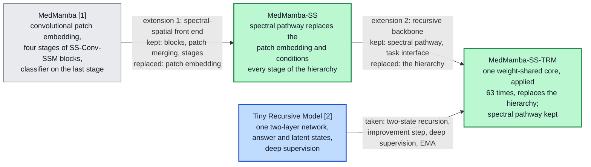

*Fig. 1. The two base models (grey, blue) and the two proposed models (green). Each proposed model differs from its predecessor by one substitution; the edge labels list what each step keeps and replaces, and Sections IV-D and IV-E give the component-level changes.*

Three questions guide the evaluation, and each follows from one of these design goals. Can a model derived from MedMamba be made independent of the number of bands, both in its parameters and in its behaviour when the band count changes? Can one recursively applied core replace the hierarchical backbone, at what computational cost, and with what benefit from recursion depth? And once the band count no longer fixes the architecture, so that the same model can be trained on either input, does hyperspectral input improve classification over an RGB rendering of the same captures when the architecture, the training recipe, the patient split and the patch locations are all held fixed, and only the input build, with its spectral position encoding and reconstruction target, differs?

The main contributions of this work are the two models:

1. **MedMamba-SS, a band-count-agnostic spectral–spatial extension of MedMamba** (Section IV-D). A spectral pathway replaces MedMamba's convolutional patch embedding. It encodes each band's wavelength, models the ordered band sequence with a tokenizer shared across bands, spectral convolutions and a bidirectional selective scan, and removes the band axis by pooling, so none of its parameters depends on the number of bands (Proposition 1). FiLM conditioning [10], per-stage context selection and a context updater carry the pathway's output into every stage of the inherited SS-Conv-SSM hierarchy. On hyperspectral data the pathway is evaluated inside MedMamba-SS-TRM, which shares it: the 32-band and 3-band instances have identically 446,409 parameters, a model retrained at eight bands keeps 96 % of its 32-band balanced accuracy in a single run, in a post-hoc evaluation of one checkpoint a trained 32-band model keeps 0.909 balanced accuracy on 16 bands without retraining when its encoding scale is held at the training value, and the learned band gate is highest at 577–633 nm. The hierarchical MedMamba-SS itself trains on whole skin-lesion photographs, well above the majority-class rate (Section VI-K), but on hyperspectral patches it stays near chance under the recipe used for the recursive model: its constant prediction there is an artefact of batch-normalization statistics, and without that artefact it still reaches only 0.49 balanced accuracy on a stratified test sample (Section VI-D).

2. **MedMamba-SS-TRM, a weight-shared recursive backbone for MedMamba-SS** (Section IV-E). One two-layer core, applied 63 times per forward pass under TRM's two-state schedule, replaces the hierarchy, while the spectral pathway and the classification interface are kept. The model has 6.2× fewer parameters than MedMamba-SS on the hyperspectral task and 8.2× fewer than MedMamba. On the five test patients it has the highest balanced accuracy of the models compared at four of five seeds (92.8 ± 1.9 %), with HybridSN and SpectralFormer compared seed by seed; pooled over all ten held-out patients, HybridSN is ahead of it at every seed, as is a six-feature RGB colour probe (Section VI-A). An analytic cost model gives the arithmetic of each core application (95.72 MFLOPs) and makes explicit that a weight-shared recursive model trades storage for compute: MedMamba-SS-TRM needs 22.3× the arithmetic of the hierarchy it replaces.

Several supporting components make these contributions measurable. A paired hyperspectral/RGB data preparation samples both modalities at the same patch coordinates of the same captures (Section III-B), so that, with the band-count-agnostic design, one model with one parameter count can be trained on either input. An evaluation over all ten non-training patients, with a per-patient analysis and patient-level bootstrap intervals, is needed because each five-patient held-out set contains DCIS from a single patient (Sections V-E and VI-F). And four implementation safeguards keep the spectral pathway from failing silently during training (Supplementary Section S-B). Explainability and reconstruction analyses (Sections VI-I and VI-J) show which wavelengths the spectral pathway weights and what its representation retains.

The paper is organized as follows. Section II reviews the literature and identifies the gaps this paper addresses, and Section III describes the datasets. Section IV restates the two base architectures and derives the two proposed models from them, one substitution at a time. Section V gives the experimental setup and Section VI the results. Section VII discusses the findings and their limitations, and Section VIII concludes.

---

## II. Literature Review

### A. Convolutional and Transformer Classifiers

Residual convolutional networks made deep models trainable and remain strong baselines [11], [12]; Vision Transformers relate all patch tokens through self-attention at quadratic cost [13], and Swin restores a hierarchy with shifted windows [14]. In both families the first layer treats input channels as an unordered set.

### B. State-Space Models and MedMamba

Mamba made state-space parameters input-dependent, giving a sequence model with near-linear cost [15]. Vision Mamba [16] and VMamba [17] extended it to images; VMamba's two-dimensional selective scan (SS2D) traverses a feature map in four directions. MedMamba [1] combined SS2D with a convolutional branch in the SS-Conv-SSM block and evaluated it on sixteen medical datasets covering ten modalities. It is the base architecture of both models in this paper. State-space models have since been applied to the spectral axis of hyperspectral images: the BiSpectral Mamba module of [18] models hyperspectral feature maps as token sequences in both directions for crop-field classification, and MelanoSpec-SSM makes patient-level diagnoses of melanoma against pigmented nevus from hyperspectral pathology images (100 patients, 125 bands between 400 and 1000 nm) with a spectral–spatial state-space model [19].

### C. Recursive and Weight-Shared Networks

Universal Transformers [20], ALBERT [21] and deep equilibrium models [22] reuse one block in place of many, and Adaptive Computation Time [23] learns when to stop. TRM [2] simplifies the Hierarchical Reasoning Model (HRM) [24] to one two-layer network with two carried states and deep supervision, and with 5–7 M parameters it improves on HRM's 27 M on Sudoku-Extreme (87.4 % against 55.0 %), Maze-Hard and ARC-AGI. Its benchmarks are small grids with exact answers, and it reports parameters and accuracy but not arithmetic. It is the source of the recursion in MedMamba-SS-TRM.

### D. Hyperspectral Image Classification

HybridSN combines 3-D and 2-D convolutions over hyperspectral patches [25], and SpectralFormer embeds groups of neighbouring bands as Transformer tokens [26]; both have parameters whose shape depends on the band count, and both were evaluated on remote-sensing scenes with training and test pixels drawn from the same scene. Recent designs encode spectra compactly or reduce them first: QuantFormer uses a variational quantum circuit as a spectral token encoder inside a Vision Transformer and stays competitive with 3-D CNNs at about 35,000 parameters [27], and HybridSN in its original form first reduces the spectrum with principal component analysis (PCA) [25]. PCA maps any band count to a fixed number of components, but the components are fitted to one sensor's data and carry no wavelength meaning. Medical hyperspectral imaging is a smaller literature [3], in which annotations are scarce, which has motivated label-efficient methods such as SLIC-derived pseudo-labels for hyperspectral melanoma segmentation [4]. Histology models also degrade when acquisition conditions change: incremental learning with knowledge distillation lets a SegFormer model of non-melanoma skin cancer absorb new magnifications without forgetting the ones it was trained on [28]. A change of hyperspectral sensor, and with it of the band set, is the spectral counterpart of such a shift, and Section VI-C examines it. In histopathology, Ortega et al. compared hyperspectral input with RGB images synthesized from the same cubes, using one convolutional network and patient-independent partitions, and found hyperspectral input more accurate for glioblastoma on H&E slides [29]. The same group made this comparison for breast cancer on 112 histological images from two patients and found hyperspectral input slightly ahead of synthetic RGB (test AUC 0.90 against 0.88) [30].

### E. Band-Count-Agnostic and Channel-Adaptive Models

A separate line of work removes the dependence on a fixed set of channels. ChannelViT builds patch tokens from each channel separately, adds a learnable embedding per channel, and trains with hierarchical channel sampling so that it remains accurate when only some channels are present at test time [6]. DOFA generates patch-embedding weights from each band's wavelength with a hypernetwork, so that one Vision Transformer accepts data from sensors with different numbers of bands [7]. BAT-Former encodes each band separately with Transformer blocks and fuses the band embeddings, and one model serves RGB images and the HyperLeaf2024 hyperspectral dataset [8]. CARL gives each channel a wavelength positional encoding and distils any number of channels into a fixed set of spectral tokens with self- and cross-attention before the spatial backbone; it was evaluated on medical, urban-scene and satellite spectral images, the medical task being segmentation of porcine organs, in 19 classes, from a 100-channel camera covering 500–1,000 nm [9]. Hyperspectral foundation models such as SpectralGPT [31] and HyperSIGMA [32] address a different problem: pretrained on hundreds of thousands to a million remote-sensing images, with several hundred million to over a billion parameters, they provide general-purpose spectral–spatial features, whereas the models in this paper are trained from scratch on one cohort with under 0.5 M parameters. Table I compares how these models, the hyperspectral classifiers of Section II-D, MedMamba and our models handle the band count.

**TABLE I**
**How Related Models Handle the Number of Bands $C$**

| Model | Handling of the band axis | Parameters depend on $C$ | Backbone cost grows with $C$ | Wavelength-aware | Evaluated on medical HSI, patient-disjoint, in the original publication |
| --- | --- | --- | --- | --- | --- |
| HybridSN [25] | 3-D convolution over bands, then 2-D | Yes | Yes | No | No |
| SpectralFormer [26] | Groups of neighbouring bands as tokens | Yes | Yes | No | No |
| MedMamba [1] | Strided convolution over all channels | Yes | No | No | No |
| ChannelViT [6] | One token per channel and patch; learned channel embeddings | Yes, one embedding per channel | Yes | No | No |
| DOFA [7] | Hypernetwork generates embedding weights from wavelengths | No | No | Yes | No |
| BAT-Former [8] | Each band encoded separately, band embeddings fused | Not stated | Yes | Not stated | No |
| CARL [9] | Wavelength-encoded channels distilled into a fixed number of spectral tokens by attention | No | No | Yes | Medical HSI: porcine organs, segmentation; subject-disjointness not stated in the text we could access |
| **MedMamba-SS, MedMamba-SS-TRM** | Shared tokenizer, spectral convolution and scan, band gate, mean over bands | **No** (Proposition 1) | **No** | **Yes**, relative to the input's band range (32-band arm; the 3-band arm uses an index encoding) | **Yes** (this work): human breast histology, classification; band selection not patient-disjoint (Section III-A) |

*Backbone: every layer after the band axis is removed. For HybridSN and SpectralFormer the band axis is never removed. Of the two proposed models, only MedMamba-SS-TRM trains on the hyperspectral data; MedMamba-SS stays at chance there (Section VI-D).*

The spectral pathway of Section IV-C differs from these designs in where and how the band axis is handled. Like DOFA and CARL, it encodes each band's wavelength and removes the band axis before the spatial backbone, so the backbone's cost does not grow with the band count; ChannelViT's backbone instead attends over $C$ times as many tokens, and BAT-Former runs its encoder once per band. Unlike the encodings of DOFA and CARL, which depend on the wavelength alone, ours is normalized to the input's own wavelength range and scaled by the band count (Section IV-C), so the same wavelength is encoded differently when bands are removed. And whereas DOFA's generated embedding acts linearly on the band values and CARL relates channels by attention, the pathway models the ordered band sequence with a shared nonlinear tokenizer, convolutions and a bidirectional selective scan along the bands before pooling, and its band gate exposes which wavelengths it weights. Of these models only CARL was evaluated on medical hyperspectral data in its original publication, and none is among our experimental baselines, so we compare with them by design only.

### F. Gaps Identified

1. **No representation of the spectral axis in MedMamba.** Band order is invisible to its first layer, and its parameters scale with the band count, so it cannot move between sensors without redesign.
2. **Band-count agnosticism untested in medical state-space classifiers and on hyperspectral histopathology.** HybridSN and SpectralFormer are sized for one band grid. Channel-adaptive models [6], [7], [8], [9] remove that limit; of these, only CARL was evaluated on medical hyperspectral data, for porcine organ segmentation. None was built into a medical state-space backbone or evaluated on hyperspectral histopathology, and in per-band token designs the backbone's cost grows with the band count.
3. **TRM's mechanism untested outside reasoning puzzles.** Weight-shared recursion has been used well beyond puzzles [20], [21], [22], but whether TRM's specific mechanism (two carried states refined by a gradient-free prelude and one gradient-carrying step, with deep supervision across segments) and its depth benefit carry over to noisy medical classification is, to our knowledge, not reported, and TRM's original evaluation does not report its arithmetic cost.
4. **Hyperspectral versus RGB input in breast histology beyond two patients.** Ortega et al. compared hyperspectral with synthetic RGB input for glioblastoma [29] and, on two patients, for breast cancer [30]. We repeat the comparison on a 45-patient cohort, with patch-level pairing of the two inputs, five seeds, two five-patient held-out sets and a per-patient analysis.

MedMamba-SS addresses the first two gaps and MedMamba-SS-TRM the third. Because both models accept any band count, the same model can be trained on hyperspectral and RGB renderings of the same captures, and with the paired data preparation of Section III-B this addresses the fourth.

---

## III. Datasets

### A. HistologyHSI-BC-Recurrence

**Cohort and preprocessing.** The HistologyHSI-BC-Recurrence collection [33], [34] contains hyperspectral captures, at 10× magnification, of haematoxylin-and-eosin (H&E) stained breast biopsy slides. We classify three tissue types: healthy, DCIS and IDC. The release used here holds 644 captures from 45 patients (the data descriptor reports 677 images from 47 patients [34]); each capture has 740 bands, most are 600 × 1,004 pixels, and each carries one tissue label. We start from the collection's calibrated cubes, which the providers correct with white and dark references [34]. Each capture is then multiplied by a gain that brings its median intensity (over 400 random pixels) to the median over all captures, clipped to [0.5, 2], and all cubes are divided by one global constant (8,618.75, the 99th percentile of the gain-corrected capture medians of 65 captures, 10 % of the collection). Neither step uses labels, but both the gain reference and the constant are computed over captures from all patients, not only training patients.

**Patient split and patches.** The 45 patients are assigned to 35 training, 5 validation and 5 test patients at random (seed 42) within strata defined by each patient's rarest tissue class. Only seven patients have DCIS, so the stratification places five of them in training and one in each held-out set (patient identifiers in Supplementary Table S1; Tables II and III). Every capture is tiled into non-overlapping 11 × 11 patches, 4,914 per full-size capture, and every patch inherits its capture's label; no pixel-level mask is applied (the region annotations distributed with the collection were not used), so a patch can contain stroma or background from a capture labelled DCIS or IDC. The 2,452,086 training patches therefore come from 499 captures, and in each held-out set all DCIS patches come from five captures of a single patient (patient 197 in validation, patient 136 in test), so one third of balanced accuracy on either set is measured on one patient.

**Band selection.** One preparation pass selects 32 of the 740 bands by importance. The selected band centres span 400.5–938.2 nm unevenly: eighteen lie at or below 633.3 nm and, after a 219.0 nm gap, fourteen lie between 852.3 and 938.2 nm. The gap comes from the selection, not from the sensor, which samples the whole range every 0.73 nm on average; between 495.8 and 852.3 nm only four bands were kept (535.1, 562.0, 577.3 and 633.3 nm). A band's importance is the mean of its variance and its mutual information with the tissue label [35], each divided by its maximum over the 740 bands, computed on up to 2,000 random pixel spectra from each of 64 captures (10 % of all captures). Bands are taken in decreasing importance, skipping any that lies within eight bands of a band already taken or correlates with one above 0.95, until 32 are kept; the last band taken ranks 445th. Importance is lowest between about 640 and 850 nm (mean 0.19 over 700–800 nm against 0.56 over 400–500 nm, minimum at 744.6 nm). Of the 300 bands in the gap, 283 rank lower than 445th and were never reached; the other 17 (634.0–646.4 nm) were skipped, seven for lying within eight bands of the 633.3 nm band and ten for correlation. The 64 captures were drawn from the whole collection before the split was applied: 48 come from training patients, 8 from validation patients and 8 from test patients, so tissue labels of held-out patients entered the selection of the input bands. The patient-disjoint split therefore covers model training and the z-score statistics of Section V-C, but not band selection; Section VII-C discusses the consequences. To bound the effect on the input itself, we repeated the preparation with band selection and the gain reference computed on training patients only (50 of the 499 training captures, 100,000 pixel spectra). The layout of the selected bands is unchanged: 18 bands at or below 628.9 nm, a 221.9 nm gap, and 14 bands from 850.9 to 938.2 nm. Every re-selected band lies within 5.1 nm of a band of the reported set (median 1.5 nm; 8 of 32 identical), and the training-only gain reference differs from the all-capture one by 0.25 %. No model has been retrained on this build, so its effect on the reported results is not measured. Fig. 2(a) shows that the class-mean spectra differ most at the four visible bands between 535 and 633 nm, where healthy tissue reflects more than DCIS and IDC, and that DCIS and IDC are close throughout.

**TABLE II**
**Properties of the Two Datasets**

| | HistologyHSI-BC-Recurrence | PAD-UFES-20 |
| --- | --- | --- |
| Modality | Hyperspectral (32 of 740 bands, 400.5–938.2 nm) and paired synthetic RGB | Smartphone RGB photographs |
| Classes | healthy, DCIS, IDC | BCC, ACK, NEV, SEK, SCC, MEL |
| Sample | 11 × 11 patch | 224 × 224 image |
| Patients (train / val / test) | 35 / 5 / 5 | 1,373 in total, patient-disjoint 70/15/15 |
| Samples (train / val / test) | 2,452,086 / 334,516 / 348,894 | 1,626 / 328 / 344 |
| Class counts, train | 722,358 / 122,850 / 1,606,878 | 613 / 508 / 172 / 158 / 136 / 39 |
| Class counts, test | 83,538 / 24,570 / 240,786 | 119 / 114 / 36 / 40 / 28 / 7 |
| Largest : smallest class, train | 13.1 : 1 | 15.7 : 1 |

**TABLE III**
**HistologyHSI-BC-Recurrence: Patients / Captures / Patches per Class and Split**

| Split | Healthy | DCIS | IDC | All |
| --- | ---: | ---: | ---: | ---: |
| Training | 30 / 147 / 722,358 | 5 / 25 / 122,850 | 34 / 327 / 1,606,878 | 35 / 499 / 2,452,086 |
| Validation | 4 / 20 / 98,280 | 1 / 5 / 24,570 | 5 / 49 / 211,666 | 5 / 74 / 334,516 |
| Test | 4 / 17 / 83,538 | 1 / 5 / 24,570 | 5 / 49 / 240,786 | 5 / 71 / 348,894 |

*A patient appears in the column of every tissue type it has. Full-size captures give 4,914 patches. The ten smaller captures (2,002 patches each) are all in validation and are exactly the IDC captures of patient 65; we have not determined why they are smaller.*

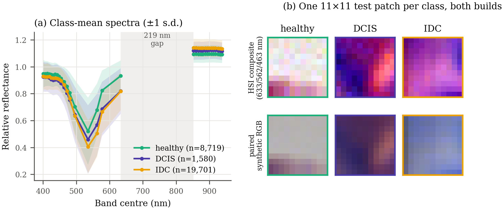

*Fig. 2. HistologyHSI-BC-Recurrence. (a) Class-mean reflectance over the 32 selected bands, 30,000 training patches; no line is drawn across the 219 nm gap, where no band was selected. (b) One test patch per class as a hyperspectral composite (633, 562 and 463 nm) and as the paired synthetic RGB patch.*

### B. Paired Hyperspectral and RGB Builds

A modality comparison is informative only if the two arms differ as little as possible. The preparation therefore writes two builds from the same captures, paired at the patch level: the RGB image is sampled at the *same patch coordinates* as the cube, and the patient and capture identifiers are identical in both builds. Each capture folder ships two RGB images: a synthetic rendering computed from the cube by the collection's software [34], aligned with it in all 644 captures, and a frame from a separate wide-field camera whose field of view differs in 228 captures. We use the synthetic rendering throughout. The two arms still differ in more than the number of channels. The RGB arm is an 8-bit rendering computed from the full cube, whereas the hyperspectral arm is floating-point reflectance at 32 bands selected with label information (Section III-A); the auxiliary reconstruction target of MedMamba-SS-TRM (Section IV-E) has 3 channels in one arm and 32 in the other; and because the RGB build carries no band centres, the 3-band arm uses the index encoding of Section IV-C where the 32-band arm uses the wavelength encoding. We call the arms 32-band and 3-band for brevity; the 3-band arm is not a subset of the 32 bands.

### C. PAD-UFES-20

PAD-UFES-20 [36], [37] contains 2,298 smartphone photographs of skin lesions from 1,373 patients in six classes, with melanoma at 2.3 %. It is one of the datasets on which MedMamba is compared with other published models, and we use it to test both proposed models on a second modality under a patient-disjoint split (the published MedMamba results use an image-level split, which allows photographs of the same patient or lesion to fall in both training and test).

---

## IV. Methodology

An input patch is $X \in \mathbb{R}^{C \times H \times W}$ with $C$ bands, optionally with band centres $\lambda \in \mathbb{R}^{C}$ in nanometres; the batch dimension is omitted. Both proposed models share one front end, the spectral pathway of Section IV-C, which maps $X$ to a context map $c \in \mathbb{R}^{H_p \times W_p \times d_{\text{ctx}}}$ whose shape contains no reference to $C$. The two base architectures are written out first (Sections IV-A and IV-B) so that every change can be stated against them. Both extensions then follow one rule: substitute exactly one component of the model they start from, keep everything else, and list every change component by component, with its reason. MedMamba-SS is drawn beside MedMamba (Figs. 3 and 4, Section IV-D), and MedMamba-SS-TRM beside MedMamba-SS and beside TRM (Figs. 5 and 6, Section IV-E); Section IV-E closes with the tensor shapes through both models, and Section IV-F with the cost model that the recursive substitution requires. All architecture diagrams use one colour code: grey for components inherited unchanged, amber for inherited and modified, green for new, blue for taken from TRM as published, and red dashed outlines for components the extension removes or replaces.

### A. Base Architecture I: MedMamba

MedMamba [1] embeds the input with a strided convolution of kernel and stride $p$ followed by layer normalization,

$$E = \mathrm{LN}\!\left(W_e \ast_p X + b_e\right) \in \mathbb{R}^{\frac{H}{p} \times \frac{W}{p} \times D_0}, \qquad W_e \in \mathbb{R}^{D_0 \times C \times p \times p}, \tag{1}$$

so the embedding holds $p^2 C D_0 + 3 D_0$ parameters, linear in $C$. Four stages follow, separated by patch merging, which halves resolution and doubles width (MedMamba-T: widths 96, 192, 384, 768; depths 2, 2, 4, 2). An SS-Conv-SSM block with input $x$ computes

$$[x_L, x_R] = \mathrm{Split}(x), \quad u = \Phi(x_L), \quad q = \mathrm{DropPath}\big(\mathrm{SS2D}(\mathrm{LN}(x_R))\big), \tag{2}$$

$$x \leftarrow \mathrm{Shuffle}_2\big([u \,;\, q]\big) + x, \tag{3}$$

where $\mathrm{Split}$ halves the channels, $\Phi$ is a convolutional branch (two 3 × 3 and one 1 × 1 convolution with batch normalization and ReLU), SS2D is the selective scan of [17], which runs four directional scans over the feature map and sums them, and $\mathrm{Shuffle}_2$ interleaves the two groups. The classifier reads the final stage only: $\hat{y} = W_h\,\mathrm{GAP}(x^{(S)}) + b_h$. Its one component that cannot serve a variable number of bands is the embedding (1).

### B. Base Architecture II: The Tiny Recursive Model

TRM [2] applies one two-layer network $f$ to a latent state $z$ and an answer state $y$, given an embedded input $x$. One improvement step is

$$z \leftarrow f(x, y, z) \;\; (n \text{ times}), \qquad y \leftarrow f(y, z). \tag{4}$$

Each layer of $f$ is a token mixer (self-attention, or for small fixed-size grids an MLP applied along the sequence) and a SwiGLU feed-forward layer [38], each residual branch followed by RMS normalization [39]; the states start from fixed, non-trainable buffers. A recursion runs $T$ improvement steps, the first $T-1$ without gradient tracking, so activation memory does not grow with $T$; with $n = 6$ and $T = 3$ the effective depth is $T(n+1) \times 2 = 42$ layers. Training uses deep supervision: each of up to $N_{\text{sup}} = 16$ supervision steps runs one recursion, computes a loss, takes an optimizer step and passes the detached states to the next step. A halting head trained with binary cross-entropy against "the current answer is correct" allows early stopping, and an exponential moving average (EMA) of the weights with decay 0.999 is used for evaluation. We take from TRM the principle that effective depth can come from reapplying a small network instead of stacking distinct layers (Section I).

### C. The Band-Count-Agnostic Spectral Pathway

The pathway maps each local spectrum to a context vector. Every operation either shares its weights across the band axis or has none.

**Patchification** is parameter-free average pooling: $\bar{X} = \mathrm{AvgPool}_p(X)$, and $v \in \mathbb{R}^C$ denotes the spectrum at one position.

**Spectral position.** Band centres are normalized to the unit interval by the extent of the bands present (normalizing by a fixed reference range is implemented but not used in our experiments), and a sinusoidal basis is evaluated on the result:

$$\tilde{\lambda}_c = \frac{\lambda_c - \min_{c'} \lambda_{c'}}{\max_{c'} \lambda_{c'} - \min_{c'} \lambda_{c'}}, \tag{5}$$

$$\pi_c[2i] = \sin(\eta \tilde{\lambda}_c \omega_i), \quad \pi_c[2i+1] = \cos(\eta \tilde{\lambda}_c \omega_i), \quad \omega_i = 10000^{-2i/d_t}, \quad \eta = C. \tag{6}$$

Without band centres, $\tilde{\lambda}_c = c/(C-1)$, which gives an index encoding; with $\eta = C$, the wavelength encoding equals this index encoding for evenly spaced bands and departs from it where spacing is irregular, as at the 219 nm gap in our selected bands (Section III-A). Because both the normalization (5) and the scale $\eta$ depend on the bands present, the same wavelength receives a different code when bands are removed; Section VI-C returns to this.

**Tokenization.** One two-layer MLP, shared by all bands, lifts each band value together with its encoding to a token of width $d_t$:

$$t_c = W_2\, \mathrm{GELU}\big(W_1 [v_c \,;\, \pi_c] + b_1\big) + b_2 + g_s \pi_c, \qquad W_1 \in \mathbb{R}^{2d_t \times (1+d_t)},\; W_2 \in \mathbb{R}^{d_t \times 2d_t}. \tag{7}$$

A linear map $v_c \mapsto v_c w$ would also be shape-independent, but at the tokenizer output the band values would then occupy a single direction, a multiple of $w$, and the spectral encoder would have to recover every interaction between bands from that one-dimensional code; the nonlinearity gives each band its own response direction.

**Spectral encoding.** Tokens $\mathcal{T} \in \mathbb{R}^{C \times d_t}$ pass through residual one-dimensional convolution blocks along the band axis and, after the first block, a bidirectional selective scan [15] along the bands:

$$\mathcal{T} \leftarrow \mathcal{T} + W_r\, \mathrm{GELU}\big(\mathrm{Conv1d}_3(\mathrm{LN}(\mathcal{T}))\big), \tag{8}$$

$$[U \,;\, Z] = \mathrm{LN}(\mathcal{T}) W_{\text{in}}, \quad \mathcal{T} \leftarrow \mathcal{T} + \Big(\mathrm{LN}\big(\alpha_1 \mathrm{SSM}(U) + \alpha_2 \mathrm{Flip}(\mathrm{SSM}(\mathrm{Flip}(U)))\big) \odot \mathrm{SiLU}(Z)\Big) W_{\text{out}}, \tag{9}$$

with $\alpha = \mathrm{softmax}(a)$. The scan (9) has the gated form of MedMamba's SS2D, applied to the one axis MedMamba does not model; scanning the spectral sequence in both directions is also the principle of the BiSpectral Mamba module of [18]. Convolution kernels and scan parameters are shared along the sequence, so they cost the same whether the sequence has 3 bands or 32.

**Gating, pooling and compression.** A gate projected from each token weights the bands; the tokens are averaged over the band axis and compressed by three linear layers with GELU ($d_t \to 128 \to 64 \to d_{\text{ctx}}$):

$$a_c = \sigma\big(w_g^{\top} t_c + b_g\big), \quad t_c \leftarrow a_c t_c, \tag{10}$$

$$c_{ij} = \Psi\Big(\tfrac{1}{C}\textstyle\sum_{c} t_c\Big) \in \mathbb{R}^{d_{\text{ctx}}}. \tag{11}$$

The mean in (11) is where the band axis disappears. We use $d_t = 32$ and $d_{\text{ctx}} = 64$.

> **Proposition 1.** *Every parameter tensor in (5)–(11) has a shape determined by $d_t$, $d_{\text{ctx}}$, the kernel width, the scan state size and the compressor widths, and not by $C$; every module after (11) receives inputs whose shape does not contain $C$. Any model built on the pathway whose later modules also produce outputs without $C$ in their shape, such as the classification path of both proposed models, therefore has the same parameter count at every band count.*

*Proof.* (5) and (6) have no parameters. The MLP of (7) is applied to each band with shared weights of shapes $2d_t \times (1 + d_t)$ and $d_t \times 2d_t$. The kernel of (8) has shape $d_t \times d_t \times 3$ and slides along the bands; the scan of (9) shares its parameters along the sequence. The gate of (10) is a $1 \times d_t$ projection applied to every band. The mean in (11) has no parameters and removes the band axis. A later module whose output has one channel per band, such as the optional reconstruction decoder of Section IV-E, does depend on $C$ and falls outside the statement. $\blacksquare$

Table IV gives the count. For contrast, MedMamba's embedding (1) at $p = 4$ and $D_0 = 96$ holds $1{,}536C + 288$ parameters: 4,896 at $C = 3$ and 49,440 at $C = 32$.

**TABLE IV**
**Parameters of the Spectral Pathway ($d_t = 32$, $d_{\text{ctx}} = 64$)**

| Component | Eq. | As a function of width | Count |
| --- | --- | --- | ---: |
| Tokenizer | (7) | $4d_t^2 + 5d_t + 1$ | 4,257 |
| Spectral encoder (three blocks, one scan, norms) | (8)–(9) | depends on $d_t$, kernel, state size | 17,794 |
| Band gate | (10) | $d_t + 1$ | 33 |
| Compressor | (11) | $128 d_t + 65 d_{\text{ctx}} + 8{,}384$ | 16,640 |
| **Total** | | **no term in $C$** | **38,724** |

### D. MedMamba-SS: The Spectral–Spatial Extension of MedMamba

MedMamba-SS keeps the MedMamba hierarchy and changes what enters it and how each stage sees the spectrum. Two design goals determine every change. The first is to remove $C$ from every parameter shape, which requires replacing the embedding (1), the only layer of MedMamba whose weights depend on $C$. The second is to let the spectrum inform spatial processing at every scale rather than only at the input, which requires a path from the context map into each stage and, in the other direction, from each stage's spatial features back into the context. Fig. 3 places MedMamba and MedMamba-SS side by side.

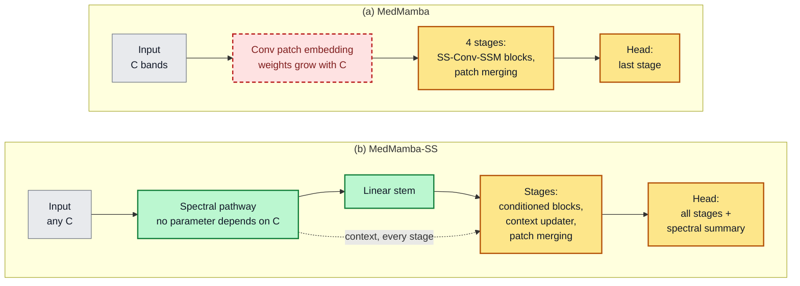

*Fig. 3. (a) MedMamba [1] and (b) MedMamba-SS. The convolutional patch embedding (red, dashed), whose weights grow with $C$, is replaced by the spectral pathway (5)–(11) and a linear stem (12) (green). The stages and the head are kept with modifications (amber): each stage gains a context selector (13), FiLM conditioning (14) and a context updater (16), and the head reads every stage and a spectral summary (17). The input is unchanged (grey). The dashed arrow carries conditioning rather than features. The optional reconstruction decoder is not drawn; Fig. 4 details the block and Table V lists every change.*

**Stem.** The convolutional embedding (1) is removed; the first stage receives a linear projection of the context map,

$$F^{(1)} = \mathrm{LN}\big(W_s\, \rho(c) + b_s\big), \qquad \rho(c) = c / \mathrm{RMS}(c), \tag{12}$$

where $\rho$ is a parameter-free, scale-invariant RMS normalization. Normalizing by the RMS itself, with no $\epsilon$ added to the mean square (only a floor against division by zero), keeps the stem responsive when the context map is small in magnitude (Supplementary Section S-B).

**Per-stage conditioning.** At stage $s$ the context map, resized to the stage resolution, is re-weighted by a squeeze-and-excitation gate [40] and modulates every block through FiLM [10], initialized to the identity so that each conditioned block starts as the inherited one:

$$c_s \leftarrow c_s \odot \sigma\big(W_{b,2}\,\mathrm{GELU}(W_{b,1}\,\mathrm{GAP}(c_s))\big), \tag{13}$$

$$\tilde{x} = x \odot (1 + \gamma) + \beta, \qquad [\gamma \,;\, \beta] = W_f c_s + b_f, \quad W_f = 0,\ b_f = 0 \text{ at initialization}. \tag{14}$$

**Conditioned block.** The block keeps MedMamba's channel split, convolutional branch, channel shuffle and outer residual, and changes three things (Fig. 4): it adds the scan half back to its scan output, it scales both residual branches with LayerScale [41] ($\mathrm{LS}$, initialized at $10^{-4}$), and it ends with a GEGLU feed-forward sublayer $G$ [38]:

$$[x_L, x_R] = \mathrm{Split}(\tilde{x}),\;\; q = \mathrm{LS}(\mathrm{SS2D}(\mathrm{LN}(x_R))),\;\; x \leftarrow \mathrm{Shuffle}_2\big([\Phi(x_L) \,;\, x_R + q]\big) + x,\;\; x \leftarrow x + \mathrm{LS}(G(\mathrm{LN}(x))). \tag{15}$$

In (15) the outer residual adds the block input before FiLM (14), as in MedMamba's block. With LayerScale near zero at initialization, the scan half passes $x_R$ through instead of a near-zero scan output. SS2D itself combines its four directional scans with learned softmax weights, initialized uniform, instead of MedMamba's fixed sum; because a layer normalization follows the combination, the two coincide at initialization. The GEGLU sublayer adds a feed-forward layer over all channels at once; the SS-Conv-SSM block mixes channels only within each half, through the 1 × 1 convolution of $\Phi$ and the projections of SS2D, and across the halves through the shuffle.

**Context update.** After the stage's blocks the spatial features revise the context for the next stage, making the interaction bidirectional:

$$c_s \leftarrow \mathrm{LN}\big(c_s + \sigma(W_g c_s) \odot W_u F^{(s)}\big). \tag{16}$$

**Head.** The classifier reads every stage and a spectral summary:

$$\hat{y} = \mathrm{MLP}\Big(\mathrm{LN}\big[\mathrm{GAP}(F^{(1)}) ; \ldots ; \mathrm{GAP}(F^{(S)}) ; \mathrm{GAP}(c_S)\big]\Big). \tag{17}$$

**Configurations.** For 11 × 11 hyperspectral patches MedMamba-SS uses $p = 1$ and three stages of widths 64, 128 and 256 with two blocks each (2,773,007 parameters, three classes). For 224 × 224 RGB photographs it uses MedMamba-T's four-stage layout (widths 96, 192, 384, 768; depths 2, 2, 4, 2) with $p = 8$ (27,425,314 parameters, six classes). A *full-channel* variant, used as a second hierarchical configuration in Section VI-D, removes the channel split of the SS-Conv-SSM block: the SS2D and convolutional branches both see all channels, and their outputs are combined by learned gating instead of concatenation and channel shuffle (3,513,451 parameters on 11 × 11 patches).

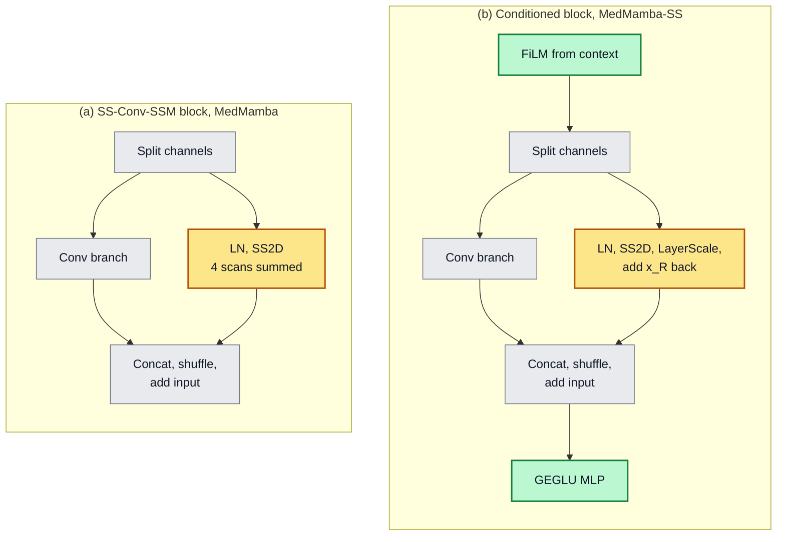

*Fig. 4. (a) MedMamba's SS-Conv-SSM block, eqs. (2)–(3). (b) The conditioned block of MedMamba-SS, eqs. (14)–(15). Grey: unchanged (split, convolutional branch, concatenation, shuffle and outer residual). Amber: the scan half, now with learned direction weights, LayerScale and an identity path. Green: new (FiLM input conditioning and a GEGLU feed-forward sublayer).*

Table V summarizes the extension. The only component of MedMamba that is removed is the one that ties it to the sensor; everything MedMamba uses to model space is kept, and everything added either reads the spectrum or carries it into the hierarchy.

**TABLE V**
**Changes from MedMamba to MedMamba-SS**

| Component | MedMamba [1] | MedMamba-SS | Change | Purpose |
| --- | --- | --- | --- | --- |
| Patch embedding | Strided $p \times p$ convolution, (1); $1{,}536C + 288$ parameters at $p = 4$ | Average-pool patchify, spectral pathway (5)–(11), linear stem (12) | Replaced | Remove $C$ from every parameter shape; read band order and wavelength |
| Stage input | Previous stage only | Context selector (13) and FiLM (14), identity at initialization | Added | Condition every scale on the spectrum |
| Split, conv branch $\Phi$, shuffle, outer residual | (2)–(3) | Same | Unchanged | — |
| Scan branch | SS2D, four scans summed | SS2D with learned direction weights, LayerScale, $x_R$ added back (15) | Modified | Residual branch starts near zero; identity path for the scan half; learnable weighting of scan directions |
| Feed-forward sublayer | None | GEGLU with LayerScale (15) | Added | Feed-forward mixing over all channels |
| Context update | None | Gated update from spatial features (16) | Added | Spatial-to-spectral feedback between stages |
| Patch merging | Halve resolution, double width | Same; context 2 × 2 average-pooled alongside | Unchanged | — |
| Head | GAP of the last stage, linear | MLP on all stage pools and the spectral summary (17) | Modified | Expose every scale and the spectrum to the classifier |
| Reconstruction decoder | None | Optional, $C$ output channels | Added | Auxiliary spectral objective; the only band-dependent module, excluded from all parameter and arithmetic counts |

### E. MedMamba-SS-TRM: The Recursive Extension

MedMamba-SS-TRM is the second substitution. It keeps the spectral pathway and the task interface of MedMamba-SS and replaces the hierarchy, the stages of distinct conditioned blocks with patch merging between them, by one core of width $d = 128$ that is applied many times. Depth then comes from 63 applications of one 398,336-parameter core instead of from stages that each hold their own weights. The recursive backbone returns the same outputs as the hierarchical one, so the training loop, the loss and the reconstruction decoder attach without change; we call this output signature the *task interface*. The classification head itself is replaced (Table VI). One configuration serves 3 × 11 × 11 and 32 × 11 × 11 input. Fig. 5 shows the substitution against MedMamba-SS, and Table VI lists it component by component.

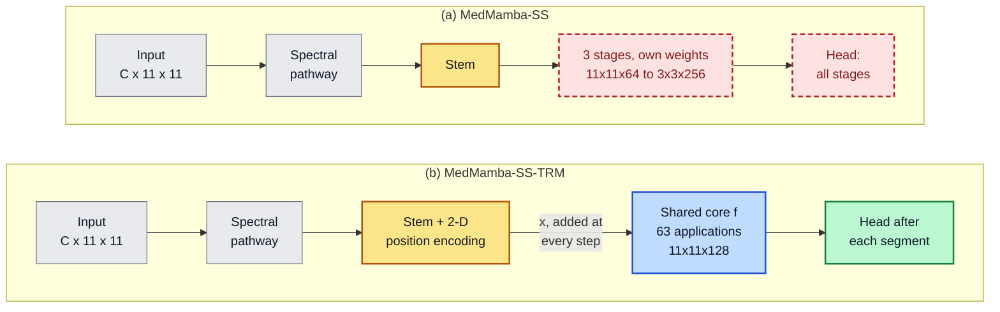

*Fig. 5. (a) MedMamba-SS and (b) MedMamba-SS-TRM, on an 11 × 11 hyperspectral patch. In (a), colours give each component's fate in (b): grey, kept; amber, kept with modifications; red dashed, replaced. In (b), the recursive core (blue) follows TRM's schedule (Fig. 6) and the head (green) is new. The labelled arrow into the core is TRM's input injection (20). Table VI lists every change, and the tensor shapes are tabulated at the end of this subsection.*

**TABLE VI**
**Changes from MedMamba-SS to MedMamba-SS-TRM (11 × 11 Hyperspectral Patches)**

| Component | MedMamba-SS | MedMamba-SS-TRM | Change | Purpose |
| --- | --- | --- | --- | --- |
| Spectral pathway | (5)–(11) | Same | Unchanged | Keeps Proposition 1 |
| Stem | Scale-invariant RMS normalization, linear, LN (12) | Same, plus a fixed 2-D sinusoidal encoding with learnable gain (18) | Modified | Absolute position for the recursive states |
| Backbone | Three stages of distinct conditioned blocks, widths 64–256, patch merging between stages (13)–(16) | One two-block core of width 128 applied $K = 63$ times at the full 11 × 11 resolution (19)–(20) | Replaced | Depth from reuse instead of storage |
| Spatial mixing | SS2D and convolutional branch in every block (15) | Depthwise 3 × 3 convolution with a GEGLU channel MLP (19); SS2D implemented as an alternative | Replaced | SS2D mixer 39× slower in a benchmark (Section V-C) |
| Spectral conditioning | Context selector and FiLM at every stage, context updater between stages (13), (14), (16) | Context enters once, through the stem; its embedding $x$ is added at every improvement step (20) | Replaced | TRM's input injection |
| Head | MLP on all stage pools and the spectral summary (17) | LN, spatial mean and linear map on the answer state after every segment (21) | Replaced | Deep supervision reads every segment |
| Objective | Focal loss on one set of logits; optional reconstruction | Focal loss averaged over three segments, plus reconstruction (22) | Modified | Deep supervision |
| Parameters / arithmetic | 2,773,007 / 0.278 GFLOPs | 446,409 / 6.203 GFLOPs | 6.2× fewer / 22.3× more | Section VI-E |

**What MedMamba-SS-TRM keeps from MedMamba.** The recursive substitution removes every SS-Conv-SSM block. In the reported configuration the core's spatial mixer is a depthwise convolution rather than SS2D, because an SS2D mixer without a fused scan kernel was 39× slower in a benchmark of the recursion (Section V-C); the SS2D mixer is implemented and would make the core a spatial state-space model again. MedMamba-SS-TRM therefore descends from MedMamba through MedMamba-SS. It keeps the spectral pathway that replaced MedMamba's embedding, including the bidirectional selective scan (9), which has the gated form of MedMamba's SS2D applied along the bands, and it keeps the task interface of MedMamba-SS. Its selective state-space computation runs along the spectral axis, and its spatial computation is convolutional: everything outside the core, including the spectral scan, accounts for 0.173 of its 6.203 GFLOPs (2.8 %). We keep the name because it records this lineage, through MedMamba-SS, and not a spatial state-space backbone, which the reported configuration does not have.

The recursion itself is taken from TRM, and Fig. 6 places TRM and MedMamba-SS-TRM side by side.

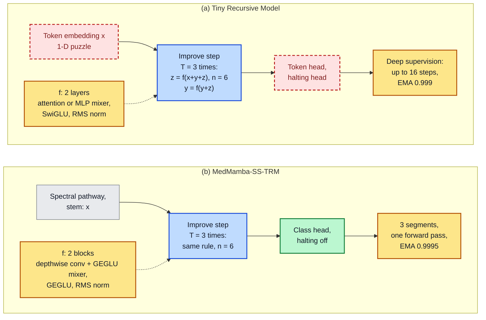

*Fig. 6. (a) TRM [2] as published and (b) MedMamba-SS-TRM. Blue: used as published (the two-state improvement step, with the first $T-1$ steps run without gradient). Amber: used with modifications (the network $f$, whose mixer and feed-forward change, and deep supervision, moved into one forward pass with a retuned EMA). Red dashed in (a): replaced. In (b), grey comes from MedMamba-SS and green is new. Dashed arrows point from the shared network $f$ to the step that calls it. Every difference is tabulated below, after the parameter count.*

**Stem and states.** The context map is normalized as in (12), projected to width $d$, normalized, and given a fixed two-dimensional sinusoidal encoding $P$ scaled by a learnable gain $g_p$ (initialized at 0.1):

$$x = \mathrm{LN}\big(W_s\, \rho(c) + b_s\big) + g_p P. \tag{18}$$

The embedding $x$ is computed once and held fixed through the recursion. The answer state $y$ and latent state $z$ start from broadcast non-trainable buffers, as in TRM.

**Core.** The core $f = B_2 \circ B_1$ has two blocks, each a token mixer and a GEGLU MLP under parameter-free RMS post-normalization [39]:

$$h' = \mathrm{RMS}\big(h + M(h)\big), \quad B(h) = \mathrm{RMS}\big(h' + G(h')\big), \quad M(h) = G_m\big(\mathrm{DWConv}_{3\times3}(h)\big). \tag{19}$$

The mixer $M$ is a depthwise 3 × 3 convolution followed by a channel MLP. It replaces TRM's sequence mixer because the state is a two-dimensional grid rather than a token sequence; SS2D and self-attention are implemented alternatives, and the SS2D mixer was 39× slower in a benchmark (Section V-C).

**Recursion and head.** The improvement step instantiates (4) with additive input injection, as in TRM, and the classifier reads the answer state after every segment:

$$z \leftarrow f(z + y + x)\ \ (n \text{ times}), \qquad y \leftarrow f(y + z), \tag{20}$$

$$\ell_j = W_c\, \mathrm{GAP}\big(\mathrm{LN}(y^{(j)})\big) + b_c, \qquad j = 1, \ldots, N_{\text{sup}}. \tag{21}$$

**Objective.** All $N_{\text{sup}} = 3$ segments run inside one forward pass; the per-segment losses are averaged and added to a reconstruction loss, and one optimizer update is taken per batch:

$$\mathcal{L} = \frac{1}{N_{\text{sup}}} \sum_{j=1}^{N_{\text{sup}}} \mathcal{L}_{\text{FL}}(\ell_j, k) + \lambda_{\text{mse}}\, \mathrm{MSE}(\hat{X}, X) + \lambda_{\text{sam}}\, \mathrm{SAM}(\hat{X}, X), \tag{22}$$

where $k$ is the label, $\mathcal{L}_{\text{FL}}$ is the class-weighted focal loss of Section V-A, $\hat{X}$ is the output of a three-layer convolutional decoder reading the final answer state, MSE is the mean squared error over all elements, SAM is the spectral angle (28) averaged over pixels, and $\lambda_{\text{mse}} = \lambda_{\text{sam}} = 0.1$. Validation and testing use an EMA of the weights (decay 0.9995), and every gradient-carrying core call is gradient-checkpointed [42]. Algorithm 1 gives the schedule; with $n = 6$, $T = 3$ and $N_{\text{sup}} = 3$ the core is applied $K = N_{\text{sup}} T (n+1) = 63$ times per forward pass, at inference as well as in training.

> **Algorithm 1: MedMamba-SS-TRM forward pass**
>
> ```
> c    <- SpectralPathway(X, lambda)              # eqs. 5-11
> x    <- Stem(c)                                 # eq. 18, held fixed
> y, z <- y_init, z_init                          # buffers
> for j <- 1 to N_sup = 3:
>     repeat T - 1 = 2 times, without gradient:
>         (y, z) <- Improve(x, y, z)
>     (y, z) <- Improve(x, y, z)                  # carries gradient
>     l_j <- Head(y)                              # eq. 21
>     y, z <- detach(y), detach(z)
> return l_1 ... l_N_sup                          # inference uses l_N_sup
>
> Improve(x, y, z):
>     repeat n = 6 times: z <- f(z + y + x)
>     y <- f(y + z)                              # once, after the n latent updates
> ```

Table VII gives the parameter count. The shared core holds 89.2 % of the parameters, and none of them depends on $K$ or on $C$.

**TABLE VII**
**Parameters of MedMamba-SS-TRM ($d = 128$, $L = 2$ Core Blocks, Three Classes)**

| Component | Eq. | As a function of width | Count | Share |
| --- | --- | --- | ---: | ---: |
| Spectral pathway | (5)–(11) | Table IV | 38,724 | 8.7 % |
| Stem and positional gain | (18) | $d_{\text{ctx}} d + 3d + 1$ | 8,577 | 1.9 % |
| Shared core | (19) | $L(12d^2 + 20d)$ | 398,336 | 89.2 % |
| Classifier and halting head | (21) | $2d + (d+1)(K_{\text{cls}} + 1)$ | 772 | 0.2 % |
| **Total** | | **no term in $C$** | **446,409** | |

Table VIII lists every difference from TRM. There, "as published" refers to the algorithm as specified in [2]; the recursion was implemented for two-dimensional feature maps inside our model. The two-state recursion, the improvement step with additive input injection, the gradient-free prelude, the detach between segments and the RMS post-normalization are used as published; the state buffers are rescaled and the EMA decay is retuned; and the per-segment effective depth (42 block applications) equals TRM's. The changes fall into three groups. The input, mixer, head and loss are replaced because the task is the classification of a two-dimensional spectral context map rather than the completion of a token sequence. Deep supervision is moved inside one forward pass, with one optimizer update per batch, so that a standard per-batch training loop, with its gradient clipping, mixed precision and validity gates, applies unchanged. And halting is disabled, because the halting head does not learn on this task (Supplementary Section S-B).

**TABLE VIII**
**Changes from TRM to MedMamba-SS-TRM**

| Element | TRM [2] | MedMamba-SS-TRM | Change | Reason |
| --- | --- | --- | --- | --- |
| Input embedding | Token embedding of a 1-D sequence | Spectral pathway, stem and 2-D sinusoidal encoding with learnable gain (18) | Replaced | The input is a spectral image patch |
| States $y$, $z$ | Two states from fixed buffers, s.d. 1 | Same, s.d. 0.02 | Rescaled | Empirical choice |
| Improvement step | $z \leftarrow f(x+y+z)$ $n$ times, $y \leftarrow f(y+z)$ | Same (20), $n = 6$ | As published | — |
| Recursion | $T = 3$, first $T-1$ steps without gradient | Same | As published | — |
| Network depth | 2 layers | 2 blocks | As published | — |
| Token mixer | Self-attention, or an MLP along the sequence | Depthwise 3 × 3 convolution with a GEGLU channel MLP (19) | Replaced | Two-dimensional grid; SS2D mixer 39× slower in a benchmark |
| Feed-forward | SwiGLU | GEGLU | Modified | Same gated form as the MedMamba-SS sublayer |
| Normalization | RMS post-normalization | Same, parameter-free | As published | — |
| Width | 512 | 128 | Retuned | Empirical choice; gives 0.45 M parameters in total |
| Deep supervision | Up to 16 steps, one optimizer update each | 3 segments in one forward pass, losses averaged, one update per batch (22) | Adapted | Standard per-batch training loop applies unchanged |
| Halting | Head trained with binary cross-entropy against correctness | Implemented, disabled | Not used | Halting head does not learn (Supplementary Section S-B) |
| Output head | Token logits | Layer norm, spatial mean, linear class logits (21) | Replaced | Classification |
| Loss | Token cross-entropy | Class-weighted focal loss plus reconstruction (22) | Replaced | 13 : 1 class imbalance; auxiliary spectral objective |
| EMA decay | 0.999 | 0.9995 | Retuned | — |
| Gradient checkpointing | Not used | Every gradient-carrying core call | Added | Three segments' graphs do not otherwise fit in 16 GB |

**Tensor shapes.** Table IX traces one 11 × 11 hyperspectral patch through both proposed models. The two share every shape up to the context map, where the band axis has already been removed. After it they differ in the one component that MedMamba-SS-TRM replaces: MedMamba-SS narrows the grid and widens the features stage by stage, as MedMamba does, whereas MedMamba-SS-TRM keeps the full 11 × 11 grid at one width for all 63 core applications, which is why its arithmetic is higher (Section IV-F).

**TABLE IX**
**Tensor Shapes Through the Two Proposed Models for One 11 × 11 Patch with $C$ Bands (Batch Omitted)**

| Step | Eq. | MedMamba-SS | MedMamba-SS-TRM |
| --- | --- | --- | --- |
| Input patch $X$ | — | $C \times 11 \times 11$ | $C \times 11 \times 11$ |
| Patchify, $p = 1$ | — | 121 spectra of length $C$ | 121 spectra of length $C$ |
| Tokenizer and spectral encoder | (7)–(9) | $121 \times C \times 32$ | $121 \times C \times 32$ |
| Band gate and mean over bands | (10)–(11) | $121 \times 32$; $C$ removed | $121 \times 32$; $C$ removed |
| Compressor: context map $c$ | (11) | $11 \times 11 \times 64$ | $11 \times 11 \times 64$ |
| Stem | (12), (18) | $F^{(1)}$: $11 \times 11 \times 64$ | $x$: $11 \times 11 \times 128$ |
| Backbone | (13)–(16), (19)–(20) | Stage 1 at $11 \times 11 \times 64$; patch merging (odd sides zero-padded) to $6 \times 6 \times 128$ for stage 2 and $3 \times 3 \times 256$ for stage 3 | $y$ and $z$ at $11 \times 11 \times 128$ through all 63 core applications |
| Head input | (17), (21) | $64 + 128 + 256 + 64 = 512$ (three stage pools and the spectral summary) | 128 (spatial mean of the normalized answer state), once per segment |
| Output | (17), (21) | 3 class logits | 3 class logits per segment; the last segment's at inference |
| Reconstruction (optional) | (22) | $C \times 11 \times 11$ | $C \times 11 \times 11$, from the final answer state |

### F. Cost Model

Weight sharing decouples parameters from arithmetic. The core's parameters, $L(12d^2 + 20d)$, do not depend on $K$; its arithmetic grows linearly:

$$\mathcal{F}(K) = \mathcal{F}_0 + K \mathcal{F}_f, \qquad \mathcal{F}_f = 2 N_{\text{tok}} L \big(12 d^2 + 9 d\big), \tag{23}$$

where $12d^2$ counts the multiply–accumulates per token of the two GEGLU MLPs in a block, $9d$ the depthwise convolution, and $N_{\text{tok}} = H_p W_p$. For 11 × 11 patches, $L = 2$ and $d = 128$, (23) gives $\mathcal{F}_f = 95.72$ MFLOPs per application, so the 63 applications alone cost 6.03 GFLOPs. Measured arithmetic in this paper counts the multiply–accumulates of every convolution and linear layer with forward hooks, doubled to FLOPs, plus an analytic estimate for the selective scans; it excludes normalization, activation and element-wise operations, and it excludes the reconstruction decoder (0.031 GFLOPs at 32 bands). Because (23) and this measurement count the same operations, their agreement (Section VI-E) is a check of consistency, not an independent validation, and neither says anything about latency. On that basis the whole hierarchical MedMamba-SS costs 0.278 GFLOPs on the same input. A hierarchy reduces its token count at every stage; the recursive core never does, so every one of its applications pays for the full 121-token grid.

---

## V. Experimental Setup

### A. Loss Function

Classification uses the focal loss [43] with class weights, which down-weights well-classified patches and counteracts the 13 : 1 class imbalance. For a patch of class $k$ with predicted probability $p_k$,

$$\mathcal{L}_{\text{FL}} = -\,w_k\,(1 - p_k)^{\gamma} \log p_k, \qquad \gamma = 1.5, \tag{24}$$

$$w_k = \frac{\tilde{w}_k}{\sum_j \tilde{w}_j}\, K_{\text{cls}}, \qquad \tilde{w}_k = \Big(\frac{N}{K_{\text{cls}} N_k}\Big)^{0.75}, \tag{25}$$

where $N_k$ is the number of training patches of class $k$ and the exponent 0.75 softens full inverse-frequency weighting. For MedMamba-SS-TRM, (24) enters the deep-supervision objective (22).

### B. Evaluation Metrics

Because the classes are imbalanced, balanced accuracy and macro-F1 are the primary metrics:

$$\mathrm{BA} = \frac{1}{K_{\text{cls}}} \sum_{k} \frac{\mathrm{TP}_k}{\mathrm{TP}_k + \mathrm{FN}_k}, \tag{26}$$

$$\mathrm{F1}_{\text{macro}} = \frac{1}{K_{\text{cls}}} \sum_{k} \frac{2\,P_k R_k}{P_k + R_k}. \tag{27}$$

Reconstruction is scored by the spectral angle between a reconstructed spectrum $\hat{x}$ and its target $x$, averaged over pixels, together with RMSE, PSNR and 2-D SSIM:

$$\mathrm{SAM}(\hat{x}, x) = \arccos \frac{\langle \hat{x}, x \rangle}{\lVert \hat{x} \rVert\, \lVert x \rVert}. \tag{28}$$

In the objective (22) the angle is computed in radians on the z-scored input; reported spectral angles, RMSE and PSNR are computed on reflectance, after the normalization is reversed, and angles are given in degrees.

Calibration matters for a classifier whose confidence may be used to abstain on uncertain cases [44] and refer them to a pathologist [45]. It is measured by the expected calibration error [46], [47] over $M = 15$ confidence bins $B_m$ of the $N_{\text{eval}}$ evaluated patches, together with the Brier score [48]:

$$\mathrm{ECE} = \sum_{m=1}^{M} \frac{|B_m|}{N_{\text{eval}}} \big|\mathrm{acc}(B_m) - \mathrm{conf}(B_m)\big|. \tag{29}$$

We also report accuracy, macro precision, Cohen's $\kappa$ and macro ROC-AUC, and per-patient macro recall, the mean recall over the classes a patient has.

### C. Implementation Details

All models were trained on one NVIDIA RTX 5060 Ti (16 GB) with PyTorch 2.11 [49] and CUDA 12.8. MedMamba-SS-TRM uses width 128, two core blocks, $n = 6$, $T = 3$, $N_{\text{sup}} = 3$, AdamW [50] at learning rate $3 \times 10^{-4}$ with weight decay 0.05 (not applied to normalization weights and biases), batch size 256, bf16 precision, gradient clipping at 1.0, and a 587-step linear warmup into cosine decay over 19,560 steps, stepped per optimizer step. Inputs are z-scored with per-band means and standard deviations fitted over the training split, and training uses geometric (flips, 90° rotations, crops) and spectral (noise, scaling, offset) augmentation. Each epoch trains on a fresh random 10.2 % of the training split (250,113 patches, 978 steps) and validates on a fixed patient-stratified 9.86 % of the validation split (32,985 patches); the checkpoint with the best validation macro-F1 is tested on the full test split. The recipe was developed over earlier runs on the same patient split; checkpoints were always selected on validation data, but the test scores of those development runs were recorded and compared alongside their validation scores, so the test patients are independent of checkpoint selection but not demonstrably of recipe development. Headline runs train for 20 epochs; every ablation trains for 12 epochs (11,736 steps) and is compared with a 12-epoch baseline, because the cosine schedule makes a shorter run a different schedule rather than a truncation. Supplementary Table S1 lists the full configuration.

Three implementation choices were fixed by dedicated measurements. In a benchmark configuration on RGB skin-lesion patches (740,800 training patches per epoch) with four supervision segments (84 core applications, hence 168 block calls per step), fp32 precision, batch size 150 and reconstruction on, the SS2D mixer, whose selective scan ran sequentially over the 121 positions without a fused kernel, took 66.9 s per step, or 91.8 hours per epoch of that configuration; replacing only the mixer with the convolutional one made the step 39× faster. Without gradient checkpointing in the core, the 0.45 M-parameter model does not fit in 16 GB on hyperspectral input. And evaluating the spectral pathway in chunks of 1,024 positions, with per-chunk checkpointing for $C \geq 16$, cuts its peak memory by 90 % (10.2 GB to 1.0 GB) for a 15 % increase in step time.

Every run passes validity gates before a result is recorded: data integrity and patient-level leakage checks, a representation-sensitivity check (stem sensitivity 0.504 and 0.552 against a floor of 0.05 for the seed-42 hyperspectral and RGB runs), a split-drift check, a check that the reconstruction gradient reaches the core, and recomputation of the selection metric from the saved checkpoint (difference 0.0 in both runs).

### D. Baselines

All baselines are trained on the same hyperspectral build and patient split and scored on the same full test and validation splits.

- **Shallow probes.** Class-balanced logistic regressions [35] on per-band means (32 features), per-band means and standard deviations (64), and the flattened patch (3,872), fitted on 25,000 training patches under the same normalization.
- **MedMamba** [1]. The reference implementation with a 32-band stem, patch size 1 and widths (64, 128, 256, 512), depths (1, 1, 2, 1): 3,648,995 parameters, trained for five full epochs (about 12.3 M patch presentations, against 5.0 M for MedMamba-SS-TRM's 20 subsampled epochs) with class-weighted cross-entropy, learning rate $10^{-4}$, weight decay $10^{-4}$, batch size 256 and bf16, on the same z-scored inputs, with the checkpoint chosen by macro-F1 on the full validation split and no EMA. This differs from the other networks, which select on a 9.86 % validation subset: MedMamba's checkpoint (epoch 1) was chosen on the same set on which its validation and pooled scores are reported.
- **HybridSN** [25] (569,843 parameters): three 3-D convolutions (8, 16 and 32 filters; spectral kernels 7, 5 and 3; spatial 3 × 3), one 2-D convolution with 64 filters and a 256–128 fully connected head with dropout 0.4, applied without padding to the 32 selected bands of the 11 × 11 patch (the original uses 30 PCA components of 25 × 25 windows). **SpectralFormer** [26] (121,428 parameters): the patch-wise variant with cross-layer adaptive fusion and the official defaults (group-wise embedding of each band with its neighbours, width 64, depth 5, four heads). Both are trained with MedMamba-SS-TRM's 20-epoch recipe: the same loss, optimizer, schedule, subsampling, augmentation and selection rule, without EMA or reconstruction. No hyperparameter was tuned for either, whereas the recipe was developed for MedMamba-SS-TRM (Section V-C).
- **MedMamba-SS** (2,773,007 parameters) under MedMamba-SS-TRM's recipe at the 12-epoch budget.

HybridSN and SpectralFormer are included because MedMamba, the base architecture, has no mechanism that reads the spectral axis, so on its own it cannot show whether the spectral pathway improves on established ways of modelling spectra. The two models represent the two main families of spectral–spatial classifiers: HybridSN convolves jointly over bands and space, and SpectralFormer treats groups of neighbouring bands as Transformer tokens, which makes it the closest classic hyperspectral classifier to our band-token pathway. The channel-adaptive models of Section II-E are closer in purpose but are not among the baselines. Both are small (0.57 M and 0.12 M parameters), so they compare with MedMamba-SS-TRM (0.45 M) at similar storage, and neither is band-count agnostic: HybridSN's 2-D convolution and SpectralFormer's position embedding have shapes that depend on the number of bands.

### E. Protocol

The hyperspectral-versus-RGB comparison repeats both arms at five seeds (1, 7, 13, 23, 42); the two arms share one configuration and differ in the input build (Section III-B), and hence in the reconstruction target, and both have 446,409 parameters. HybridSN and SpectralFormer are also trained at the same five seeds, so that they can be compared with MedMamba-SS-TRM seed by seed (Section VI-A); every other configuration, including MedMamba and every ablation, uses seed 42. On this dataset, two pairs of runs with identical configuration and seed differ by 0.04 and 0.06 points of balanced accuracy; this is the nondeterminism floor for a fixed seed here (identical runs on the 344-image PAD-UFES-20 test set differ far more, Section VI-K). Changing the seed moves test balanced accuracy far more (s.d. 1.9 points for the 32-band arm, Section VI-A), and every single-seed comparison below should be read against that spread. Because the validation and test sets each contain only five patients, we report both, and we evaluate every seed's selected checkpoint on the *full* validation split, so that all ten non-training patients can be analysed. The validation patients also choose each network's checkpoint, so validation and pooled scores of the networks are not independent of model selection and are optimistically biased; the probes involve no selection. Patient-level 95 % intervals resample the held-out patients with replacement (2,000 draws) and report the 2.5th and 97.5th percentiles of the mean over seeds of the balanced-accuracy difference. A draw that loses a class entirely, which happens whenever the single DCIS patient is left out, is discarded (1,372 of 2,000 draws kept on the test patients, 1,355 on the validation patients and 1,808 pooled); with five patients per set these intervals are coarse and condition on the DCIS patient being present.

---

## VI. Experimental Results

All results are on HistologyHSI-BC-Recurrence unless stated. Because the validation and test sets each contain five patients, every comparison is reported on the test patients, on the validation patients (full split, scored at the checkpoint selected on the validation subset, so optimistic for the networks), and pooled over all ten non-training patients. The section first compares MedMamba-SS-TRM with existing models and follows its training (Sections VI-A and VI-B). It then examines the properties that the two substitutions were designed to provide: independence from the band count (Section VI-C), the contribution of individual components, including the hierarchical backbone of MedMamba-SS (Section VI-D), and the cost and depth of the recursion (Section VI-E). Because the band count no longer fixes the architecture, one model can be trained on either input, and Section VI-F uses this to compare hyperspectral with RGB input. Sections VI-G to VI-J analyse the errors, calibration, band weighting and reconstruction of MedMamba-SS-TRM, and Section VI-K evaluates both proposed models on skin lesions.

### A. Comparison with Existing Models

Table X and Fig. 7 compare MedMamba-SS-TRM and MedMamba-SS with three shallow probes, a colour probe on the paired RGB build, MedMamba, HybridSN and SpectralFormer.

**TABLE X**
**Comparison on HistologyHSI-BC-Recurrence (Seed 42 Unless Stated). Test: 348,894 Patches from 5 Patients; Validation: 334,516 Patches from 5 Patients; Pooled: All 10**

| Model | Params | Test Acc. (%) | Test BA (%) | Test F1 | Test κ | Val. BA (%) | Val. F1 | Pooled BA (%) | Pooled F1 |
| --- | ---: | ---: | ---: | ---: | ---: | ---: | ---: | ---: | ---: |
| Majority class (always IDC) | — | 69.01 | 33.33 | 0.272 | 0.000 | 33.33 | 0.258 | 33.33 | 0.266 |
| Logistic regression, band means | 32 feat. | 82.13 | 82.68 | 0.726 | 0.656 | 68.39 | 0.619 | 75.81 | 0.671 |
| Logistic regression, band means + s.d. | 64 feat. | 93.07 | 90.28 | 0.843 | 0.854 | 77.99 | 0.710 | 84.31 | 0.771 |
| Logistic regression, raw patch | 3,872 feat. | 79.66 | 62.02 | 0.623 | 0.551 | 56.92 | 0.555 | 59.86 | 0.587 |
| Logistic regression, RGB means + s.d. (RGB build) | 6 feat. | 93.05 | 87.58 | 0.830 | 0.853 | 84.90 | 0.783 | 86.50 | 0.807 |
| MedMamba [1] | 3.649 M | 95.14 | 91.02 | 0.872 | 0.896 | 72.30 | 0.689 | 81.67 | 0.774 |
| HybridSN [25] | 0.570 M | 93.56 | 88.85 | 0.841 | 0.863 | 84.94 | 0.785 | 87.14 | 0.813 |
| HybridSN, five seeds (mean ± s.d.) | 0.570 M | 93.45 ± 0.48 | 89.40 ± 0.47 | 0.841 ± 0.008 | 0.861 ± 0.010 | 84.37 ± 1.04 | 0.785 ± 0.017 | 87.12 ± 0.66 | 0.813 ± 0.013 |
| SpectralFormer [26] | 0.121 M | 92.01 | 82.45 | 0.804 | 0.826 | 80.73 | 0.766 | 81.78 | 0.784 |
| SpectralFormer, five seeds (mean ± s.d.) | 0.121 M | 92.28 ± 1.23 | 83.02 ± 3.98 | 0.817 ± 0.025 | 0.829 ± 0.030 | 79.29 ± 1.29 | 0.761 ± 0.004 | 81.30 ± 2.33 | 0.788 ± 0.013 |
| MedMamba-SS, 12-epoch budget | 2.773 M | 69.06 | 33.42 | 0.274 | 0.002 | 33.30 | 0.259 | 33.36 | 0.267 |
| MedMamba-SS, full-channel variant, 12-epoch budget | 3.513 M | 70.01 | 40.85 | 0.397 | 0.131 | 30.20 | 0.269 | 35.64 | 0.329 |
| **MedMamba-SS-TRM** | **0.446 M** | 96.38 | 94.37 | 0.904 | 0.923 | 72.11 | 0.694 | 83.21 | 0.795 |
| MedMamba-SS-TRM, five seeds (mean ± s.d.) | 0.446 M | 94.66 ± 2.60 | 92.78 ± 1.87 | 0.875 ± 0.040 | 0.888 ± 0.051 | 76.18 ± 4.59 | 0.720 ± 0.023 | 84.49 ± 1.45 | 0.795 ± 0.012 |

*BA: balanced accuracy (26); F1: macro-F1 (27). Rows marked "five seeds" are means over seeds 1, 7, 13, 23 and 42; all other rows are single runs at seed 42. Validation and pooled scores of the networks are optimistic, because the validation patients select their checkpoints (Section V-E). MedMamba selected its checkpoint on the full validation split, the others on a subset (Section V-D). MedMamba's pooled scores are computed exactly from its per-class validation counts, since its validation predictions were not stored. Section VI-H compares the calibration of these models.*

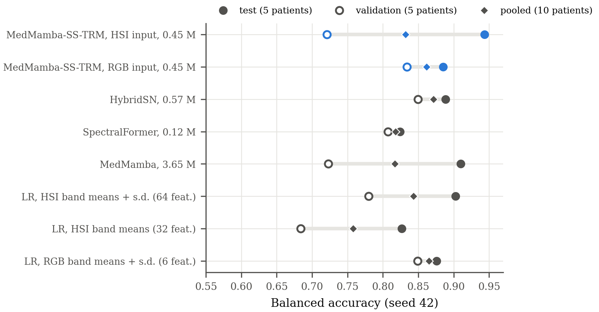

*Fig. 7. Balanced accuracy on the test patients, the validation patients and all ten held-out patients pooled, at seed 42, for the models of Table X that train, and for the 3-band (RGB) arm of MedMamba-SS-TRM. The majority-class row, the raw-patch probe and both MedMamba-SS variants are omitted; five-seed results are in Table X.*

On the test patients MedMamba-SS-TRM has the highest balanced accuracy (92.78 ± 1.87 % over five seeds, 94.37 % at seed 42), ahead of MedMamba (91.02 %), the strongest probe, a logistic regression on the 64 per-band means and standard deviations (90.28 %), HybridSN and SpectralFormer. The ranking holds at four of five seeds; at seed 1 (89.61 %) MedMamba and the 64-feature probe are ahead. MedMamba and the probes are single runs; HybridSN and SpectralFormer are also compared seed by seed below. On the other test metrics the five-seed mean does not lead MedMamba: macro-F1 is level (0.875 against 0.872), and accuracy (94.66 % against 95.14 %) and Cohen's κ (0.888 against 0.896) are lower. On the validation patients the order reverses. HybridSN (84.94 %) and a six-feature RGB colour probe (84.90 %) lead, and MedMamba-SS-TRM (76.18 ± 4.59 % over five seeds) and MedMamba (72.30 %) trail the 64-feature probe (77.99 %). Pooled over all ten patients, HybridSN (87.14 %) and the RGB probe (86.50 %) lead; MedMamba-SS-TRM reaches 84.49 ± 1.45 % over five seeds, level with the 64-feature probe (84.31 %) and ahead of MedMamba (81.67 %). MedMamba was trained under a different recipe (Section V-D), and differences of this size between single runs lie within the seed-to-seed spread. The hierarchical MedMamba-SS stays at chance on every held-out set; its test macro-F1 (0.274) is that of predicting IDC everywhere (0.272) (Section VI-D).

Seed 42, at which the single-run baselines and every single-seed analysis below were run, is MedMamba-SS-TRM's best seed on the test patients and its worst on the validation patients. Across the five seeds, test and validation balanced accuracy are strongly anti-correlated (Pearson r = −0.95; n = 5, descriptive only): seeds trade performance between the two patient sets, and the seed-42 analyses show the model at its most favourable on the test patients.

**Seed-paired baselines.** Because a single seed can favour either model, HybridSN and SpectralFormer were also trained at the four other seeds of the headline model (1, 7, 13 and 23) under the same recipe, so that each can be compared with MedMamba-SS-TRM seed by seed (Table X, rows marked five seeds). On the test patients MedMamba-SS-TRM is ahead of SpectralFormer at every seed, by 9.77 ± 4.25 points of balanced accuracy, and ahead of HybridSN at four of five seeds, by 3.38 ± 2.14 points; at seed 1 the two are level (89.61 % against 89.65 %). On the validation patients HybridSN is ahead at every seed, by 8.19 ± 4.44 points, and SpectralFormer at four of five, by 3.11 ± 5.64 points. Pooled over all ten held-out patients, HybridSN is ahead of MedMamba-SS-TRM at every seed, by 2.62 ± 1.34 points (87.12 ± 0.66 % against 84.49 ± 1.45 %), whereas MedMamba-SS-TRM is ahead of SpectralFormer at four of five seeds, by 3.19 ± 2.94 points. The seed-paired comparison therefore confirms the pattern of the single runs and makes the pooled ranking firmer: the test patients favour the recursive model, the validation patients the baselines, and over all ten patients HybridSN leads at every seed. Both baselines also vary less between seeds than MedMamba-SS-TRM on the validation patients (s.d. 1.04 and 1.29 against 4.59 points).

The ranking of models depends on which five patients are held out more than on the architecture, partly for a structural reason, since each held-out set contains DCIS from a single patient: among the networks that train, the gap between test and validation balanced accuracy ranges from 1.7 points (SpectralFormer) to 22.3 points (MedMamba-SS-TRM at seed 42), larger than most differences between networks. Per-patch summary statistics are also a strong baseline on this dataset. A linear model on 64 band statistics, or on six colour statistics, is competitive with every network, whereas a linear model on the 3,872 raw values of the flattened patch is weak (62.02 %). A linear model cannot exploit translation-invariant spatial structure, so this does not show that the patches carry no spatial information; it shows that most of the linearly accessible information lies in per-patch statistics. Finally, the two networks that do best on validation, HybridSN and SpectralFormer, select their first and third epoch, whereas MedMamba-SS-TRM selects its seventh. Because every network's checkpoint is the one its validation data preferred, this pattern cannot separate a property of the models from the selection rule.

### B. Learning Curves

Supplementary Fig. S1 shows the training dynamics of the seed-42 pair of MedMamba-SS-TRM models. Training classification loss falls steadily for both inputs (32 bands: 0.128 to 0.034). Validation loss for the 32-band model reaches its minimum at epoch 9 (0.101) and then rises to 0.169 at epoch 20, and validation macro-F1 peaks at epoch 7 and declines slowly; the model keeps fitting the 35 training patients after it stops improving on the five validation patients, and the checkpoint rule selects the epoch before that divergence. The 3-band model peaks earlier (epoch 4). The spectral-angle reconstruction loss, in radians on z-scored spectra, falls steadily on both splits for the 32-band model (validation 1.27 to 0.55) and is lower for the 3-band model; the two losses are computed over different numbers of channels and are not directly comparable.

### C. Band-Count Agnosticism

**Structure.** The same MedMamba-SS-TRM on the same dataset and label space has exactly 446,409 parameters at 32 bands and at 3 bands, as Proposition 1 predicts for the classification path; its parameter memory is 1.786 MB in both cases. What depends on the band count is activation size (peak inference memory 161.5 MB against 52.6 MB, measured with the reconstruction decoder attached) and, marginally, arithmetic (6.203 against 6.052 GFLOPs), because 97 % of the arithmetic is the recursion over a fixed 121-token grid. The optional reconstruction decoder is the one band-dependent module: its output layer has one channel per band (575,849 parameters with the decoder at 32 bands, 559,116 at 3), so all parameter and arithmetic counts in this paper exclude it.

**Behaviour.** Fig. 8 evaluates the seed-42 model on subsets of its bands, uniformly decimated in index, without retraining (*zero-shot*), and trains fresh models at 16 and 8 bands under the 12-epoch budget (*retrained*). With the encoding as defined in (5)–(6), zero-shot transfer fails: at every reduced band count balanced accuracy falls to 0.33–0.41 and IDC F1 to exactly 0.000. Most of this failure at 16 bands comes from the encoding. Index decimation keeps both end bands, so the normalization (5) is unchanged, but $\eta = C$ in (6) changes with the band count, so every retained band receives a code that the 32-band model never saw in training. Evaluating the same checkpoint with $\eta$ held at its training value of 32, and nothing else changed, separates the two effects. At 16 bands balanced accuracy rises from 0.3845 to 0.9086 and macro-F1 from 0.1854 to 0.8256 (per-class F1 0.828, 0.693 and 0.956 for healthy, DCIS and IDC); at 8 bands it rises only from 0.3329 to 0.5599, and macro-F1 from 0.1289 to 0.4983. With all 32 bands the fixed encoding reproduces the model's own test result (macro-F1 0.90365 against 0.90363). These are single, post-hoc evaluations of the seed-42 checkpoint on the test patients. Retrained at eight bands, the model reaches 0.9014 balanced accuracy and 0.8684 macro-F1, 96 % and 97 % of the 12-epoch 32-band values (0.9353 and 0.8920) with a quarter of the bands. The loss of 3.4 points of balanced accuracy is about 1.3 times the standard deviation expected for a difference between two single runs (√2 × 1.9 ≈ 2.7 points, taking the 20-epoch seed spread as a proxy for these 12-epoch runs), so it is suggestive but not established. At 16 bands balanced accuracy is higher (0.9159) and macro-F1 lower (0.8636) than at eight; these are single runs. The architecture is therefore band-count agnostic by construction and under retraining. A trained model transfers zero-shot to half of its bands once its encoding is held at the training scale, but not to a quarter of them, so a band-count-independent choice of $\eta$ is a candidate design that retraining would have to confirm, and larger reductions need another remedy. Training on random band subsets, as ChannelViT's hierarchical channel sampling does for channels [6], is one to test. The eight bands were decimated in index from a label-selected set of narrow bands, so the result does not carry over directly to a filter camera with broader bands.

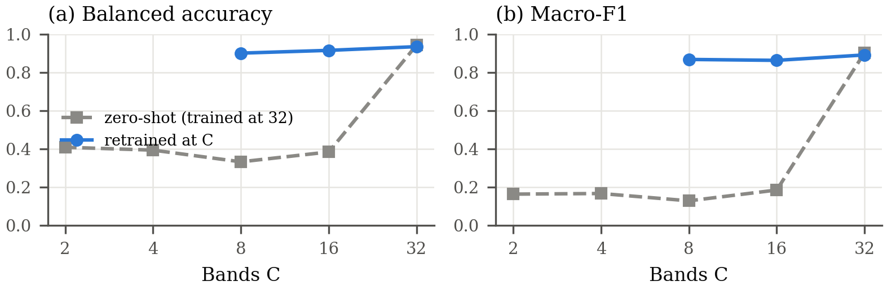

*Fig. 8. Test performance against the number of bands. Zero-shot, $\eta = C$: the 32-band model evaluated on decimated input with the encoding as defined in (6). Zero-shot, $\eta$ fixed at 32: the same checkpoint with the encoding scale held at its training value (evaluated at 32, 16 and 8 bands). Retrained: a model trained at that band count (12-epoch budget; the 32-band point is the 12-epoch baseline).*

### D. Ablation Study

Table XI removes one component at a time from MedMamba-SS-TRM at the 12-epoch budget, including the substitution that defines it: the last two rows put the hierarchical MedMamba-SS backbone back in place of the recursive core.

**TABLE XI**
**Component Ablations (Test, 12-Epoch Budget, Seed 42)**

| Variant | Balanced accuracy | Macro-F1 | DCIS F1 | Δ macro-F1 |
| --- | ---: | ---: | ---: | ---: |
| MedMamba-SS-TRM, full | **0.9353** | **0.8920** | **0.769** | — |
| − reconstruction objective ($\lambda = 0$) | 0.9225 | 0.8708 | 0.733 | −0.021 |
| − wavelength encoding (index encoding; two runs) | 0.9291 / 0.9287 | 0.8804 / 0.8798 | 0.748 / 0.747 | −0.012 |
| 16 bands (retrained) | 0.9159 | 0.8636 | 0.717 | −0.028 |
| 8 bands (retrained) | 0.9014 | 0.8684 | 0.715 | −0.024 |
| 21 core applications instead of 63 | 0.9378 | 0.8932 | 0.774 | +0.001 |
| hierarchical backbone (MedMamba-SS) | 0.3342 | 0.2741 | 0.001 | −0.618 |
| hierarchical backbone, full-channel variant | 0.4085 | 0.3974 | 0.228 | −0.495 |

At a single seed, removing the auxiliary reconstruction objective lowers balanced accuracy by 1.3 points and macro-F1 by 0.021, most of it in DCIS (F1 0.769 with the objective, 0.733 without), and replacing the wavelength encoding with an index encoding lowers them by 0.6 points and 0.012. The two index-encoding runs agree with each other to 0.0006, but both effects are smaller than the seed-to-seed standard deviation of test balanced accuracy (1.9 points at 20 epochs, Section VI-A), so they are consistent with a contribution of each component but do not establish one; replication across seeds is needed. If the wavelength encoding does help, one candidate mechanism is the 219 nm gap, which an index encoding treats as a step between neighbours. The recursion depth can be cut to a third with no measurable loss (Section VI-E).

The hierarchical MedMamba-SS stays at chance under the recursive model's recipe on this data: both variants (0.334 and 0.409 balanced accuracy) select their first epoch. Lowering the learning rate to $10^{-4}$ or $3 \times 10^{-5}$, removing the reconstruction decoder and raising the clipping threshold to 5.0 all leave it at chance. Its training accuracy rises (0.735 → 0.906) while validation macro-F1 stays at 0.2583, the value of a constant prediction, and its gradient norm (302 → 1,002) is clipped by two to three orders of magnitude at every step. Rising training accuracy with a constant evaluation output is the signature of a module that behaves differently in evaluation mode, and the convolutional branch $\Phi$ contains batch normalization. We therefore scored each saved hierarchical checkpoint on the same class-stratified sample of 9,000 test patches (3,000 per class, batches in random order) three ways: in evaluation mode, with batch normalization using the statistics of each test batch instead of its running statistics, and with the whole network in training mode. For the standard variant, evaluation mode predicts IDC for 8,994 of the 9,000 patches (balanced accuracy 0.334); with batch statistics the prediction no longer collapses and balanced accuracy rises to 0.490 (0.487 in training mode). Its running statistics are far from those of the test batches: in the first stage's convolutional branch the channel means differ by up to 3.8 running standard deviations and the variances by a factor of up to 4.2. For the full-channel variant, evaluation mode makes no difference (0.405, 0.388 and 0.405). The constant prediction of the standard variant is therefore an artefact of mismatched batch-normalization statistics, but even without it neither hierarchical variant exceeds 0.49 on this sample, far below MedMamba-SS-TRM. Why MedMamba-SS learns so little from 11 × 11 hyperspectral patches under this recipe remains unexplained; these diagnostics were run on one sample and one checkpoint per variant. The same architecture family trains on PAD-UFES-20 (Section VI-K), in a configuration that differs in input size, stage layout, patch size and recipe. On hyperspectral patches, therefore, the recursive substitution is established on parameters, arithmetic and interface, and its quality is compared against MedMamba rather than against MedMamba-SS.

### E. Recursion Depth and Computational Cost

Fig. 9 varies only the number of improvement steps, $T = 1$ to 4. Quality is flat and non-monotonic over a fourfold range of depth (balanced accuracy 0.9378, 0.9441, 0.9353 and 0.9386 at 21, 42, 63 and 84 core applications), and the reported configuration of 63 is the lowest of the four; at a single seed these differences are within noise. At 21 applications ($T = 1$) there is no gradient-free prelude, so the prelude, too, contributes nothing measurable here. The arithmetic, counted as in Section IV-F, is 2.183, 4.193, 6.203 and 8.213 GFLOPs: a straight line of 95.72 MFLOPs per application, the slope of the cost model (23), which counts the same operations (Section IV-F), on an intercept of 0.173 GFLOPs for everything outside the core.

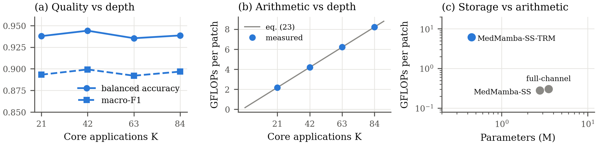

*Fig. 9. (a) Test quality against the number of core applications (12-epoch budget). (b) Measured arithmetic, without the reconstruction decoder, against the cost model (23). (c) Parameters against arithmetic for the hyperspectral configurations; full-channel is the hierarchical variant of Section IV-D.*

On the same input, MedMamba-SS-TRM holds 6.2× fewer parameters than MedMamba-SS (446,409 against 2,773,007) and needs 22.3× more arithmetic (6.203 against 0.278 GFLOPs; Fig. 9(c)); on whole 224 × 224 RGB images, where MedMamba-SS uses MedMamba-T's layout and MedMamba-SS-TRM keeps $d = 128$, the ratios are 61.4× and 16.4×, figures that reflect those two configurations as much as the substitution. Because the forward pass always runs all three segments, inference pays this cost too. Parameter count in a weight-shared recursive model therefore measures storage, not compute, and the depth that this compute buys is not measurable on this task: 21 applications match 63 at a third of the arithmetic.

### F. Hyperspectral Versus RGB Input

Because the architecture has the same parameters at 3 and at 32 bands (Section VI-C), the same model can be trained on the paired RGB build. The two arms of this comparison use the same model (446,409 parameters), recipe, patient split and patch coordinates, and differ in the input build and therefore in the reconstruction target and the spectral position encoding, wavelength for 32 bands and index for 3 (Section III-B); each is repeated at five seeds. Table XII gives balanced accuracy on each held-out set.

**TABLE XII**
**Balanced Accuracy of the 32-Band (HSI) and 3-Band (RGB) Arms of MedMamba-SS-TRM, Five Seeds; Δ in Points**

| Seed | Test HSI | Test RGB | Δ | Val. HSI | Val. RGB | Δ | Pooled HSI | Pooled RGB | Δ |
| ---: | ---: | ---: | ---: | ---: | ---: | ---: | ---: | ---: | ---: |
| 1 | 89.61 | 88.18 | +1.43 | 83.00 | 84.81 | −1.81 | 86.32 | 86.73 | −0.41 |
| 7 | 93.41 | 88.97 | +4.45 | 74.37 | 80.41 | −6.05 | 83.94 | 84.89 | −0.95 |
| 13 | 92.76 | 88.79 | +3.97 | 78.66 | 78.94 | −0.28 | 85.74 | 83.99 | +1.75 |
| 23 | 93.78 | 88.89 | +4.88 | 72.77 | 82.39 | −9.62 | 83.26 | 85.86 | −2.59 |
| 42 | 94.37 | 88.51 | +5.86 | 72.11 | 83.41 | −11.31 | 83.21 | 86.17 | −2.96 |
| **Mean** | **92.78** | **88.67** | **+4.12 ± 1.66** | **76.18** | **81.99** | **−5.81 ± 4.78** | **84.49** | **85.53** | **−1.04 ± 1.89** |

On the test patients, balanced accuracy favours 32-band input at five of five seeds, by 4.12 ± 1.66 points (macro-F1 +0.044 ± 0.038, positive at four of five), and the gain lies in healthy tissue and DCIS (mean per-class F1 0.892 against 0.844 and 0.739 against 0.656; IDC 0.993 against 0.994). Per patient (Table XIII), it comes from the healthy captures of patients 141, 213 and 229 (seed-mean healthy recall 0.90–0.99 against 0.78–0.94) and from the DCIS captures of patient 136 (0.97 against 0.91); on patient 136's healthy captures both arms reach only 0.40. On the validation patients, scored on the full split, the sign reverses: 3-band input is better at five of five seeds, by 5.81 ± 4.78 points. Pooled over all ten patients the difference is −1.04 ± 1.89 points (positive at one of five seeds). Resampling patients (Section V-E), the 95 % interval of the seed-mean difference is [+1.6, +4.8] points on the test patients, [−11.8, −1.4] points on the validation patients and [−6.6, +3.9] points pooled.

Fig. 10(b) locates the reversal. Averaged over seeds, 32-band input gives the higher macro recall for seven of the ten held-out patients, patient 136 is tied at 0.770, and the remaining two are validation patients: patient 197 favours 3 bands narrowly (0.853 against 0.866), and patient 304 favours them by a wide margin, with macro recall 0.566 with 32 bands against 0.773 with 3. Removing patient 304 shrinks the validation difference from −5.81 ± 4.78 to −1.91 ± 5.50 points (32 bands better at two of five seeds), so most of the validation reversal disappears without patient 304, and the remainder lies within the spread over seeds. The same patient reverses the comparison without any network: a logistic regression on per-band means and standard deviations scores 90.28 % on the test patients with 32 bands against 87.58 % with 3, and 77.99 % against 84.90 % on the validation patients, where patient 304 again favours 3 bands (0.672 against 0.836). Patient 65, also in validation, is the hardest held-out patient for both inputs (macro recall 0.495 and 0.481): its IDC captures, the ten smaller captures of Table III, are classified as IDC at a recall of 0.000–0.002 at every seed in both arms. The 3-band model is also the more stable across seeds (test balanced accuracy s.d. 0.3 against 1.9 points). The comparison therefore does not establish that 32-band input is better for this task. It shows that 32 bands help most patients and fail badly on one, and that ten patients, with DCIS present in only one patient per held-out set, are too few to decide between the two inputs. The 32 input bands were also chosen with labels that include held-out patients (Section III-A), which could favour the 32-band arm on either held-out set.

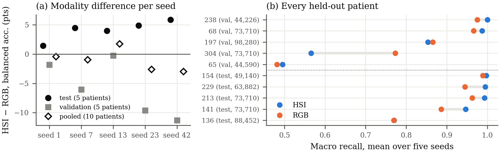

*Fig. 10. (a) HSI − RGB balanced accuracy per seed on the test patients, the validation patients and all ten pooled. (b) Macro recall of every held-out patient (split, number of patches), averaged over the five seeds, for both inputs.*

### G. Error Analysis

Fig. 11 shows the seed-42 test confusion matrices of the two MedMamba-SS-TRM arms. Both classify IDC almost perfectly (100.0 % and 99.0 % recall), and test IDC precision is 1.000 at every seed in both arms, so the healthy-tissue errors are DCIS predictions: 14.3 % of healthy patches with 32 bands and 27.5 % with 3 bands at seed 42.

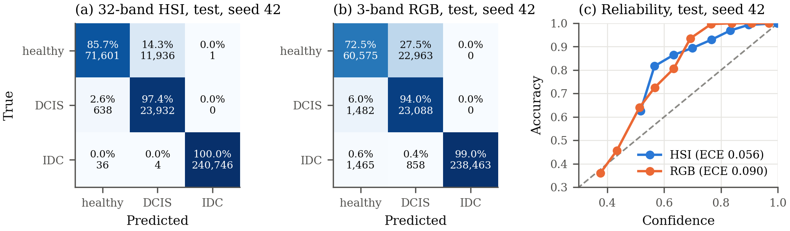

*Fig. 11. (a, b) Row-normalized test confusion matrices at seed 42 with patch counts. (c) Reliability diagram over 15 bins; bins with at most 200 patches are not drawn. The ECE values in the legend are for seed 42; Table XIV gives five-seed means.*

**TABLE XIII**
**Recall per Held-Out Patient and Class, Mean (Minimum–Maximum) Over Five Seeds, for the 32-Band (HSI) and 3-Band (RGB) Arms of MedMamba-SS-TRM**

| Split | Patient | Healthy, HSI | Healthy, RGB | DCIS, HSI | DCIS, RGB | IDC, HSI | IDC, RGB |
| --- | ---: | ---: | ---: | ---: | ---: | ---: | ---: |
| Test | 136 | 0.40 (0.24–0.50) | 0.40 (0.35–0.46) | 0.97 (0.95–0.99) | 0.91 (0.87–0.94) | 0.93 (0.74–1.00) | 1.00 (0.99–1.00) |
| Test | 141 | 0.90 (0.80–0.94) | 0.78 (0.72–0.84) | — | — | 1.00 (0.99–1.00) | 0.99 (0.97–1.00) |
| Test | 154 | — | — | — | — | 1.00 (0.99–1.00) | 0.99 (0.97–1.00) |
| Test | 213 | 0.99 (0.97–0.99) | 0.94 (0.93–0.96) | — | — | 1.00 (1.00–1.00) | 0.98 (0.97–1.00) |
| Test | 229 | 0.99 (0.98–1.00) | 0.90 (0.89–0.93) | — | — | 1.00 (1.00–1.00) | 0.99 (0.97–1.00) |
| Val. | 65 | 0.99 (0.97–1.00) | 0.96 (0.91–0.98) | — | — | 0.00 (0.00–0.00) | 0.00 (0.00–0.00) |
| Val. | 68 | 0.98 (0.91–1.00) | 0.94 (0.88–0.97) | — | — | 1.00 (0.99–1.00) | 0.99 (0.98–1.00) |
| Val. | 197 | 0.94 (0.87–0.97) | 0.87 (0.84–0.90) | 0.62 (0.50–0.88) | 0.73 (0.65–0.82) | 1.00 (1.00–1.00) | 0.99 (0.98–1.00) |
| Val. | 238 | — | — | — | — | 1.00 (1.00–1.00) | 0.98 (0.96–1.00) |
| Val. | 304 | 0.15 (0.01–0.30) | 0.56 (0.50–0.62) | — | — | 0.98 (0.95–1.00) | 0.98 (0.95–1.00) |

*—: the patient has no patches of that class. Validation recalls are on the full validation split.*

The errors are concentrated in individual patients, at every seed and in both arms (Table XIII). On the test set, patient 136, the only test patient with DCIS, has healthy recall of 0.24–0.50 across seeds with 32 bands, and at seed 42 its four healthy captures produce 83 % of the 32-band arm's healthy errors (9,877 of 11,937 patches); the other test patients reach healthy recall of 0.80–1.00 with 32 bands. On the validation set, patient 304, who has no DCIS, has healthy recall of 0.01–0.30 with 32 bands against 0.50–0.62 with 3, and produces 84 % of the 32-band arm's validation healthy errors at seed 42. The high DCIS recall on the test set is measured on patient 136 alone; on the validation DCIS patient, 197, it is 0.50–0.88. Two explanations fit these patterns, and neither has been tested. DCIS is learned from five training patients, so the model may associate slide- or patient-level appearance with DCIS; and labels are assigned per capture without a pixel mask, so healthy captures of a patient with DCIS may contain tissue resembling DCIS. The class-mean spectral difference at 535–633 nm (Fig. 2(a)) may contribute as well, but on its own it does not explain why the errors concentrate in these two patients.

The reliability curves lie above the diagonal: both models are under-confident on the test patients (Section VI-H).

### H. Calibration and Selective Prediction

Table XIV reports calibration of MedMamba-SS-TRM over the five seeds of each arm and, at seed 42, of the other networks and the two strongest probes of Table X.

**TABLE XIV**
**Calibration on the Test and Validation Patients. MedMamba-SS-TRM: Mean ± S.D. Over Five Seeds; Other Models: Seed 42**

| Held-out set | Model | ECE (29) | MCE | Brier | NLL | Macro ROC-AUC | ECE, temperature fitted on the other set |
| --- | --- | ---: | ---: | ---: | ---: | ---: | ---: |
| Test | **MedMamba-SS-TRM, 32 bands** | 0.056 ± 0.007 | 0.202 ± 0.034 | 0.097 ± 0.033 | 0.167 ± 0.062 | 0.9953 ± 0.0009 | 0.095 ± 0.015 |
| Test | MedMamba-SS-TRM, 3 bands | 0.094 ± 0.017 | 0.273 ± 0.020 | 0.134 ± 0.016 | 0.232 ± 0.033 | 0.9900 ± 0.0006 | 0.222 ± 0.028 |
| Test | MedMamba [1] | 0.013 | 0.067 | 0.069 | 0.113 | 0.9924 | — |
| Test | HybridSN [25] | 0.062 | 0.245 | 0.112 | 0.182 | 0.9883 | 0.326 |
| Test | SpectralFormer [26] | 0.035 | 0.182 | 0.120 | 0.202 | 0.9756 | 0.110 |
| Test | Logistic regression, band means + s.d. (64 feat.) | 0.025 | 0.084 | 0.105 | 0.187 | 0.9912 | 0.373 |
| Test | Logistic regression, RGB means + s.d. (6 feat.) | 0.035 | 0.134 | 0.115 | 0.186 | 0.9839 | 0.134 |
| Validation | **MedMamba-SS-TRM, 32 bands** | 0.059 ± 0.003 | 0.177 ± 0.088 | 0.227 ± 0.017 | 0.393 ± 0.062 | 0.9451 ± 0.0029 | 0.094 ± 0.010 |
| Validation | MedMamba-SS-TRM, 3 bands | 0.070 ± 0.014 | 0.219 ± 0.027 | 0.240 ± 0.013 | 0.812 ± 0.048 | 0.9505 ± 0.0044 | 0.057 ± 0.004 |
| Validation | HybridSN [25] | 0.076 | 0.230 | 0.200 | 1.827 | 0.9350 | 0.060 |
| Validation | SpectralFormer [26] | 0.052 | 0.167 | 0.200 | 0.601 | 0.9472 | 0.040 |
| Validation | Logistic regression, band means + s.d. (64 feat.) | 0.071 | 0.107 | 0.289 | 1.941 | 0.9128 | 0.075 |
| Validation | Logistic regression, RGB means + s.d. (6 feat.) | 0.057 | 0.274 | 0.211 | 0.670 | 0.9628 | 0.051 |

*MCE: largest $|\mathrm{acc}(B_m) - \mathrm{conf}(B_m)|$ over the bins of (29) that hold at least 0.1 % of the patches. MedMamba-SS-TRM: mean ± s.d. over five seeds; other models: one run at seed 42. MedMamba's validation probabilities were not stored, so it has no validation row and no transferred temperature. Without that floor, MedMamba's test MCE would be 0.474, set by a bin of 7 patches; that of two MedMamba-SS-TRM validation runs would be set by a bin of fewer than 335 patches.*

On the test patients the 32-band model is better calibrated than its 3-band twin at every seed (ECE 0.056 ± 0.007 against 0.094 ± 0.017; Brier 0.097 against 0.134), and on the validation patients as well (ECE 0.059 against 0.070). The reliability diagram (Fig. 11(c)) shows the direction of the error on the test patients: above a confidence of 0.5, accuracy exceeds confidence in every bin, so both models are under-confident. One possible contributor is the focal loss, which down-weights confident predictions; we have not isolated it.

Temperature scaling [47] fitted on each run's validation predictions does not repair this. The fitted temperature is above one ($\tau$ = 1.53 ± 0.14 for 32 bands, 1.99 ± 0.11 for 3 bands), because the models are over-confident on the validation patients, and applied to the test patients it raises test ECE from 0.056 to 0.095 (32 bands) and from 0.094 to 0.222 (3 bands). In the other direction, a temperature fitted on the test patients is below one ($\tau$ = 0.44 and 0.34); applied to the validation patients it raises validation ECE from 0.059 to 0.094 (32 bands) and lowers it from 0.070 to 0.057 (3 bands; last column of Table XIV). So for the 32-band model no single temperature fits both held-out sets, whereas for the 3-band model the temperature fitted on the test patients also lowers validation ECE.

Among the other models, MedMamba (0.013), the 64-feature probe (0.025), SpectralFormer (0.035) and the RGB probe (0.035) are better calibrated than the 32-band MedMamba-SS-TRM on the test patients and HybridSN (0.062) is worse; on the validation patients SpectralFormer (0.052) and the RGB probe (0.057) are better and the 64-feature probe (0.071) and HybridSN (0.076) are worse. The transferred temperature fails for HybridSN, SpectralFormer, the 64-feature probe and the RGB probe as well: fitted on the validation patients it is above one for each of them ($\tau$ = 1.70 to 5.51) and raises test ECE, most for the 64-feature probe (0.025 to 0.373) and HybridSN (0.062 to 0.326); fitted on the test patients it is below one for each of them ($\tau$ = 0.36 to 0.77) and lowers validation ECE for HybridSN, SpectralFormer and the RGB probe and raises it for the 64-feature probe. All six models with validation predictions are therefore over-confident on the validation patients and under-confident on the test patients. Because the direction is the same for every model, it is consistent with an effect of the patient sets rather than of the architecture, and on these data a temperature fitted on five patients does not transfer to five others.

**Selective prediction.** When a classifier abstains on its least confident inputs [44], [45], its value depends on how well confidence ranks errors. Ranking test patches by confidence at seed 42, the 32-band MedMamba-SS-TRM has the lowest area under the risk–coverage curve [51] among the networks, marginally below MedMamba's (AURC 0.0035, against 0.0038 for MedMamba, 0.0068 for HybridSN, 0.0104 for SpectralFormer and 0.0103 for its RGB twin; the probes were not scored), with 98.42 % accuracy on the 90 % most confident patches, against 98.49 % for MedMamba. This ranking is from one seed, MedMamba-SS-TRM's best on the test patients (Section VI-A). On the validation patients the order reverses (AURC 0.033, against 0.024 for HybridSN and 0.018 for SpectralFormer), the same patient dependence as in Section VI-A.

### I. Explainability: What the Spectral Pathway Attends To

The band gate (10) weights every band of every patch before pooling, so its values show which wavelengths the pathway emphasizes. Fig. 12(a) averages them over 9,000 class-stratified test patches for the seed-42 hyperspectral model. The gate is not uniform, but its modulation is moderate. It rises from about 0.55 below 500 nm to a peak at 577 nm and stays high to 633 nm, then falls to about 0.54 in the near-infrared block. The peak is highest for DCIS (0.67 at 577 nm), then IDC (0.65) and healthy tissue (0.61), although the ±1 s.d. bands of the three classes overlap across patches (Fig. 12(a)), and its between-class spread is largest in the same 535–633 nm region where the input spectra differ most (Fig. 12(b)): at 535 nm healthy tissue reflects 0.17 above the overall mean and DCIS 0.15 below it, near the absorption minimum of the class-mean spectra. The class means also differ in the near-infrared block, by about 0.11 between DCIS and healthy tissue, where the gate is low. The gate thus puts its highest weights on the visible bands at 577–633 nm, next to the 535 nm band where the input classes differ most and where the gate is still rising; only four selected bands lie between 496 and 852 nm (Section III-A), so this localization is coarse. Every DCIS test patch comes from patient 136, so the class contrasts of Fig. 12 and Supplementary Fig. S2 are also contrasts between patients. The gate was not given band-level supervision, but the 32 bands it weights were themselves chosen by mutual information with the labels (Section III-A). The gate is a learned weighting, not a causal attribution: it does not show that these bands drive the predictions, the model still receives every band, and the profile comes from one seed.

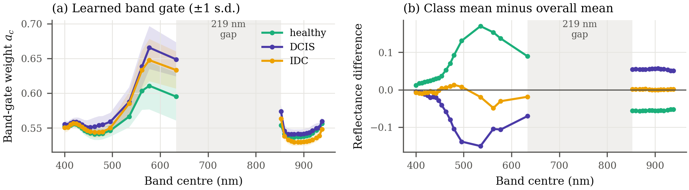

*Fig. 12. (a) Band-gate weights $a_c$ of (10), averaged within each patch, for 9,000 class-stratified test patches (3,000 per class). (b) Difference between each class's mean spectrum and the overall mean for the same patches.*

Supplementary Fig. S2 embeds the pooled answer state, the vector the classifier reads, for the same patches with t-SNE [52]. With 32 bands the three classes form three separate groups, healthy and DCIS adjacent but distinct. With 3 bands IDC stays separate, while healthy and DCIS patches intermix along a shared boundary. This agrees in direction with the higher healthy-to-DCIS confusion of the 3-band arm (Section VI-G), but t-SNE geometry is not a measure of separability.

### J. Reconstruction

The auxiliary decoder reconstructs the 32-band input from the core's final answer state. On the validation subset its spectral angle, computed on reflectance, falls from 9.47° after the first epoch to 6.16° at the selected epoch 7 and 5.34° at epoch 20, with RMSE 0.1109 and PSNR 20.3 dB at the selected epoch (peak value 1; both are means of per-batch values weighted by batch size, so the PSNR exceeds the 19.1 dB implied by the mean RMSE). Fig. 13 shows typical (median spectral angle) and worst reconstructions for each class. Median reconstructions follow the input spectrum closely across both spectral regions, including the absorption minimum near 535 nm, and preserve the spatial pattern of the patch (2-D SSIM 0.66–0.80). The worst cases are informative: the worst IDC patch (20.6°) is a saturated, nearly uniform patch whose spectrum lacks the stain absorption minimum, an atypical input that the decoder maps back toward the typical tissue spectrum. The answer state is a 121 × 128 map, larger than the 32 × 11 × 11 input, so its capacity to support this reconstruction is expected; the single-seed ablation of Section VI-D is consistent with the reconstruction objective helping classification, but does not establish it.

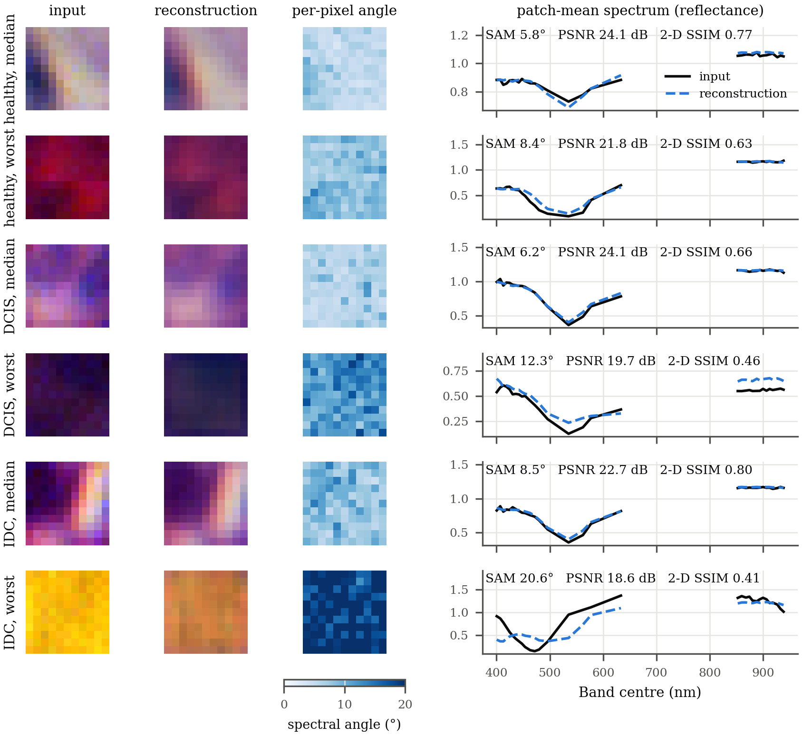

*Fig. 13. Spectral reconstruction on validation patches, one median and one worst patch per class (ranked by spectral angle). Left: composites (633/562/463 nm) of input and reconstruction on a common intensity scale, and the per-pixel spectral angle. Right: patch-mean spectra; no line is drawn across the 219 nm gap.*

### K. Skin Lesions

On PAD-UFES-20, 11 × 11 patches cut from whole photographs inherit the photograph's label although most contain no lesion, which is a multiple-instance setting [53]. At patch level, under the recipe tuned for it, MedMamba-SS-TRM scores only 25.7 % balanced accuracy (chance is 16.7 %), which is consistent with this label noise; averaging its patch predictions over each image raises this to 35.6 % (MedMamba: 24.8 % → 31.4 %). In a separate run under a patch recipe matched to MedMamba in every setting except the architecture, MedMamba-SS-TRM is ahead on accuracy (30.7 % against 27.6 %), balanced accuracy (25.8 % against 24.8 %) and macro-F1 (0.228 against 0.216) with 8.2× fewer parameters, but these are single runs a few points above chance, and we do not rank the models on them.

Whole 224 × 224 images are where both proposed models can be compared directly (Table XV). MedMamba-SS trains here, well above the majority-class accuracy of 34.6 %, so its failure on hyperspectral patches (Section VI-D) is not a failure of the hierarchy on every input; it has the highest accuracy (53.5 %), specificity, Cohen's κ (0.352) and ROC-AUC (0.798) of the three runs. MedMamba-SS-TRM has the highest balanced accuracy (50.2 %) and macro-F1 (0.421), with 61× fewer parameters than MedMamba-SS and 32× fewer than MedMamba-T. The reported MedMamba-SS-TRM configuration is one of 33 recursive PAD-UFES-20 runs with different recipes whose test scores were recorded during development, so its scores may be optimistically biased. A repeat of the MedMamba-SS run with the same configuration and seed gives accuracy 54.1 %, balanced accuracy 38.4 %, macro precision 54.8 %, macro-F1 0.377, κ 0.343 and ROC-AUC 0.806: macro precision alone moves by 17 points between two identical runs, so differences of a few points in Table XV are within run-to-run variation on this 344-image test set. The comparison is also confounded, and the table lists how. The two proposed models share the patient-disjoint split and test images but not the training set, recipe or class weighting: MedMamba-SS-TRM was trained on a class-undersampled set of 234 images for 150 epochs at learning rate $10^{-3}$, MedMamba-SS on all 1,626 training images for 200 epochs at $3 \times 10^{-4}$ (batch 32, patch size $p = 8$ and focal loss with $\gamma = 1.5$ for both, no reconstruction). Class undersampling is expected to raise macro sensitivity at the expense of accuracy, which is consistent with this pattern, but the two runs differ in more than the sampling. The MedMamba-T run uses the reference image-level protocol with a different test set, and it reaches 47.2 % accuracy and ROC-AUC 0.714, below the 58.8 % and 0.808 listed for this dataset in the MedMamba repository [54]; our reproduction of the baseline is therefore weaker than the published one.

**TABLE XV**
**Whole-Image PAD-UFES-20, Test Split**

| | MedMamba-SS-TRM | MedMamba-SS | MedMamba-T |
| --- | ---: | ---: | ---: |
| Parameters | **0.45 M** | 27.4 M | 14.5 M |
| Split | patient-disjoint | patient-disjoint | image-level |
| Training images | 234 (class-undersampled) | 1,626 | 1,378 |
| Test images | 344 | 344 | 691 |
| Loss | focal, weights $\propto n_k^{-1}$ | focal, weights $\propto n_k^{-0.75}$ | cross-entropy |
| Accuracy | 45.6 % | **53.5 %** | 47.2 % |
| Balanced accuracy (macro sensitivity) | **50.2 %** | 39.8 % | 33.9 % |
| Macro precision | **40.3 %** | 37.5 % | 34.5 % |
| Macro specificity | 88.6 % | **89.2 %** | 87.9 % |
| Macro-F1 | **0.421** | 0.385 | 0.335 |
| Cohen's κ | 0.305 | **0.352** | 0.271 |
| Macro ROC-AUC | 0.793 | **0.798** | 0.714 |

*MedMamba-T: our run of the reference implementation [54] under its own image-level protocol. MedMamba-SS: first of two identical-configuration runs; the repeat is reported in the text. All columns are single runs; bold marks the best of the three in each row, and differences of a few points are within run-to-run variation.*

---

## VII. Discussion

### A. Summary of Rankings

Table XVI collects the rankings of Section VI in one place: where the proposed models lead, and where they do not. The rest of this section interprets them and then states the limitations of the evidence.

**TABLE XVI**
**Summary of Rankings (Seed 42 Unless Stated; MedMamba and the Probes Are Single Runs)**

| Criterion | Leader | Runner-up | Section |
| --- | --- | --- | --- |
| Test balanced accuracy, five patients | **MedMamba-SS-TRM** (five seeds 92.78 ± 1.87 %, first at four of five; 94.37 % at seed 42) | MedMamba (91.02 %) | VI-A |
| Test macro-F1, five patients | Level: MedMamba-SS-TRM (five seeds 0.875 ± 0.040) and MedMamba (0.872) | — | VI-A |
| Test accuracy and Cohen's κ, five patients | MedMamba (95.14 %, 0.896) | MedMamba-SS-TRM (five seeds 94.66 %, 0.888) | VI-A |
| Test selective prediction among networks, AURC (lower is better), seed 42 only | Level: MedMamba-SS-TRM (0.0035) and MedMamba (0.0038); MedMamba more accurate on the 90 % most confident patches | — | VI-H |
| Parameters identical at 3 and 32 bands | **MedMamba-SS-TRM** (446,409 at both) | — (every baseline changes with $C$) | VI-C |
| Pooled balanced accuracy, all models, ten patients | HybridSN (five seeds 87.12 ± 0.66 %; ahead of MedMamba-SS-TRM at five of five seeds) | RGB colour probe (86.50 %); MedMamba-SS-TRM five seeds 84.49 % | VI-A |
| Pooled macro-F1, all models, ten patients | HybridSN (five seeds 0.813 ± 0.013) | RGB colour probe (0.807); MedMamba-SS-TRM five seeds 0.795 | VI-A |
| Validation balanced accuracy, five patients | Level: HybridSN (84.94 % at seed 42; five seeds 84.37 ± 1.04 %, ahead of MedMamba-SS-TRM at five of five) and RGB colour probe (84.90 %, single run) | SpectralFormer (five seeds 79.29 %); MedMamba-SS-TRM five seeds 76.18 % | VI-A |
| Test ECE | MedMamba (0.013) | 64-feature probe (0.025); MedMamba-SS-TRM 0.056 | VI-H |
| Whole-image PAD-UFES-20 (confounded single runs; differences within run-to-run variation) | MedMamba-SS-TRM on balanced accuracy and macro-F1 (50.2 %, 0.421); MedMamba-SS on accuracy, κ and ROC-AUC (53.5 %, 0.352, 0.798) | — | VI-K |

### B. Interpretation

**The spectral pathway and MedMamba-SS.** The pathway removes the band count from every parameter shape by construction. Measured inside MedMamba-SS-TRM, the same parameters serve 3 and 32 bands, a model retrained at 8 bands keeps most of its accuracy, and the learned band gate is highest at 577–633 nm, near where the classes differ most (Sections VI-C and VI-I). A trained instance transfers only partly: evaluated zero-shot on 16 bands, the 32-band model collapses when its encoding scale follows the band count but keeps 0.909 balanced accuracy when the scale is held at its training value, whereas at 8 bands it reaches at most 0.560 (Section VI-C). MedMamba-SS trains on whole RGB images but stays near chance on hyperspectral patches. Its constant prediction there is a batch-normalization artefact, and even without it the standard variant reaches only 0.49 balanced accuracy on a stratified test sample (Section VI-D). Until that is resolved, the additions of MedMamba-SS to the hierarchy (per-stage conditioning, context updater, modified block and head) remain unablated.

**Recursion and what transfers from TRM.** The recursive substitution reduces parameters 6.2× while keeping the spectral pathway and the task interface, and the resulting 0.45 M-parameter model has the highest test balanced accuracy of the models compared at four of five seeds. Against MedMamba (3.65 M, a single run under its own recipe) it is ahead on test and pooled balanced accuracy, level on test macro-F1 and behind on test accuracy and κ; in the reported configuration the recursion also replaces MedMamba's spatial selective scan with a convolutional mixer (Section IV-E), so that comparison measures both changes. TRM's schedule trains stably on noisy patch classification, but whether recursion itself helps, compared with a non-recursive core of the same size, is not tested. Three expectations one might carry over from TRM do not hold here: the halting head does not learn on three-way tissue labels (Supplementary Section S-B), 21 core applications match 63, and a weight-shared recursive model is not cheap to run, because it trades storage for compute at inference as well as in training (Section VI-E).

**Dependence on the held-out patients.** Whether hyperspectral input beats RGB input, and whether MedMamba-SS-TRM beats the hyperspectral baselines or a logistic regression on per-patch statistics, depends on which five patients are held out. The seed-paired comparisons show the same split as the single runs: the recursive model is ahead of HybridSN on the test patients at four of five seeds and of SpectralFormer at all five, but HybridSN is ahead on the validation patients and pooled over all ten patients at every seed. Per patient the picture is simpler: 32 bands give the higher recall for seven of ten patients, tie on one and fail badly on one (patient 304), and the dominant errors come from individual patients at every seed (Table XIII). The pooled ten-patient comparison uses the most patients, but half of them also selected the networks' checkpoints, so it does not replace patient-level cross-validation.

### C. Limitations

- **Band selection.** The importance score that chose the 32 input bands used tissue labels from 64 captures drawn before the split, 16 of them from held-out patients (Section III-A). The patient-disjoint split does not cover this step. Repeating the selection on training patients alone moves every band by at most 5.1 nm and keeps the band layout (Section III-A), which bounds the change to the input; the models have not been retrained on that build, so the effect on the hyperspectral results, the band-gate profile and the modality comparison is not measured.
- **Held-out patients.** All hyperspectral results rest on ten non-training patients. DCIS is represented by five training patients and by one patient per held-out set, and the validation patients also select each network's checkpoint. The test patients play no part in checkpoint selection, but test scores of development runs were recorded and compared while the recipe was developed (Section V-C), so their independence from model development cannot be demonstrated. Patient-level cross-validation, or a new held-out set, is the next experiment.
- **Patient-concentrated errors.** The dominant errors come from individual patients at every seed (Table XIII). Whether DCIS was partly learned as patient or slide appearance, or whether capture-level labels are noisy on these captures, has not been tested; the region annotations of the collection could be used to check the latter. Patient 65's ten IDC captures are smaller than all others and are almost never classified as IDC, for a reason we have not identified.
- **Labels and unit of analysis.** Every patch inherits its capture's tissue label without a pixel-level mask, so labels are noisy at patch level, and evaluation is per patch, not per slide or patient, the unit at which a diagnosis is made. DCIS is also the diagnosis on which pathologists agree least often [55]. The per-capture intensity gain and the global scaling constant are computed over captures from all patients; they involve no labels but are not restricted to training data. The data come from one institution and one acquisition system, and the results are computational; nothing here constitutes clinical validation.
- **Statistics and controls.** HybridSN and SpectralFormer were run at the five seeds of the headline model, but MedMamba, the probes and every ablation are single runs, and the ablation effects are smaller than the seed-to-seed spread. Seed 42, used for every single-seed analysis, is the best test seed and the worst validation seed of MedMamba-SS-TRM. MedMamba was trained with its own recipe and selected on the full validation split, and HybridSN and SpectralFormer were not tuned. No non-recursive core of the same size was trained, so the contribution of recursion itself, as opposed to the rest of the design, is not isolated.
- **Modality comparison.** The RGB input is the collection's 8-bit synthetic rendering, and the two arms also differ in the reconstruction target and in the spectral position encoding (index for the 3-band arm).
- **Hierarchy.** MedMamba-SS stays near chance on hyperspectral patches under our recipe; its constant prediction is a batch-normalization artefact, but even with batch statistics it reaches only 0.49 balanced accuracy on a stratified sample, for reasons not identified. On those data the recursive substitution is supported on parameters, arithmetic and interface, not on a head-to-head comparison.
- **Band transfer.** Zero-shot transfer works at 16 bands only with the encoding scale held fixed and fails at 8 bands; it was evaluated on one checkpoint and one index decimation, and no channel-adaptive baseline was trained.
- **PAD-UFES-20.** The whole-image comparison is confounded by training set, recipe and loss weighting, its metrics vary by several points between identical runs, the MedMamba-SS-TRM configuration was chosen among 33 runs whose test scores were recorded, and our run of the MedMamba baseline is weaker than the published one.

### D. Future Work

Four experiments follow directly from the limitations, and their inputs are already prepared. First, retraining the headline pair, the probes and the baselines on the training-only band-selection build of Section III-A would remove the band-selection caveat from every hyperspectral result. Second, patient-level five-fold cross-validation with band selection repeated inside each fold would test every one of the 45 patients once, including all seven with DCIS, under a recipe fixed in advance, and so would remove the dependence on one five-patient test set that was seen during development. Third, a second hyperspectral histology dataset with a different sensor, HMI-LUSC (lung squamous cell carcinoma, 10 patients, 61 bands from 450 to 750 nm, pixel-level tumour masks) [56], would test band-count agnosticism beyond one instrument; the dataset's own baselines were not reported as patient-disjoint, so a patient-level evaluation would also be new for it. Fourth, a non-recursive control of the same size and the component ablations need to be run across seeds, and MedMamba-SS should be retrained with a normalization that does not depend on batch statistics (Section VI-D). Beyond these, a band-count-independent encoding scale, combined with training on random band subsets [6], may extend zero-shot transfer below half of the bands; a channel-adaptive baseline such as BAT-Former [8] would place the spectral pathway against the closest band-aware design; and an SS2D mixer with a fused scan kernel would give the recursive core a spatial state-space mixer again.

---

## VIII. Conclusion

We extended MedMamba [1] in two steps, each a single substitution. MedMamba-SS replaces the convolutional patch embedding with a spectral pathway whose parameters do not depend on the number of bands and conditions every stage of the SS-Conv-SSM hierarchy on it; MedMamba-SS-TRM replaces that hierarchy with one weight-shared core applied recursively in the manner of TRM [2], keeping the spectral pathway and the task interface.

Two properties follow from the design, and measurement confirms them, so they do not depend on which patients are held out. The classification path has exactly the same parameter count at 3 and at 32 bands (446,409). And the recursive core reduces parameters 6.2× while multiplying arithmetic 22.3×, so parameter count in a weight-shared recursive model measures storage, not compute.

Further findings come from single runs on the five test patients. A model retrained at eight bands keeps most of its accuracy. In a post-hoc evaluation of one checkpoint, a trained 32-band model transfers zero-shot to 16 bands (0.909 balanced accuracy) once its encoding scale is held at the training value, whereas the encoding as defined makes it collapse; at 8 bands zero-shot transfer fails either way. The wavelength encoding and the reconstruction objective are associated with small gains within the seed-to-seed spread, and recursion depth beyond 21 applications buys nothing measurable.

The comparisons with other models and with RGB input depend on the patients. MedMamba-SS-TRM has the highest balanced accuracy on the five test patients (92.8 ± 1.9 % over five seeds, first at four of five) and is among the weaker networks on the five validation patients; pooled over all ten, HybridSN leads it at each of five paired seeds, and a six-feature colour probe also leads. The advantage of 32-band over 3-band input follows the same split (+4.1 points on test, −5.8 on validation, −1.0 pooled), and a linear probe shows the same pattern, so the reversal is not specific to the network. The largest errors are concentrated in three patients (136, 304 and 65). All hyperspectral results also carry the band-selection caveat of Section III-A.

Beyond these design properties, the experiments show that the band-count-agnostic front end trains and keeps most of its accuracy when retrained on fewer bands, and that a 0.45 M-parameter recursive model has the highest test balanced accuracy but is behind HybridSN pooled over all ten held-out patients. Whether recursion improves on a non-recursive core of the same size is untested, and the classification benefit of hyperspectral over RGB input for breast histology remains to be settled on more patients, with band selection restricted to training data.

---

## Appendix: Reproducibility

Both proposed models are defined in one implementation and selected by one configuration switch. Every run records its configuration, per-epoch history, gate reports, per-patient and per-capture metrics, arithmetic counts and a checkpoint-reproducibility record, so a run can be repeated from its recorded configuration; runs are not bitwise deterministic (Section V-E). Data preparation records its command line, the selected band indices, the per-capture gains and the patient split. The held-out analyses of Section VI (full-validation predictions, patient bootstrap, probes on both held-out sets, band-gate and latent-space exports) are computed from saved checkpoints and predictions without retraining. Both datasets are public under the CC BY 4.0 license [33], [37]; the MedMamba baseline uses the reference implementation [54]. Code and trained checkpoints will be released on acceptance.

---

## Acknowledgment

The hyperspectral histology data used in this work are from the HistologyHSI-BC-Recurrence collection [33], described in [34] and accessed through The Cancer Imaging Archive (TCIA); they are used under the Creative Commons Attribution 4.0 International (CC BY 4.0) license and the TCIA Data Usage Policy. The skin-lesion photographs are from the PAD-UFES-20 dataset [37], described in [36] and accessed through Mendeley Data, and are likewise used under CC BY 4.0. The band selection, patch extraction and patient splits derived from them are described in Section III. The author thanks the creators of both datasets for making them publicly available.

The author also thanks the authors of MedMamba and of the Tiny Recursive Model for releasing reference implementations [54], [57].

A generative AI assistant (Claude, Anthropic) was used to help draft and revise the text of this manuscript and to help write and debug code for the experiments, analyses and figures. The author directed this work, checked the text, numbers and references against the experimental records, and takes full responsibility for the content.

---

## References

[1] Y. Yue and Z. Li, "MedMamba: Vision Mamba for medical image classification," arXiv:2403.03849, 2024. [Online]. Available: https://arxiv.org/pdf/2403.03849

[2] A. Jolicoeur-Martineau, "Less is more: Recursive reasoning with tiny networks," arXiv:2510.04871, Oct. 2025. [Online]. Available: https://arxiv.org/pdf/2510.04871

[3] G. Lu and B. Fei, "Medical hyperspectral imaging: A review," *J. Biomed. Opt.*, vol. 19, no. 1, Art. no. 010901, Jan. 2014, doi: 10.1117/1.JBO.19.1.010901.

[4] A. Pandey and S. B. Ahmed, "Hyperspectral melanoma segmentation using SLIC-derived pseudo-labels," in *Proc. Comput. Vis. Conf. (CVC) 2026, Vol. 3*, ser. Lecture Notes in Networks and Systems. Springer, 2026, pp. 171–183, doi: 10.1007/978-3-032-26217-2_14.

[5] S. Fatima, M. U. Akram, S. Mohammad, and S. B. Ahmed, "Deep learning in dermatopathology: Applications for skin disease diagnosis and classification," *Discover Appl. Sci.*, vol. 7, Art. no. 1006, 2025, doi: 10.1007/s42452-025-07138-3.

[6] Y. Bao, S. Sivanandan, and T. Karaletsos, "Channel vision transformers: An image is worth 1 × 16 × 16 words," in *Proc. Int. Conf. Learn. Represent. (ICLR)*, 2024. [Online]. Available: https://openreview.net/forum?id=CK5Hfb5hBG

[7] Z. Xiong et al., "Neural plasticity-inspired multimodal foundation model for Earth observation," arXiv:2403.15356, 2024. [Online]. Available: https://arxiv.org/abs/2403.15356

[8] N. J. Shahi and S. B. Ahmed, "Band-aware transformer (BAT-Former) for general image understanding," in *Proc. Comput. Vis. Conf. (CVC) 2026, Vol. 3*, ser. Lecture Notes in Networks and Systems. Springer, 2026, pp. 184–200, doi: 10.1007/978-3-032-26217-2_15.

[9] A. Baumann, L. Ayala, S. Seidlitz, J. Sellner, A. Studier-Fischer, B. Özdemir, L. Maier-Hein, and S. Ilic, "CARL: Camera-agnostic representation learning for spectral image analysis," arXiv:2504.19223, 2025. [Online]. Available: https://arxiv.org/abs/2504.19223

[10] E. Perez, F. Strub, H. de Vries, V. Dumoulin, and A. Courville, "FiLM: Visual reasoning with a general conditioning layer," in *Proc. AAAI Conf. Artif. Intell.*, vol. 32, no. 1, 2018, doi: 10.1609/aaai.v32i1.11671.

[11] K. He, X. Zhang, S. Ren, and J. Sun, "Deep residual learning for image recognition," in *Proc. IEEE Conf. Comput. Vis. Pattern Recognit. (CVPR)*, 2016, pp. 770–778, doi: 10.1109/CVPR.2016.90.

[12] Z. Liu, H. Mao, C.-Y. Wu, C. Feichtenhofer, T. Darrell, and S. Xie, "A ConvNet for the 2020s," in *Proc. IEEE/CVF Conf. Comput. Vis. Pattern Recognit. (CVPR)*, 2022, pp. 11966–11976, doi: 10.1109/CVPR52688.2022.01167.

[13] A. Dosovitskiy et al., "An image is worth 16×16 words: Transformers for image recognition at scale," in *Proc. Int. Conf. Learn. Represent. (ICLR)*, 2021. [Online]. Available: https://openreview.net/forum?id=YicbFdNTTy

[14] Z. Liu et al., "Swin Transformer: Hierarchical vision transformer using shifted windows," in *Proc. IEEE/CVF Int. Conf. Comput. Vis. (ICCV)*, 2021, pp. 9992–10002, doi: 10.1109/ICCV48922.2021.00986.

[15] A. Gu and T. Dao, "Mamba: Linear-time sequence modeling with selective state spaces," in *Proc. Conf. Lang. Model. (COLM)*, 2024. [Online]. Available: https://openreview.net/forum?id=tEYskw1VY2

[16] L. Zhu et al., "Vision Mamba: Efficient visual representation learning with bidirectional state space model," in *Proc. Int. Conf. Mach. Learn. (ICML)*, ser. Proc. Mach. Learn. Res., vol. 235, 2024, pp. 62429–62442. [Online]. Available: https://proceedings.mlr.press/v235/zhu24f.html

[17] Y. Liu et al., "VMamba: Visual state space model," in *Proc. Adv. Neural Inf. Process. Syst. (NeurIPS)*, vol. 37, 2024, pp. 103031–103063. [Online]. Available: https://proceedings.neurips.cc/paper_files/paper/2024/hash/baa2da9ae4bfed26520bb61d259a3653-Abstract-Conference.html

[18] M. S. Khan, E. Atoofian, and S. B. Ahmed, "Quantum enchanced [sic] multi-scale CNN with bi-directional Mamba for crop field analysis," arXiv:2606.17222, 2026. [Online]. Available: https://arxiv.org/abs/2606.17222

[19] Q. Zhao, S. Lei, C. Tian, and W. Li, "Patient-level hyperspectral state-space learning for melanoma pathology diagnosis," *Photodiagnosis Photodyn. Ther.*, vol. 61, Art. no. 105642, 2026, doi: 10.1016/j.pdpdt.2026.105642.

[20] M. Dehghani, S. Gouws, O. Vinyals, J. Uszkoreit, and Ł. Kaiser, "Universal Transformers," in *Proc. Int. Conf. Learn. Represent. (ICLR)*, 2019. [Online]. Available: https://openreview.net/forum?id=HyzdRiR9Y7

[21] Z. Lan, M. Chen, S. Goodman, K. Gimpel, P. Sharma, and R. Soricut, "ALBERT: A lite BERT for self-supervised learning of language representations," in *Proc. Int. Conf. Learn. Represent. (ICLR)*, 2020. [Online]. Available: https://openreview.net/forum?id=H1eA7AEtvS

[22] S. Bai, J. Z. Kolter, and V. Koltun, "Deep equilibrium models," in *Proc. Adv. Neural Inf. Process. Syst. (NeurIPS)*, vol. 32, 2019. [Online]. Available: https://proceedings.neurips.cc/paper_files/paper/2019/hash/01386bd6d8e091c2ab4c7c7de644d37b-Abstract.html

[23] A. Graves, "Adaptive computation time for recurrent neural networks," arXiv:1603.08983, 2016. [Online]. Available: https://arxiv.org/abs/1603.08983

[24] G. Wang et al., "Hierarchical reasoning model," arXiv:2506.21734, 2025. [Online]. Available: https://arxiv.org/abs/2506.21734

[25] S. K. Roy, G. Krishna, S. R. Dubey, and B. B. Chaudhuri, "HybridSN: Exploring 3-D–2-D CNN feature hierarchy for hyperspectral image classification," *IEEE Geosci. Remote Sens. Lett.*, vol. 17, no. 2, pp. 277–281, Feb. 2020, doi: 10.1109/LGRS.2019.2918719.

[26] D. Hong et al., "SpectralFormer: Rethinking hyperspectral image classification with Transformers," *IEEE Trans. Geosci. Remote Sens.*, vol. 60, Art. no. 5518615, 2022, doi: 10.1109/TGRS.2021.3130716.

[27] S. B. Ahmed and J. Lunia, "QuantFormer: A hybrid quantum classical transformer for hyperspectral image classification," in *Proc. 39th Can. Conf. Artif. Intell.*, ser. Proc. Mach. Learn. Res., vol. 318, 2026, pp. 103–114. [Online]. Available: https://proceedings.mlr.press/v318/ahmed26a.html

[28] S. Fatima, A. A. Salam, M. U. Akram, I. A. Hameed, and S. B. Ahmed, "Incremental learning approach for semantic segmentation of skin histology images," *Sci. Rep.*, vol. 16, Art. no. 9593, 2026, doi: 10.1038/s41598-025-31553-6.

[29] S. Ortega, M. Halicek, H. Fabelo, R. Camacho, M. de la Luz Plaza, F. Godtliebsen, G. M. Callicó, and B. Fei, "Hyperspectral imaging for the detection of glioblastoma tumor cells in H&E slides using convolutional neural networks," *Sensors*, vol. 20, no. 7, Art. no. 1911, 2020, doi: 10.3390/s20071911.

[30] S. Ortega, M. Halicek, H. Fabelo, R. Guerra, C. Lopez, M. Lejaune, F. Godtliebsen, G. M. Callico, and B. Fei, "Hyperspectral imaging and deep learning for the detection of breast cancer cells in digitized histological images," in *Proc. SPIE Med. Imag. 2020: Digit. Pathol.*, vol. 11320, Art. no. 113200V, 2020, doi: 10.1117/12.2548609.

[31] D. Hong et al., "SpectralGPT: Spectral remote sensing foundation model," *IEEE Trans. Pattern Anal. Mach. Intell.*, vol. 46, no. 8, pp. 5227–5244, Aug. 2024, doi: 10.1109/TPAMI.2024.3362475.

[32] D. Wang et al., "HyperSIGMA: Hyperspectral intelligence comprehension foundation model," *IEEE Trans. Pattern Anal. Mach. Intell.*, vol. 47, no. 8, pp. 6427–6444, Aug. 2025, doi: 10.1109/TPAMI.2025.3557581.

[33] L. Quintana Quintana et al., "Recurrent breast cancer: Histopathological and hyperspectral images database (HistologyHSI-BC-Recurrence)," Version 1 [Data set], The Cancer Imaging Archive, 2025. [Online]. Available: https://doi.org/10.7937/6KPY-YT49

[34] L. Quintana-Quintana et al., "Histological hyperspectral breast cancer recurrence database (HistologyHSI-BC Recurrence)," *Sci. Data*, vol. 12, Art. no. 1886, 2025, doi: 10.1038/s41597-025-06157-4.

[35] F. Pedregosa et al., "Scikit-learn: Machine learning in Python," *J. Mach. Learn. Res.*, vol. 12, pp. 2825–2830, 2011. [Online]. Available: https://jmlr.org/papers/v12/pedregosa11a.html

[36] A. G. C. Pacheco et al., "PAD-UFES-20: A skin lesion dataset composed of patient data and clinical images collected from smartphones," *Data Brief*, vol. 32, Art. no. 106221, Oct. 2020, doi: 10.1016/j.dib.2020.106221.

[37] A. G. C. Pacheco et al., "PAD-UFES-20: A skin lesion dataset composed of patient data and clinical images collected from smartphones," Version 1 [Data set], Mendeley Data, 2020. [Online]. Available: https://doi.org/10.17632/zr7vgbcyr2.1

[38] N. Shazeer, "GLU variants improve Transformer," arXiv:2002.05202, 2020. [Online]. Available: https://arxiv.org/abs/2002.05202

[39] B. Zhang and R. Sennrich, "Root mean square layer normalization," in *Proc. Adv. Neural Inf. Process. Syst. (NeurIPS)*, vol. 32, 2019. [Online]. Available: https://proceedings.neurips.cc/paper_files/paper/2019/hash/1e8a19426224ca89e83cef47f1e7f53b-Abstract.html

[40] J. Hu, L. Shen, and G. Sun, "Squeeze-and-excitation networks," in *Proc. IEEE/CVF Conf. Comput. Vis. Pattern Recognit. (CVPR)*, 2018, pp. 7132–7141, doi: 10.1109/CVPR.2018.00745.

[41] H. Touvron, M. Cord, A. Sablayrolles, G. Synnaeve, and H. Jégou, "Going deeper with image transformers," in *Proc. IEEE/CVF Int. Conf. Comput. Vis. (ICCV)*, 2021, pp. 32–42, doi: 10.1109/ICCV48922.2021.00010.

[42] T. Chen, B. Xu, C. Zhang, and C. Guestrin, "Training deep nets with sublinear memory cost," arXiv:1604.06174, 2016. [Online]. Available: https://arxiv.org/abs/1604.06174

[43] T.-Y. Lin, P. Goyal, R. Girshick, K. He, and P. Dollár, "Focal loss for dense object detection," in *Proc. IEEE Int. Conf. Comput. Vis. (ICCV)*, 2017, pp. 2999–3007, doi: 10.1109/ICCV.2017.324.

[44] Y. Geifman and R. El-Yaniv, "Selective classification for deep neural networks," in *Proc. Adv. Neural Inf. Process. Syst. (NeurIPS)*, vol. 30, 2017, pp. 4878–4887. [Online]. Available: https://proceedings.neurips.cc/paper/2017/hash/4a8423d5e91fda00bb7e46540e2b0cf1-Abstract.html

[45] M. M. Sibhai, A. Alkhateeb, and S. B. Ahmed, "MedFormer-UR: Uncertainty-routed transformer for medical image classification," arXiv:2604.08868, 2026. [Online]. Available: https://arxiv.org/abs/2604.08868

[46] M. P. Naeini, G. Cooper, and M. Hauskrecht, "Obtaining well calibrated probabilities using Bayesian binning," in *Proc. AAAI Conf. Artif. Intell.*, vol. 29, no. 1, 2015, pp. 2901–2907, doi: 10.1609/aaai.v29i1.9602.

[47] C. Guo, G. Pleiss, Y. Sun, and K. Q. Weinberger, "On calibration of modern neural networks," in *Proc. Int. Conf. Mach. Learn. (ICML)*, ser. Proc. Mach. Learn. Res., vol. 70, 2017, pp. 1321–1330. [Online]. Available: https://proceedings.mlr.press/v70/guo17a.html

[48] G. W. Brier, "Verification of forecasts expressed in terms of probability," *Mon. Weather Rev.*, vol. 78, no. 1, pp. 1–3, 1950, doi: 10.1175/1520-0493(1950)078<0001:VOFEIT>2.0.CO;2.

[49] A. Paszke et al., "PyTorch: An imperative style, high-performance deep learning library," in *Proc. Adv. Neural Inf. Process. Syst. (NeurIPS)*, vol. 32, 2019, pp. 8024–8035. [Online]. Available: https://proceedings.neurips.cc/paper_files/paper/2019/hash/bdbca288fee7f92f2bfa9f7012727740-Abstract.html

[50] I. Loshchilov and F. Hutter, "Decoupled weight decay regularization," in *Proc. Int. Conf. Learn. Represent. (ICLR)*, 2019. [Online]. Available: https://openreview.net/forum?id=Bkg6RiCqY7

[51] Y. Geifman, G. Uziel, and R. El-Yaniv, "Bias-reduced uncertainty estimation for deep neural classifiers," in *Proc. Int. Conf. Learn. Represent. (ICLR)*, 2019. [Online]. Available: https://openreview.net/forum?id=SJfb5jCqKm

[52] L. van der Maaten and G. Hinton, "Visualizing data using t-SNE," *J. Mach. Learn. Res.*, vol. 9, pp. 2579–2605, 2008. [Online]. Available: https://jmlr.org/papers/v9/vandermaaten08a.html

[53] M. Ilse, J. M. Tomczak, and M. Welling, "Attention-based deep multiple instance learning," in *Proc. Int. Conf. Mach. Learn. (ICML)*, ser. Proc. Mach. Learn. Res., vol. 80, 2018, pp. 2127–2136. [Online]. Available: https://proceedings.mlr.press/v80/ilse18a.html

[54] Y. Yue and Z. Li, "MedMamba," GitHub repository, 2024. [Online]. Available: https://github.com/YubiaoYue/MedMamba

[55] J. G. Elmore et al., "Diagnostic concordance among pathologists interpreting breast biopsy specimens," *JAMA*, vol. 313, no. 11, pp. 1122–1132, 2015, doi: 10.1001/jama.2015.1405.

[56] Z. Yan, H. Huang, Y. Guo, J. Shi, R. Geng, J. Zhang, Y. Chen, and Y. Nie, "HMI-LUSC: A histological hyperspectral imaging dataset for lung squamous cell carcinoma," *Sci. Data*, vol. 13, Art. no. 415, 2026, doi: 10.1038/s41597-026-06766-7.

[57] A. Jolicoeur-Martineau, "TinyRecursiveModels," GitHub repository, 2025. [Online]. Available: https://github.com/SamsungSAILMontreal/TinyRecursiveModels
