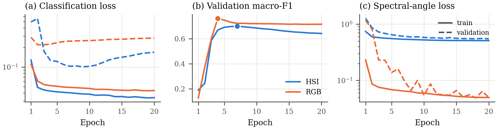
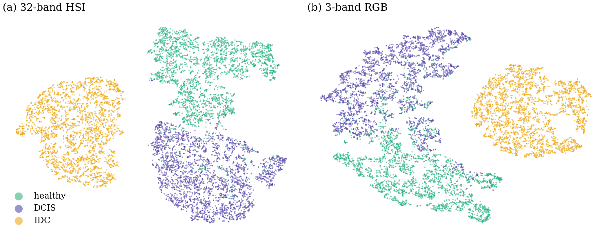

# Supplementary Material

**MedMamba-SS and MedMamba-SS-TRM: Band-Count-Agnostic Spectral–Spatial Architectures for Medical Image Classification with a Weight-Shared Recursive Backbone**

Sections, tables and figures here are numbered S-A, S1, … and are cited from the main text.

## S-A. Training Configuration

**TABLE S1**
**Training Configuration of MedMamba-SS-TRM**

| Group | Setting |
| --- | --- |
| Architecture | Width 128; 2 core blocks; $n = 6$, $T = 3$, $N_{\text{sup}} = 3$ ($K = 63$); depthwise-convolution mixer with GEGLU channel MLP; two carried states; core gradient checkpointing; halting off; drop-path 0; core dropout 0; classifier dropout 0.1 |
| Spectral pathway | $d_t = 32$; $d_{\text{ctx}} = 64$; three residual spectral blocks and one spectral scan (state 8); soft band gate; compressor 128 → 64 → 64; concat-MLP tokenizer, value initialization s.d. 0.5; spectral positional gain 0.1; wavelength encoding with $\eta = C$ over the band range of the input; chunk size 1,024; spectral checkpointing for $C \geq 16$ |
| Stem and head | Scale-invariant RMS normalization of the context; linear projection with layer normalization; 2-D positional gain 0.1; fan-in classifier initialization |
| Optimization | AdamW, $3 \times 10^{-4}$, weight decay 0.05 (not on norms and biases); batch 256; bf16; clipping at 1.0; 587 warmup steps into cosine decay over 19,560 steps (12-epoch ablations: 352 and 11,736); EMA 0.9995; graph compilation |
| Loss | Focal, $\gamma = 1.5$, class-weight exponent 0.75, mean over three segments; reconstruction decoder on the answer state, $\lambda_{\text{mse}} = \lambda_{\text{sam}} = 0.1$, linear output |
| Data | Per-band z-score fitted over the training split; random 10.2 % training subset per epoch (250,113 patches); fixed patient-stratified 9.86 % validation subset (32,985); horizontal and vertical flips and 90° rotations (each with probability 0.5), random crop of up to 30 % per side resized back (nearest neighbour), additive Gaussian noise (s.d. 0.02), per-band gain factor uniform in [0.85, 1.15] and per-band offset (s.d. 0.05); no sampler |
| Patient split | Seed 42, stratified by each patient's rarest class. Training: 15, 19, 20, 25, 38, 40, 43, 45, 47, 51, 52, 57, 62, 70, 80, 82, 84, 85, 90, 100, 107, 138, 139, 146, 151, 152, 153, 162, 189, 205, 211, 255, 259, 269, 270. Validation: 65, 68, 197, 238, 304. Test: 136, 141, 154, 213, 229 (collection patient numbers) |
| Selection | Validation macro-F1 on EMA weights; early-stopping patience 40 epochs (never reached); seeds 1, 7, 13, 23, 42 |

## S-B. Implementation Safeguards

The failure modes in Table S2 degrade the accuracy of models built on the spectral pathway or the recursive core without raising an error. The reported configuration contains a remedy for each, and the representation-sensitivity and reconstruction-gradient gates of Section V-C abort a run in which the first or the last of them recurs.

**TABLE S2**
**Silent Failure Modes and Their Remedies**

| Failure mode | Mechanism and measurement | Remedy |
| --- | --- | --- |
| Representation collapse | A linear value embedding initialized at s.d. 0.02 produced tokens of magnitude ≈ 0.006 beside a positional encoding of ≈ 0.55, so the band values were 86–93× smaller than a term that is constant for a given sensor; stem sensitivity measured 0.0018 (HSI) and 0.0029 (RGB) in diagnostic runs. The same defect arises in the recursive model's 2-D encoding and the classifier's initialization. | Concat-MLP tokenizer (7), value initialization s.d. 0.5, positional gains 0.1, fan-in classifier initialization; sensitivity gate (stem sensitivity ≈ 0.5 against a floor of 0.05) |
| Normalization below its $\epsilon$ | Initialization at s.d. 0.02, about 9× below fan-in scale, shrank activations through the pathway's successive projections. The context reached the stem at magnitude ≈ $5 \times 10^{-5}$, a mean square of ≈ $2.5 \times 10^{-9}$, orders of magnitude below the constants that layer normalization ($10^{-5}$) and a standard RMS normalization ($10^{-6}$) add to the mean square, so both become near-constant rescalings; a standard RMS normalization gives an output RMS of about 0.01 instead of 1 at input scale $10^{-5}$. | Scale-invariant RMS normalization $\rho$ in (12) and (18), output RMS 1.000 at any scale |
| Halting head without effect | With ACT enabled, the halting head's cross-entropy was about 20 % of the objective and stayed at ≈ 0.66 without decreasing for 33 epochs in a diagnostic run. | Halting disabled; when enabled, segments stop once every sample in the batch exceeds the halting threshold |
| Detached reconstruction | A decoder reading a detached feature map trains itself but cannot shape the representation. | Decoder reads the live answer state returned by the forward pass; reconstruction-gradient gate |

A linear value branch has a second, independent defect: at the tokenizer output every band value lies along one vector (Section IV-C). A layer normalization on the value branch does not fix it, because $\mathrm{LN}(v w) = \mathrm{LN}(w)$ for $v > 0$; the concat-MLP tokenizer does, and it keeps Proposition 1 intact because its weight shapes depend only on $d_t$.

## S-C. Additional Figures

These figures support Sections VI-B and VI-I of the main text.

*Fig. S1. Training dynamics at seed 42. (a) Training and validation classification loss (log scale). (b) Validation macro-F1; dots mark the selected checkpoints. (c) Training and validation spectral-angle loss.*

*Fig. S2. t-SNE of the pooled answer state of MedMamba-SS-TRM for 9,000 class-stratified test patches (seed 42). (a) 32-band model. (b) 3-band model.*

Reference numbers refer to the main manuscript.
