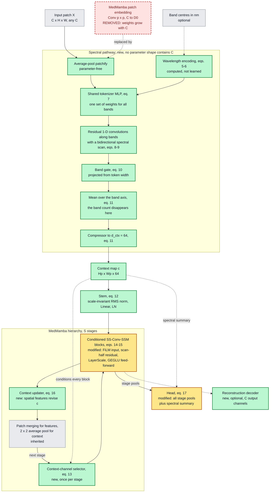
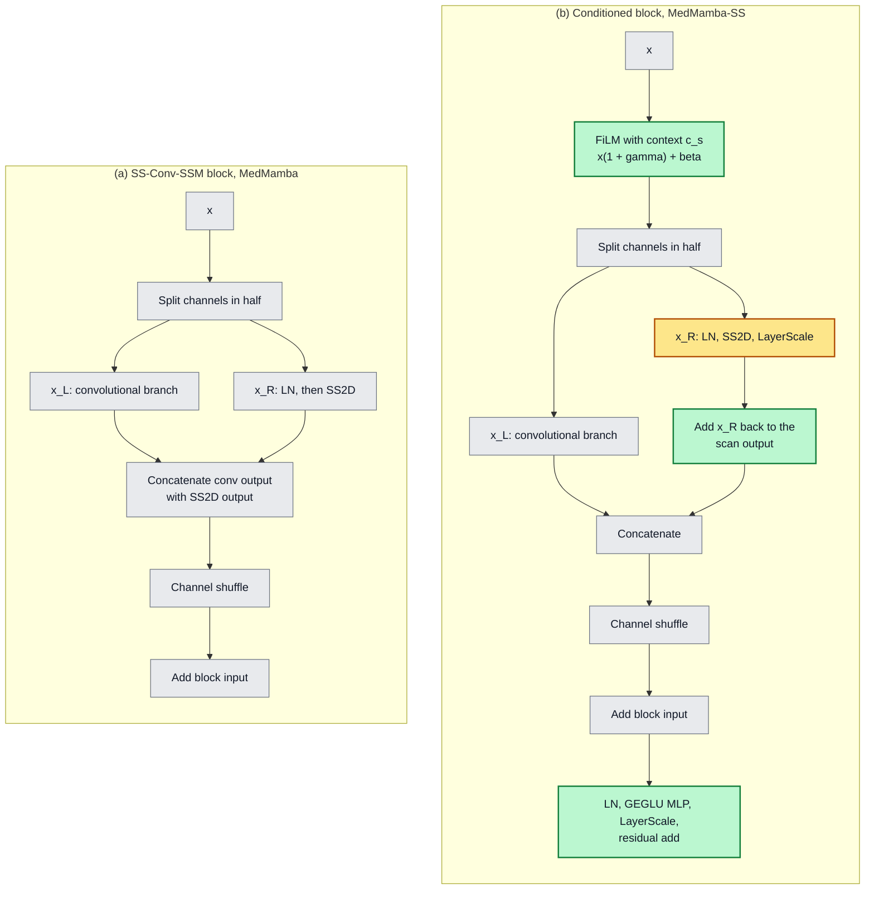
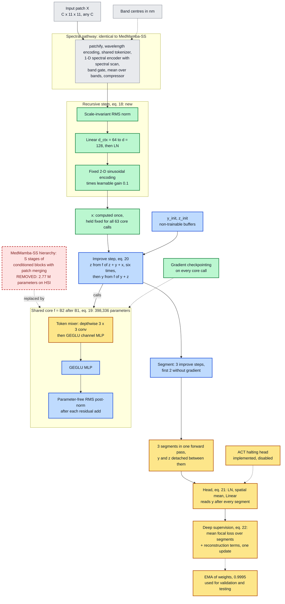
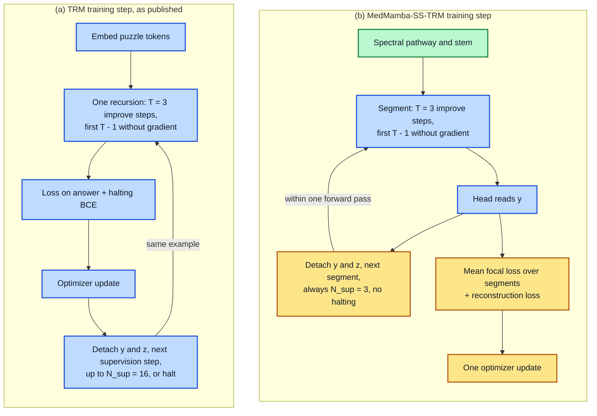

---

## IV. Methodology

An input patch is $X \in \mathbb{R}^{C \times H \times W}$ with $C$ bands, optionally with band centres $\lambda \in \mathbb{R}^{C}$ in nanometres; the batch dimension is omitted. Both proposed models share one front end, the spectral pathway of Section IV-C, which maps $X$ to a context map $c \in \mathbb{R}^{H_p \times W_p \times d_{\text{ctx}}}$ whose shape contains no reference to $C$. The two base architectures are written out first so that each change can be stated against them. All architecture diagrams use one colour code: grey for components inherited unchanged, amber for inherited and modified, green for new, blue for taken from TRM as published, and red dashed outlines for components the extension removes.

### A. Baseline Architecture I: MedMamba

MedMamba [@medmamba] embeds the input with a strided convolution of kernel and stride $p$ followed by layer normalization,

$$E = \mathrm{LN}\!\left(W_e \ast_p X + b_e\right) \in \mathbb{R}^{\frac{H}{p} \times \frac{W}{p} \times D_0}, \qquad W_e \in \mathbb{R}^{D_0 \times C \times p \times p}, \tag{1}$$

so the embedding holds $p^2 C D_0 + 3 D_0$ parameters, linear in $C$. Four stages follow, separated by patch merging, which halves resolution and doubles width (MedMamba-T: widths 96, 192, 384, 768; depths 2, 2, 4, 2). An SS-Conv-SSM block with input $x$ computes

$$[x_L, x_R] = \mathrm{Split}(x), \quad u = \Phi(x_L), \quad s = \mathrm{DropPath}\big(\mathrm{SS2D}(\mathrm{LN}(x_R))\big), \tag{2}$$

$$x \leftarrow \mathrm{Shuffle}_2\big([u \,;\, s]\big) + x, \tag{3}$$

where $\mathrm{Split}$ halves the channels, $\Phi$ is a convolutional branch (two 3 × 3 and one 1 × 1 convolution with batch normalization and ReLU), SS2D is the four-direction selective scan [@vmamba] and $\mathrm{Shuffle}_2$ interleaves the two groups. The classifier reads the final stage only: $\hat{y} = W_h\,\mathrm{GAP}(x^{(S)}) + b_h$.

### B. Baseline Architecture II: The Tiny Recursive Model

TRM [@trm] applies one two-layer network $f$ to a latent state $z$ and an answer state $y$, given an embedded input $x$. One improvement step is

$$z \leftarrow f(x, y, z) \;\; (n \text{ times}), \qquad y \leftarrow f(y, z). \tag{4}$$

A recursion runs $T$ improvement steps, the first $T-1$ without gradient tracking, so memory does not grow with depth; with $n = 6$ and $T = 3$ the effective depth is $T(n+1) \times 2 = 42$ layers. Training uses deep supervision: each of up to $N_{\text{sup}} = 16$ supervision steps runs one recursion, computes a loss, takes an optimizer step and passes the detached states to the next step. A halting head trained with binary cross-entropy against "the current answer is correct" allows early stopping, and an exponential moving average (EMA) of the weights with decay 0.999 is used for evaluation.

### C. The Band-Count-Agnostic Spectral Pathway

The pathway maps each local spectrum to a context vector. Every operation either shares its weights across the band axis or has none.

**Patchification** is parameter-free average pooling: $\bar{X} = \mathrm{AvgPool}_p(X)$, and $v \in \mathbb{R}^C$ denotes the spectrum at one position.

**Spectral position.** Band centres are normalized to the unit interval by the sensor's extent (or a fixed reference range), and a sinusoidal basis is evaluated on the result:

$$\tilde{\lambda}_c = \frac{\lambda_c - \min_{c'} \lambda_{c'}}{\max_{c'} \lambda_{c'} - \min_{c'} \lambda_{c'}}, \tag{5}$$

$$\pi_c[2i] = \sin(\sigma \tilde{\lambda}_c \omega_i), \quad \pi_c[2i+1] = \cos(\sigma \tilde{\lambda}_c \omega_i), \quad \omega_i = 10000^{-2i/d_t}, \quad \sigma = C. \tag{6}$$

With $\sigma = C$ the encoding equals a standard index encoding for evenly spaced bands and departs from it where spacing is irregular, as at the 219 nm gap of our sensor. Without band centres, $\tilde{\lambda}_c = c/(C-1)$.

**Tokenization.** One two-layer MLP, shared by all bands, lifts each band value together with its encoding to a token of width $d_t$:

$$t_c = W_2\, \mathrm{GELU}\big(W_1 [v_c \,;\, \pi_c] + b_1\big) + b_2 + g_s \pi_c, \qquad W_1 \in \mathbb{R}^{2d_t \times (1+d_t)},\; W_2 \in \mathbb{R}^{d_t \times 2d_t}. \tag{7}$$

A linear map $v_c \mapsto v_c w$ would also be shape-independent, but every token would then be a multiple of one vector and averaging over bands would reduce a spectrum to a scalar; the nonlinearity gives each band its own response direction.

**Spectral encoding.** Tokens $T \in \mathbb{R}^{C \times d_t}$ pass through residual one-dimensional convolution blocks along the band axis and, after the first block, a bidirectional selective scan [@mamba] along the bands:

$$T \leftarrow T + W_r\, \mathrm{GELU}\big(\mathrm{Conv1d}_3(\mathrm{LN}(T))\big), \tag{8}$$

$$[U \,;\, Z] = \mathrm{LN}(T) W_{\text{in}}, \quad T \leftarrow T + \Big(\mathrm{LN}\big(\alpha_1 \mathrm{SSM}(U) + \alpha_2 \mathrm{Flip}(\mathrm{SSM}(\mathrm{Flip}(U)))\big) \odot \mathrm{SiLU}(Z)\Big) W_{\text{out}}, \tag{9}$$

with $\alpha = \mathrm{softmax}(a)$. Convolution kernels and scan parameters are shared along the sequence, so they cost the same whether the sequence has 3 bands or 32.

**Gating, pooling and compression.** A gate projected from each token weights the bands; the tokens are averaged over the band axis and compressed by three linear layers with GELU ($d_t \to 128 \to 64 \to d_{\text{ctx}}$):

$$a_c = \sigma\big(w_g^{\top} t_c + b_g\big), \quad t_c \leftarrow a_c t_c, \tag{10}$$

$$c_{ij} = \Psi\Big(\tfrac{1}{C}\textstyle\sum_{c} t_c\Big) \in \mathbb{R}^{d_{\text{ctx}}}. \tag{11}$$

The mean in (11) is where the band axis disappears. We use $d_t = 32$ and $d_{\text{ctx}} = 64$.

> **Proposition 1.** *Every parameter tensor in (5)–(11) has a shape determined by $d_t$, $d_{\text{ctx}}$, the kernel width, the scan state size and the compressor widths, and not by $C$; every module after (11) receives inputs whose shape does not contain $C$. The parameter count of any model built on the pathway is therefore the same at every band count.*

*Proof.* (5) and (6) have no parameters. The MLP of (7) is applied to each band with shared weights of shapes $2d_t \times (1 + d_t)$ and $d_t \times 2d_t$. The kernel of (8) has shape $d_t \times d_t \times 3$ and slides along the bands; the scan of (9) shares its parameters along the sequence. The gate of (10) is a $1 \times d_t$ projection applied to every band. The mean in (11) has no parameters and removes the band axis. $\blacksquare$

Table {{T:specparams}} gives the count. For contrast, MedMamba's embedding (1) at $p = 4$ and $D_0 = 96$ holds $1{,}536C + 288$ parameters: 4,896 at $C = 3$ and 49,440 at $C = 32$.

**TABLE {{T:specparams}}**
**Parameters of the Spectral Pathway ($d_t = 32$, $d_{\text{ctx}} = 64$)**

| Component | Eq. | As a function of width | Count |
| --- | --- | --- | ---: |
| Tokenizer | (7) | $4d_t^2 + 5d_t + 1$ | 4,257 |
| Spectral encoder (three blocks, one scan, norms) | (8)–(9) | depends on $d_t$, kernel, state size | 17,794 |
| Band gate | (10) | $d_t + 1$ | 33 |
| Compressor | (11) | $128 d_t + 65 d_{\text{ctx}} + 8{,}384$ | 16,640 |
| **Total** | | **no term in $C$** | **38,724** |

### D. MedMamba-SS

MedMamba-SS keeps the MedMamba hierarchy and changes what enters it and how each stage sees the spectrum (Figs. {{F:ss}} and {{F:block}}).

**Stem.** The convolutional embedding (1) is removed; the first stage receives a linear projection of the context map,

$$F^{(1)} = \mathrm{LN}\big(W_s\, \rho(c) + b_s\big), \qquad \rho(c) = c / \mathrm{RMS}(c), \tag{12}$$

where $\rho$ is a parameter-free, scale-invariant RMS normalization. Normalizing by the RMS itself, with no additive $\epsilon$, keeps the stem responsive when the context map is small in magnitude (Appendix A).

**Per-stage conditioning.** At stage $s$ the context map, resized to the stage resolution, is re-weighted by a squeeze-and-excitation gate [@se] and modulates every block through FiLM [@film], initialized to the identity:

$$c_s \leftarrow c_s \odot \sigma\big(W_{b,2}\,\mathrm{GELU}(W_{b,1}\,\mathrm{GAP}(c_s))\big), \tag{13}$$

$$\tilde{x} = x \odot (1 + \gamma) + \beta, \qquad [\gamma \,;\, \beta] = W_f c_s + b_f, \quad W_f = 0,\ b_f = 0 \text{ at initialization}. \tag{14}$$

The conditioned block adds the scan half back to its scan output, scales both residual branches with LayerScale ($\mathrm{LS}$, initialized at $10^{-4}$) and ends with a GEGLU feed-forward sublayer $G$ [@glu]:

$$[x_L, x_R] = \mathrm{Split}(\tilde{x}),\;\; s = \mathrm{LS}(\mathrm{SS2D}(\mathrm{LN}(x_R))),\;\; x \leftarrow \mathrm{Shuffle}_2\big([\Phi(x_L) \,;\, x_R + s]\big) + x,\;\; x \leftarrow x + \mathrm{LS}(G(\mathrm{LN}(x))). \tag{15}$$

After the stage's blocks the spatial features revise the context for the next stage, making the interaction bidirectional:

$$c_s \leftarrow \mathrm{LN}\big(c_s + \sigma(W_g c_s) \odot W_u F^{(s)}\big). \tag{16}$$

**Head.** The classifier reads every stage and a spectral summary:

$$\hat{y} = \mathrm{MLP}\Big(\mathrm{LN}\big[\mathrm{GAP}(F^{(1)}) ; \ldots ; \mathrm{GAP}(F^{(S)}) ; \mathrm{GAP}(c_S)\big]\Big). \tag{17}$$

The RGB configuration uses MedMamba-T's layout with $p = 4$ ($p = 8$ for 224 × 224 images; 27,425,314 parameters, six classes). For 11 × 11 hyperspectral patches, $p = 1$ and three stages of widths 64, 128, 256 (2,773,007 parameters, three classes).



*Fig. {{F:ss}}. MedMamba-SS. The convolutional patch embedding of MedMamba (red, dashed) is replaced by the spectral pathway and a linear stem. Dashed arrows carry conditioning rather than features.*



*Fig. {{F:block}}. (a) MedMamba's SS-Conv-SSM block, eqs. (2)–(3). (b) The conditioned block of MedMamba-SS, eqs. (14)–(15).*

**What changes relative to MedMamba.** *Replaced:* the convolutional embedding (1), by parameter-free patchification, the spectral pathway (5)–(11) and a linear stem (12); this removes $C$ from every parameter shape. *Added:* the context-channel selector (13), FiLM conditioning (14), the context updater (16), a GEGLU sublayer per block and an optional reconstruction decoder. *Modified:* the block adds $x_R$ back to its scan output and uses LayerScale (15); the head reads all stages and the spectral summary (17). *Unchanged:* the channel split, the convolutional branch $\Phi$, SS2D, the shuffle, the outer residual and patch merging.

### E. MedMamba-SS-TRM

MedMamba-SS-TRM keeps one core at one width $d = 128$ and applies it many times; the spectral pathway is used unchanged (Fig. {{F:trm}}).

**Stem and states.** The context map is normalized as in (12), projected to width $d$, normalized, and given a fixed two-dimensional sinusoidal encoding $P$ scaled by a learnable gain $g_p$ (initialized at 0.1):

$$x = \mathrm{LN}\big(W_s\, \rho(c) + b_s\big) + g_p P. \tag{18}$$

The embedding $x$ is computed once and held fixed through the recursion. The answer state $y$ and latent state $z$ start from broadcast non-trainable buffers, as in TRM.

**Core.** The core $f = B_2 \circ B_1$ has two blocks, each a token mixer and a GEGLU MLP under parameter-free RMS post-normalization [@rmsnorm]:

$$h' = \mathrm{RMS}\big(h + M(h)\big), \quad B(h) = \mathrm{RMS}\big(h' + G(h')\big), \quad M(h) = G_m\big(\mathrm{DWConv}_{3\times3}(h)\big). \tag{19}$$

The mixer $M$ is a depthwise 3 × 3 convolution followed by a channel MLP; SS2D and self-attention are implemented alternatives.

**Recursion and head.** The improvement step instantiates (4) with additive input injection, and the classifier reads the answer state after every segment:

$$z \leftarrow f(z + y + x)\ \ (n \text{ times}), \qquad y \leftarrow f(y + z), \tag{20}$$

$$\ell_s = W_c\, \mathrm{GAP}\big(\mathrm{LN}(y^{(s)})\big) + b_c, \qquad s = 1, \ldots, N_{\text{sup}}. \tag{21}$$

**Objective.** All $N_{\text{sup}} = 3$ segments run inside one forward pass; the per-segment losses are averaged and added to a reconstruction loss, and one optimizer update is taken per batch:

$$\mathcal{L} = \frac{1}{N_{\text{sup}}} \sum_{s=1}^{N_{\text{sup}}} \mathcal{L}_{\text{FL}}(\ell_s, k) + \lambda_{\text{mse}} \lVert \hat{X} - X \rVert_2^2 + \lambda_{\text{sam}}\, \mathrm{SAM}(\hat{X}, X), \tag{22}$$

where $k$ is the label, $\mathcal{L}_{\text{FL}}$ is the class-weighted focal loss of Section V-A, $\hat{X}$ is the output of a three-layer convolutional decoder reading the final answer state, SAM is the spectral angle (28), and $\lambda_{\text{mse}} = \lambda_{\text{sam}} = 0.1$. Validation and testing use an EMA of the weights (decay 0.9995), and every gradient-carrying core call is gradient-checkpointed [@checkpoint]. Algorithm 1 gives the schedule; with $n = 6$, $T = 3$ and $N_{\text{sup}} = 3$ the core is applied $K = N_{\text{sup}} T (n+1) = 63$ times per forward pass, at inference as well as in training.

> **Algorithm 1: MedMamba-SS-TRM forward pass**
>
> ```
> c    <- SpectralPathway(X, lambda)              # eqs. 5-11
> x    <- Stem(c)                                 # eq. 18, held fixed
> y, z <- y_init, z_init                          # buffers
> for s <- 1 to N_sup = 3:
>     repeat T - 1 = 2 times, without gradient:
>         (y, z) <- Improve(x, y, z)
>     (y, z) <- Improve(x, y, z)                  # carries gradient
>     l_s <- Head(y)                              # eq. 21
>     y, z <- detach(y), detach(z)
> return l_1 ... l_N_sup                          # inference uses l_N_sup
>
> Improve(x, y, z):  repeat n = 6 times: z <- f(z + y + x);  y <- f(y + z)
> ```

**TABLE {{T:trmparams}}**
**Parameters of MedMamba-SS-TRM ($d = 128$, $L = 2$ Core Blocks, Three Classes)**

| Component | Eq. | As a function of width | Count | Share |
| --- | --- | --- | ---: | ---: |
| Spectral pathway | (5)–(11) | Table {{T:specparams}} | 38,724 | 8.7 % |
| Stem and positional gain | (18) | $d_{\text{ctx}} d + 3d + 1$ | 8,577 | 1.9 % |
| Shared core | (19) | $L(12d^2 + 20d)$ | 398,336 | 89.2 % |
| Classifier and halting head | (21) | $2d + (d+1)(K_{\text{cls}} + 1)$ | 772 | 0.2 % |
| **Total** | | **no term in $C$** | **446,409** | |



*Fig. {{F:trm}}. MedMamba-SS-TRM. Grey: carried over from MedMamba-SS. Blue: from TRM as published. Amber: from TRM, modified. Green: new. Red, dashed: the hierarchy this model removes.*



*Fig. {{F:trmcompare}}. Deep supervision in TRM and in MedMamba-SS-TRM.*

**What changes relative to TRM.** The two-state recursion, the improvement step, the gradient-free prelude, the detach between segments, buffer state initialization, deep supervision and EMA are used as published, and the per-segment effective depth (42 block applications) equals TRM's. Seven things differ: (i) the input is a spectral context map with a 2-D encoding and learnable gain (18); (ii) the mixer is a depthwise convolution with a channel MLP, attention-free like TRM's variant for small grids, because at an 11 × 11 working size the SS2D mixer is 39× slower (Section V-C); (iii) the width is 128; (iv) three segments share one forward pass and one optimizer update (Fig. {{F:trmcompare}}); (v) the EMA decay is 0.9995; (vi) halting is disabled, because the halting head does not learn on this task (Section VI-L); (vii) every gradient-carrying core call is checkpointed. The substitution is otherwise narrow: the recursive backbone returns the same outputs as the hierarchical one, so heads and the reconstruction decoder attach unchanged, and one configuration serves 11 × 11 × 3 and 11 × 11 × 32 input without any change.

### F. Cost Model

Weight sharing decouples parameters from arithmetic. The core's parameters, $L(12d^2 + 20d)$, do not depend on $K$; its arithmetic grows linearly:

$$\mathcal{F}(K) = \mathcal{F}_0 + K \mathcal{F}_f, \qquad \mathcal{F}_f = 2 N_{\text{tok}} L \big(12 d^2 + 9 d\big), \tag{23}$$

where $12d^2$ counts the multiply–accumulates per token of the two GEGLU MLPs in a block, $9d$ the depthwise convolution, and $N_{\text{tok}} = H_p W_p$. For 11 × 11 patches, $L = 2$ and $d = 128$, (23) gives $\mathcal{F}_f = 95.72$ MFLOPs per application, so the 63 applications alone cost 6.03 GFLOPs, whereas the whole hierarchical MedMamba-SS costs 0.278 GFLOPs on the same input.
