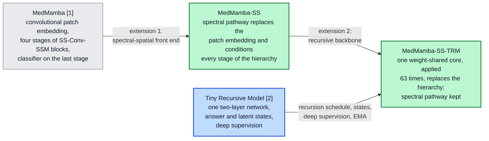

# MedMamba-SS and MedMamba-SS-TRM: Band-Count-Agnostic Spectral–Spatial Architectures for Medical Image Classification with a Weight-Shared Recursive Backbone

**Gabriel M. Del Valle Lopez**
Department of Computer Science

---

***Abstract*—MedMamba classifies medical images with blocks that split their channels between a convolution and a two-dimensional selective scan, but its first layer holds one weight per input channel, so it reads a spectrum as unordered channels fixed in number by the sensor. We extend it in two steps. MedMamba-SS replaces the patch embedding with a spectral pathway in which no parameter depends on the number of bands (a wavelength-encoded tokenizer shared across bands, a spectral selective scan and pooling over bands) and conditions every stage of the hierarchy on its output. MedMamba-SS-TRM replaces the hierarchy with one two-layer core applied recursively, following the Tiny Recursive Model. On hyperspectral breast histology from 45 patients, the 32-band and 3-band MedMamba-SS-TRM have exactly 446,409 parameters and retraining at eight bands keeps 97 % of macro-F1, but a trained model does not transfer to fewer bands, and MedMamba-SS stayed at chance on hyperspectral patches. On the five test patients MedMamba-SS-TRM reaches 92.8 ± 1.9 % balanced accuracy over five seeds, ahead of single-run MedMamba, HybridSN and SpectralFormer; pooled over ten held-out patients, HybridSN (87.1 %) and a six-feature RGB colour probe (86.5 %) lead it (84.5 %). The advantage of 32 over 3 bands is patient-dependent: +4.1 points on the test patients at five of five seeds, −5.8 on the validation patients, two-thirds of it from one patient, and −1.0 pooled. The recursive model is 6.2× smaller than the hierarchy it replaces but needs 22.3× more arithmetic, and 21 to 84 core applications give similar quality.**

***Index Terms*—Band-count agnosticism, explainability, hyperspectral imaging, MedMamba, medical image classification, recursive networks, state-space models, weight sharing.**

---

## I. Introduction

Distinguishing ductal carcinoma *in situ* (DCIS) from invasive ductal carcinoma (IDC) and from healthy breast tissue is a routine histopathological decision made on morphology. Hyperspectral imaging (HSI) adds a physically different measurement: each pixel carries a spectrum of tens to hundreds of narrow bands instead of three integrated colour values, and absorption in stained tissue depends on its molecular composition. A classifier that exploits this must read the spectral axis as an ordered physical quantity, and, because instruments sample different numbers of bands, it should not have to be redesigned for every sensor.

This work builds on two published architectures, and both of its contributions are extensions of them. **MedMamba** [@medmamba] brought selective state-space models to medical image classification. Its SS-Conv-SSM block splits the channels between a convolutional branch for local detail and a two-dimensional selective scan for long-range context at a cost linear in the number of positions, and a four-stage hierarchy of these blocks was evaluated on sixteen datasets covering ten imaging modalities. As published, it is a poor fit for hyperspectral input in two respects: its first layer is a strided convolution with a weight for every input channel, so its parameter count is tied to the sensor, and band order and wavelength are invisible to it. The **Tiny Recursive Model** (TRM) [@trm] showed that a single two-layer network, applied recursively to an answer state and a latent state, can outperform networks with several times its parameters on reasoning puzzles, decoupling effective depth from stored parameters. Its original evaluation uses small grids with exact answers and reports parameters and accuracy but not arithmetic cost.

We extend these models in two steps, each of which substitutes one component (Fig. {{F:lineage}}). **MedMamba-SS** (spectral–spatial) replaces MedMamba's convolutional patch embedding with a spectral pathway in which no parameter shape depends on the number of bands, and conditions every stage of the inherited hierarchy on that pathway's output; the SS-Conv-SSM blocks, patch merging and stage layout are kept. **MedMamba-SS-TRM** then replaces the hierarchy with one weight-shared two-layer core applied recursively under TRM's schedule, and keeps the spectral pathway and the task interface unchanged. The first substitution addresses the sensor: a band-count-agnostic front end lets one architecture, with one parameter count, serve 3-band and 32-band input. Channel-adaptive models with this property exist for microscopy, remote sensing and natural images [@channelvit], [@dofa], [@batformer]; we build one into MedMamba and evaluate it on medical hyperspectral data. The second substitution addresses scale: hyperspectral cohorts are small and pixel-level annotations scarce [@hsi_review], [@hsi_melanoma], and if depth can come from reusing weights instead of storing them, the model can be several times smaller. Whether a smaller model of this kind also generalizes better from a small cohort is not tested here.

*Fig. {{F:lineage}}. The two base models (grey, blue) and the two proposed models (green). Each proposed model differs from its predecessor by one substitution; Sections IV-D and IV-E give the component-level changes.*

Three questions organize the evaluation. The first is whether hyperspectral input improves classification over an RGB rendering of the same captures when the model, the training recipe, the patient split and the patch locations are held fixed. The second is whether a model derived from MedMamba can be made independent of the number of bands, both in its parameters and in its behaviour when the band count changes. The third is whether one recursively applied core can replace a hierarchical backbone, at what computational cost, and with what benefit from recursion depth.

The main contributions of this work are the two models:

1. **MedMamba-SS**, a spectral–spatial extension of MedMamba (Section IV-D). A band-count-agnostic spectral pathway replaces the patch embedding, and FiLM conditioning [@film], per-stage context selection and a context updater feed its output into every stage of the SS-Conv-SSM hierarchy. No parameter of the pathway depends on the band count (Proposition 1), and we verify the resulting equality exactly on the recursive model, which shares the pathway: its 32-band and 3-band instances have identically 446,409 parameters. Measured inside MedMamba-SS-TRM, the pathway retrains at eight bands with 97 % of its 32-band macro-F1, and its band gate peaks in the 535–633 nm range where the class-mean spectra differ most. The hierarchical MedMamba-SS itself trains on whole-image skin-lesion photographs, where it has the highest accuracy, Cohen's κ and ROC-AUC of the three models compared, but on hyperspectral patches it stays at chance under the recipe used for the recursive model, for a reason we have not identified (Section VI-E).

2. **MedMamba-SS-TRM**, which replaces the hierarchy with one weight-shared core applied 63 times per forward pass (Section IV-E) and has 6.2× fewer parameters than MedMamba-SS on the hyperspectral task. On the five test patients it has the highest balanced accuracy of the models compared at four of five seeds (92.8 ± 1.9 %, against single-seed baselines). Pooled over all ten held-out patients, HybridSN and two linear probes are more accurate, and it is ahead of its base architecture, MedMamba, by 1.5 points at seed 42 under a different training recipe. An analytic cost model reproduces the measured arithmetic of each core application (95.72 MFLOPs) and makes explicit that a weight-shared recursive model trades storage for compute.

Three supporting steps make these contributions measurable: a paired hyperspectral/RGB data preparation that samples both modalities at the same patch coordinates of the same captures (Section III-B); an evaluation over all ten non-training patients with a per-patient analysis and patient-level bootstrap intervals, needed because each five-patient held-out set contains DCIS from a single patient (Sections V-E and VI-C); and four implementation safeguards without which the spectral pathway fails to train, silently (Appendix A). Explainability and reconstruction analyses (Sections VI-I and VI-J) show which wavelengths the spectral pathway weights and what its representation retains.

Section II reviews related work and identifies the gaps this paper addresses. Section III describes the datasets, Section IV the base models and the two extensions, Section V the experimental setup and Section VI the results. Section VII concludes and states the limitations.

---

## II. Literature Review

### A. Convolutional and Transformer Classifiers

Residual convolutional networks made deep models trainable and remain strong baselines [@resnet], [@convnext]; Vision Transformers relate all patch tokens through self-attention at quadratic cost [@vit], and Swin restores a hierarchy with shifted windows [@swin]. In both families the first layer treats input channels as an unordered set.

### B. State-Space Models and MedMamba

Mamba made state-space parameters input-dependent, giving a sequence model with near-linear cost [@mamba]. Vision Mamba [@vim] and VMamba [@vmamba] extended it to images; VMamba's two-dimensional selective scan (SS2D) traverses a feature map in four directions. MedMamba [@medmamba] combined SS2D with a convolutional branch in the SS-Conv-SSM block and evaluated it on sixteen medical datasets covering ten modalities. It is the base architecture of both models in this paper. State-space models have since been applied to the spectral axis of hyperspectral images: the BiSpectral Mamba module of [@crop_mamba] models hyperspectral feature maps as token sequences in both directions for crop-field classification, and MelanoSpec-SSM makes patient-level diagnoses of melanoma against pigmented nevus from hyperspectral pathology images (100 patients, 125 bands between 400 and 1000 nm) with a spectral–spatial state-space model [@melanospec].

### C. Recursive and Weight-Shared Networks

Universal Transformers [@ut], ALBERT [@albert] and deep equilibrium models [@deq] reuse one block in place of many, and Adaptive Computation Time [@act] learns when to stop. TRM [@trm] simplifies the Hierarchical Reasoning Model (HRM) [@hrm] to one two-layer network with two carried states and deep supervision, and with 5–7 M parameters it improves on HRM's 27 M on Sudoku-Extreme (87.4 % against 55.0 %), Maze-Hard and ARC-AGI. Its benchmarks are small grids with exact answers, and it reports parameters and accuracy but not arithmetic. It is the source of the recursion in MedMamba-SS-TRM.

### D. Hyperspectral Image Classification

HybridSN combines 3-D and 2-D convolutions over hyperspectral patches [@hybridsn], and SpectralFormer embeds groups of neighbouring bands as Transformer tokens [@spectralformer]; both have parameters whose shape depends on the band count, and both were evaluated on remote-sensing scenes with training and test pixels drawn from the same scene. Recent designs encode spectra compactly or reduce them first: QuantFormer uses a variational quantum circuit as a spectral token encoder inside a Vision Transformer and stays competitive with 3-D CNNs at about 35,000 parameters [@quantformer], and PatchGraph-MTFormer applies graph-restricted Transformer attention within hyperspectral patches after reducing the spectrum with principal component analysis (PCA) [@patchgraph]. PCA maps any band count to a fixed number of components, but the components are fitted to one sensor's data and carry no wavelength meaning. Medical hyperspectral imaging is a smaller literature [@hsi_review], in which annotations are scarce, which has motivated label-efficient methods such as SLIC-derived pseudo-labels for hyperspectral melanoma segmentation [@hsi_melanoma]. In histopathology, Ortega et al. compared hyperspectral input with RGB images synthesized from the same cubes, using one convolutional network and patient-independent partitions, and found hyperspectral input more accurate for glioblastoma on H&E slides [@ortega].

### E. Band-Count-Agnostic and Channel-Adaptive Models

A separate line of work removes the dependence on a fixed set of channels. ChannelViT builds patch tokens from each channel separately, adds a learnable embedding per channel, and trains with hierarchical channel sampling so that it remains accurate when only some channels are present at test time [@channelvit]. DOFA generates patch-embedding weights from each band's wavelength with a hypernetwork, so that one Vision Transformer accepts data from sensors with different numbers of bands [@dofa]. BAT-Former encodes each band separately with Transformer blocks and fuses the band embeddings, and one model serves RGB images and the HyperLeaf2024 hyperspectral dataset [@batformer]. Table {{T:related}} compares how these models, the hyperspectral classifiers of Section II-D, MedMamba and our models handle the band count.

**TABLE {{T:related}}**
**How Related Models Handle the Number of Bands $C$**

| Model | Handling of the band axis | Parameters depend on $C$ | Backbone cost grows with $C$ | Wavelength-aware | Evaluated on medical HSI, patient-disjoint, in the original publication |
| --- | --- | --- | --- | --- | --- |
| HybridSN [@hybridsn] | 3-D convolution over bands, then 2-D | Yes | Yes | No | No |
| SpectralFormer [@spectralformer] | Groups of neighbouring bands as tokens | Yes | Yes | No | No |
| MedMamba [@medmamba] | Strided convolution over all channels | Yes | No | No | No |
| ChannelViT [@channelvit] | One token per channel and patch; learned channel embeddings | Yes, one embedding per channel | Yes | No | No |
| DOFA [@dofa] | Hypernetwork generates embedding weights from wavelengths | No | No | Yes | No |
| BAT-Former [@batformer] | Each band encoded separately, band embeddings fused | Not stated | Yes | Not stated | No |
| **MedMamba-SS, MedMamba-SS-TRM** | Shared tokenizer, spectral convolution and scan, band gate, mean over bands | **No** (Proposition 1) | **No** | **Yes**, relative to the input's band range | **Yes** (this work) |

*Backbone: every layer after the band axis is removed. For HybridSN and SpectralFormer the band axis is never removed.*

The spectral pathway of Section IV-C differs from these designs in where and how the band axis is handled. Like DOFA, it encodes each band's wavelength and removes the band axis before the spatial backbone, so the backbone's cost does not grow with the band count; ChannelViT's backbone instead attends over $C$ times as many tokens, and BAT-Former runs its encoder once per band. Unlike DOFA's encoding, which depends on the wavelength alone, ours is normalized to the input's own wavelength range and scaled by the band count (Section IV-C), so the same wavelength is encoded differently when bands are removed. Unlike DOFA, whose generated embedding acts linearly on the band values, the pathway models the ordered band sequence nonlinearly, with a shared tokenizer, convolutions and a bidirectional scan along the bands, before pooling, and its band gate exposes which wavelengths it weights. None of the three channel-adaptive models was evaluated on medical hyperspectral data in its original publication, and we compare with them by design only: none is among our experimental baselines.

### F. Gaps Identified

1. **No representation of the spectral axis in MedMamba.** Band order is invisible to its first layer, and its parameters scale with the band count, so it cannot move between sensors without redesign.
2. **Band-count agnosticism untested on medical hyperspectral data.** HybridSN and SpectralFormer are sized for one band grid. Channel-adaptive models [@channelvit], [@dofa], [@batformer] remove that limit, but they were developed for microscopy, remote sensing and natural images; none was evaluated on medical hyperspectral data in its original publication or built into a medical state-space backbone, and in per-band token designs the backbone's cost grows with the band count.
3. **TRM's mechanism untested outside reasoning puzzles.** Weight-shared recursion has been used well beyond puzzles [@ut], [@albert], [@deq], but whether TRM's specific mechanism (two carried states, deep supervision, a learned halting head) and its depth benefit carry over to noisy medical classification is, to our knowledge, not reported, and TRM's original evaluation does not report its arithmetic cost.
4. **Hyperspectral versus RGB input in breast histology.** The comparison of Ortega et al. [@ortega] concerns brain tissue. For breast histology we repeat such a comparison with patch-level pairing of the two inputs, five seeds, two held-out patient sets and a per-patient analysis.

MedMamba-SS addresses the first two gaps and MedMamba-SS-TRM the third; the paired data preparation of Section III-B addresses the fourth.

---

## III. Datasets

### A. HistologyHSI-BC-Recurrence

The HistologyHSI-BC-Recurrence collection [@hsibc_data], [@hsibc_paper] contains hyperspectral captures, at 10× magnification, of haematoxylin-and-eosin (H&E) stained breast biopsy slides. We classify three tissue types: healthy, DCIS and IDC. The release used here holds 644 captures from 45 patients (the data descriptor reports 677 images from 47 patients [@hsibc_paper]); each capture has 740 bands, most are 600 × 1,004 pixels, and each carries one tissue label. We start from the collection's calibrated cubes, which the providers correct with white and dark references [@hsibc_paper]. Each capture is then multiplied by a gain that brings its median intensity (over 400 random pixels) to the median over all captures, clipped to [0.5, 2], and all cubes are divided by one global constant. The gain uses no labels, but its reference median is computed over all 644 captures.

The 45 patients are assigned to 35 training, 5 validation and 5 test patients at random (seed 42) within strata defined by each patient's rarest tissue class. Only seven patients have DCIS, so the stratification places five of them in training and one in each held-out set (Tables {{T:datasets}} and {{T:splitclass}}). Every capture is tiled into non-overlapping 11 × 11 patches, 4,914 per full-size capture, and every patch inherits its capture's label; no pixel-level mask is applied, so a patch can contain stroma or background from a capture labelled DCIS or IDC. The 2,452,086 training patches therefore come from 499 captures, and in each held-out set all DCIS patches come from five captures of a single patient (patient 197 in validation, patient 136 in test), so one third of balanced accuracy on either set is measured on one patient.

One preparation pass selects 32 of the 740 bands by importance. The selected band centres span 400.5–938.2 nm unevenly: eighteen lie at or below 633.3 nm and, after a 219.0 nm gap, fourteen lie between 852.3 and 938.2 nm. The gap comes from the selection, not from the sensor, which samples the whole range every 0.73 nm on average. A band's importance is the mean of its variance and its mutual information with the tissue label [@sklearn], each divided by its maximum over the 740 bands, computed on up to 2,000 random pixel spectra from each of 64 captures (10 % of all captures). Bands are taken in decreasing importance, skipping any that lies within eight bands of a band already taken or correlates with one above 0.95, until 32 are kept; the last band taken ranks 445th. Importance is lowest between about 640 and 850 nm (mean 0.19 over 700–800 nm against 0.56 over 400–500 nm, minimum at 744.6 nm). Of the 300 bands in the gap, 283 rank lower than 445th and were never reached; the other 17 (634.0–646.4 nm) were skipped, seven for lying within eight bands of the 633.3 nm band and ten for correlation. The 64 captures were drawn from the whole collection before the split was applied: 48 come from training patients, 8 from validation patients and 8 from test patients, so tissue labels of held-out patients entered the selection of the input bands. The patient-disjoint split therefore covers model training and the z-score statistics of Section V-C, but not band selection; Section VII discusses the consequences. Fig. {{F:dataset}}(a) shows that the class-mean spectra differ most between 535 and 633 nm, where healthy tissue reflects more than DCIS and IDC, and that DCIS and IDC are close throughout.

**TABLE {{T:datasets}}**
**Properties of the Two Datasets**

| | HistologyHSI-BC-Recurrence | PAD-UFES-20 |
| --- | --- | --- |
| Modality | Hyperspectral (32 of 740 bands, 400.5–938.2 nm) and paired synthetic RGB | Smartphone RGB photographs |
| Classes | healthy, DCIS, IDC | BCC, ACK, NEV, SEK, SCC, MEL |
| Sample | 11 × 11 patch | 224 × 224 image |
| Patients (train / val / test) | 35 / 5 / 5 | 1,373 in total, patient-disjoint 70/15/15 |
| Samples (train / val / test) | 2,452,086 / 334,516 / 348,894 | 1,626 / 328 / 344 |
| Class counts, train | 722,358 / 122,850 / 1,606,878 | 613 / 508 / 172 / 158 / 136 / 39 |
| Class counts, test | 83,538 / 24,570 / 240,786 | 119 / 114 / 36 / 40 / 28 / 7 |
| Largest : smallest class, train | 13.1 : 1 | 15.7 : 1 |

**TABLE {{T:splitclass}}**
**HistologyHSI-BC-Recurrence: Patients / Captures / Patches per Class and Split**

| Split | Healthy | DCIS | IDC | All |
| --- | ---: | ---: | ---: | ---: |
| Training | 30 / 147 / 722,358 | 5 / 25 / 122,850 | 34 / 327 / 1,606,878 | 35 / 499 / 2,452,086 |
| Validation | 4 / 20 / 98,280 | 1 / 5 / 24,570 | 5 / 49 / 211,666 | 5 / 74 / 334,516 |
| Test | 4 / 17 / 83,538 | 1 / 5 / 24,570 | 5 / 49 / 240,786 | 5 / 71 / 348,894 |

*A patient appears in the column of every tissue type it has. Full-size captures give 4,914 patches; ten validation captures are smaller (2,002 patches).*

*Fig. {{F:dataset}}. HistologyHSI-BC-Recurrence. (a) Class-mean reflectance over the 32 selected bands, 30,000 training patches; no line is drawn across the 219 nm gap, where no band was selected. (b) One test patch per class as a hyperspectral composite (633, 562 and 463 nm) and as the paired synthetic RGB patch.*

### B. Paired Hyperspectral and RGB Builds

A modality comparison is informative only if the two arms differ as little as possible. The preparation therefore writes two builds from the same captures, paired at the patch level: the RGB image is sampled at the *same patch coordinates* as the cube, and the patient and capture identifiers are identical in both builds. Each capture folder ships two RGB images: a synthetic rendering computed from the cube by the collection's software [@hsibc_paper], aligned with it in all 644 captures, and a frame from a separate wide-field camera whose field of view differs in 228 captures. We use the synthetic rendering throughout. The two arms still differ in more than the number of channels. The RGB arm is an 8-bit rendering computed from the full cube, whereas the hyperspectral arm is floating-point reflectance at 32 bands selected with label information (Section III-A); and the auxiliary reconstruction target of MedMamba-SS-TRM (Section IV-E) has 3 channels in one arm and 32 in the other. We call the arms 32-band and 3-band for brevity; the 3-band arm is not a subset of the 32 bands.

### C. PAD-UFES-20

PAD-UFES-20 [@pad], [@pad_data] contains 2,298 smartphone photographs of skin lesions from 1,373 patients in six classes, with melanoma at 2.3 %. It is one of the datasets on which MedMamba is compared with other published models, and we use it to test both proposed models on a second modality under a patient-disjoint split (the published MedMamba results use an image-level split, which allows photographs of the same patient or lesion to fall in both training and test).

---

