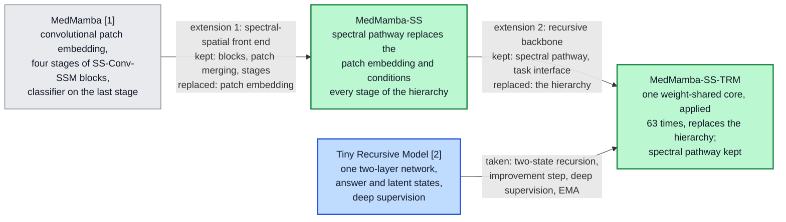

# MedMamba-SS and MedMamba-SS-TRM: Band-Count-Agnostic Spectral–Spatial Architectures for Medical Image Classification with a Weight-Shared Recursive Backbone

**Gabriel M. Del Valle Lopez**
Department of Computer Science

*Note on naming: MedMamba-SS-TRM records the model's lineage. Its spectral pathway, which contains its selective state-space scan, and its task interface come from MedMamba-SS, a spectral–spatial extension of MedMamba. In the reported configuration its recursive core mixes space with depthwise convolutions, not with MedMamba's two-dimensional selective scan (Section IV-E).*

---

***Abstract*—Hyperspectral images carry many narrow bands, but MedMamba, a state-space medical image classifier, embeds its input with a convolution sized by the channel count, blind to wavelength. We extend it twice. MedMamba-SS replaces its patch embedding with a spectral pathway, a wavelength-encoded tokenizer shared across bands, a bidirectional spectral selective scan and band pooling, whose parameters do not depend on the band count, and conditions every stage of the hierarchy on it. MedMamba-SS-TRM replaces that hierarchy with one two-layer core applied recursively, following the Tiny Recursive Model. On breast histology from 45 patients, MedMamba-SS-TRM has 446,409 parameters at both 32 and 3 bands; retrained at eight bands, it keeps 96 % of its balanced accuracy (one run); one checkpoint, tested post hoc, transfers zero-shot to 16 bands (90.9 %) with its encoding scale held fixed. On the five test patients it reaches 92.8 ± 1.9 % balanced accuracy over five seeds, ahead of single-run MedMamba (own recipe) and, at four and five of five paired seeds, of untuned HybridSN and SpectralFormer; pooled over ten held-out patients, HybridSN leads it at every seed (87.1 % against 84.5 %). The benefit of 32 over 3 bands is patient-dependent: +4.1 points on test, −5.8 on validation (−1.9 without one patient). Because the 32 bands were selected with labels that included held-out patients, these hyperspectral results are provisional. The recursive model is 6.2× smaller than the hierarchy it replaces but needs 22.3× more arithmetic. MedMamba-SS trains on skin-lesion photographs but not on hyperspectral patches.**

***Index Terms*—Band-count agnosticism, explainability, hyperspectral imaging, MedMamba, medical image classification, recursive networks, state-space models, weight sharing.**

---

## I. Introduction

Distinguishing ductal carcinoma *in situ* (DCIS) from invasive ductal carcinoma (IDC) and from healthy breast tissue is a routine histopathological decision made on morphology. Hyperspectral imaging (HSI) adds a physically different measurement: each pixel carries a spectrum of tens to hundreds of narrow bands instead of three integrated colour values, and absorption in stained tissue depends on its molecular composition. A classifier that exploits this must read the spectral axis as an ordered physical quantity, and, because instruments sample different numbers of bands, it should not have to be redesigned for every sensor.

This work builds on two published architectures. The first is **MedMamba** [@medmamba], which brought selective state-space models to medical image classification. Its SS-Conv-SSM block splits the channels between a convolutional branch for local detail and a two-dimensional selective scan for long-range context at a cost linear in the number of positions, and a four-stage hierarchy of these blocks was evaluated on sixteen datasets covering ten imaging modalities. We build on it because its block already combines local texture with long-range context at linear cost, and because it is established across medical modalities. As published, however, MedMamba fits hyperspectral input poorly in two respects. First, its first layer is a strided convolution with a weight for every input channel, so its parameter count is tied to the sensor. Second, that convolution treats the channels as an unordered set, so band order and wavelength are invisible to it.

The second is the **Tiny Recursive Model** (TRM) [@trm]. TRM showed that a single two-layer network, applied recursively to an answer state and a latent state, can outperform networks with several times its parameters on reasoning puzzles, so that effective depth no longer requires stored parameters. We build on it because hyperspectral cohorts are small and pixel-level annotations scarce [@hsi_review], [@hsi_melanoma], and because a recent review of deep learning in dermatopathology names scarce annotations, computational cost and poor generalization across acquisition conditions as the field's main open problems [@derm_review]. Depth obtained by reusing weights rather than storing them promises a model several times smaller. TRM's evaluation, however, uses small grids with exact answers, and it reports parameters and accuracy but not arithmetic cost.

We extend these models in two steps, and each step substitutes exactly one component of the model it starts from (Fig. {{F:lineage}}). **MedMamba-SS** (spectral–spatial) replaces MedMamba's convolutional patch embedding with a spectral pathway in which no parameter shape depends on the number of bands, and conditions every stage of the inherited hierarchy on that pathway's output; the SS-Conv-SSM blocks, patch merging and stage layout are kept. **MedMamba-SS-TRM** then replaces the hierarchy with one weight-shared two-layer core applied recursively under TRM's schedule, and keeps the spectral pathway and the classification interface. The first substitution addresses the sensor: a band-count-agnostic front end lets one architecture, with one parameter count, serve 3-band and 32-band input. Channel-adaptive models with this property exist for microscopy, remote sensing and natural images [@channelvit], [@dofa], [@batformer], and CARL maps spectral images from different cameras, including a medical hyperspectral camera, to one representation [@carl]; we build such a front end into a medical state-space classifier and evaluate it on hyperspectral histopathology. The second substitution addresses scale: it tests whether TRM's recursion can supply the depth of a hierarchical backbone at a fraction of its parameters. Whether such a model also generalizes better from a small cohort is not tested here.

*Fig. {{F:lineage}}. The two base models (grey, blue) and the two proposed models (green). Each proposed model differs from its predecessor by one substitution; the edge labels list what each step keeps and replaces, and Sections IV-D and IV-E give the component-level changes.*

Three questions guide the evaluation, and each follows from one of these design goals. Can a model derived from MedMamba be made independent of the number of bands, both in its parameters and in its behaviour when the band count changes? Can one recursively applied core replace the hierarchical backbone, at what computational cost, and with what benefit from recursion depth? And once the band count no longer fixes the architecture, so that the same model can be trained on either input, does hyperspectral input improve classification over an RGB rendering of the same captures when the architecture, the training recipe, the patient split and the patch locations are all held fixed, and only the input build, with its spectral position encoding and reconstruction target, differs?

The main contributions of this work are the two models:

1. **MedMamba-SS, a band-count-agnostic spectral–spatial extension of MedMamba** (Section IV-D). A spectral pathway replaces MedMamba's convolutional patch embedding. It encodes each band's wavelength, models the ordered band sequence with a tokenizer shared across bands, spectral convolutions and a bidirectional selective scan, and removes the band axis by pooling, so none of its parameters depends on the number of bands (Proposition 1). FiLM conditioning [@film], per-stage context selection and a context updater carry the pathway's output into every stage of the inherited SS-Conv-SSM hierarchy. On hyperspectral data the pathway is evaluated inside MedMamba-SS-TRM, which shares it: the 32-band and 3-band instances have identically 446,409 parameters, a model retrained at eight bands keeps 96 % of its 32-band balanced accuracy in a single run, in a post-hoc evaluation of one checkpoint a trained 32-band model keeps 0.909 balanced accuracy on 16 bands without retraining when its encoding scale is held at the training value, and the learned band gate is highest at 577–633 nm. The hierarchical MedMamba-SS itself trains on whole skin-lesion photographs, well above the majority-class rate (Section VI-K), but on hyperspectral patches it stays near chance under the recipe used for the recursive model: its constant prediction there is an artefact of batch-normalization statistics, and without that artefact it still reaches only 0.49 balanced accuracy on a stratified test sample (Section VI-D).

2. **MedMamba-SS-TRM, a weight-shared recursive backbone for MedMamba-SS** (Section IV-E). One two-layer core, applied 63 times per forward pass under TRM's two-state schedule, replaces the hierarchy, while the spectral pathway and the classification interface are kept. The model has 6.2× fewer parameters than MedMamba-SS on the hyperspectral task and 8.2× fewer than MedMamba. On the five test patients it has the highest balanced accuracy of the models compared at four of five seeds (92.8 ± 1.9 %), with HybridSN and SpectralFormer compared seed by seed; pooled over all ten held-out patients, HybridSN is ahead of it at every seed, as is a six-feature RGB colour probe (Section VI-A). An analytic cost model gives the arithmetic of each core application (95.72 MFLOPs) and makes explicit that a weight-shared recursive model trades storage for compute: MedMamba-SS-TRM needs 22.3× the arithmetic of the hierarchy it replaces.

Several supporting components make these contributions measurable. A paired hyperspectral/RGB data preparation samples both modalities at the same patch coordinates of the same captures (Section III-B), so that, with the band-count-agnostic design, one model with one parameter count can be trained on either input. An evaluation over all ten non-training patients, with a per-patient analysis and patient-level bootstrap intervals, is needed because each five-patient held-out set contains DCIS from a single patient (Sections V-E and VI-F). And four implementation safeguards keep the spectral pathway from failing silently during training (Supplementary Section S-B). Explainability and reconstruction analyses (Sections VI-I and VI-J) show which wavelengths the spectral pathway weights and what its representation retains.

The paper is organized as follows. Section II reviews the literature and identifies the gaps this paper addresses, and Section III describes the datasets. Section IV restates the two base architectures and derives the two proposed models from them, one substitution at a time. Section V gives the experimental setup and Section VI the results. Section VII discusses the findings and their limitations, and Section VIII concludes.

---

## II. Literature Review

### A. Convolutional and Transformer Classifiers

Residual convolutional networks made deep models trainable and remain strong baselines [@resnet], [@convnext]; Vision Transformers relate all patch tokens through self-attention at quadratic cost [@vit], and Swin restores a hierarchy with shifted windows [@swin]. In both families the first layer treats input channels as an unordered set.

### B. State-Space Models and MedMamba

Mamba made state-space parameters input-dependent, giving a sequence model with near-linear cost [@mamba]. Vision Mamba [@vim] and VMamba [@vmamba] extended it to images; VMamba's two-dimensional selective scan (SS2D) traverses a feature map in four directions. MedMamba [@medmamba] combined SS2D with a convolutional branch in the SS-Conv-SSM block and evaluated it on sixteen medical datasets covering ten modalities. It is the base architecture of both models in this paper. State-space models have since been applied to the spectral axis of hyperspectral images: the BiSpectral Mamba module of [@crop_mamba] models hyperspectral feature maps as token sequences in both directions for crop-field classification, and MelanoSpec-SSM makes patient-level diagnoses of melanoma against pigmented nevus from hyperspectral pathology images (100 patients, 125 bands between 400 and 1000 nm) with a spectral–spatial state-space model [@melanospec].

### C. Recursive and Weight-Shared Networks

Universal Transformers [@ut], ALBERT [@albert] and deep equilibrium models [@deq] reuse one block in place of many, and Adaptive Computation Time [@act] learns when to stop. TRM [@trm] simplifies the Hierarchical Reasoning Model (HRM) [@hrm] to one two-layer network with two carried states and deep supervision, and with 5–7 M parameters it improves on HRM's 27 M on Sudoku-Extreme (87.4 % against 55.0 %), Maze-Hard and ARC-AGI. Its benchmarks are small grids with exact answers, and it reports parameters and accuracy but not arithmetic. It is the source of the recursion in MedMamba-SS-TRM.

### D. Hyperspectral Image Classification

HybridSN combines 3-D and 2-D convolutions over hyperspectral patches [@hybridsn], and SpectralFormer embeds groups of neighbouring bands as Transformer tokens [@spectralformer]; both have parameters whose shape depends on the band count, and both were evaluated on remote-sensing scenes with training and test pixels drawn from the same scene. Recent designs encode spectra compactly or reduce them first: QuantFormer uses a variational quantum circuit as a spectral token encoder inside a Vision Transformer and stays competitive with 3-D CNNs at about 35,000 parameters [@quantformer], and HybridSN in its original form first reduces the spectrum with principal component analysis (PCA) [@hybridsn]. PCA maps any band count to a fixed number of components, but the components are fitted to one sensor's data and carry no wavelength meaning. Medical hyperspectral imaging is a smaller literature [@hsi_review], in which annotations are scarce, which has motivated label-efficient methods such as SLIC-derived pseudo-labels for hyperspectral melanoma segmentation [@hsi_melanoma]. Histology models also degrade when acquisition conditions change: incremental learning with knowledge distillation lets a SegFormer model of non-melanoma skin cancer absorb new magnifications without forgetting the ones it was trained on [@skin_incremental]. A change of hyperspectral sensor, and with it of the band set, is the spectral counterpart of such a shift, and Section VI-C examines it. In histopathology, Ortega et al. compared hyperspectral input with RGB images synthesized from the same cubes, using one convolutional network and patient-independent partitions, and found hyperspectral input more accurate for glioblastoma on H&E slides [@ortega]. The same group made this comparison for breast cancer on 112 histological images from two patients and found hyperspectral input slightly ahead of synthetic RGB (test AUC 0.90 against 0.88) [@ortega_breast].

### E. Band-Count-Agnostic and Channel-Adaptive Models

A separate line of work removes the dependence on a fixed set of channels. ChannelViT builds patch tokens from each channel separately, adds a learnable embedding per channel, and trains with hierarchical channel sampling so that it remains accurate when only some channels are present at test time [@channelvit]. DOFA generates patch-embedding weights from each band's wavelength with a hypernetwork, so that one Vision Transformer accepts data from sensors with different numbers of bands [@dofa]. BAT-Former encodes each band separately with Transformer blocks and fuses the band embeddings, and one model serves RGB images and the HyperLeaf2024 hyperspectral dataset [@batformer]. CARL gives each channel a wavelength positional encoding and distils any number of channels into a fixed set of spectral tokens with self- and cross-attention before the spatial backbone; it was evaluated on medical, urban-scene and satellite spectral images, the medical task being segmentation of porcine organs, in 19 classes, from a 100-channel camera covering 500–1,000 nm [@carl]. Hyperspectral foundation models such as SpectralGPT [@spectralgpt] and HyperSIGMA [@hypersigma] address a different problem: pretrained on hundreds of thousands to a million remote-sensing images, with several hundred million to over a billion parameters, they provide general-purpose spectral–spatial features, whereas the models in this paper are trained from scratch on one cohort with under 0.5 M parameters. Table {{T:related}} compares how these models, the hyperspectral classifiers of Section II-D, MedMamba and our models handle the band count.

**TABLE {{T:related}}**
**How Related Models Handle the Number of Bands $C$**

| Model | Handling of the band axis | Parameters depend on $C$ | Backbone cost grows with $C$ | Wavelength-aware | Evaluated on medical HSI, patient-disjoint, in the original publication |
| --- | --- | --- | --- | --- | --- |
| HybridSN [@hybridsn] | 3-D convolution over bands, then 2-D | Yes | Yes | No | No |
| SpectralFormer [@spectralformer] | Groups of neighbouring bands as tokens | Yes | Yes | No | No |
| MedMamba [@medmamba] | Strided convolution over all channels | Yes | No | No | No |
| ChannelViT [@channelvit] | One token per channel and patch; learned channel embeddings | Yes, one embedding per channel | Yes | No | No |
| DOFA [@dofa] | Hypernetwork generates embedding weights from wavelengths | No | No | Yes | No |
| BAT-Former [@batformer] | Each band encoded separately, band embeddings fused | Not stated | Yes | Not stated | No |
| CARL [@carl] | Wavelength-encoded channels distilled into a fixed number of spectral tokens by attention | No | No | Yes | Medical HSI: porcine organs, segmentation; subject-disjointness not stated in the text we could access |
| **MedMamba-SS, MedMamba-SS-TRM** | Shared tokenizer, spectral convolution and scan, band gate, mean over bands | **No** (Proposition 1) | **No** | **Yes**, relative to the input's band range (32-band arm; the 3-band arm uses an index encoding) | **Yes** (this work): human breast histology, classification; band selection not patient-disjoint (Section III-A) |

*Backbone: every layer after the band axis is removed. For HybridSN and SpectralFormer the band axis is never removed. Of the two proposed models, only MedMamba-SS-TRM trains on the hyperspectral data; MedMamba-SS stays at chance there (Section VI-D).*

The spectral pathway of Section IV-C differs from these designs in where and how the band axis is handled. Like DOFA and CARL, it encodes each band's wavelength and removes the band axis before the spatial backbone, so the backbone's cost does not grow with the band count; ChannelViT's backbone instead attends over $C$ times as many tokens, and BAT-Former runs its encoder once per band. Unlike the encodings of DOFA and CARL, which depend on the wavelength alone, ours is normalized to the input's own wavelength range and scaled by the band count (Section IV-C), so the same wavelength is encoded differently when bands are removed. And whereas DOFA's generated embedding acts linearly on the band values and CARL relates channels by attention, the pathway models the ordered band sequence with a shared nonlinear tokenizer, convolutions and a bidirectional selective scan along the bands before pooling, and its band gate exposes which wavelengths it weights. Of these models only CARL was evaluated on medical hyperspectral data in its original publication, and none is among our experimental baselines, so we compare with them by design only.

### F. Gaps Identified

1. **No representation of the spectral axis in MedMamba.** Band order is invisible to its first layer, and its parameters scale with the band count, so it cannot move between sensors without redesign.
2. **Band-count agnosticism untested in medical state-space classifiers and on hyperspectral histopathology.** HybridSN and SpectralFormer are sized for one band grid. Channel-adaptive models [@channelvit], [@dofa], [@batformer], [@carl] remove that limit; of these, only CARL was evaluated on medical hyperspectral data, for porcine organ segmentation. None was built into a medical state-space backbone or evaluated on hyperspectral histopathology, and in per-band token designs the backbone's cost grows with the band count.
3. **TRM's mechanism untested outside reasoning puzzles.** Weight-shared recursion has been used well beyond puzzles [@ut], [@albert], [@deq], but whether TRM's specific mechanism (two carried states refined by a gradient-free prelude and one gradient-carrying step, with deep supervision across segments) and its depth benefit carry over to noisy medical classification is, to our knowledge, not reported, and TRM's original evaluation does not report its arithmetic cost.
4. **Hyperspectral versus RGB input in breast histology beyond two patients.** Ortega et al. compared hyperspectral with synthetic RGB input for glioblastoma [@ortega] and, on two patients, for breast cancer [@ortega_breast]. We repeat the comparison on a 45-patient cohort, with patch-level pairing of the two inputs, five seeds, two five-patient held-out sets and a per-patient analysis.

MedMamba-SS addresses the first two gaps and MedMamba-SS-TRM the third. Because both models accept any band count, the same model can be trained on hyperspectral and RGB renderings of the same captures, and with the paired data preparation of Section III-B this addresses the fourth.

---

## III. Datasets

### A. HistologyHSI-BC-Recurrence

**Cohort and preprocessing.** The HistologyHSI-BC-Recurrence collection [@hsibc_data], [@hsibc_paper] contains hyperspectral captures, at 10× magnification, of haematoxylin-and-eosin (H&E) stained breast biopsy slides. We classify three tissue types: healthy, DCIS and IDC. The release used here holds 644 captures from 45 patients (the data descriptor reports 677 images from 47 patients [@hsibc_paper]); each capture has 740 bands, most are 600 × 1,004 pixels, and each carries one tissue label. We start from the collection's calibrated cubes, which the providers correct with white and dark references [@hsibc_paper]. Each capture is then multiplied by a gain that brings its median intensity (over 400 random pixels) to the median over all captures, clipped to [0.5, 2], and all cubes are divided by one global constant (8,618.75, the 99th percentile of the gain-corrected capture medians of 65 captures, 10 % of the collection). Neither step uses labels, but both the gain reference and the constant are computed over captures from all patients, not only training patients.

**Patient split and patches.** The 45 patients are assigned to 35 training, 5 validation and 5 test patients at random (seed 42) within strata defined by each patient's rarest tissue class. Only seven patients have DCIS, so the stratification places five of them in training and one in each held-out set (patient identifiers in Supplementary Table {{ST:config}}; Tables {{T:datasets}} and {{T:splitclass}}). Every capture is tiled into non-overlapping 11 × 11 patches, 4,914 per full-size capture, and every patch inherits its capture's label; no pixel-level mask is applied (the region annotations distributed with the collection were not used), so a patch can contain stroma or background from a capture labelled DCIS or IDC. The 2,452,086 training patches therefore come from 499 captures, and in each held-out set all DCIS patches come from five captures of a single patient (patient 197 in validation, patient 136 in test), so one third of balanced accuracy on either set is measured on one patient.

**Band selection.** One preparation pass selects 32 of the 740 bands by importance. The selected band centres span 400.5–938.2 nm unevenly: eighteen lie at or below 633.3 nm and, after a 219.0 nm gap, fourteen lie between 852.3 and 938.2 nm. The gap comes from the selection, not from the sensor, which samples the whole range every 0.73 nm on average; between 495.8 and 852.3 nm only four bands were kept (535.1, 562.0, 577.3 and 633.3 nm). A band's importance is the mean of its variance and its mutual information with the tissue label [@sklearn], each divided by its maximum over the 740 bands, computed on up to 2,000 random pixel spectra from each of 64 captures (10 % of all captures). Bands are taken in decreasing importance, skipping any that lies within eight bands of a band already taken or correlates with one above 0.95, until 32 are kept; the last band taken ranks 445th. Importance is lowest between about 640 and 850 nm (mean 0.19 over 700–800 nm against 0.56 over 400–500 nm, minimum at 744.6 nm). Of the 300 bands in the gap, 283 rank lower than 445th and were never reached; the other 17 (634.0–646.4 nm) were skipped, seven for lying within eight bands of the 633.3 nm band and ten for correlation. The 64 captures were drawn from the whole collection before the split was applied: 48 come from training patients, 8 from validation patients and 8 from test patients, so tissue labels of held-out patients entered the selection of the input bands. The patient-disjoint split therefore covers model training and the z-score statistics of Section V-C, but not band selection; Section VII-C discusses the consequences. To bound the effect on the input itself, we repeated the preparation with band selection and the gain reference computed on training patients only (50 of the 499 training captures, 100,000 pixel spectra). The layout of the selected bands is unchanged: 18 bands at or below 628.9 nm, a 221.9 nm gap, and 14 bands from 850.9 to 938.2 nm. Every re-selected band lies within 5.1 nm of a band of the reported set (median 1.5 nm; 8 of 32 identical), and the training-only gain reference differs from the all-capture one by 0.25 %. No model has been retrained on this build, so its effect on the reported results is not measured. Fig. {{F:dataset}}(a) shows that the class-mean spectra differ most at the four visible bands between 535 and 633 nm, where healthy tissue reflects more than DCIS and IDC, and that DCIS and IDC are close throughout.

**TABLE {{T:datasets}}**
**Properties of the Two Datasets**

| | HistologyHSI-BC-Recurrence | PAD-UFES-20 |
| --- | --- | --- |
| Modality | Hyperspectral (32 of 740 bands, 400.5–938.2 nm) and paired synthetic RGB | Smartphone RGB photographs |
| Classes | healthy, DCIS, IDC | BCC, ACK, NEV, SEK, SCC, MEL |
| Sample | 11 × 11 patch | 224 × 224 image |
| Patients (train / val / test) | 35 / 5 / 5 | 1,373 in total, patient-disjoint 70/15/15 |
| Samples (train / val / test) | 2,452,086 / 334,516 / 348,894 | 1,626 / 328 / 344 |
| Class counts, train | 722,358 / 122,850 / 1,606,878 | 613 / 508 / 172 / 158 / 136 / 39 |
| Class counts, test | 83,538 / 24,570 / 240,786 | 119 / 114 / 36 / 40 / 28 / 7 |
| Largest : smallest class, train | 13.1 : 1 | 15.7 : 1 |

**TABLE {{T:splitclass}}**
**HistologyHSI-BC-Recurrence: Patients / Captures / Patches per Class and Split**

| Split | Healthy | DCIS | IDC | All |
| --- | ---: | ---: | ---: | ---: |
| Training | 30 / 147 / 722,358 | 5 / 25 / 122,850 | 34 / 327 / 1,606,878 | 35 / 499 / 2,452,086 |
| Validation | 4 / 20 / 98,280 | 1 / 5 / 24,570 | 5 / 49 / 211,666 | 5 / 74 / 334,516 |
| Test | 4 / 17 / 83,538 | 1 / 5 / 24,570 | 5 / 49 / 240,786 | 5 / 71 / 348,894 |

*A patient appears in the column of every tissue type it has. Full-size captures give 4,914 patches. The ten smaller captures (2,002 patches each) are all in validation and are exactly the IDC captures of patient 65; we have not determined why they are smaller.*

*Fig. {{F:dataset}}. HistologyHSI-BC-Recurrence. (a) Class-mean reflectance over the 32 selected bands, 30,000 training patches; no line is drawn across the 219 nm gap, where no band was selected. (b) One test patch per class as a hyperspectral composite (633, 562 and 463 nm) and as the paired synthetic RGB patch.*

### B. Paired Hyperspectral and RGB Builds

A modality comparison is informative only if the two arms differ as little as possible. The preparation therefore writes two builds from the same captures, paired at the patch level: the RGB image is sampled at the *same patch coordinates* as the cube, and the patient and capture identifiers are identical in both builds. Each capture folder ships two RGB images: a synthetic rendering computed from the cube by the collection's software [@hsibc_paper], aligned with it in all 644 captures, and a frame from a separate wide-field camera whose field of view differs in 228 captures. We use the synthetic rendering throughout. The two arms still differ in more than the number of channels. The RGB arm is an 8-bit rendering computed from the full cube, whereas the hyperspectral arm is floating-point reflectance at 32 bands selected with label information (Section III-A); the auxiliary reconstruction target of MedMamba-SS-TRM (Section IV-E) has 3 channels in one arm and 32 in the other; and because the RGB build carries no band centres, the 3-band arm uses the index encoding of Section IV-C where the 32-band arm uses the wavelength encoding. We call the arms 32-band and 3-band for brevity; the 3-band arm is not a subset of the 32 bands.

### C. PAD-UFES-20

PAD-UFES-20 [@pad], [@pad_data] contains 2,298 smartphone photographs of skin lesions from 1,373 patients in six classes, with melanoma at 2.3 %. It is one of the datasets on which MedMamba is compared with other published models, and we use it to test both proposed models on a second modality under a patient-disjoint split (the published MedMamba results use an image-level split, which allows photographs of the same patient or lesion to fall in both training and test).

---

