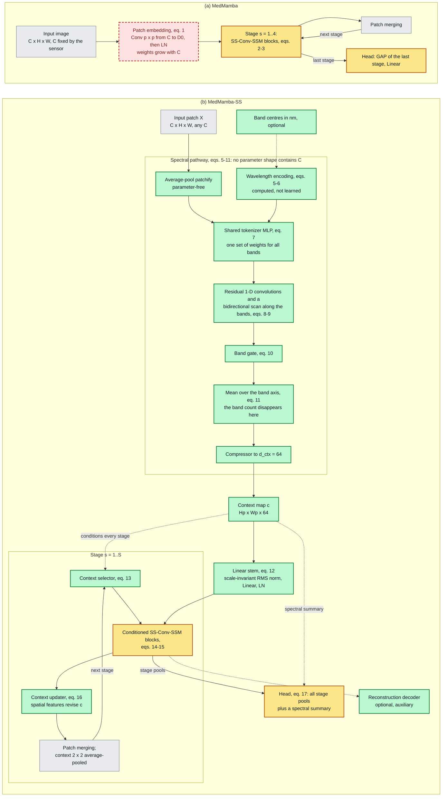
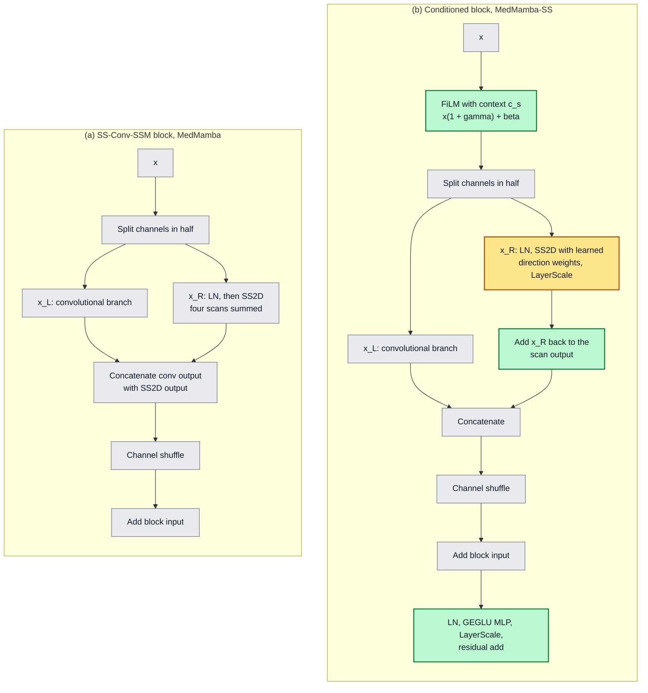
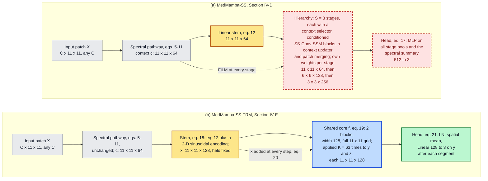
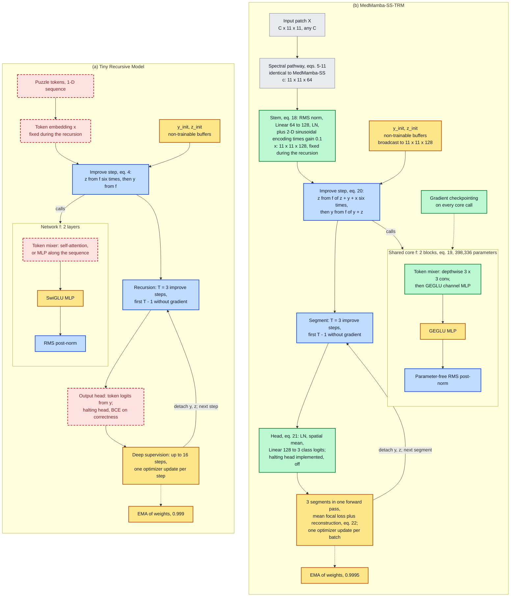

## IV. Methodology

An input patch is $X \in \mathbb{R}^{C \times H \times W}$ with $C$ bands, optionally with band centres $\lambda \in \mathbb{R}^{C}$ in nanometres; the batch dimension is omitted. Both proposed models share one front end, the spectral pathway of Section IV-C, which maps $X$ to a context map $c \in \mathbb{R}^{H_p \times W_p \times d_{\text{ctx}}}$ whose shape contains no reference to $C$. The two base architectures are written out first (Sections IV-A and IV-B) so that every change can be stated against them. Both extensions then follow one rule: substitute exactly one component of the model they start from, keep everything else, and list every change component by component, with its reason. MedMamba-SS is drawn beside MedMamba (Figs. {{F:ss}} and {{F:block}}, Section IV-D), and MedMamba-SS-TRM beside MedMamba-SS and beside TRM (Figs. {{F:sstrm}} and {{F:trm}}, Section IV-E); Section IV-E closes with the tensor shapes through both models, and Section IV-F with the cost model that the recursive substitution requires. All architecture diagrams use one colour code: grey for components inherited unchanged, amber for inherited and modified, green for new, blue for taken from TRM as published, and red dashed outlines for components the extension removes or replaces.

### A. Base Architecture I: MedMamba

MedMamba [@medmamba] embeds the input with a strided convolution of kernel and stride $p$ followed by layer normalization,

$$E = \mathrm{LN}\!\left(W_e \ast_p X + b_e\right) \in \mathbb{R}^{\frac{H}{p} \times \frac{W}{p} \times D_0}, \qquad W_e \in \mathbb{R}^{D_0 \times C \times p \times p}, \tag{1}$$

so the embedding holds $p^2 C D_0 + 3 D_0$ parameters, linear in $C$. Four stages follow, separated by patch merging, which halves resolution and doubles width (MedMamba-T: widths 96, 192, 384, 768; depths 2, 2, 4, 2). An SS-Conv-SSM block with input $x$ computes

$$[x_L, x_R] = \mathrm{Split}(x), \quad u = \Phi(x_L), \quad q = \mathrm{DropPath}\big(\mathrm{SS2D}(\mathrm{LN}(x_R))\big), \tag{2}$$

$$x \leftarrow \mathrm{Shuffle}_2\big([u \,;\, q]\big) + x, \tag{3}$$

where $\mathrm{Split}$ halves the channels, $\Phi$ is a convolutional branch (two 3 × 3 and one 1 × 1 convolution with batch normalization and ReLU), SS2D is the selective scan of [@vmamba], which runs four directional scans over the feature map and sums them, and $\mathrm{Shuffle}_2$ interleaves the two groups. The classifier reads the final stage only: $\hat{y} = W_h\,\mathrm{GAP}(x^{(S)}) + b_h$. We build on MedMamba because its block already combines local texture, through $\Phi$, with long-range context, through SS2D at linear cost, and because it is established across medical modalities. Its one component that cannot serve a variable number of bands is the embedding (1).

### B. Base Architecture II: The Tiny Recursive Model

TRM [@trm] applies one two-layer network $f$ to a latent state $z$ and an answer state $y$, given an embedded input $x$. One improvement step is

$$z \leftarrow f(x, y, z) \;\; (n \text{ times}), \qquad y \leftarrow f(y, z). \tag{4}$$

Each layer of $f$ is a token mixer (self-attention, or for small fixed-size grids an MLP applied along the sequence) and a SwiGLU feed-forward layer [@glu], each residual branch followed by RMS normalization [@rmsnorm]; the states start from fixed, non-trainable buffers. A recursion runs $T$ improvement steps, the first $T-1$ without gradient tracking, so activation memory does not grow with $T$; with $n = 6$ and $T = 3$ the effective depth is $T(n+1) \times 2 = 42$ layers. Training uses deep supervision: each of up to $N_{\text{sup}} = 16$ supervision steps runs one recursion, computes a loss, takes an optimizer step and passes the detached states to the next step. A halting head trained with binary cross-entropy against "the current answer is correct" allows early stopping, and an exponential moving average (EMA) of the weights with decay 0.999 is used for evaluation. We take from TRM the principle that effective depth can come from reapplying a small network instead of stacking distinct layers, which promises depth without a matching growth in stored parameters, an attractive property for small hyperspectral cohorts.

### C. The Band-Count-Agnostic Spectral Pathway

The pathway maps each local spectrum to a context vector. Every operation either shares its weights across the band axis or has none.

**Patchification** is parameter-free average pooling: $\bar{X} = \mathrm{AvgPool}_p(X)$, and $v \in \mathbb{R}^C$ denotes the spectrum at one position.

**Spectral position.** Band centres are normalized to the unit interval by the extent of the bands present (normalizing by a fixed reference range is implemented but not used in our experiments), and a sinusoidal basis is evaluated on the result:

$$\tilde{\lambda}_c = \frac{\lambda_c - \min_{c'} \lambda_{c'}}{\max_{c'} \lambda_{c'} - \min_{c'} \lambda_{c'}}, \tag{5}$$

$$\pi_c[2i] = \sin(\eta \tilde{\lambda}_c \omega_i), \quad \pi_c[2i+1] = \cos(\eta \tilde{\lambda}_c \omega_i), \quad \omega_i = 10000^{-2i/d_t}, \quad \eta = C. \tag{6}$$

Without band centres, $\tilde{\lambda}_c = c/(C-1)$, which gives an index encoding; with $\eta = C$, the wavelength encoding equals this index encoding for evenly spaced bands and departs from it where spacing is irregular, as at the 219 nm gap in our selected bands (Section III-A). Because both the normalization (5) and the scale $\eta$ depend on the bands present, the same wavelength receives a different code when bands are removed; Section VI-C returns to this.

**Tokenization.** One two-layer MLP, shared by all bands, lifts each band value together with its encoding to a token of width $d_t$:

$$t_c = W_2\, \mathrm{GELU}\big(W_1 [v_c \,;\, \pi_c] + b_1\big) + b_2 + g_s \pi_c, \qquad W_1 \in \mathbb{R}^{2d_t \times (1+d_t)},\; W_2 \in \mathbb{R}^{d_t \times 2d_t}. \tag{7}$$

A linear map $v_c \mapsto v_c w$ would also be shape-independent, but at the tokenizer output the band values would then occupy a single direction, a multiple of $w$, and the spectral encoder would have to recover every interaction between bands from that one-dimensional code; the nonlinearity gives each band its own response direction.

**Spectral encoding.** Tokens $\mathcal{T} \in \mathbb{R}^{C \times d_t}$ pass through residual one-dimensional convolution blocks along the band axis and, after the first block, a bidirectional selective scan [@mamba] along the bands:

$$\mathcal{T} \leftarrow \mathcal{T} + W_r\, \mathrm{GELU}\big(\mathrm{Conv1d}_3(\mathrm{LN}(\mathcal{T}))\big), \tag{8}$$

$$[U \,;\, Z] = \mathrm{LN}(\mathcal{T}) W_{\text{in}}, \quad \mathcal{T} \leftarrow \mathcal{T} + \Big(\mathrm{LN}\big(\alpha_1 \mathrm{SSM}(U) + \alpha_2 \mathrm{Flip}(\mathrm{SSM}(\mathrm{Flip}(U)))\big) \odot \mathrm{SiLU}(Z)\Big) W_{\text{out}}, \tag{9}$$

with $\alpha = \mathrm{softmax}(a)$. The scan (9) has the gated form of MedMamba's SS2D, applied to the one axis MedMamba does not model; scanning the spectral sequence in both directions is also the principle of the BiSpectral Mamba module of [@crop_mamba]. Convolution kernels and scan parameters are shared along the sequence, so they cost the same whether the sequence has 3 bands or 32.

**Gating, pooling and compression.** A gate projected from each token weights the bands; the tokens are averaged over the band axis and compressed by three linear layers with GELU ($d_t \to 128 \to 64 \to d_{\text{ctx}}$):

$$a_c = \sigma\big(w_g^{\top} t_c + b_g\big), \quad t_c \leftarrow a_c t_c, \tag{10}$$

$$c_{ij} = \Psi\Big(\tfrac{1}{C}\textstyle\sum_{c} t_c\Big) \in \mathbb{R}^{d_{\text{ctx}}}. \tag{11}$$

The mean in (11) is where the band axis disappears. We use $d_t = 32$ and $d_{\text{ctx}} = 64$.

> **Proposition 1.** *Every parameter tensor in (5)–(11) has a shape determined by $d_t$, $d_{\text{ctx}}$, the kernel width, the scan state size and the compressor widths, and not by $C$; every module after (11) receives inputs whose shape does not contain $C$. Any model built on the pathway whose later modules also produce outputs without $C$ in their shape, such as the classification path of both proposed models, therefore has the same parameter count at every band count.*

*Proof.* (5) and (6) have no parameters. The MLP of (7) is applied to each band with shared weights of shapes $2d_t \times (1 + d_t)$ and $d_t \times 2d_t$. The kernel of (8) has shape $d_t \times d_t \times 3$ and slides along the bands; the scan of (9) shares its parameters along the sequence. The gate of (10) is a $1 \times d_t$ projection applied to every band. The mean in (11) has no parameters and removes the band axis. A later module whose output has one channel per band, such as the optional reconstruction decoder of Section IV-E, does depend on $C$ and falls outside the statement. $\blacksquare$

Table {{T:pathway}} gives the count. For contrast, MedMamba's embedding (1) at $p = 4$ and $D_0 = 96$ holds $1{,}536C + 288$ parameters: 4,896 at $C = 3$ and 49,440 at $C = 32$.

**TABLE {{T:pathway}}**
**Parameters of the Spectral Pathway ($d_t = 32$, $d_{\text{ctx}} = 64$)**

| Component | Eq. | As a function of width | Count |
| --- | --- | --- | ---: |
| Tokenizer | (7) | $4d_t^2 + 5d_t + 1$ | 4,257 |
| Spectral encoder (three blocks, one scan, norms) | (8)–(9) | depends on $d_t$, kernel, state size | 17,794 |
| Band gate | (10) | $d_t + 1$ | 33 |
| Compressor | (11) | $128 d_t + 65 d_{\text{ctx}} + 8{,}384$ | 16,640 |
| **Total** | | **no term in $C$** | **38,724** |

### D. MedMamba-SS: The Spectral–Spatial Extension of MedMamba

MedMamba-SS keeps the MedMamba hierarchy and changes what enters it and how each stage sees the spectrum. Two design goals determine every change. The first is to remove $C$ from every parameter shape, which requires replacing the embedding (1), the only layer of MedMamba whose weights depend on $C$. The second is to let the spectrum inform spatial processing at every scale rather than only at the input, which requires a path from the context map into each stage and, in the other direction, from each stage's spatial features back into the context. Fig. {{F:ss}} places MedMamba and MedMamba-SS side by side.



*Fig. {{F:ss}}. (a) MedMamba [@medmamba] and (b) MedMamba-SS. The convolutional patch embedding (red, dashed), whose weights grow with $C$, is replaced by the spectral pathway and a linear stem; the blocks and the head (amber) are modified; the selector, updater and decoder (green) are new; the input and patch merging (grey) are unchanged. Dashed arrows carry conditioning rather than features.*

**Stem.** The convolutional embedding (1) is removed; the first stage receives a linear projection of the context map,

$$F^{(1)} = \mathrm{LN}\big(W_s\, \rho(c) + b_s\big), \qquad \rho(c) = c / \mathrm{RMS}(c), \tag{12}$$

where $\rho$ is a parameter-free, scale-invariant RMS normalization. Normalizing by the RMS itself, with no $\epsilon$ added to the mean square (only a floor against division by zero), keeps the stem responsive when the context map is small in magnitude (Supplementary Section S-B).

**Per-stage conditioning.** At stage $s$ the context map, resized to the stage resolution, is re-weighted by a squeeze-and-excitation gate [@se] and modulates every block through FiLM [@film], initialized to the identity so that each conditioned block starts as the inherited one:

$$c_s \leftarrow c_s \odot \sigma\big(W_{b,2}\,\mathrm{GELU}(W_{b,1}\,\mathrm{GAP}(c_s))\big), \tag{13}$$

$$\tilde{x} = x \odot (1 + \gamma) + \beta, \qquad [\gamma \,;\, \beta] = W_f c_s + b_f, \quad W_f = 0,\ b_f = 0 \text{ at initialization}. \tag{14}$$

**Conditioned block.** The block keeps MedMamba's channel split, convolutional branch, channel shuffle and outer residual, and changes three things (Fig. {{F:block}}): it adds the scan half back to its scan output, it scales both residual branches with LayerScale [@layerscale] ($\mathrm{LS}$, initialized at $10^{-4}$), and it ends with a GEGLU feed-forward sublayer $G$ [@glu]:

$$[x_L, x_R] = \mathrm{Split}(\tilde{x}),\;\; q = \mathrm{LS}(\mathrm{SS2D}(\mathrm{LN}(x_R))),\;\; x \leftarrow \mathrm{Shuffle}_2\big([\Phi(x_L) \,;\, x_R + q]\big) + x,\;\; x \leftarrow x + \mathrm{LS}(G(\mathrm{LN}(x))). \tag{15}$$

With LayerScale near zero at initialization, the scan half passes $x_R$ through instead of a near-zero scan output. SS2D itself combines its four directional scans with learned softmax weights, initialized uniform, instead of MedMamba's fixed sum; because a layer normalization follows the combination, the two coincide at initialization. The GEGLU sublayer adds a feed-forward layer over all channels at once; the SS-Conv-SSM block mixes channels only within each half, through the 1 × 1 convolution of $\Phi$ and the projections of SS2D, and across the halves through the shuffle.

**Context update.** After the stage's blocks the spatial features revise the context for the next stage, making the interaction bidirectional:

$$c_s \leftarrow \mathrm{LN}\big(c_s + \sigma(W_g c_s) \odot W_u F^{(s)}\big). \tag{16}$$

**Head.** The classifier reads every stage and a spectral summary:

$$\hat{y} = \mathrm{MLP}\Big(\mathrm{LN}\big[\mathrm{GAP}(F^{(1)}) ; \ldots ; \mathrm{GAP}(F^{(S)}) ; \mathrm{GAP}(c_S)\big]\Big). \tag{17}$$

**Configurations.** For 11 × 11 hyperspectral patches MedMamba-SS uses $p = 1$ and three stages of widths 64, 128 and 256 with two blocks each (2,773,007 parameters, three classes). For 224 × 224 RGB photographs it uses MedMamba-T's four-stage layout (widths 96, 192, 384, 768; depths 2, 2, 4, 2) with $p = 8$ (27,425,314 parameters, six classes). A *full-channel* variant, used as a second hierarchical configuration in Section VI-D, removes the channel split of the SS-Conv-SSM block: the SS2D and convolutional branches both see all channels, and their outputs are combined by learned gating instead of concatenation and channel shuffle (3,513,451 parameters on 11 × 11 patches).



*Fig. {{F:block}}. (a) MedMamba's SS-Conv-SSM block, eqs. (2)–(3). (b) The conditioned block of MedMamba-SS, eqs. (14)–(15). The split, convolutional branch, concatenation, shuffle and outer residual are unchanged.*

Table {{T:mmchanges}} summarizes the extension. The only component of MedMamba that is removed is the one that ties it to the sensor; everything MedMamba uses to model space is kept, and everything added either reads the spectrum or carries it into the hierarchy.

**TABLE {{T:mmchanges}}**
**Changes from MedMamba to MedMamba-SS**

| Component | MedMamba [@medmamba] | MedMamba-SS | Change | Purpose |
| --- | --- | --- | --- | --- |
| Patch embedding | Strided $p \times p$ convolution, (1); $1{,}536C + 288$ parameters at $p = 4$ | Average-pool patchify, spectral pathway (5)–(11), linear stem (12) | Replaced | Remove $C$ from every parameter shape; read band order and wavelength |
| Stage input | Previous stage only | Context selector (13) and FiLM (14), identity at initialization | Added | Condition every scale on the spectrum |
| Split, conv branch $\Phi$, shuffle, outer residual | (2)–(3) | Same | Unchanged | — |
| Scan branch | SS2D, four scans summed | SS2D with learned direction weights, LayerScale, $x_R$ added back (15) | Modified | Residual branch starts near zero; identity path for the scan half; learnable weighting of scan directions |
| Feed-forward sublayer | None | GEGLU with LayerScale (15) | Added | Feed-forward mixing over all channels |
| Context update | None | Gated update from spatial features (16) | Added | Spatial-to-spectral feedback between stages |
| Patch merging | Halve resolution, double width | Same; context 2 × 2 average-pooled alongside | Unchanged | — |
| Head | GAP of the last stage, linear | MLP on all stage pools and the spectral summary (17) | Modified | Expose every scale and the spectrum to the classifier |
| Reconstruction decoder | None | Optional, $C$ output channels | Added | Auxiliary spectral objective; the only band-dependent module, excluded from all parameter and arithmetic counts |

### E. MedMamba-SS-TRM: The Recursive Extension

MedMamba-SS-TRM is the second substitution. It keeps the spectral pathway and the task interface of MedMamba-SS and replaces the hierarchy, the stages of distinct conditioned blocks with patch merging between them, by one core of width $d = 128$ that is applied many times. Depth then comes from 63 applications of one 398,336-parameter core instead of from stages that each hold their own weights. The recursive backbone returns the same outputs as the hierarchical one, so the training loop, the loss and the reconstruction decoder attach without change; we call this output signature the *task interface*. The classification head itself is replaced (Table {{T:sschanges}}). One configuration serves 3 × 11 × 11 and 32 × 11 × 11 input. Fig. {{F:sstrm}} shows the substitution against MedMamba-SS, and Table {{T:sschanges}} lists it component by component.



*Fig. {{F:sstrm}}. (a) MedMamba-SS and (b) MedMamba-SS-TRM. In (a), colours give each component's fate in (b): grey, kept unchanged; amber, kept with modifications; red dashed, removed or replaced. In (b), the recursive core (blue) takes TRM's schedule, which Fig. {{F:trm}} details, and the head (green) is new. Shapes are per 11 × 11 hyperspectral patch, batch omitted. Dashed arrows carry conditioning rather than features.*

**TABLE {{T:sschanges}}**
**Changes from MedMamba-SS to MedMamba-SS-TRM (11 × 11 Hyperspectral Patches)**

| Component | MedMamba-SS | MedMamba-SS-TRM | Change | Purpose |
| --- | --- | --- | --- | --- |
| Spectral pathway | (5)–(11) | Same | Unchanged | Keeps Proposition 1 |
| Stem | Scale-invariant RMS normalization, linear, LN (12) | Same, plus a fixed 2-D sinusoidal encoding with learnable gain (18) | Modified | Absolute position for the recursive states |
| Backbone | Three stages of distinct conditioned blocks, widths 64–256, patch merging between stages (13)–(16) | One two-block core of width 128 applied $K = 63$ times at the full 11 × 11 resolution (19)–(20) | Replaced | Depth from reuse instead of storage |
| Spatial mixing | SS2D and convolutional branch in every block (15) | Depthwise 3 × 3 convolution with a GEGLU channel MLP (19); SS2D implemented as an alternative | Replaced | SS2D mixer 39× slower inside the recursion (Section V-C) |
| Spectral conditioning | Context selector and FiLM at every stage, context updater between stages (13), (14), (16) | Context enters once, through the stem; its embedding $x$ is added at every improvement step (20) | Replaced | TRM's input injection |
| Head | MLP on all stage pools and the spectral summary (17) | LN, spatial mean and linear map on the answer state after every segment (21) | Replaced | Deep supervision reads every segment |
| Objective | Focal loss on one set of logits; optional reconstruction | Focal loss averaged over three segments, plus reconstruction (22) | Modified | Deep supervision |
| Parameters / arithmetic | 2,773,007 / 0.278 GFLOPs | 446,409 / 6.203 GFLOPs | 6.2× fewer / 22.3× more | Section VI-E |

**What MedMamba-SS-TRM keeps from MedMamba.** The recursive substitution removes every SS-Conv-SSM block. In the reported configuration the core's spatial mixer is a depthwise convolution rather than SS2D, because an SS2D mixer without a fused scan kernel is 39× slower inside the recursion (Section V-C); the SS2D mixer is implemented and would make the core a spatial state-space model again. MedMamba-SS-TRM therefore descends from MedMamba through MedMamba-SS. It keeps the spectral pathway that replaced MedMamba's embedding, including the bidirectional selective scan (9), which has the gated form of MedMamba's SS2D applied along the bands, and it keeps the task interface of MedMamba-SS. Its selective state-space computation runs along the spectral axis, and its spatial computation is convolutional: everything outside the core, including the spectral scan, accounts for 0.173 of its 6.203 GFLOPs (2.8 %). We keep the name because it records this lineage, through MedMamba-SS, and not a spatial state-space backbone, which the reported configuration does not have.

The recursion itself is taken from TRM, and Fig. {{F:trm}} places TRM and MedMamba-SS-TRM side by side.



*Fig. {{F:trm}}. (a) TRM [@trm] as published and (b) MedMamba-SS-TRM. In (a), colours give each component's fate in (b): blue, used as published; amber, used with modifications; red dashed, replaced. In (b), grey components come from MedMamba-SS, blue from TRM as published, amber from TRM with modifications, and green are new. Shapes are per 11 × 11 patch, batch omitted.*

**Stem and states.** The context map is normalized as in (12), projected to width $d$, normalized, and given a fixed two-dimensional sinusoidal encoding $P$ scaled by a learnable gain $g_p$ (initialized at 0.1):

$$x = \mathrm{LN}\big(W_s\, \rho(c) + b_s\big) + g_p P. \tag{18}$$

The embedding $x$ is computed once and held fixed through the recursion. The answer state $y$ and latent state $z$ start from broadcast non-trainable buffers, as in TRM.

**Core.** The core $f = B_2 \circ B_1$ has two blocks, each a token mixer and a GEGLU MLP under parameter-free RMS post-normalization [@rmsnorm]:

$$h' = \mathrm{RMS}\big(h + M(h)\big), \quad B(h) = \mathrm{RMS}\big(h' + G(h')\big), \quad M(h) = G_m\big(\mathrm{DWConv}_{3\times3}(h)\big). \tag{19}$$

The mixer $M$ is a depthwise 3 × 3 convolution followed by a channel MLP. It replaces TRM's sequence mixer because the state is a two-dimensional grid rather than a token sequence; SS2D and self-attention are implemented alternatives, and the SS2D mixer is 39× slower at this working size (Section V-C).

**Recursion and head.** The improvement step instantiates (4) with additive input injection, as in TRM, and the classifier reads the answer state after every segment:

$$z \leftarrow f(z + y + x)\ \ (n \text{ times}), \qquad y \leftarrow f(y + z), \tag{20}$$

$$\ell_j = W_c\, \mathrm{GAP}\big(\mathrm{LN}(y^{(j)})\big) + b_c, \qquad j = 1, \ldots, N_{\text{sup}}. \tag{21}$$

**Objective.** All $N_{\text{sup}} = 3$ segments run inside one forward pass; the per-segment losses are averaged and added to a reconstruction loss, and one optimizer update is taken per batch:

$$\mathcal{L} = \frac{1}{N_{\text{sup}}} \sum_{j=1}^{N_{\text{sup}}} \mathcal{L}_{\text{FL}}(\ell_j, k) + \lambda_{\text{mse}}\, \mathrm{MSE}(\hat{X}, X) + \lambda_{\text{sam}}\, \mathrm{SAM}(\hat{X}, X), \tag{22}$$

where $k$ is the label, $\mathcal{L}_{\text{FL}}$ is the class-weighted focal loss of Section V-A, $\hat{X}$ is the output of a three-layer convolutional decoder reading the final answer state, MSE is the mean squared error over all elements, SAM is the spectral angle (28) averaged over pixels, and $\lambda_{\text{mse}} = \lambda_{\text{sam}} = 0.1$. Validation and testing use an EMA of the weights (decay 0.9995), and every gradient-carrying core call is gradient-checkpointed [@checkpoint]. Algorithm 1 gives the schedule; with $n = 6$, $T = 3$ and $N_{\text{sup}} = 3$ the core is applied $K = N_{\text{sup}} T (n+1) = 63$ times per forward pass, at inference as well as in training.

> **Algorithm 1: MedMamba-SS-TRM forward pass**
>
> ```
> c    <- SpectralPathway(X, lambda)              # eqs. 5-11
> x    <- Stem(c)                                 # eq. 18, held fixed
> y, z <- y_init, z_init                          # buffers
> for j <- 1 to N_sup = 3:
>     repeat T - 1 = 2 times, without gradient:
>         (y, z) <- Improve(x, y, z)
>     (y, z) <- Improve(x, y, z)                  # carries gradient
>     l_j <- Head(y)                              # eq. 21
>     y, z <- detach(y), detach(z)
> return l_1 ... l_N_sup                          # inference uses l_N_sup
>
> Improve(x, y, z):  repeat n = 6 times: z <- f(z + y + x);  y <- f(y + z)
> ```

Table {{T:trmparams}} gives the parameter count. The shared core holds 89.2 % of the parameters, and none of them depends on $K$ or on $C$.

**TABLE {{T:trmparams}}**
**Parameters of MedMamba-SS-TRM ($d = 128$, $L = 2$ Core Blocks, Three Classes)**

| Component | Eq. | As a function of width | Count | Share |
| --- | --- | --- | ---: | ---: |
| Spectral pathway | (5)–(11) | Table {{T:pathway}} | 38,724 | 8.7 % |
| Stem and positional gain | (18) | $d_{\text{ctx}} d + 3d + 1$ | 8,577 | 1.9 % |
| Shared core | (19) | $L(12d^2 + 20d)$ | 398,336 | 89.2 % |
| Classifier and halting head | (21) | $2d + (d+1)(K_{\text{cls}} + 1)$ | 772 | 0.2 % |
| **Total** | | **no term in $C$** | **446,409** | |

Table {{T:trmchanges}} lists every difference from TRM. There, "as published" refers to the algorithm as specified in [@trm]; the recursion was implemented for two-dimensional feature maps inside our model. The two-state recursion, the improvement step with additive input injection, the gradient-free prelude, the detach between segments and the RMS post-normalization are used as published; the state buffers are rescaled and the EMA decay is retuned; and the per-segment effective depth (42 block applications) equals TRM's. The changes fall into three groups. The input, mixer, head and loss are replaced because the task is the classification of a two-dimensional spectral context map rather than the completion of a token sequence. Deep supervision is moved inside one forward pass, with one optimizer update per batch, so that a standard per-batch training loop, with its gradient clipping, mixed precision and validity gates, applies unchanged. And halting is disabled, because the halting head does not learn on this task (Supplementary Section S-B).

**TABLE {{T:trmchanges}}**
**Changes from TRM to MedMamba-SS-TRM**

| Element | TRM [@trm] | MedMamba-SS-TRM | Change | Reason |
| --- | --- | --- | --- | --- |
| Input embedding | Token embedding of a 1-D sequence | Spectral pathway, stem and 2-D sinusoidal encoding with learnable gain (18) | Replaced | The input is a spectral image patch |
| States $y$, $z$ | Two states from fixed buffers, s.d. 1 | Same, s.d. 0.02 | Rescaled | Empirical choice |
| Improvement step | $z \leftarrow f(x+y+z)$ $n$ times, $y \leftarrow f(y+z)$ | Same (20), $n = 6$ | As published | — |
| Recursion | $T = 3$, first $T-1$ steps without gradient | Same | As published | — |
| Network depth | 2 layers | 2 blocks | As published | — |
| Token mixer | Self-attention, or an MLP along the sequence | Depthwise 3 × 3 convolution with a GEGLU channel MLP (19) | Replaced | Two-dimensional grid; SS2D mixer 39× slower |
| Feed-forward | SwiGLU | GEGLU | Modified | Same gated form as the MedMamba-SS sublayer |
| Normalization | RMS post-normalization | Same, parameter-free | As published | — |
| Width | 512 | 128 | Retuned | Empirical choice; gives 0.45 M parameters in total |
| Deep supervision | Up to 16 steps, one optimizer update each | 3 segments in one forward pass, losses averaged, one update per batch (22) | Adapted | Standard per-batch training loop applies unchanged |
| Halting | Head trained with binary cross-entropy against correctness | Implemented, disabled | Not used | Halting head does not learn (Supplementary Section S-B) |
| Output head | Token logits | Layer norm, spatial mean, linear class logits (21) | Replaced | Classification |
| Loss | Token cross-entropy | Class-weighted focal loss plus reconstruction (22) | Replaced | 13 : 1 class imbalance; auxiliary spectral objective |
| EMA decay | 0.999 | 0.9995 | Retuned | — |
| Gradient checkpointing | Not used | Every gradient-carrying core call | Added | Three segments' graphs do not otherwise fit in 16 GB |

**Tensor shapes.** Table {{T:shapes}} traces one 11 × 11 hyperspectral patch through both proposed models. The two share every shape up to the context map, where the band axis has already been removed. After it they differ in the one component that MedMamba-SS-TRM replaces: MedMamba-SS narrows the grid and widens the features stage by stage, as MedMamba does, whereas MedMamba-SS-TRM keeps the full 11 × 11 grid at one width for all 63 core applications, which is why its arithmetic is higher (Section IV-F).

**TABLE {{T:shapes}}**
**Tensor Shapes Through the Two Proposed Models for One 11 × 11 Patch with $C$ Bands (Batch Omitted)**

| Step | Eq. | MedMamba-SS | MedMamba-SS-TRM |
| --- | --- | --- | --- |
| Input patch $X$ | — | $C \times 11 \times 11$ | $C \times 11 \times 11$ |
| Patchify, $p = 1$ | — | 121 spectra of length $C$ | 121 spectra of length $C$ |
| Tokenizer and spectral encoder | (7)–(9) | $121 \times C \times 32$ | $121 \times C \times 32$ |
| Band gate and mean over bands | (10)–(11) | $121 \times 32$; $C$ removed | $121 \times 32$; $C$ removed |
| Compressor: context map $c$ | (11) | $11 \times 11 \times 64$ | $11 \times 11 \times 64$ |
| Stem | (12), (18) | $F^{(1)}$: $11 \times 11 \times 64$ | $x$: $11 \times 11 \times 128$ |
| Backbone | (13)–(16), (19)–(20) | Stage 1 at $11 \times 11 \times 64$; patch merging (odd sides zero-padded) to $6 \times 6 \times 128$ for stage 2 and $3 \times 3 \times 256$ for stage 3 | $y$ and $z$ at $11 \times 11 \times 128$ through all 63 core applications |
| Head input | (17), (21) | $64 + 128 + 256 + 64 = 512$ (three stage pools and the spectral summary) | 128 (spatial mean of the normalized answer state), once per segment |
| Output | (17), (21) | 3 class logits | 3 class logits per segment; the last segment's at inference |
| Reconstruction (optional) | (22) | $C \times 11 \times 11$ | $C \times 11 \times 11$, from the final answer state |

### F. Cost Model

Weight sharing decouples parameters from arithmetic. The core's parameters, $L(12d^2 + 20d)$, do not depend on $K$; its arithmetic grows linearly:

$$\mathcal{F}(K) = \mathcal{F}_0 + K \mathcal{F}_f, \qquad \mathcal{F}_f = 2 N_{\text{tok}} L \big(12 d^2 + 9 d\big), \tag{23}$$

where $12d^2$ counts the multiply–accumulates per token of the two GEGLU MLPs in a block, $9d$ the depthwise convolution, and $N_{\text{tok}} = H_p W_p$. For 11 × 11 patches, $L = 2$ and $d = 128$, (23) gives $\mathcal{F}_f = 95.72$ MFLOPs per application, so the 63 applications alone cost 6.03 GFLOPs. Measured arithmetic in this paper counts the multiply–accumulates of every convolution and linear layer with forward hooks, doubled to FLOPs, plus an analytic estimate for the selective scans; it excludes normalization, activation and element-wise operations, and it excludes the reconstruction decoder (0.031 GFLOPs at 32 bands). Because (23) and this measurement count the same operations, their agreement (Section VI-E) is a check of consistency, not an independent validation, and neither says anything about latency. On that basis the whole hierarchical MedMamba-SS costs 0.278 GFLOPs on the same input. A hierarchy reduces its token count at every stage; the recursive core never does, so every one of its applications pays for the full 121-token grid.

---

